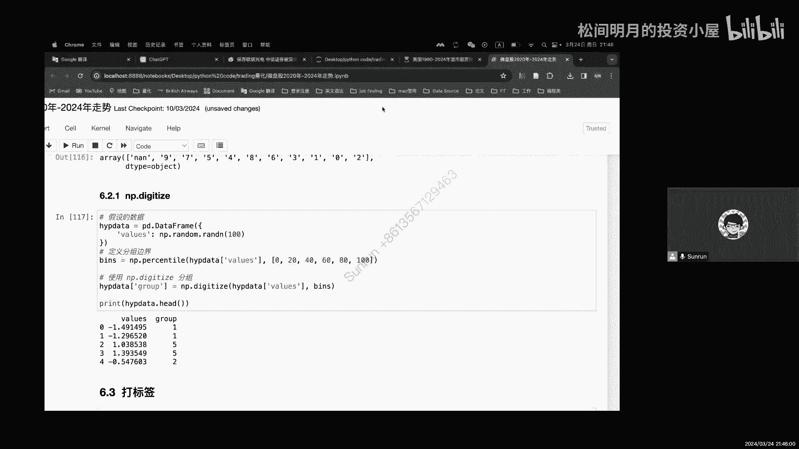

# 松哥量化正式课程1-1-2 Project 1 代码详解.mp4 - P1 - 松间明月的投资小屋 - BV1CJ4m177AC

哈喽大家好，这里是你们的松哥，对不起，又拖了啊，上节课我们是讲到了，把这个取数据对吧，然后我们用了两个一个比较简短的历史的，只学了两个股票的数据，然后把它们都拼接在同一个这个额数据框里面。

that frame里面，那么这节课呢我们就开始继续，因为这个如果要取这个微盘股的数据，总共有402条嘛，在他这个盘里面总共有402条，其实蛮多的对吧，所以呢我不打算就是在这里的展示。

那剩下这些就是怎么样把这个取出来，取出来以后，最终呢就得到了这么一个数据，这个数据呢我已经把它存好了，我们就直接从这个地方把它读进来，读进来以后就可以进行使用了，那么现在就已经有了微盘股的这么一个数据。

我们可以看到微盘股这个数据呢，它data frame已经被我们取好了，虽然稍微有点大，但是也基本上能展现出来，然后我刚才46行呢，其实是读了一个微盘股，它有一个叫TRADATE，就是日期对吧。

然后日期的变量给它进行了一个这个i local1，然后呢去探查一下它的一个type，它的类型是什么，这个类型，当然我们可能看不出来，读起来还挺慢的是吧，给他加个head吧啊。

可以看到这里面其实就是对不同的股票啊，它分别有一个这么一个数据的建立，但是呢这个读进来，你会发现他们的这个什么有点问题对吧，这个on name0有这么一列，所以这列等会可能要拿掉啊。

不管我们先继续往后做，下面呢就是嗯既然把微盘股的数据都读进来了，我们下面要做什么呢，就是因为我们本来就是想做一个关于微盘股的，如果我们把它做成一个投资组合，看看他过去的一段时间。

从2020年到2024年，他的整个走势是怎么样的对吧，所以呢也基本上呢我们就完成了这么一件事情，那么这个呢就是可以看到在过去的4年里面，我们后面用一个图像来把它识别出来。

在过去的4年里面它的一个走势情况，那我们今天就把剩下的代码呢讲完，那这里呢构建投资组合的时候，我们策略展示其实是比较简单的，我没有做得太复杂了，嗯首先我是假设每一个股票，我们都是等权重的去买它啊。

比如说我总共有10万块钱，然后我有42只股票，那我就分别按照10万块钱除以42，每一只就是大概差不多能分个几千块，2000多块钱对吧，当时我就觉得小了，然后我就这样一个等权重给大家，权重是一比一比一的。

这种情况去设置我们这个策略，当然这个在现实中可能不合适，但是呢他至少可以看到吧，可以看到这种平均的走势是什么样的，那么我们既然读进了微盘股这个东西，它首先它是一个data frame。

data frame的主要的性质的，比如说high tail可以看前五个和后五个，因为你们刚刚也看到了40多万条数据吧，所以说确实读起来也并不快啊，还有一个info这种可以直接去看，有47万条。

那么我这个reset index是什么意思呢，就是这个reset index执行以后，整个微盘股的数据呢，它会重置它的索引，那么这个索引被重置以后呢，你会看到这个他被我重置了好多次了啊。

因为我刚才又执行了一次，我们重新读一遍，他就只有一个索引了，先读一遍，然后呢再看一下现在长什么样子，你会发现它其实读进来的时候只有一个UNNEL，这个是由于本来我把数据取好的时候，是没有这一列的。

但是你把它读到excel或者CSV里面，它会自动给你添加一列索引，然后再读进来的时候，这边索引就变成一列了啊，所以呢我想把这些去掉也可以，那我就直接给他in reset，reset以后呢。

就变成又多了一列对吧，这一列叫index，那这个没有列明的才是index啊，这个index是在之前的，当然我这不重置也行，那么重置这里面有一部呢就是这个in place，in place等于true的。

意思是说当impress等于true的时候，它会默认你这个修改，就直接改到微盘股的这个这个DF里面，如果说你的in place等于force，那么他只是给你做个展示。

但他并没有对微盘股这个DNF进行修改，那么既然修改完以后，我明显知道前两列我是不想要的，所以这时候我用i local语句与定位i local呢，这是一个对df data frame。

非常重要的一个定位语句啊，当我选择i local，然后逗号分隔前面是行，后面是列的情况下，那么这个是表明所有行，后面是表示第二列到后面的所有列对吧，然后这样子写出一个head。

那么写出这个head以后呢，你可以看到这里的是从第二列开始，也就是从这里开始啊，那为什么第二类呢，因为对于我们的Python来说，它是从零开始数的，所以这个index是零，这个on name。

零是一这个t s code就是第二列啊，他选的是第二列对吧，看起来有点奇怪，第二列其实应该是ONEONE对吧，但是实际上它的这个索引的标识，就是这里的打二索引的标识展示的12，那你要打零的话。

那其实就是从第一个数字开始，但我这里不这么改，我们起一个，比如说你用i local啊去表示行列，一定要先打逗号，然后这里打个零，这就表明第零列，但如果你这个不敲呢，它会报错。

为什么他会认为你这里至少得告诉我，你要从多少行到多少行，那你打个冒号就是默认所有行，所以它就会给你展示出来，然后这个有点慢对吧，这个有点慢，那么我们head一下，给它加上head就没有那么卡了。

那你可以看到第零列，那就是第一个索引对吧，那你把它改成一呢，就是我们这里的1742，就是这个数字改成二，所以Python是从零开始数的，这个要知道，那么我们下面的是想干嘛呢。

下面我发现这个t k ticker，这个ticker他还是不带零的，为什么，这是从数据读进来的时候就长这个样子啊，为啥，这是因为excel，它自己会把头头前的两个零给你抹掉对吧，所以我还得加。

那我就对他这个直接去加，这里面用到了一个叫apply函数，apply函数，apply里面加的是函数名称，这个函数名称叫fl zero，就是填充零嗯，然后呢我这个是对哪一列进行修改呢。

我要告诉他是微盘股的ticker，然后调用用dot这个原点，调用它的属性，那么并且把它赋值给微盘股的ticker，所以这时候这个TK它就会被我改掉了，如果没有这句话的话呢，他没有这个赋值语句呢。

他会做一个展示啊，做一个展示，但这个展示呢它并不能够真正的存储进去，你这时候去看它的head，他这个tick还是002830，没有两个零，但是如果你在这里做了一个赋值，这是非常重要的，做完赋值以后呢。

他就默认了，就把这个数据给改变了，所以它就变成了002830，为什么这里还要说个ticker呢，是因为我这个t s code，其实这个CZ是我不想要的对吧，站起来站起来有点麻烦，我想把它去掉。

所以在这里面呢我就用了他tick这一列好，下面呢我们就开始算每只股票的一个收益率了，这个收益率的计算呢它有很多算法，那么其中呢在这个图示里面，他是已经给了一个叫p p c t change对吧。

我们简称叫person percentage change，其实就是百分比的变化了，当然如果你愿意自己算也不是不行，也可以啊也可以，好我刚刚生成了一个叫daily return，对不对。

你看这个daily return就跟他进行了这么一个展示啊，这个其实就是我这是我算的，这个PCT劝解是他算的，但你没发现他的劝解有个问题，就是这里有一个43。98，啥意思呢。

就是因为从你取数字的那一天开始，他之前的那个收益，我不知道图片是个什么逻辑，据我所据我所观察，我感觉他是个呵呵嗯，它是个什么，你知道吗，你可以看到前面这个change，其实是指昨天到今天的一个涨幅啊。

这是close收盘价对吧，呃诶他这收盘价怎么跟开盘价一样啊，这么吓人，昨天的收盘价是这个对吧，今天这是没动的，这12月14号不知道怎么回事，这四个数字都不一样，一天没涨没跌。

然后呢它相对于前一天的close，那今天的收盘价是不是涨了两块三毛八对吧，这个你能算出来，然后你会发现他之前的一个pro多少，等于16。53，因为我们时间就取到，2016年的12月13号。

你再往前去可能取不到了，所以呢在这里我们取16。53，你再加上7。27，你就会发现等于它的23。8，是因为我们在这样取数据的时候，总有一个起始值，所以他其实是之前的那个涨幅，他可能给他算到一起去了。

所以才会会有一个40%，3。98的这么一个涨幅，虽然有点离谱，但是处理数据的时候，你这一行就不能要了，否则就很奇怪对吧，但是你看我们算的再return就是p CD change，也就是它的PCPCD。

劝你我们就没有这个问题啊，因为我前一天我这个算法是拿什么，是拿我的呃，gop by根据ticker去分组啊，这里面讲到一个函数，根据ticker去分组，那么根据这个提高分组以后呢。

相当于每一只股票算自己的，然后呢我的clothes，然后去算一个p c p c t change，这是一个函数啊，这是一个函数，这个函数呢是对于某一个series的一个属性。

因为close其实是一个series，就是收盘价这一列，然后去算的它的前一天和后一天的一个比率啊，就通过这样呢就能算出我的一个收益率是多少，那么其实就是拿23点嗯，拿这个26。18除以呃，减去23。

80，然后再除上23。8，所以你可以看到应该就是14%，26。18-23。8，然后除以223。8，这就是99。999%，所以约等于就是10%了，那天应该是个涨停的对吧。

那这种算法其实调用pc d change这个函数就行了，但是最早呢还没有PCPC确认这个函数的时候，我们可能会用一个就是shift one的这种方式去做啊，这个我也给你们展示一下。

比如说我现在有对他这个微盘股，我就刚在部分组的情况下，我直接看这个close呃，close这表明对某一列的调用，这个队列的调用我们前面应该提到过了，然后呢如果你在后面给他加一个，它有个参数叫shift。

好看到这个shift的参数吧，这个shift就是一个移动的参数，我们把它展示出来呃，sorry停一下啊，出来了，他这个shift的参数你可以看到它第一项是NA，第二项是23。80，你仔细看看，23。

80不就是我前一天的数字，所以这个shift的一是表明往后移一位，它非常像我们研究时间序列里面说的，那个YT和YT减一的关系对吧，所以呢这个shift one其实就有点YT减一的意思啊。

所以呢这个是比较好用的一种方式，那么你看我有23。80了，又有21。68，所以我拿这个close去除以我的shift one，这是不是就可以得到一个很新的数列，这个数列是相当于什么，相当于是我的百分比。

对不对，然后呢我再把它减一，不就是我的收益率吗，所以你会发现这样子相当于PCD劝解，所以PCCPCD劝解的本质，本质上就是做了这么一个，就是做了这么一个呃这么一个计算而已啊，也没有很复杂。

那么把它保存下来，它第一项也是零对吧，那么就可以完成这个PCD，但是现在有PCD这个函数了，你直接用就行了，确实也没有必要单独这么弄好，这是关于p c t change的一个展示啊，嗯那么下面一个呢。

就是我们要算每天的一个收益率啊，每天的一个收益率，那么这个收益率呢因为我是等权重嘛，所以这时候呢，我可能会要对这个收益率进行一个简单的计算，那么为此呢我们写了一个函数，这个函数呢看起来有点复杂。

我们先展示一下他到底在干什么啊，首先呢我是group group daily return，然后使用count的一个命令，来我们看，这个group呢在我这里定义的是什么呢。

是我们的一个其实是我要传入的一个参数了，那这个参数里面有个daily return，所以你可以看到它，其实我想设定的就是微盘股，这个data frame里面有个dei return。

然后呢对微盘股这个DET做一个count，其实就数它有多少个数据了，那么数它有多少个数据，就告诉我有效的值有多少对吧，那么如果这个will stock等于零的话，那我就返回一个NA是什么意思呢。

就是说我发现这个股票吧，它完全没有数据啊，我等于零，我就给它返回一个NA，那么我返回的是NPDNI值，如果这里面如果这个经受过这个检验以后呢，我就直接给他return什么呢。

就是return我的daily return，然后点summer，然后除上有效数字，你看这个其实在算什么，算我的一个什么权重的总和对吧，总和加起来等于多少，所以我就用这样一个方式去做一个基本的加减。

但我这个加减非常的粗暴啊，也不用跟我纠结这个呃我们后面会讲的更详细，因为这个这次只是做初始的嘛，他其实计算计算比这个复杂一些，然后我们来看后面的后面呢，我们既然这样做完一个函数以后。

我们就使用这个calculate这个函数啊，用apply函数把它应用起来，应用到我的什么呢，根据我的GOOGBYE来进行一个分类，这时候你肯定要问了，那你刚才不是有个group吗。

那个group只是一个名字，这个名字你改成别的也行啊，你改成什么贴S啊，这里也改成T都行，这个只是在我的函数里，它属于一个小的局部变量，它不是全局的，无论如何，我都还是能运行的。

那这时候我就算出了一个portfolio return，只不过这个portfolio return，它是按照日期来进行计算的，为什么按日期来进行计算，因为我的假设是在同一个日期。

我所有的这种微盘股都买了啊，我都买了，然后我呢我假设都买了同样的一个数额，那么我来算算他们的总收益加起来多少，所以不就是把他们每天的收益加起来，所以我就要按日期去给他计算，那么你会发现。

这个在实际计算中还是比较简单的对吧，所以我就得到了portfolio return，的一个新的这么一个组合啊，这就是pdfo return，你可以看到他按不同的日期给我加走啊，不同的日期给我加灯。

最早能追溯到96年的啊，当然后面数据可能不足，但是负的700%分之十，这是每天的一个数据，我们就算出来了，那么在这个算出来以后呢，我们把它拼接成一个data frame。

这是一个拼接data frame的语句，那么拼接完这个data frame呢，我们命令它数据就取我这个portfolio return，也就是我这里的数值，然后columns呢给它一列一列是什么呢。

Portfolio return，那么这时候就得到了portfolio d f，那么DF打开一看啊，就长这个样子，那这里面你肯定会好，很好奇我这个TRADATE怎么就没了。

是因为我们在做这个powerful to return的时候，你可以关注一下这个玩意，它生成以后它是个什么，它是个series，所以这个series它本身也是我们Python里面。

非常重要的一种数据类型，我们之前没有说过这个series呢，如果你仔细看它有index的属性，本身这些日期就是index，虽然你看到了在我们的展示中，你看到这些东西，但实际上它并不是我的列。

我对于photo return这样一个那个这样一个series而言，它唯一有的这个列的名字啊，他就只有什么呢，只有我们这里看到的耶，这个掉了也没怎么掉的哦，因为它不存在，对吧哦对问到了这两天有点绕。

他没有他没有，你会发现他没有这个属性，series没有这个属性，也没有列的属性，为什么，因为series就是一列，所以他没有单独这个名字的一个属性，所以我也没办法通过。

就是传统的这个columns这个属性，来进行一个调用，那根本就钓不着，无论我怎么调都不行，因为它默认就这么一列，所以呢他也不存在一个列名的问题啊，本身也没有列明，但是它有索引啊，它可能有值。

我估计啊他有value，它有values，那values就是后面这一列，但是它并没有一个详细的列名，所以这时候呢我们要给它命名的就是这个列名，在这里给它进行了一个赋值。

这个赋值我就要portfolio return，所以呢这时候DF你就看到它有列明了啊，DF呢此时呢是个data frame了啊，这个portfolio return呢它还是一个series。

所以这是有一个明显的差别的，那么这时候呢我们就可以看到他，就把我每天的这个记录给记录下来了对吧，这就是他的一个return，然后这个return我再通过什么呢，累计收益率去做进行一个计算。

那就是把每天的收益率加起来嘛对吧，然后做什么连乘对吧，所以说一加上每天的收益率，然后再把它连成连成是这个函数叫CUM的pd，COM的pro，它可以对它进行连成，那么连乘完以后再减一。

那么就得到了我data frame，一个叫累计收益率，所以我们可以看看累计收益率长什么样子，那第一列是我的收益率，第二个是累计收益率，第一期是一样的，第二期就是1-0。078517。

然后呢再乘上个1+3。2528，就等于这个一减去大概等于96%左右，应该就是这么算的，可以给你解释一下，0。01-0。0785，七一，然后再乘上一个括号，1+0。03258诶，他就等于95点几啊。

95点几，如果你用一减就得到了这个数据，0。485就这么来的，所以通过这样的数据呢，我就可以把它累积收益率算出来，而这个累计收益率放在图上呢，它就能展示出一条收益率曲线，那这就是我们最终想看到的。

那么此时呢我们知道PORTFOO长什么样了，下面就是画图了，画图这里面呢嗯第一个呢是就是设置画布对吧，然后呢下面是直接告诉他我要画哪一列，那我要画portfolio d f。

它里面的community的这个return这一列，然后把它prod出来，那么下面的这个这个title，这个X轴写什么，Y轴写什么，以及这里面我对它坐标进行一个旋转啊，因为我怕它数字特别多。

当然这个其实还好，如果你不旋转的话也无所谓，然后最后p LPL t show就展示这个图，所以这就是我们未来的一个图，我们可以看到还是跟我们之前的结论一样，在之前的这段时间里，这个是冲高对吧。

13年一五年小盘股还是涨得比较好，所以牛市的时候看看小盘股啊，这个是一个很对的思路，然后呢等到牛市之后，你看再次冲高，其实还是小盘股和尾盘股，那么这几年就开始走下坡路了，当然今天我也看到了一个消息啊。

不知道你们有没有看到就是中信证券的问题，哎呀所以我下一个特别想研究什么，我想看看中信证券，他近两年他到底保健了什么样的一些股票啊，我感觉肯定是走的很差很差的，不然的话现在不会出现这样的一个声音啊。

但这个也确实我觉得他非常的不负责任啊，他非常不负责任，做这个事有点不该啊，然后你可以看到到最近的这个时间，就已经是腰斩了，我们还没有取到最新的数据对吧，我们取到最新的数据可以再看看。

我们看看它这这最期末是到哪里，不知道在9月份2月8号，2月8号我们可以看看最近有没有回暖的迹象，我感觉是很难，所以我整体的观点还是不变的，我还是觉得不要去碰小盘微盘，而且今年我们4月份已经开过会了。

大概大家的思路都是觉得可以撤了啊，3月份的会已经开完了，大家会都觉得要撤了，这就是我们目前的一个看法啊，然后后面这个是做策略的形式，我们以后再说吧，这个这个战士不会展示的动量策略是冲的，冲的是不错的。

抽的是不错的，但是这个我觉得现在讲的有点早，可能会有点晕，我们再看一个，到时候再来着急，反正有机会看这策略还是比较猛的呀，这个收益率基本上都在两倍甚至更高呀，嗯这个我们就下节课再说吧，好下节课再说吧。

你们就知道为什么这些小微的基金，他们为什么那么赚钱了，好的时候能做到两倍啊，这还是在我随便买的情况下，我都没有认真买啊，你要是正正规规按动量策略去做的话，等权重我这等权重干的对吧，我这个是哦。

我这个是做了一点小手段啊，做了最好的和最差的，但是我们是什么都买啊，我们完全不挑啊，也没有一个持股池，也不管他最近长得好还长得差，反正我不也都买了，而且我这时间也是做的比较粗糙的。

其实时间上动量策略还是要再琢磨一下的好，我们就这样吧，今天就到这，谢谢大家。

