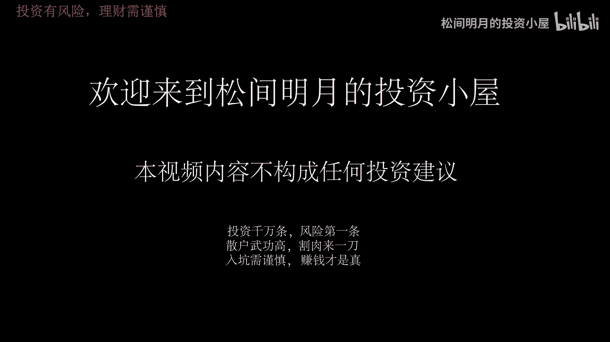
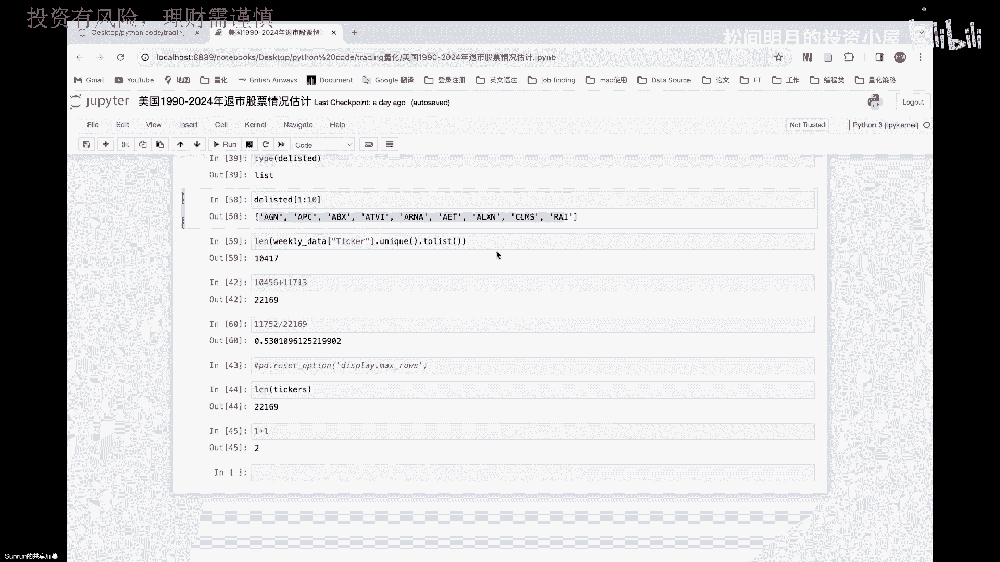

# 松哥量化正式课程1-2 Project 2 代码详解-1.mp4 - P1 - 松间明月的投资小屋 - BV1uZ421q7jj

Pa pal heroes in a half shell，Turtle，Power，Hello，大家好，这里是你们的松哥，今天我们把上次做的那个project to。

第二个project的代码讲一下呃，这没啥代讲的代码其实不多，因为我们其实是想学，就1990年到2024年，美国股票退市的一个情况呢，实际上我没有取到那个数据啊，但是基本上到2017年应该也没什么。

差太多了，我们可以根据对吧，统计他最最后几年进行一些简单的推断，那么首先呢这个是引入库，我们就不讲了，然后我们可以看到，在这里面我们是有一个导入数据的动作对吧，然后这个数据被导入以后呢。

首先是来自于我的股票数据，我当时也尝试拿了一些股票数据，但我发现这个股票数据呢，嗯虽然是我们学校当时给的，但是不太够准确，然后数据量我觉得也不够，所以说呃后面我就放弃了这么一个股票的一个，数据的展示啊。

我们就决定还是从然后发现去取这个数据，为什么，因为取这个数据相对来说我会发生错误，如果我取不了这个数据，我取不到这支股票，那就说明这股票他可能不在了啊，他有可能是被转移了，也可能换名字了啊。

也可能代码改了等等这种原因，反正总归它会出现问题对吧，那不管出什么问题，他就会知道他肯定不在我的序列里了，所以我后来考虑一下呢，就是从，然后final，把他2017年9月份之前的所有的ticket。

给它下载下来，就导入一个文件夹，然后这个文件呢就长下面这个样子，我们可以看看它的head啊，这些代码都应该很熟悉了对吧，那么这时候我看到head以后呢，其实我们有这么一个雅虎stock ticker。

然后呢这里面有一些网站，因为我是从网站上直接down下来的，所以他还保留了一些网站基本信息，前两行呢都是一些无效的信息，并且每一行都是on name对吧，名字也不对，那么包括这里有ticker。

这是我能看到啊，然后呢name需要交易所对吧，然后还有种类，还有country，其实country我们只想学美国就好了，因为其实这个country会包含很多国家，可能还有中国一类的一些数据都在里面。

那么所以从这个角度上来说，它就变成了一个大杂烩，我处理不了那么多数据，而且这个数据其实非常的大呃，再加上我还要从网站上一个一个把它下下来，所以整体的工作量就会显得很大，光这个tick就有9万多条对吧。

所以后面想想看的，那我们怎么办呢，那首先我们要想把这个数据集里面，只有美国的ticket给它取出来，然后再用to list这样一个命令把它变成一个列表，然后再用我们编写的从网站直接读取的函数。

把它给读取出来，我们这节课呢，会把除了这个编写函数以外的东西都讲掉，然后呢我们下节课的时候不长，我们会把这个这个函数里面，内部的一些小trick给他列出来，因为这里面其实不在于我取没取到那个数据。

或者说不在于我取到的数据是多少，比如说苹果公司我肯定能取到数据，但这个对我来说不重要，我想记录的是没渠道的情况，也就是说发生报错或者异常的退出的情况，就是如果没有取到这个数据，这是我想要的。

然后这样的数据我想把它放到一个list里面，我后来给这个list起的名字就叫possible delete，Ticket，Delete，就是指退市的意思对吧，list上市嘛，DLIST就退市了。

所以我们其实是关注异常的值，它和我们平时取的时候有点不一样，所以呢我们就要写一个包括try except，exception这种异常情况的啊进行一个表达，那么这节课呢我们就先把除了这以外都先弄掉。

那么首先我们可以看到这个数据集不够，不尽如人意对吧，然后呢我们可以看到ticket是不是独特的值，我用UNICO语句去看看有没有独特值，确实都是独特，指是一个一个的array哦。

它的属性是nd array啊，它不是完全的list，也就是不是完全的string，那么我value account一下，看到有的股票的可能只有一个数据对吧，那有的有515，那这都是比较准确的。

那每个股票的数据都不一样，当然只要有一个数据，我就暂时认为它没有退市对吧，所以我们取的是一个最大级是吧，那么我们可以看一下单独的每一个UNICO呢，其实是一个DIRAY，那么DIRAY呢。

它是我们在NPD的一个标准的数据集，这是对n d a ray也会有type，也会有链可以去看，那么我后面呢就想把这个呃UNICO，看看它总共有多少个，对不对，那么我们直接用，其实直接用line。

然后对that ticket unico去取这个值，我就能看到总共有多少个，当然我做了一个赋值，是把这个unique的值赋给了TK，然后让land这个TK跑出来，总共是5万多条，那我就知道哦。

我总共有5万多个上市公司的T恤，然后呢这5万多个里面必然有一些已经推迟了，所以这是我后面要找的一个方向，那么其中每一个股票，每个日期呢也是有不同的一个展示的，当然了，我们在这个数据集里面。

你可以通过这种gogo by的形式去展示，然后我用的是theta，如果你不用带也可以，你可以用这里的tick，但是在解决所有的TK之前，我们都要把这个什么行和列给它进行一个转换。

比如说我要让这个tick到这行来对吧，让这个对，只要把tick提上来就好了，所以我只要跳过两行就可以了，那么这时候呢我也可以对that one这个数据，直接对它进行一个i local语句的一个判断。

i local呢是我们常用的一个定位的语句，它可以帮助你快速的定位，其中这个逗号是分割行和列的，那么前面这是行，后面这是列对吧，所以我这里的意思就是帮我取什么，所有的第二行开始，而不是第二行。

第三行开始就是012嘛，所以第三行开始所有的行，然后呢只取0~5列，那么只取0~5列，就是只有这是第一列，第二列，第三列，第四列，第五列，0~5，其实就第六列应该取到这了，所以1234012345。

但是由于我们在在这个Python里面，这个零杠五的这个五是取不着的，所以其实就取到了NM啊，就是country这一列就取完了，所以我可以直接用i local这样一个定位。

把我的that one给他规整化，规范化一下，那么我们可以看一下，规范化以后就变成了现在这个样子，当然这个索引可能要重置，因为你看到这个索引其实是从二开始编码，可能有所不对，但对我后续没有影响。

所以我没有去重置它，当然你要做重置reset index啊，然后replace也没有什么问题，然后国家是国家，你可以看到国家是在这里，对不对，国家是在USA，但是其实还是没调整好对吧，还是没调整好。

因为感觉这个tick应该在上面，你可以再换一下，也没有什么太大毛病啊，如果你把这个改成三，那他就直接把你换上去了对吧，直接到这上面去了，但是country就没有了，country就没有了。

呃为什么我country就没有了呢，是因为我是在已经that one的基础上进行一个操作，我是从第三行开始取的，所以它就会导致我没有，其实是把country给忽略掉了。

就是这个i local语句是把第二行的country给忽略掉了，country给忽略掉了，所以这样取它并不能导致什么，并不能让我的这个，刚才我们看到二的这种情况下的这一列ticker。

然后name exchange就变成我的列名对吧，如果你非想把它当列名也可以，你可以在我们读数据的时候进行改正，因为我只要跳过两行，这里面其实有个参数叫skip啊，你给他选择二，它就会自动把前两行跳掉。

前两行跳掉，那跳完以后，that one就直接变成了以第三行为列名，而默认对以列名而默认的这么一个值哦，应该是跳三行是吧，Sorry，对你看这样子的话。

我的前四行是不是就我的我的列名就变成了country，变成了tick吧，这样也很规范，当然我后面代码没玩这个写啊，所以这个你们自己自己自己知道就行了啊，你也可以用这个skip这个东西来进行一个。

你可以用skip这个来进行一个怎么说呢，sap roll来进行一个跳转，当然会写起来更好看一点，这个就你自己随意吧，那么后面我们在这里读到的说关于这里的，就是我们使得他这个eye local。

因为这个52行这个命令，他只是帮我做个展示，他其实并没有真正复制到我的data one，此时我的data one，它依然展示的是什么，是我的that one1如既往并没有被改变，所以你一定要改变它。

要么用replace那个语句，但是i logo并没有这个参数，所以你就只能用这个赋值语句了，让这个that one i local的第二行到第0~5列，第二行以后的所有和0~5列全部给我的PRE啊。

给他PRE，然后这时候我的pro就是个data frame，你也可以看一下，此时的会，此时的prone以后已经有了country，经有了country嗯，那有了country以后怎么办呢。

那么我们就要去做啊，这个这个有country是因为我刚刚读了，我要重新读一遍啊，它不应该有country才对对吧，这里有country是因为我的that one刚才被我改掉了。

所以这里面才会country变成名词，正常的我的PRE不应该是这样子，应该是on four才对啊，这样才对，刚才是因为我读了那个SKYROLL，所以才会变成这样，所以呢下一步就是选择性的一个条件。

这个选择性的条件你们可以常用一下，它其实就是对某一列，它是否符合某个条件进行筛选，但在R语言里面很简单对吧，你用type words，然后select就可以直接做了，或者说用filter。

用filter就可以做了，filter做筛选就可以做了，在Python里面就是要写两个等号做一个判断，这里面这个其实是一个判断，里面这段其实是个判断，它会返回一个什么呢，它会返回一系列的逻辑值。

For or choose，然后当我再把它传到这个里面的时候，他就得到了一系列的逻辑值，For truth，当force的时候它就不展示，当初死的时候，他就true的时候他就留下来。

所以经过这样的一个转换，我的pro这个东西它就会展示出什么的，只有truth的就是USA确实等于USA的时候，它才会展示出来，这样我就把所有美国都闪出来了，所以你可以看到我从10万多行降到2万多行。

就是这么讲的，因为只有美国的数据只有2万多个TK，然后由于这个东西也不能rein rein place对吧，也不能in place，所以我也只能用这个pro等于号这个结果。

这么就完成了pro two的一个结果好，然后pro two呢结果以后我们再看看pro，此时的UNICO大概长什么样子，这个四行只有USL，所以我确定了没有别的国家的股票了。

那么这时候呢我让它再变成这个呃啊，当然我这个这个没什么意义对吧，这个PRESURI肯定用不上的啊，我只是想确认一下他是不是USA的这个情况，然后后面呢我们就要开始做这样一个程序了。

然后我们就简单写一个start date，写一个end date嗯，然后呢用y download去取苹果公司的股票，然后呢，我当时是这两天给一个同学讲了一个CN啊，讲CN因为他是拿时间序列做了一个预测。

预测这个外汇的，然后他数据不太够，他想跑那个真实波动率，真实波动率我看了一下，其实要拿分钟数据跑，但是我们没有更多的分钟数据跑，所以我就当时想帮她查一下60分钟，结果人家跟我说，60分钟只能拿730天。

就两年多一点，两年可能两年多一点点的数据，所以如果改成带万的话，就不会暴露问题了，因为我取的时间太长了嘛，我取的时间太长了，所以他就取不到，那这样我们就完成了对苹果数据集的一个摘取。

这个大家现在都清楚了，然后像这个EMC是指它是不是空值啊，我想查也没有空值，以及它的index-1，最后一个是什么，是2023年的12月29号对吧，然后这是时间戳，我们都讲过了。

然后就用这个函数去取数据就好了，那么这个函数实际取数据的过程是比较漫长的，我们这里就不跑了，这跑起来就信号开始慢慢走的啊，然后呢这个里面呢这个函数编好以后，这个函数没问题啊，编好以后呢。

我们在这里就把p to的这个yahoo stock ticker啊，因为这类叫yahoo stock ticker对吧，Ticker，然后把他这个tickers给它单独的给他提出来啊。

让他to list，这实际上是对于任何一列，只要你是分类变量或者说是string这样的东西，或者是DARRIN，都可以把它直接脱离出来，那么这样子呢，你的ticker就包含了所有的。

我想要去的这个TPTP，那就这么一个list，这个list有多长呢，它有2万2119啊，2万2169，2万2169啊，应该刚好我这跟我这个break这个two，应该跟我这个能对上才对。

我们看看PTWO对吧，刚好是这么多，因为这个是不重复的，所以我们刚好是有这么多tick，那么有了这么多TIKER以后，我直接把这个ticker传入到什么，传入到这个函数里面啊。

当然这还函数还叫weekly date啊，下次再改吧，然后把这个tick传进去以后呢，就从他这里取数据了，然后取完数据以后，我就得到两个return，那这是我在函数里定义的，我本来就是两个return。

一个是weekly date，就是它真实的数据，另外是已经可能被剔除的数据，那么这样子我就得了两个list，然后最后呢把这个类似的输出出来，就是PSL啊，delete它叫delete。

那就叫delete，那只要把delete输入出来以后，发现有1万1752个，那么这个我就知道了啊，已经被干掉的有1万1000多，然后包括了这些股票的一些代码，就是这么完成的好。

这就是这个美国19902024退市股，的一个情况统计，下节课我们说中奖那个函数，然后再下次应该就可以跟中信的看看，中兴到底有多少只破发以及腰斩，接腰斩的股票，我其实也很好奇。

