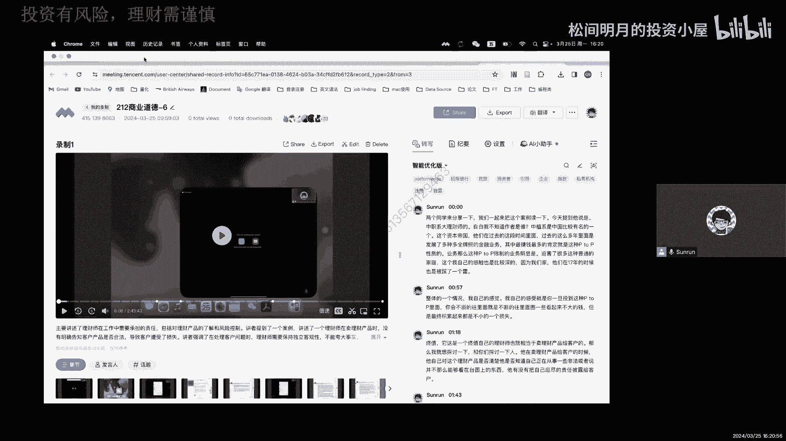
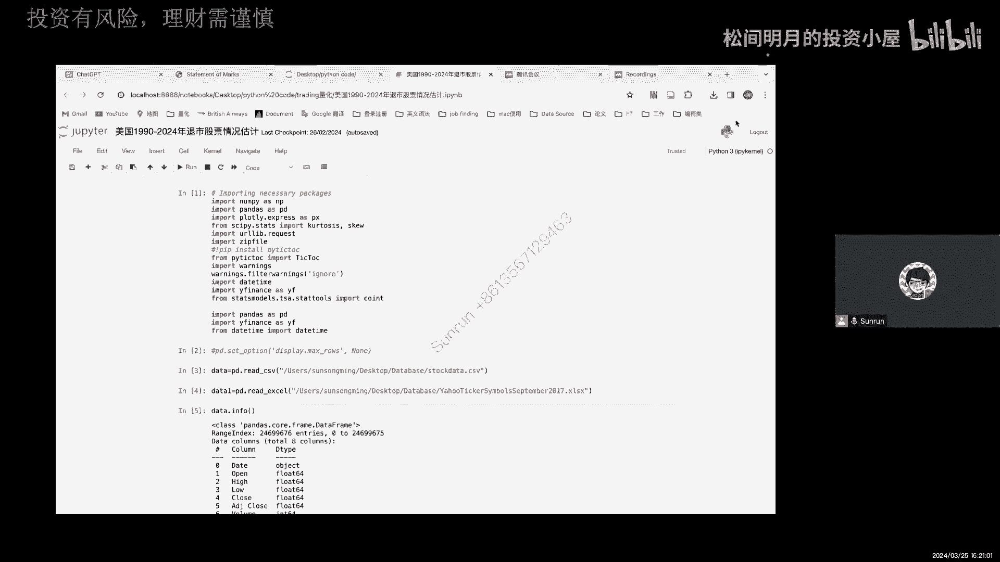
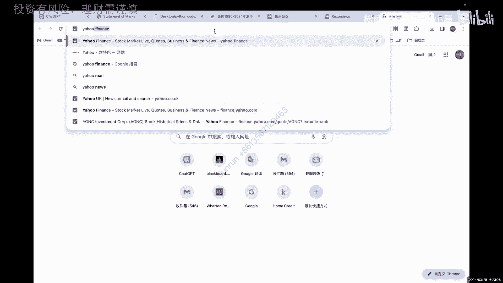
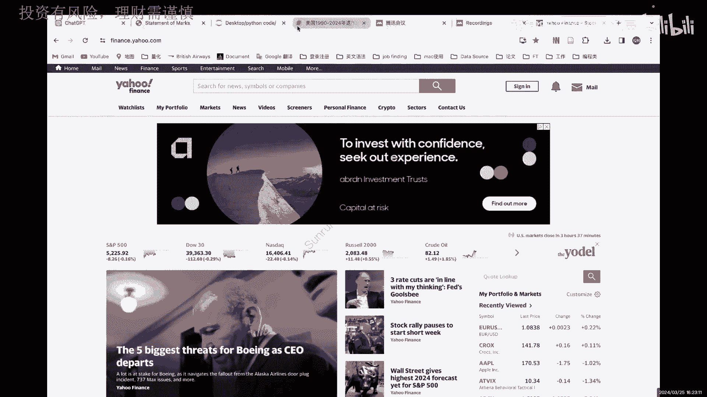
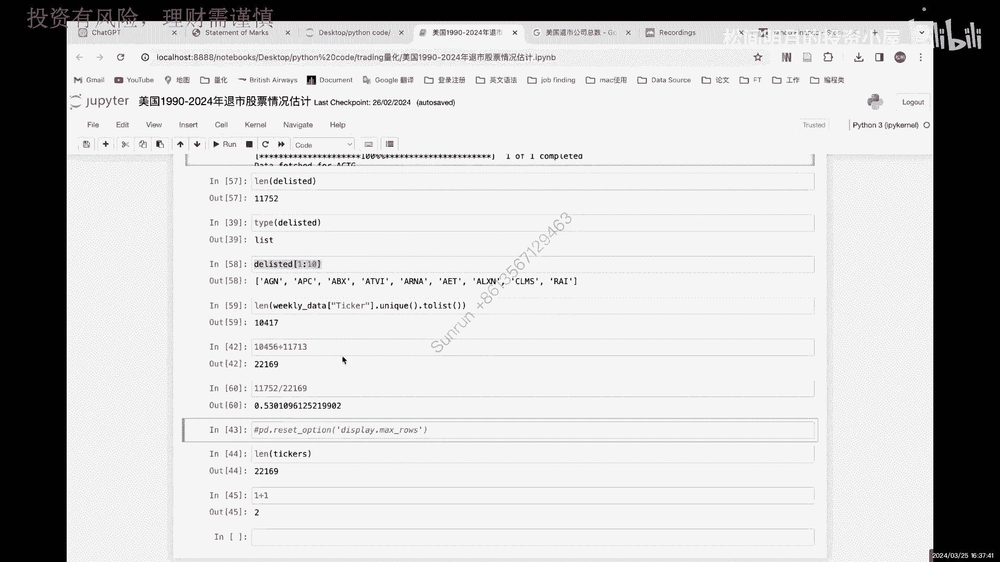

# 松哥量化正式课程1-2 Project 2 解密近30年美股总是上涨的部分原因 - P1 - 松间明月的投资小屋 - BV19t421G7uX

Pa pal heroes in a half shell，Turtle，Power，Hello，大家好啊，这里是你们的松哥嗯。

大家肯定震惊了对吧，乖乖孙哥这么勤快吗。

昨天才更的，今天又跟唉，确实如此啊，咱今天再更一版，咱主打一个随缘啊，这个呢其实是一个新的项目，就算project to了，我们之前project one的代码已经讲了三期了啊，如果是真的想学代码的。

可以去看那个如果只是想探讨一个思路的话，嗯那我们来看看，那么这个思路是什么呢，就是上次也是去年的事了，也是去年年底的时候，我们在讨论退市的问题对吧，确实在监管上面演了很多。

这两天你能看到很多很多这样的一些消息，包括有很多主动自己撤的IPO，自己撤下来的，还有包括最大的出行证券对吧，他的那个IPO遭遇了监管的一个处罚，我觉得这都是一个很好的信号。

但是你指望这个很好的信号能够短期改变，我们中国的市场是比较难的，为什么呢，因为美国的市场有同学就在问我，或者有粉丝在咨询我说美国美股到底能不能买，为什么他能卖，我也想知道他为什么那么买。

因为你如果把这个过去美股这么多少年，20年，30年的一个数据拉出来啊，下次我们做第三个，我们做那个你把它拉出来以后，你看看美股的走势，你会发现你在每个回调买入都是对的事，后来看都是对的，那为什么呢。

因为它的制度上有保证，我个人觉得制度原因是一个很重要的原因，那么今天我就想带你们看看制度原因是什么，那么当然我没有，我没有去查美国的数据，我是从历史上的，就是通过我们量化的方法怎么去证明这件事。

那我想证明的无非就是美国上市的股票很多，但是退市的股票也很多，那他退市的比例究竟有多少呢，我在网上查过这个数据，大概在40%到50%之间很高吧，中国百分之几绝对不超过10%，我敢打，我敢打。

保票肯定不超过10%，那美国到底有多少呢，所以今天我们一起来看看，那怎么才能看到到底有多少股票退市了呢，嗯我能确定开始退市吗，我想了一下，我可能可以通过yahoo finance的一些数据去查找。

那么在雅虎反应notes上。

我们可以去直接download下一个股票的真实数据对吧。

然后呢我们只要把这个数据DNLOAD下来以后呢，我再去查他这个ticket，然后他数据有没有，那么我就可以知道，如果他有数据，那我认为他现在还在上市，比如说截止到2024年的2月份，他还有数据。

说明他正常的应该是在流通的对吧，在交易，那如果已经没有数据了，那很有可能就是退市或者怎么了，为什么要加个或者怎么呢，因为有些公司都改名字了，他TK被改掉了，他原来用的是那个老的TK。

后来又换了一个新的TK，因为我选择的时候其实是按照TK在选股票，对不对，所以我tick选5号就会有这样一个问题，他换了一个tick，对我来说就换了个马甲，换了个马甲，我就不认识他了，所以这种情况下。

我可能也会无意中把它捅进去，但是统计进去，但是我觉得这个问题不大，因为这个情况吧，就算50%对50%吧，那也不会影响我最终的一个退出的效果，不会太大对吧，所以我就这么想。

那我就从亚finance上把他所有的TK都倒下来，但是呢我也偷了不懒啊，我就在网上找了一个，我在google上找了一个，找到了一个所谓的叫ticket，也就是你们现在看到这个yahoo ticket。

symbol september201期，也就是说我下载了截止到2017年压缩发，所有的什么呢，所有的这个这个氩弧发糖酸内，就到2017年的9月份，他有tick在雅虎反弹上的数据。

那么这是一个完全的TK数据，我们可以先看看再进来这个是什么，那么这两个数据读进来以后，我们可以单独看一下这里的data1的info，DA1的info呢应该就是有大概嗯，我查了大概有5万多吧。

反正非常多的一个数据，那就是截止到2017年9月份的时候，我们现在能看到所有TK啊，就这么多哦，有10万多的一个TK啊，10万多TK应该是说相当大的，然后这些tick呢，因为这个是包含了各个市场都有的。

各个市场都有的，它其实不完全是美国市场，比如你能看到apple对吧，然后呢，我们会对这个东西呢再进行一个简单的处理，简单的处理，那么通过把它处理以后呢，我只保留剩下是美国的。

然后呢对美国的这些ticket，分别直接去跑到雅虎发坦克上去找，如果我能取到最新的数据，我就认为他没退市，如果我取不到，我就认为它推迟了，所以对于取不到的数据，我会把它放在一个list里。

然后我再看那个list嗯，比如说这个数就没取到，那我就把这个TK放到我的list里，作为第一个元素，如果我取到了，那我就不放进来，那第二个没取到，我继续放进来，因此我会放很多这个例子。

里面会放很多很多这样的元素对吧，然后最后我看一下这个类似的一个长度，我就能知道到底这么多长时间，它到底有多少数据已经取不到了，所以我就想做这么一个project，所以我就统计了从1990年到2024年。

我们大约，或者说粗略的一个美国股市的退市情况啊，为什么说粗略，我前面解释过了，是因为他的ticket如果换名字了，对于我来说，我其实不确定我找不到他，到底是因为它退市了还是换名字了。

但是我不确认我就把它都统计进来，我们看看就这样他的数据有多少，那么这个stock data呢，因为我是直接读取的这个它的一些数据，这是从我们今年之前已经下载好的数据，这是我今年下载的数据。

所以它可能会有点不匹配啊，但这个问题不是特别大，然后我们可以看到style data里面的tick也有很多啊，然后呢把它都查询了一下，大概有515条数据，每个tick有这么多，当然这个都不是特别重要。

然后呢我们就按照这个data日期给它去排序，排序以后，分别生成了他们各种各样的，每一天的这样的一个数值啊，好那么这是雅虎finance里的内容，那么这些ticket呢我首先给它按照unnamed4。

也就是这一列，这里是什么呢，这一点你可以看到它是国家对吧，但是因为我这个数据读取进来的时候，它是它是前面几行有这个空值的，所以道理上说，我们可以用skip这个命令去把它跳过去，但是呢我没有。

我就在这里面直接用IOO命令给它重新定位了，那么这个i local重新定位以后，你会发现R类库的二从第二行开始，那么这里是个ticker，这是name，这是exchange交易所对吧，这是我的种类名字。

这是国家，那我只想国家是美国的，所以这时候我就用i local的二，然后0。5把他们全部给固定下来，然后呢我发现他是个data frame，然后我在这个data frame里面这一列，只要它等于美国的。

我就把它嗯把它保存到PRE2里面，所以我这时候的pre two，它就形成了，我们现在能够看到的这个只包含美国的数据，然后呢我再通过这个只包含美国的数据，这个P这个precision就是我想要的东西了。

对不对，就是我想要的只有美国的ticket的这些内容了，那么这就是psi，我们来看看psi长什么样子，他的AA就叫USA对吧，然后呢这时候呢它的独特值只有一个对吧，因为全是美国的。

所以我就确认了没有问题啊，没有问题好，那么在这个下面呢，我其实非常的笃定，那我选对了对吧，那么下面呢，我们就可以对这个数据进行一个展示了，那么我首先的尝试就是直接从网上当数据，那么我就给了一个起始日期。

起始的时间是1990年的1月1号，那么结束时间是2024年2月12号，这是我当时做的一个，我也没改啊，今天我也没改，然后呢直接从下apple成功了，你会发现成功。

他就有一个这样的complete完成的数据，那我就知道他成功了，那么呃我并且用empty这种去测试，它，会发现这是空值，然后呢我们就写一个简单的函数，那么这个函数呢这个写完以后呢，就可以帮助我做什么呢。

因为我们之前写函数的时候，我只是为了取数据，也就是这一段try的这一段，但是如果说我现在的问题就是如果我没取到，那怎么办，没渠道怎么办，那么没渠道我就会用后面这段。

比如说NO data for tiki list delete，就是我要删除的意思，我就反正给他设置了一个包，这个包呢是一个空的list，就是这个possible delse ticker。

就是我猜他可能已经退市的这样一个股票，类似的是上市，DLYS就是退市，那么我这里就猜哪些已经退市的股票，我就放在这个DELIST这个list里面啊，这是一个list，所以通过这样的一个方式。

我们是不是就可以去断的，把没有渠道的数据放进来，没有取到数据放进来对吧，这个东西当然也是我在实际取的时候，我发现了一些问题，如果你真的实际取的时候，在这个取的过程里找到这些东西好。

然后通过这样的一个类似的展示，我们呢就一段一个一个把它装到我的list里头，那么最终呢我要去评判一下，我这个DLIST里面到底有多少个数据，那这些数据它的长度，比如说它有2万。

就说明有2万个股票退市了对吧，但实际上我们TK有多少呢，我们先要看一眼，那么从这个雅虎finance ticket，然后把它to list to list以后呢，我们就能得到一个所谓叫tick。

这是一个例子，这个t cs有很多对吧，我们并不关心哪个是哪个，但是呢我关心的是它有多少个股票啊，所以我们给它一个length啊，Sorry，L给他一个烂，你会发现总共有2万2169个，对不对。

那么2万2169个，也就是说，我等会放进去读的这个TIK会有2万2000多个，那这2万2000多个势必不可能都被取到数据，那没取到的就是我想要的，我想把它放在DLC里面的，那下面的是我取的一个过程。

这个我就没展示了，因为这个过程我实际测了一下，如果我要跑这么久的话，我差不多要跑一个多小时，就我在电脑上，那我们就不在这里展示了，所以呢这就是直接的结果，你会发现它有这样的结果。

比如说第一个叫eco download，也就是说这时候他读到了一个数据，这个数据是OEDV，但是呢他说这个ticker没有没有找到价格数据，那这个symbol may be delist。

这东西不是我写的，这东西是我写的，就是我们前面这里的这个这个嗯，如果没有数据匹配的话，OO这个就是被delete，这是他返回的应该是，然后这个fell down a7N也没有了对吧。

他是时区找不到反馈的，这是yahoo finance本身它会抱回的一个错误，这还真不是我给的这个错误，那么但是不管怎么样，反正他就能告诉我们啊，我们到底有哪些数据没有下载到对吧，C m s。

所以呢我们把它全部2万多全部读完啊，这个这个过程就很复杂了，我们就不管它了啊，那么全部读完以后呢，全部读完以后干什么呢，全部读完以后，我们就可以做这么一件事，就是来看delete里面到底有多长。

你可以看到delete里面差不多有1万，1752个，1万1752个，然后我们看一眼啊，差不多就是这些了，那么如果说把这个ticker里面的独特值查一下，就此时在ticker里的独特值查一下还有多少呢。

我们现有1万01万417个，也就是我实际取到的数据，有1万417个，因为渠道的数据在我的week data这个数字里面吗，我这时候同时生成两个，一个是delete，一个是with data。

也就是我这两个数值加起来，应该等于我一开始的那个tickers的总数，对不对，应该等于这个总数，22196，那我验算了一下，差不多应该就是刚好相等219，所以也就是说我可以得出这样一个结论。

从1990年到现在到2024年，他们总共在雅虎法那次上，我出现了在截止到2017年的数据啊，这个是2024年，其实有点不准，截止到2017年的数据，总共有这么多只股票。

有一个22196曾经上过finance的网站，你曾经在这个网站上能够DOLOAD它的数据，但是呢delete的部分有11752，而剩下的部分只有10417，这中间当然包含改名的数据。

但是就算有改名的数据在里面，我们可以看到这个退市，或者说改名的比率有多少呢，53%应该说是非常非常高的吧，非常非常高的，然后我们随便google一下，看看看看官方是怎么说的，美国，公司总数啊，看看啊。

你看啊，美国退出故宫，这是第一财经的啊，38年退市1万7000家，合理吧，合理吧，我这里测出来的大概是1万1000多家，他是38年，我是24不对，我是14年对吧，我其实不到34天，因为我是到2017年。

所以90年到2017年，差不多比现在少7年吧，大概27年左右，27年退市1万1000多家，38年退市1万7000多家，我觉得这个数据没什么太大毛病啊，这人家爆出来的呃，这是第一财经报告的。

他们一年就退了415家对吧，一年就退了415家，我们呢，我们是至今22年至今的是三百十五家对吧，21年我们才退了19家，我们是人家一个零头，真的只有一个零头，那在如此这样一个市场上。

其实有的时候你根本不用自己去挑股票，你不需要做那么多功课，我们A股的股民，说实话已经是这个世界上最优秀的股民了，你们什么都懂，你们有什么不懂的，你们连财务里面最复杂的所谓的什么叫商誉，在19年的时候。

大家都被普及了，国外哪有啊，他们不学商科，根本不懂这些东西，你们已经很牛逼了，是这个市场办，这句话就就在这是这个市场烂，但这个市场在变好，我看到了，就在今年在变好，他们抓到这个关键，就这个退市数量。

人家股市能不涨吗，他为什么回调就可以买，是不是可以解释一部分原因，所以从这个角度上来说，我甚至都有个想法，我可以拿退市的家属，每年退市的家属和他们股市每年上涨的幅度，做一个相关关系图，我都有这个想法。

说不定还真可以解释，你别说说不定还真可以解释，A股市场肯定解释不了，所以从这个角度上来说，是制度的建设很关键，不是说光有钱就能把股市拉上去，大家如果都像某证券一样去吸血，去做一些不负责任的保健保荐制度。

推荐股票上市，然后割韭菜就用转运工作形式把资金弄出去，就是我下次我们想做的大概是不结合400，我觉得这个你市场是治理不好的，所以你必须要严格你的退市制度，并且要做到不能光严格，光有制度不做也不行。

制度和执行缺一不可，在这种情况下，我们为什么说美国的股市好，人家的退税制度执行到位，他能退1万多家，我们做得到吗，这个53%的比例，说实话，一开始我是不信的，但是通过这样的一个调整，虽然我算的很粗糙。

我自己也说了，算的很粗糙，但是我觉得合理啊，很合理啊，人家股市涨也很合理啊，你甚至都不用挑你，你看看活下来那些家属，那都是好企业，没有太差的企业，当然不能这么说啊，全部都是好企业，不敢说。

但是好企业肯定是比较多的，是不是，所以所以这就是我们做project to的目的，为什么美股你可以闭着眼买，你只要回头就能买，但是A股你永远都不能这样好吧，今天我们就聊到这里，我觉得很很很充分。

这个project我也很满意，好我们就说到这，如果你们对我做的新自有感兴趣的，欢迎关注我关注我关注我啊。

记得要给我三连。