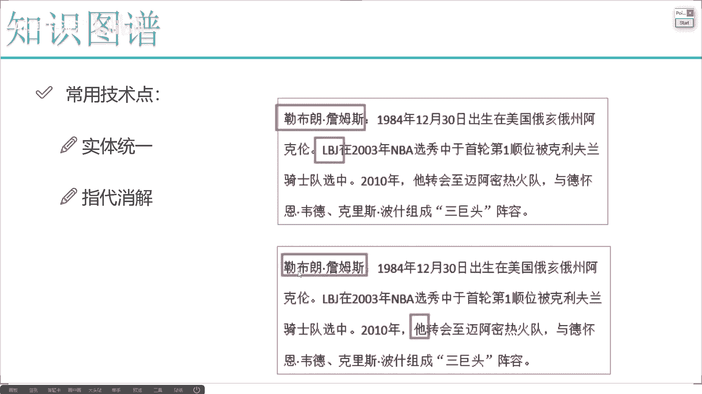
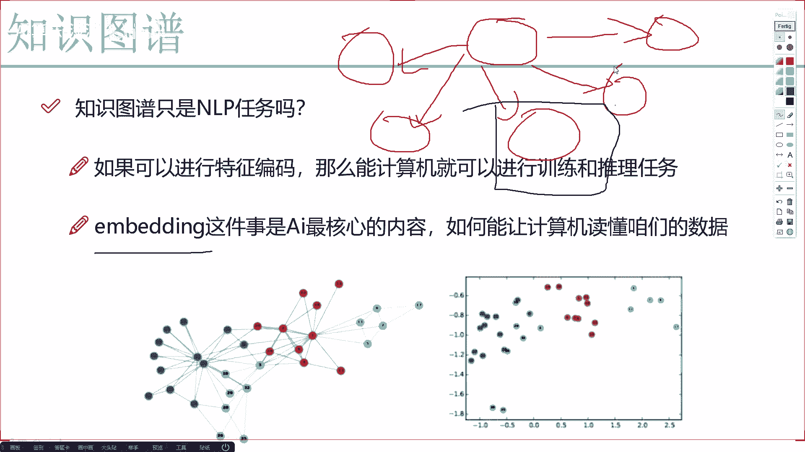
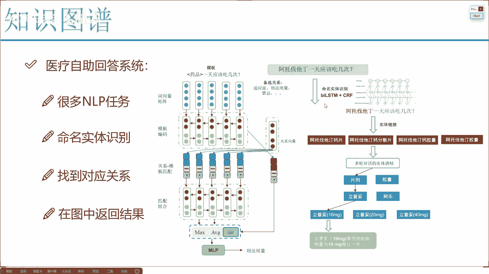
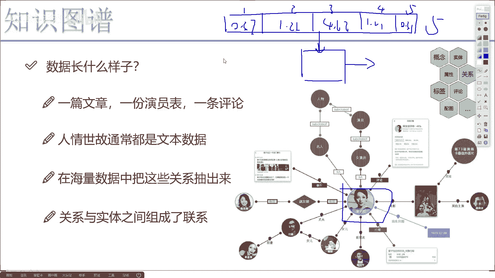
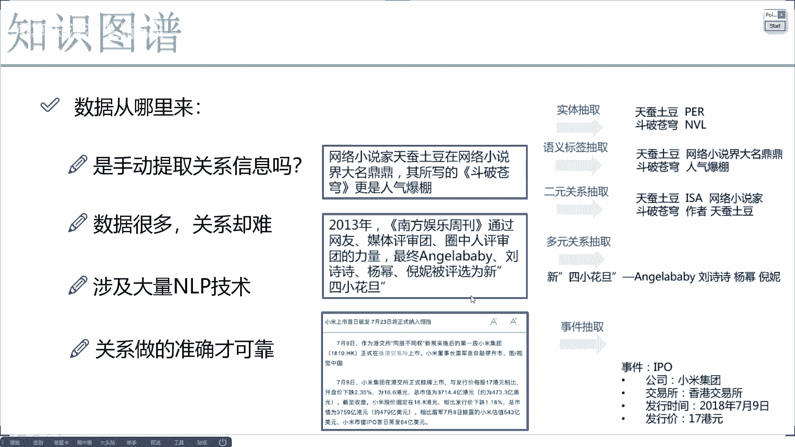
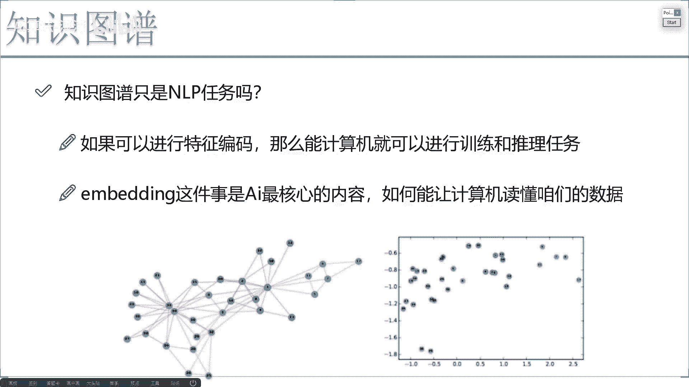

# 完全可自学！人工智能金融领域知识图谱+Python金融分析与量化交易实战全套课程！入门真的超级简单！——机器学习／深度学习／NLP自然语言处理 - P6：3-graph-embedding的作用与效果 - AI算法-漆漆 - BV1Wgz3YVEx1

那此时啊估计大家咱们也会问一个问题了，最开始我也提了很多哦，我说大家总是把知识图宝归到NLP领域当中，为什么我该说也解释了里边有很多NLP的任务，那现在呢我们来想一想了。

真的它就只是能应用到NLP领域当中吗，其他领域我们能不能做呢，其他领域我们能不能做呀，在这里咱们再想个场景，哎我说这个警察这个警察啊，现在就电视剧当中吧，或者电影里边啊。

这个警察看着这个墙一堆嫌疑人的照片儿，是不是啊，然后他就去推断了，他们之间反正有各种各样的关系啊，就什么头目啊，小弟啊之类的，然后他一说啊，最终推算出来，我说这个哥们儿他就是凶手啊。

经常看电影就是这么推理是吧，那此时我们来想一想，我们现在用这个知识图谱啊，好像很多时候都是做一个查询，是不是查他们之间的关系啊，查一下王菲和李亚鹏的女儿是谁啊，姚明的孩子今年几岁了。

是不是都是一个查询的关系，我们能不能做的再厉害一点，能不能咱们做一个推理啊，有这个图模型之后，那比如现在发生一个凶杀案啊，一些主要人物我们把这个关系都列好了，然后他们有些属性之类的，我能不能让计算机。

你说自动的给我推理一下谁是凶手的可能性大，诶，这件事能不能做，能做吧，那我们来想一想推理的这件事，它是NLP任务吗，可以说它不局限于在这NLP当中了吧，它会涉及到很多其他的综合的应用吧。

比如这里当我们的关系里边有一些图像的数据，有一些结构化的数据，有一些属性的信息，我们都需要给利用起来吧，那怎么样综合进行利用呢，师傅说我得把所有特征，所有的一些信息进行一个融合呀。

那此时啊我希望大家咱们这么想，知识图谱啊，并不是光能解决NLP任务的，我们还可以做一些综合的任务，在做综合的任务之前，我需要给大家提一个非常重要的词，叫做embedding啊。

估计大家之前可能也听过叫graph embedding词的，也就是图的一个编码，那什么叫做一个图编码啊，这里我这么给大家来给大家说，哎咱们来想一想是不是这么一个事儿啊。

我说现在啊我虽然说构建了一个图模型啊。

这里边有很多节点，我拿之前这个来看吧。

我拿之前的一个点来看好，只有这样当前这样一个点来看呃，有就你就当做当做这个图吧，有导演这个图之后啊，我说现在我想去预测一下啊，就是每一个人他的一个收入情况，就是年收入得多少，让这个网络做一个预测任务。

咱们来想一想，对于一些传统的机器学习，或者深度学习的预测任务，我们的输入是不是一个特征，或者说输入是一个向量，输出是一个结果啊，但是现在你看在这个图模型当中啊，我们有的只是他们的关系，只是一些属性。

我好像说我没有一个特征，没有一个向量这东西，你说我用神经网络做一个建模，哎这怎么建模啊，这东西好像就很难去做建模吧，那我说咱能不能这样基于比如说章子怡，我说基于章子怡呀跟各个人之间的关系哦。

我说给章子怡构造成一个向量，什么叫向量，就是一些值啊，比如说我是构造一个五维的向量啊，你不要问我五个维度分别是什么，因为在神经网络看来，这五个维度只是他能懂的，咱不用去管啊，比如第一维度0。37。

然后这个1。21，然后是个4。62，然后这个一点一，然后0。31好了，那我说把每一个实体，或者说把每一个点构建成一个向量，由这个向量之后，我说这个把这个向量啊输入到一些算法当中，他可以帮我做一些推理。

帮我去做一些预测，可以吧，比如说我输输入到神经网络当中，咱得到什么，我最终啊得到一个值，这个值呢就是啊预测了一下，他的一个年收入是等于多少的，那我们来想这个这个事儿能不能做，可以去做吧，那像我刚才说的。

哎如果说我想去啊，比如这是一个就是嫌疑人的一个结构图吧，在这些个嫌疑人当中啊，我说我想判断一下每一个人，他是凶手的可能性有多少，那如果说我能把每一个凶手啊，每一个嫌疑人表示成对应的一个向量。

可以是五维的或者300维或者1000维的，只要它能表现成一个向量，我用神经网络做一个建模，我肯定能输出来，它最终啊比如说是个分类还是回归结果，我肯定能做出来吧，那这样是不是说只要我们能做出这个向量。

咱就可以做很多推理的工作，做很多我们想去做的分析呀，预测呀，把各种算法融合进来，咱能这个图模型的应用，应用的一个领域来说更加广泛，更加实用一些吧，好啦，那虽然说我们能做这件事，但是一个更难的问题就来了。

对于当前这一个点来说，我们怎么样能把它转换成一个向量啊，这个也是啊现在知识图谱领域来说啊，我觉着研究最热门的一个方向，因为以前啊我们定义知识图谱啊，就是谷歌12年的时候定义这个知识图谱，只是为了什么。

只是为了我们的搜索引擎能够就是更智能，能通过这个图的匹配关系诶，让我们找到的答案就是啊，更符合用户的一个需求，但是从现在呢从今天这个角度来看，都快21年了，我们今天这个角度来看，咱们知这个知识图谱。

我可不能光满足于只是一个搜索，只是为了满足咱们用户搜索引擎，我说让它更智能一些，做一些推理，做一些啊就是预测方面的工作。

那其中啊最难的一点就是，我们这些个节点该怎么样进行编码了。

所以说啊这块我也写出来了，咱们现在啊有的非常重要的一件事，就是一个embedding，在一个非常复杂图形当中，我说这样我把每一个节点都编码成一个向量，可不可以啊，啊大家肯定觉得哎呦这件事肯定是可以的。

但是怎么做呢，基于当前这个点，你说这个点来说啊，它本身有一些属性，是不是本身有的属性，能不能当做它的一些特征啊，肯定可以啊，身高年龄体重自然要当做它的一些特征了，但是我们来想当前这个点。

它不是说在一个样本数据当中，是独立的一个样本，它是在图模型当中我要做的编码的一个向量啊，我们还要考虑什么它和其他点之间的关系吧，在构建或者说在做embedding的过程当中，我们要考虑自身的信息。

还有我们之间关联的信息吧，大家可以想象一下这一个embedding，我们在什么场景当中能用到呢，一会我会给大家举几个例子，其实通过这些例子啊，大家会发现embedding这件事啊。

已经成为啊现在AI领域来说最核心的一点，我给大家举个例子，我之前啊在讲深度学习课程当中的时候，我会跟我所有学员都会先说这样一件事，我说大家，你不要把这个深度学习和神经网络，当做是一个算法。

你就把它当做是一个特征提取器，说白了我让计算机报去做一件事儿，我只要给它足够好的特征，足够好的一个向量，它就能把这件事做得非常完美，但是问题来了，怎么样去提特征，也就是说怎么样计算机能读懂我们的数据吧。

读懂我们的文本数据，读懂我们的视觉数据，这个就是EBI要去做的，也是现在来说啊，AI最核心的一点，只不过之前什么样，我给大家举个例子，之前在一些深度学习任务当中啊，我说这是一个网络。

然后呢这是我输入的是一张图像数据，输入第一张图像数据来之后，在这里是不是先对图像数据做编码，然后编码成了哎，最终的比如说100维的向量吧，然后100位向量之后，我说再分一个二分类啊。

判断它是个猫还是个狗，咱们之前的一些深入学习任务，我们是不是都这么做的呀，哎那你说他跟我们的知识图谱的，做这个MBING有什么区别啊，来大家一定要熟悉这一点，之前我们做这个任务，每一个样本都是独立的。

自己玩自己的，自己做编码啊，但是现在呢咱们这个知识图谱的embedding，会更难更复杂一些，因为他要考虑的是一个关系啊，你的网络越复杂，你的图模型结构越复杂。

这个embedding做起来是不是会越难啊，啊，其实说白了，embedding就是说，哎把我们的每一个实体想办法编码成一个，更适合它表达的一个向量，在当前这个图当中啊，是这样一件事。

这里呢给大家哦做了一个简单的例子，你看有一些不同颜色的点，是不是不同颜色点啊，它编码完之后的一个呃向量吧，啊大概的位置你看大概也是这样的，就是啊你当做是不同颜色代表代表不同标签吧，你当做这个蓝色的啊。

这是浅绿色，可能浅绿色的代表是一个疾病，然后这个红色代表症状，然后这个紫色哦代表适合吃什么，这个绿色代表着是不适合吃什么，可以吧，那有这些个标签之后，我们把它做成向量是不相同的。

向量就是关系比较近的向量，应该离这离这也是比较近啊，在框架当中，关系比较远的向量离这数也比较远啊，embedding可不是简单的起一个id，是实际要赋予它有价值的一个特征啊。

