# 【python数据分析精华版来了（附文档代码）】10小时学会Python数据分析、挖掘、清洗、可视化从入门到项目实战（完整版）学会可做项目 - P6：01 昨日回顾&今日内容介绍 - Python万能胶 - BV1YAUuYkEAH

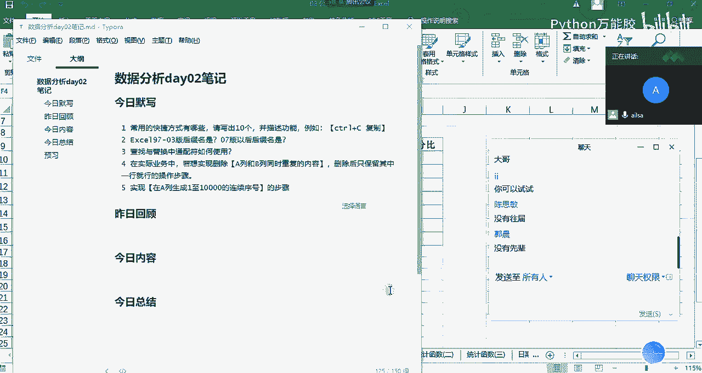

好吧，那我们进入到昨日的啊昨昨天的讲解内容哈那我在进行这一块的呃回顾的过程当中，我们采取哈我们采取。啊，提问的方式啊啊，我都没有听过大家的声音啊，所以说我这边来抽取啊人员进行一个提问哈。嗯。

首先呢我先提问一下。谁呢啊？看看啊提问件号吧。啊，建号我这边给你解除静音了。啊。嗯，能正常发言吗？helello。没建好。你。我这边需要提问，需要你回答问题啊，来吧。别不好意思，咱们就这几个人啊。

别耽误时间哈。hello hello啊，快点啊。hello hello，哎，建豪同学你好。😊，啊，好的，那我们先说一下啊，昨天哎我们讲了哪些内容呃，你这边来带着大家一起来回顾一下。哦。

那首先呢先讲了呃数据分析呃一些发展方向以及数据分析工程师的一些基本的嗯技能。嗯，好之后呢，简单的介绍下excel嗯那个软件的呃嗯就是数据表格软件的发展历史啊，然后呢详细介绍了excel嗯。

那是电子表格哈。点电啊，发展历史啊，还有呢。然后呢，就是想细接下来excel是怎么从这些中拓颖而出的啊啊，对啊，您接着说。呃，然后呢呃就是开始介绍excel这些操作了。这实基本概念什么是工作部啊。

工作部嗯。工作表啊以及一些功程区呃数据啊等等。呃，单元格一些概基本概念。嗯，好那我们讲到工作表的一些操作的时候啊，大概都有哪些，还记得吗？呃，就是移动复制啊，移动给他加加颜色嗯，还有呢添加颜色。嗯。

我我简简单整继续记一下对不对OK啊重命名。OK没有OK哈啊，那呃这个其实不用记哈，因为在我们工作当中用手了，其实啊都知道了啊，还还有吗？嗯，之后就开始讲一些快捷键。嗯，OK快捷键是吧？嗯啊。

那我这边简单提问你一下，我们对于快捷键啊，对我我只提问几个，因为我们今天已经默写过了哈。呃，首先嗯如果说我想啊快速选中某个区域啊，就是某个区域，你有哪几种方式。呃，选中的话就ctrl加shift呃。

然后剩下左右嗯。啊，不不啊嗯，是全选吗？啊，就比如说我想选中前两列。呃，就是鼠标直接点。前两天。嗯。啊，那OK哈哦我这样吧，我我现在打开excel哈，我们打开我们昨天的啊这样的一个去回顾会更好一些哈。

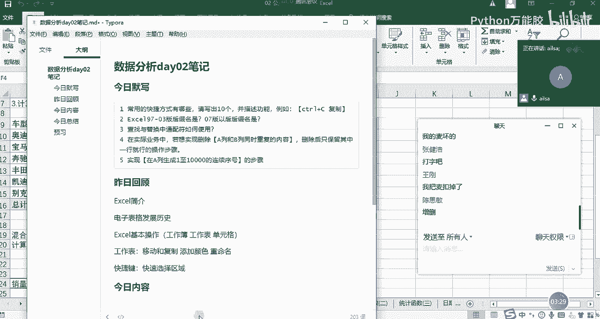

嗯，我看一下。啊，我们的快捷键。稍等一下。

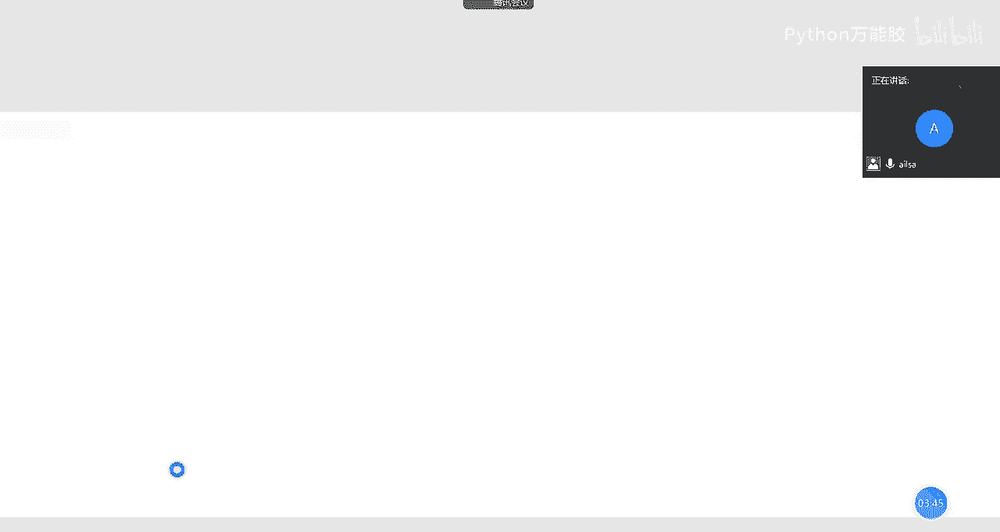

哎，你比如说我想选中啊前三列，然后包括下面所有的行，我该怎么去操作啊，ctr shift加下啊，ctrlshift加下哈啊，我给你纠正一个小的点哈。就是如果说我们在快速选中某一部分数据区域的时候。

没有向上的箭头啊，只有下和右。明白了吗？对，只有不按住shift键的时候，是control加上下左右箭头去定位到我们数据区域的各个边角，明白了吗？哦，对啊，您刚才可能说的啊有点啊有有有点模糊哈啊。

所以说快速选中区域是啊我们可以先啊conttrol加shift啊，shift，然后再加向右或者是向下的箭头，对吧？对，向右向下对，向右对向下箭头啊啊啊。

然后如果说我想啊选中啊选中呃一个数据区域的啊啊就是边边就是四个角啊，四个角。啊，该怎么实现？嗯，cttrol加加上下左右啊，对，control加啊上下左右啊，箭头啊，这样的哈OKOK您的提问就到这里哈。

接下来我要换一个人了。嗯，这是我啊可以了，你可以关麦了。嗯，OK那这其实就是我们的嗯就是excel基础操作啊，大开大家都可以掌握这些内容就可以了。那我们的快捷键包含啊比较基础的。

然后还有就是啊其他的一些啊，大家只要掌握自己熟悉的就行，没必要全部都掌握哈。OK那我们在接下来另外一个知识点的话，就excel的啊操作技巧。啊，下面我要再提问啊一位同学哈。啊，我们看一下啊，看一下。嗯。

想想啊。那就饱贺吧。宝贺，我已经给你解除静英了。hello hello，哎，helo啊，宝和同学，我感觉我有点像博主。😊，は。是吧OK那您说一下，嗯，我们在讲excel操作技巧的过程当中。

咱们昨天都讲了哪些东西？嗯，操作技巧有嗯定位定位定位的快捷方式是。传说加G对，还有吗？嗯，还有那个呃快速填充啊，我说看定位的快捷方式还有吗？啊，还有个F。12还是F5啊，F5哈对吧？F5OK啊。

您接着往下说。嗯，接下来就是那个选择性粘贴啊，选择性粘贴。选择性粘贴我们在昨天讲的时候都有哪两个应用场景啊？嗯，一个是工资工资的加减，嗯，就是说集体的工资加减嗯。还有吗？还有还有一个就是。呃。

统计呃是删除公式吧。嗯，对嗯对你你描述第一个问题的时候，我们应该这么去描述。就是说我们在对某一列数据进行一个呃呃集体更更新的时候，我们可以选择选择性粘贴粘贴当中一个计算的方式叫加哎。

这样的一个方式去实现。当然你可以选择其他的公式去计算也可以实现。那第二个选择性粘贴，就是我们在进行excel的处理当中，有一些公式。哎，我们需要去除啊，这个时候我们可以选择选择性粘贴粘贴值啊，对不对？

嗯，是吧OK啊，对，定位选择性专题还有吗？还有那个查找查找和替换查找与替换啊，查找是那个conttrol加F替换是control加一致。嗯，OK哈，这个我们还会讲了通配符的查找和替换是吧？对。

比如那个星就是说匹配零个或者多个嗯，问号是匹配一个字符。OK好的啊，还有吗？还有就是日期啊，日期时间格式是吧？对嗯，业格式OK这个可嗯，您说。啊，你说你说你说啊，您您说就可以了。😊，对。

就就是那个日期格式可以直接通过那个嗯转换。OK好那个嗯。对，OK好的，等会儿我会再重新演示一下这个这个内容哈。因为有更简单的一个方法哈。好的，日期时间格式啊，还有吗？😊，还有还有驱虫啊，去重复值是吧？

对，是O去。重复制好的，还有吗？还有还有什么？嗯，还有还有ctrol加E。啊，ctrol加E哈，这个是一个快捷方式哈啊呃这个不是我们呃我们昨天讲的内容啊，也是哈。

但不是一个啊那个啥可以可以可以写contrl加E也是个很强大的功能哈。还有啥啊，有人已经给你提示了啊。😊，看一下。我看一下。😊，嗯啊分分类啊，就分裂合并分裂与合并是吧嗯。我们昨天讲了7个哈。

123456还差一个。差还差一个是什么还差一个什么定位选在那边。啊，快速填充啊快速填充。对快速填充。我们呃讲的一个呃原理是什么呀？呃。

原理的话就是有一个选项里面有那个嗯定义或者那个excel带的定义的一些啊设定好的一些就是。选项吧OK就是如果说你想实践实现自己的一个日常的一个需求的话，可以自己来定义，对吧？哎。

因为它系统默认自带了一些常用的啊，然后你可以根据自己的一个需求，然后进行自定义的啊呃形式去实现，对吧？对，O哈OK您可以关麦了啊，谢谢。嗯，好的，再见。😊，好嘞哈。

那其实我们刚才啊那个啊建浩和宝浩已经带着我们回顾了昨天要讲的内容哈。昨天已经讲过的内容啊，其实我们可以发现也不是特别多。然后在大家掌握的也已经很好了，也已经很不错。然后啊怎么着。

听不见啊啊那个OK那我们在啊昨天的内容，我再稍微补充一个点哈，就是啊刚才说到的啊刚才说到的一个啊啊日期时间格式的啊那个操作，我再给大家重新演示一下。

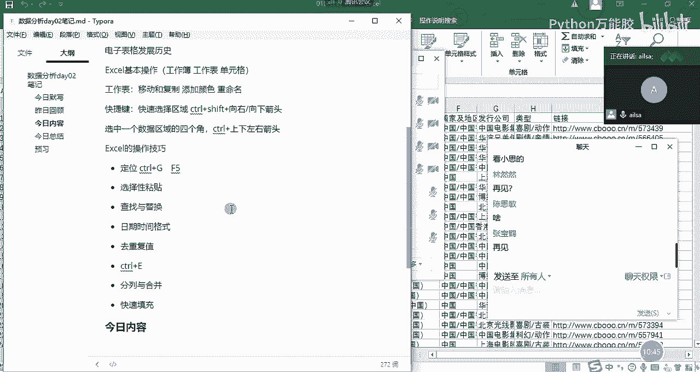

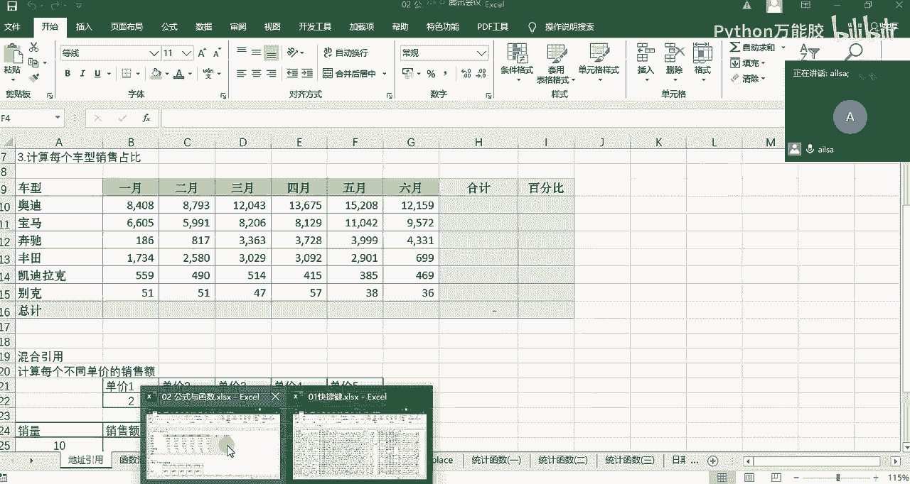

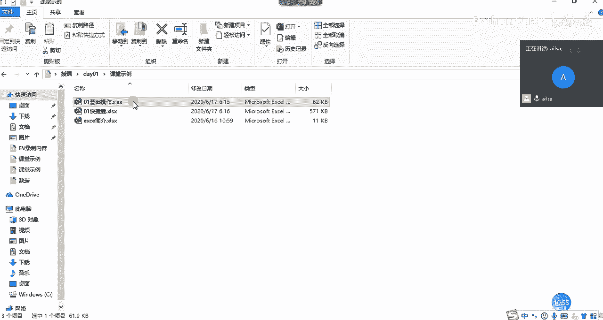

啊，我今天专门把文件又更新了一下哈。因为昨天本来想演示的啊，但是啊呃现在网络状况怎么样？啊，如果可以的话，大家给我扣个一，我这边显示网络状态不佳。

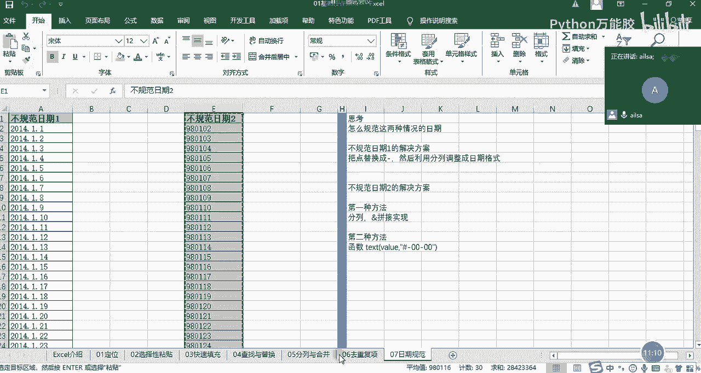

同志们。啊，O啊O那我们在昨天讲这个日期啊，我们要对它进行一个呃格式调整的时候，我这边采用的是分裂，然后步骤比较麻烦啊。但是其实随着我们版本的不断更新，它整个的一个呃呃就是实现的方式也越来越简单。

越来越智能。那对于这样的一个形式的话，我们可可以采取这样的一个分裂形式，就是在我们的数据选项卡下面还是选择分裂。那在分裂的过程当中，我们可以选择固定宽度啊，也可以什么都不选。然后我们点击下一步。

这个时候我们就不在这里做任何操作了。也就是说我不用进行下拉了哈，不做任何操作。然后再点击下一步，这个时候我输出的时候输出日期格式点击完成。大家可以看一下，它已经完全就可以识别出来。哎，这是一个日期。

然后并且知道你想要做什么啊，这样的一个过程。所以说我简单补充一下啊，我们昨天讲的一个小点，好吧。

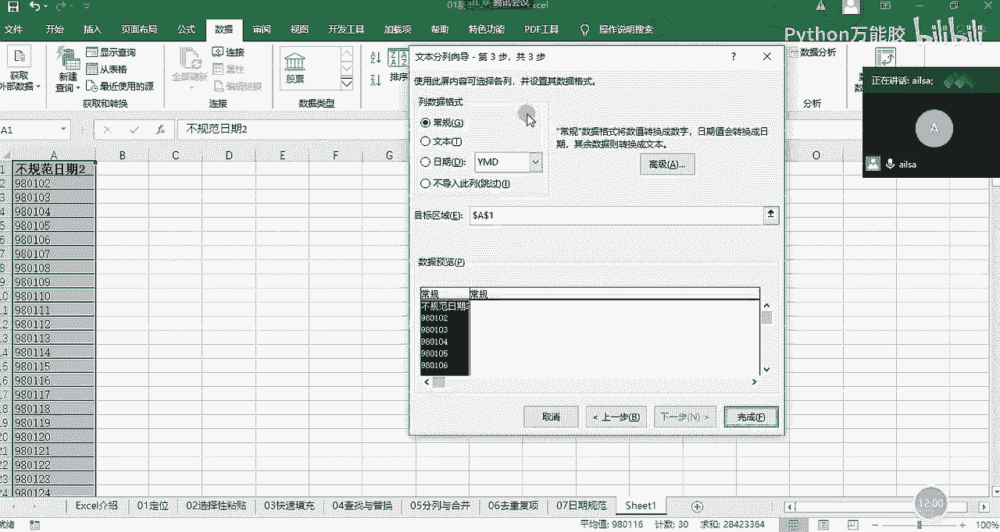

啊，这个听明白了吗？啊，听明白给我扣个一。同志们。OKO哈，可以了哈。嗯，那我们啊昨天的内容回顾已经讲完了，接下来我们就讲解啊今天的内容。我们先看一下今天主要讲什么内容哈。

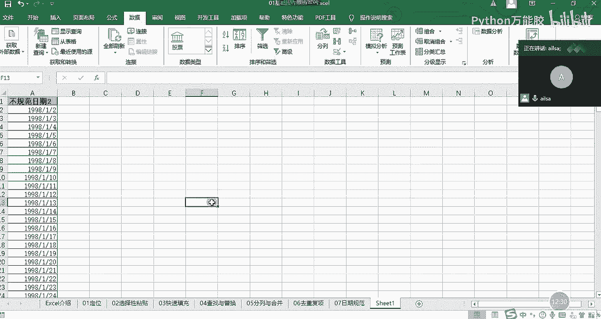

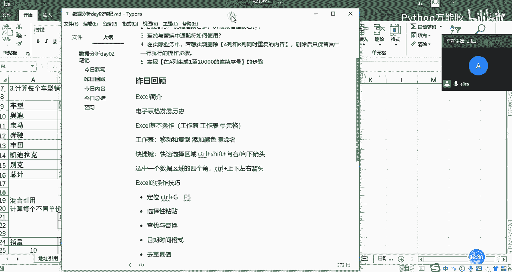

我们先看一下今天讲解的内容。今天讲解的内容主要分两大块啊，我把我的大家的一个呃聊天调出来OK。

讲两大块内容。首先第一个啊就是我们的公式与函数。本来是要嗯昨天下午去讲的啊，但是因为它也比较重要啊，加上我这个嗓子又不是特别好。所以说啊我说放到今天上午去讲效果会更好一些。公式与函数啊。

这是我们讲的第一个大块。第二个的话会讲一下数据透视表啊，这两个大块的内容。那公式与函数，我们会讲哪些呢？可以看一下我这个的一个知乎的文章，我们大概会讲这么多。我复制过来啊。

我们会讲它的一个公式与函数的概念。公式与函数的概念。然后我们会讲一下什么是运算服务，然后以及啊我们单元格有地址，对不对？那我们对于地址的引用是怎么样子的？然后以及我们接下来就讲函数了。

那函数呢它有不同的分类，它可以分为逻辑函数、文本函数、统计函数以及查找和引用函数，还有最后的一个日期函数啊，这么多内容，这是我们公式与函数的讲解内容，那数据透视表，我们要讲什么呢？我们看一下。

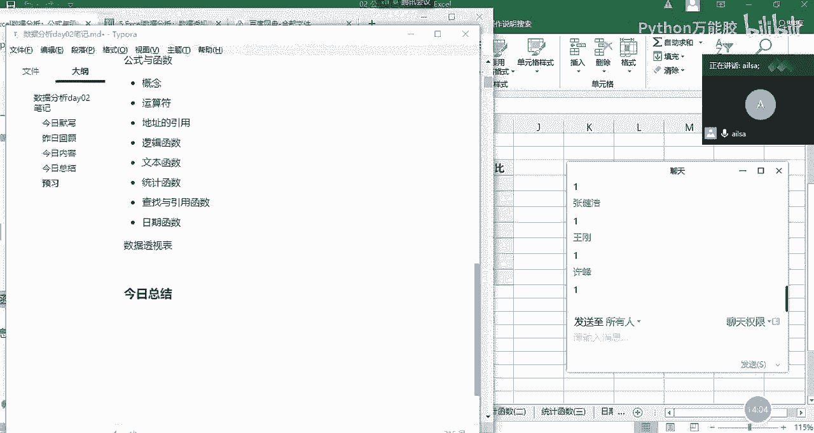

数据透视表的话啊，我们大概讲的内容啊也比较啊也算是比较系统一些了。就数据透视表的内容基本上都在这里了。我们会讲一下，我把它复制过来。

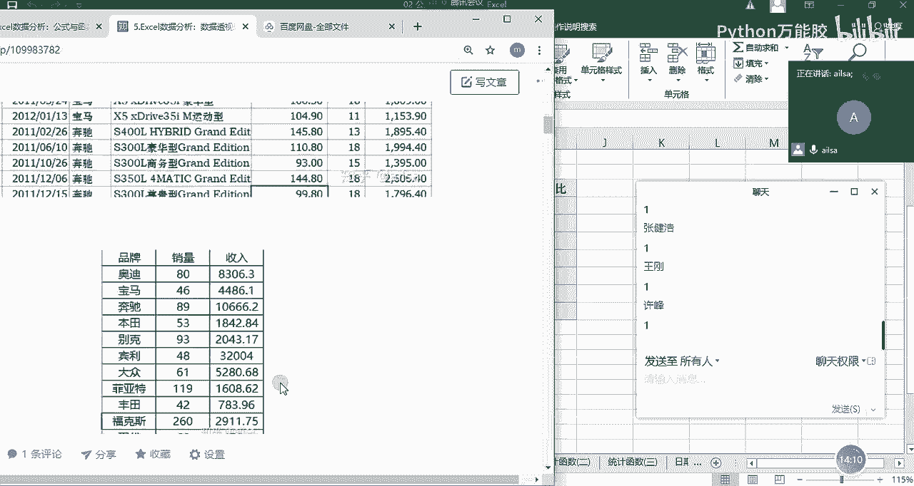

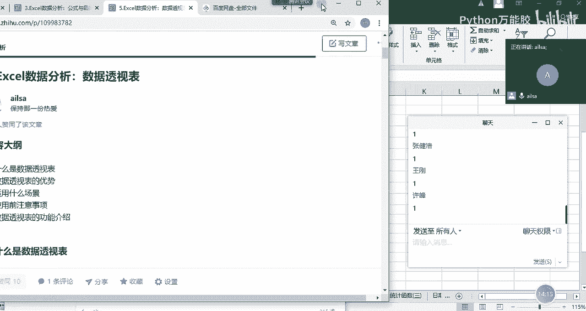

我们会讲一下什么是数据透视表以及数据透视表的优势有哪些？然后适用场景啥的注意事项，还有数据透视表的功能的一个介绍。那我在讲数据透视表的时候，我会结合我们实际的一个呃工作场景。

然后给大家进行把这些知识点进行串联起来就可以了啊，这就是我们今天要讲的内容。如果说我们讲完了之后，还有时间，那我会把昨天的作业给大家再讲一下。因为我们是呃首届学生哈，所以说啊不管是作业啊。

我布置的作业还是我们课堂上的知识点都会以最详细的呃讲解方式给大家给大家全部讲完，然后以防这后面的后面的学弟学妹去进行一个系统的学习哈。好的啊，那就是昨日回顾和今日内容我已经说完了，我现在要断一下我的。

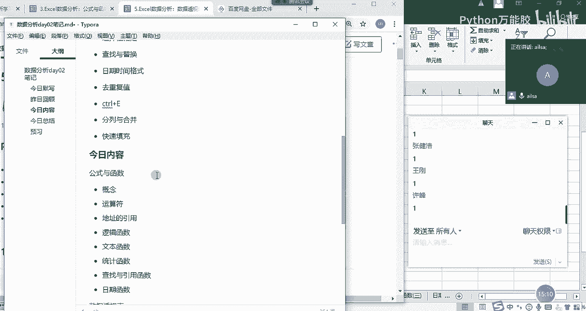