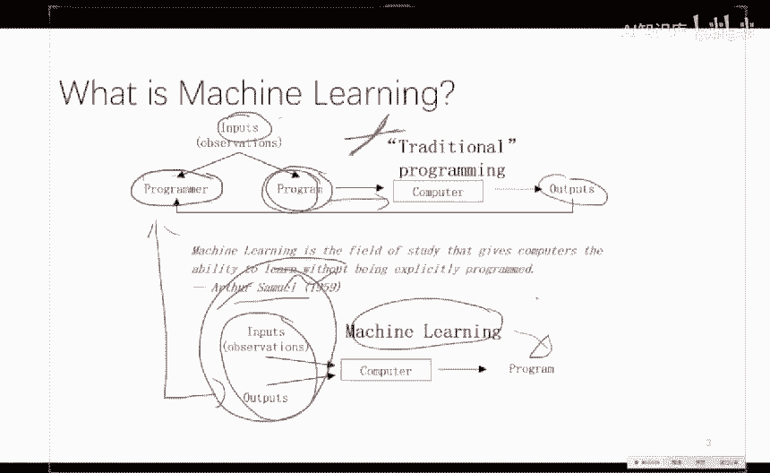
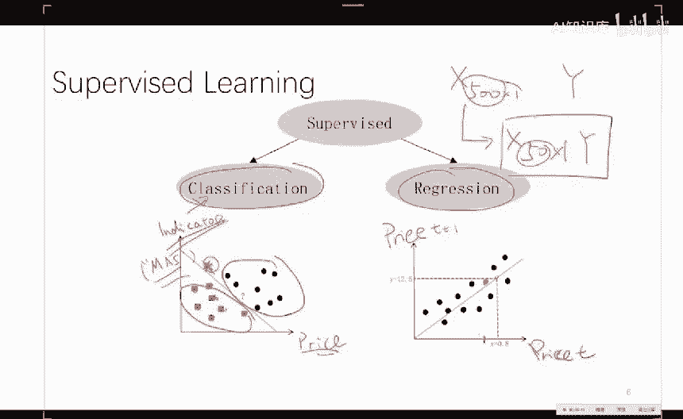
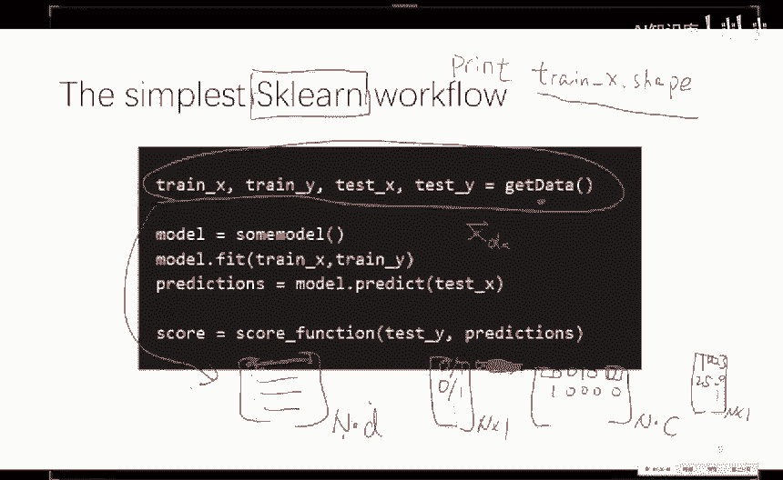
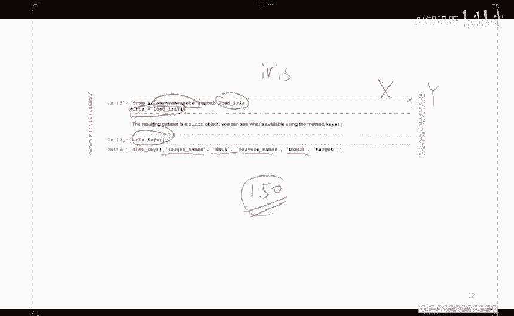
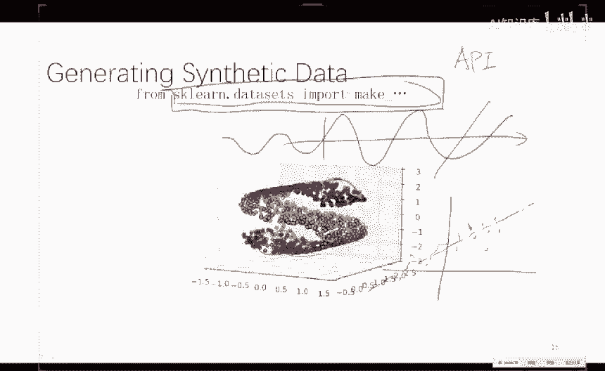
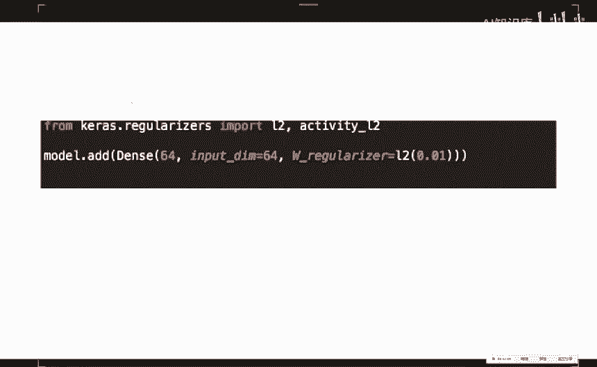

# 这可能是B站目前唯一能将量化交易讲清楚的教程了，不愧是计算机大佬！一天全面了解机器学习Python金融分析与量化交易实战，草覆虫都看懂了！ - P4：04用python进行金融数据分析 - AI知识库 - BV1x1421871N

OK啊先行回归图优化啊，啊对就是我我就是打算咱们尝试一遍，假设大家数学水平是高中生水平啊，不行，还是高考生水平吧，嗯嗯好好，我们上车啊好，那么就是说今天我们要讲的东西是这样，今天东西我们要讲的东西。

我们今天呢就直接从这个线性回归模型，我们一路撸到这个所谓的核方法，然后呢基于这个核方法遇到的一些问题，我要介绍一下机器学习的一个呃，最重要的一些啊一些技巧，那么主要是一个要讲这个啊这个信息回归模型。

然后要讲这个所谓的领回归，和他一个孪生的这个双胞胎啊，就是朗诵这个方法，在这三个方法，其实在目前的嗯实战应用中用的非常广泛，就是说啊不要小看这个线性模型，线性模型未必不是好啊，未必不是坏事。

尤其是当你比较聪明的用线性模型的时候，一般因为一般来说当数据量很大的时候，线性模型就能够体现出，这个呃数据背后的真相呢，你并不需要做一些啊多复杂的一些模型，另外呢啊从线性转到非线性呢。

我会跟大家介绍一个，目前也是很常用的一个方法，叫做所谓的嗯和方法，名字听着很酷很牛逼，但其实一点也不难，然后基于前面讲的这个这四个模型呢，我会着重跟大家介绍一下。

怎么样的来做这个所谓的cross validation，然后呢再利用sk learn把今天讲的所有模啊，所有事情以sk learn啊，咱们实现一遍啊，然后最后呢再从这个呃呃呃呃机器学习啊。

在啊结合我们上一节课拿到数据这件事情，我们来啊引入我们的下一个话题，就是我们这个X怎么定义啊，这个就是我们今天的这个计划，OK那我们现在开始OS就是线性模型。

Ordinary linear square，呃呃呃least square就是嗯，最小二乘应该叫应该叫嗯最小二乘吧，对就是说嗯他其实是跟线性回归模型，你可以把它看作一个同义词。

OK那么我们今天的计划就是把这些事情搞定啊，我会说的慢一点啊，然后前面前面的六张啊，骗子跟啊这个Python Python班的那个机器学习是一样的，但是我的侧重点会不一样，所以如果你啊听过那个班的课。

一定不要走神啊，因为有这东西不大一样，OK就是说经济学习是这样好，那么传统的传统的我们要编程，比如说我们传统的要做一个交易系统，我们的这个策略呢是由人工定义的，什么意思呢，我我有一个程序员。

或者说你的一个交易员，然后呢嗯你观测到了一些啊事实啊，比如说你觉得这个嗯啊，这个移动平均线这样穿过去之后，股票就会涨，你把这些规规则呢写成一个嗯if else的这些程序，你告诉这个计算机。

那么计算机看到了一个嗯，某一个规则被触发之后呢，他就会输出，他说如果输入了是MACD和啊，这个啊就就是说ma5和ma10，如果他是这样的一个关系，那么我就输输出是一个它是看涨的一个信号，如果是相反。

那么我们就看跌，那么这个是一个传统的一个编程的一个方法，OK这个是一个传统的一个编程的方法，那么机器学习跟传统的方法最不一样的地方，就是你的这个规则不是由程序员制定的，而是从数据中自己学习出来的。

什么意思呢，就是当你只要告诉我这一个程序啊，我如果是这样，那么它就涨，如果是那样，他就是低，如果又是这样，它也有是涨，如果是那样，它就是不涨也不跌，如果你告诉他大量的事实之后。

有一个程序呢就会自动生成一系列的规则，就是这个规则是由计算机从成呃，从数据之中挖掘出来的啊，那么这个有有一些好处，就是它也许挖掘出来的呃，这个规则比你一个人制定的要更科学更合理啊。

这这是因为他能够看到的，比你看到很多的这个数据，同时能够啊从高维啊，高维数据中挖掘出来一些，你只通过看这个图表，很难看出来的一些背后的一些隐藏关系，那么这个是机器学习的一个很重要的一个事情。

OK那么传统的机器学习它能干的事情也很多，比如说嗯给我一个这个啊email，我可以告诉你它是垃圾邮件，或者它不是垃圾邮件，或者输输入一个这个照片，我输出这个照片上的所有的字符啊。

就相当于对这个呃呃呃字母的一个识别，那么还有现在比较火的这个啊自动驾驶，以及这个嗯这个电影的这个推荐，那么他们这个背后使用的都是啊机器学习啊，这美妙的地方是在于，你识别这个手写数字用的模型。

比如说是SVM跟你做一个股票分类用的模型，背后的数学原理是一样的，就是说它是具有满满强的这个，鲁棒性和普适性的啊，也正是因为如此，目前的人工智能才是啊比较的火爆。

OK那么嗯机器学习大概分三种吧，一种是所谓的这个呃监督学习，就是说你给我一个X，再给我一个Y就是跟X对应的一个一个关系，它可以是一个值，也可以是一个啊类别，就是可以说看涨，可以说是看跌。

也可以是具体是到底是多少钱，OK这个是所谓的监督模型的这么一个框架，第二个呢是所谓的非监督模型，这个就是我给大家的啊留的这个作业二，就说我有很多的时间序列，你能不能自己的给我找出来一些聚类啊。

发现这两个股票是一组，那两个股票是另外一组，这个是非监督的，就是说你没有交给他一些啊，这个Y值的这些信息，我直接从X值里头，我们能能不能自己发现一些规律，O这两个呢是比比较像的一些事情。

因为它们的区别仅仅仅在于就从输入来看，它们的区别仅仅在于有没有这个Y值好，那么这个另外一个是跟跟量化有关的呢，就是所谓的这个强化学习，强化学习，这样你有一个环境，这个就是相当于你的大盘啊，然后你有一个。

你这个就是你这个一个一个一个一个交交易员，那么你呢要不断的给环境一个action，就是说你给环境一个买或者卖的一个一个行为，这个环境内会返回你基于这个action，它给你的reward。

那么你要干的事情呢，就是说我们怎么样的选择一系列的这个action，使得这个reward最大啊，这个是所谓的强化学习的一个啊，具体的这个假设，那么你可以看出来，强化学习跟前面这两个都都不大一样。

那么它所需要的这个啊，数学模型也是截然不同的，是叫做马可夫决策过程，Md p，这个可以大家嗯嗯就是啊回去可以先预习一下，就是所谓的马可夫决策过程啊，而强化学习，就是说我通过很大量的数据来学出来。

这个马可夫决策过程，它的这些参数是什么，就是Mark of，Decision，这个马可夫决的过程是一类非常强大，和能解释很多事情的啊一大类啊啊啊啊过程，那么就是说啊啊啊啊啊，就是啊。

很多的强化学习算法都是基于这个假设啊，在做的好，我们接着往下走好，那么这监督学习其实嗯还是嗯比较，是最简单也是最重要，同时呢也是工业界应用的最多的一类模型，它可以分两类，一类是分类，一类回归分类什么的。

比如说我这个X1是他的这个price，这个X2呢也有可能是，我们在下一场会着重告诉大家，怎么样算很多的东西，比如说你这个可以比如说你可以想成为五，那么每每一个这个金融产品呢。

它其实比如说你你可以在这个平面上，把这些点给它画出来，那么如果在这个区域的呢都是看涨的，在这个区域的呢都是看跌的，然后那么我们来了一个新的时间，序列中的一个点，我们计算了这两个维维度的这个值之后。

我们把它划到二维平面上，那么分裂问题就是说，如果我们给定了很多的历史数据，我们怎么样的对一个新的一个点，来来判断这个时间点所对应的嗯，这个这个点他应该是看涨还是看跌的，OK那么回归问题呢。

就是说呃比如说它是一维的，它仅仅是一个price of price of tea，然后这个是你的price of嗯，就是嗯T加一啊，就是说那么嗯嗯这个呢就是一个回归问题，就是说我你给我一个时间。

那么我需要预测出来这个时间，我对应的下一时刻的这个啊，这这个价格应该是多少，你不要告诉我是涨或跌，你要具体到一个具体的一个数，那么这个就是所谓的啊啊回归问题啊，那么分类问题和回归问题。

在这个量化中都是极其常见的，嗯就是嗯嗯嗯就是极其常见的两类模型，基本上啊，我们在今天跟今后的作业中都会遇到啊，啊关于这两个事情，大家有问题没有，OK好，那么我们接着往下走哈，啊当然在再好好先看这个。

那么非监督学习是什么呢，非监督学习是比如说我有一个嗯，就是说我在一个平面中，比如这个维度是300，这个是一个300维的空间，就是每一个点，它对应的是一个300位的一个向量。

比如这个X它是一个3001的一个点，就这个小红点，它的里头的值有可能是price of a t减一，然后price of t减二等等，还有你计算的各种的啊，这些指标的一些值啊等等。

你大概总结了有300个，这个所谓的这个指标，就是针对于每一个时间点，你大概总结了300个指标，那么在300维空间中，我们建立了很多的，就是我们从你你今天所建立的这个数据库中。

你抽取了很多300维的这个点，比如说你一共抽取了啊1000万个历历史记录，那么就是一个1000万×300为的一个大矩阵，它每一行对应的是一个时刻的一个啊。

你计算的这么一个呃呃feature vector，那么我们非监督学习要干的事情，就是说我怎么样的呃，用聚类的方法，就是用一种聚类的方法，我们把他们啊就就发现这些啊，是啊是啊，时间序列归一类啊。

然后这些时间序列呢是另另一类，那么嗯这样做呢是没有一个监督信息的，你有监督信息做也没有问题，但是非监督学习呢嗯他比较重视，就是说在我没有一个监督信息的这个情况下，我怎么样把这个聚类给做出来。

OK那么这个compression其实呢呃是所谓的这个降维，就是说我们现在这个不是300维吗，300维我能不能给他降成一个啊，200位，或者说是20维，甚至是两枚，我如果是两维，我就能画到平面上了。

对不对，如果是20维的话，我的目的是什么呢，目的是我这300维，但这些feature是我自己拍脑袋想的，我今天想起来一个我撂进去了，明天我又想起来一个，我又撂进去了，后天呢我把这前两个呃乘了一下。

我又变成了第三个，我又撂进去了，就是我撂了很多，有可能是很冗余的一些这个这个特征啊，就是说我这个300为我这个300维中的某些列，有可能是非常冗余的，或者说是它是没有意义的，比如说我第298列，我我啊。

我认为的这个feature是我今天早上吃饭没有，那么这个肯定是跟股票是没有关系的，我们怎么样呢，通过一种压缩的手法，或者说降维的手法，把别人定义好的一个高维的一个，一个比较粗略的一个估计。

来给它压缩到一个所谓的流行中去，叫做啊流行，这个是一个很数学的一个呃呃说法，其实你可以就是嗯嗯，这也是一个很就是你你其实你能理解的，在低维空间中，用另外一个点来来来进行有效的表示。

也也就是所谓的叫低维嵌入，嵌入嵌怎么写，Embedding，就是说我怎么样呢，呃用低维空间中的一些点来体现一些，其实看似高维，但是其实它的本质是在低维空间中，一个流行上的一些点O啊，还不是投影啊。

投影是projection，而这个embedding是一种嗯，就是嗯更拓扑的一种说法，投影指的是一种正一般投影的话，它是跟啊正交性，就是说跟跟这个就是跟跟跟垂直这个概念，是有关的，而一个流行的嵌入呢。

它有可能是嗯比如说像这个画出来的，它有可能是一个啊一个曲面啊，一个紧的一个空间好，我们那么比如说我们要做这个啊量化的时候，我们一般来说有有可能是，我们在做监督学习之前。

我们先用非监督的方式对数据进行一个降维，降完维之后，我们再用这个分类的方法或者回归的方法，举个例子，比如说我以前是有X500为跟对应一个Y值，涨或者跌，我们先把X500先降到X五五十。

然后呢我们再做这个，就是说我们先对X进行降维降维之后，再在这个数据集上嗯，在学习出来一种映射，这个也是非常常见的一个范式，那么它的好处是，我们嗯对特征进行了一种重新的变化。

而通过这种变化能够提高我们特征的质量啊，这个是啊非常合理，而且同时我们能够大大减少建模的这个时间啊，因为有很多模型，它的这个啊复杂度是随着这个嗯，你的这个feature的这个数目啊，成一个啊啊啊。

都多项式级别的这个训练时间的一个增长。

OK好好，我们走，那么sk learn是，是啊相信大家现在已经知道了，是Python中一个非常著名和常用的一个，机器学习的一个嗯一个包，目前除了深度学习中的神经网络啊，他啊该有的都有了。

就是说一个就是他帮你把函数，已经写的非常好了，你去需要干的事情，就是两三行的调用它就可以了，就是能大大的减少你的这个啊啊，建模的这个事件，就是其实你用sk learn做实验，你会发现。

其实你数据预处理的这个代码的行数，跟可视化的这个代码的行数，是远远多于你真正建模的那七八行啊，如果你要不做这个呃块DATION的话，大概你建模的这个代码大概也就是两三行，三四行顶多了啊。

那么这个表呢是一个非常好的一个，相当于指导图，就是说嗯他来的，他的目的是告诉你具体是用，应该是用哪一个模型，因为这个网站上罗列了非常多的模型，我们到底是用SVM好呢，还是要用一个线性回归模型就行。

那么这个是一个非常实用的一个啊，相当于啊一个备忘录吧，那么就是说当我们的，比如说当我们样本点数啊还不到50个的时候，你任何机器学习的模型你都你都别想了，你就你就再去搜集比较多的数据啊。

当比比如说当你的样本点超过10万个的时候，你就直接做这个随机梯度下降的一个，线性分类器，或者随机梯度下降的一个线性的一个回归器，就行啊，那么比如说嗯，嗯当你的这个数据量在10万以内的时候呢。

那么你就可以考虑一个嗯，这个SAM的这个模型，或者是一些比如说这个nau base，尤其是针对这些文本数据，那么呃呃相应的针对于这个聚类算法，跟这个降维算法，那么他们也都有这个相应的推荐。

唯一我要补充的一点就在这儿，就他这个降维的这个手段，我不是啊，很赞同，我建议大家就记住一点就行，你如果想降维这个我在不同的场合，我应该都都强调过，如果要降维的话，对于小于3万个点的数据。

我建议你是先用PCA降到50位，然后再用一个叫TSN，就是也在SSN，TSNE给它降到二维或者降到你想要的维度，如果你要做降维的visualization的话，就是说在比嗯嗯比较小的这个数据规模下。

你最好是先PC到50位，然后在TSNE到两位，嗯嗯这两个函数呢s k learn都提供了，OK啊，唯一的原因就是，因为TSNE是嗯在降维手段中最棒的一类，但是它是特别特别慢，如果你在3万个点左右的话啊。

每一个点如果是50维的话啊，或者不是每一个点，如果是100维，你有3万个点，你做TSNE是基本上跑不完的，那么你可以先做PC，先先给它降到一个比较低的一个啊，DV流行中去。

然后呢你再用TSNE把PC的这个结果呃，做进一步的降维，如果你的点大概只有只有几百个，只有比如说是500到2000个的话，那么你就可以直接考虑用这个T的方法，来做这个呃降维的这个这个方式啊。

那么这个是我要强调的其他的这几个任务呢，啊这个表总结的都蛮不错的，大家啊照猫画虎看着用就行啊，有问题没有没有问题好，我们啊这个表你们回去回去从群里下就行好，就是你从群里下我的这个呃PDF的讲义。

你放大好，那么就是说在sk learn里头，我们要啊逐步回归，是一个非常不推荐的一个很老的统计学，习的统计学的一个方法，这个只在，嗯只在那帮在778十个点以内搞一搞，统计学的人，他们喜欢用。

但是嗯是一个完全可以被替代的一种方法，他其实就是用一种贪心的算法，来对特征做了一点点的选择，但是我们嗯有有比逐步回归，从理论上更棒的各种方法，所以我不认为在任何场所啊，嗯如果你要使用逐步回归的话。

我觉得用我今天要讲到的另外几个，线性回归的方式啊，都会比他做的更好，嗯好如果没有问题了，我们接着往下走好，那么就是说一个最简单的这个sk learn的，这么一个调用的流程，一般就是分这么冷宫啊，分三步。

第一步就是你先写一个，获得这个训练集和测试集的这么一个函数，这个是取决于这个get data是你来定义的，就是说呢你你你要做什么事，你要你就说你生成啊所对应的一些数据。

而这个training x一般来说是一个矩阵，OK就春节X1般是一个是一个什么样的矩阵，是N就是说我有多少个，多少行乘以D的一个矩阵，这个D就是我每一个每一个小X的这个维度，每个小X的这个维度。

而这个N呢是我一共有多少个时间点，就是一共有多少个N的点，而每每每一行呢就是说我这个时间点，我所提取出来的一个，我对这个时间点的一个向量，Ok，那么呃呃这个Y值呢，一般来说是一个N乘以一的一个一个向量。

它要么是零啊，零一的分类就是它可以取值为零，或者一，或者它可以取值012345啊，不不不不不就是说嗯嗯，对咱们先说零一吧，就是说如果是看涨或者看跌的话，那它就是说它是一个呃，N乘以一的这么一个零一的呃。

一个向量如果是多分类的话，它就是N乘以C的一个矩阵，每一行呢是啊，比如说我是五分类，那么它就应该是001010，那么它代表的是第三类，如果是10000代表的就是第一类，那么如果是回归问题的话。

那它就是一个N乘以一的一个实值，这个向量它是一一百。3啊，这个是25。8啊等等，那么它的这个呃呃我们在做这个，我们在做这个啊，在做机器学习之前，我建议大家都把你生成的这些玩意儿。

你把你你用一个函数叫做嗯嗯嗯，就是train，X点shape有一个小的一个debug的一个方法，就是你最好做任何事之前，你要print这个TRAX点shape，因为再多说一句，一般来说这些东西最好是。

要么是pandas的这个data frame，要么是这个南派瑞的这个方式来进行储存的，那么你就会把这个他这个shape都都print一下，就是至少要保证这个X跟Y这个函数啊要一致。

然后这个是我们的这个数据的准备过程，这是第一步啊，第二步就是说我们调用一些sk learn里的东西，就是我建了一个model，这个是some model，你这个里头你可以就是SKLEARN里的任何。

你想干的事情，它可以是SVM就是SAM一个括号就行，或者是一个比如说啊拉手，那么就是拉拉手，或者呢是一个比如说一个OLS对吧，嗯嗯都可以建立了一个空的模型之后呢，这个模型的参数就是每一个模型呢。

你可以看作是一个黑箱，这个黑箱上的这个旋钮，就是你比如说你们家这个收音机啊，如果有的话是上面是有很多这个旋钮的，有几个旋钮就说明这个模型有几个参数，而这个参数旋钮具体有多少度，就是参数的值。

比如说我们这个模型它一共有五个参数，就是它有W1W2W3W4W五，那么每一个每一个参数呢，它可以取任意的值，比如说W1看它可以取，比如张三说他是0。3，李四说A应该是0。6吧，那么机器学习要学什么呢。

它就是要通过如果我们输入一个训练集，我一个点fit，就是会让模型来学习，一组学习一组这个W的组合，使得这些这一组的W，在这个训练集上的表现是最好的，我再说一遍啊，就是说机器学习学的是什么呢。

机器学习是以一组输入的训练集为输入，它通过你指定的这个模型学习出来，或者说计算出来这个模型所对应的，所有参数的一个最优组合，这个最优组合能够使得在这组最优组合下。

这个模型在你给定的训练集上的表现性能最好，OK比较绕哈，那么但是嗯只能这已经说的是最啊，就是啊最不绕的一种方式了，那么我们学习完了之后，我们这个model呢就会存这个model。

存的就是这个model它对应的这些参数，举个最简单的例子，线性模型的参数就是这个W，就是简单的跟X进行一个点乘，那么当你学出来这个W的这个组合的时候，比如说是1。2，1。3。

我的X那么肯定也是对应的一个二维的东西，0。60。9，那么那么这个F就是一个一个简单的点乘，那么我预测Y的时候，我就直接嗯一来一个X，因为我W已经学出来了，你给我一个X，我给你个Y，给我一个X。

我给你个Y，这个因为这个W1。21。3已经学出来了，那么我们要评估一个模型的时候呢，我们用model点predict，我们做了一个这个预测，当我们给了一些新的测试集的时候，我们会基于这些测试集。

就是基于这些新的X，我们得到了一些啊这个prediction，有了这些position之后，sk learn里头，定义了各种各样的一些打分的函数，就是说你要把真实的这个测试集中的Y。

跟你的这个prediction做一个比较，就是说比如说真实集里头它是涨涨涨，涨涨跌跌跌跌，然后你预测的呢是比如说是涨涨涨涨涨涨涨涨，你全预测为涨了，然后那么它就会有一个这个打分的函数。

来评价你到底预测了百分之多少的情况下，你预测是对的，或者百分之多少下，你预测是错的，OK那么一般来说一个最简单的一个流程，就是分这么几步，我获取数据学习模型啊，学习完模型之后。

我们要对模型进行一个评分啊，如果评分比较你比较满意，你才能做下一步的回测啊，如果评分你都觉得操什么玩意儿，你回错其实也都不用做了，你就你就知道不行，但如果评分很好，你回测也不一定好，就是说什么机器学习。

大部分的时间是告诉你不能做什么，但是不会告诉你能做什么，好吧嗯好啊啊，有问题没有，啊用的也比较，就是这个这个就是说啊，一个一个降维学习的一个算法，基本上来说是嗯嗯最好是跟数据有关的。

就是最就或者说最好就是对我，我们在做一个降维的这个过程，一般来说呃，最稳妥的方法是用不同的这个降维手段，分别做一下实验，然后选出一个最好的，因为因为因为流流行假设的一个关键假设。

它其实被能被嵌入在低维空间中去，那么一个最最，但是你的这个数据源不一样，那么这个DV流行也就不一样，那么在有很大的可能是嗯，这个算法在这个数据集上表现不错，那个算法在那个数据上表现不错。

但是我个人的最喜欢的算法是TNE啊，这个局部线性嵌入算法也比较嗯，就是大家用的也比较多，但是我个人来说啊，要我选的话，我一般选TISE也就大差不差就都可以了，但是嗯嗯也但是并不是说它不值得尝试。

好吧好Y如果是多维度的话，不需要降维，就是说我们的这个回归算法嗯，就比如说我们的回归算法是完全可以，你给我一个X是五维的，2。63。8，7。9。00，一共五维的，我想学出来一个映射映射到一个平面中去。

比如说1。23。8没有一点问题，就是说我们SK论里给出的所有的这个回归算法，就是以REGRESSOR嗯嗯为后缀的，所有的这个回归问题，我们想学出来一个多维的映射是可以直接干。

因为这个归根结底其实就是一个硬一，就是一个一映射关系对吧，嗯啊啊score成绩好完全不等于回撤好，我们这个score呃跟回测是两码事，我们这个score是，比如说我们这个test y。

也是基于某一个时间点拿出来的计算的，一个呃呃呃呃呃一个涨或者跌的一个事情，而我们要做回测的时候，我们要考虑到比这个scoring function啊复杂的多啊，呃也要这个严密得多的一一系列的过程啊。

就是说score成绩好是完全不等于回撤好的，如果score成绩不好啊，我就不建议你做回测了，甚至于回错成绩好也并不一定能代表挣钱啊，他一定也要实盘的做一下啊，就相当于这个模型的这个score。

模型的这个score是小于这个back test，然后它是小于这个实盘的，好好我们接着接着往下走，那么这个是一个相当于你做机器学习的一个，果蝇的一个数据，果蝇数据就是生物学家。

所有的东西都会在果蝇上面做，那么我们机器学习做呢，这个是一个非常典型的一个果蝇的数据集，它是一些花的一些分类，一共有150种花，那么我们想对这些花儿啊，一一共有150个数据点。

然后一共有好像是3~4类的这个花，然后我们怎么样定义这个花呢，那么它就是定义了四个维度，就跟我们做这个做一个时间点那个X是一样的，我们定义了每一个X它分四维，比如说是他花的直径啊，这个花瓣的大小啊。

花是否对称啊等等，他选了四个维度，那么每一个花呢，就可以以一个四维的向量做一个表示，就相当于我们只要有了一个向量化的一个表示，之后，我们就能建立一个数学模型，你给我一个X。

我告诉你他是01234中的哪一类，那么这个是一个非常典型的一个数据集，在sk learn里，它是内置的，你直接就用这个，你看这个是他的这个呃，呃呃这个这个这个非常著名的这个数据集，长的样子。

它就是一共有150个点啊，它一共有四个维度啊，每个维度是一个实数值，然后它对应的这个类呢是0~4类中的一类，OK那么我们用sk learn来调用的，其实一句话就出来了。

因为这个SKN这个包已经内置了这些数据，就是你只要用这个sk learn点DATASET，Import load is，这个艾瑞斯就是这个花名啊，就是这一这一类花的这个这个名字。

就是因为它数据集很很有名，他甚至有了自己的一个名字，就叫艾瑞斯赛，那么我们把这个载入之后呢，我们就会得到了相应的这些一个一个字典，一个字典里头它不同的这个值，就是我们的这个X跟这个Y值。

就是说如果大家要做这个一些机器学习的，这个尝试的时候，这个是一个蛮不错的一个数据，那么但是它的就有一个问题，就是说它的啊数据集太小，它只有150个点，这个是做统计的人就够了。

但是做机器学习的还是觉得实在是太小了啊。

那么相应的呢还有一个数据，就是所谓的这个手写数字识别，那么这个是嗯应该一共是有6万个，6万个点，就是6万个点，每一个点，它是一个28×28的一个矩阵，就是它一共有6万个28×28矩阵。

那么嗯每一个矩阵呢，就代表了一个小的这个图像，因为我们买一个28×28的一个矩阵，如果它是以0~255啊为一个值的话，那么它其实就是一个黑白的一个图片，就有专门的函数。

可以帮你把任意的啊啊一个矩阵给你画出来，就是他画的规则就是啊零是啊，应该是白色，255就是纯黑，如果是比如说30，那就是比较灰的一个颜色，那么呃呃如果你只有，这只是一个平面上的一个矩阵的话。

那么它就是一个黑白的图像，这个也是啊你们的这个比如说BMP啊，这些格式背后的编码的一个方式好。

那么这个数据也就是说我是0~9，它要分十类，那么我给你一个28×28的一个矩阵，已经学习出来一个分类器，告诉我他是零还是一还是二，那么这个是一个极其重要和经典的一类数据集，它也有一个名字叫mini。

他也是这个所谓深度学习的三巨头之一，在90年代的时候，自己辛辛苦苦搜集出来了这么6万个字，在SK那里头也能直接调用，但是SK2里头他把这个压缩了一下，大概压缩到了几千个，然后它是8×8的。

就是我们现在在这个里头出来的，是一些8×8的矩阵，所以你看到他这个分辨率是要小很多的，那么也有很多这个实验基本上都会汇报一下，他在这个数据集上的一个表现性能，目前做的最好的应该是99%点。

九几就是99%的，9。9的这个准确率啊，那么这个也是做的是，就是大家在这个数据上，已经把这个数据基本玩坏了，就是你你你平时玩的模型，如果不做深度学习的话，是不可能避得掉的啊。

OKOK那么我们还有一个我们在做实验的时候，我们也会经常的要，比如说尤其是我们做这个做量化的时候，我们有可能经常的，比如说我想生成一些周期性的数据，这个数据是一个人造的数据，怎么办啊。

sk learn它有一个非常好的一个接口，叫做sk learn，点dataset import make啊，你能make这个classification，也可以make regression。

就是你能自己造出来你任意想的一个分布的，满足某种分布的一些图像啊，一一些点，然后呢你如果造出来一个数学题，你拿出来一些当当训练，再拿出来一些当测试，来验证你这个模型是否合理啊。

那么这个是一个非常棒的一个数据，它甚至能比如说你比如说你我你可以告诉他说，请你给我造出来一些点，这些点呢以这条直线为中心，然后它均匀的呢有一点点，一点点的这个高斯噪声没有问题。

他就能立马就能给你造出来啊，就是说它是一个非常方便的，一个做实验的一个数据，比如说嗯嗯嗯，请你在三维空间中给我造出来这么一个S的，这个形状，然后呢要求他在这一头呢啊都是这个零类，这头呢都是一类啊。

中间呢大概是一些其他的类别，没有问题啊，用SK2能够非常便捷的用一行就能调出来，这个我也希望大家回去看一下，他们这个官方的这个API的这个文档啊。

就是啊对SQL dataset import make啊啊。

那么我们这个再再复习一下，我们这个监督学习的这个这个流程，就是说我们啊有一个训练集，训练集，这里头有X有Y，然后你把X跟Y放在一个模型里头进行训练，训练完了之后呢，我们在测试集中。

我们拿出一些X让这个模型进行预测，然后你预测的这个预测值，跟我们在测试集中的这些Y就是x test，跟y test做一个比较，就一个evaluation，然后挑出来来来验证。

你这个模型在他没有见过的数据集上，表现性能还行啊，那么这个是最简单的，不带cross validation的一个啊啊一个方法，那么也有很多人犯的错误，就是他直接在这个上面做完训练之后。

在这个上面做了一个评估，就是我这又对这个训练集中的XT，做了一个预测，跟训练集中的YT做了一个比较，然后说哎你看我在训，我学出来这个模型，在你给我的数据上，它的误误差为零，那你敢不敢用呢。

你肯定不敢用的啊，因为这个就过拟合了，OK这个我之前也讲过好，我们接着往下走，那么就是说从从sk learn提供的接口来说，它所有的啊模型都长得是这个样子，就是说你任何一个estimate。

就是任何一个分类器也好，回归器也好，一个降维的东西也好，你都要有一个S表fit你的这个training x跟tiny，然后你再estimate点这个predict，你的这个x test。

然后呢你再有一个s matter点score，那么这三句话呢，是你今后不管是上课还是课程结束之后，你要反复写的三句话啊，就是说这个是一个啊，呃sk learn给这个做机器学习的一个一大贡献。

就是它提供了这么三种非常简洁和用户友好的，这个啊这个抽象的这个奇函数类，就是你一切的模型都，就就是说你你自己写一些的，今后的一些新模型，你也应该按照这种流程来做，会比较的简洁和清晰和明了，OK啊好。

那么关于啊前面的这些嗯，事情大家有问题没有，应该没有好，那我们那我们接着接接接接着往下走，那么今天呢我就要给大家介绍，从这个线性回归模型，一直到目前最前端的大家在用的这个，你可以想象成高级，线性。

模型就是说从最简单的这个OS，就是嗯对最小二乘，一直到我们现在工业界和学术界，大量使用的一些线性的方法啊，嗯在量化中是非常啊好使的这么一类东西，那么我们今天来给大家看一下，因为我最担心的是。

如果你自己去看维基百科的什么朗诵啊，看维基百科的这个啊领回归啊，看维基百科的，更尤其是看维基百科这个所谓的核方法啊，你看到第第三段的时候就想放弃了，那么我今天的目的就是我给你说一遍。

他们背后的人话是什么，然后你再回去再去看，你就明白啊，他原来是想说这么一个简单的事情，这个Y值不一定是某个股票的价格，是你想你做建模的时候，你想干的任何事情，就是你想预测的任何事情。

而预测某一个时刻的价格呢，是一个嗯或者某一个时刻的一个回报，和这个是一个啊蛮常见的呃一类任务你可以做，你可以做任何事情，就是你对吧，不一定是某个股票的价格啊，好那么我们先来看一下这个线性回归模型啊。

线性回归模型是这样，就是说我们有一个Y对不对，我这个Y等于什么呢，线性回归认为Y应该等于这个啊啊啊啊，X乘以theta，对不对，这个theta呢就是我们的这些，就是说比如说嗯我Y值就是我样本点是N个。

或Y是N乘以一的，X是N乘以D的，就是D就是我这个X的维度，这个C的是一个D乘以一的一的一个向量，就说我是一个一个Y，是一个N乘以一的一个向量，然后我们的线性回归模型认为这个是一个矩阵，N乘以D为的。

然后乘以这个这个这个c theta，theta是是一个D乘以一维的一个参数，那么就是一个训练集中的所有点成了一个向量，得到了一个新的向量，你看他这个维度也是D和D是一样的。

所以得到的是一个这个N乘以一的，这么一个一个向量，那么它的这个几何解释就是嗯，跟Y是一种线性的关系，那么学出来这个参数呢就是一个所谓的平面啊，就是一个或者一个超平面，如果用一维的，比如在一维空间里头。

它就不是个矩阵了，那么在一维空间里头，如果这个是X，这个是Y的话，那么它就它就简单的是X乘以一个小C的，这这这两个就都都是实数了，它就不是向量了，再加一个这个他的这个截距的这一项。

这个结局这一项一般来说比如说是B，那么如果我要把它写成嗯这种点乘的方式呢，我一般来说是给X加一个常数项，就是X跟一点成了一个C呃，呃跟B这样的话，我就能把这个东西整个看作一个C的。

我就能就就能写成一个比较简单的一个形式，就是Y等于X乘以C的，那么这个是线性回归啊，这个这个是最最简单的线性模型，那么线性模型呢它它是有一个闭式解的，就是说我们如果有一个线性模型。

如果你认为这个输入和输出，满足一个线性关系的话，这个C塔你是直接就能算出来的，这个算出来怎么算呢，就是你训练集的这个X的这个矩阵，它的转置乘以X，他求个逆再乘以X的转置。

再乘以训练集中的Y就是他是一个B世界，这个是很酷的一件事情，那么比如说我们有一个嗯10万个，十十万个点的啊，50维的这么一个矩阵啊，那么你就对这个矩阵，你啊矩阵的transpose乘以。

他的话就变成了50×50的一个矩矩阵了，就一下子就把10万×50的这个东西，变成很小的一个小矩阵，那么你对这个小矩阵，你再去求一个逆，然后再乘以它的转置，再乘以Y。

你就会得到你要的这个线性模型的这个参数，OK关于线性模型有问题，没有线性模型一定不能有问题，如果有问题，后面就听不明白了，线性模型大家应该都没有问题吧，对好嗯，嗯好好好好很好很好，我很欣慰啊。

那么线性模型是这样，这个我今天要跟大家讲一讲，这个传说中的这个所谓的领回归呢，还有这个传说中的被捧上天的这个拉，so他们是怎么来的，就是说我真正的从这个啊历史发展的这个角度，咱们来看一下这个事情啊。

因为我离学术圈比较近，所以我知道啊，不用说这也不是我编的哈，我们来看看，如果你是一个很聪明的科学家，你能不能把这个事件给推出来啊，那么我们今天就尝试着自己，把接下来的这个领回归给他撸出来好吧。

那么好我们走走看，因为真正的了解一些嗯，比较高级的这个线线线性的方法，对你在在选择一个模型中是至关至关重要的，OK那么我们来看，就是说在一些搞数值分析的一些人，在做这个线性回归的时候。

他们发现了一个技巧，就是任何一个程序员他都知道，如果我要求一个矩阵转置乘以矩阵的逆，有的时候呢这个这个矩阵的转置乘以矩阵之后，它很可能不存在一个，你就说这个矩阵是一个病态的一个矩阵。

OK那么我们如果一个病态矩阵，他要求你，他求不出来，你怎么办，一个最经典的一个trick，就是说比如说我这个是3×3的一个矩阵，那么如果他的逆不存在的话，一般来说我们可以干的一个很小的trick。

就是抱歉哈，我们能干的一个很小的一个嗯，很有效的一个trick，就是我们在对这个矩阵加上一个，比如说0。1，0。1，0。1，然后对角线元素是0。1，其他地方的元素都为零的这么一个矩阵，你把这俩加起来。

你再求逆啊，就能求了，这个是能数学上啊，就是这个数值分析是能证明他确实是啊，对矩阵的球迷是有帮助的，这个本来呢，这个本来是一个计算上的一个trick，问题来了，问题是人们发现呢我们如果用了这个公式。

就是这本来是一些搞数预算的一些程序员，就是不能叫程序员，就是一些搞数据计算的人，认为我本来的本意是想算一个线性回归模型，我现在用了一个这个小技巧，来逼近一个线性回归模型。

那么作为一个原始的一个一个想法是，那它的性能很可能不如它，对不对，这个是一个很自然的一个想法，但是问题是如果你这样做了，往往比你不这样做的性能，在测试集上的表现还要好，那么这个事情就有意思了。

我再说一遍哈，如果你加了这一项，你求出来的这个theta，在你把这个C大，再放到你这个线性回归这个模型中去，你会发现它的性能呃，在这个测试集上是比纯粹用线性回归模型的，这个B世界要来的好的。

唉这个事情呢，那么这帮数学家就就就开始想了，那么他们想的第一个结果就是什么呢，就是说我们其实线性模型，线性模型这个theta是怎么推出来的呢，线性模型的theta就是说请你给我找一个C。

这个C塔呢是让这个Y减去XC，他的这个transport乘以Y减XC，它是最小的，就是说啊x theta是预预测的，这个数Y呢是真真实的值，然后这个transpose乘以它，其实就是说它的平方最小二乘。

也就是从这儿来的，就说最小二乘，就是说我是想要呃得到一组这个theta，使得这个东西是最小的，就是说我想得到一组C，它使得这个函数这个这个函数是C你不知道的，只有C塔，你Y你是知道的，X也是知道的。

那么就是说啊，最小二乘的这个二乘就指的是他这个平方，就是呃你如果用矩阵表示，就是它的转置乘以它自己，那么这个是最小二乘的所谓的这个cos函数，那么这个东西的cos函数，我们逆推一下就能推出来。

如果我要minimize这个函数的话，我如果要让这个函数最小的话，就是说嗯最小二乘的这一项加上一个呃，呃就是相当于这个C，他就是C的这个平方向，前面成了一个德尔塔平方的这么一个系数。

如果我们想要这个只要C它最小的时候，我们就能推出来这个C塔的值应该是它，那么我们怎怎么推呢，很简单，就是所谓的求导就行啊，导数对这个导数就是什么意思呢，什么意思呢，就是说我们要干的事情。

是我们要干的事情是最小化这个函数，最小化这个函数是以它以这个C塔为变量，那么我们怎么办呢，就是让这个函数对theta求偏导，然后求完偏导之后让它等于零就行，那么呃JC他对theta这个偏导。

就是你把这个定义写出来，然后呢你在把它展开，然后呢你再对theta这个变量求偏导，求完偏导之后呢，你让它等于零，那么根据我们学学学过的这个导数的这个定义，我们就知道他在这个偏导数为零的地方啊，取极值啊。

又由于它是呃呃呃一个凸函数，所以它是一个呃呃呃嗯就是一个global的，就是它是一个全局最优解，那么你让它为零之后，我们就能求出来这个C它的这个值，那么这个回归起了个名字叫做领回归rich。

这就是传说中的rich regression，那我们再仔细的看一下这个range regression，他在干什么，就是我们读这个图的时候，我们嗯它的本质是什么呢，它的本质是你看哈。

我们对就是我们要让它最小，要让它最最小的，那么这个东西就不能大，这个东西不能，那说明了什么，比如说我X是五维的，就是X比如说是X1X2X三，一直到X5，那么这个theta呢就对应的它是五维的。

西塔1C2，我们先不考虑成立项，其实不用考虑常项，比如这是X0就行，就是说考虑不考虑常数项，无所谓，C三一直到C5，那么这个theta transpose乘以C的，其实就是C大一的平方。

加上C大二的平方，一直加到C5的平方，这些平方和前面加了一个这个系数，这个系数是凑参数，这个是你来定的，就是说啊我来我我我要求啊，我的这个最小二乘的这个cos，加上0。1倍的这些所有参数的平方和要最小。

OK那么这个是啊，所谓的领回归的一个目标函数啊，那么它的一个几何解释，就从凸优化的这个理论来讲，它是什么呢，它是这么一个意思，咱们慢慢看哈，唉大家先消化一下这个目标函数，给大家2分钟的时间自由提问。

因为这块是嗯今天要讲的东西中，最美妙的一个地方，嗯也许大家就在这听一次，其他地儿也听不着了，所以大家先用啊啊三到35分钟的时间，先消化一下我这里写的这个乘法函数，然后我们一会儿啊接着玩啊。

好我们呃问题一个一个回答一下，大家问的都都很棒，都是嗯都是我需要跟大家再强调的一个问题，咱们一个一个看哈，就是说如果不带乘法项，求导之后推出来的是什么呢，如果你不带乘法项。

如果你的gf theta这个那可以留作作业了，只要C塔如果仅仅是这个最小二乘，你对他C塔求偏导，这是一个通用的一个方法，你就会求出来，就是说求出来这个最小二乘的B视解，最小二乘的B是解。

其实也就是通过求导，让求导这一项为零的这个方法来求出来的，OK这个是第一个问题啊，第二个问题是是怎么提出来的，OK第二个问题从历史的角度来讲，他是逆着提出来的，这个就需要一点天才了。

就是说他盯着这个看了很久，他说哎我操这个东西不就是他的一个啊，最大自然估计的一个啊啊啊啊啊呃呃解吗啊，这个这个就需要一个呃呃呃就是呃呃呃，一个一一个非常牛的一个天才来呃，呃只要你盯着他看，时间足够长。

你就会发现哎我操这个东西，其实就是，如果你把他的这个啊目标函数写成这个样子，那么我对它求导为零，我用人眼我就看出来了，很显然嘛，这个东西就是它的一个啊，最大似然估计的一个值，最大似然估计你。

你就可以认为是对这个乘法函数啊，呃对西塔对参数的求偏导之后为零的那个值啊，你现在可以这么，你这么想就行，OK再往下看，那么那接下来我会跟大家详细的说，我这么做，因为因为人们是什么呢，人们是当人们看到了。

就在实践中实践，认为这样做是好的，那么人们就会提出来各种各样的一些解释来，接下来我们就会花时间来看我们怎么样的解释，这样做为什么要比不带这个惩罚项要来得好，OKOK好，咱们往下看，咱们现在开始解释。

开始当这个啊马后炮哈，那么当他发现了这些事情之后，就当从历史角度他们定义出来这个东西之后，我们能不能对他做一种另外的一个，一个一个一个解释，这还不是la so la so，是我待会要讲的。

这个是所谓的领回归ranch，回归，领回归跟他是嗯只有一个地方不一样，待会我会说好好，那么我们看我们要对它最小化，对它最小化呢，就是说如果他很大的时候啊，它就比较小了啊。

如果它很小的时候呢啊它又会比较大，就是我们怎么样呢找到一个平衡，那么我们先把这个目标函数重新写一下，我们想让JC它最小，那么其实呢又又又又，由于这个德尔塔平方是你是你的一个超参数，是是是你定的0。

1也好，一也好，1。5也好，那么具体选几个，我最后会说怎么样用cross validation来选，那么这个东西是一个超参数，就是说呃呃拿到GFC的时候，这个东西这个数是你知道的。

OK那么我们想要让GLC它最小，那么我们换一种写法，就是换一种写法，它就是让啊啊theta transport乘以theta，就是theta的这些平方和它小于等于一个常数。

这个常数呢是啊啊这个这个德尔塔的一个函数，那么嗯比如说是这就是个常数，0。2或者0。3，让这个是我们的这个所谓的这个这个，这个这个约束条件，在这个约束条件下，这一项最小跟他这两个是完全等价的一回事。

就是如果我要minimize，如果我要minimize gf theta的话，它跟minimize这个事是完全等价的，有问题吗，关于这个等价的这个啊这个这个事情，OK那么如果他是等价的话。

我我们来把这个东西我们画一下，就是如果如果C的是二维的，就比如说它是分为C1和C2，那么如果是C塔一跟C2的话，CATRANSPORC塔，它其实就是C塔一的平方加上C2的平方，对不对。

那么CA1的平方加上西塔二的平方，小于等于一个常数0。3，它是什么呢，它其实你画的这个平面中，它就是一个，你你把它这个等高线画出来，它就是一个一个的同心圆，那么它嗯等高线是一个一个的同心圆。

那么你要画出来啊，这个C大一跟C大二的取值呢，它其实就是一个啊，二维空间中的这么一个抛物线，OK就是说我们的这些点呢要求，比如说当我们这个等高线一旦固定了，这个这个值，就是我们这个德尔塔的这个值就是0。

3，就C它就都在这，然后比如说0。5，那么4C它呢它小于等于它，它就是都在这个里头好吧，那么那我们再看哈，我把这个擦掉，因为都用了红的颜色，这就不大好了好，那么我们再看这一项，这一项是什么呢。

这项其实是个椭圆，就是在空间中，你如果嗯就是你如果你看不出来的话，你就认为它是一个椭圆就好了，因为我告诉你它是椭圆，那么它是在空间中的，是一个一个的椭圆，就是它的这个等高线是一个一个的椭圆。

那么最小的值在什么时候取到呢，就就是在这些圆的等高线上，跟这个椭圆的切线上，当我们变换这个嗯，当我们变换这个德尔塔平方的这个大小的时候，它这个最它这个最优值就会从我们线性回归的，最优值的这个点一直到零。

什么意思，比如说我这个德尔塔是100万，如果这个德尔塔是100，德尔塔平方是100万的话，我想让这个函数最小，那么你就这一项就可以忽略不计了，那么这项忽略不计是什么意思呢。

这项忽略不计的意思就是说我要让它最小，那么它什么时候最小呢，他们俩都为零个数最小，那么在这就是说如果我的这个惩罚惩罚因子，这个这个惩罚系数特别大的时候，我学出来的一个模型，是是一个毫无意义的一个模型。

就是说我X1乘了个零，加上X2乘了个零，等于Y就是我的模型就是零跟零了，那么当我们的这个德尔塔平方逐渐减小的时候，它的这个最优解就逐渐的从零，一直挪到了线性回归的啊。

就是这个ORS就是最小二乘的这个最优解，那么就是当我们的就是说嗯，我我们的这个德尔塔，我们这德尔塔方控制了我们这个解释，要往这个啊这边走呢，还是要往这边走，有问题没有对对这个就是嗯从图优化的角度啊。

来解释领回归的一个最本质的，它的一个本质是什么，它的本质就是啊，我通过控制我这个超参数的这个德尔塔平方，来啊，让他的这个最优解在这两个嗯嗯嗯嗯，凸函数之间啊，进行一个啊一个组合。

那么我们具体要是在这个这个DOTA是在这好呢，还是在这好呢，那么这个就是需要我们接下来的事情，来判断这件事情了，好那么我们来看嗯，如果我们来画画出来的话，如果这个轴是如果是德尔塔的平方分之一的话。

就是随着德尔塔的变大，随着德尔塔平方的变道，我这些CC它的这些值就是随着德尔塔的变大，我们这些theta的这些值就都往零走了，这个是具体的实验做出来的，比如说这个维度是一个数据集上的一个数。

这个维度是啊啊啊，这个C大二是数据集上的另外一个维度，它所对应的系数，这一共有一维，二维，三维，四维，五维，六维，七维八维，那么它一共是八维的数，那么我们做做实验就会发现。

当我们theta的平方啊增大的时候，他们确实就都回到零了，那这是很那就是必然的事情，是因为我们这个从图，这我们一看我也没能看出来，当你提高我们德尔塔平方的时候，我们求出来的这个最优解肯定就趋近于零了。

OK但是它一般的取值范围很好，这个问题不要太大啊，你大了，一般就嗯就基本上全在惩罚他的这个平方和，不能超过一个数了，所以说你这个同心圆一般来说不要太大，有一点就行，那么到底是0。5还是1。2。

你需要做实验来验证的，待会儿我会告诉你怎么做这个事情，OK好好，好那么这个事情呢就叫做所谓的shrinkage，这个它其实有一个天生的一个好处，就是说如果比如说我们的这些X1嗯X2。

它对应的这个C1C2，因为我们这是个线性模型，就是X1加加X3C3，如果我们这些X的质量很很一般的话，我们加了一个德尔塔平方向，就能够相当于让他们的这个是得到的，这个最优解就都会小一点。

你会发现你看诶他们都嗯嗯，就是说就是就是说都会往他们呃，不重要的那个方向走一走，那么这样有一个好处呢，就会啊防止某一些X如果它质量很不好的时候，就会防止它起到比较大的一个作用。

这个是领回归跟线性回归比它本质的一个不同，就是说我能够那么通过这种方法呢，能够让他在测试集中的泛化性能比较好，就比如说我的这些嗯，这些feature我也不知道哪个好，反正我知道肯定有一个应该不咋地。

那如果我直接走线性回归模型，那是认为每一个变量，每一个X就是每一个X的维度，大家都是一样重要的，那么我们学出来的这个参数呢，肯定是嗯不好使呢，是因为我们没有考虑，我们想把一些维度人人为的进行一些。

所谓的shrink，就是说啊这个这个这个缩水啊，就是人为的啊，咱来把一些变量的这个这个这个他的这个影响，这个因素呢来进行啊，以一些缩减，这样这这种缩减的方式呢，嗯实践证明是对我们的泛化能力是有。

一个非常好的一个帮助的，对领回归就等于线性回归加R，它是完全等于就是领回归，我这不是说就是right right rich regression，就是他就是他分别出现在片子中的这块，跟片子中的啊。

跟片子中的这块跟片子中的这款啊，这个RK的意思就是说是领按，不是没有出现自杀，就是这个RK指的意思是说，这个领回归使得这些系数啊都变小了啊，当你调节这个超参数的时候啊。

但是他的目的是做到了做到了一定的这个特征，选择的这个方式，OK好我马上就会说L1和L的区别啊，今天让你啊一定会看明白好，那么我们再再看一个事情，领微微有一个缺点，领回归有什么缺点呢。

是比如说我X有500，OK如果我X是500为我做了这个领回归，做这个领回归之后，我选出来的这个东西，我同我有一些就是我虽然降了，但是我没有降到零，就是说我没有没有一个特征，真正的特征选择的一个过程。

而我想要的事情是什么呢，这500位中大概有20维是啊，我昨天晚上特别困的时候选出来的一些feature，我现在又觉得他大概不太好使了，但是具体是哪个我也忘了，就是你能不能你就你也别给他顺下来。

你直接给他干到零行不行，就是说你从500维的这个特征中，你给我选出来一组最好的，比如说有X1X25X86，选出来一些质量最高的这个子集，然后我在这个上面做一个啊，具有一定泛化性能的一个线性模型。

可不可以，那么这个就是朗诵他想干的事情，他怎么样呢，他这样干，请看哈，老宋干的就是说你看这个是rage，这个是领回归，领回领回归，干的是当我们变换这个这个超参数，德尔塔平方的时候。

他确实是有往零走的趋势，但它并不会走到零，而如果你用拉索做的话，你你当你增大这个德尔塔平方的时候，他有的东西一下就被干到零了，然后它就一直是零，有的有有的呢是会嗯在很晚的。

在在你它在它很大的时候它才为零，那么当我们选择一个合理的这个灯，灯灯灯塔的时候，我就会把这八个变量直接选出来了，四个变量，这两个变量就被干死了，那么我们以后做东西的时候呢。

我们直接就能从八个变量就降到了六个变量，而这六个变量呢是一个非常重要的一些变量，那么因为非量化中啊，你我相信大家也知道，这个特征选择是一个非常重要的事情，好咋干的，我就教你，现在就会教你咋干的。

请看老宋是这样，你看哈，我们不就是想定一个GLC，它等于一个东西吗，等于你前面这个这个rs，就是我把这个东西叫做rs哈，就是sub啊，算了，我还是嗯我把前面这个东西就叫做这个啊，最小二乘吧。

啊啊我们把它叫做这个最小二乘这一项，这一项是不能动的，这一项就是我们的这个最小二乘的，这个这个椭圆，那么我们这个东西我们之前的这个领回归呢，就是相当于呃这个JLC大，等于它加上一个之前的领回归。

是呃CC大一平方的，加上西塔二平方，一直加到C塔D的平方，那么我们能不能看一范式，就是说我不要平方了，我给他求个绝对值，加个和完全也可以啊，这是你人为定的，那么它的几何意义是什么呢，它的几何意义是。

他的这些等高线就成了一些菱形，而这些菱形呢的这些呃呃呃，顶点呢都是分别在这个theta的这个这个轴上的，那么一些菱形跟一些椭圆，它们所相交的地方可以数学证明，不过不是很难啊。

你随便找一本比较好的统计学习的书，他就会证给你看，它就会证给你，他们的焦点处只会在这个轴线的，就是在坐标轴上，那么又由于当我们变换就是当我们变换这个嗯，这个德尔塔平方的时候。

我们这个等高线就会越来越大或者越来越小，所以我们的最优解呢都是在，如果到了这一点之后，一旦到了这一点，他就会一直就停留在这一点，那么这样的话就会造成了CA1从这一点之后，他就都是零了。

这样呢其实也是朗诵这个论文中证明的方式，就通过这种方式呢我们就能证明出来，用LSO的这个方法，能够让有一些的这个xi，它对应的这个CAI能直接被干到零，有问题没有，不是C的二等于零，就是说你看你看啊。

我们的这个我们的这个，对比一下这个我们刚才的这个领回归哈，我们这个领回归不是我们要干的事情，是他这是一些同心圆，同心圆跟一些，跟一些椭圆，每一个就是因为这个同心圆，它是一个连续的一个事情。

就是说我这只画出来的部分，因为它这个等高线，它是一个连续的这么一些一系列的一些原因，有无有无穷多个，那么我们的最优解呢，都处于每一个等高线跟它的，这个呃切点的这个地方，就是我们的一系列的这个最优的解。

都在都在这条线上，而老寿呢他这一系列的最优点呢，一般都是嗯嗯嗯都是在一个轴线上，随着一个轴线走，一直走到他的这个等高线的这个顶点处，然后又又上去了，那这样的话你就能从图上就能证明。

我们当我们变换德尔塔到某一值的时候，肯定会让一个一个theta的一个维度到零，然后再回再回去，而在这个领回归中呢，它是必须得到了原点之后，我们的这些theta才同时为零，而用lo的话。

它到零的这个速度是不一样的，就是有的到零呢有有有有的还没到，菱形看不懂好，那么我们看看这个菱形是怎么出来的，OKOK你看哈，因为这个圆是怎么出来的，一样的事情，你我们看哈。

它的这个等价的就是说我们这个j theta，它它的等价的这个公式是什么呢，是我们要minimize一个西塔一加上，比如说只是二维C1加C2小于等于一个常数，一个常数，然后他的这个啊Y减去XC呢。

它的这个平方对不对，那么这个东西是什么呢，这个东西你如果需就用这个，你把绝对值打开吗，就是呃它只有四种情况，就是C带14。21个常数，C1减C的二等于一个常数，负C大一减C的二等于一个常数。

负C大一加C的二等于常数，初中数学，你把这四条线画出来，那么在这个C1跟C2这个空间中，它就是这四条线了，当你变换这个常数的时候，这四条线的大小就不一样了，你想想这个圆是怎么画的。

圆是不是就是C大一的平方加上C大二的平方，小于等于一个常数，当我们变换这个常数的时候，我们这个圆的大小是不一样的，如果点在这个C带一上，那肯定是C大一被干到零，C大二还没有干，被干到零啊，不是啊。

C到二被干到零了，C大一还没有被干到零，对哎呦，草说口误了，在这个轴上的话是C大二为零，C大一还没为零，有问题没有好，OKOKC2为零，好好对，那么就是说LASO就这个任远航同学总结的很对。

就是拉so它是它不是相当于他是exactly，就是一个最小二乘加一个L1正则，这个图只是二维的表示，但是高维它是一模一样的，就是高维的证明是一模一样的，那那么我们现在有了这么两种比较好的，一个线性回。

就是两种比较好的线性模型之后，我们想从线性干到非线性怎么办，一个非常简单的方法，就是我仍然是线性的，但是我把X给它变成非线性的，什么意思呢，比如说我以前的X是X1和X2。

这两个也许这个是price of t减一，这个是比如说price of t减二，我先不跟大家说price，别别把大家大家给说乱了，就是你们先假设这个X是input吧，比如说现在我们之前不是一直考虑的。

是一维的吗，我们之前不是一直考虑的是我有一个X，你给给我一个Y，他都在一维空间中，那么我们就比如说我们观测到的点，长得是这个样子的，或者说我们观测到的点长成这个样子的，就是输入是一维的X。

输出是一维的Y我们要做回归，那么你看当我们拿到这个训练集的时候，我们画的画的用Python画出来之后，你看你说我操他肯定不是线性的呀，我们该怎么办呢，那我们有一个非常简单的一个方法，就是OK。

你这你这一个你这一个方向它不是线性的，那你这一个方向它不是线性，那我们我们能不能从这一个，我们先从X给它变成一个ex跟X平方，这三个变量，然后对这三个变量我再做一个线性回归，就说比如说我原来的。

我原来的这个训练集是什么呢，我原来的训练集是，我原来的训练集是X是一列，比如说5。2Y对应的是7。6，X是2。2，Y对应的是1。3，X是1。6，Y对应的是3。6，那么我们有这个训练集，反正一卫队一为嘛。

那么我们要干的第一件事是，我们把X给它干成一个三维的一个东西，就是它分别是你们计算一下X的平方是多少，再计算一下X是多少多少多少，那么这就是5。2和5。2的平方啊，这个是Y，那么这样的话。

一下就一下子从一位就就变成一个啊，呃一下从一个线性就变就变成一个非线性了，那么我们现在就相当于有两个变量，一个呃呃输出的这个Y值，然后我们对这些数我们做一个线性回归，那么做完线性回归之后，我们有一个X。

我们相应的计算出来这个X，它所对应的就是当我们有一个新的这个X，新的新的这个X的时候，我们通过这个新的X，那就是新的这个X，这这一个数我们算出来这两个数我们再带进去，我们求出来的这个C塔。

那么画在相应的这个平面上，我们就会画出来一个曲线啊，这是啊很简单的一种方式对吧，那么通过这种方式呢，我们就能从线性的模型走向了非线性，但其实我们做拟合的时候，还是用的是线性的模型。

我们只不过是对输入数据做了一个非线性变化，有问题没有哦，L1L2就是一个L1L2，就是我们刚才的这个东西的一个嗯，比较专业的一个名字，就是我们把我们把这个东西叫做L2。

我们把这个就是我们把这个呃这样我们把这个，I的平方，我们把就是一些数的一些平方和叫做L2，我们把一些数的绝对值，它叫做L，名字而已，好，那么我们看就是比如说我们对于一个平面中的，比如说我们有X1和X2。

就是我们训练集中就是X1跟X2，如果我们做一个线性回归模型，那么它就是一个线性的一个超平面啊，就是三维空间中的一个面对吧，那么如果我们做一个非线性变换，我们把X1X2分别嗯都平方一下。

我们再拟合出来的这个平面呢，它就是一个啊曲面了啊，这个也是嗯很常见的一个事情，就是也是比较好理解的一个事情，嗯有问题没有好，那么我们接着接着往下走，OK那么比如说我们可以把你，你直接把一个X。

我给他干成一个14位的一个啊，就是我们给它干成一个有14次方的这么一个，多项式行不行啊，完全可以没有问题，然后那么一个比较合理，就是防止要，如果你要比如从从一次给他干干到14次，那么一定要注意的是。

你我们一定要加这么一个所谓的正则相，就是我们对这十十四个变量，我们做一个线性回归，我们一定要加一个这个所谓的这个l two norm啊，就是说我我我我们要加一个这个二次方的这个，正则画像。

前面这个要要有一个系数那么一样的问题，如果当这个系数特别小的时候，就相当于我们这一项基本没有，如果这一项基本没有的话，就相当于我们对一个14次呃，对对一个14次的多项式做了一个线性回归。

那么如果我们没有惩罚这一项，就会让它过拟合，什么意思，当这个数特别小的时候，基本上我们这个曲线就会非常的曲里拐弯，就会就会基本上让你训练集中的每一个点，都会通过它，就让你的这个训练误差为零啊。

这个是一个很不好的事情，那么如果它特别大特别大，说明什么呢，我刚才已经教过大家了，如果特别大的话，这些系数都会倾向为零，就都就这些系数都会特别小，就是如果这个德尔塔平方特别大的话，这些C大都会特别小。

这些隧道都会特别小，就会就会让这些让让这个曲线特别不敏感，就是就相当于欠你合，这个就是过拟合，这个就是欠拟合，那么我们如果选择一个中庸之道啊，选择一个合理的这个灯塔呢，就会让他哎哎长得不错。

基本上都通过了，同志在测试集中啊，玩的也不错，那么一个关键的问题就是，哎这个字他怎么怎么选，你说是1。5，我还说了2。8呢，到底应该是几，那肯定会有差异啊，你看差异差异就在这。

如果我们纯用纯用一个X跟S2，我们拟合出来的是一个平面，是一个线性方程，如果我们做了一个平方向的话，我们拟合出来这个角色边界是一个曲面，平面和曲面是有本质的区别的，嗯就是嗯差别就在于一个线性的。

一个是非线性的啊，好我们接着看，那么这个kernel regression呢，kernel regression是这样，kono konor reaction干的更酷哈，是一个常见的一个变式，他是这样。

他就说是什么呢，比如说我们看一维的哈，这个是大家一定要听明白的啊，因为这个事情是我们以后，或者你以后要预见到的一些和方法的一个，最重要的一个解释，他是这样，我们看哈。

就是说我对这个X刚才那个对X的那个变化，是一个很打义务的一个变化，比如说我直接对X就给他X1的平方，X2的平方，点点点XN的平方啊，就比如XT的平方啊，就是对他的一种多样式的变化，而kernel呢。

他是说我对每一个X我给它变成一个这个样子，什么意思呢，先不看数学，一看数学就晕哈，那么我们从图上看是什么意思呢，这个是X，比如说我们X是一维的，这个是Y对吧，那比如说我们观测到的这些点。

大概长的是这个样子的，这是你看到的点训练集中的点，就是有一个X有一关，这是你观测到的一些点，那么比如说真实的，如果你开启上帝视角的话呢，它真实背后的这个分布，它大概长的是这个样子的。

比如说它是长的是长的是这个样子的，OK那么我们现在的目标就是说，我们能不能求出一个函数，这个函数的解解析式，我们算出来它是这个样子的，那么这个就是我们的真实的目标，我们怎么做这件事情呢。

我们做的方法很简单啊，我们做的方法很简单，我们就是比如说在X等于一，X等于二，X等于三啊，X等于四，这些地方我们画一些正态的分布啊，就是一些bell shape的一些一些curve，相当于一些基啊。

这些小曲线如果我们对它进行一些缩放，就是每一个这个东西，每每一个这个相当于有点像正态分布的这种，啊啊啊啊，对称的这些东西就叫我们的这个所谓的kernel，这个函数它是由一个超参数。

是这个这个拉姆达跟他这个呃缪，这个缪就是我们的这个均值，就是我这个对称点在这个地方啊，那么这个拉姆拉呢控制的是我的这个宽度，就是这个这个的宽度，这两个是超参数是需要你定的。

OK那么我们要干的事情是什么呢，我们要干的事情就是说我们的Y呀，Y值它就应该等于一系列的这些kernel，的一个线性回归，也就是说我们要让这些，如果我们对这些东西进行一种线性的组合，比如说嗯嗯它是1。

2+2。3加6。5，从理论上是能证明我们能拟进任何函数的，以任意精度什么意思，比如说嗯嗯如果他是1。2+2。3，这两个是1。2+2。3的话，那么就是你给我一个X，我算一下X在上再这条线上的值。

比如说是1。6，再算一下X在这条线上值，比如说一算是0。6，那么就是1。6+0。6乘以一个它的系数，1。2就能到这，那么就是说我们要学出来，那么我们就用之前的这个领回归。

或者拉手做一个这样的线性回归模型，我们就能把这个啊真实的曲线逼近出来，那么一个一个问题，问题在哪呢，就是我们怎么选择这些这些函数，就是我们怎么选择它的数目，这是第一个问题，你想用八个呢，想用十个。

这是第一个问题对吧，第二个问题，你如果想用十个的话，它们分别就这些机应该放到哪，是应该放到1234呢，还是5678呢，还是1。5还是2。8呢，啊有一个很很简单的一个trick，这个trick是什么呢。

就是说我在每一个训练集等X出现的地方，我都放一个小盒啊，我对只要我训练局出现了一个X，我就给他来一个小盒，这个和怎么计算呢，就是E的负拉姆达分之一，X减去mi的这个平方啊，那么这个是一个方法。

这个设计方法就造成了什么呢，造成了如果我们训练集中有1万个点，那么我们如果训练集中有1万个X，就是我们的训练集，如果是1万乘以，比如说X是50维的话，那么我们给它做完变换之后，我们每一个每一个点都有。

那么它就会变成了一个呃，每一个每一个点它它都是1万维的，就是他这个维它它的这个维度啊，是跟你的X的数目相关的，跟你的X的维度是没关系的，是跟你X的数目X有1万个，又由于你在每个X处的点都有一个小G。

那么我们这个Y呢就要对这1万个小G，对这1万个小鸡做一个线性回归，那么这个的计算复杂度就比较麻烦了啊，我们有没有一个好的方法呢，还有就是说我们在呃这个训练集中，我们做一个所谓的k means聚类。

就是这个K你可以自己定，比如说我K我定成，请你给我定成20个聚类中心，那么我就只需要做20个小鸡就行，那么我们这个Y值呢，就是对一个20位的一个变量，做了一个线性回归，这个也是啊同样常用的一种方法好。

那么它有一个名字，因为这个方法很重要，它有两个名字，一个名字叫做RBF径向基函数啊，REDIS被应该是redis basis function，还有一个名字叫做kernel kernel方式。

这两个名字你都是很常见的一个事情，这个跟嗯嗯嗯，我们以后会听到的所谓的高斯过程回归啊，里头的这个所谓的核方法，它是嗯讲的是一个事情，OK这个是今天最美妙的一个啊啊啊啊，线性回归的一个应用啊。

这个在金融中有大量的地方啊在使用啊，这希望大家能够掌握啊流3分钟的时间提问啊，对和不一定是只是高斯核，而高斯核是一个很常用的核，任何的就是说呃给大家讲一个技巧，就是任何其实和干的事情是计算相似度的。

你任何一个相似度度量的一个函数都可以，那么你们在SM中就会学到一个定理，只要这个和它所对应的矩阵是一个半正定矩阵，它都是一个不错的和啊，嗯你最简单的和你可以，你比如你的最简单的和是什么，求求个点点乘啊。

X跟Y的点乘，你想哈X跟Y的点上，其实就是一种相似度的度量，因为当它当它是垂直的时候，他们点乘为零就说明它很不相似，当他呃最大的时候，就说明他们都在都贡献，就说明他们很相似啊。

对通过通过这个这个k means来确定核的个数，是非常好的一个方式，RBF里头不包括k means这一步，RBF核里头就是正常的RBF函数，是需要你告诉他有几个核的，跟这些和是跟谁来计算。

sk learn里头有一个RBF，这个函数就是也是在SK2点data set里头计算啊，这个RBF，那么你是需要给他指定这个事情的啊，你这个你其实嗯这个其实没什么，只要你如果学过调和分析的话，你就知道。

其实这些东西什么叫鸡呢，这些东西就是一些基，而我们学出来的这个东西就是在泛函空间中嗯，由这些机表示了一些坐标啊，比如说你傅立叶，你这太你就想成你这样，任何函数是不是能写成多项式。

无穷个多项式的和泰勒定理吗啊，一样的，就是说只要他们这些鸡是正交的，这些机是垂直的，就就就相当于坐标变换，你们在一个泛函空间中，你们对一个函数进行了另外一种表示方法，你傅立叶级数也是一种表示方法。

对不对啊，你这个泰勒级数也是一种表示方法啊，那么你这个任何的这些kernel的这些函数，给它加起来也是一种表示方法，没有问题，对是一回事啊，大家有人会这个傅立叶，我非常欣慰啊。

这个这个对跟弗列变换是本质是一样的，kernel的参数是你得给的，OK我马上就要说这一点来咱们看请上车，你看哈一样，我们这kernel你看啊，如果我们的这些小鸡，他这个这个拉姆达太小了。

这些小鸡就就就很瘦，这小鸡很瘦的一个结果就是啊就是过拟合，如果这些小鸡都很大，你把这么多这么多很大的这些小鸡，你全加起来呢，你合出来就是一条直线，你如果选一个不错的一个这个拉姆达的话呢。

唉一样我们就会拟合的很漂亮，我们在测试集上的效果就很好啊，我们就有可能有不错的回测效果，大家都开心，那么核心问题你看我讲的是一致的，我其实今天所有的话，就是我今天的讲课逻辑是是是串下来的。

你想找一个合适的拉姆达跟我们之前看，我们想找一个合适的这个德尔塔，跟我们再往前看啊，我们想找一个这个合适的，这个合适的这个这个东西，跟我们想找一个合适的。

就跟我们这个在这个框架的不合理的地方，其实都引入了，我今天要说的另外一个工程上的一个事情。

就是这样如何选择我们的这个一些超参数，嗯比如说是这个磕到的这个大小，就是比如说这是这个DT，或者说我这个POLYNOBILE，就是说我这个X到底是14为好，还是18为好啊，这个东西我们怎么办啊。

我们用这么一个方法叫做嗯，嗯cross validation的方法，这个是嗯我相信做机器学习的人司空见惯，但是嗯如果做统计的话，或者没有接触过这个的话，会嗯嗯不是很适应。

我们先看我们传统的方法是怎么做的哈，我们传统的方法是，我们从金融数据库中拿到了一些数据，这个是X，我们有对应的label，这个是Y，对不对，那么我们把这个X和Y呢，我们分成了70%的训练集。

30%的测试集，我们在这70%的训练集上，我们给定了一个，比如说德尔塔，我们给定为1。5，然后我们学习出来的一个RBF哎，不是我们比如学习出来的一个朗诵，然后我们获得了一个model对吧，没有问题。

然后我们怎么样给别人说，我们这个model的表现性能呢，我们就是在这30%的数据集上，和我们已经训练好的这个朗诵，已经训练好这个拉，so然后我们得到了一组这个预测，然后在这个30%的真实值上。

我们计算一个它的这个嗯误差，也就是说我们的这个performance有了这个之后呢，我们就可以给别人说啊，我们这个这个这个这个测试题的误差，比如说是95%的正确率，就说明我们一个分类任务。

95%的情况下都是对的啊，也行可以，那么一定走到这儿的时候，你不要不要就停下来了，很多人走到这儿的时候就停下来，就直接上，直接去上回测了，直接上回测有个什么问题呢，你会发现你的这个模型只吃进去了。

70%的数据，你浪费了30%，对不对，你这30%你只是用来了汇报了一下，你做的怎么样，但是对我学习参数这件事情我没用上啊，比如说我要做到说我要求这个XTRANSIBLEX，它的这个逆呃。

不是加一个德尔塔多少平方，我没用上，我这个30%的X啊，这个太亏了呀，对不对，那么当我们确定这玩意儿不错的时候，我们要把要要要回到过头来，把这70%加30%的数据放到一块，再重新再给一个德尔塔平方。

比如还是1。5的情况下，再重新训练一个final model，你在哪去做回测，这一步是很多人忘了，就这一步是很多人忘了一个事情，有应该没问题吧，好那么这还没完，那么我们比如说当我们有很多的。

比如说我D的平方，我想取一强取0。5，想取0。2，想取0。01，在这种情况下，我怎么挑一个合理的德尔塔呢，如果我们直接在测试集上选就就不行，在测试焦点就叫所谓的这个data snooping。

就是从统计学上来说，你这样做的话，只会挑一个利于你的一个结果，而这样的话很可能在真正的呃呃呃呃呃呃呃，现实的这个呃预测过程中，他表现不是很好，那么我们一个科学的做法应该是这样，还是我们拿到的这个数据。

这些X跟这些Y，我们拿70%的数据当训练，这没有问题，拿出15%的数据当测试，这也没有问题，然后我们拿出来15%的数据呢，当做一个叫所谓的验证机，叫做validation set，这个VZ是怎么用呢。

是这样，我仍然在70%的这个数据上，我训练这个模型，但是训练模型的过程中，我给这个模型，我让德尔塔等于1。5，让这个模型德尔塔等于0。2，让这个模型德尔塔等于一的0。1。

就是你把所有可能你觉得想试的东西都让他学，学出来，你就会得到一个model1，model2和model370%的数据嘛，不同的超参数嘛，学出来了三个模型嘛对吧，学出来了三个模型之后。

你需要分别在验证集上选，就是你学出来的模型，一在验证集上得一个95%的一个分，学院的模型在验证集上来弄一个啊，这个八十八十八%的一个分啊，这个大概比如说是75%的这个准确率。

那么你这三个模型里头你会认为哦，那么我这个最最好的这个模型呢，应该是这个啊model one对吧，那么这个是应该model你有了这个model one之后啊，有了这个model one之后。

你再就就确定了这个model one所对应的这个超参数，它应该是比如说1。1。5，对不对，当你确定了这个操参数之后，你再在这个70%的训练集，跟15%的这个验证集上，结合你最好的这个1。5的这个超参数。

你在训练一个你的这个模型，就是你这个best model的一个升级版，就是你多看了15%的数，然后你再在你的这个，然后你给别人汇报，就是因为这些东西都是你自己在家偷偷啊，两个人之间比赛的时候。

你这是你自己选的，你选完之后，你你张三跟李四之间说，唉你你的准确率怎么样啊，我的是95，这个95是你你升级后的那个best model，跟你的这个测试集上的一个performance。

比如说大概就到了95。3%，这个是你拿出去跟别人比这个数，当你比完之后，你觉得诶这个数确实不错，你要真正让要让它进入生产过程中的时候，你再用百分之百的这个数据进行一个训练。

跟你确定的这个超参数得到一个翻译中这个model，然后然后最后写论文的时候，或者说你最后你写汇报的时候呢，你汇报的是这个准确率，使用的是这个模型，OK那么嗯一个嗯我们的操参数很可能不止一个。

比如说在SVM里头，它需要有选一个C，需要选一个这个伽马，那么这个C的这个值呢，一般来说有可能是比如0。5啊，到一到1。5啊，到啊五啊，比如说你把你根据你把你想试的这些数，你全都很暴力的。

你写出来一个列表，那么这个伽马呢，它也可以是从0。011直到很大，到100~1000对吧，那么他们这两两之间，每两两之间一个组合，就代表着一个新的模型对吧。

那么这个SVM里面不是这个sk learn里头呢，它有一个非常方便的一个这个这个这个呃，cross validation这个函数，你就需要传入这这两个超参数的列表，它就自动的很暴力的。

两两的就两两的就就计算出来啊，这两两操参数的对应的这个模型，在验证集上的一个呃性能呃，呃0。9就是呃颜色越白，它的这个性能越好，颜色越黑，它的性能越烂，那么你就能画出来一个所谓的叫做热力图。

Hit map，画这个热热力图来，热力图上的每一个小方块就代表着一种模型，超参数的组合，那么我们看这个表就能看出来啊，超参数的组合是这三个的时候，它的模型性能是不错的啊，你就一眼就能看出来。

那么当我们超单数大于三个的时候，我们就就就就不能这么画了，我们就得222个两个的超像素，分别的画这个热力图，大家有问题没有，这个是最笨的一种方法，但是其实一般来说啊，这样做就就够了。

还有一些启发式的算法，就是说我不想把这些玩意儿全算完，这边太累了，有有一些比较聪明的算法，你们看SVM里的这个cos validation，它有一种用一用遗传，基于遗传算法的方法，我算完这个点了之后。

我就就以一种启发式的方法，我直接算这个点，然后再算这个组合，然后再算这个组合，就是我避免了把所有完所有东西都算完，因为这样算的话，太慢了，那么嗯嗯嗯嗯嗯，当然另外一个事情，就是说我们一定如果NSK的话。

最好把这个事情能够并行化啊，这样的话能够大幅提高你的这个啊啊，交叉验证的这个这个效率，OK啊一点一点看复列在时间序列里头很有用，因为复列这个东西，它非常有助于帮助你寻找一些周期性的规律。

就是说你可以干的一件事情，就是说你在他的频谱域上，在做这个线性回归模型嗯，超参数有木有一般范围啊，有就是说嗯，不同模型的这个超参数一般会有一个经验值啊，默认有有的一般是0。1，有的是0。01。

有的是一啊，这个不同的模型，因为不同模型它的超参数的意义不一样啊，嗯那这个你只要稍微查一下，你看你在用哪个模型，在今天介绍的模型中，一般是0。1或者一就大差不差了啊，一般是啊，比如说朗诵的话还是0。1。

我觉得是一个比较比较正常，和人类的一个选择方法，然后一般sk learn有一个非常好的地方，就是sk learn里的所有模型的超参数，它都给你帮你提前设好，那个默认的，就根据啊。

大家老百姓们平常的这个多年的临床经验，证明啊，一的话就问题应该不是太大，就没什么用就行，但是不进行cross validation，就是不做这个事情，你的超参数的选择永远是盲目的。

也就是说比如说你告诉我，你闭着眼睛选了个C跟，闭着眼就闭着眼睛选了一组超参数，就是我脑袋一拍，我认为0。5跟一啊，然后你告诉我，在我脑袋一拍的情况下，我学出来的模型的表现性能是90%。

那么你有极大的可能性，做一点比较仔细的这个超参数的选择，你肯定往上干一到两个点是很有可能的，OK啊这个C跟伽马，这个是SVM这个模型里头来的啊。

这个嗯就另外一件事了啊，你可以把它看作嗯，比如说拉so只有一个超参数，但是有很多其他的模型，它的超参数是多于一个的啊，超参数本身，你可以用贝叶斯方法的这个态度来对待。

就是说你可以把每个超参数看作一个呃分布，但是这个嗯也不，大家目前可以不用去关心这个事情，OK啊，basis basis function里xi的线性和非线性特征变化好。

我们看一下这个basis到嗯是这个东西吗，啊这个东西我们不用挑X我们只需要挑这个，我们只需要挑这个挑这个鸡的这个位置，G的这个位置一般来说对X做k means，做k means。

那K个聚类中心我们就定位，就是说我们这个缪的这个位置就显，啊是不是这个东西，就是说我们到底是X的一次方呢，还是到十次方，还是80次方啊，很不幸啊，没有什么套用思路啊，老中医的来啊。

一般来说嗯根据所谓的奥卡姆剃刀原则，嗯模型越简单啊越好，越复杂越越危险，如果你模型比较简单，就把你的事干了，一定要选简单的那个模型，因为大自然一般是以比较简单的规，律来呈现的啊，MIUI是这样啊。

每一个mi就是它的这个它的这个这个地方，而这个mi是我们对，比如说我们对这个X做了一个五五聚类，那么这5G类的这个聚类中心，就是我们这一个缪的这个坐标啊，啊我不建议考虑，因为其实嗯其实这些东西就是一些。

你可以你如果这个其实就是嗯嗯就是这些东西，它其实也构成一组基，对不对，他们在泛函空间中，他们也是两两垂直的啊，嗯就是说你X1。5的话不必要，而且没有意义，K means that chok。

我们现在不是关键，就是说我们现在既然已经知道，我们能对这些一些这个这些机做一个线性，线性的回归嘛，那么一个嗯很很重要的一个问题，就是我们怎么样选择这些这些基的这个位置，那么这些机的位置和这些鸡的数目。

那么我们要确定这些鸡的数目的话呢，我们可以人为地确定，我们就就说比如说就是50个啊，那么具体在哪呢，我们就对这个训练集中的X的这些点，我们做一个50聚类，这50G的聚类中心，就是我们的这些基的这个位置。

对这个特征值增加没有什么思路，就是纯靠经验，而且根据奥卡姆剃刀原则，你三次方做得不错的，你就别干到十次方了，每个kernel的lambda呃，呃你可以都都不一样，但是目前其实都一样。

就已经做能做的可以了，还有人甚至想把每克拉姆达做成一个随机变量，但是不必要不必要啊，你因为其实我们最后拟合的是这个theta，那个拉姆达，你给他取的一样就行，没有什么理论依据，就是大家觉得这样做是一个。

非常符合直觉的一个事情，就是在在这些X出现比较集中的一些地方，我们做了一些基的这个拟合啊，OKK明是也没有什么开明，就是一个非常好的一个啊，就是满足k means所对应的那个损失函数的。

一个有效的非监督的，通过迭代的方式来寻找它的嗯，聚类中心的一个方法没有什么特别的地方，OK说了这么多，然后我们现在也有了数据了，也知道怎么建模了，关键就是我们这个X怎么定义，就是说我们对于每一个时刻T。

请你就是比如说我们要做一个这个，沪深300股指的一个预测，我们对于每一个时刻T，比如说每每一天你能不能给我一个输入的向量，比如说它是50维的，然后我想预测这个在T加一时刻，他这个是X对不对。

T加一时刻这个Y值它应该是多少，比如说这个Y值就应该是price of t加一，这个是我们要预测的target，那么我们输入呢，就是上一时刻我们能计算出来的，很多的这些features啊。

这个就是量化的一个关键了，那么我们如果有了这些X，有了这些Y我们用今天学到的啊，线性的方法也好，跟我刚开始说到的，sk learn里包含的各种各样的方法也好，我们就能学出一个映射关系了。

那么我们在每一个时刻的时候，我们每一个时刻的时候，我们计算一个X放到一个呃函数里头去，这个函数在这个时刻告诉你，他下一个时刻的Y应该多少，你做预测就行了，就这么简单，那么关键就在于我们怎么定义这些X呢。

那么就有八仙过海，各显神通，各种各样奇奇怪怪的定义方法，比如说ROX可以有这个之前的一些，价格的信息啊等等，还有一些他的这个volume啊，没没有问题，还有什么high啊，这这low啊等等的。

那么在在这个链接里头，我给大家送上了一份啊小礼物，这个链接里头就是把所有的技术分析的，这些指标全给你罗列了一遍，就是目前常用的，市面上的所有的技术分析的指标，全进程罗罗列一遍。

那么今天的作业就是请你把这些东西，这些指标写成函数，就是说比如说我们一个moving average5，这是一个指标吧，那么请你写成一个函数，它是一个function。

那么就是你用你用Python define啊，ma5输入的是一个X，那么我需要return的是这个X的一个啊，这个啊ma5X啊，就是说嗯嗯今天这周写完没关系，反正你们慢慢写，嗯我们在下周的时候。

我会告诉大家具体怎么样的啊，有哪些呃注意的地方，然后那么这些东西是我们构建这个X的一个，主要的源泉啊，所以你可以共享到你自己的GTB，也可以发给我，OK嗯嗯第一次作业。

第一个交给我的同学有一个物质上的奖励，而且不是很low啊，邮件就行好，最后再给大家留啊，3分钟的时间提问啊，要选，因为你想啊，你如果要用k means，你其实只能定定出来的是这个东西。

你k means只能定出来这个mu，你这个拉姆达是你k means是印不出来的，你k means只能mean在我这些鸡在哪，但是我这鸡长得多胖，就是我下一章说的，我这些鸡在哪，我k means能定。

但是这些鸡有多胖呢，是我人为定的啊，啊第一个是昨天的作业，今天这个作业我并没有强行的要求，因为这个但是我要跟大家说的是。

如果你已经开始做量化的话，这个是一个非常好，非常好的一个，你的一个idea的一个一个一个一个地方啊，这个时间序列的问题，我们呃这个是今后说的事情，跟今天说的嗯没有关系啊，没有这个我是你不要管这个事了啊。

就是说我们就是说我们要做ma5的话呢，我们干嘛我们的输入是一个T对吧，输出的输输入的是一个时间的take，对不对啊，跟跟他的这个呃跟跟你的这个时间序列，那么我输出的输出的是什么呢。

输出的是这个我是一个数，是一个数，是ma5这个数啊，你自己去看这个网页中的这个定义，你就你就知道怎么做了，kernel a soul在实际中怎么选啊。

在实际中三个都做一下cross validation啊，选每个mu附近的方差，可以决定入，嗯嗯这两个是独立的事情，这两个超参数是互相独立的，就是你你他它长它这个这个这个鸡长在哪儿，跟鸡有多胖。

这两个事情没有任何关系，嗯拉姆达就是这个鸡的这个，他的这个其实是他的这个virus，你可以看到它，你可以想象他的这个胖瘦吧，OK积德积的个数可以比完全可以比X的尾数多，没有问题，因为比如X维度是两维的。

我有八个聚类中心，这个是完全合理的一个事情，嗯其实嗯，其实这两个事情就是说难联系，其实你只要习惯了它，其实本质上是嗯本质上是一样的，本质上是相当一样，这个背后啊正余弦。

其实正余弦就是就是这个这个数列级数，但是嗯目前用的人已经很少了，我没有见过嗯非常著名的成功的案例，好啊，这个kernel你不用理解相似度，这个kernel是在其他的语境中。

比如说你在做高斯过程回归的过程中，这可能把它理解为相似度，比较好理解，而在这个里头你就把它理解成一些基的线性，一些基的线性变化啊，一些基的线性组合是最好理解的，不要不用理解为相似度。

怎么理解相似度也能理解，来咱们理解一下啊，来咱们现在理解一下，看定义这个kernel其实就是每一个X，每一个你看你训练集中的每一个点，你训练集中的每一个点啊，都跟这个kernel求了一个相似度，对不对。

就相当于这个你你你X离它越远，就是你这个数，就就比如说我我有一个新的一个X它它在这，那么新的X它在这，他跟他要求的话，他就就跑到很远的地方，就说明这个机对它的影响就比较小啊，所有技术比较麻。

不是比较麻烦，就是说嗯就是说如果你这么做了，其实你是对他做了一个傅立叶变换而已，所有技术指标都是量价计算得来的，X中只加量价，再加上其他内容来，可以啊，你完全可以加，你可以加任何。

就这就是完全八仙过海的事情了，你甚至可以加这个新闻啊，你新闻的一个你把新闻进行某一种编码之后，你放进去也可以，这个嗯是嗯最八仙过海的一个事情，没有任何规矩在约束着你不能干某个事情。

嗯你也可以加上今天的心情，但是这个只不过也许不大好使，但是嗯就是说就是说他这个建模最好玩的地方，就在这儿，就是说建模的嗯，建模的这个嗯嗯嗯最大的乐趣就在于，你建立的模型是你对这件事情的一个理解。

的一个形式化的表达，比如说我认为比如说就是你哈，你如果认为这个事情，他的这个输入应该考虑到了某些新闻文本，那么你在建模中就把它加进去就行啊，然后你再通过做实验的方式来验证你的想法，是对的还是不对的。

这个是所有乐趣的地方，就是我怎么样建立这个模型，跟怎么样选择X，也是所有的这个乐趣都在这个里头，具体的查点数据，这个是最最痛苦的一件事情，没有什么乐趣啊啊，我不认为这个呃仅支撑跟这个事情是相关的。

我只认为应该是嗯嗯因为讲说实话哈，因为如果你们学过傅立叶变换的，傅立叶变换的话，你们就知道这个嗯嗯如果你在这个频谱域中，你跟他做啊，无穷多无穷多次卷积，任何信号都会趋向于一个正态分布。

所以说嗯应该是正态分布，它的这个比较符合自然规律吧，大概是基于这个理念，而又由于很多大自然的这些数据的sample都是嗯，也许在某种程度下满足一些大数定律，这样的话就会造成你如果用一个高斯核。

会比较比较方便吧，我觉得嗯啊有有一点关系，就是他们都是所谓的啊这个梅斯河啊，就是他们从表达方法来看都是一样的，但是他们的目的是啊不大一样啊，SVM中的和，是为了对输入做一个非线性的一个映射。

映射到无穷维空间中之后，在那个空间中求一个点击，再回来，它跟这个变换本身啊意义不大，他只想知道这个变换的，这个变换后的点击的结果，而镜像机的和，更多的是在考虑一个我今天说的这个东西啊。

OK如果没有什么其他问题的话，今天就到这里，今天呃就不留作业了，然后我给大家留的那个IPADSNOTEBOOK，大家一定要看，那那个ipad notebook里头就是今天讲到的啊，这线性回归啊。

科啊这个这个呃呃la Sol跟rich jj，这三个函数在sk learn里具体是怎么用的，我就啊就就就不不浪费时间，在这给大家讲代码了，大家回去要看一下，然后由于昨天的这个作业大概比较重。

所以今天呢就主要是大家啊，做一个下节课的一个热身活动，了解一些比较重要的，这个就是从线性回归到，目前大家工业界都在用的各种的线，线性模型的方法，那么希望大家在未来的一周啊，多花一些时间放到作业上。

然后嗯多多跟数据打交道，你的感觉就会越来越多啊。