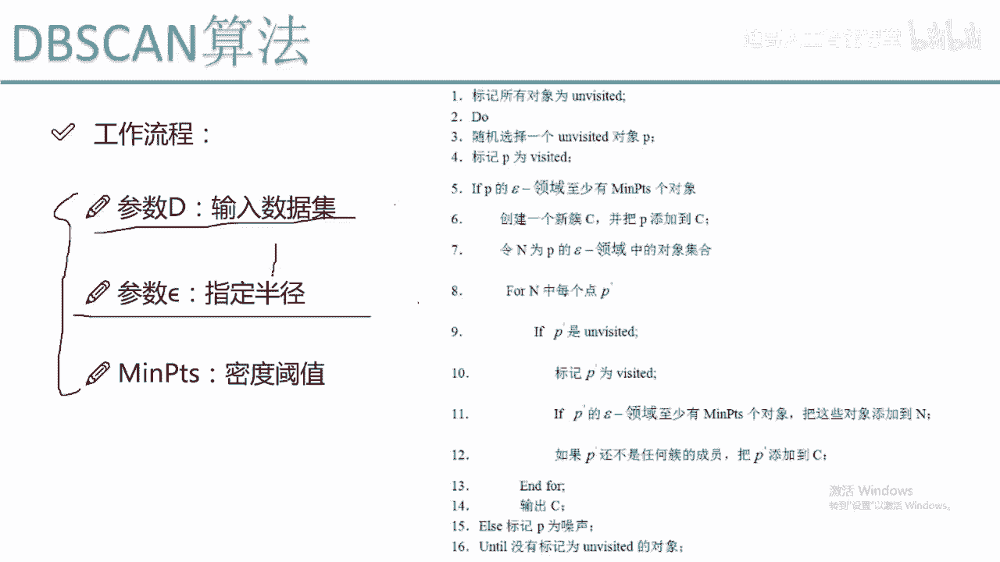
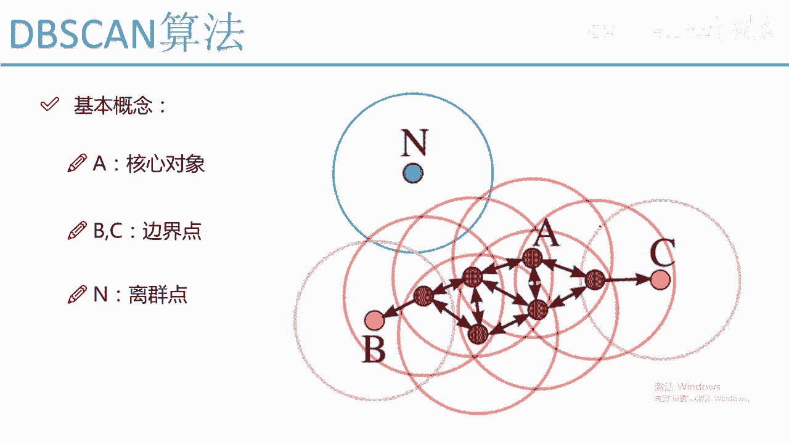
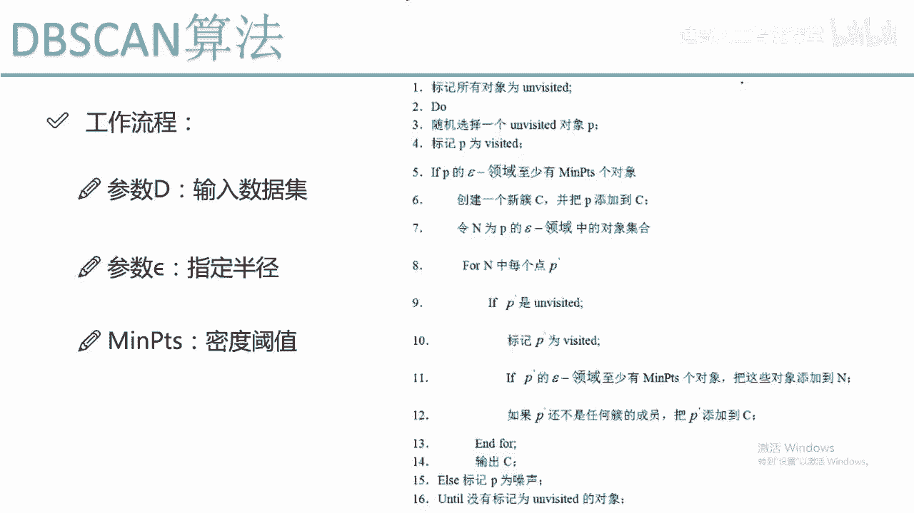
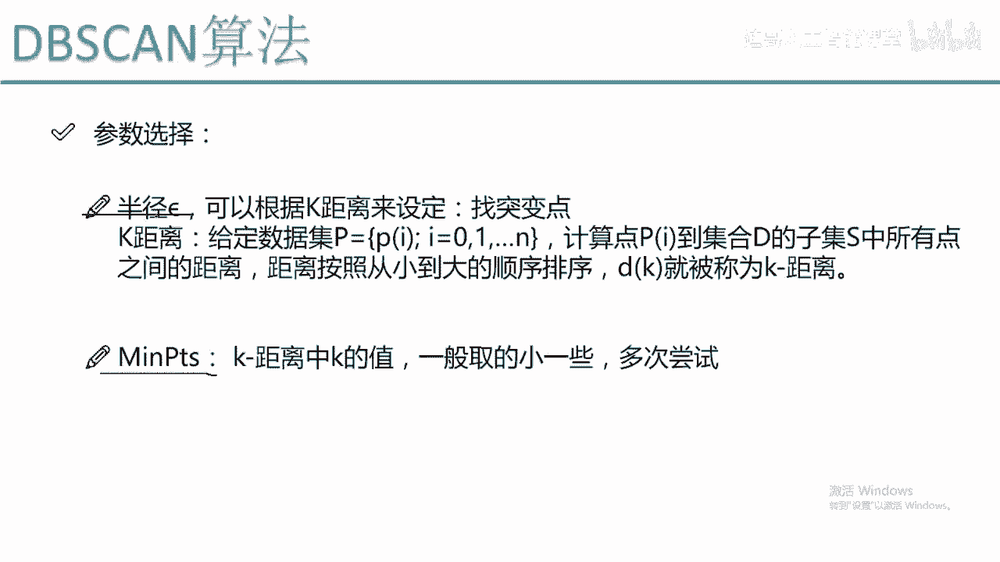
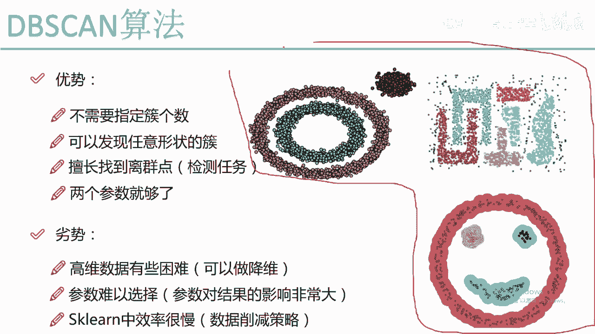

# 比刷剧还爽！2024最新Python金融分析与量化交易实战教程！3小时入门到进阶！全程干货无废话！（AI人工智能丨数据分析丨数据挖掘丨深度学习丨编程丨大数据） - P69：05-5-DBSCAN工作流程 - 迪哥人工智能课堂 - BV1UVksYbEjy

然后呢，我们来看一下我的整体的一个工作的流程吧，整体工作流程啊看起来是比较长的，其实呢它也不一样，也不难，首先啊，就是我们需要看一下我输入的一个参数啊，基本上这样三个参数就足够了。

第一个参数是你的一个数据集啊，这个无论什么算法都要把你的数据输进去吧，我有一个数据集需要指定，然后呢我还有一个参数，这个说白了就是我要指定我的一个R。

就是这个d vs n算法，它是基于什么，我们来之前看的时候，是不是说它基于画圈画圈去找点啊，画圈找点发展下线，那这个圈不就是我们需要指定一个半径吗。

所以说啊，我需要指定出来这样的一个半径的一个值，然后呢mp t s啊是我们的密度的一个阈值，说白了就是这样，以一个圈为半径画出来的一个圆当中啊，最少有多少个点啊，它得是这样的一个啊，有这样点。

然后就可以规定它的一个核心对象，这个就是我工作流程当中啊，需要输入的一个参数，然后呢，我来看一下这个DBCN算法是怎么样迭代的，首先啊第一步啊，我要把我的所有对象，所有的数据拿出来之后。

我都给它打上标记，它是没有被访问到的，一开始所有数据都是没有被访问到的吧，啊这是我第一步，把所有数据指定成都是一个没有访问到的，然后呢我做了一件什么事啊，我随机的选择出来了其中的一个对象。

随机的选择出来一个，我给它标记成了一个visit啊，就是他一直已经被访问到了，然后呢我来看啊，就是说如果说啊当前这个点，当前我选择的这个P点，它的一个R半径的一个邻域内。

至少如果说这个点满足这样一个要求，也就是说它是一个核心对象，它这个点周围啊它是有一堆点的，大于了，比如说我指定的这个密度的阈值是等于五的，它大于了五，我说他是个核心对象吧，他是一个核心对象啊。

这个画的不太好，大于三吧，就是说大于三，它有四个点，然后大于三，他就是个核心对象，这是我的一个P点，然后他周围有这样四个点，那这个时候会怎么办，这个时候我就先先创建一个簇啊，先建创建一个簇。

比如说是一个C1吧，然后呢我把当前这个点P，首先来说它是我当前这个醋当中的一个点吧，C当中啊就有我这个P这个点了，然后呢我再去遍历一下，遍历什么遍历就是我的一个这个对象啊，在这个R领域啊，它的一个集合。

在我的一个集合当中，我去找，这不是有四个点吗，我把这四个点啊先都给它拿到手，都拿到手之后我们来看，比如说这块是一个啊，就是写一个AABCD4个点吧，ABCD4个点拿到之后啊，然后变我循环一下啊。

遍历一下AABCD这四个点，变C遍历这四个点的时候，我就可以来看了，就是说呃如果说我们这这这块就是说，首先呢呃我们如果说一个点它是没有被标记的，首先就是ABCD这四个点我都用这个P来表示了。

如果说ABCD这四个点是没有被标记的，首先给它标记成啊，他已经被访问过了，ABCD啊，这四个点都被标记成被访问过了，然后呢我要看什么，然后我要看就是说AABCD这四个点，我还要去发展下线吧。

在ABCD这四个点当中，我还是去画这样四个圈儿，画这样四个圈啊，咱们来看这是一个圈，这是D点圈，这是A点圈，这是B点圈，圈儿里边儿还会圈到一些其他点吧，如果说呀我圈到了一些其他的点。

并且ABCD还是四个核心对象，这个时候呢我就会把ABCD，它四个发展下的发展到一象限还会发嗯，还继续填充到我这个N当中，也就是说啊我这个N是不断在扩充的，基于什么，继续发展下线嘛。

一开始P发展了四个下限，AABCDABCD啊，继续画圈，画完圈之后还发展下线，把它所有的一个下降都放到一个N当中，直到什么情况，直到哎呀，一个就是发展到一个下限，这个下限它不是一个核心对象了。

那我就这个东西就停止了，直到ABCD，比如说发越越发展越多，越发展下线越多，直到所有的下限都不是一个核心对象了，这个时候我们就要停了，停的时候啊，我们来看我的这个N点N这个N当中啊。

是不是发展出来很多下限了，发展出来多少下限呢，发展出来多少个，我给它放到这个C当中多少个，也就是说我第一个醋啊，这就完事了，第一个醋完事了，我是不是第一个醋当中，里面是有非常非常多的东西了。

发展出来了一堆的下限，这些下限我说它都是等于C1这个簇的，这是啊，我一开始啊选择出来了一个随机的点点P，那假设说现在要我遍历完了C，遍历完了这些点之后A，然后我们是不是得看对于所有的对象来说啊。

我还有一些没有标记的，假设说这一块有一个点Q诶，他是没有被标记的吧，那这一块我要就是相当于发展一个新大陆了，刚才那个传销的团伙被被打打掉了，C1这个醋啊已经固定下来了，它已经被打掉了。

然后呢我现在要便利的是另外一个点，拿这个Q点Q点啊，相当于我们的一个头目，然后这个点啊头目没有被抓，然后他去发展另外一个下线了，在这里啊他还是会去圈是吧，圈完之后放到哪个醋啊，它就不是放到C1那个醋了。

而是我要重新建立一个醋，它是一个C2，在这里啊，我会找出来所有的一个点啊，然后比如说如果说这个Q是核心对象，发展下线下线下线，然后继续去圈，直到啊圈不到为止，再把这些所有的点能发展出来的。

放到我C2当中，但是啊注意点就是说，如果说呀我的一个点是没有标记的，可能这个发展相应当中啊有一些冲突，有一些冲突的时候，我们要注意，如果说它是没标记的，我才能把它放到自己这里来啊。

这块就是说我这个Q啊又去发展出来一堆下键，然后放到了C2这个图当中，那假设说呀我这块还有个W同样的道理吧，W是最后啊就是W也是没有被标记的一些点，在这里，我把这个W这个点再给它进行一个。

再给它进行一个画圈，画完圈之后啊，我再去找它的一个啊，再去找他的一个淋浴，再去发展它的一堆一堆的下限，发展出来一堆堆的下线之后啊，我就得到了他的另外一个醋C3吧，也就是说啊我这个DBSN相当于什么。

我我就是愿意比把它比喻成一个传销的东西，一个传销啊，就是说哪块有点没被标记，它就在哪个区域进行这样一个传销，传销完之后啊，他把所有的所有的一个下限都放到一起了，这样我就可以得出来最终的一个醋在这里啊。

给大家举个例子，就是有C一C二C33个醋嘛，最终啊三个醋当中是不是都有这个字的，一个就是一个代表值了，各自一个代表都有了，当我们遍历完所有的数据，所有的数据啊，直到它都被标记成了一个被访问过了。

那咱们这个事儿啊基本上就完事了吧，咱就把所有的醋都给它锯出来了，这个就是我这个DBSN算法，从它的一个工作流程上啊，给大家画了一下他是怎么样去做这个事的，这个做法还是比较简单的吧，啊虽然这块写着挺啰嗦。

但是呢其实啊，它的一个实际做法还是比较简单的。

然后呢我们再给大家来说一下，就是关于这个DBSEN啊，它是不是也需要指定这样一个参数啊，这个参数啊一般情况下也是比较难指定的，然后呢我们有一个就是浅，就是一个算什么，算是公认的一个指定方法吧。

咱们先来说这个半径啊，这个半径是最难指定的，因为这这个半径因为这个半径给大了，我可能圈的就多了，就是圈的多了，可能错的个数就少了，半径给小了，圈的一个下限就少了，可能错的个数就多了啊。

是会对我结果产生一个影响的，然后呢我们可以怎么做这个事啊，我们可以基于一个K距离去做啊，就是先给大家概述一下吧，比如说我数据集当中啊，一共是有N个点，然后P1P二一直到PN。

然后我可以把这个P个点啊都拿出来，然后呢我比如说我拿出来其中的一个点，pi这个pi这个点啊，到我其他的一个点的一个距离，我都可以算出来吧，都给算出来之后啊，然后我得出来一个。

就是pi到到P1的一个的一个距离，可能是第一pi到P2，它是一个D2，P2到P3，它是一个D3啊，然后一直往下去啊，咱们有一个这样的一个DK，有这样一个距离，然后呢我可以啊，根据这样一个距离。

可能这个进行一个排序啊，咱们先按从头大小进行一个排序，第一第二第三啊，按照大大小进行排序，可能就是第一是等于0。1，第二是等于0。11，D3等于0。12，假设说突然有个突变点D4D4等于什么。

D4等于0。3了，那这个时候我们来看就是第二和第一，第三和第二之间的差异比较小吧，但是一旦这个第四和这个第三，咱们还是按顺序进行，排到第四和第三，差异非常大，后面可能都是0。31，0。32。

这个差异非常大吧，如果说我们找到了这样的一个突变，找到了这样一个突变点之后啊，我们就可以根据这样的一个突变点啊，划这一下，我们可以认为啊前面的这样一个距离哎呀，它是比较合适的。

所以说呢可以指定出来我的一个R的半径倍数，等于一个0。12，找出来这样的一个突变点，那后面呢我们还可以找这样一个图片点，就是基于这种方式啊，我们可以找出来啊，中间的一个突变点是什么样的位置。

基于这样的一个突变点啊，进行这样的一个距离划分也是可以的啊，可以指定这样一个K距离啊，去找这样一个突变点，然后算这样的一个半径，其实一般情况下我们我一般情况下我是怎么算，我也我也有时候懒得去找这个东西。

基本大概试一试，然后然后大概试试时啊，然后咱们通过这样一个观察这种东西啊，虽然说是一种可取的方式，但是呢也是需要你做大量实验来去观察的，很难啊，就是一次性的把这些值都选准，选准这个值啊。

基本上是非常非常难的一件事儿，min pd s啊，这个就是sk learn当中啊，给我们一个建议，就是一般情况下，就是我们让它的这个距离稍微小一些啊，稍微小一些，四啊五啊十啊。

这些比较小的值是比较合适的，这就是我们的两个参数啊，一个半径，还有这样一个点的个数。

相当于是这样的一个密度，这两个值啊一般情况下都是偏小一些的，然后呢我们来看一下就是DBSN啊，它的一个效果吧，右边的这个图当中啊，就是我列出来了三个DBSN聚类完的一个结果。

我们可以看到就是说之前我说有一种醋，让这个k means聚类完之后，他是不是说左边是一个醋，右边又是一个醋啦，这是k miss的一个效果，但是呢我这个基于密度的这样DBSN算法，它会怎么样。

它会把这个里圈和外圈分别给它识别出来吧，为什么，其实啊在里圈有个点，它为什么一个点一个点慢慢发展下线呗，因为里圈跟外圈有一个距离啊，所以说里圈不会把外圈发展成下线，而是里圈会把这个里圈里。

所有的I这点都发展成一个下限，这样里圈点不就单独成一个簇了吗，然后外圈点啊不就又单独成一个簇了吗，所以说这个就是基于密度聚类的一个好处，它可以啊帮我们发现出来，就是更多的就是不论是更多的醋吧。

就是帮我们发现出来任意类型的醋，只要这个醋啊它是有一点规律可循的，它就可以把这个醋啊给他发，别发现出来，然后呢右边右边就更神了，右边就是说对于这样一种啊，非常奇怪类型的一个醋，但还是能够给他发发现出来。

如果说你k miss怎么算k miss，那显然就是上面是一堆，下面是一堆了嘛，但是对于我们的DBSN啊，它还会是把我这个堆给它，实际的就是实际的可以找出来啊，因为它是基于密度的嘛。

只要密度它是能就是这些点是聚集在一起的，只要中间啊出现一些空白，这些点都聚集在一起的，它就会按照发展下线，哎呀直接给他都发展过来，这就是我基于密度的一个聚类，然后它有什么。

它还能帮我发现出来一些离群点吧，比如说我们来看这些点，这些点它都是一些离群点吧，因为它离哪个簇啊，它都没办法给它发展成一个下限，所以说啊我就说这就是一堆啊，我的离群点了，这些离心点啊。

我们也可以单独给它拿出来，然后这个dB c n啊，在我的那个sk learn当中啊，它有离群点的个标记啊，它会指定一个簇是一个一负一啊，就是正常错啊，都是0123啊开始的，然后一个促建立一表示什么。

一在sk learn当中啊，就表示这样的一个离群点，他会把所有这样一些离群点，放到一这个醋当中啊，当成是一个离群点的一个醋，然后下面呢下面是这样一个笑脸吧，这个笑脸也是一样的，就是我们的DBICA。

我们来看当他去做这样的一个聚类的时候啊，还是会把咱们的一个点都拿出来吧，这个就是我DBIC啊，它算法的一个优势了，咱们来看一下吧，它的一个优势都有什么，第一点是非常重要的。

就是我们不需要啊自己指定簇的一个个数，因为我们很难知道啊这个醋个数到底是多少，是合适的，他自己去找呗，基于密度自己去找，找出来多少个算多少个，这就是我们的一个优势，不需要我们自己指定我的一个错的个数。

然后呢他DNA有点什么，它是可以通过这三个图大家看出来了吧，我们是可以啊发现任意类型的一个醋，什么样类型的醋我都是可以给他发现出来的，然后呢它可以作用于我们检测任务吧，对于离群点啊。

我们都可以找出来它是一，那个醋可以应用于啊我的一个检测的一个任务，然后呢啊它是一个参数啊，两个参数就够了，参数还是比较少的，然后这是啊它的一个优势啊，优势说完了，咱们再来说一些劣势吧。

劣势啊就是说嗯DBC啊，对高维的数据做起来有些困难，因为就是我拿D，我就是我拿sk learn去做的时候发现了，如果说你数据维度特别高的情况下，它的一个效率是非常低的，而且速度非常慢。

因为第嗯sk learn当中啊，具体怎么实现的，基于什么样的一种，基于什么样这种算法，我还是我还没看过他的一个源码，但是呢我做一个实验，就是如果说你的数据量是非常大，并且维度很多。

它百分百会报这样一个错误，就是一个内存溢出了，如果说就是相同的数据，你放到k miss，或者说放到一个民shift啊，或者是放到一个birth啊，或者是一些其他区的算法当中，它的一个就是它的一个结果。

都不会报这个一存溢出，但是如果你DBCN这个数据量比较大，它会报这样一个错误，所以说一般情况下，我们是可以先做这样一个降维的参数啊，参数选择还是比较难的吧，刚才说过了，参数确实难。

sk learn当中啊，确实有这样一个问题，因为嗯我现在也是遇到这样的一个问题，就是如果说你的数据量太大了，没办法整体的传进去，那怎么办呢，我们可以做这样一个数据的呃，数据的一个消减策略。

比如说在这个我们可以看啊，就是说哪些数据啊，有一些数据它可能就是指标是差不多的，我们可以给它削一削啊，就像我们去剪头的时候，我跟他说给我打包打包，就是在相同位置啊，给它消下去。

一部分我们有一些数据消减策略啊，这个削减策略的方法还是很多的，我之前在做一个呃异常检测任务的时候，也是用了这样一个数据消减的一个策略的，那这个就是我的一个DBSN算法啊，它从整体上做了一件什么事。

我们来看它的效果还是不错的吧，所以说啊刚才我给大家推荐了，就是当我们用聚类的时候，最好用这个DBICN啊，因为它的效果要比k miss强的多了，尤其是在你的一个数据，它是比较不规则的情况下。

这个时候我们的DBSN算法啊。

