# 比刷剧还爽！2024最新Python金融分析与量化交易实战教程！3小时入门到进阶！全程干货无废话！（AI人工智能丨数据分析丨数据挖掘丨深度学习丨编程丨大数据） - P70：06-6-DBSCAN可视化展示 - 迪哥人工智能课堂 - BV1UVksYbEjy

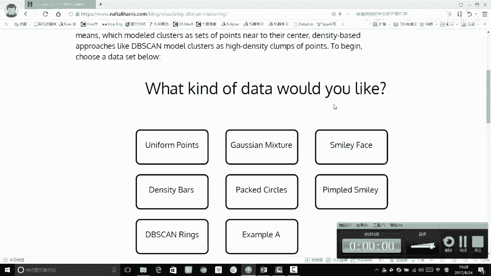

嗯这回啊咱们再来看一下，就是咱们刚才不是给大家说完了，那个DBSEN啊，一个我给大家说是非常牛逼的一个算法啊，像传销似的，它的一个工作流程吧，然后呢，再给大家用可视化的形式给大家展示一下。

这个DBSN啊，它在就是做这样一个聚类的时候啊，它的一个流程，或者说他一步一步啊是怎么样去做的。

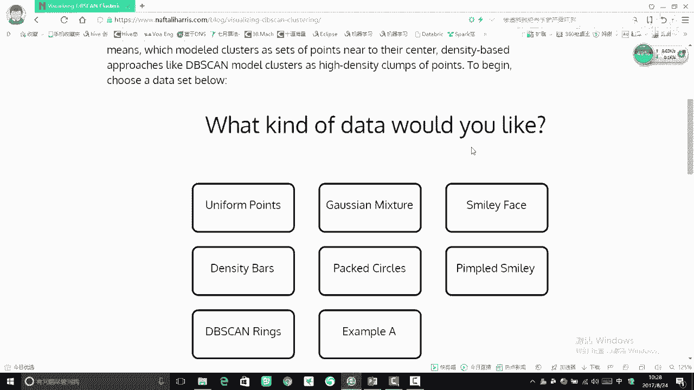

还是啊咱们还是随便选择一个数据集吧，然后呢，在这块就是我可以自己指定它的一个半径，然后我们来看我给你调这个东西吧，去指定它的一个半径的大小，然后在这里他都给你画出来了，这就是它的一个半径。

然后我给半这个半径暂时指定成一个一吧，然后呢这个main points啊，就是我刚才说的那个EPS嘛，就是我的一个呃，就是一个就是一个密度的一个阈值嘛，这个东西这两个值是需要大家自己指定的。

也就是我们两个参数调节下面的我的一个轴啊，就可以去做这样一个东西，然后咱们来概述一下它是怎么做呢，首先选择一个点吧，然后基于这个点去传销，传销完之后啊，实在找不到传销的。

再选择另外一个点去建立一个新大陆吧，咱们来勾一下，来看一下，就是选择一个点，然后去在这块做传销，哎我们来看把所有点都放进来了吧，都放进来之后啊，这个传销做完了，传销做完之后。

在另外一个新大陆又去做传销了吧，又去找这些点啊，又把这些点都圈进来了，那我们来看这块有一个白色点啊，它是没有被圈起来的，那它什么它就是一个离群点嘛，或者说它是一个噪音点，异常点都是可以的。

这样呢我们基于它的一个传销的方式啊，就把咱们的一个醋给它做完了，然后我们来看最终啊有三个是离群点，然后呢其他点啊，就是我的一个三个簇就划分出来了，这个就是我dB sn算法它的一个工作流程。

在每一个位置去画这样一个圈，画完圈之后呢，又到啊咱们的一个新的位置，去找这样的一个点了，这个我们就做完了一个dB sn算法啊。

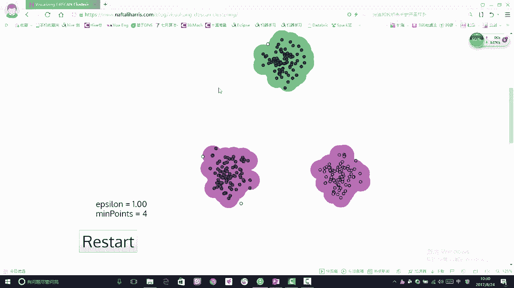

它的一个整体流程，这个咱们就不不restart了，哎咱们可以restart一下来看一下嗯。

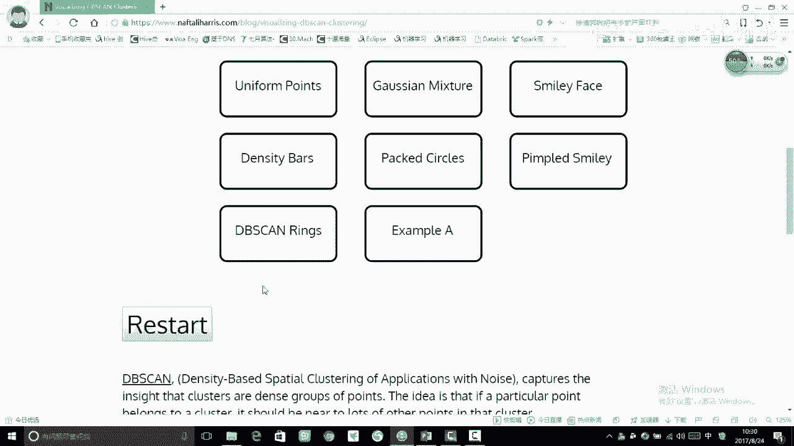

咱们刚才不是找出来了一些噪音点吗，那当我把这个半径给它设置的稍大一些之后，咱们再来看一下它还有这个离群点了吗，就没有了吧，估计因为他会把它都圈进来吧，哎呀这个点好像还是没有全进来呢，怎么啊，圈进来了。

已经啊都圈进来了，他就没有离群点，对左边来说呢，他也都圈进来了吧，也没有离群点。

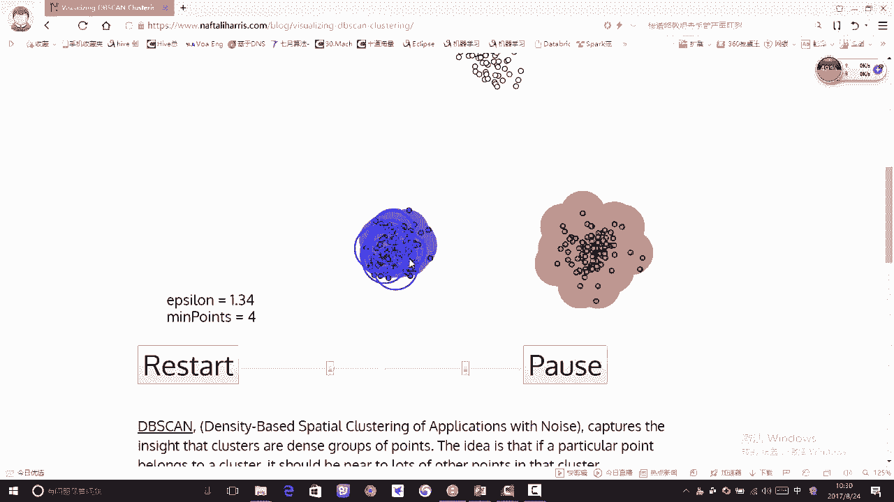

也就是说这个半径会影响什么啊，这个半径啊和这个下面参数啊，都会影响你这个醋的一个形状的。

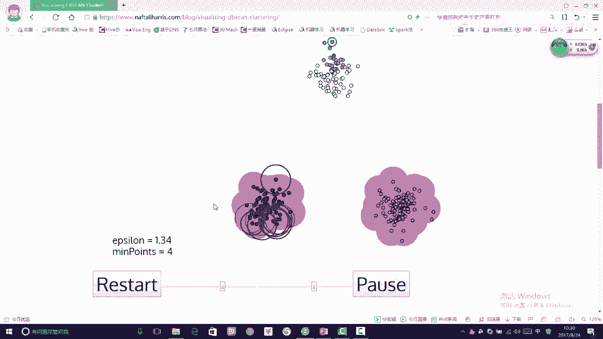

尤其是对离群点，你要想找离群点的时候，你不妨把这个半径啊设的稍小一些。

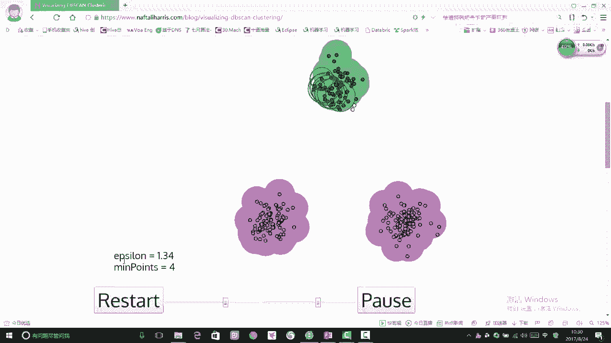

然后这明胖子也设置稍小一些，这样我们就把这三个醋也做完了。

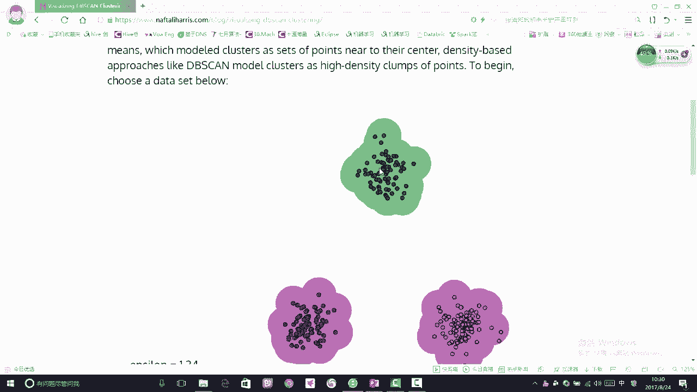

这回就没有离心点了，这个就是两个参数对我结果的一个影响的。

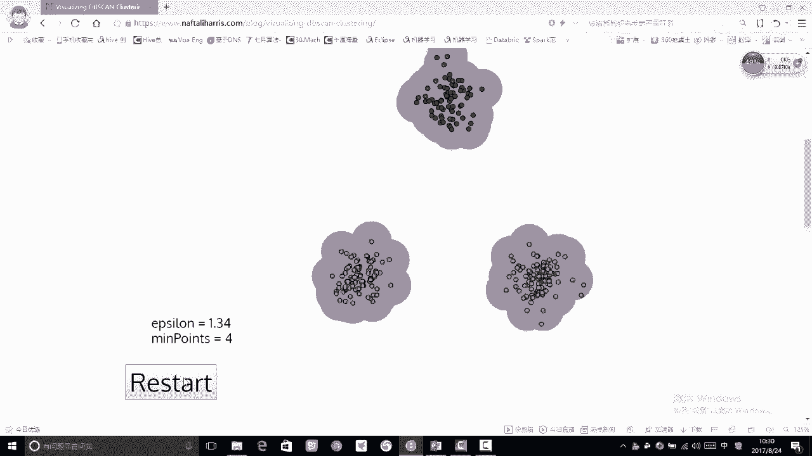

再来找一个吧，咱们刚才不是做了一个大笑脸吗，咱们最后在做大笑脸的时候，我们说那个k miss的效果不是不好吗，那咱们还是默认这个参数啊，然后用我的DBCN我去算一下吧，反正一开始我也不知道多少错。

我也我也不需要给定一个醋，找出一个点去传销就可以了，咱们来勾一下，一开始找出一个点，然后传销传销传销哎呀这个红色点完事了，然后这个蓝色点就开始了。

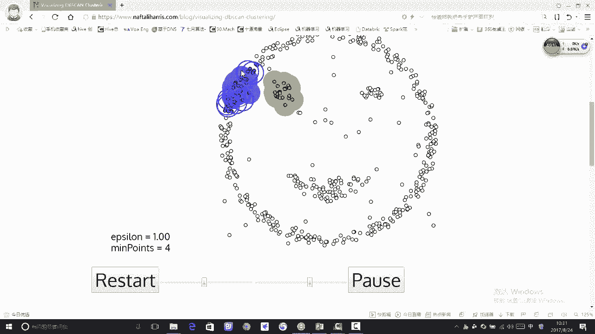

蓝色点它就基于它的一个密度，不断的去发展下线，发展下线，发展下线啊，这个东西可以做成一个并行的，就是我们在很多位置都可以去发展出来，它的一个下限，慢慢啊这个蓝色就会画成这样一个圈。

那现在我们来看就是基于密度这种聚类啊，它的一个好处，可以发现任意类型这个醋吧，只要这个醋啊，它前后是能相连起来的，就是像我们说的那个密度可达嘛，只要是密度可达，我们就可以给圈起来，这样呢我就得出来了。

这样的外层的一个圈，我们看现在他都快整完了，然后最外层啊它有它的一些离群点吗，就是我的一个圈儿，然后绿色的又开始了，绿色都开始去传销了，然后又开始发展一堆堆堆下线，把这些啊都加到我绿色的当中的的。

这个醋当中来，然后呢这是我黄色的，然后最终啊我看出来一下啊，这还有一个其他的一个醋，因为我这个min啊，min pz是等于四的，如果说main p等于三啊，这个醋它就找不到了。

这个就是我的一个DBSN啊，它的一个效果从它聚类完的一个效果来看啊，它的一个结果还是比较不错的吧，要比k means啊强的多呀，因为我们是基于密度的一点一点去发展下线。

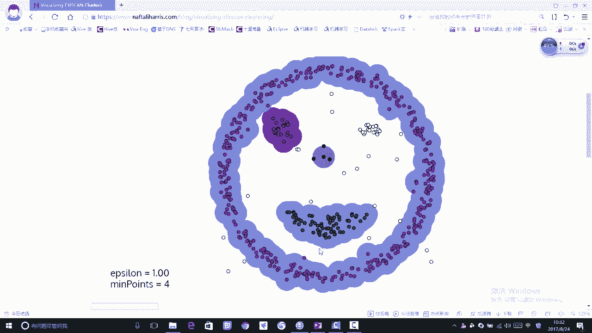

最终呢发展完就得到了啊，咱们当前的这样的一个促的一个结果了。

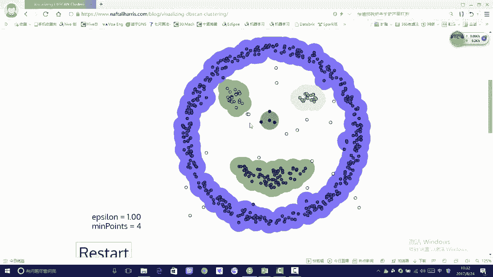

再找一个吧，再找一个这样式的这样式，咱们刚才不是说哎呀我KIIN的时候，我不知道到底给它锯成多少个簇比合适吗，那好吧，那我继续密度的去看一下吧，啊这是个红色的错误，红色粗，我估计它会发展出来很多啊。

因为他们都比较密集嘛，这个区域密度的，它有一点就是说一旦啊，就是这个东西都非常密集的情况下，我们再去进行划分就比较难了，这个点我们来看他，这个我估计他得把大半个图啊都给它圈进来，来看一下结果吧。

这个结果我还没跑过，应该是会把大半个图都圈进来，所以说他的一个问题啊也来了，就是一旦这个数据啊分布都是比较密集的，这个时候会什么样，这个时候他会把所有东西都圈进来吧，我他会认为呀所有东西都是一个红色的。

它这个也是他的一个问题吗，这个问题怎么解决呢，咱们可以调参吧，让它半径稍小一些，半径稍小一些，应该会改变它的一个结果的，哎呀第一次我们来看它的结果，把所有的都给它圈成了一个红色的。

那都圈成红色肯定是没用的吧。

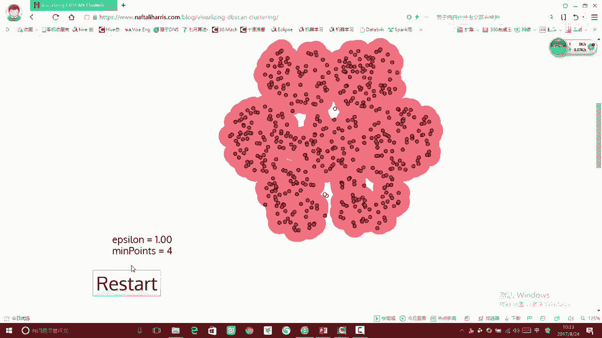

因为我们聚类，我们我们都是属于一个类别，对我来说没用吧，咱们再来改变一下，把我的半径啊稍稍调小一些，我调小个一半，我调到个0。5，咱们来看一下，这个时候来看，哎呀啊，0。5太小了，0。5太小的时候。

他在圈的时候就不太合适了，它会圈的太多了，所以说我这个0。5还不行，哎呀这这这得我圈出来上百个醋了，备不住醋的个数啊，有点太多了，这个时候嚯这么多个醋啊，这么多个醋不太合适啊。

咱们再给他restart一下吧。

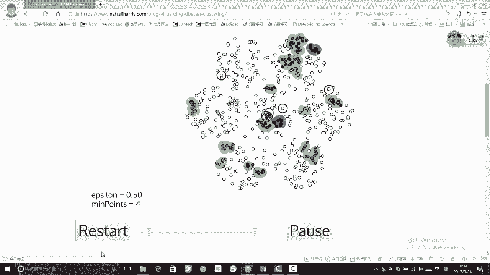

这刚才设置的太小了，我设置的我设置成一半，我设置成一个0。0。0。75吧，0。74吧，咱们再来看一下，这个时候应该还是一个比较合适的吧，应该这个这个应该也是偏小一些，它聚出来醋的效果也不太好。

那其实大家可以看，就是说这个时候我们用这个db3N的距离，效果感觉就不如那个k means了吧，因为k means我们强制给了一个K之后啊，它聚出来之后起码都是差，有挺有规律可循的。

但是这个d bi cn啊，它锯出来之后可能就是基于这个东西，聚类完之后醋太多了，然后分布也还可以吧，但是我感觉他就没有k means聚出来效果好，因为他聚的太乱了太多了，这个就是它的一个效果。

到时候大家也可以给他再改一改。

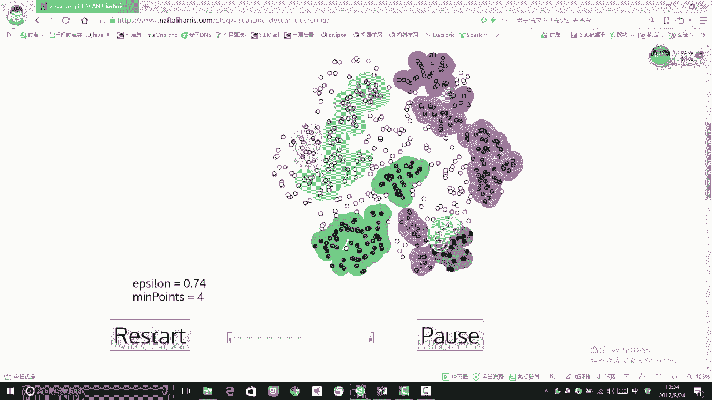

再看一步吧，我给他改成个0。8，0。8，有点有点还有点小0。88吧，希望C0。88哎，没准他又给都给聚成一个圈了，这个就是我们改变参数对结果影响，大家可以看出来，就是这里我改变了一个参数，就是这个半径。

光改变这个半径，它就会使得你每次结果都是不一样的吧，那这个半径对结果影影响也非常大，也就是刚给大家说了，这个无论什么算法啊，这个对于聚类问题来说，参数啊都是一个大难题啊，因为你没有一个标准答案。

知道什么样的醋它是比较合适的，所以说这里啊我们就是很难去指定出来，哎呀什么样的一个参数到底它是比较合适的啊，看这个咱们就不看了，这个就给大家演示了一下，我们这个dB sn啊，它的一个效果是长什么样子。

它会把最后下面这个醋哎，我觉得对这次聚类还可以啊，这次聚类还可以，这次聚类要比之前的聚类效果都好，所以说嗯，不同的参数会使得你的一个效果，完全是不一样的，这次啊我的效果还是比较不错的吧。

基本上聚出来几个大模块，这几个大模块还是比较规律可循的，其实我想再把黄色这个再分成两块。

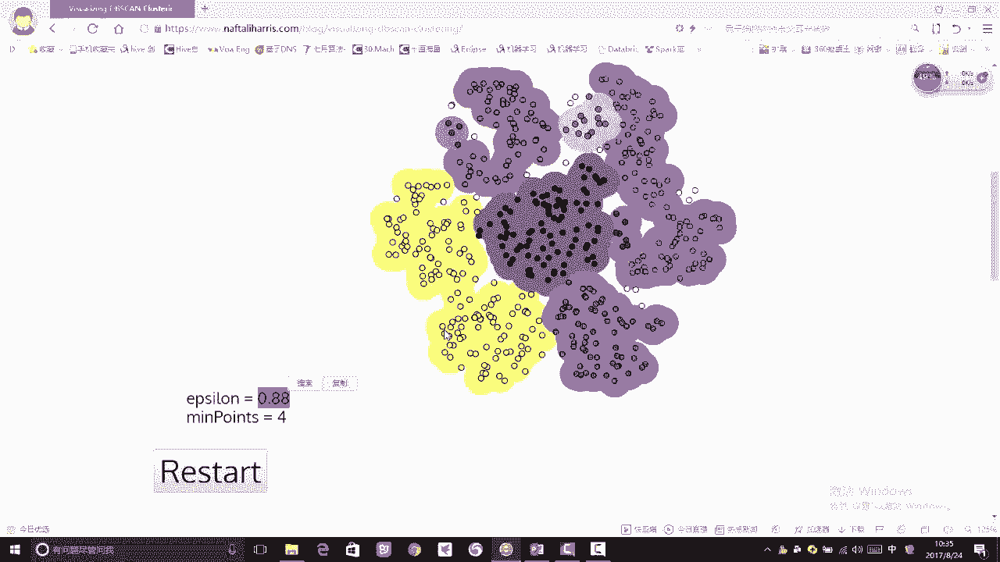

蓝色的也可以再分成两块嘛，这个就是我的DBCN啊，它的一个效果。

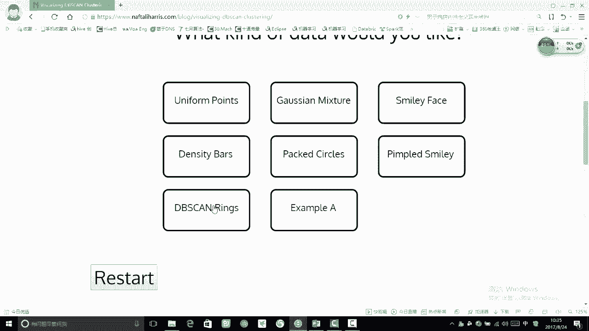

然后我看一下还没有什么好玩的啊，这个也可以看一下这个刚才我们聚类完，就是每次指定不同的一个，指定不同的一个K值啊，它的一个效果也是不一样的吧，咱们再最后看一个这个就就完事了，咱们最后看一下这个DBSN。

它的一个效果是长什么样子吧，我想啊就是可能分成三簇吧，中间左边右边分成三个簇，具体分成多少错，我也不知道，不知道左边这个是不是太稀疏了，右边稍微稀疏一些，然后他在检测的时候啊。

检测的时候效果也不也也挺好，因为它检测的时候会使得我最终的一个结果啊，就是说会使得我最终的一个结果，它会有这样一个离群点嘛，有离群点，离群点是很重要的一个东西啊，离群点可以帮助我们进行很多个分析的。

然后这块哎呀他把他都拉进来了，都拉进来之后哦，这块还被传销了，右边被传销完了，那就分成了两个模块，一个绿色的啊，哦左边和右边这块，其实我们这块就可以看到这个mean pz。

我们是不是设置的稍微稍微有一些小了，我可以设置的稍微大一些，稍微大一些的时候，你的醋的个数也就会变小一些。

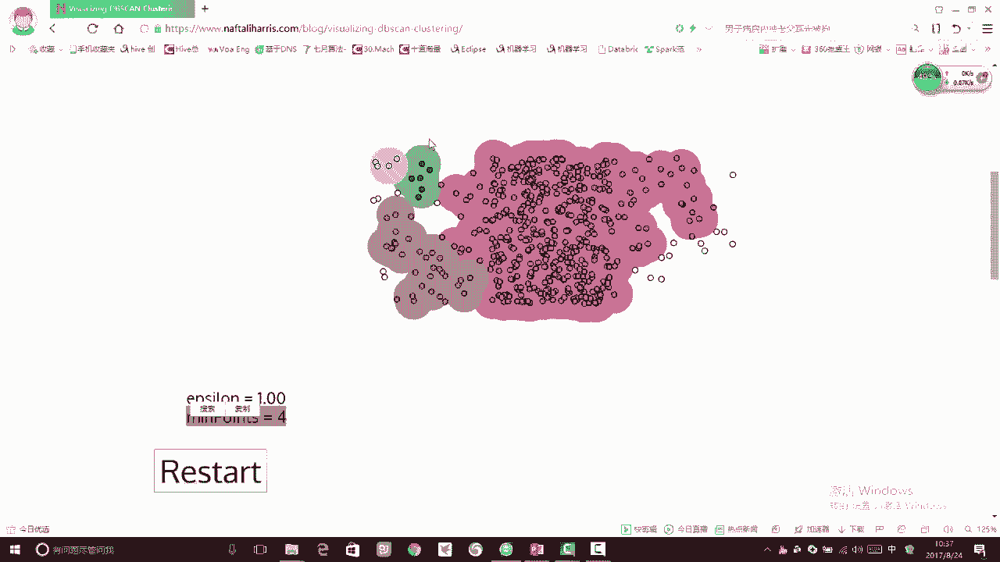

那这个就给大家一个演示了，到时候大家就自己玩吧。

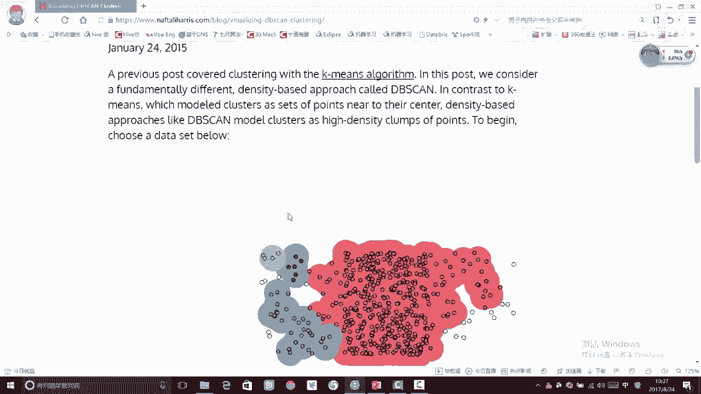

这个就给大家演示了一下，我们DBSN啊，他在就是工作的时候，它的一个流程以及参数啊。

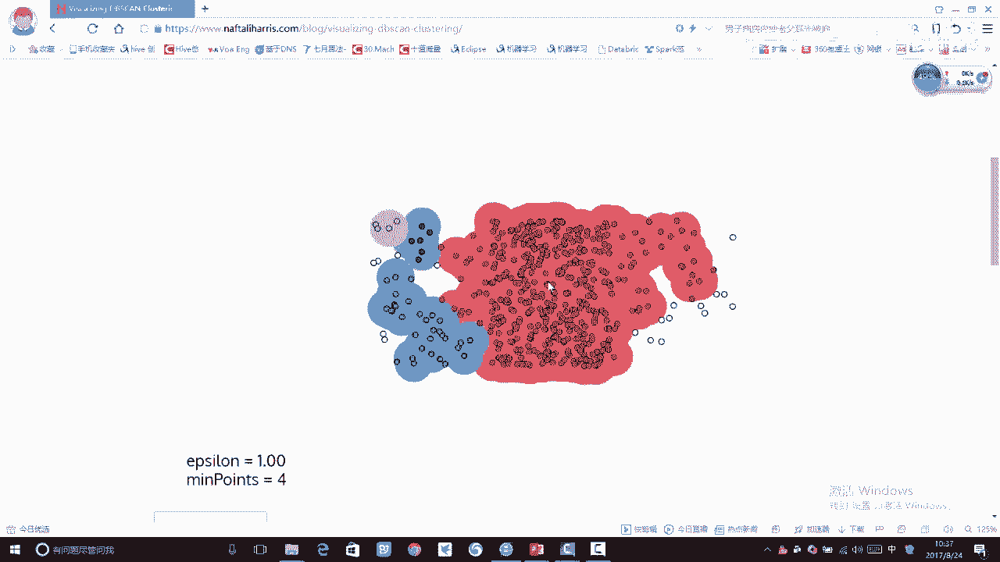