# 比刷剧还爽！2024最新Python金融分析与量化交易实战教程！3小时入门到进阶！全程干货无废话！（AI人工智能丨数据分析丨数据挖掘丨深度学习丨编程丨大数据） - P73：09-9-统计效果展示 - 迪哥带你学AI - BV125mdYoEEU

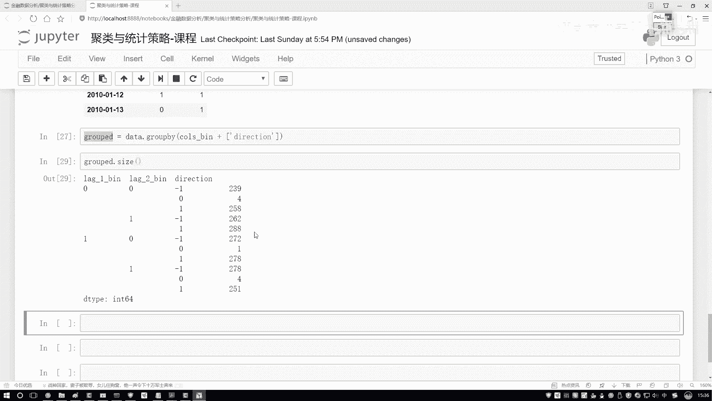

好了那结果拿到手之后，接下来干什么，那是不是说我现在可以去做一个统计啦，统计谁啊，统计啊，这里诶哪一种可能性多，哪一种可能性少了吧，要做这样一件事，接下来啊，咱们还得对我们的数据啊做一点稍微变化。

因为现在其实我要的是谁啊，要观察这两个是前一个特征，这是一个结果吧，但是现在呢好像是你把它们都当做是一个特征，给我组合起来了吧，还在这里我们对这个数据啊稍微的做一点变换，我说在这里啊，就是对啊。

我们当前的一个group当中，我们的最后这一列，这一列不是我们的一个结果吗，好了我说我把这个结果对它呀做一点操作，对这个结果，然后呃把它给它ASTACK一下就可以了，点size当中。

然后去建议大家先看好结果吧，这个结果哎要比这个代码讲的更简单一点，直接看结果就行，然后里边不是有这个呃fail video，说把这个值给它填进去吧。

值没有的，它就是一个零，这样咱执行一下，执行完之后你来看这个file value，意思啊，就是说这块有些地方如果说他没有值，它可能会把这一个东西之前。

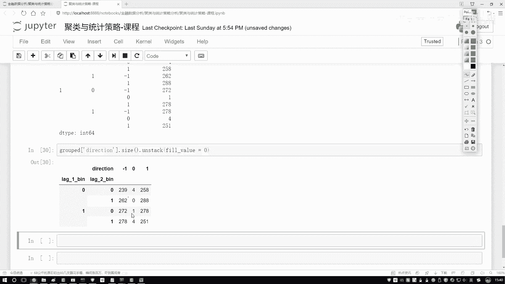

咱不是会不显示出来吗，现在我全让它显示出来哦，此时咱们来看此时我们得到什么。

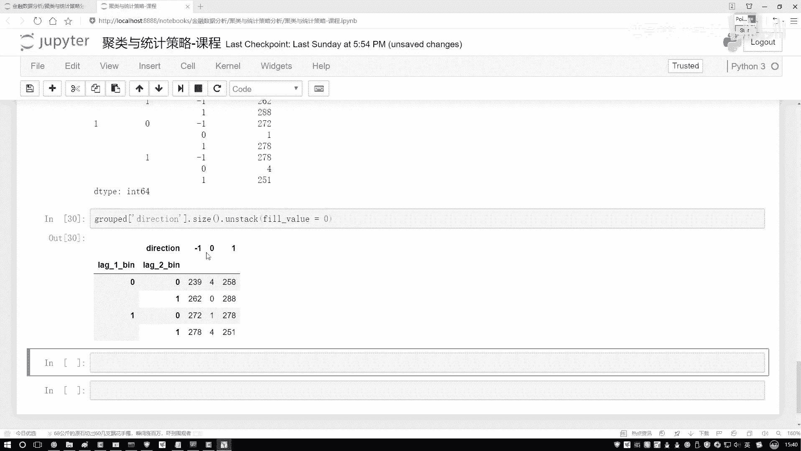

那你看这个东西像是什么了，这就是我们的一个目标展示挺明显吧，前面两个呢就是我的一个特征，我想看一下对于我特征不同变化的时候，我的一个什么，我的一个像是最终的一个结果。

最终的目标他呀是怎么样去变的，指定个result，然后来执行一下啊，这个这也大家看过了，不看了，那接下来呢我说我现在要干什么，是不是得去做这样一个统计啦，好啦，我说咱们现在要去就是执行一些策略了。

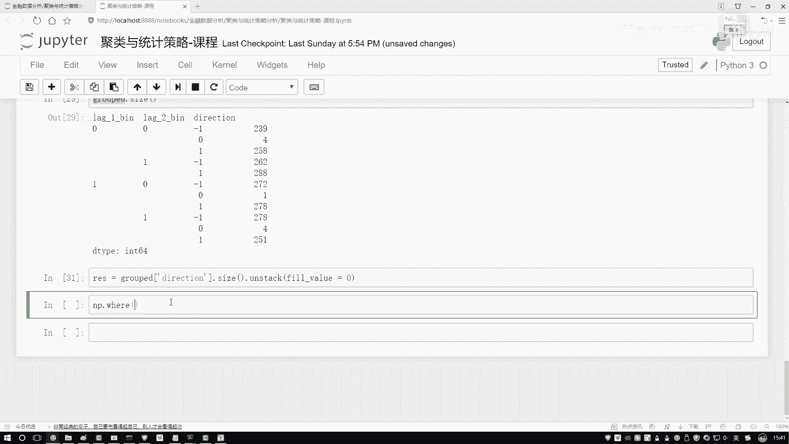

那排点位一下，然后data我要传进去电脑当中啊，还是刚才我们指定的啊。

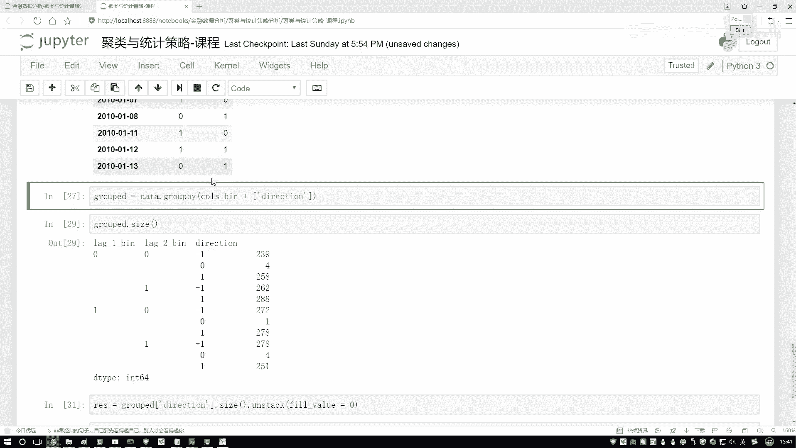

指定好的，做好特征的这两列，前一天的，还有前两天的，然后呢我算一下吧，算什么呢，算一下他两个的一个和啊，是不是等于二，是不是等于二的意思啊，相当于就是前两天啊，它是否是一个这样。

再把这个结果再展示出来一下，把这个结果再展示出来一下。

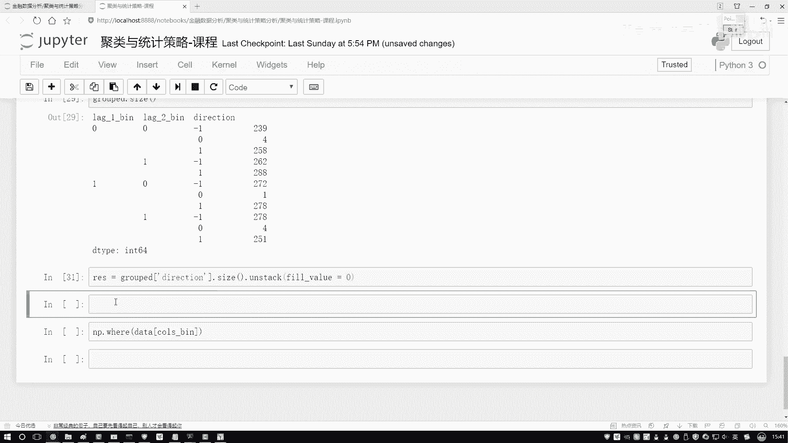

你看在这个结果又展示一下，我说我可以看一下他们的当前的一个趋势，那你说啊就是前一天涨了啊，第二天也涨了的时候，那你看接下来一天大概率怎么样，大概率是赔的吧，那我现在要统计了，我说看了一下，哎呦。

前两天正好拿不同颜色来画红色，我拿绿色来画赔的，你看就是这个，你看就是这里吧，一咱零就不看了，你就看一和一谁多啊，我把多的那个那一列先都给画出来，然后呢看一的我用绿色画，然后正一的我用这个红色画。

然后这里这是一个正一多是吧，这里也是个正一多啊，这里也是一个正一多，看起来好像右边三个都是涨的，然后左边这个是跌了，因为这个278，它是小于这个251吧，咱现在据统计的，那就得看哪一种可能性大吧。

那什么意思呢，也就是说哎呀有这样一种可能性，如果前一天它是涨了，前两天它也是涨的情况下，第三天大概率会跌吧，好像跟我们实际当中的一个预感也是差不多的，然后其他情况下呢都是会长。

是不是最后这里哎我说我列一个南派点，where are一下，我要去判断了，判断什么呢，前一天是一，第二天是一的时候，我们结果是什么，是一个跌了吧，跌了咱用一来表示，涨了我用正义来表示吧。

所以这里我们要判断一下吧，那安排点where一下，让我算什么呢，当前前一天和前两天的，然后算啥，算它的一个SAM和吧，这个好判断，我说SAM当中，我就判断一下呃，他这俩加起来是不是等于什么。

是不是等于二吧，等于二的时候怎么样了，是一个一赔了吧，然后呢不等于二的时候我们是什么是正了吧，那这就是一个正极吧，所以这里啊我们多做了一个判断的符号，我然后给它赋值，赋值成一个列名吧，复制成个列名。

这个就是咱们当前的一个position，然后呃我们基于这个频率吧来去统计了一下啊，当前它是一个啊，应该是个跌还是个涨，到时候我是按照大盘走势呢，还是不按大盘走势来去买这个股票。

这个意思这里啊就是你看我这块等于等于二，纯粹是根据这个结果，我自己数数数出来的，可能大家数据来之后啊，数出来结果并不一定相同啊，这里就是简单看一下吧，啊我们的一个统计的方法，好啦。

这里统计方法我们做完了，做完之后啊，咱们来算一算吧，就是现在我们的一个走势。

跟实际的这个direction当中啊，到底有多少个是一致的，比如这里我说data当中，我把这个direction传进去，这是实际的情况吧，好了，拿实际情况跟我们当前哎我们自己的写的情况。

我们不是写好了也是一和一吗，看一看他俩当中有多少是一致的，呃这样有多少是一致的，那就是一个video count，我把这个这块括号一下，然后点V六一下，然后点count一下，再来看一下它的一个结果。

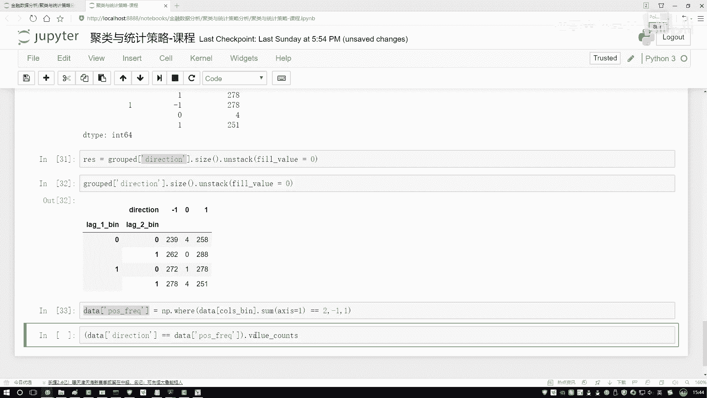

嘶处的有1102次代表什么哎呦，在走势当中啊，就是每一天都会变化吗，有1102天啊，我们的一个预测是对的，然后呢有1033天，我们的预测是一个错的，感觉，像是一半一半是吧。

但是呃看起来我们的一个基于统计的方法，要稍微的多预测了，对了几次是不是行了。

既然你说你多预测对了几次，再来看看结果吧，还是之前我把这个一还原就得了。

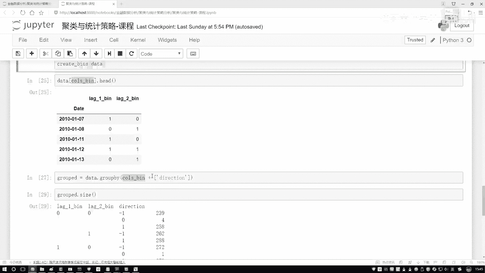

呃把上面这个结果拿过来，然后我稍微改一改。

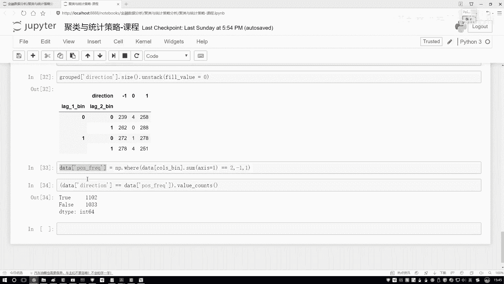

把这两个值拿过来，把这个名字一改，咱就完事儿了嘶，呃这里把咱们的名字一改，你看一下这一块，就是咱之前说这个东西叫做一个聚类的结果，然后呢这个我说它不是个聚类，这是基于什么我的一个统计的方法来去做的吧。

然后这一块我们的data data当中啊，选的列名也不一样了，然后乘的这个returns这个东西没变，然后接下来呢这里不一样。

点sum还原的操作还是一样吧，好啦，来执行一下吧。

哎呦执行完之后怎么给我算出个无穷呢，这里好像有点不太对劲，看一看呃，当前在这里，我说这块是我的一个returns，这里是哦这块不对，这块是哦，咱这个结果再来执行一下行了，结果算出来了。

returns是按实际大盘的一个走势，那你是赔了赔了一部分是吧，然后呢，基于统计的方法能让你怎么样，赔的稍微少一点吧，反正也都是赔了小于一的，那肯定就是赔了，现在只不过说我只赔了一丁丁啊，0。

1几个百分点是不是，但是如果你不按照统计策略，可能会赔的更多啊，这个给大家说了一下，就是在我们的一个统计分析当中啊。

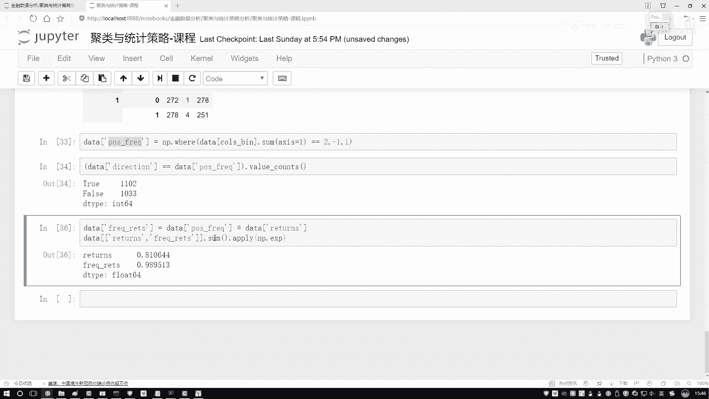

可以用哪些个方法，其实说白了就是比谁的可能性大。

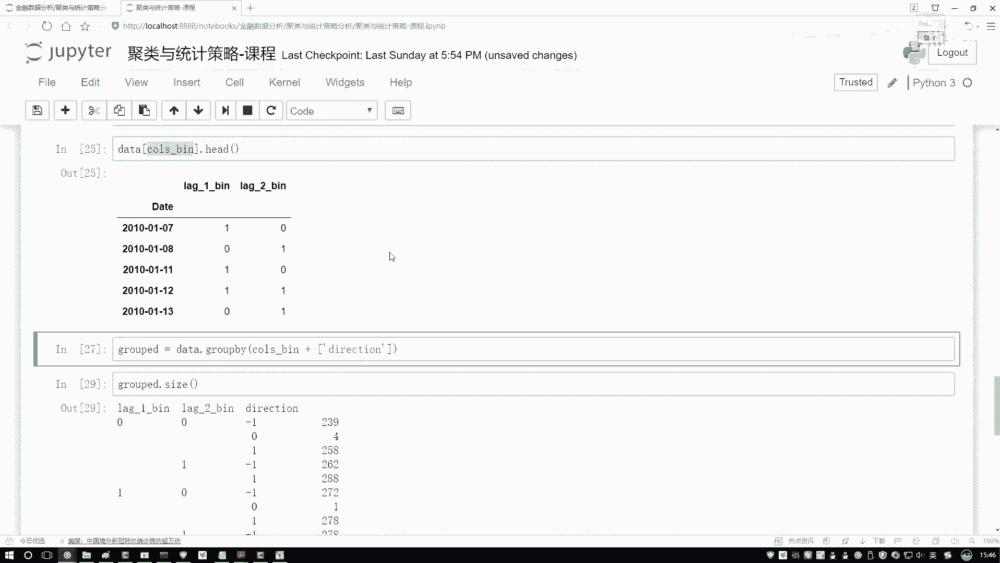

我算各种各样的可能性吧，这块主要给大家说了一下，就是group by。

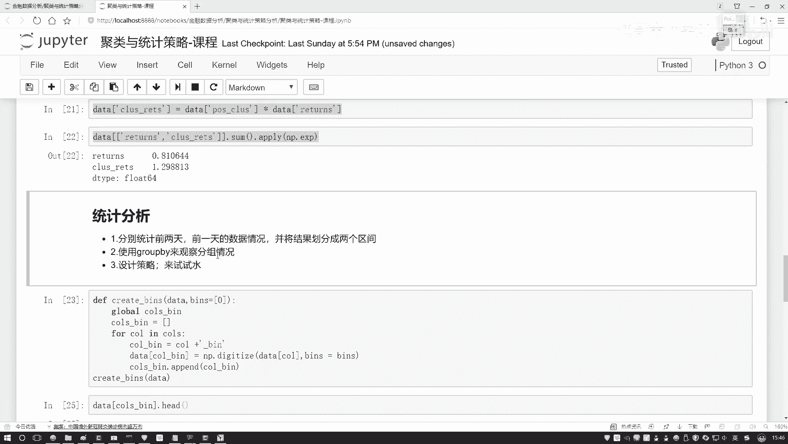

哎这个操作咱们该怎么样去用，以及呢对我的一个结果哎。

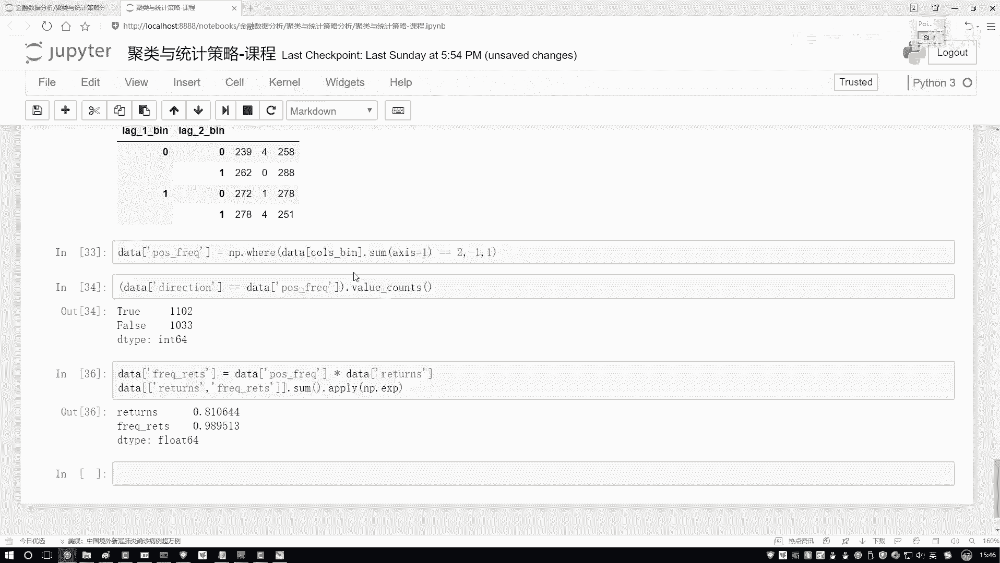

咱们该怎么样进行指定啊，咱们怎么指定的，非常简单，简单的去数一数就行了吧。

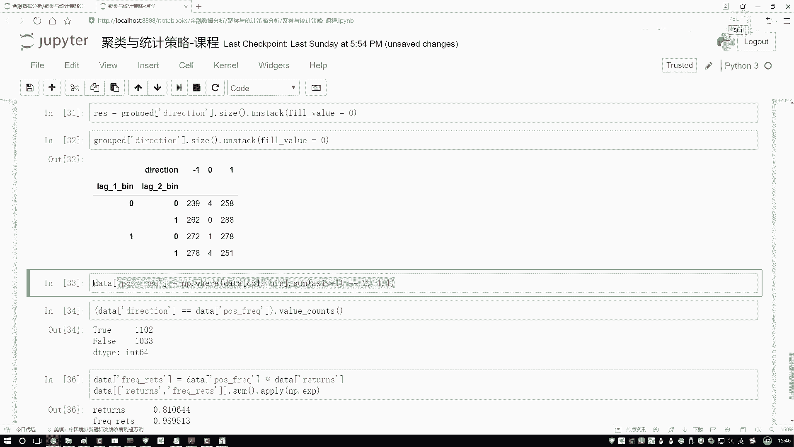

这下就是咱们这节课当中，Python代码去怎么样去做的一个聚类。

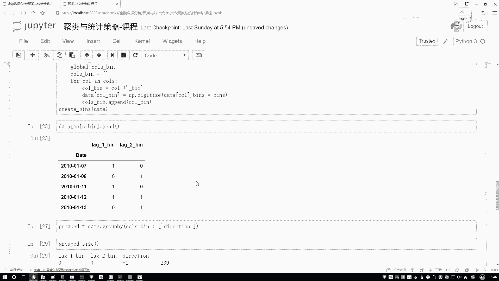

还有统计分析的策略，这样策略相对来说啊，呃不是那么特别靠谱啊。

主要给大家解释一下他们的一个基本含义，以及呢在做的过程当中啊，咱的基本出发点，还有我们的一个简单的结果啊。

