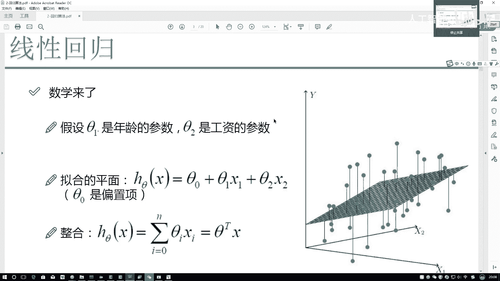
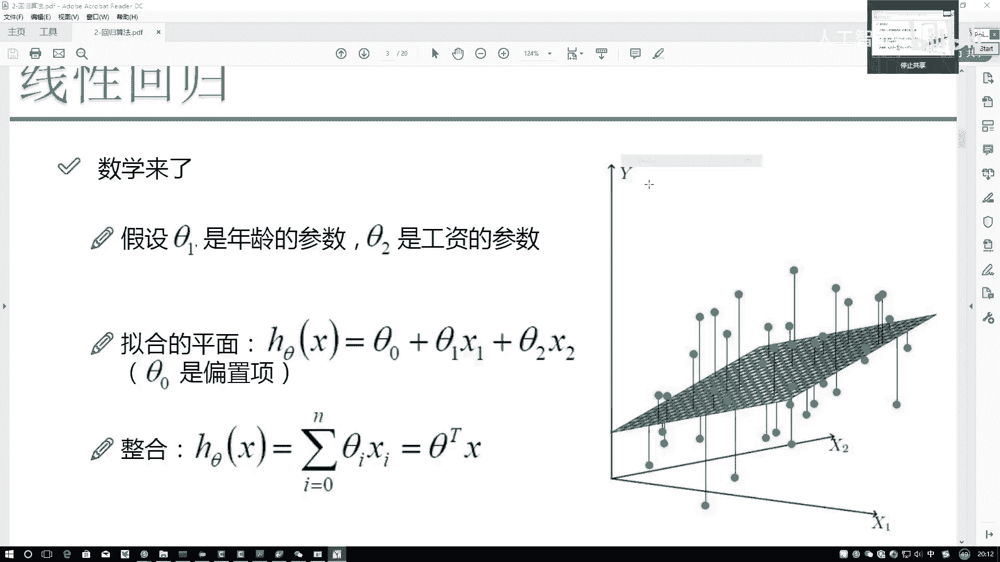
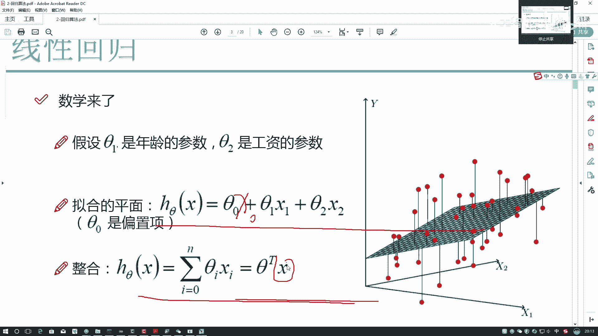
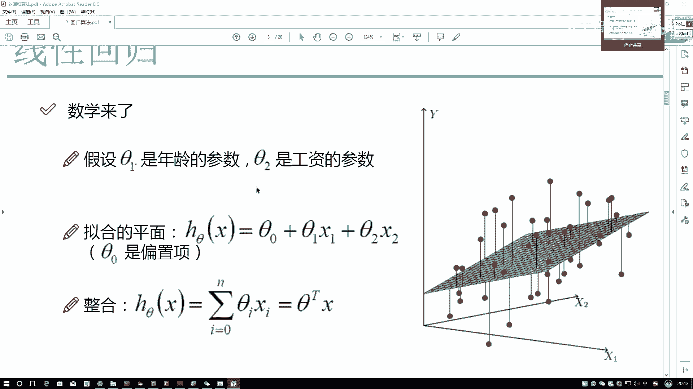
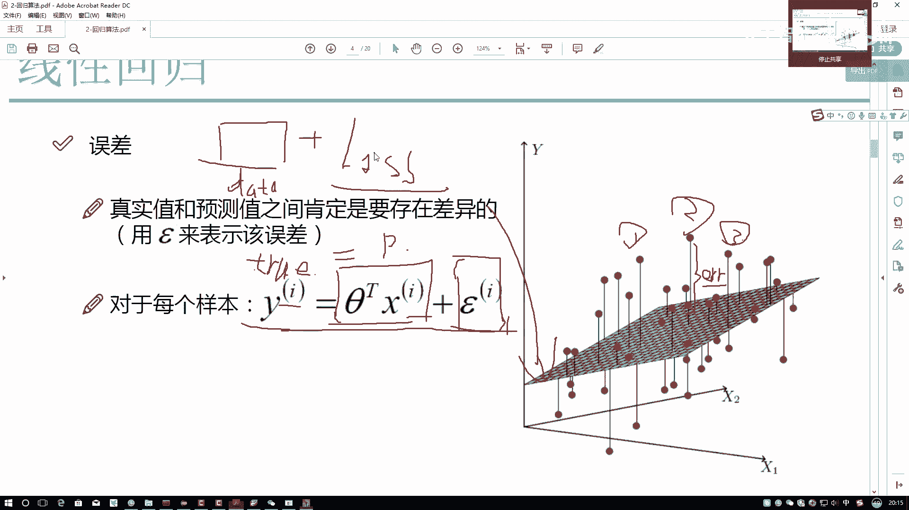
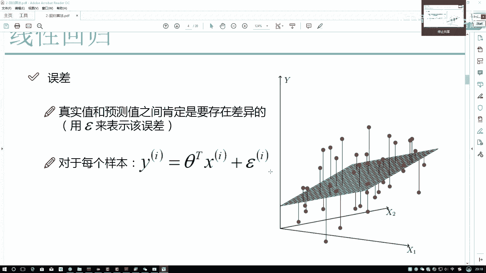

# 比刷剧还爽！2025全网最新Python金融分析与量化交易实战教程，三小时入门到进阶，全程纯干货无废话！---人工智能／深度学习／机器学习 - P51：2-误差项定义 - 人工智能- - BV1pqcteLEoS

首先我们来考虑一个问题，那你说什么样的平面才是刚才你解释的，最拟合那个现象，最拟合最满足这东西该怎么样进行描述啊，我们可以啊，来这里做一些假设，假设什么呢，咱们来看，首先我说做了第一点。

先把咱们的公式给大家写完，然后呢咱们来看一下，一会儿啊咱们该怎么样做拟合，我先把公式列出来，我写了一个呃HCTX表示什么，当前我做的这个平面，当前做这瓶二等于什么，刚才咱们说了SA1X1。

THEA2X二，这个是我们刚才解释的两点吧，你的工资对结果的影响，你的你的年龄对结果影响诶，这个大家都比较好理解，现在这里呢我又列出来一个CT0，什么叫做sat0啊，我们一般情况下只是这么样去。

就是这么样去称呼他们的，我说SA1和SA2它叫什么，它叫一个权重项，你写一下它叫做一个权重项，然后哎呀不写了，写中文太难看了，直接大家就知道了，他是一个权重项，然后呢吉特零叫什么吉特零。

我管它叫做一个偏置项，那大家可以来看一看偏执向什么意思，无论你C特一和C特二，或者X1是XX2是什么东西，我都不管，前提下奇特零改变的时候，我的平面会怎么样进行一个浮动，我的平面会怎么样进行浮动。

它会进行一个向上或者是向下的一个浮动吧，在这里你看向上或者向下的一个浮动吧，所以说啊咱们的一个偏执，向他做了一件什么事啊，偏执向就改变了这样一点，把我的一个结果又做了一个微调吧。

那可能咱当然虽然出的模型在结果上，哎呀好像总是偏低了一点，那我C特零我增大一点，让它偏高一点，是不是能弥补一些我CT0小一点，是不是说往下调一调，所以说啊大家就知道一点就行了，对于我的一个偏执项。

是当我训练完结果之后，不是训练完，在训练过程当中，使得我的模型能够更精准一点儿做的一个微调，这里希望大家强调记住一点，就我提到什么，它是一个微调，不是一个大范围的移动。

所以说啊对于当前咱这个线性回归方程当中，你的核心影响因素是什么，核心的影响是希特一和希特二，然后呢微调是C特零，这个是我们现在所构建出来的拟合的平面，有了这个拟合pr之后啊，还需要给大家解释一个事。

我们来想，你说现在啊，就是刚才我说咱们的数据X它是一个矩阵吧，你看这里它是一个矩阵，行呢代表力量本列，咱代表特征吧，这里比如说1233个样本，然后呢这一块1233个特征吧，那首先它是个矩阵。

之前我在给大家讲工具包的时候，也提到一点，我们接下来所有对数据的操作，都是对矩阵进行一系列变换，一系列操作吧，那现在我们来看有一点哦，我问大家一个事，你说这个C特零加C特1X1加C特2X2。

它是矩阵的变换吗，它能弹到矩阵这个层面上吗，好像还没有，为什么，因为你看矩阵当中，肯定是它一个参数和一个就是已知量，比如说CA1和X1，CA2和X2，这种组合我才能写成一种就是矩阵的形式吧。

但是在这里多了一项什么，多了一项C和零，多了这个C特零之后，好像来说就是有一项挺多余的，由于CA0的存在，我没办法干什么，我没办法去把它转换成一种矩阵的表达吧，那这里啊我们该怎么办。

这里我们就需要来想一想，怎么样把当前这个式子做一个转换吧，转换成咱能用矩阵来计算，接下来咱是不是写起来，或者计算起来都方便多了，那我们来观察一下这里差了什么，希特1X1，THEA2X二。

希特零差了个什么，是不是差了一个X0啊，在这里，如果说我找出来一项X0跟C特零组合在一起，那这不又是一个矩阵的形式吗，那此时大家来想，这个X0应该是什么呀，X1它是一个工资，X2它是个年龄。

他俩都实际有这样一个特别的含义吧，就实际有它真实的一个物理含义，但是X0呢好像是我新构造出来的，我构造出来这个东西，只是为了我做一个转换而已吧，所以说啊大家需要记住一点啊。

在这里我们在呃可以给大家列一下，这是X1，这是X2，这是X0，我需要咱们在做数据的时候，自己呢动手在数据当中新添加一列这一个列，你给叫个名字X0就可以了，然后里边都是什么值啊。

什么数乘上一个数等于这个数本身啊，应该是一吧，所以说啊大家以后啊，再看一些数据预处理的过程当中，经常会看到一件现象，在数据当中诶，它就是添加了一列，这一列全为一，那目的是干什么呢。

其实就是一个补位的一个含义吧，就是啊，让我们这个数据能转换成一种矩阵的形式，好计算而已。

而不是说啊在这个数据当中哎我添加一列一啊，是为了一些其他的表示的。

不是这个意思，只是为了我们计算做这样一件事的，然后呢此时当我去添加完了一列X0之后，当前那是不是又转换成一种矩阵的形式了，这个啊就是我们现在啊希望大家知道一点，我的HCTX我最终的决策方程。

或者说呢你叫做回归方程，叫做这个面儿吧，在这里咱们叫这个面，它是怎么样组成的，其中X是我已知的C。

他是我未知的，也是我要求解的啊，这个就是咱们现在要做的一件事嘶。

那我们来看吧，既然你要做这件事，刚才你说这个图，咱拿出来其中一个样本来观察观察，比如说这个一号样本，一号样本呢它可能这样，你看这个决策方程在哪，对一号样本来说，我们找到对于一号样本。

我可以得到它的一个X1，也可以得到它的一个X2吧，这些值我是不是已知条件啊，我的X1和X2我都知道了，那所以说呢现在我的方程有了X1X2也有了，那我能算什么，我能得到的一个东西叫做预测值吧。

预测值是什么意思啊，平面方程估计的一个结果，在这里我换个颜色呃，换一个换个蓝色吧，在这一块有个蓝色的点是吧，对于当前额，对于当前这个红色点往下一拉，就是往下做，做做一条垂线。

它跟咱的一个角色方程之间有一个交点吧，这个交点叫什么，这个交点叫做我的一个预测值，因为此时这个无论上面的红点，还有这个蓝点，它的X1和X2都是相同的一个位置吧，只是Y不同而已，那此时我们来看一下。

我说这个Y啊，它叫做什么，它叫做一个真实值是吧，为大家写一下这个东西啊，叫做一个我写个true吧，叫做一个真实值，比如说现在呢银行他手里有一批历史数据，在历史数据当中是不是有哎呀，银行在历史数据当中。

借着根据这个人已知条件借了他3万块钱，还是借他5万块钱啊，这个叫做我的一个真实值，后面呢后面这一项结果，我现在框起来这项这个叫做我的一个预测值吧，你看用我当前的一个sat。

和我的数据X进行了一个组合之后，得到的一个结果吧，这个叫做我的一个预测值吧，那我们来看这个叫什么，这叫做一个product吧，我写个P，此时呢，真实值和预测值之间有着一个什么差异吧。

你看这里我可以把这个差异列出来，这个就是我的一个差异项，我们把这个差异项叫什么呢，叫做一个误差项，写了一个error呃，这个这块你可以叫做一个叫做一个伊布奇诺，然后或者叫error都行。

我们写上了一个error是吧，它是一个误差项，那我们来观察一下，在这里对于每一个样本它的误差是一样的吗，首先这里一号样本，2号样本，3号样本，不同样本的误差是不同的吧，所以说我上面写了一个角标。

I代表着对于每一个样本，它的真实值和它的预测值之间，都是有这样一个误差项的吧，所以说啊希望大家先知道一点，我的真实值和误差值之间存在着一个误差，那你说我们现在要建立一个模型。

我们来给大家解释一下什么叫做机器学习，机器学习是这样一个事儿，首先呢你要告诉机器什么是你要的一个数据，咱数据有了吧，已经传上去了，然后呢不光有个data，还有最核心的东西是什么。

怎么样学怎么样学这个东西啊，我可以管它叫做一个loss function，或者是叫做一个目标函数或者叫损失函数都行，咱们就把它叫做目标函数吧，你给了机器一堆数据，你告诉他了一个目标。

机器呢就会朝着这个目标去学习一下，什么样的一个参数，能够最符合于你这样一个目标吧，这个是机器学习当中它的一个通俗的解释，那我们先来看我们的目标应该是什么，对于这个误差项来说，你希望它大点好。

还是希望小点好啊，误差项我们刚才说了，他也是误差项，它是真实值和预测值之间的一个差异，我希望差异等于多少才是最好的，一旦真实值和预测值是相等，代表你这件事已经做得完美了吧，此时怎么样损失等于多少。

损失等于零吧，所以说在这里啊，我们现在有第一个前提，我希望我的误差项越小越好，并且接近于零才是一个完美的，通常损失函数都是这么定义的，损失函数等于零的时候，代表做到了一个极限，损失函数越接近于零。

代表着你这个事做的越好，这个就是机器当中无论什么样损失函数。

基本上来说都是这样一个出发点的，那行了。

我们现在给大家解释了，有这样一个损失函数，那既有有这样一个就是误差项。

