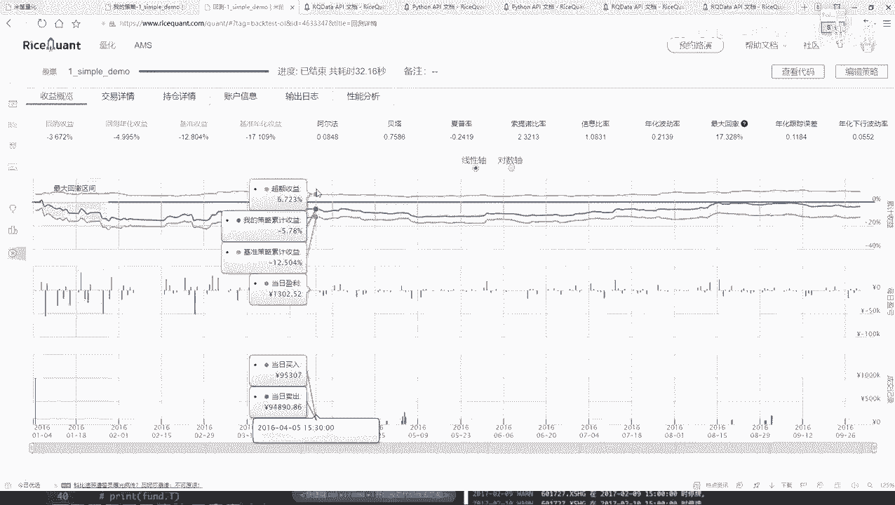
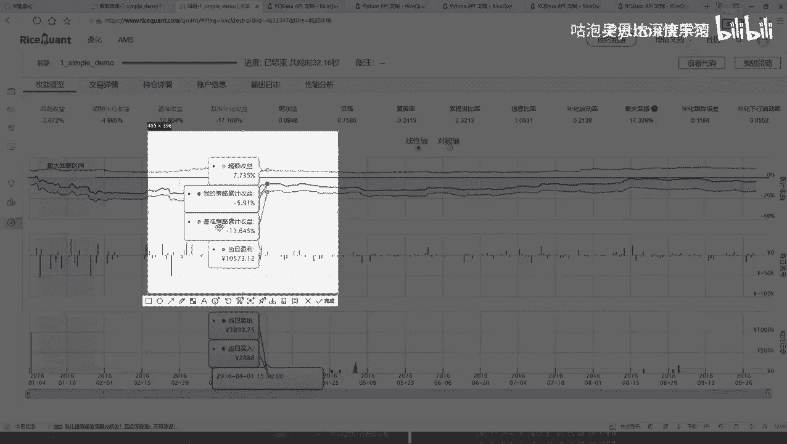
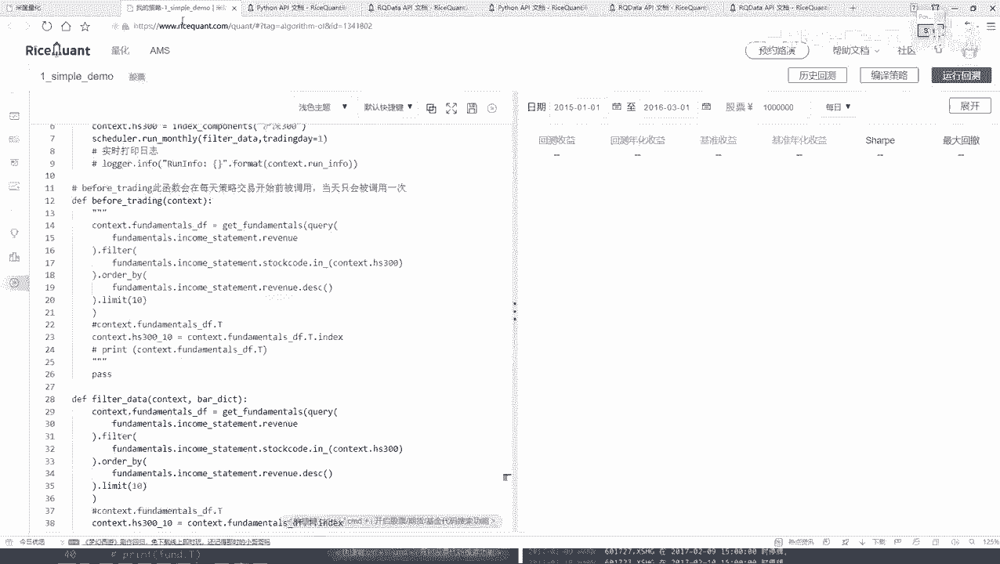

# 比刷剧还爽！公认最全的Python金融分析与量化交易实战教程，从编程基础到金融量化实战，全程干货讲解，学完即可就业！——人工智能／机器学习／数据分析／数据可视化 - P27：【Python金融量化】27-定时器功能与作用( - 迪哥的CV课堂 - BV1nF4m1T7qA

交易详情啊，就是咱们之前选的诶，这个时间你不是2016年1月4号，到这个2016年10月4号嘛，所以说啊就是每一天，那咱们刚才做这些事儿，你看啊，这里咱们之前说的时候，憨豆瓣里边每一天都会去做吧。

before trading当中也是每一天都会去做吧，那所以说咱们现在得到结果，那每一天都会去产生一些交易吧，你看这块它都是详细给你列出来了，这个1月4号啊，反正给你选出来这这这这这几个这十个是吧。

选出这十个，然后肯定第一天都是买的，因为第一天只有这样一个买，并且是一个平均的一个买吧，啊就是占到你的一个总价，它是一个平均的，然后总共是10万块钱，那就是相当于每一个买这么1万块钱呗。

但之前这里是不是指定了，我第一天第一天肯定执行的是这个东西是吧，因为第一天的时候他这块怎么样等于等于零了，你的仓位当中啥也没有啊，所以说第一天他就买，那咱们刚才写的是不是平均买啊，这个平均买就是这样。

就是你借我10万块钱，然后每个股票你买这么1万块钱啊，他是这个意思，那你看中国石化，然后他就要买，然后就有个成交量，然后这个成交价费用就是你那个什么印花税啊，然后还有什么华点，还有一些。

其他可能也就是几个几一点一点费用吧，一般买的时候都会存在一些费用的，然后下面就是啊第二天第二天的过程当中啊，他又会进行一些买，还有卖吧，因为他要保证就是咱们的一个仓位吧，你要把卖出东西了。

那你还要把这10万块钱给就是给他，你现在有多少钱，你都要给他花掉吧，这个意思啊，所以说这块第二天开始他就出现了一些买卖，然后成交量，然后成交价这个就不给大家一个看了，大家感兴趣自己去拉吧。

这有好多天了啊，就是一点点往下去拉，咱们能得到所有他的一个详细的一个，交易的一个结果，在这里你可以把它的一个结果展开，或者说你想看哪些指标，咱全看是不是都行啊，或者说你把这个东西也可以下载下来啊。

这个就是供你自己来去分析一下这些东西啊，都是啊你去模拟的一个实际的情况，持仓质量也是一样的，就在这里啊，你的一个价格，然后你现在比如说这个股票，你手里啊他有多少钱，然后你可以去看每天他的一个盈亏。

第一天肯定都是零二，因为第一天都买了，然后第二天开始是不是发生了变化了，你可以针对啊，你手里有的每一个股票，他给你去看啊，当前是亏了还是赢了，给我的感觉好像大部分情况下都是亏了，这连着亏了多少天了。

你看从这里连着亏是不是，这可能就是我看一下咱们那个最大回撤，是不是就是最开始的时候，你看最大回撤期间来了，这个是不是刚才我看到一堆绿的呀，什么，这就是我刚才说的最大回撤区间了。

你能不能挺过去的一段趋势了，挺过这一段，后面是不是稍微的给你涨了一点啊，有这样一件事吧，这个哦在这里相关当中也会有这样一个指标，详细给你介绍每一天你的一个情况，就连着亏了多少天啊。

占了整体时间的一个17%点多，占的还是挺多的，然后你这个账户信息，每一天你的一个你的一个市值吧，就是当前啊，反正就是看10万块钱到底让你霍霍成多少钱了，那你可以往最后翻，最后大概咱们刚才看是亏了点吧。

我看最后啊最后是亏了一些，但还好啊，亏的不是特别多，这块有你的一个账户诶，就是你就看你的一个市值，然后它的一个变化情况吧，这就行，这就是你的一个变化日志，就是你要不要去打印出来一些东西啊。

警告这个东西咱可以不看性能性能这个东西啊，咱咱也不用去看了，这些就是咱们得到的一些简单的结果，跟大家做了一个分析，然后呢你把鼠标点到这里的时候，它会给你显示出来，就是这里有一个你的一个策略首页。

就是这里你看这块有我的一个策略收益，然后它是一个啊，反正都是负的是吧，然后一个基准的，然后当前你的一个就是你的一个情况，然后这个超额收益就是你的策略的，然后减去什么，减去你的一个基准的。

相当于你比这个基准能强多少啊。

这个意思，这些啊就是呃咱们当前第一个简单小例子吧，然后大家大家可能有问题，就是现在啊可能看这个代码在HY当中啊，咱怎么处理的，那每天都处理，那你说你买股票用每天都去做这样一件事吗，好像不一定需要去做吧。

可能我说我做一些间隔，我说我十天啊去在这个池子当中洗一个牌，然后看看奶蛇是最好的，或者说一个月洗一次牌，是不是也行啊，咱能不能把这个时间点，我说我自己来设置一下啊，也可以啊。

这块我们也可以自己就是自定义一个函数，所以在另一个函数的意思啊，要给大家说一下啊，在这一块我们还有一个API也挺常用的，再来看一下，在这里啊，这里有这个东西叫做一个定时器。

大家看一看定时器是这样一个意思，就是呃他是就是按照一定的一个时间间隔吧，来去执行某一个函数，比如说啊你看在我们的这个策略当中啊，我们策略当中这块，我说每一天唉你都要洗一下这个牌，那洗的时候太勤了。

我说这个定时器，我说我给你生成这样吧，我说你每十天洗一次牌行不行，是不是也可以这样啊，咱可以自己去定义啊，什么时候去做这样一个洗牌操作，你看这里有每天运行，还有每周运行，或者是每月运行是吧。

咱们来试试吧，举个例子，我说这个东西啊，咱就每月运行吧，然后看一下它的一个参数，第一个参数啊，它要什么，你自己写一个function，自己写一个函数吧，然后这点就是每月当中你选择呃。

比如这个月底吧有好多好多个交易日啊，你选择哪个交易日啊，去执行这样一个操作啊，这些是我们自己要去写的，咱默认就拿第一个交易日吧，咱一会儿这块写一个一，然后呢这里你看当我们去做的时候。

这块让你写个function吧，这个function就是呃每月，然后第一个交易日的时候要做一件什么事，在这里啊，就是我们不能给他写到这个before trading当中了，咱们得稍微的改一改。

比如trading当中呃，这里咱就是哦我看一看这里啊，策略当中这个皮肤trading这一块，我说我就得给他注释起来了好了，比如确定给注释前，然后自己写个函数吧，直接复制个名字，先复制个名字。

自己写个函数，这个函数叫做一个呃，就叫做一个filter data吧，啊去过滤一下咱们当前这个数据，然后呢这个代码也不用自己写了，直接把所有这个东西咱全复制过来，是不是就行了呀，然后呢。

我说在这个我看一下这个他不是有要求吗，你看啊，这个当前我说这个每月运行能在哪使用，只能在你的一个构造函数int模块当中去使用，其他地方不能用啊，所以说我把这个函数给它复制过来，在测试当中指定一下吧。

好了我说加上我们的一个定时器，加上定时器，第一个function，你自己写的函数，咱俩这块是不是写了一个filter data啊，好了，我说我把这个filter data给拿过来。

然后每个每个月第一个交易日吧，来去执行这样一个操作啊，是不行啊，其他代码你说我用改吗，那其他代码都一样的，再也不用去改好啦，咱每就是每个月我们做一次洗牌，这样还是这个。

16年1月4号到16年10月4号吧，来试试吧，是这个结果怎么样，再来运行一下，看一看它的一个结果不一定好，也不一定坏啊，因为这个东西咱们现在指定的策略，相对来说比较简单哦，可能可能还不如刚才呢，不好说。

咱们来看一看呃，完了还真不如，刚才刚才我记得是亏了4%点多是吧，现在亏的更多了，可能这个就是你自己不断的去实验啊，不同的一个效果的，然后这里这样，我把这个时间点改一改，我说你可能这个16年。

可能这个16年不太好啊，我换一个年，我说这样吧，咱们给他指定成一个呃，18年一八年的一个1月1号，然后到这个20年吧，到这个20年的一个呃3月1号吧，再执行一下呃，结果好不好，这个东西都不好说啊。

咱今天给大家举这个例子，只是跟大家去说啊，这些API咱怎么用啊，至于它具体这个结果到底怎么样，这次对于这个结果，我估计刚才看可能不太好，刚才看到一个负的28%点多是吧。

可能这个结果还不如刚才呢来看一看吧，还不好说，等等他跑完的好了，这个结果跑完了，跑完之后果然不出所料啊，咱们设计了一个非常牛的策略啊，就是跟着你的指数走，诶，基本不打亏，跟着咱们这个策略玩。

那亏的啥也不是了，是不是，所以这一点啊，就是可能你选择呀一个不同的时间点，或者说指定咱不同的测试方法，你看刚才我就改了一个，你把电视机刚才原来咱们是每天执行，我说现在改成每月执行了，这个结果怎么样了。

那可能就完全都不一样了吧，这个效果不太好，换一个时间点，我换一个2017年吧，然后到二零别了，换早点吧，2015年可能15年的时候能挣一点，到2016年吧，咱再执行一下啊，试试水玩一玩。

其实这里主要给大家就是说了一下，这些API该怎么样用，然后呢这些指标咱们简单的做一下参考就行啊，就是会给大家，你看我换了一个时间点，这这哎呀刚才是正的，现在怎么突然变成负的了，可能就是这块出现点小问题。

如果说咱们只取前面这一段，我看看我说这个策略你看在在哪啊，在当前这一块，我你看到此时的时候哇，咱们这个收益怎么样，你看这块还是比较大的吧，盈利是比较多的啊，再往后就不行了，可能这个可能这个大盘也这样吧。

15年一五年初到15年中旬，可能是一个好时候，后面可能就完蛋了，这样一个事儿行了，这里主要给大家说了一下，就是在我们策略当中唉，怎么样基于这个平台啊，进行一个基本代码的一个写法。

其实基本的写法还是Python，然后就是参考人家API，就是勤看API吧，API当中都有什么这些个函数吧，像我给大家讲的，哎，你说我怎么知道在这块就写个query，query当中要有什么filter。

要有order by limit，接下来的就是参考人家的什么人界的API文档，来去写的这个工具，唉大家都开始刚开始去学，那说白了谁也不知道他怎么去设计的，最好学习方法就是参考人家文档。

自己来做一些实验就行了。

这个先给大家说了一下我们这个平台当中啊。