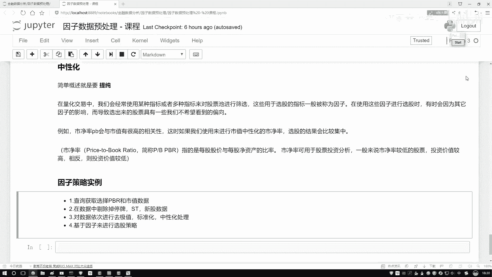
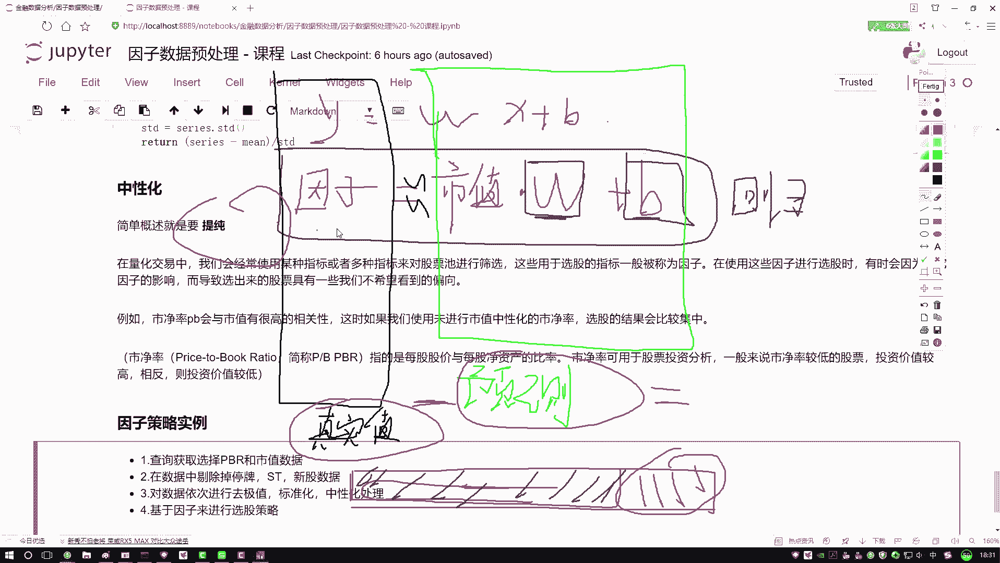
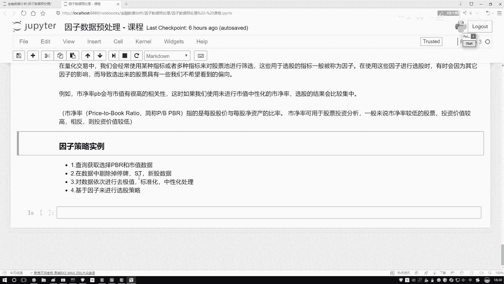
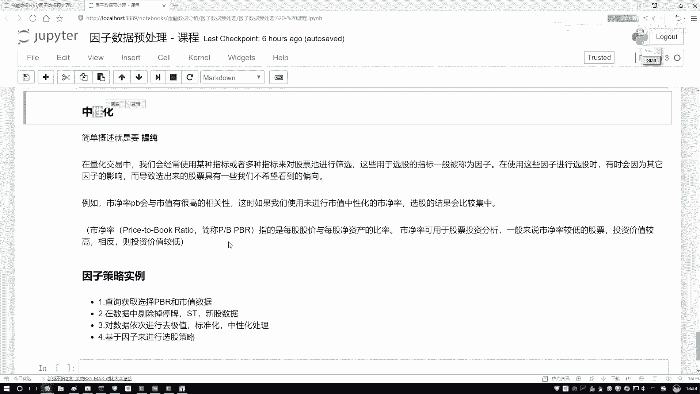
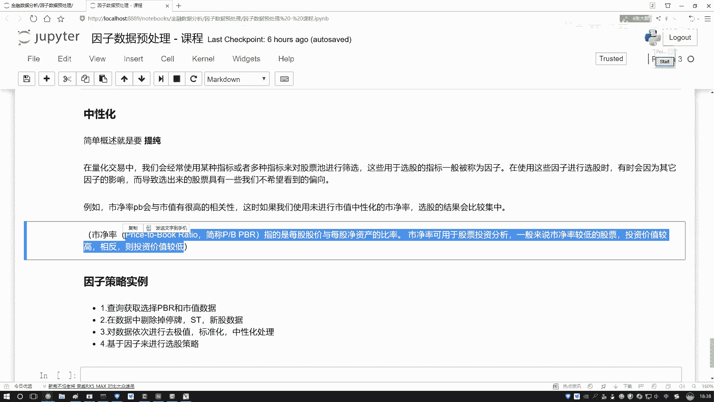
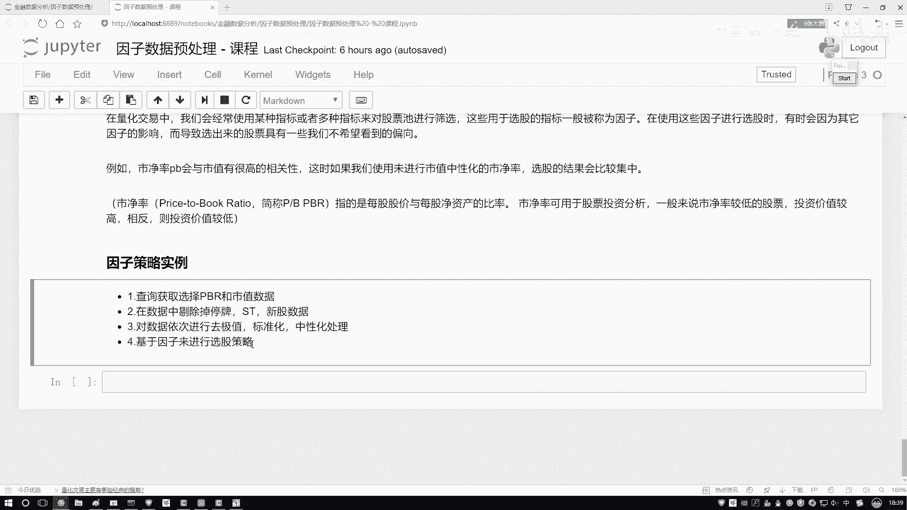
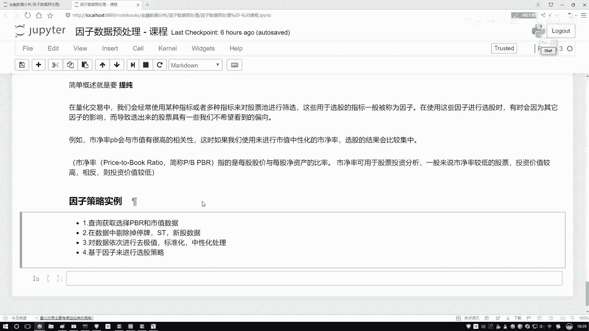
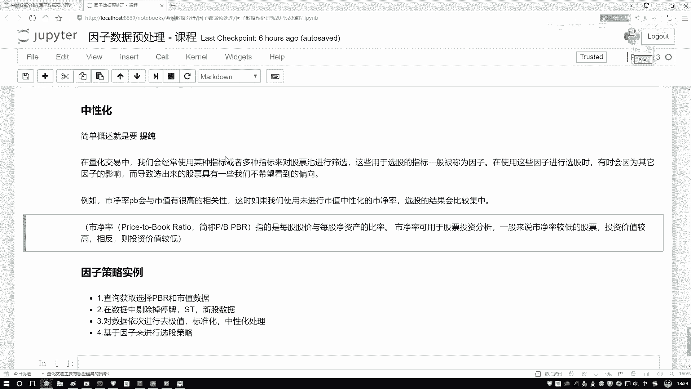

# 比刷剧还爽！2024最新Python金融分析与量化交易实战教程！3小时入门到进阶！全程干货无废话！（AI人工智能丨数据分析丨数据挖掘丨深度学习丨编程丨大数据） - P32：07-7-策略任务概述 - 迪哥带你学AI - BV125mdYoEEU

行了，那给大家说一说吧，哎你说提纯这件事啊，我该怎么去做啊，比如说现在我这样，我说我有一个因子啊，说这个PB它就是我的一个呃因子行吧，然后呢我说这个因子当中啊，有一些我不想要的成分谁呀。

那比如说现在我发现了这个市净率啊，跟这个市值啊，它关系挺大的，然后呢在市净率当中啊，包括了一些跟市值相关的东西，那我既然要提纯，那是不是说现在哎我说这是我的一个因子啊，表示我的一个市净率。

然后呢这个它是一个市值是吧，我是不是说想在这里哎，我把蓝色这个东西给它清出去啊，是不是做这样一件事儿啊，那怎么清啊，你是不是得先知道市值，哎，比如说我说因子，我说因子现在是个整体。

我们是不是想看一看市值啊，解释了这个因子当中的哪一部分，我把这一部分找到，然后呢，我做一个减法，做完减法之后，我剩下的是不是，就是我中心化之后的一个结果啊，那怎么做呢，我是这样想，大家举个例子诶。

我说我做一个方程，这个方程当中啊，大家一定注意啊，就是谁等于谁啊，我说我现在做这个因子啊，就好比是我的一个实定律啊，我说这个因子啊，刚才你不是说了吗，跟谁相关的，跟我这个市值相关，那我说这样吧。

我说这个市值啊，我写出来这里我说有一个市值市值跟它相关啊，那是不是得有一定关联程度啊，那给我们感觉好像这样哎，就像是一个Y等于这个WX，加上一个B的过程吧，好了我说这块是指你再给我乘上一个W。

再加上一个B行吧，我说有这样的关系，既然你说市值占因子当中一部分，那我把他俩列出这样一个式子，没问题吧，诶那大家来想啊，那现在我们要干什么，我是不是要找到因子当中市值占了多少。

那说白了我要干一件什么事啊，这个东西叫什么，这东西叫什么，它是不是哎就是一个回归方程啊，如果说我能把这个回归方程给他解出来，什么叫解出来，我知道W是什么，知道B是什么，我是不是就能知道了。

哎呦这个市值啊，占我因子当中多大的一个成分了，哎是不是这样一件事啊，但是我问大家一件事啊，我们之前哎在讲线性回归的时候，在机器学课程当中啊，我经常会讲其我都是先讲线性回归，那我问大家一件事。

我说现在啊当你得到了这个W，得到了这个B之后，你跟市值啊乘就W乘上市值，再加上B之后，你还原回去得到什么，我们一般情况下管这东西叫什么，是不是叫做一个预测值啊，哎当前我说现在我拿绿色框，且这个东西。

我说这个东西啊叫做什么叫做一个预测值，唉这有没有什么问题啊，没问题吧，然后呢，我说现在我这块是不是还列了一个Y，这个Y是什么，我说这个东西啊，它是什么，它是我的一个真实值吧，是不是我的一个真实值啊。

那现在大家看哎你说这块我们列了是一个等式，但实际当中你真能得到一个等式吗，在线回归当中你真能得到这个等式吗，不一定吧，我们得到什么是一个近似解吧，实际当中那表示什么意思，好像说这样一件事啊。

哎我做一个回归方程用啊，我的一个Y，或者说用我的一个标签表示我的因子，用的是值表示我的输入数据，我现在就想看一看，我市值解释了因子当中多大一部分，我做了这样一个回归方程，得到了W和B吧。

然后呢我说这样W和B哎，我还原回去，W乘上市值，再加上B之后得到这个东西叫预测值吧，那预测值和真实值之间是不是会有一个差异哎，预测值和真实值之间肯定会存在一个差异吧，我们一般情况下叫做这个误差项。

为什么会出现差异呢，为什么会产生差异啊，我们现在这个预测是什么意思啊，我要看哎呦，因子当中多大一部分能被市值所解释，它们之间的一个差异代表什么，它们之间的差异哎画这个图当中是不是这样。

我说现在啊有这个啊，重新画这个图，在在这儿来画吧，在这画也行，就是在接着来这画得了，换个颜色，我说这个图啊，它本来是个红色的，然后呢是指解释了其中蓝色这一部分，那它们的差异代表什么，差异在哪啊。

是不是我现在画圈的这一部分，这一部分代表着我当前的一个差异啊，什么意思啊，真实值和预测值之间必然存在一个差异，这个差异就是市值，你解释不了因子的那一部分，可以吧，说白了回归方程当中我们建立了一个联系。

建立联系的意思，我就找到了市值占因子当中多大的一部分，或者说市值能解释因子当中多大一部分，一旦我做一个减法，用真实值减去我的一个预测值，我能得到什么，是不是就是我想干的一件什么事儿啊。

就是提纯的这一件事儿吧。

好了，咱们来总结一下，一会儿我们该怎么去做，第一步好，我们要建立回归方程，建立回归方程的过程当中啊，一定注意诶，谁当Y哎，谁当Y是把因子当Y吧，好了注意点，我是把因子当Y了啊，你想剔除谁的影响。

把谁当做一个X吧，要做这样一件事好了，第一步求解回归方程当中的一个W和B，W和B减完之后啊，我有了一个X，我是不是趁现在我手里有因子实际的值，用因子实际的值哎比如这个Y减去什么，你的一个预测值吧。

大家不要大家以前如果说对机器学习不熟悉啊，你看我这边写个等号，不是说他俩就是一定相等，我是说这里要建立回归方程来，尽可能去估计W和B啊这样一件事，所以说啊现在我们给大家解释了一下，咱们该怎么去求。

那一会儿呢中性化的做法，对于大家现在也猜到了，第一步建立回归方程，第二步呢用回归方程当中的，这也就用回归方程得到的结果被谁减去啊，被你的一个因子实际当中值减去，这相当于在因子当中啊。

刨除了哎我一些我的跟其他的呃，就是你想刨除掉的哪些对你有影响的，这样咱们做一个减法，得到，剩下的是不是就是因子实际该有的一些信息啦，我们把这个过程就叫做一个提纯，说的挺复杂呀，哎呦我天说的是不是挺复杂。

但是其实做起来是不是挺简单，哎就是在我印子当中减去啊，不能被你当前的一些指啊，比如说比比如说在市盈率当中减去，不能被咱们的一个市值所解释的那一部分，剩下的就是我要的一个纯的这个意思啊，说的有点绕。

大家自己来理解一下。

看一看是不是我们说的回归方程哎，这样一个意思嘶行了，最后我们要做一个因子的一个策略啊，先给大家说一说呃，咱们这个策略啊。

然后要怎么去做啊，是这样一件事，我先把这个过程写完，一会呢咱们来写这个策略，或者这样，现在既然我们提到了啊，有两个指标，一个PPPR是吧，我们的市净率还有个市值行了，把他俩指标先拿出来。

一会儿你不是要干什么吗，你不要去玩这个那个什么中中心化是吧，哎咱一会拿这两个值来给大家举个例子啊。

然后哎对这里我说这个中心化其实还忘说一点，我们现在说的是什么因子要做中性化吧，其实在实际一些量化当中啊，不光因子做这做这个中性化，一些行业是不是也能做中性化啊，其实能做的事蛮多啊。

这些咱先不给大家做延伸啊，大家后续可以自己来去看资料，能做的东西还蛮多的。

咱就先拿因子来来来给大家举例子，在这个ppr和事实数据，我先拿到手一些指标，然后呢在数据当中啊，我要做一个剔除的操作啊，比如说现在股票池里边，我要剔除一些我不喜欢的，或者说剔除一些垃圾吧，什么垃圾啊。

停牌的呀，s st股啊，还有一些新上市的呀，比如说小于半年啊，半半年之内上市的，我可以先都不管，剔除掉一些我不想要的股票，然后呢依次对我们数据要做处理，哎按照咱顺序啊去极值啊，标准化中性化。

然后我们处理完处理完之后呢，我们要做这样一件事啊，考虑干什么，基于我处理后的结果来去选股了。

比如说现在我说这个市净率啊，我说他现在小于0。2的，我认为是我比较喜欢的，我说我把所有小电R结果哎拿出来，基于这个策略，还有选股是不行啊，说白了就是一个基于因子来去选择，股票池当中啊，哪些我要买。

哪些我要卖啊，这样一件事，这个是一会儿啊咱们要完成的一个任务啊，中心化咱在这个策略当中啊，给大家一步去写吧。

萝卜当中咱不看了啊。

