# 比刷剧还爽！2024最新Python金融分析与量化交易实战教程！3小时入门到进阶！全程干货无废话！（AI人工智能丨数据分析丨数据挖掘丨深度学习丨编程丨大数据） - P65：【聚类分析策略】01-1-KMEANS算法概述 - 迪哥人工智能课堂 - BV1UVksYbEjy

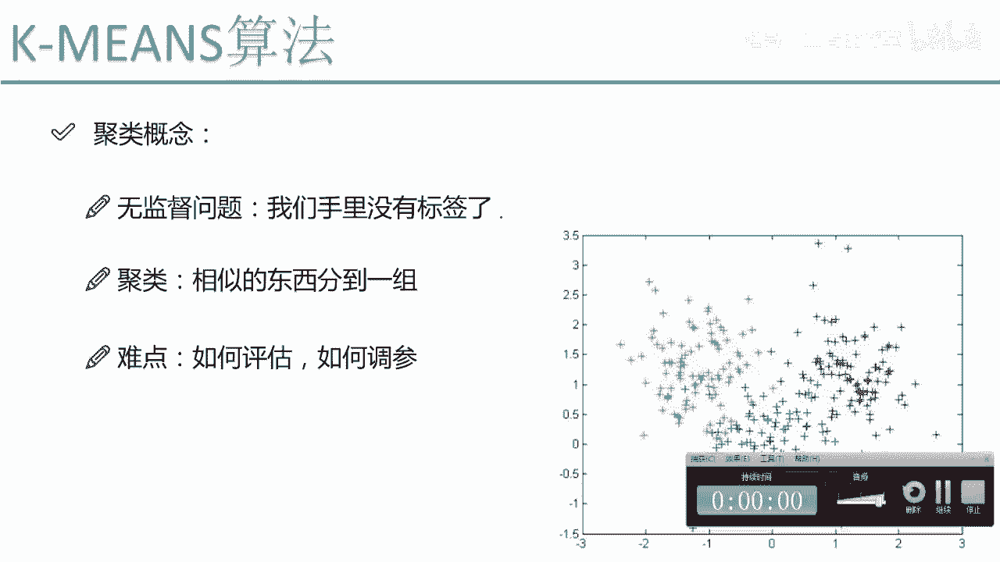

这节课呀咱们就来说一下，在我们的机器学习当中啊，另外一个非常重要的分支叫做一个聚类，那首先啊咱们先来说一下聚类是用来干什么呢，这回啊我们的问题变了，咱们之前讲的问题啊，是不是说那我们手里都是有一个标签。

然后呢我们要优化一个东西，然后写出一个目标函数，朝着这个目标函数进行优化就可以了，只不过说呢各种各样的算法可能来说，它优化的过程是不太一样的，那现在我们的问题突然加大了难度。

我们现在是一个无解读的问题了，也就是说现在呢我们手里并没有每一个嗯，标就是没有，并没有每一个数据属于某一个类别的一个标签，那对于这样一个问题啊，我们就说它是一个无监督的问题。

这个聚类啊也是我们无监督问题当中啊，最典型的一个代表了，那这个聚类要干什么呢，其实啊跟我们分类的效果是差不多的，我们还是啊要把这个比较杂乱的数据，分成到很多的堆，也就是说聚类啊。

我们是要把相似的东西分到一组，比如说我们来看右边这个图啊，其实呢右边这个图啊，在原始数据集上啊，它是没有这样一个颜色标记的，也没有告诉咱们啊，这个绿色的是哪个，蓝色的，是哪个红色是哪个。

我们就要根据啊一种啊，比如说一种相似度度量的方式，把一些相似的东西归到一边，比如说在这里我们来看绿色的归到了左啊，就是左上角红色的，右上角角蓝色的，咱们的中间的下角这块，也就是说啊根据我这个数据啊。

它分布的不同，我要把相似的啊往一块凑，测完之后呢，我就得到了三个醋，也就是说聚类完之后，结果我得到了三个不同的类别，分别是绿色红色，还有这样一个蓝色的，那看起来啊就是聚类算法诶，应该也是蛮简单的吧。

其实呢聚类啊，它从算法原理上来说是比较简单的，但是呢它仍然啊是具有很多比较困难的问题，给大家来举个例子啊，就是我们这个聚类它的一个难点在什么地方呢，它这个难点啊不像咱们那个有监督问题，我们有标签。

有标签的时候，我们便于干什么，便于咱们自己进行评估吧，咱们之前是不是可以做个交叉验证，然后看一个精度啊，record值啊，f score值啊，或者是你的一些true party啊。

false negative啊之类的这些很多个评估标准，那这些横评估标准是怎么来的，是基于你的预测值和真实值之间，做了一个比较吧，或者说我们看了啊，预测值和真实值之间的差异怎么样。

按照某种啊评估的方法评估出来一个指标，那这个是我的有监督问题当中，我可以进行很多种评估，但是呢在我无监督问题当中啊，我手里没有标签了，这个评估啊它就非常非常难了，我们需要啊去评估一下你聚类完的结果。

这个东西啊难度是稍微有一些的，还有一点难点啊，就是我们参数该怎么样调节呢，嗯比如说我当前第一组参数啊，得到了一个错误结果，第二组参数又得到了第二个结果，那你说一参数和二参数哪个好呢。

这点啊也是比较难比较，为什么，还是因为啊咱们手里没有标签嘛，一分完类结果不知道它分类到底怎么样，二分类结果也不知道究竟它分得怎么样，也就是说我们手里啊没有一个标准的答案，那没有一个标准答案。

这些事啊他做起来就稍微有些困难了，这个是我们聚类当中啊一个比较大的难点评估，还有调参的一个问题，那接下来我会给大家讲两个。

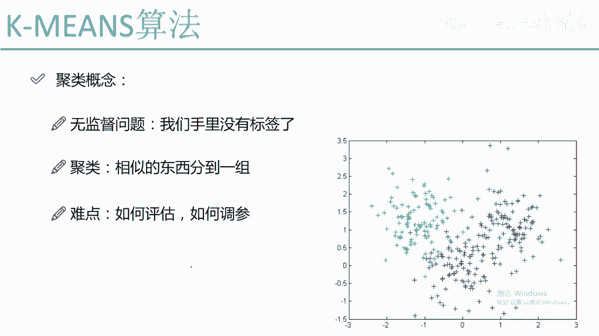

非常经典的聚类算法啊，咱们就一个个来看吧，第一个啊是我们看的最多的，也是用的最广的，叫做一个k means算法，k means算法啊可以说是绝绝算法当中啊最简单，但是呢也是最实用的一个算法。

首先啊咱们先来说一下，就是这个k means算法它的一个基本的概念，就是首先啊咱们需要明确一点，就是说嗯这个k min算法需要我们指定一个东西，叫做K值，K值是什么意思啊。

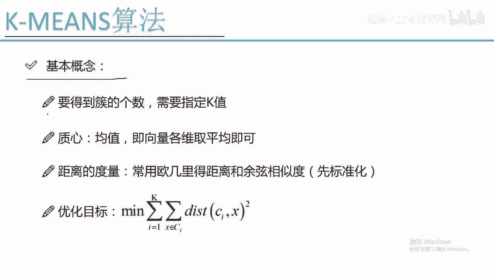

比如说上面这个图呃，我说了一个K等于三，那它最终是会什么，最终它会把我所有的数据聚成三个堆，就是绿色，红色和蓝色，那如果说我设置了一个K值，K等于四呢，K等于四啊，它会把我这一堆数据聚成四堆。

K等于五五对，K等于六六堆，也就是说嗯一份数据来了，你需要明确的告诉这个机器，你呀是想给它锯成几个堆儿啊。

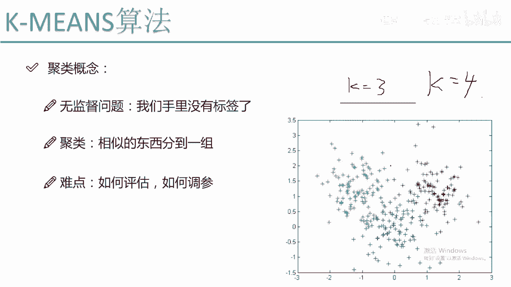

这个值首先需要咱们自己给定，这个也就是我们KMSL当中最重要的一个概念，需要指定一个K值，你指定K等于多少，它就会帮你得到多少个醋，下一个是一个质心啊，质心是在KPI当中啊，一个非常重要的概念。

什么叫做一个质心啊，至心说白了就是一个数据的均值，咱们现在想啊，就是我把一堆数据聚成了一堆，那这一堆啊它是不是得有一个均值的位置啊，均值是什么，均值，说白了就是各个数据在各个维度上取平均，就可以了。

比如说一个二维的X轴和一个Y轴，那我X轴上所有的数据取个均值，Y轴上所有的数据再取个均值，这我就得到了一个至今X啊，X和Y相当于是嗯对所有的数据啊。

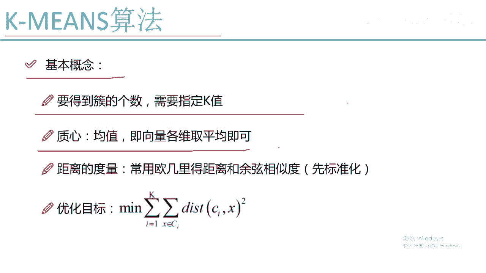

都取了这样一个均值，那这里呢什么叫做一个质心啊，比如说我来看单独看这个绿色的，绿色的一个质心，可能大概是这样的一个位置，也就是各个啊X的一个维度取个均值，Y这个维度取个均值啊，得到了我的一个质心。

红色呢也能算出一个质心，蓝色的，同样我可以算出来一个质心，每一个醋啊，我都需要得到它的一个质心。

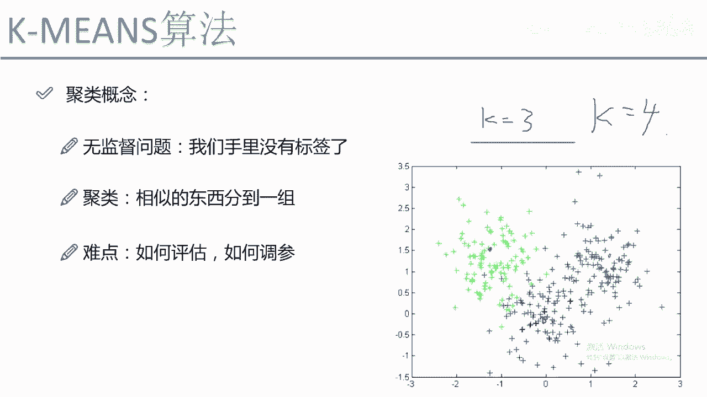

那这个质心有什么用呢，啊这个质心啊是我之后要进行迭代需要用到的，大家需要先知道有这样一个概念，叫做一个日新距离的度量。

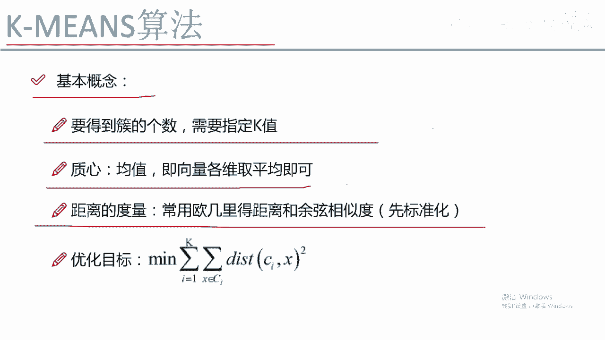

距离的度量是干什么的，咱们刚才不是说了吗，要把相似的东西分到一组，那怎么判断两个东西是不是相似呢，这个呀我们就要基于一个距离去做计算了，距离是什么意思啊，咱们来看，比如说咱们上有左上角有两个样本点。

这两个样本点到底有多相似呢，我们就可以来计算一下最常见的计算方式啊，就是一个欧式的距离嘛，直接算两个点的欧式距离，就是X轴减去X轴减X轴的Y轴减Y轴，再算这样一个平方向，非常经典的一种计算方式啊。

叫做一个欧式距离，欧式距离估计大家都比较理解了。

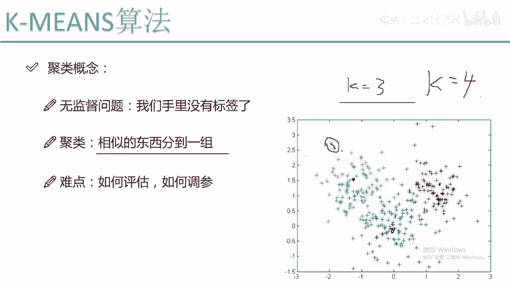

欧式距离是其中的一种计算方式，或者呢我还可以算一个余弦的相似度啊，这两个都是比较常见的，但是呢对于我们这K面算法，普遍情况下，我们都是使用这个欧式距离，来当成我们这个距离的一个评估标准的。

那这里有一个问题，就是嗯当我们使用一个欧式距离的时候啊，通常情况下我们要先对数据做一个标准化，什么叫标准化，比如说我现在有两个维度，一个X轴，一个Y轴X轴的数据啊，它都是比较小的，可能是分布都是0。

01，有的是0。01，有的是0。04，有的是0。03，这是我第一条数据，第二条数据，第三条数据在X轴上它的一个差异比较小，那在Y轴上呢它差异比较大，可能Y轴上是一个105，161，267啊。

都是一个比较大的一个数，那这回我们来看当我们计算相似度的时候啊，X轴无论你怎么算，它的差异都比较小吧，Y轴也是无论你怎么算，差异都比较大，那这个时候我们是不是潜意识就认为啊。

咱们的一个相似度主要就由Y来决定的，X基本没起到什么作用啊，可能有这样的一种想法吧，因为计算出来就是这样的呀，所以说呢，在我们使用这个距离的一个度量的时候啊，一般情况下哎不是一般情况下了。

基本所有情况下我们都要对，先对我的数据啊做这样一个标准化，什么叫标准化，比如说我做这样一个归一化，那我第一个X轴，它的取值范围都是从01~1的区间，Y轴取值范围也都是从0~1的一个区间。

也就是说让我的一个数据啊，X和Y它的取值范围啊，基本上都是在一个比较小的范围内进行浮动，比如说都是0~1，都是-1~1，这些啊都是可以取的，也就是我们要做咱们的一个标准化的一个操作。

这个是在我们啊距离当中啊，基本上是必做的一项啊，先把数据做标准化，然后呢我们再用距离的度量啊去看一下啊，什么样的什么样的两个样本点它是比较相似的，再把相似的分到一组就可以了，然后呢我们的KMN算法啊。

它是要有一个优化目标吧，这个呀跟我们的一个机器学习的，一个套路是一样的，无论我们在做一件什么事，我们都是要进行一个优化吧，通常情况下一个问题很难直接进行求解，我们是直接啊。

我们是经常通过这样一种优化的思想，找一个目标函数不断优化，不断的迭代进行求解的，我们来看我们要优化的什么，要优化的，首先最外层是什么，最外层有一个I从一到K，I从一到K什么意思啊。

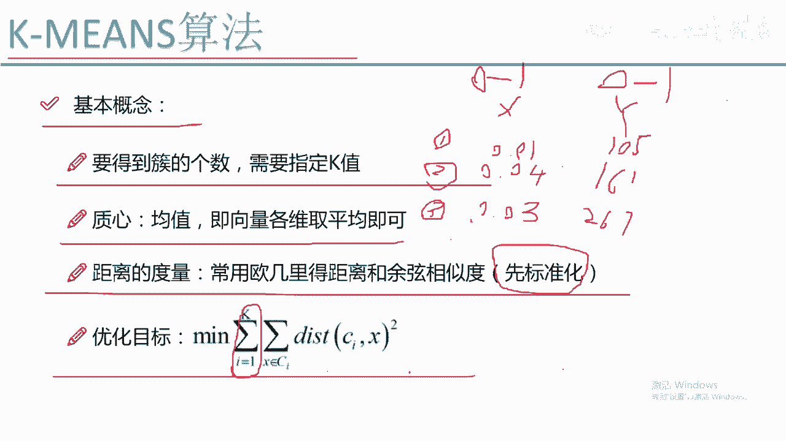

它表示的就是我呃一共有多少个簇，比如说这个K等于三的时候，我要优化的就是对三个醋分别进行优化，那里边什么里边是对于每一个醋来说，它都是有这样的一个嗯，都是有这样的一个中心点吧。

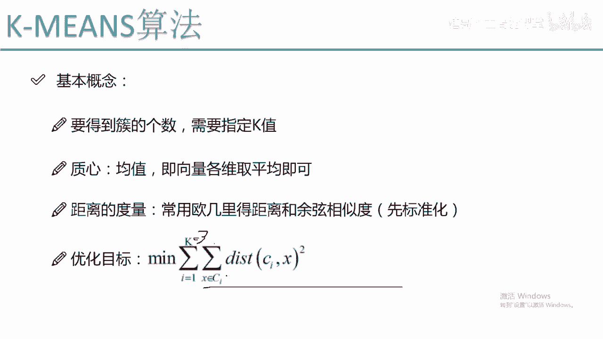

那我要优化什么，比如说我们来看嗯，我们这个图当中啊，我这个绿色的绿色里边它是有一个中心点，我要优化的，就是让每一个样本到中心点的距离，都能够越小越好，也就是说这个中心点啊，真的是离促当中每一个值。

它的一个距离我都可以算出来吧，就是每一簇当中啊，绿色点当中每一个值到了中心点的距离，我都是可以算出来的吧，我希望这个求出来的一个总和，就是每一个点到中心点的距离的一个求和，对于这样所有绿色点来说。

它的值是越小越好的，这是对于其中的一个醋，那还有这样红色的醋，还有这样蓝色的醋。

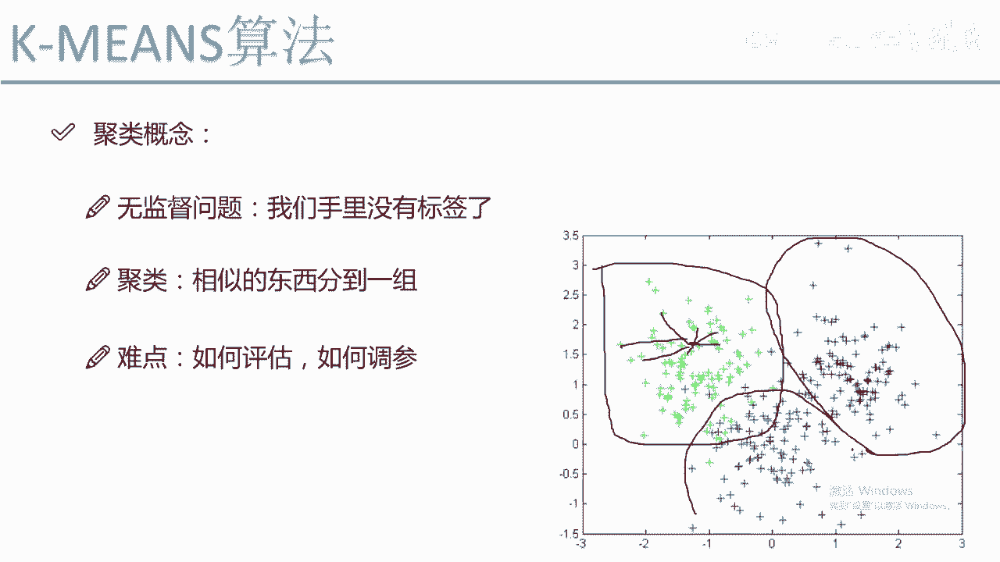

对于每一个醋来说，我们来看I从一到K对于每个醋来说，它的一个值到中心点的距离啊，都是要越小越好的。

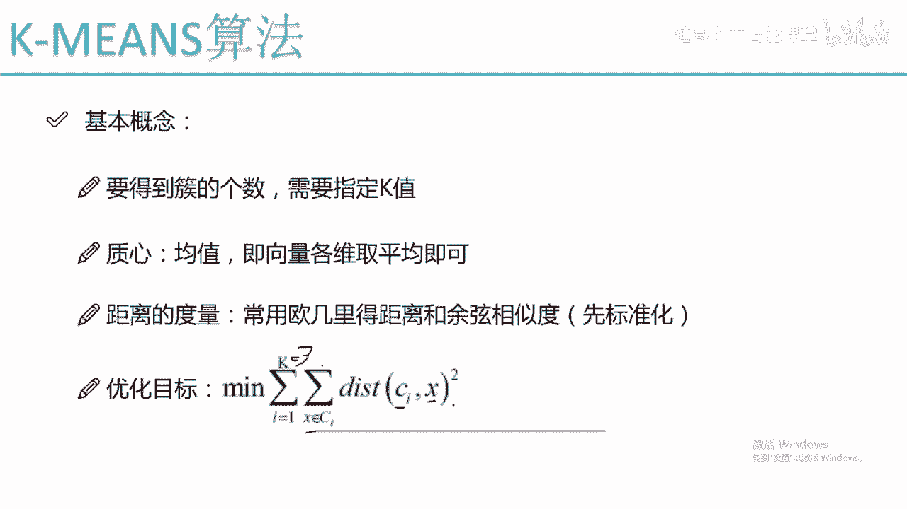

为什么越小越好啊，因为越小我们说它是越相似的吧，我们的目的呢就是把要相似的东西归到一组，所以说我希望啊这个醋当中哎呀，它们离它距心的一个距离都是越小越好的，不希望什么情况，不希望，比如说这块有一个点。

我我是分错了这个点它哦我换一种颜色吧，我换一种颜色，哎我这个颜色我看一下在哪去换个颜色呢，换一个蓝色的吧，换一个绿色的，在这里，比如说我这块还有个点啊，这块还有绿色点，那我们可以看到。

就是说我们现在由于多了一个绿色点，这个绿色点其实本身呢应该给它画成红色吧，但是其实呢我给它划分成了一个绿色，那这个时候啊我们可以想一想，绿色的这个样本点到它至新的一个距离，是不是非常大呀，非常大。

是我不希望的一种情况，所以说在我迭代优化的时候呢，我就会发现哎呀这个绿色点它这个位置不太好，它不应该属于绿色的，那我给它画成一个红色的不就可以了吗，所以说啊在这里啊，我们是有这样一种想法的。

就是基于每一个点来说，我要把它划分到一个合适的地方，怎么看它合不合适呢，就看它到中心的一个距离，它到绿色中心距离比较大，到红色中心距离比较小，所以说我认为它是红色的，可能性是更高的。

我就会把它归到红色这个堆。

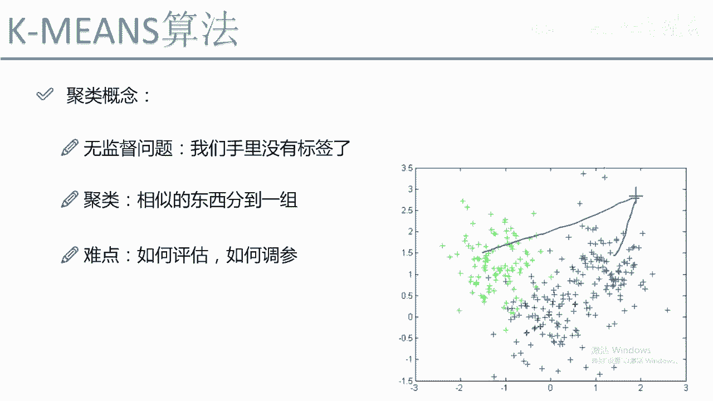

这个就是我的一个优化的目标啊，我要使得我的一个每个簇当中啊，他的一个所有样本点到我促间间距离，都是越小越好的，那这个就是我们的k means算法，它的一个基本的概念啊，可以看出来就是k min算法。

基本上没有什么难度吧，也没有什么数学，咱们用一种通俗的方式啊。

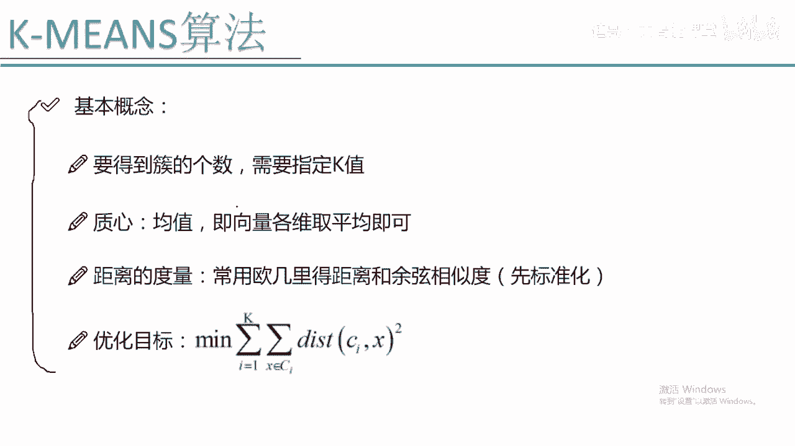