# 比刷剧还爽！2024最新Python金融分析与量化交易实战教程！3小时入门到进阶！全程干货无废话！（AI人工智能丨数据分析丨数据挖掘丨深度学习丨编程丨大数据） - P7：05-5-短均与长均计算实例 - 迪哥带你学AI - BV125mdYoEEU

接下来啊咱们来做一个股票啊，序列的一个分析策略，这个分析策略啊是让我们去计算一些指标，然后看一看我们什么时候该买，什么时候不该买，其实说白了就是一个比较常见的词儿，这个黄金交叉，还有一个死亡交叉。

那这里呢当我们要去计算啊，这个黄金还有死亡的时候，我们是不是得有两个指标啊，啊你得告诉我一个短期平均的走势，还有一个长期平均走势，然后我们看一看它们在哪儿，出现了这样一个交叉吧。

在这里我们就得按照这个套路一步步去做啊。

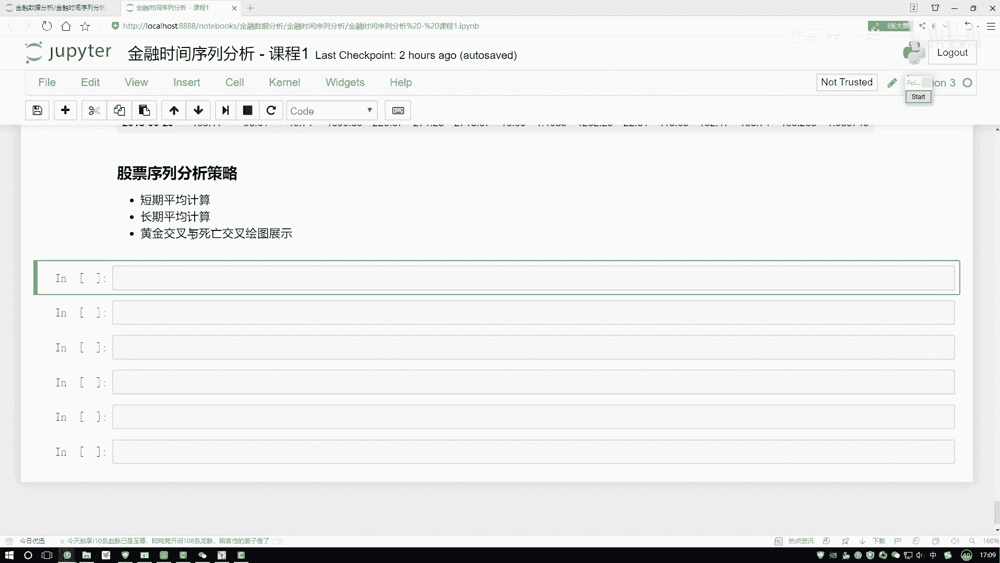

首先第一个啊这块这是我们第一个要去做的，是一个短期平均，然后跌下来长期平均。

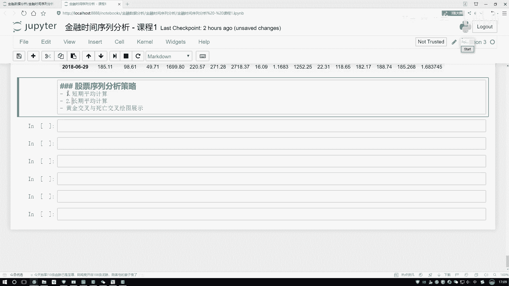

最后画图给大家做一个展示就可以了，好现在算这个短期吧，短期的话一般情况下就是五天比较常见吧，因为一般啊咱们的一个一周哎，我这五个交易日，所以说一般咱拿五天来去算，但是啊这个数据这个数据啊。

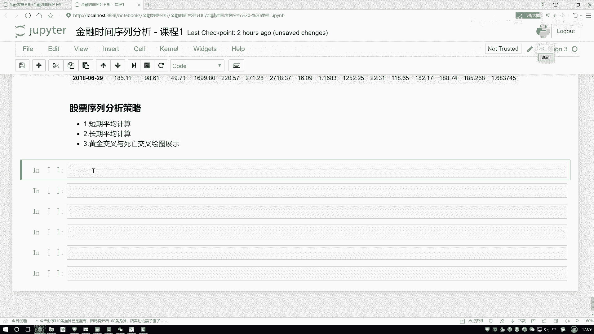

你看他这个从这个10年到这个18年，这个时间有点太多了是吧，所以说我们也可以相对的把这个短期和长期，改的稍微的大一点儿，正常短期可能五天时间比较常见，然后长期呢可能20天30天哎，这比较常见。

比如说我们先写吧，先把这两个值给计算出来，管了多少天呢，先算吧，额对于我们DA来说，我要指定某一个股价。

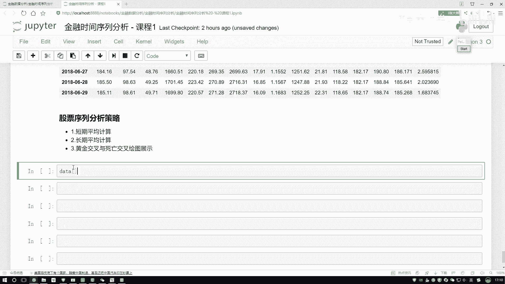

算哪个，看哪个股票呢，就看这个得了，就看咱刚才说的这个苹果股票得了好啦。

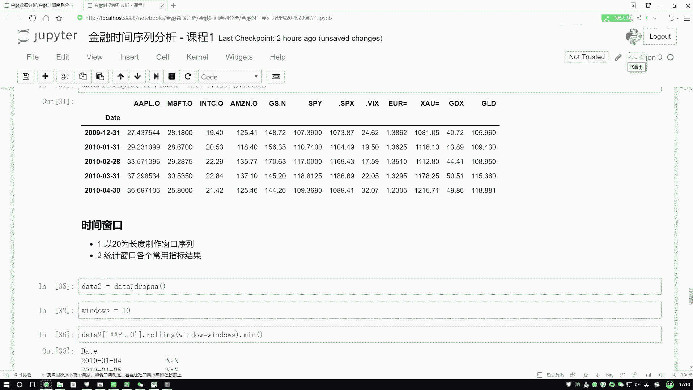

对于我们当前的这个苹果股票，然后呢对于他做这样一件事，我们去算一个窗口是吧，算窗口它的一个均值，那我们算一个短期，短期当中啊，你自己指定一个window window，咱指定稍微小一点。

比如说呃就十天吧，就是一个十天做一个窗口，然后呢，哦在这块我算了一个它的一个均值就可以了，这就是一个短期的平均，很简单吧，以十天为一个窗口去算哎这十天的均值，然后把这均值拿到手。

传入到我的data frame当中，指定一个名字哦，还没有指定名字，在这块我得给他指定个名字啊，就叫做一个十天吧，得了啊，这就叫做一个10day，然后呢我们再做第二个呃，比这这个比较实在了。

叫做一个短期吧，叫做一个method1，然后一会再做一个长期method2，然后再写一个M2吧，M2就是还是股票，但是我们窗口可能稍微大一点，咱指定成一个30吧，然后还是算他的一个呃平均值给大家算完。

算完之后呢，然后呃把这个结果展示出来吧，这个股票当中，股票当中我看我要展示哪些指标啊，呃我展示这个苹果就行了，就展示这三个吧，一个是苹果的一个诶，这个多怎么多了一点东西啊，这个直接复制过来。

一个是苹果的骨架，然后第二个就是咱们的一个M1，还有一个M2好，这个是M1，然后再把这个M2给复制过来，把这三个指标显示出来就行了，然后对于它我去呃点HIIT一下哦。

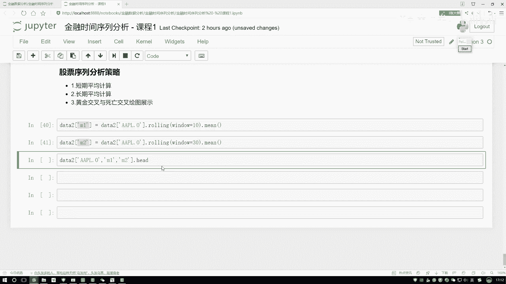

这块我看是出错误了，出KEROKERR说明我传入的啊。

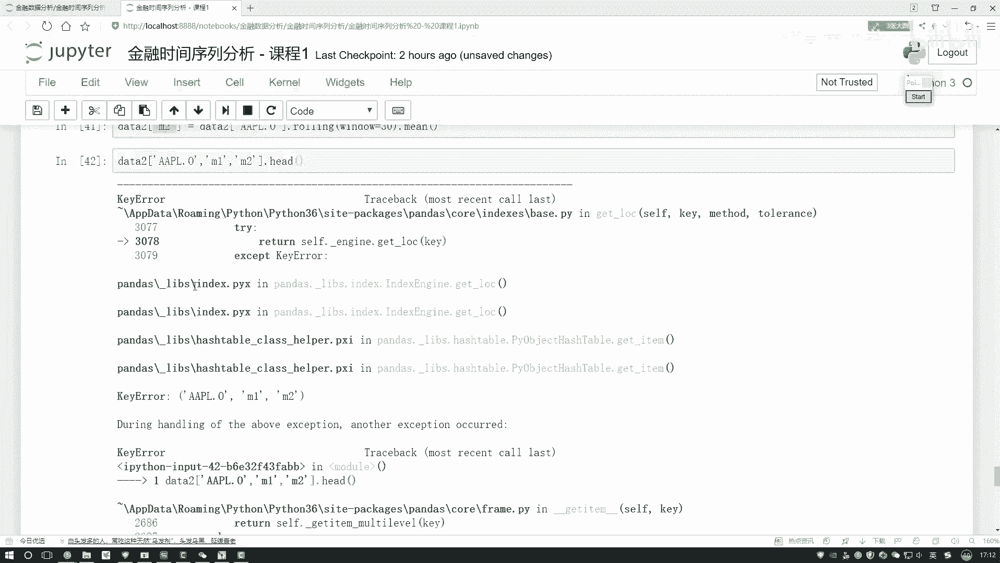

传入的有问题，少了一个中括号给他传进去好。

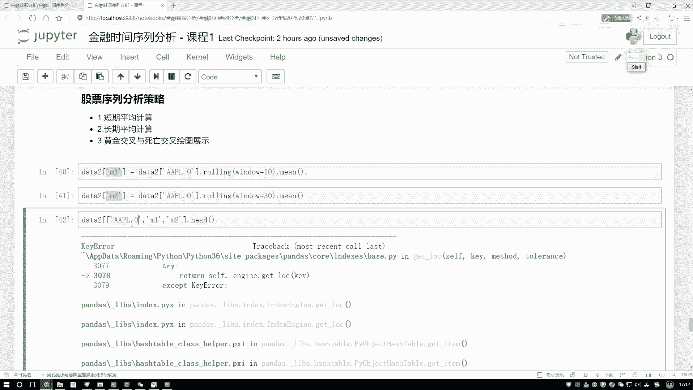

然后点HIIT一下哦，都是这样吧，high一下得了行，这是咱们现在指定的三个指标。

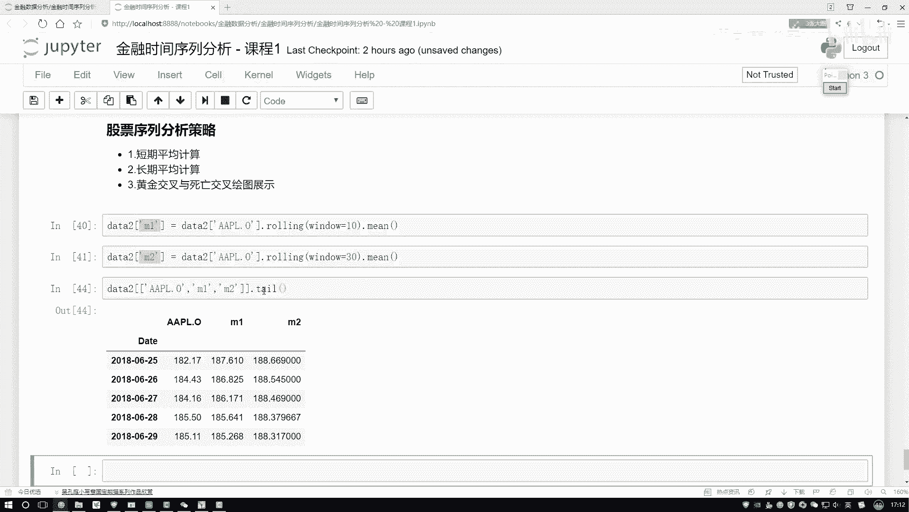

还有我们当前苹果的一个股价，然后呢呃一个M1是一个短期的平均，然后M2它是一个长期的平均，这两个值我是不是算完了，那接下来那你是不是说呃在实际的数据当中，你可以把这个短期的平均和长期的平均，通过一种。

不是通过一种就是在图当中画出来，我们不是要找那什么黄金交叉，还有死亡交叉吗，所以咱画一画是不就行了，在我们的电脑当中，我这直接给复制了，对于它我去画一个那个折线图就行了吧，点float一下。

然后指定我这个图的一个大小，这就完事了。

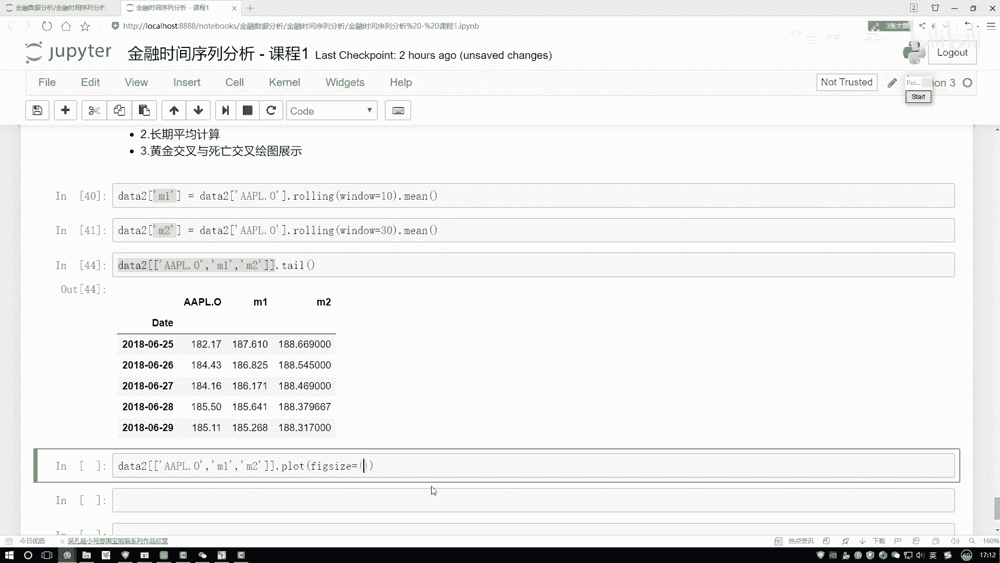

然后是一个六来展示一下行了，哎呦这个图看起来不是特别好看是吧，因为什么，因为咱们当前这个呃时间来说呀。

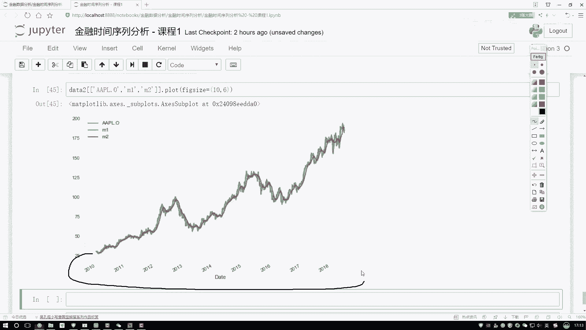

太长了，然后时间要是单独选某一年还行，这样吧，就是我一定程度上把这个稍微的做一些变换吧，我说这就是30，然后得了，这是一年估计250吧，交易日吧，然后咱们这么来画吧，这是一个短期，这是一个长期。

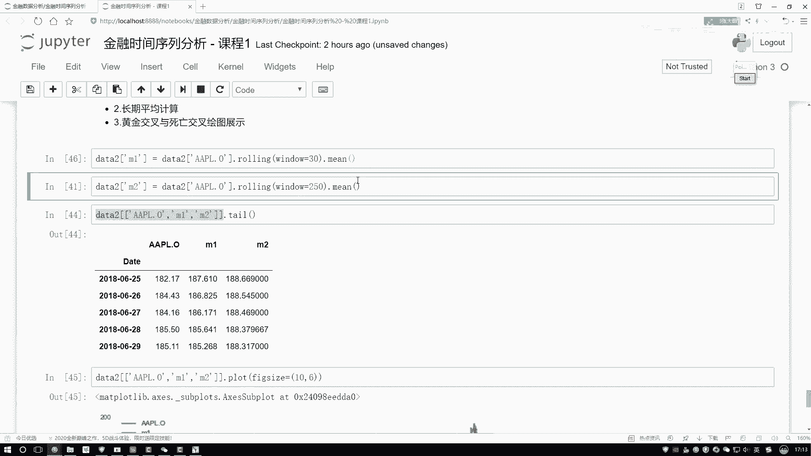

要不然这里交叉太多了，咱看不出来了，我把这个呃让它的幅度稍微大一点。

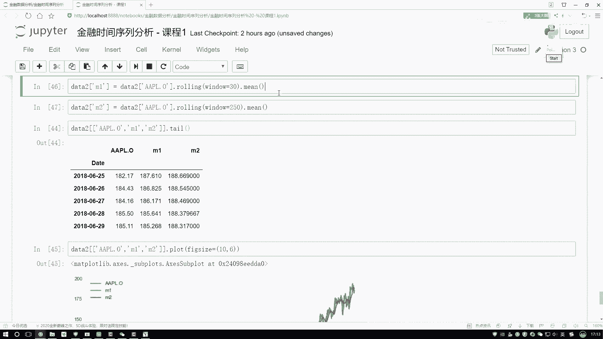

这样式的取的就会比较少，画的可能会层次分明一点，再来执行一下。

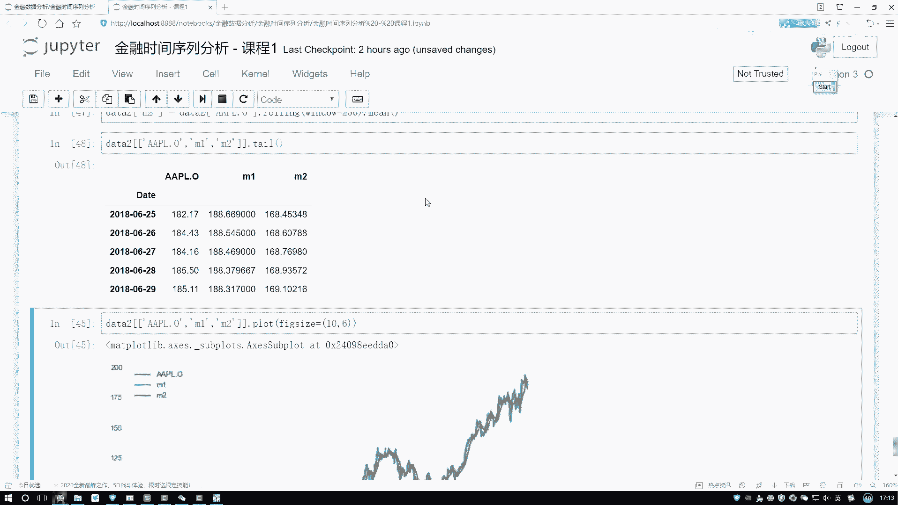

你看这回怎么样，这回更清晰了一点吧，啊咱们来看一下当前我的一个走势，然后这块有几个值啊，就是呃这个蓝色的是他这个拿红色笔，这个蓝色的是它的一个骨架，然后绿色的是我们的一个短期。

然后红色的是我们的一个长期是吧，来观察几个值吧，先来找一找，咱们刚才说了几个点啊，就是一个死亡交叉，还有一个黄金交叉，死亡交叉呢就是说你要赔了黄金交叉，就说你要赚了，咱们先找啊。

就是看第一个点穿交叉完之后，那你看我们这个短期短期是绿色，短期怎么样往下去就走了吧，穿越到哪儿了，穿越到长期的一个下面了，所以说这一块你从这个走势来看，你说要怎么样了，要下跌了吧。

所以说此时怎么样不适合买啊，赶紧把这个东西给他抛出去，别被套里边，然后呢咱们来看第二个，再看第二走势，我看看这里再看这个走势，这个走势怎么样，短期这个绿色超越了我们长期这个红色，并且往上上升的吧。

那此时说明什么，这是一个黄金交叉，在这一块咱们就要赚了，可以去买了吧，啊这一块给大家对比了一下，就是呃在我们的金融数据当中啊，就是股票数据当中有两个常见词啊，一个死亡交叉，还有一个黄金交叉。

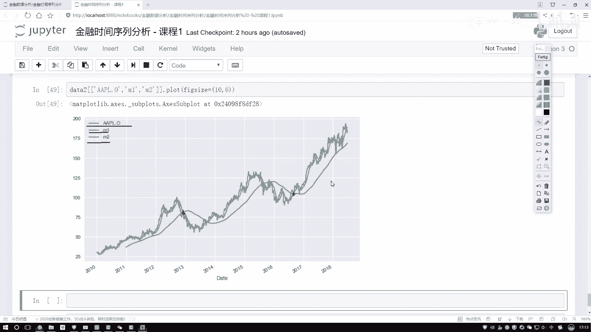

咱们该要怎么样给它画出来，其实说白了就是你自己诶去指定一个窗口。

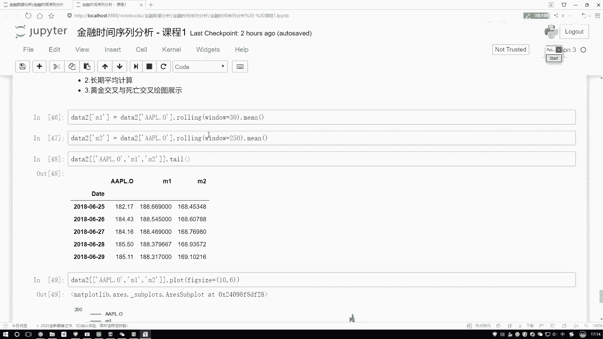

短期的一个窗口，可能咱这个指令太大了，因为这个数据它太太长了。

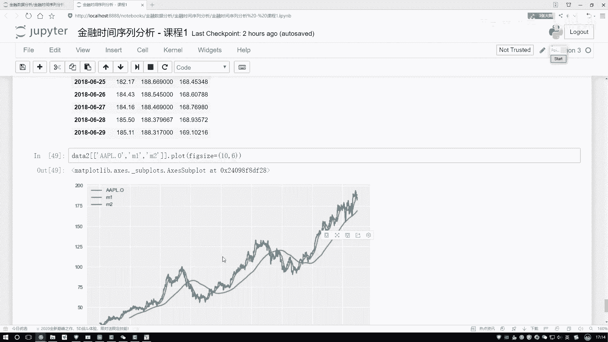

正常你拿到近期的一些数据，你可以指定一个三天五天，那可能上海的是五天五天可能是比较常见的，然后这块呢一个长期的那可能是20天，它是一个月嘛，20天20个20个交易日可能是比较常见的。

这个就是咱们的一个短期，还有一个长七的一个平均计算，注意点啊，这块我们写的什么值，点mean哦，一定是一个平均值。

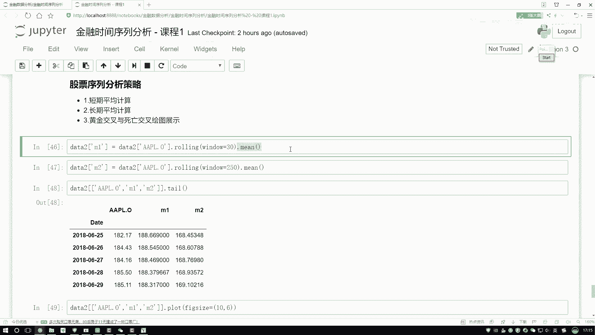

其他值可能含义就不是那么特别明显了，这是一个均值。

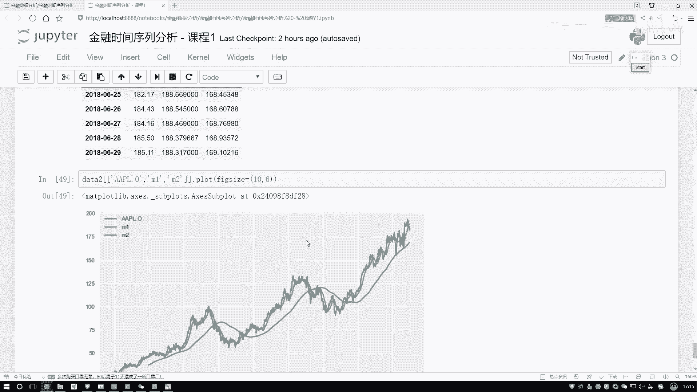

然后呢边看出现这样交叉，刚才给大家说了吗，死亡交叉，还有一个环形交叉是吧。

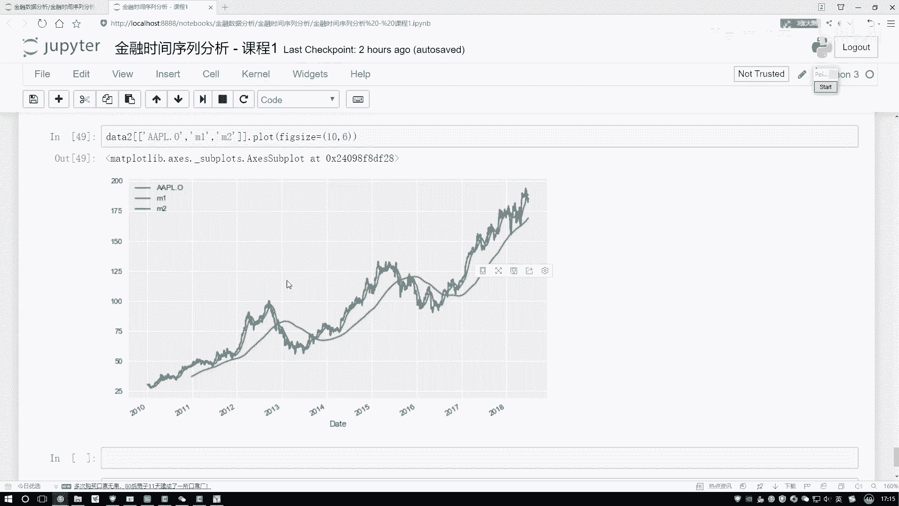

那能不能把这个图啊，你说你给我画的更直接一点啊，直接给我展示出来哪块儿啊，它是一个就是短期的，是一个大于长期的哪块，短期是一个小于长期的，你再把这个交界点给我画出来，能不能把这个分析咱做的更到位一些啊。

也可以咱来指定一下吧，嘶这块我可以指定一个南派函数啊，南派点where一下VR，什么意思呢，刚刚才不是要做判断吗，你这个短期的跟长期的去比，然后他这个数值是大了还是个小了是吧，一个M1。

然后去跟这个M2去比，安排点VR的意思啊，就是说哎你现在首先哎去比，然后呢咱再说比完之后，你对这个结果该怎么操作好了，第一个参数是要比什么东西，第二参数呢就是个条件，如果M1。

我的一个短期平均大于长期平均的时候呃，把值指定成几呢，我看这个任务当中咱就指定一个一负一得了，如果大于指定一个一，如果小于指定是一个一啊。

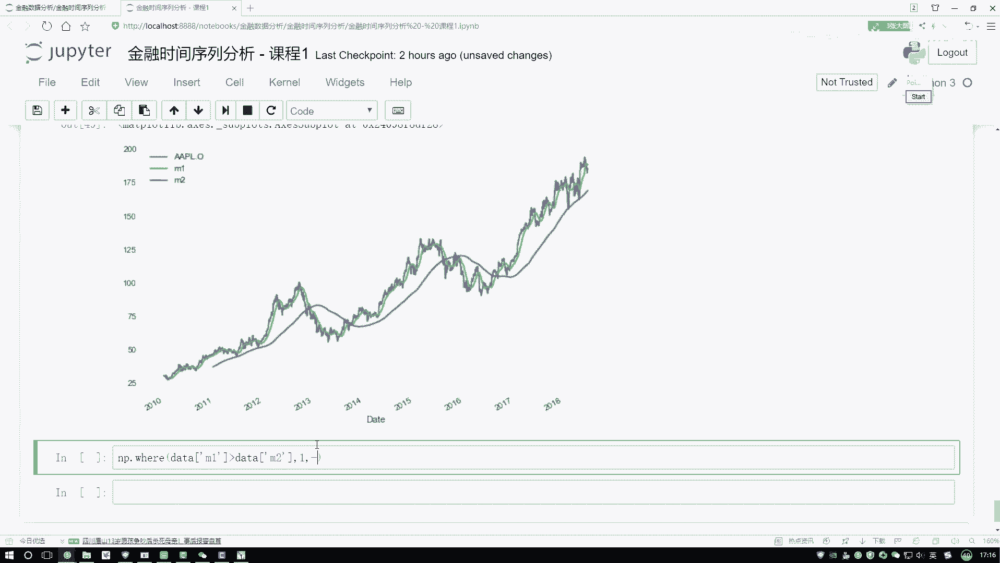

就相当于两个分水岭啊，就两个分界线的意思吧。

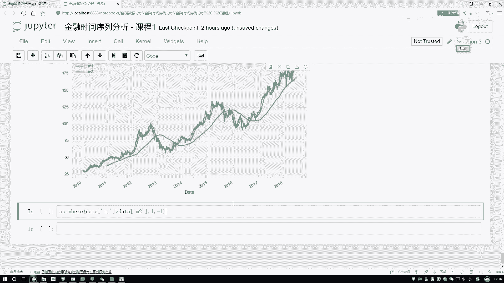

指定一个一一个一，然后现在就是大于的时候，我指定一个一，小于的时候指定个一，那得把这个指标你得告诉我它是什么，咱指定一个指标吧，指标当中你指定一个or position。

然后它的一个位置看是一个一这个标志位，还是一这个标志位，它就描述了当前诶，咱的一个短期和长期平均的一个，就是计算结果吧，啊然后再折线一下哦。

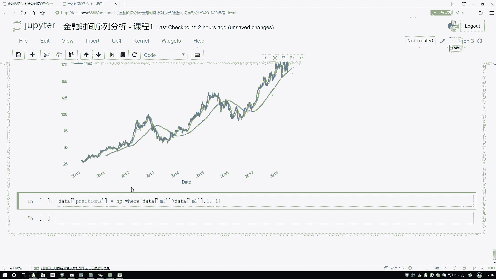

看一看出出现了一点小问题，KERROR没有M1哦。

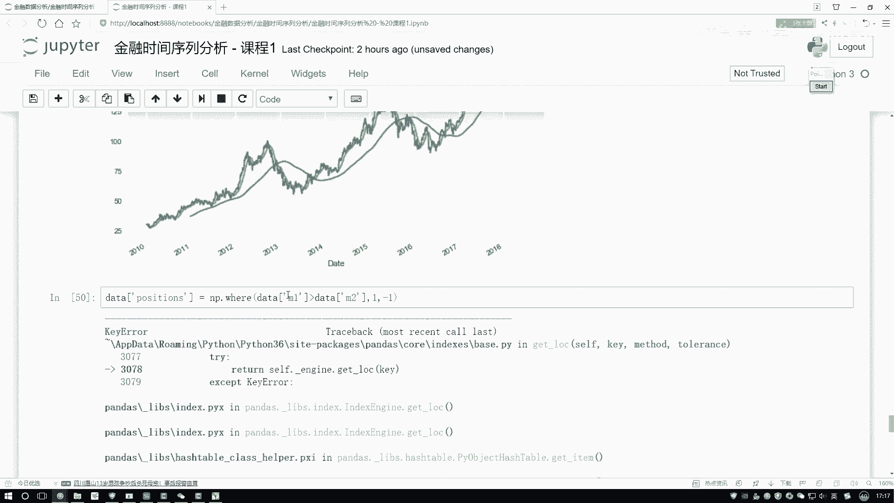

这块咱写的是data2是吧，把这个data2传进去，这也是一个data2，好执行一下，这里咱就有了啊，有了完之后呢，我们要把这个结果给它展示出来吧，呃这个结果展示的过程当中。

我先给大家来展示一下这个这个数值结果吧。

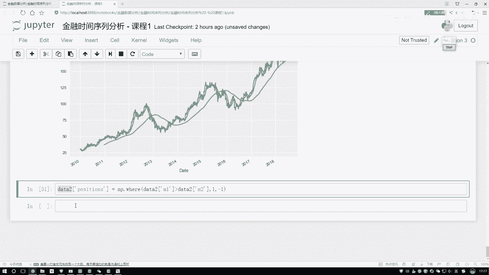

点hit一下嘶，哦从这个数值结果来说，看不出来什么太多东西，这一负一啊，咱不看这个数值结果，直接画图吧，货物当中啊，就是哎我要去对我当前这个data data当中啊，data2当中我要画这几个指标嘛。

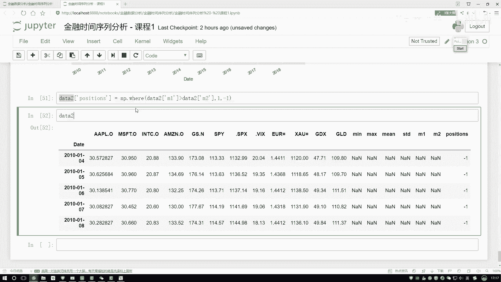

有几个指标刚才我们是画了三个，现在咱又多了一个。

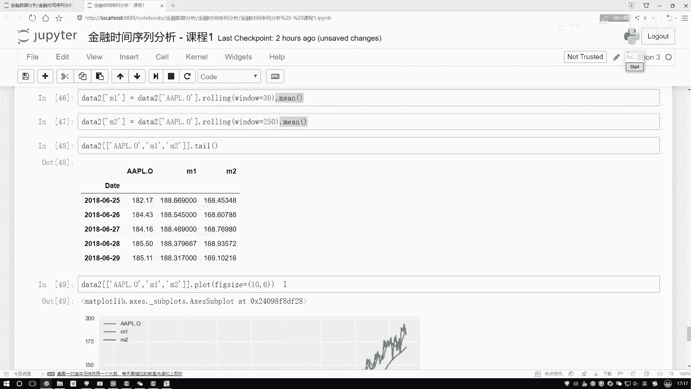

我直接复制过来，直接复制过来，多了什么，多了一个position是吧，把position拿过来，这不就行了吗，把它拿过来，然后我还是直接点PLOIT一下。

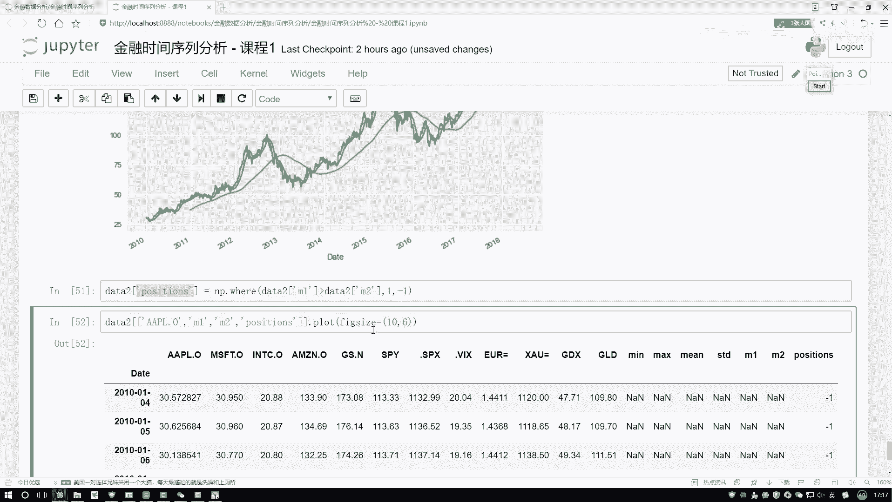

然后这个结果是不是就有了呀，哦这个结果这个结果不行，唉呀这个数值上左边来说呃，左边来说都是它实际的值的一个走势，然后我们这个值指定一个一和一，看着不行，这样吧，咱把这个咱再咱再添个坐标轴吧。

这块brown flow的时候，然后我把这个坐标轴重新再再写一个，右边咱再画个坐标轴，因为左边这个坐标轴取值范围太大了，不适合我这个一和一，这都看不出来了，我在右边画个轴吧，右边我说这是一，然后这是一。

然后在右边这个轴来画，是不是也行啊，咱画一再画一个轴，右边这个轴当中呢就是你点pro的时候，然后第一个参数一个fire size，第二个呢你可以指定就是我们第二个轴，第二个轴，然后它的一个坐标啊。

secretary secretary当中，我指定一个Y把Y传进去，第二个Y轴，第二个Y轴描述谁啊，把咱这个position给传进去，就得了，复制过来，第2Y轴是描述着它的哦。

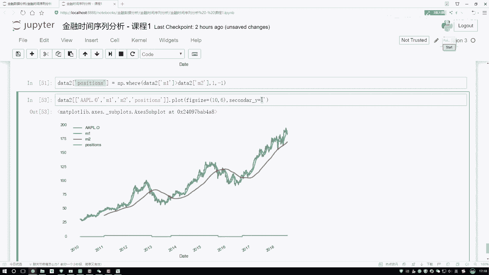

给它去掉，然后咱们再执行一下呃，看一看这块儿出现了什么小问题嘶。

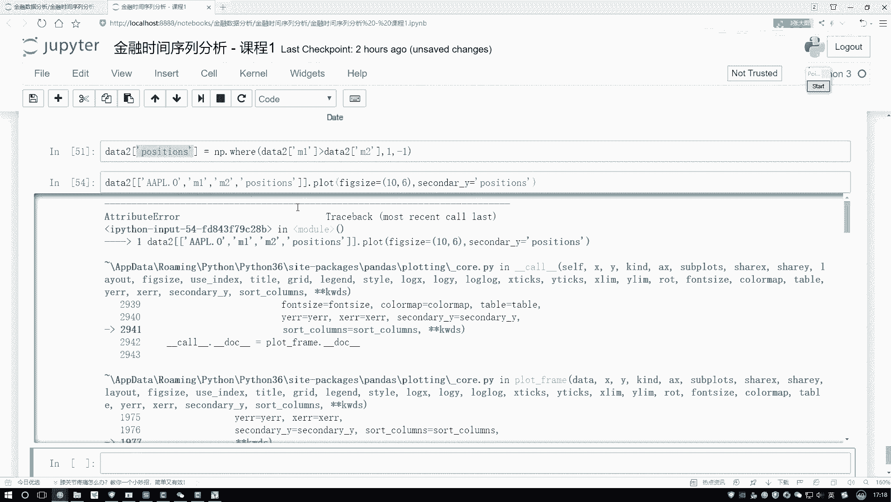

哦这个东西secretary see c哦，少了一个字母是吧，SECONDSECONDAR哦，不是少了一个，少了个Y是吧。

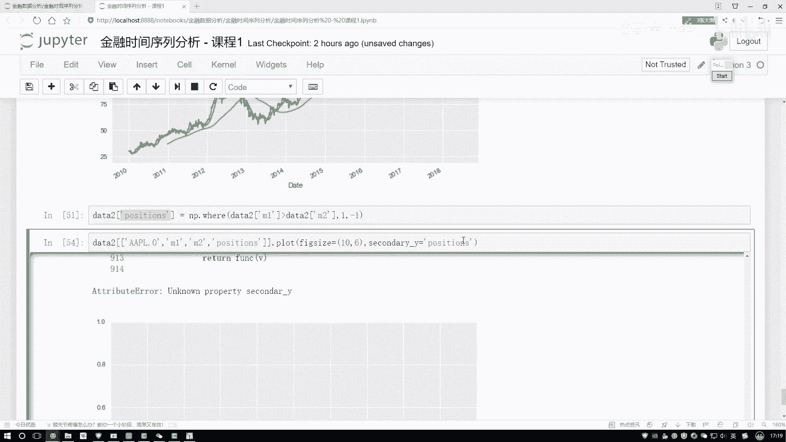

Secretary，然后Y行再画一下这张图就出来了，这张图什么意思啊，像我刚才说的这块是一个一，这块是一个E，那你看这里我们是不是多出一条线啊，多出来一条线什么意思啊，表示咱们这个position吧。

我们的一个位置位置当中等于一的表表示什么，咱们的一个短期平均，你看这个绿色的，它是就是绿色这个东西是大于什么，大于我的一个长期平均吧，所以说此时它在上面的，然后下面呢就是我的一个短期平均啊。

小于一个长期平均，那你看这个趋势由这个E变到一个负E，那说明什么，这是一个死亡交叉吧，这块你就是怎么样，咱又跌了，是不是，那看再看这里在这里啊，是不是一个相反趋势啊，我的一个短短我的一个短期平卷。

然后往上超越了我的一个长期平均水，要涨了吧，如果可以买了吧，所以这是什么黄金交差吧，后面咱是不一样啊，这里啊咱就是啊基于刚才给大家说的，我们的一个死亡交叉，还有一个环形交叉。

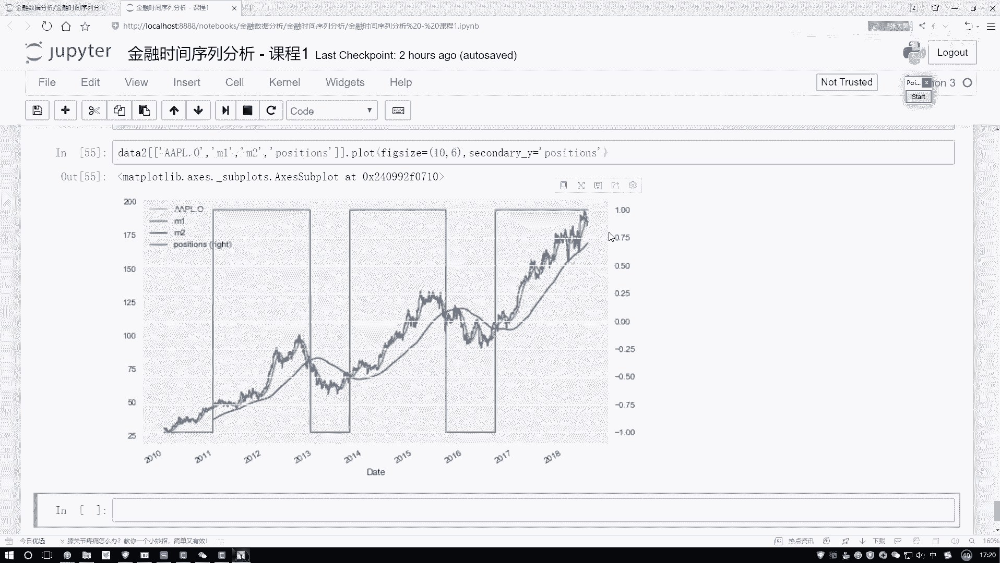

咱在这个图像当中啊，其实就是不是在图像当中啊，在我们的一个实验区域当中。

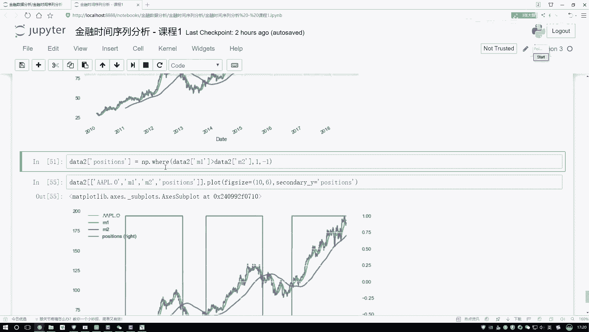

你去指定好窗口，咱可以算什么，算我们的一个短期还有长期平均吧，其实就是在panda pandas当中啊，基本上你能想到的这些这些计算。

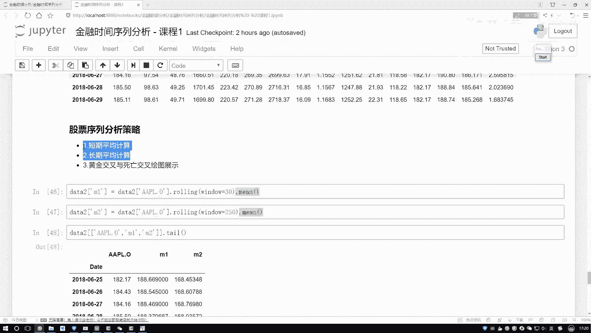

咱是不是都能玩起来画图展示出来啊，这个也是比较明显，咱当前的一个走势情况吧。

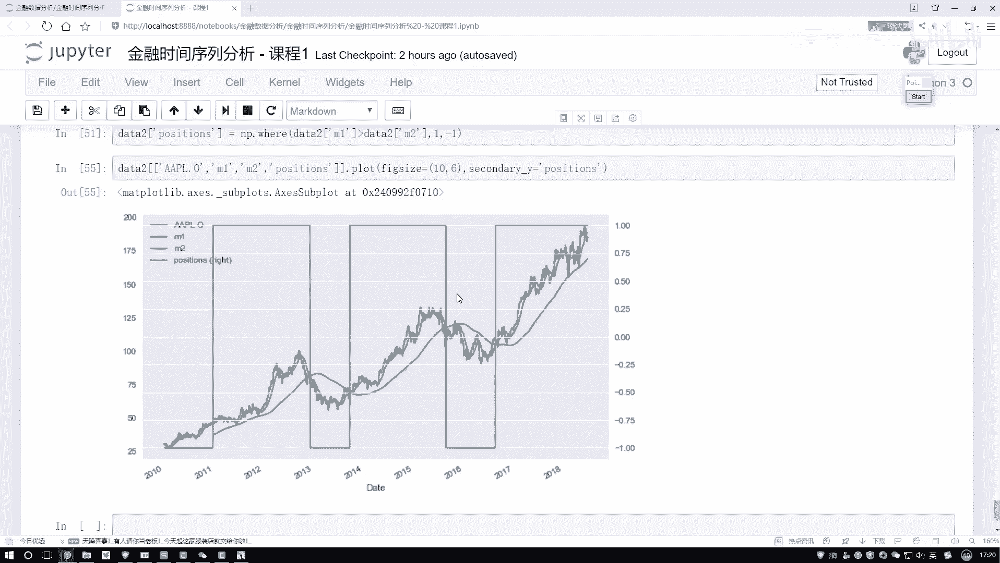

好啦这里给大家说了一下，就是我们的一个分析的啊。

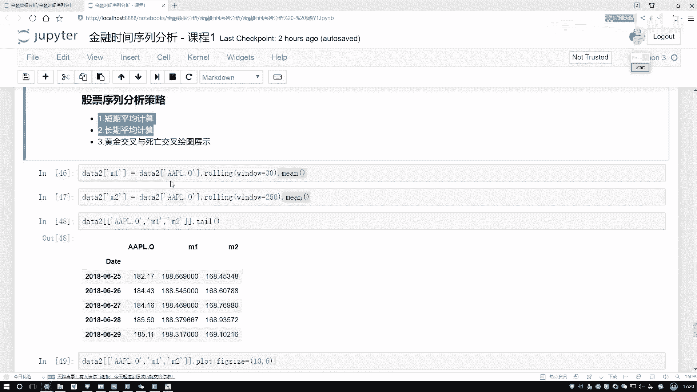