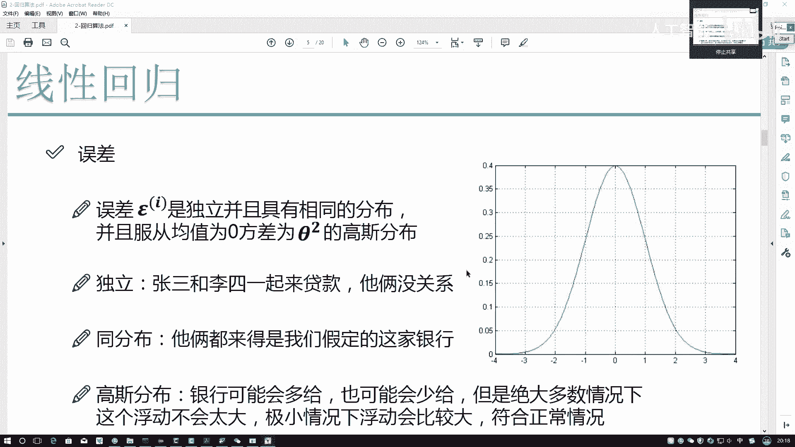
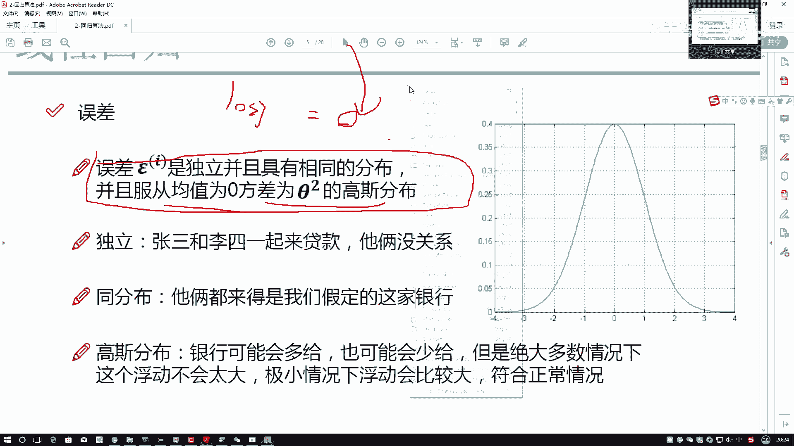

# 比刷剧还爽！2025全网最新Python金融分析与量化交易实战教程，三小时入门到进阶，全程纯干货无废话！---人工智能／深度学习／机器学习 - P52：3-独立同分布的意义 - 人工智能- - BV1pqcteLEoS

那接下来我们该来分析分析这个误差了，这个PPT当中啊，是大家我觉着可能欠缺的一个地方，或者说在数学上以前还没有接触到这个，我希望大家能够注意起来，因为此时这个误差项，我不是单独给大家讲这个误差。

而是讲机器学习当中的呃，就像基基学当中的一个套路吧，这个算法当中我们能借鉴这样的思想，其他算法当中我们都会借鉴起来的，我们先来看一下，我建议大家从整体上解读一下，可能说完这句话之后啊。

大家有点可能就是有点这个意思，但是还不是特别能反应过来，一会儿咱再慢慢其中每一步咱再慢慢解释啊，我现在说第一个事，我说咱这个误差啊，它是一个独立的，并且呢具有相同的分布，还服从于均值为零。

方差为西格玛方的高斯分布，这句话我估计大家可能都似曾相识，但是可能也忘得差不多了是吧，很多的地方都会出现这样一句话，那他是啥意思呢，这句话对咱们接下来机器学习理解，有很大的帮助。

我希望大家一定能够啊注意起来，首先第一点咱分分模块来说，先说一个独立，什么叫做一个独立啊，你说这个误差它是个独立的，谁产生了误差，样本产生了误差吧，每个样本的误差都是不同的，那每个样本是怎么来的。

我说现在有这个张三和李四，他一起去银行贷款了，然后张三呢贷完款，然后跟银行说，跟银行那柜台一说，说后面那个那人是我兄弟，你们给他多借点钱，大家来想，你说银行会听他的吗，银行不会吧，张三填的这个表怎么样。

只决定了张三这个人的贷款，张三填的这个表会对李四产生影响吗，不会吧，李四的结果完全由他自己的数据所决定的，所以说我们数据，样本和样本之间是没有任何影响的，在这里所有的数据拿到手之后，我们的第一个数据。

第二个数据，第三个数据，它们之间怎么样，它们之间是一个独立的，由于一的出现不会影响二的结果，由于二的出现也不影响三的结果，那此时大家可以想一想，这个独立要求我们做一件什么事。

很多时候我们收集到的数据长什么样子，大部分情况下大家收集数据，比如说啊，比如说，咱们现在收集一个学校的一个学生成绩吧，那可能他是按这个排名来的，排名里边第一名，第二名，第三名。

然后地址点点点点到这一第100名吧，让大家来想前，如果说我做一个二分类问题，我说把当前结果分成一个两部分，一个是让模型学一下什么，什么是一个好学生，什么是一个坏学生，此时如果说123都是好学生。

都是排名比较往前的，他会不会对结果产生影响会一些吧，为什么，因为它们之间都是同样，就是按名次来排列出来的吧，但是呢我刚才强调一点，我希望数据是独立的吧，我不希望数据当中你给我按照一个排名的层次。

你有按照什么样的一个顺序，或者有什么样的逻辑，我不希望这样一点，所以说呢当大家拿到一份数据之后，首先我们要干什么，像你打扑克似的，四个王俩二都让你抓走了，那别人还玩吗，是不是就不玩了啊。

所以说啊我们当拿到数据之后，第一件事，咱之前在讲南派的时候也说过了，要干什么，做一个SHUFFER，做一个洗牌吧，这步操作是必须的，因为呢我们在误差项这块数学定义当中，给我们明确提供了独立当中。

样本之间是必须的，这是我的一个前提啊，咱解释完了，然后呢我们再来看下一点同分布，什么叫做一个同分布啊，我说现在啊张三这个人他去了中国建设银行，李四这个人去了中国农业银行，你说他俩去银行都不一样。

咱这个东西还有可比性了吗，你建立的模型到底是为建行服务，还是为那个就是什么农行服务的，这就不好说了吧，因为不同的体系评估的方法可能不同吧，同分布啊，就是做了这样一个假定。

我们的数据尽可能都来自于相同的一个分布，这个点你大家注意点，我该说什么，尽可能虽然说机器学习当中，在数学层面上严格做了这样一个要求，但是呢我们在实际应用当中，如果说就是尽可能也是没有太大问题的。

这里有一个要求，就是我们的一个同分布，就是相当于这样一件事，机器学习他要解决的，比如说是当前啊这家银行哎呀，它的一个参数的一个分布，那如果说数据都不来，不是来自这家银行的一个数据，那你说这件事能做了吗。

就不能做了吧，这个叫做一个同分布，下面再给大家解释高斯分布，高度分布啊，估大家以前都听过，或者叫什么正态分布，正态分布或者叫做一个正常分布都可以吧，为大家来说一件事，右边这个分布我们来观察一下。

首先我说了一点，这个高额这个正高度分布当中啊，有一个前提叫做均值为零，均值为零是什么意思，你说现在去下银行，这家银行在贷款的时候总是给别人多带一些钱，合适吗，不合适吧，总是给别人少带一些钱也不合适吧。

有的带多带了十块，我写了证实，有的少带了十块，有的多带了五块，有的少带了五块，有的多带了100，有的少带了100，都是比较常见的现象吧，所以说我们来看一下，你有的多带，有的少带，有的多，有的少。

那最终的结果应该趋近于一个什么，趋近于一个平均吧，那不可能总多，也不可能总少，所以说平均来看大概是什么，大概就是一个均值为零吧，这点有个前提啊，我们的结果应该是均值为零的，不可能你的模型忽高忽低的。

我们希望它是均值为零的，然后呢下面一点方差为西格玛方的，先不说西格玛方，我们现在说高斯分布，西玛方我们暂时用不上高斯分布，啥意思啊，来看一下吧，这张图当中是我高分布这个结果吧，咱们来看接近于零的。

怎么样，接近于零的占了绝大多数吧，你看这里我就是在零的一个就是附近吧，在零的附近，我这个区间占了多大的一个区域啊，占了大部分吧，那说明件什么事啊，银行多给你个十块八块的，少给你个十块八块的。

是不是比较正常的一件事儿，那什么时候可能不正常了，越往两边走，你看越往两边走，它的可能性怎么样，如果咱说可能性来说是不可能性越低啊，多带给你个30万，少带给你个100万，不太现实吧。

所以啊高斯分布决定了这样一件事，在你均值左右诶前后进行浮动的时候，这是最有可能出现的小范围浮动，最有可能出现浮动越大，它是不是越不可能出现啊，这个是我们误差项的一个解释，关于这样解释啊，它非常重要。

因为这一项奠定了咱的机器学习的很多个基础，很多个前提，但之前我在讲的时候，就之前我给一些高校老师去讲，有些老师知道会有些教授总会强调一点，咱们现在没有数据，能够100%服从于均值为零。

方差为西格玛方的高斯分布，是不是这件事就做不了了，即使是这样，数学原理啊，只是我们去推导理论的一个支撑，实际应用过程当中呢，我们的数据来源于生活，服务于生活就足够了，没有那么多绝对准确的东西。

我们只得到的只是一个近似而已，就像我们做那个loss function，我们做一个目标函数，我希望它等于零，它真能等于零吗，它不能等于零吧，我要求的是一个最优的结果，而不是一个用数学公式。

直接推出来的一个结果啊，大家需要明白这一点。

这个是误差项。