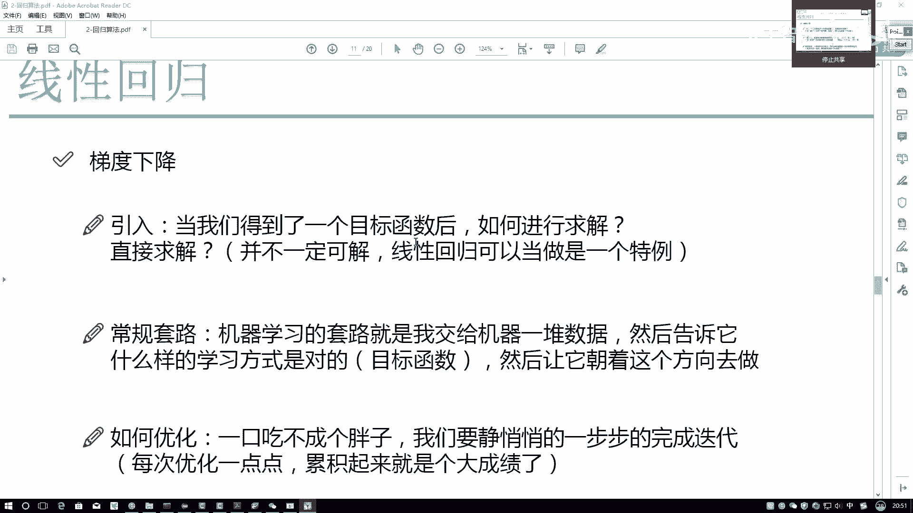
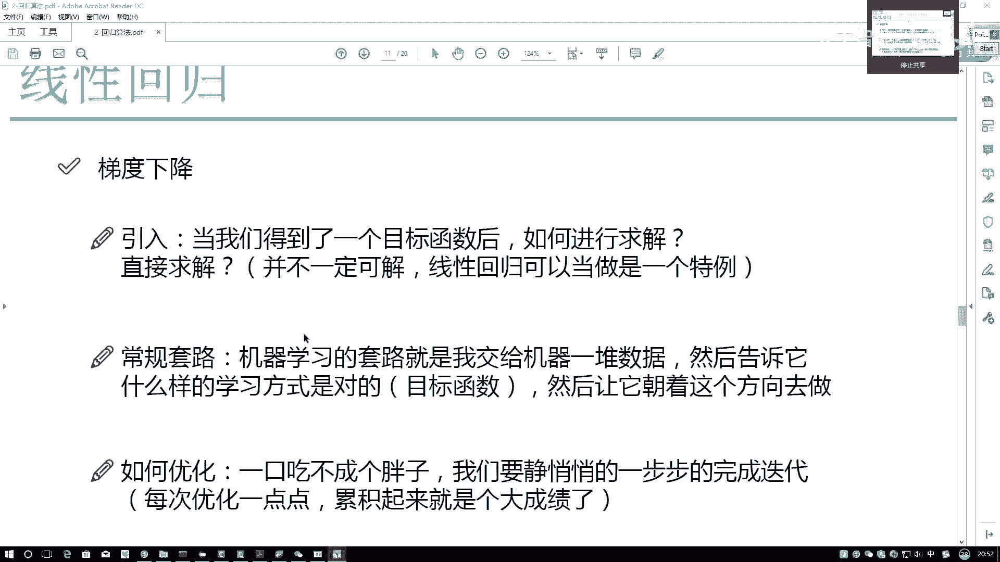
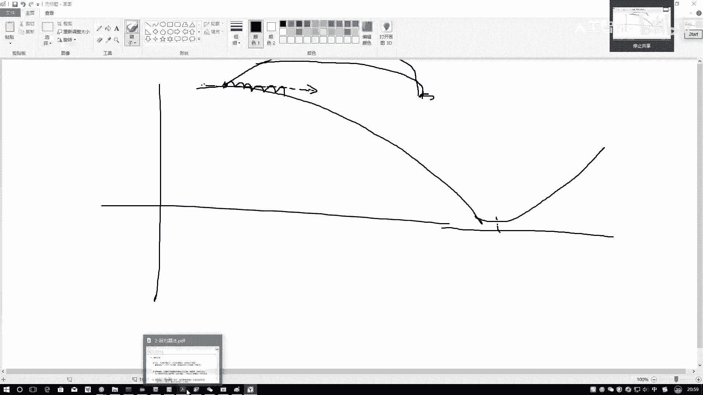
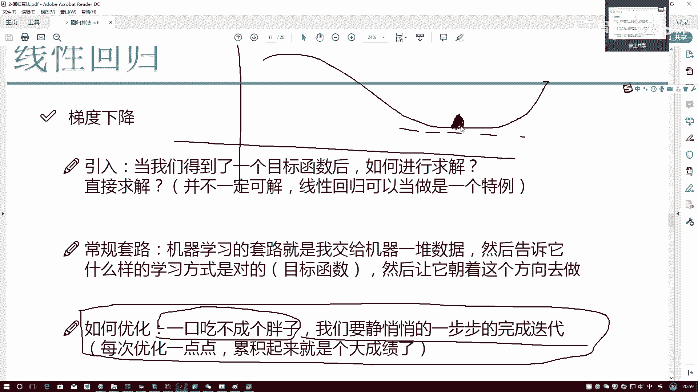

# 比刷剧还爽！2025全网最新Python金融分析与量化交易实战教程，三小时入门到进阶，全程纯干货无废话！---人工智能／深度学习／机器学习 - P55：6-梯度下降通俗解释 - 人工智能- - BV1pqcteLEoS

这点呢你可以管它叫做一个优化算法，或者说呢叫做一个真正机器当中，求解的一种思路，它呢叫做一个梯度下降，我先给大家解释一下，通俗解释一下什么叫做一个梯度下降嘶，当我们得到了一个目标函数之后。

我们是不是要去进行优化进行求解啊，直接求解，大家就这样吧，线性回归当中，虽然我们能直接求出来最终的一个结果，但是呢大家就把这个结果当做一个巧合，就可以了，因为所有机器问题当中，除了渐渐回归问题当中。

其他地方，你是求解不出来最终的一个真实答案的，所以此处大家只当做一个巧合即可啊，那我们来想，既然它是个巧合，我应该是不是得想一些学习的方法，或者优化思路，真正的让我机器学习起来啊，那他应该怎么去做呢。

常规套路啊，刚才其实已经给大家解释过一遍了，再接再说一遍吧，机器学套路就是我先首先给机器这些数据，然后告诉他我的一个lost lofunction，我的目标函数长什么样子，接下来呢。

让它沿着LOFUNCTION能够减少的方向去做吧。

这东西我可以给大家来个画个图来解释解释。

在画图的过程当中啊，他大概是这个样子，一开始呢就是我对这个机器就是咱这样吧，咱别说机器了，呃，我说拿这块画，我说现在啊这块有一个loss，这是我的一个损失函数，可以吧，然后这块是我的一个哦，吉特也行吧。

然后这个损失函数和loss之间，大概呈现出来这样一个关系，哎呦这里我拿橡皮蹭一下，这个山应该是个下山的问题，在这里哎大概是这个样子，那你说对于当前这个问题啊，我们是不是要找到什么，如果说这是一个山吧。

我就假设这是一个山，我的lofloss function，它就是个山，那我们现在是不是找到山的什么点啊，山的一个最低点吧，在这里这最低点才是我想要的，那，一开始，你说咱的一个未初始位置可能是最低点吗。

不一定吧，一开始我会给机器先告诉他，随机的来一组C的参数，比如说现在我有X1，我有个X二两个特征嘛，然后呢我随机的构造一组THEA1和一个THEA2，比如说SA1，它是一个3。6，Thea2。

它是一个一点一，随便一个值随机值来当初始化，那可能这个值咱先就是假设吧，假设咱在这个位置是吧，咱现在这个位置，那我现在有个当前位置了，那你说我接下来要优化我应该往哪儿走啊，我优化过程当中。

优化应该是往上走还是一个往下走啊，对于当当前这个问题来说，那这个问题就要看你的一个优化目标，你是要让你的一个LOFUNCTION是上升呢，或者让你的目标好像上升还是下降啊，咱这个问题他是不是一个下降啊。

所以说我要往山的最低点去走吧，那走的过程当中，我说在咱当前这个点怎么样能够下山下山，那下山的路有很多，我也给大家写一写，在这样这条路我能下山，这条路我也能下山，这条路我是也能也能下山啊。

我写个1233条路都能下山，那你说我选哪条路啊，选哪条路比较合适啊，我们不光希望要下山，还希望怎么样下山应该是越快越好，还是越慢越好啊，肯定是越快越好吧，机学当中啊，如果说你不指定一个合适的方向。

让它慢慢悠悠的去下，你一个模型，在服务器上跑个四五天，你说花时间太长了，一小时能解决的东西，咱用上四五天吗，不用吧，那所以说我应该下山越快越好，那什么样的方向是当前这个位置能够下山，最快的。

什么样的一个方向，是当前这个位置能够下山最快的，对于当前这个点来说，什么样的一个弯方向，我这里可以给大家画一下，这里画出来这个虚线它是一个什么，它是一个切线方向吧，沿着一个切线的方向我去前进。

必然是一个下山最快的，对于当前这个时刻，当前这个点来说，这没毛病吧，那你说现在我要干什么，我是不是要出去下山，那我要求它的一个梯度吧，或者叫做求它的一个切点吧，或者要求它切点的一个方向吧。

我就管它叫做一个梯度了，那既然你要求这个方向，我要沿着这个方向，沿着这个梯度是往上走呢还是往下走呢，正常求出来梯度应该是个上升的方向吧，此时我是个下山问题，我要沿着一个梯度的反方向去走。

所以说呢我们管这个优化算法，叫做一个梯度下降啊，再给大家解释一点，为什么要叫梯度下降，首先下山要越快越好，沿着梯度的反方向才是一个下山的方向，所以我们算好名字叫做梯度下降，在这里呢有了一个T。

有了一个梯度之后，我们来想，首先第一开始这个位置在这，我沿着梯度已经算出来了，那你说我现在有方向了，我是不是要我是不是得走一步才行啊，我不走，就像我天天在这，我躺床上天空谈理想是不是没用啊。

我是要执行这样一步啊，那比如说下一步咱走到了这样一个点，我拿红色来画对当前这个点，哎呀咱走到这点了，此时对于红色这个点来说，我接下来沿着什么方向走比较合适啊，还是原来沿着原来的梯度吗，来看这个黑色的。

这是原来的梯度，我写我就为我这我这边标一个一吧，是原来梯度吧，在红色的位置，我还应该沿着原来的梯度吗，不是吧，山是不是在变啊，你的LOFUNCTION它是一直不变的吗，不是吧。

所以说此时当你到了这个红色点之后，我要干什么，重新的算一下我的一个梯度吧，这是我重新算完梯度的一个结果，可能呢它就是这样的一个方向了，我写一个二，那这一块啊，我们又到了这个位置，那接下来应该再干什么。

是不是沿着当前位置我再走一步啊，再走一步，我拿这个蓝色的画再走一步，可能到这儿了，可能到这之后，当前这个位置，我是不是还要再算一下它的一个梯度啊，所以说啊。

咱现在我可以把咱的一个loss function，优化的一个问题给它解释成一个下山问题吧，在这个下山问题当中，我们提到底点，第一点我要干什么，求当前位置。

对于我LOFUNCTION它的一个梯度的一个方向，首先找到一个方向，第二步沿着当前方向走一步，关于这个走一步，大家来就是有说法了，你可以这个步走大点，你也可以这个步走小点。

那大家来看你说应该走大点好还是走小点好啊，我可以大家重画一下，这个这个这东西当中画的东西太多了，重画一下来看一下，走大还是走小，还用黑色去画吧，在这里我们来看，比如说一开始你在这个位置。

它的一个梯度方向是这样的，你沿着这个位置，你走的特别大，你一下走到这儿了，我这就是越界了一下，走到这了，那你看一下是不是可能跑偏了，都可能跑悬崖里去了吧，因为你当前求助这个梯度方向。

只满足于当前这个点吧，所以说我们应该怎么样，通常情况下应该是小范围慢慢移动吧，因为你移动大了一步，你是只会沿着当前这个梯度移动啊，你移动越大，你跑偏的可能性是不是越大呀。

所以说啊通常情况下我们在做梯度下降的时候，我们都是每次走那么一点点，再求梯度，再走一点，再求梯度，不断的优化下去，最终呢到我的一个什么方向，最优的一个方向吧，这个呀就是我们的一个梯度下降。

大概他做了一件什么事和P当中。

给大家解释一下如何进行优化呢，方法概也给大家给大家描述完了，首先一口吃不成一个胖子，我们需要慢慢的一步一步的进行一个迭代，向大家解释到我们的一个步长一定要小，每走一步求一个梯度。

再走一步再求一个梯度累加在一起，直到什么时候为止啊，它这个LOFUNCTION最终会达到这样一个优化状态，就是比如这是个下山问题，它最后呢比如在这里设最低点，它最后啊就会在这来回进行浮动了。

往这边走一点，就往回走一点，往这边走一点，回一点回一点走一点回一点，这代表什么了，这代表我最终达到了一个饱和的状态，我的损失值不会再进行大幅度的一个下降了，基本上趋于一个稳定的状态。

咱就相当于啊这件事啊，咱们给他做完了这个呀。

