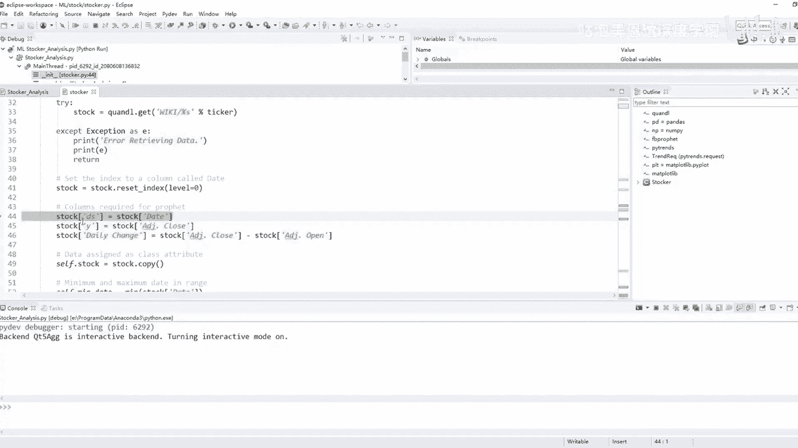
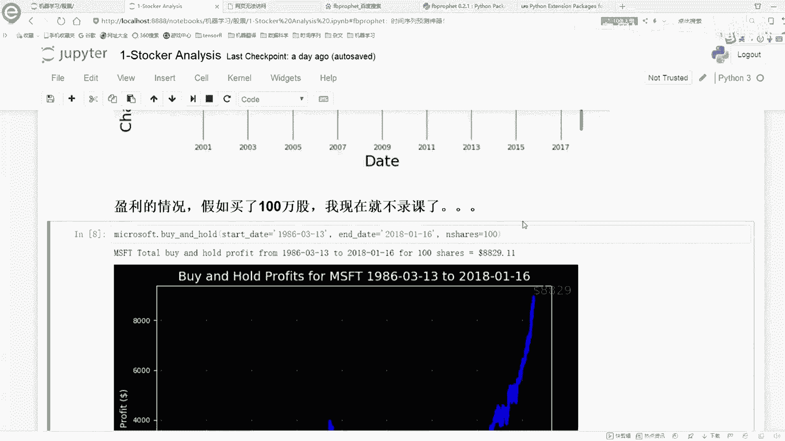
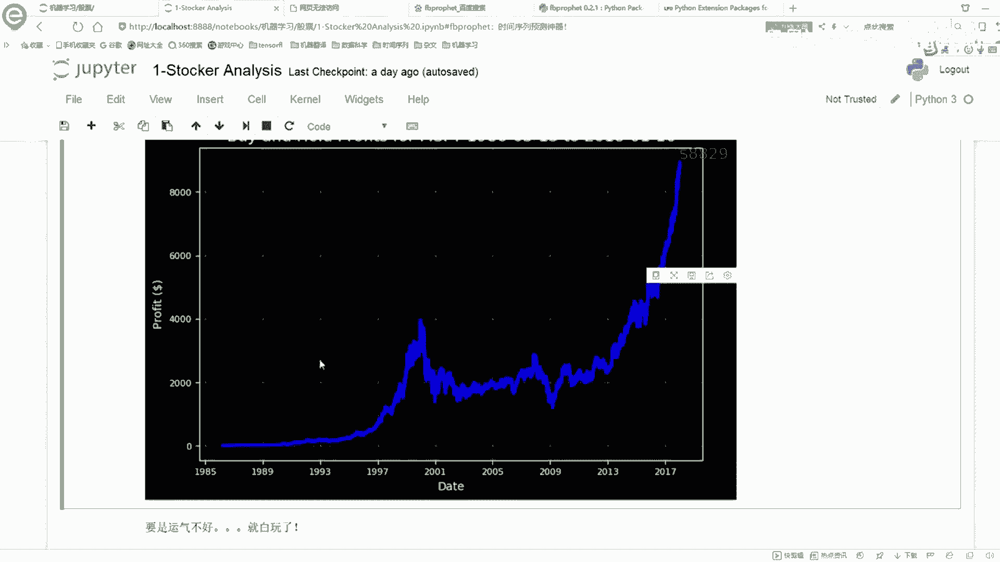
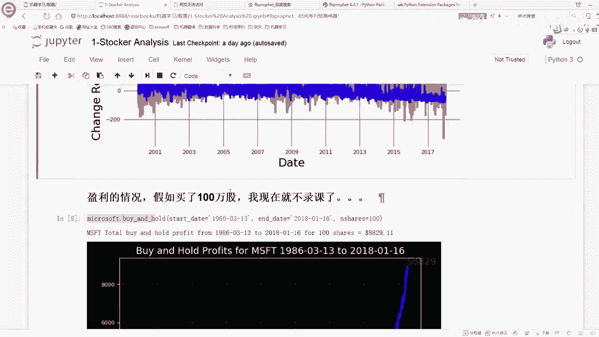
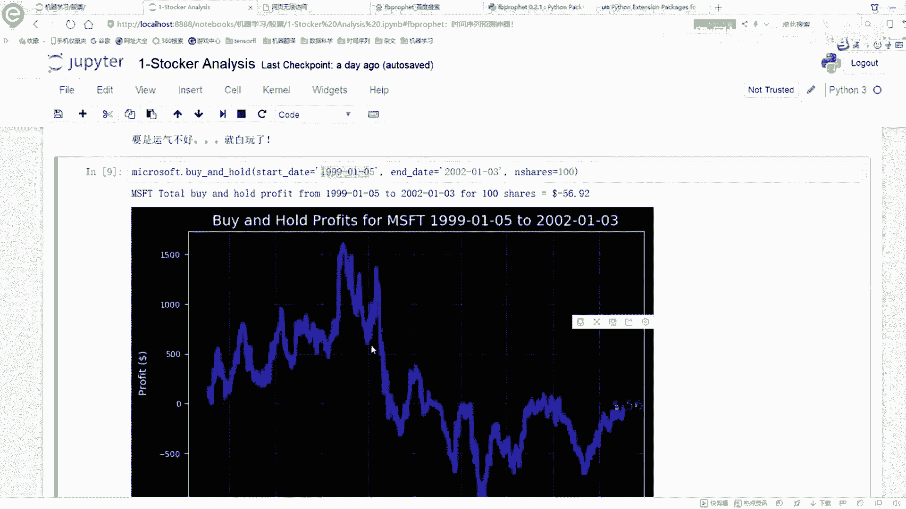
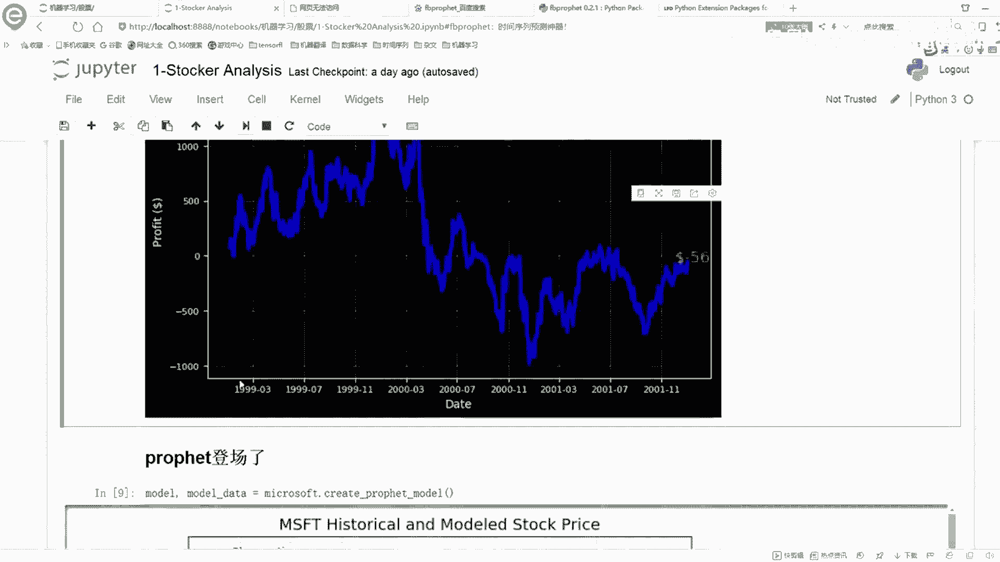
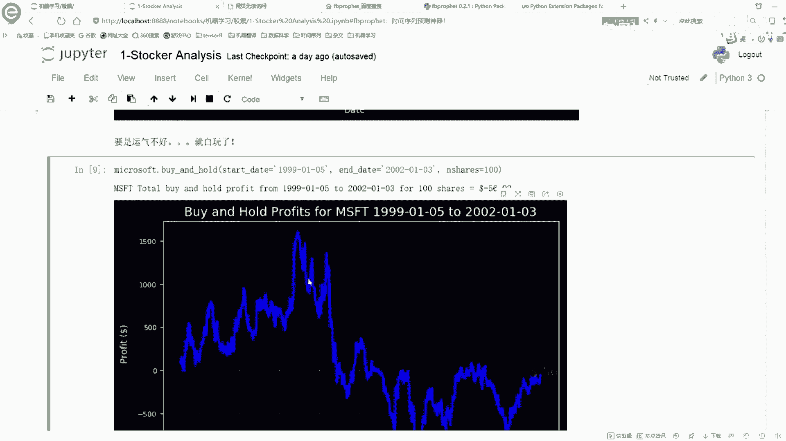
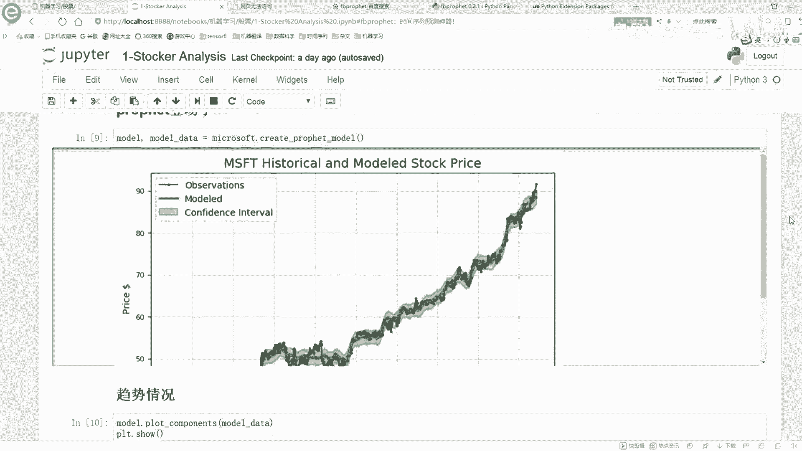
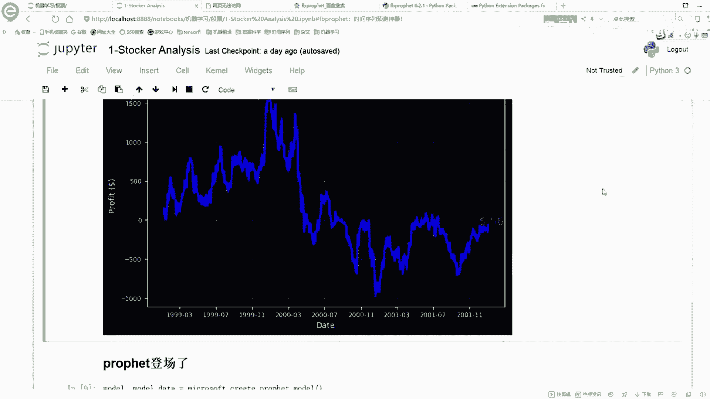

# 比刷剧还爽！公认最全的Python金融分析与量化交易实战教程，从编程基础到金融量化实战，全程干货讲解，学完即可就业！——人工智能／机器学习／数据分析／数据可视化 - P3：【Python金融量化】3、时间序列分析 - 迪哥的CV课堂 - BV1nF4m1T7qA

首先呢咱们先看第一步，第一步干什么，第一步啊去读取我的一个数据，在这里呢就是我们选择一个股票，这里选的股票是一个微软的一个股票，我们可以拿到它，就是它对股票的一个到今天为止。

它的一个历史情况是等于什么的，然后这块呢我们先来看一下，得一下，看一下我当前的数据啊，它是长什么样子，这块呢它有个data就是它的一个时间，然后呢我们一会关心，那我们一会儿要预测的就是这个。

就是它的一个嗯收盘的一个价格，就是我们要关注的是它的一个价格，就是你看这些东西还是很多的，我们观察到最后的就是它的一个价格，然后呢这个D就是我们一会儿要的，这个Y也是我们一会儿要要用的。

这就是我们当前的几个指标，这几个指标啊，诶我们先再来执行一下，我先把这个东西啊重新导入，重新执行一下，来看一下，哦在这里，这块第一次执行的时候可能会稍慢一些，因为在第一次执行的时候，他会先去找这些库。

然后你观察就是这个这行代码它有没有报错啊，这行代码如果报错了，那你就是这三个库，那肯定是估计你是没有装好，你需要把这个三个库装好之后，我们才能去得到下面下面的结果的。

然后这块我们就显示出来当前的结果了吧，那接下来呢咱们来看一下吧，我的一个数据它是怎么读进来的，在这里呢我们还是debug去做诶，在哪去了哦，在这里我就是要把这个notebook当中的代码。

直接给他复制过来了，然后呢在这里咱们就是先debug吧，你看在这打个断点啊，一步一步跟大家说一下，这块呢你打一个MSFT啊，它是一个微软的股票，然后一会呢咱们预测的时候，再看一下亚马逊的股票。

这些股票都是你可以通过自己的名字来进行，一个指定的，你想看什么股票，咱们就看什么股票，这里要推荐大家，就是当我们拿到一份代码啊，你不熟悉的时候怎么办，你不学不熟悉的时候，你去看这样一个类。

比如说F5跳进去，你去看这样一个类啊，你就是瞪着眼睛看这东西啊，看看你就乱了，看看你就混了，这东西看起来太麻烦了，我建议大家怎么办啊，你不如把这个东西跑通了，然后debug1遍。

debug看一遍这东西做一件什么事啊，他就一目了然了，首先呢来看吧，一开始还传什么，传的是咱们这个MFT吧，这是我一个股票的名字，然后呢把它变成一个up变成大写，然后呢这里就是去读这个数据。

这个呢就是咱们刚才的那个叫什么，刚才咱们指定的嗯，安装读数据的那个工具包吧，去get一下咱们的数据，这块呢可能之前说稍微得等那么一小会儿，你看我现在按了个F6，他在读的时候可能得稍微等一会儿，然后呢。

他就会帮我帮我把这个股票数据给他返回来了，你看股票数据，现在我读完了，你看这是我建的数据啊，它是从1986年3月13号开始，然后后面有一系列指标，咱这里就是关于具体的一个股票，咱就不分析了。

咱给大家讲的还是这个时间序列，这个东西该怎么去做，至于这个股票啊，什么涨了跌了，他这个开盘价收盘价是多少，这些啊，我对这些对咱们来说是无所谓的，也不用管，反正一个明显的趋势啊，一会咱会看吧。

一会看整体的趋势，看一下这个股票，然后呢第一步啊，我把这个股票进行reset一下DEX值，这是我当前的一个股票，然后股票当中啊，我把他的一个vs这个vs就是我需要指定。

你看咱之前啊，就是说的这个时候我哪去了，这里呢，他给咱介绍的时候怎么说的，他说你这里哎这个看这个quest start。

你看这个国外网站就这点不好，他这里啊经常会经常会有这样的一个问题，就是他会给你找不到呀，就是有时候刷不出来，咱不看了，刷不出来不看了，我我我懒得翻墙了，然后这里呢就是我们先把一个D做出来。

我们需要指定D啊，就是我的一个时间，我指定一个data data里边呢，本身就是一个转好的时间格式，然后这个Y就是我们要预测的一个指标，这里啊咱们先把这些指标都拿到手。

然后呢还有什么这个daily change，就是我的一个就是呃收盘的价格，和咱们的一个开盘价格它的差异，这就是一个change的一个指标，然后呢，接下来就是我们需要指定。

我们的一个起始时间和一个终止时间，这里呢因为这个data数据啊，你看它本身就是一个时间类型的数据吧，你看它本身就是时间类型数据，所以说对时间类型的数据啊，我们直接用一个命值。

那就能求出来它最小的一个时间，你看最小时间是1986年3月13号，那最大时间呢咱直接用max就能求出来啊，这就是一个标准的时间格式啊，这个比较好的一点是咱们直接用一个me。

一个max就可以把他的指标求出来了，然后最大时间啊，因为就是这个股票啊，是到现在为止，按照咱们今天的时间点，1月24号吧，然后我们当前最新的一个数据，它就是1月24号，反正等大家运行的时候。

不一定你没有哪天了，咱们就是拿你那天数据拿就可以了，可能啊就是你拿到的一个结果，指标跟我肯定是不一样的，因为你肯定之后，你肯定在我之后来看这个课程的，那看这个课程同时啊，你是哪天你就看到这天就可以了。

然后呢在这里啊我们拿这个拿一些价格，max price啊，还有这个啊这些都可以给他拿出来的，然后呢这个最低价格的时间，最低价格时间我可以拿到手吧，最高价格时间也可以拿到手。

你把这个时间啊进去进行一个判断，然后找这个时间就可以了，所以说呢现在就是当我们拿到了股票数据之后，我可以把它所有的一个股票信息啊，都可以拿得出来，然后这是你看起始的一个价格，这块也写了起始的一个价格。

然后呢最近的一个价格，最近价格也不就是今天的一个价格吗，然后这块就是一会呢，一会又要说咱们咱们来说这个东西，这个就是我训练的时候要指定一个年限，这个咱们现在用不到，先不说这个东西。

要下面下面这个东西就是我一会要去看一下，咱当前要不要去统计一下，按按照一个天，按照一个月，按照一个年去看一下他的一个那个什么，他的那个就是随着天的变化，随着年的一个变化。

随着咱们的一个呃就是月份它的一个变化，这下咱们现在没看，等看到时候再说，然后最后呢是一个拆不拆，我说这个说的太多了，这是什么change，就是我们的一个突变点，突变点，等咱们一会飘猜是吧。

咱们再来详细说这个东西，所以说咱现在数据已经有了，数据就给你打印出来了，当前的数据从1986年3月13到这个，2018年1月24，这是我当前的一个指标，然后呢把数据拿到手，这不就是我现在的数据吗。

你看它是一个data frame格式，然后它有这么多个指标，这都是我的一个数据链，然后print一下，主要print一下它的head的值，这个咱们不看了，然后呢接下来咱们在这里接着回去。

这块呢我们就是先把我的数据拿到手了吧，先把数据拿到手之后，接下来就是我们可以，一般情况下拿到一个时间序列之后啊，我先都是画一下这个时间序列，它是长什么样子，下面呢就是这个微软的股票。

微软这个股票从这个86年开始，到这个18年初啊，他这个趋势啊就是哎呀一路标红是吧，然后中间啊就是这块我就是因为我我没超过，但我听说就是当年有一个就是2000年，九几年，99899。

还有2000年的时候有什么股灾，是不是啊，我对这个事情不太清楚啊，因为我自己从来没炒过股啊，我只是把这个东西拿过来当做一个时间序列，估计大家能感兴趣一些，所以说就选了一个股票数据集。

要那你这里就是你看它有些下降趋势，还有一些上升的吧，觉，但但是整体的趋势啊还是都是往上去走的，这样的一个情况，然后呢在这里去plot at一下，他这个stock就是我去画了一下。

但这个图他会帮我打印出来，当前啊就是最高价最低价，然后还有当前当前今天的一个价格，今天的价格应该是历史最高点啊，因为现在它是持续上升的，然后呢再往下走，这块就是去画这个图吗，F5进去看这个图咋画的。

这个图画的很简单啊，就是如果说你没有指定，一个起始日期和一个终止日期，你看我这里参数传能传什么参数啊，可以传进来很多啊，就是你可以告诉我当前那个图你想从哪天画，然后画到哪天，你要想怎么指定。

你就传一个start date，还有这样一个unit，这样的它就会按照你指定的这两个日期啊，把这个区间上的信息画出来，那不在区间上信息啊，他就不会去画的，然后这个呢就是指定的是你想画哪个指标。

如果说你画一个指标，你在这里又写一个，你看我这画了个close，它的价格，如果说你想指定多指标，那你写个逗号，然后指定多指标就可以了，然后这个po type就是咱们先看这个basic。

就是一个基本的一个画图方法，然后呢咱们来看吧，在这里就是指定起始日期，我看一下起始日期啊，它是没有指定，你看这里默认都是乱指，默认断指就是拿我最小的是最小的日期，默认你看ADDATE也是乱指。

那就是默认那它的最大的日期，分别是2018年1月24，和1986年3月13，然后呢，首先就是我去make一下data frame，然后把我的日期传进去，再来看菲利亚，其实上他就做了这样一件事了。

因为我们现在是可以指定日期的，他就要在这个日期当中啊进行一个选择，你看这里他会在我日期当中进行一个选择，小时候还说什么呢，选出来一个star date，这是我的一个起始日期。

把它转换成一个pandas time格式，and it找照样可以也可以拿出来，然后拿出来之后呢，然后我们就在这里进行一个指定，指定完之后，我们就是去取数据，我看到哪去取数据了哦，在这里就是返回一个日期。

我看一下在这里啊，它是返回了一个日期，然后返回日期之后呢，然后我看一下在这里他是在哪儿去取数据的，还得往下跳啊，在这里可以取数据了是吧，在这里你看就是在我data frame当中啊。

我指定的一个date，他要干什么，它要大于等于起始之间，小于等于终止时间，这样就返回去了，这个就是我们怎么样去取数据，根据我的一个起始时间和终止时间，在数据当中进行了一个切分。

只选你就是在这个时间片段之内的数据，指定colors colors，咱先指定多点一会背，不要画很多条线，反正咱们先指定出来，然后呢在这里就是去你看这块写了for循环啊，他这个for循环的意思啊。

就是看你要画几个指标啊，咱这里就是只画了他的一个close指标，所以说这个for循环只会执行一次，但是当你往里传参的时候，这一块呢你想去统计多指标，比如说我想看收盘价位画，然后开盘价我也画。

那你创建两个指标，传见两个指标，它会分别的帮你去画这个事情的，就是for循环当中会画两个图，然后呢把我当前的一个就是最小值啊，这是最小值，这是最大值拿出来，然后呢拿完之后，这里就是我去找最大最小日期。

因为我在这里我先打印了一下最大日期，最小日期，然后分别它的一个指标值在哪天，这些比较好统计吧，很简单啊，就统计出来的最大值最小值以及呢它是在哪天，然后呢他又来画这个图啊，啊跳这里了，画这个图啊。

首先他去呃你自己指定一个style的方式啊，这个我按这种style方式去算啊，然后你愿意用什么style方式，就是my啊，你不可以自己进行设置吗，但是我觉得没必要，咱们就当前这个方式就可以了。

然后呢画图啊，就是你画什么，你把日期也传进去，这是我画的日期吧，横轴Y轴什么Y轴，就是在这里你取某一个指标嘛，当前咱取是close这个指标，然后颜色你选其中的一种颜色，这个是什么颜色，红色吧。

这个颜色红色，所以说话说颜色红色红色，然后呢你的一个线条的一个宽度，你的一个label的一个指定，你的一个透明程度，这些呢都指定好之后，咱们把啊就是X轴叫什么，Y轴叫什么主题叫什么，整完之后这就完事了。

接下来呢咱们再画一个格子，因为它有格子之后是更清晰的，接下来做完这个之后，然后plot for循环完事了，收一下收一下，完之后呢，咱就把这个图给他画完了，你看画完之后就这个图吧。

这个就是咱们现在画出来的，我的一个股票的一个情况，它是长什么样子，这里呢咱们就画完了当前的一个微软股票，从这个86年到这个18年它的一个情况，然后这个不看了，因为这个情况基本上就是一路飙红啊。

这个东西很牛逼啊，现在看到这么高的价格，然后再往下看吧，再往下看，比如说在这里我给大家举个例子，比如说你想看这个01年到18年，你就自己指定一个日期，然后你想看哪个指标，就是看哪个指标，一个指标。

比如说它是一个daily change，一个指标是交易量，然后呢在这里我们就都可以去按照这个指标，然后pro type你可以按照一个百分比的格式，这里它就是一个百分比的格式，然后再执行一下。

看一下它的结果啊，这里呢你看我就把两个，就把这两个都画出来了吧，蓝色代表什么，蓝色代表交易量，这个我看这哪天啊，这是16年，16年大概是个16年的一个嗯，中旬吧，一周年或者上旬。

然后这天不知道发生了什么事儿啊，这几天那个交易量突增啊，我也不知道那天发生了一件什么事儿，然后红色的就是它这个股票，它这个浮动，它就是每天价格的一个浮动，蓝色呢就是它的一个交易量。

这些就是你都可以通过指标画出来，其实啊给大家准备的这个类啊，相当于什么这个类比啊，也给大家封装好了很多个画图的函数，在这里呢，如果说你有一个时间序列任务，跟咱们今天这个任务是差不多的，那你也可以啊。

就是把这个任务把代码改一改，应用到你的时间序列当中也是没问题的，我觉着反正时间序列来说，画图可能来说都是差不多的这个意思，然后呢咱再看这里啊，这里就是我画的当前的这样一个图。

在这里我们可以先玩一个比较好玩的事啊，这里有这样一个函数啊，Band hold，他的意思就是说嗯在这里如果说你去买个股票，你有一个起始日期，你有一个终止日期，然后去买这个股票。

在这里呢你可以填一个你买几百股，然后他就会帮你算一下你会赚多少钱。

这么一个事，这里啊咱们来看吧，它会给你画出来这样一个盈利情况。

就是如果说你是这个86年买的股票，然后呢你现在在这个18年1月16号，他要现在去卖，假设说这样是这样一个情况，你会赚多少钱，这里呢他会算了一下，你会赚大概8000多块钱吧，这个样子。

然后呢这里就是那你想就是这里是买了100股，那假如说你要买了100万股呢，那这个东西啊前面在后面再加上一个万字是吧，那有有这些钱之后，基本上你也啥也不用干了，而且还是什么，还是个dollar吧。

这个就是我们可以有这样一个函数啊，蛮好玩的，给大家往里进去看一下吧，简单说一下吧，这个bin hood，就是去计算一下当前你的一个嗯收益，如果说是股票来说，你就可能买也能卖吗，能买能卖赚个差价这个意思。

那首先它会reset upload，就是把你之前设置的一个画图的方法，都还原到一个默认值，先把我的一个start date和我的一个data给拿到手，Star price。

还有enterprise照样拿到手吧，然后呢咱们去make一下data frame，这就去把这些天的一个数据拿到手，然后呢我第一个获利等于什么，我的获利啊，其实来说就是很简单的。

就是等于我当前的一个我当前的什么，等于我当前的一个就是收盘价，减去我的一个买入的价格，这不就完事了，然后呢有了这样的一个价格之后啊，然后我可以算一下，我所有的一个总的一个收益是等于多少的。

然后呢你有这个收益之后啊，你就把这个图画出来，这就完事了，这个就不给大家一个去演示了，这个比较简单，也是比较好玩的一件事儿，然后我就直接往下跳了，直接跳到后面，然后你看那把这个图关了吧。

这个图跟咱这里是一样的。

这里呢就是呃我们可以指定日期，在指定日期的时候啊，假设说你是86年买的，那你可能赚了，但是呢你看就是在这里我看了一下，如果是你是99年买的。

99年的时候，你看什么样五五下跌是吧，那时候就像99年买的时候，他可能都跌破了一个发行。

就是那个时候就是比你买入的价格还要跌，到一年的时候，如果说你恰好99年买，然后12年啊，002年你就给他卖了，这个时候呢你就得亏了是吧，你就是不像之前还能赚，这时候你就亏了。

比之前那个开盘价格还要低一些。

那你这些钱啊就当相当于白玩了吧，这就是我们可以看一下我们有一个买入价格，还有这样的一个就是就是start date，还有and date，我们可以自己来看一下，当前我们的一个销售的一个情况。

它是长什么样子，那接下来呢我们要来看的就是。

给大家简单看了一下我们的一个数据啊，下面我们就来给大家说一下FACEBOOK它的这个框架。

我该怎么去用了，B友你要点赞。

你要投币好不好，点赞呢。

投币刷下一个视频吧，你的B站以后刷不到我了，没关系，你要给别人投币啊，B友，碧瑶碧瑶，你为什么白嫖我怎么活啊，碧瑶你这个兵真有。

