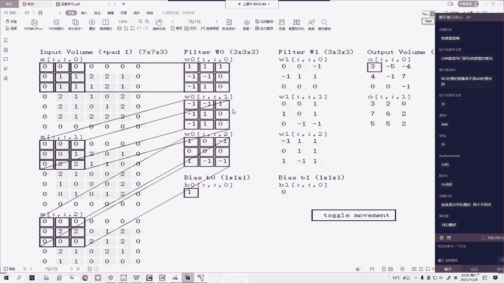
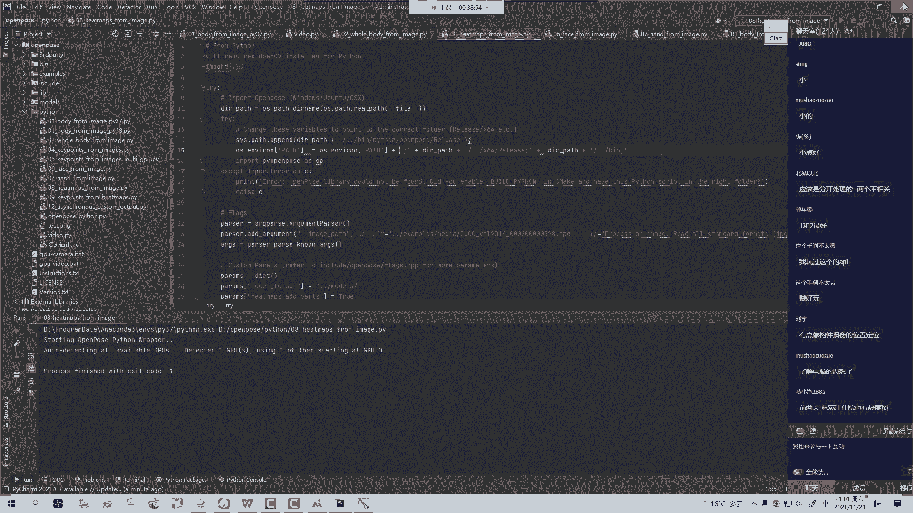
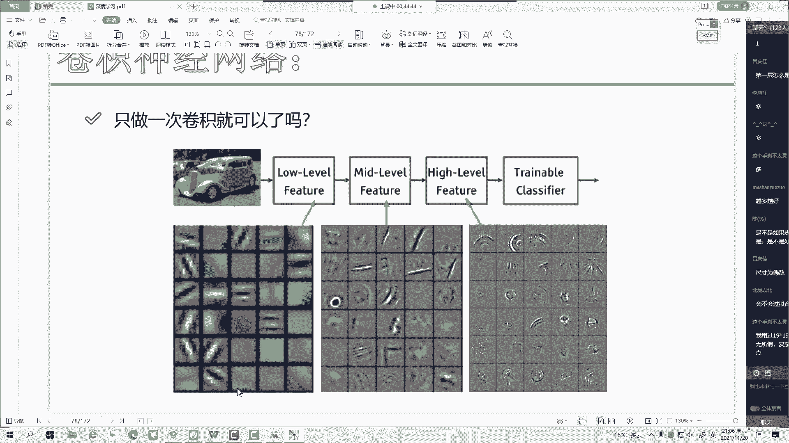
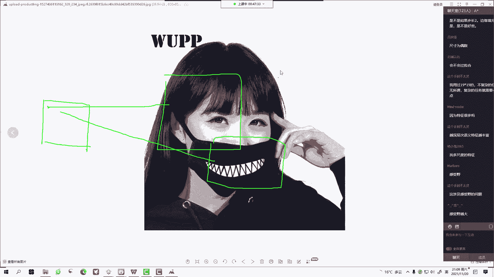
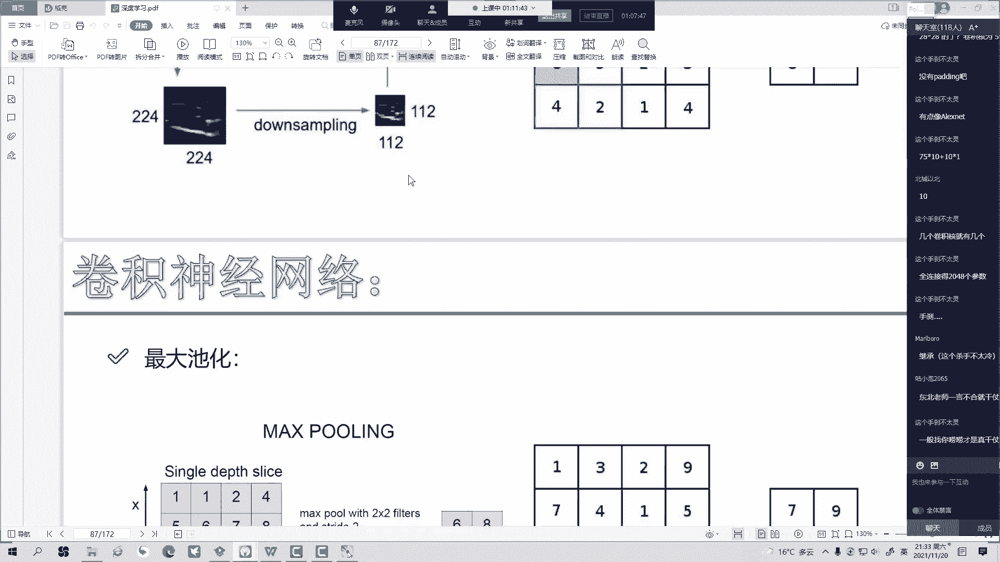
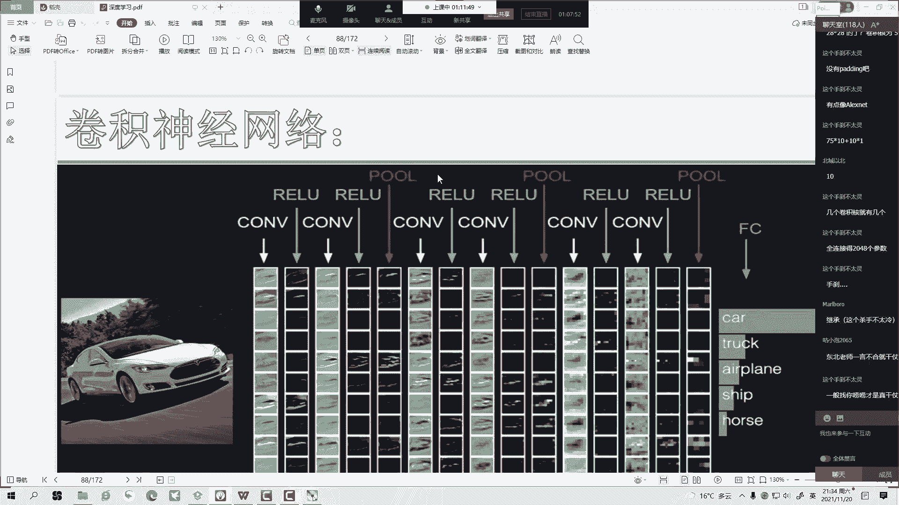
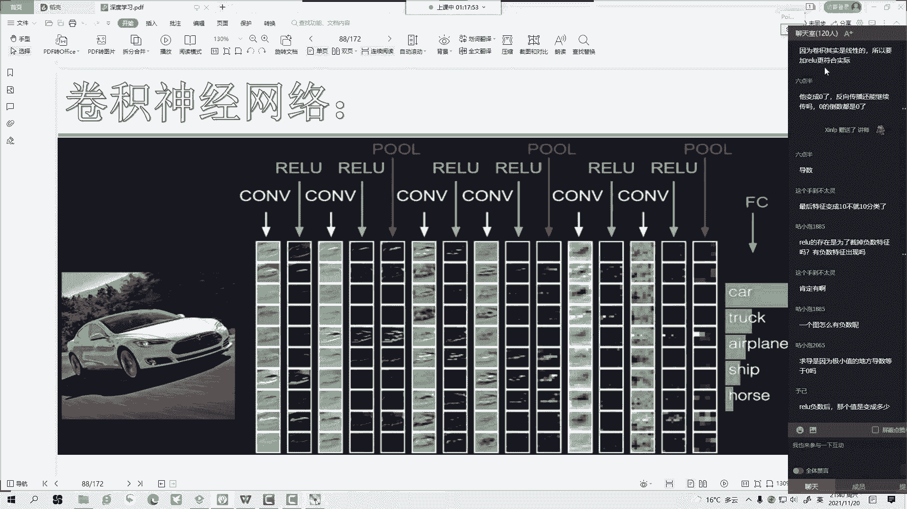
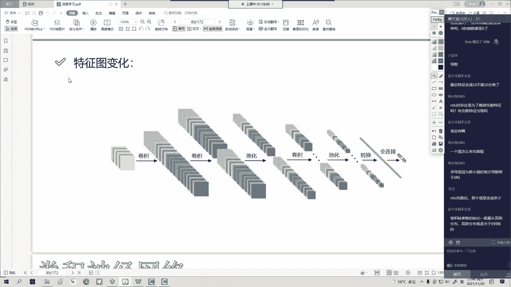
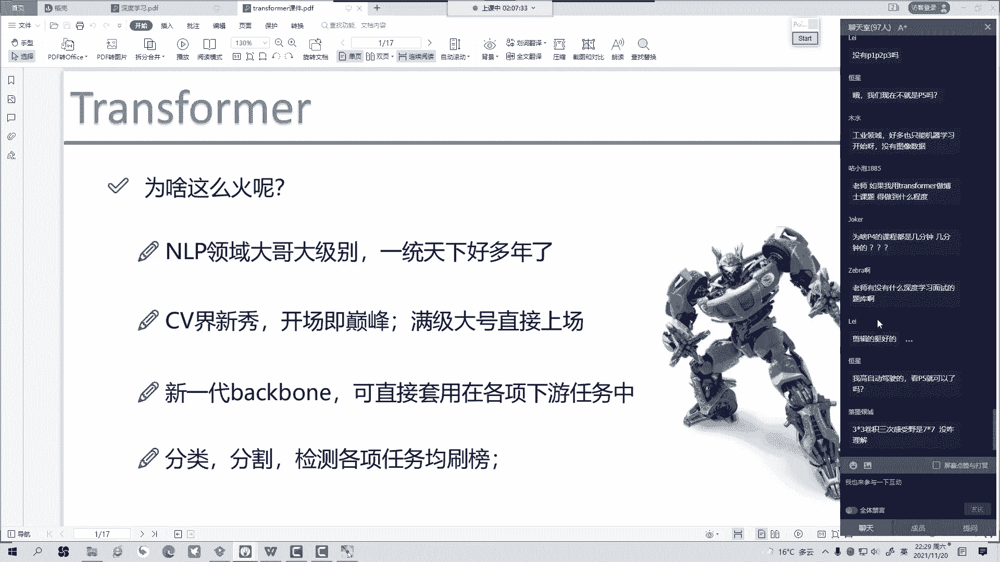

# 一口气带你吃透【Python机器学习与量化交易】保姆级教学，建议收藏！（人工智能、深度学习、神经网络、计算机视觉） - P64：2-卷积神经网络算法解读 - 码农卡卡西 - BV1un4y1R7j1

来我们这个卷积当中啊，我们要去做这样一件事，在咱们这个卷积里边啊，我说这块有一堆点是吧，刚才差点忘了最重要的一件事了，差点忘给大家录了，来来来啊，来我们刚才画的第一个哎，我说这一块啊，咱们画了一个区域。

这么有九个点，是不是这九个点啊，我说咱们要计算出来一个特征值，比如说啊它的特征值哎等于0。61，大家可能说这值怎么算的，怎么算，咱先别管啊，反正一会儿咱说有个招一个区域，算出来一个特征值，这可以的吧。

然后接下来啊，我说哎我再往后移动一个单元格，哎我说接下来再九个，我又算一算它的一个特征值，比如说等于0。61，那你说我同理呢，我再往下算呗，再往下，比如说我拿这个黑色的，哎，我再这么一算这个区域，哎。

我说我也能算出值啊，它是等于都别都0。61了，0。78数值不同的，那接下来啊，大家可以想象一下，我们原始这个输入区域当中啊，是不是有很多个区域，每一个区域我都能怎么样，每个区域我都能算出来一个特征值。

最后呢咱这样是不是组成了一个特征图啊，为什么叫特征图，你看我输入一张图像，接下来呢我做完一个特征提取之后，哎我还会得到一个长长H宽W的一个矩阵，这个矩阵当中的每一个数值，都代表着原始输入图像当中。

一个区域的一个特征，是这么个事儿啊，所以说卷积要干什么，他呀帮我完成这样一件事，把原始的初入图像转换成一个特征的矩阵啊，这个就是我们的一个卷积啊。

要做这样一件事好了，回到我们这个例子当中吧，咱看啊这个任务当中输入呢一张图像，然后呢我就想哎呀，我说我在这个输入图像当中啊，该怎么卷呢，首先我要指定一个区域，在我指定的一个区域当中哎。

去提取出来一个特征值，一会我会给大家看具体的啊，咱们看具体的例子好，来举个例子吧，比如现在现在呢左边这个图啊，是我输入一张图像，好左边这个图它是我输入一张图像，接下来呢你看这边画了一个3×3的一个区域。

就是说啊这3×3哎我要对应一个特征值啊，这是第一个区域对应一个特征值，接下来呢，你看我第二个区域是对应第二个特征值，然后呢，我第三个区域是不是对应第三个特征值啊，接下来以此类推。

把我每一个区域哎映射成一个特征值，这就可以了啊，好然后呢哎这个咱先不说啊，这个咱一会总结一给大家总结，然后呢我问大家一件事，你说一个区域啊，咱就选这么一个特征，是不是有点亏啊，说点少啊。

诶你说有没有什么招儿，让我一个区域我能选择出来多个特征呢，大家看这一块就同样，比如说是这样一个5×5的一个区域，哎我说我在这个5×5的区域当中啊，能不能选出来N多个特征呢。

比如说5×5的需求选择两个特征行不行啊，可以啊，比如这个区域当中，我既想去提一下它的一个纹理的特征，又想提提一下它的一个亮度为特征，再提它饱和度的一个特征，行不行，都可以啊。

一个区域当中我能无限的去提特征，所以说现在啊大家注意点，我刚才说一个区域选一个特征，那只是举例子，实际当中呢我一个区提多少特征，这件事谁定的，我们可以自己调，咱可以怎么样，尽量往多了来呗。

就往多了整特征，我希望越多越好，是不是好了，接下来来我们看这个图啊，这个图很重要，只要大家可以这么说啊，把这个图咱能搞明白，卷积啊，我们就搞定了卷积这个词，这个词啊没有那么难。

但是一定注意把这个图我们要先搞定，来，我们看输入，输入呢它是7×7乘三的一个矩阵，好7×7，然后我们的RGB3个颜色通道，接下来我要提特征，我问问大家怎么提特征啊，咱们在讲神经网络的时候，我们是不是说。

首先啊我们得有一个权重参数矩阵，然后用我们这个全数参数矩阵，跟我们数据做一个乘法操作，做矩阵乘法，然后得到一些变换后的特征啊，这里也是如此的，再来看右边，右边呢我写了一个filter。

咱们先看第一个filter，你看它有个特点，我这边写的什么3×3乘三，唉，问大家一件事儿，这个3×3乘三是啥意思呢，这几个数值啊它是干什么的呀，来问问大家好，首先啊咱们来看前两个3×3啊。

咱们这前两个3×3是来干什么的，它表示的是我啊，我这个不是全职，不是V3，前两个3×3表示的是我希望啊，在原始输入图像当中，每3×3的一个小窗口当中选出来一个特征啊，第一个3×3表示的是哎。

我希望在原始输入数据当中啊，多大的一个区域选出来一个特征值啊，然后大家可能问这个数能不能改呢，能不能5×5呢，可以啊，你自己定啊，你觉得多少合适，咱可以自己改前两个数啊，你可以自己去改的，然后问问大家。

最后这个数能改吗，这个数能改吗，这个数啊它是不能改的，为什么你看这样对应我输入什么，我输入有三个通道啊，输入有三个RGB是不是，然后呢，你看接下来我们在这个fever当中。

哎你说我要分别考虑RGB3个检测通道，分别要给我们做计算，那你看就是对对方什么阵型，对方来了三个人出来跟我们单挑，那咱咋办，咱上多了，咱不能欺负人，上少了，我们打不过一样，是不是我方也出三个人。

所以说咱们这一块这个三啊，大家注意第三个维度啊，一定跟输入的第三个维度永远是一样的，不一样行吗，呃在卷积当中这个不一样还真不行，大家一定得记住啊，我们filter第三个维度，跟它当前输入的第三个维度。

一定要是完全相同的，这是八，你就八，这100你就100啊，这个数是不能变的好，这是我们说的第三个维度必须必须要相同，然后呢我们来看一看啊，哎你说filter这些值哪来的啊，1v1。

你说我们这个filter当中这些值哪来的，哎大家记不记得之前啊，我们说呃咱们之前说那个全额神经网络当中啊，我们这个权重参数是做随机初始化，是不是，所以输入完之后啊，然后我们后续要做更新。

现在呢我们也这么当做，哎就是说我们的任务当中哎我们这些卷积核啊，这叫卷积核啊，卷积核这个东西我说他呀一开始也是随机的啊，就我也不会，我猜呗，一开始随机初始化的随机输入完之后呢，后续我们会更新的啊。

后续我会给大家做更新的，现在啊大给到了随机值，那他是怎么跟我们这个输入做计算的呢，这里啊大家注意我们的一个算法当中啊，提到一个东西叫做内积啊，这个不是矩阵乘法了，是内积，大家可能会问什么叫内积。

我给大家举个例子，比如说两个向量哎，你说两个向量，比如说这样啊，两个向量是独立的无关的，比如说X1向量和X2向量，如果它俩独立无关，他俩内积一定等于多少呢，如果两个向量垂直起来了，他俩独立无关的情况下。

我问问大家，内积等于多少，就是两个向量如果垂直了，内积是一定等于零的，内积等于零，相当于什么，相当于这俩人谁也不认识谁，就这一辈子就没什么交集了，永远是垂直的，垂直就是说一一分钱关系都没有。

这俩人他也不是有仇，他俩他俩也啥关系没有，就这一辈子都遇不到一个人，比如说我跟北极熊，这辈子我俩可能遇不着我俩这向量一乘，那那就得零了，这辈子见不着事，然后呢，那再换再换一个，那比如说咱们是小龙和百惠。

小龙和百惠，我说他俩关系好，一会大家说啥内接，我说小龙跟百惠他俩关系好，他俩好的跟一个人似的，好的跟一个人啥样啊，你这是小龙，然后比如说这是百惠，他俩都快贴上了，好的跟一个人似的，你看他俩夹角非常近。

此时我说内积怎么样，内积就非常大啊，所以说这块啊跟大家去理解了一下，就是内积什么时候大呢，哎我说它的内积会越大，关系越没啥关系的时候啊，就是我跟北极熊这辈子见不着面，内积就等于零好，这是说啊。

为什么咱们要内积，因为内积呢表示啊我们的一个相关程度啊，相当于我这个输入跟我这个卷积核，就比如说卷积核是我买个鞋，输入就是我的脚，我这个脚配不配，我这个鞋配的情况下，我得到特征就好。

不配的情况下得到特征，就配的时候得到特征大，不配的时候得到特征小啊，就这种感觉好了，然后咱们看一看啊，这内积怎么算，内积算很简单啊，就是对应位置相乘，再求和再算一个吧，可能有很多新来的同学啊。

咱之前没算过来算一算，你看第一个位置零咋算，我咱捋啊，来0×1加0×1加，0×1加，0×-1加1×-1加1×0啊，后面仨数也一样，对应位置相乘，最后再干什么，再求和，来我们算一算，来把这都清掉啊。

再算一算，第一个位置算内积等于多少，第一个位置啊，咱们算内积它是等于零的啊，第一个位置咱们算内积它是等于零的啊，这样一件事数不等于零啊，来算第一等于零吧，没算错吧，好我们第二位置，第二位等于多少。

122啊，R21100等于二，是不是零零乘上数都得零吗，第三个位置2200等于零，好了，接下来怎么办，我三个位置啊，都算完之后，我会把它们做一个加法加到一起，而这一块我们做了一个加法啊。

做一个加法加等于多少呢，等于二，做完加法完之后啊，等于什么，做完加法完之后，我们不要忘记这块有偏执，所以说前面就W点X，我算这个内积，算完内积之后呢，再加上一个偏执，你看这块22+1等于几等于三。

第一个位置特征值我是不是算出来了，很轻松啊，咱们就把我们第一个位置的特征值，给他算出来了啊，这是第一位置特征值，对内机啊，就是就跟这个投影是类似的啊，就跟投影是类似的，然后第一个位置算完之后咋办。

我们算第二位置呗，第二位置咋算，随机找位置吗，不是啊，像一个滑动窗口似的，来我们看第二窗口，第二窗口问问大家，往后移动几个单元格啊，是不是移动两个单元格，我估计大家就马上就问了，老师一定是俩吗。

我移动仨行不行，一个行不行，五个行不行都行，移动几个单元格这件事啊，没有什么，就是有有限制啊，但是我们说在这个理论上来说，几个都行，一会我给大家说最好是为几来，你看比如说移动两个单元格咋办。

移动完两个单元格之后啊，竟然还算内积啊，是不是还算这个内积啊，这咋算，这不用我再给大家捋一遍了吧，这十以内加减法大家自己捋一遍，比如算完哎等于五好，这个算完之后呢，再看下一个下等于多少，等于四。

那接下咋办，大家说这是不是走到头了，没完啊，你走完第一行了，这这这是不是继续去走啊，继续画这个圈，把所有区域都捋一遍，最终呢你看我得到什么了，得到一堆数，大家能说这些数是什么东西啊。

这个数啊就相当于我们是一个特征的矩阵，这个最终啊我们管它叫做一个特征图啊，得到特征图嘶哎呦，那你说这个特征图它有什么特点吗，其实没啥太大特点，就是一个矩阵跟输入的格式挺像，只不过它变成特征了好。

那这里边会涉及到一些参数，我给大家捋一捋啊，都有哪些个参数，第一点我问问大家，第一个参数啊，我给大家先写参数，参数很重要，这个大家得去熟悉啊，为什么要加起来，科学家这么定的，科学家就这么定的。

你输入的所有特征图，输入所有特征图，最终合成这样一个特征，比如说这一块同样是第一个区域，因为第一个区域我只要选出来一个特征，但是第一个区域咱们是有这一块，有三个通道，这三个通道决定一个特征。

所以这一块我们做一个加法，然后呢接下来接下来呢我们在这个任务当中啊，来我们说做这样一件事，咱们来看啊，第一个参数叫卷积核的大小叫filter size啊，卷积核大小，你看我们能3×3的，也能5×5的。

也能7×7的，问问大家哪个好啊，卷积核这个东西大了好还是小了好啊，一般情况下就是咱都21年了，以21年这个角度来说，也没看着啥卷积核，大的卷积核来说啊，都是比较小的，越小的卷积核越小。

为什么说这个越小的卷积核它是越小的呀，因为特征越多，你看5×5的，我这么大一个，然后呃就就是5×5，这么大一个我走两步，完了3×3的会，我可以多走几步，是不是啊，就这种感觉，所以就像你家有点吃的。

你就慢点吃快点吃啊，慢点吃是不是能吃的时间长点啊，所以说卷积核一般情况下，我们都选的是比较小的，而且都是奇数的啊，这个是奇数，接下来说吧，都是奇数的，而且都是3×3以后啊，大家的任务当中啊。

你们看到卷积核它都是3×3，每个圈哪个圈啥色的圈啊，水水木同学啥你你要你要你说啥啥啥色的圈，左边是输入，输入是一张图像，这个是已知条件，图像就长这个德性卷积核，一开始随机初始化的啊，一开始随机初始化的。

随机初始化的，然后不断要更新的，绿色是我们得到的特征值啊，是我们得到的特征值，好了，我就说第一件事，卷积核越小越好，9%以后大家看看，99%的卷积核都是3×3的，基本上跑不了别的了，大的也不用啊。

就没有比3×3再小，就1×1了，5×5的不太好，咱们都用3×3的啊，这是卷积核的大小，然后再看右边右边我们这个任务当中啊，你看有个filter w1，有filter w0，我问W1在这干啥呢。

we1是哪看戏呢，来问下we1是不是也看戏呢，没有啊，没画啊，W1啊，在我们这个任务当中，它也会跟这个跟这个跟这个再做计算，让大家观察一下，就是我们这个W1啊，你看看我们这个W1。

它里边这些数跟我们W0是一样的吗，大家来看W1里边这个数跟我们这个W0，它里边数是一样的吗，那肯定不一样啊，你说输入是一样的，但是我卷积核不一样，我得到输出结果会一样吗，得到结果也不会一样的。

所以说大家也看这块，我做对应啊，红色的这个卷积核得到红色这个特征图，绿色这个卷积核得到绿色这个特征图，我用了两个卷积核得到什么，我用的两个卷积核得到了两个特征图啊，为啥画俩对话多了就放不下了。

然后这个卷积核里边数值哪来的，刚才也说了，就第一步啊，我们是随机初始化的，一开始随机的，然后呢我们随机得到一些特征，然后这个特征会帮我预测结果，如果预测结果不好，你说预测结果不好，是谁导致的。

是不是这个特征不好啊，这个特征为什么不好，因为卷积核参数设置的不好，我们是不是要调整这个卷积核参数啊，所以说啊就卷积核啊，一开始是随机的，后续呢咱们要更新，就是我们要迭代嘛，迭代过程当中啊。

第一步是随机，第二步就是在这个基础上再做更新，要改这些个值啊，对就类似跟那个神经元是类似的，然后提出来这个特征啊，你问我这个红色特征是谁，绿色特征是谁，哪个表示亮度，哪个表示饱和度，其实额没有这个东西。

没有什么亮度，饱和度这个东西我给大家说这些词啊，只是为了方便去理解我们提出来的特征是啥，其实谁也不知道，我们也不知道是体液特征是啥东西啊，它只是中间的一个结果，然后为什么说最最后效果好呢。

为什么说它能帮我们输出结果呢，这东西只有计算机知道啊，咱们搞就是搞不清，搞不清这个原理的啊，搞不清这个原理就像外星人一样，我们不知道这是啥东西，它指些数值，一些特征，反正计算机能利用就行了。

它没有具体的含义，不像我们传统算法还能够说出来12345的，它没有啥含义，就是一些特征值啊，就是这些特征值而已，只是值而已，然后这个值大小是有点有点有点感觉的，我们认为是这样，就是咱们的一个值啊。

特征值越大的可能越重要，特征值越小的相对来说就不那么重要啊，偏执也要更新的，偏执也不是死的，而这东西活的这东西活的都是要去更新的啊，神经网络可解释性啊，也研究不出来啥这东西咋解释啊。

是不是这东西我觉得也没必要解释，用就得了，用就得了，这个东西好了，还我看过的，我看过最多的解释就是把这热度图画出来，这热度图画出来就相当于我们这个特征，关注的是图像当中哪个区域。

你只能去解释我们这个特征值，大的表示这个区域重要特征值，小的表示这个区域它不重要，你只能画图画出一些热度图，看它重点在去关注哪个特征，但是你说关注这块的啥特征，那爱因斯坦挖出来也解决不了这个问题啊。

好了跟大家说了一下，咱们这个特征值肉肉图啊，肉肉图我给大家看一个啥热度图，给大家看一个吧啊，热度图其实这个东西呃挺有意思的，就表示我们这个特征在关注这个趋势在哪，我给大家起我这个id啊。

一会起来给大家看一看好了，这是我们第二参数啊，咱们叫那个卷积核的个个数好，这是我们卷积核的个数，那除了呢我们这个卷积核的个数，还有什么参数啊，来大家看我们这容当中，我们刚又提到一个步长。

是不是我问问大家啊，就这个步长你说大点好还是小点好，来问问大家，咱们这个任务来说啊，步长大点好，小点好，那肯定小点好啊，慢悠悠的，咱就老大爷是不是老大爷，你说咱出去溜达一圈，别拽着慢慢呲溜，是不是。

所以说啊不长啊，一般情况都极小，就为最小为多少，最小就为一啊，为一，大家说为零行不行，原原地转圈吗啊不能为零。

最长不长，一般就为一啊，这个是比较常见的，我给大家看看热度图啊，我给大家找一个呃，我给大家找一个啊，大家大家先别问这是啥哦，这个东西先解释不清，这个就是四期往期同学应应该有同学看我做过。

这个是那个open pose，做那个自带估计那一个呃，我给大家看热度图就行了，来这啥，这叫热度图，我的一个就是我的一个权重参数啊，在关注图像当中哪个区域啊，在关注什么样的一个地方啊，你在关注什么。

这就叫热度图啊，你在关注这个是我们做人体，在估计后面会给大家去说吧，做姿态估计的时候啊，咱的啊就是我们在关注的一些位置，这就叫热度图啊，聊一聊就行，我们的图像在关注的一个区域是哪啊。

你看这就是模型所关注区域，但是你要问我，你要问我关注区域是啥特征，这个啥特征我就不知道了啊，这是现成的，这是开源项目open post cmu的一个项目啊，咱后续给大家去说吧，这个挺难的，咱今天不说了。

好，这是啥，这是热度热度图啊，这给大家展示一下，咱不说这个项目啊，展示展示得了好，然后关掉吧哈这种热度图。

好然后呢接下来还有个参数，还有参数，什么叫做我们的一个ping，这个是需要大家熟悉熟悉，啥叫padding呢，你看这块写的加pad1啥意思啊，原始啊，我们这个输入图像，它不是一个7×7的原始。

我们这个图像啊他是个5×5的，但是你说我们加了一圈零，目的是什么呢，大家想一件事啊，就是我们在做这个卷积的时候啊，你看我对每一个点它是公平的吗，哎你说就是像像像像像咱家咱家有仨孩子。

你说给每每个孩子要给点吃的，你看是不是有的孩子给的多，有的孩子给的少啊，大家想一想，你看谁给的多了，你说是往在里边的给的多了，还是在外面的给的多了呀，你看有些像素点啊，就越靠越往越靠里边的像素点。

它被计算次数越多，那你说它被计算次数越多，它就会影响很多特征，言外之意，这个相点重要是不是哎，但是你说一个像素点啊，它重不重要，是谁决定的，是由位置决定的吗，哎我说这个这个像素点啊，由于它在中间位置。

所以它很它对应的实际的一个位置肯定很重要，哎我说这个东西不一定啊，重不重要，这件事啊是模型学出来的，而不是先天的一个位置的一个优势，那这东西该怎么办呢，这东西啊我们都得想，我说要不然咱这样吧，咱现在啊。

比如说最开始这是我们一张图像，它只是个5×5的，我说对这个边界不太公平，那接下来呢我说咱们把这个边界扩充一下，我加了一圈零，加了一圈零之后，大家看一看，原来这个11221它是我的一个边缘部分。

现在呢它是不是就不是我的一个边缘部分了，所以说啊我们这个边缘填充啊要干什么，边缘填充的意思啊，就是说帮我们哎把之前是边界点，现在变成不是边界了，就比如说你说呀怎么去安慰一个人。

你说他现在是世界上最惨的一个人，你怎么安慰他，你咋安慰她都没用，除非你告诉他哎现在有个比你还惨的人啊，出现了，那他心情就好了，是不是你每次都考，你每次都考倒第一，然后这回你听说到考倒第二，那个拉稀了。

来不了诶，那是不是你就能倒第二了，所以这块也是我把它不是边界点，它怎么样，不是边界点，哎他是不是说他体特征就多了呀，啊这样一件事好了，这块跟大家去说了一下，干什么，咱们可以加上一个padding。

Padding，什么意思啊，哎做一个边缘填充，然后呢大家注意一下为什么填零啊，因为我说把它做一个填充，填充的时候，咱并不是说边界点它就重要，所以说我们填的是一个零零乘任何数都得零啊，这样一件事。

W0和W1处理后的特征图，是不是就是同一层两个神经元，我们我们这个这里咱就不叫神经元了，我们叫做特征图啊，我们叫做特征图，你也可以这么去理解，你可以这么去理解，但是我们就管它叫特征图了啊，好了。

这还是添了一圈零，然后大家注意啊，我加一个pad1，我的长宽各增加二啊，大家注意我加一层padding，长宽是各增加二的一圈左右上下，所以是各加二啊，这样一个感觉好了，总结一下吧，就几个参数额。

先看这几个参数额可以添加多层，咱这里说一层，你填个十层都行，你填多少层都行，这个任务当中padding吧啊你可以一般，但是一般不填太多，一层两层是比较常见的，再多了再多了也没啥用啊。

你再多再卷再卷也没用啊，是不是你卷积核就是3×3的，你加个padding大于三的，其实我感觉也没啥太大用啊，这样一个事儿好了，来我们说这个任务当中啊，涉及到一些参数参数当中呢有几个啊。

这几个参数啊大家稍微的熟悉熟悉，后续呢我还会给大家再往下再往里加，先知道这几个吧，啊这几个是通用的所有的卷积里啊，我们是都会用到这些参数的，第一个叫步长straight啊，步长我们说步长小一点好。

卷积核尺寸哎，我们说卷积核尺寸要要小一点，边缘填充好，我说我需要边缘填充卷积核个数来问大家，卷积核个数多了多了好少了好啊，之前没说你希望卷积核的个数多点好少点好啊，一般是多点号啊，一般情况下。

我们说希望卷积核个数能够稍微多一些，是越多越好，2×2没有2×2的，不要看这个图，这个图就随便网上找一个凑个热闹，正常卷积核都是3×35乘五的这样一件事好，然后呢，接下来啊，接下来在我们这个任务当中啊。

给大家看了一下啊，卷卷个数一般64，128，256，这是比较常见的过拟合啊，是肯定会的啊，就过拟合肯定会的，但是你不能说因为过拟合你就把他放弃了呀，啊咱们还是希望会越多越好。

一会儿会给大家看一些经典网络，咱们后期有很多经典网络架构啊，这里边的好了，然后呢我问问大家，卷积做几次啊，我们卷积的一个任务当中啊，啊咱们卷积的一个任务当中，一般呢我们卷积啊不是做一次，而是做多次。

因为大家想输入我们是个三维的矩阵，H乘W乘C的输入是三维的矩阵，输出是啥呀，输出也是一样的呀，也是H乘W乘C啊，输入输出啊，它都是一个三维的矩阵，这个是没有变化的，所以说在咱们这个任务当中啊。

卷积我们可怎么办，做多次，然后卷积啊这件事啊，我们要做多次，来问大家，为什么要做多次啊，大家想一想，为什么我们要做多次，看着是对我们特征做更更大的一个加工。

来我再请再再请一下咱们这个老演员啊，来再请下咱们这个老演员，为什么卷积我们要做多次啊，或者说何为深度学习，为什么网络层数要很多呀，它是这样一件事啊，比如说啊大家可以看，我们说我记得大家这个图。

我之前好像很多公开课都说过卷积这件事啊，第一层卷积，第二层卷积啊，Cover2，然后第三层卷积咱就画三层，我问大家第一层多大来着，第一层是多大呀，着3×3是不是哎，比如这就3×3很小很小很小。

然后问问大家，第二层呢，第二层是谁做的，第二层啊，我们是不是在第一层的基础上去做的呀，来问问大家，我们第二层是在第一层基础上去做，在第一层基础上，是不是相当于，我们第二层是整合了第一层的特征。

你可以这么想，它第二层啊，就是把我们第一层这个蓝色特征怎么样，哎给它重新做整合，给它拼一下，所以说呢第二层它能啊第二画红色，第二层他能看到的特征会更大，越往后的层上的一个特征。

图上的一个点相当于原始输入图，图像当中一个区域会越来越大，那绿色呢绿色能看的特征它相当于整合了红色，绿色能看的特征是不是就更大了呀，为什么叫深度学习啊，深度学习啊，它是这样一件事。

就是嘶我们为什么要网络层数多呢，就是像我们人啊越往后活，就你现在三，就像我现在30多岁，我想我20多岁干那个事儿，我咋觉着就那么好笑呢，我20多岁我也想哎，我初中干那些事，我都我的妈，我都觉得尴尬死了。

这怎么能干出这种事呢，咱们越活呀，是不是说咱的视野会越广啊，就是你的想问题思路也不一样，越能考虑的东西越多呀，卷积也是它越往后想越会考虑一个全局的特征，为什么要深，为什么要深度学习越深的一个层次。

我们看的整个图像看的越是一个全局的特征，越是浅层的网络，你学到的越是一个局部的特征啊，这就是说咱为什么说呀要多层，你看现在网络多少层，那百八十层的都感都感觉像不花不要钱似的，太常见了是吧，越深越层啊。

咱们全局信息啊是比较多的啊，等后续我会给大家去说啊，就是有些时候我们需要深层信息，有些时候呢我们反而需要浅层信息啊，这是不一样的，先知道你层数越深，我们特征图只要改，就是大家说的感受，也。

所以感受也就这样一件事儿，感受野啊，就是我们这个特征图上的特征值，特征图，特征图上的一个点，相当于原始输入图像当中多大的一个区域啊，这就叫感受页越深层的一个特征，他的感受也是越大的啊。

这个是给大家说了一下卷积啊。

我们要做多层，一方面特征啊，我们需要继续加工，继续利用，另一方面呢我们更希望全局的特征，所以说卷积这件事咱是要玩多层啊，玩多层的一个感觉行，然后这样看大家有没有什么问题来。

课间跟大家讨讨论讨论讨论讨论会问题来，每40分钟我跟大家唠唠唠唠唠唠嗑，唠唠大家问题，看看我们对这个卷积啊，大家有没有什么问题，好一我一个看啊，我一个个看啊，这东西有点多，如果目标检测只在很少像素上。

比如亮度分布式二维高斯分布，欠采样到22像素，甚至单像素卷积神经网络是效果怎么样，你是要做什么，你是要做那个目标检测吗，如果检测的目标还是要做什么，做分类任务，比如分布式二维的高斯分布。

将采样到2×2的像素，我靠这这这这这这能做吗，呵呵这能做吗，你是不是说你的输入是极小的呀，是你的输入是极小的呀，全神经网络在一个模型训练好之后，在对新图像进行应用，模型怎么处理的。

是按照哦预处理是一样的，就所有预处理方法是一样的，你训练集怎么预处理的，你那个测试集也是怎么预处理的啊，预处理方法是一样的，预处理方法是一模一样的，预处理方法是不会有任何改变的。

一个卷积核是一个权重不同的3×3矩阵，这一开始随机的，但是会根据网络后端的训练结果来做更新啊，来做更新是这样一件事嘶，为什么多层的感受也大啊，我要给大家画一画，就是咱咱下面会说的有一个图有恒星。

我一会给你说，最后我会我会给你画个图的，为什么都有感觉越大，最后给大家画个图啊，就第一个问题，这第一个问题我没太看懂，可以来描述描述，二三都跟你说了，嗯嗯准备了好久哈哈这打字也打好久了，一层椰卷结。

为什么大家全压层啊，效果其实是一样的呀，大家想一想全连接啊，是不是，每一个就是会把每个特征点都考虑进来啊，那1×1那不也相当于是每一个特征点吗，所以说感觉就是操作是类似的呀，大家看这个操作是不是类似的。

跟全阶感觉是一样的吧，每一个特征点得到一个值，每个特每一个特征点得到一个值，这不就类似的嘛，1×1折的卷积，卷积能用在工业世界上也可以啊，这东西这东西又不分啥什么什么领域啊，所有领域都能用的啊。

这只是一个基础知识点，那他也不是个它也不是个什么什么应用的东西，它都可以肯定可以的呀，项目框架值是哪一个呀，项目框架指哪一个什么PyTorch tenn floor，那些东西吗。

我们后面会给大家讲一些呃，就是拓展一些新的东西，像CVPR2021的一些比较牛逼的论文啊，这些我们可能后续会给大家补充一些，网络这个词改怎么理解，就是你这个网络结构，就比如说数据来了，第一层干啥。

第二层干啥，到最后输出干啥，中间结构我们就叫网络吧，呃后面咱们那个录播啊，有我们的案例多，后边录播有我们案例多，应该是新来的同学，其实第一次听肯定有点抽象，第一次听我尽力了，我已经尽力去秒这个事了。

第一次听啊，就是如果说没练完录播，我估计少说也再看一遍，发我一个数据吧，发我一个你的例子瞅瞅啊，看你要做的东西前有卷积核，是不是当对对对，卷积核就是我们权重参数，问一下如何把三角形成GCNSAMLTM。

你这仨哎呦，我的妈呀，这仨怎么说呢，把北极熊跟南极企鹅再跟，再一个再再跟个啥，再跟个大猩猩放一块干啥呢，把他们仨放一块干啥呢，不理解啊，把他们仨放一块儿干啥呢，就是你你跟我说文秀你要你要干啥哈。

你就是你这个GCN加LTM勉强我就忍了，就做一个图模型，再做一个序列给它展开，我可以理解中间这SBM是干啥的，能不能给它提出去，是不是前两个你还能做成一个安图案的，这中间这哥们是不是是不是有点多余了。

起码中间这哥们儿多余了吧，你要干啥，做这个东西，啊单独选修课除以人规定了嗯，全年阶层要被淘汰了吗，大概大概率是这样一件事，大概是这样一件事嗯1×1的卷积核啊，反正还行。

反正从效果上来说跟全阶层的效果是差不多的，是差不多的，反正这个效果来说啊，差不多的，但是省参数吗，对后续会讲的，后续给大家准备好了，我都都就就扎做课件了啊，到时候会提前做的。

输入可以理解大家输入图中的数字，输入图中的数字是RGB的对应值啊，对呀对呀，就是像素点嘛，你说像素点是不是像素点，那就是像素值啊，像素值预测车站的进出流量，预测车站的进出流量跟GCN有什么关系。

跟这个GCN有什么关系，跟图卷积有什么关系，你预测这个流量LSTM，我觉得倒是可以的是吧，预测一个预测，预测这个东西根据以往历史的一个序列，跟GCN有什么关系啊，跟SM更没关系啊，你把这俩去掉。

你直接用最后一个不好吗，GCN是合成特征的图模型做图卷积的，比如一个人，我想做人各个局部的特征做一个合并，GCN可以去做的图卷积，比如化学上的一些方程式，各个成分对接受影响，我可以做GCN这些东西。

卷积啊，是不是可以理解为东西一直压缩越来越多，这这这么说恰当吗，卷积就相当于把输入特征做一个变换，变换成计算机可能能更好认识的特征，也可以理解为是压缩吧，然后你用更多卷积核特征越来越多了，也可以。

这样可以集成到一起，可以经常一起，但是你集成完它就不是一个and图案的模型，你只要把这就是把大象放冰箱里得分三步走啊，我觉得反正麻烦了，应该没人这么做吧，C1或者C加加有没有好的卷积识别框架。

有啊应该有的，但是你为啥用C或C加加的框架呢，你训练好的模型，你只是得到一个权重参数，你部署的时候再用C不就得了吗，你训练的时候用不用又不用C啊是吧，以后用的时候用C就好了，框架少啊。

大部分都是Python的卷积，结果是1×1的，加偏置量等于最终结果偏置B的作用，干什么，做微调，对结果做微调的啊，统计车票不好吗，就是你看这是一下子把咱们深度学的问题，变成了呵呵嗯。

变成了变成加减法的问题了，OCR卷积降低，一会说一会说我们那个下台二啊，DNCN有什么区别啊，你就不用，你就当DNN是一个统称吧，你就当DN是一个统称吧，这个东西实际应用啊，我们是用这个CNN。

你可以说啥都是DNN啊，但是我们实际应用使CN多，当前幻灯片下面的三维特征图啊，这这这这这这这啥也不是，这啥也不是，就是给你变魔术呢，糊弄你玩呢，这啥也不是，不要看了，这是可视化，可是毛啊。

啥也可制不出来的啊，这是可视化这个东西啧，能不能提点本次呵呵呵呵呵啊啊，这个是可能他自己的任务，但自己任务当中啊，LTM我觉得足够了，卷积核就是权重参数吗，卷积核就是权重参数的啊。

卷积核就是权重参数训练卷积网络的时候啊，除了输入图片，还需要输入输入什么特征吗，不需要啊，不要加入其他特征了，你的图像数据你就加入图像特征就可以了，嗯一般就是对图像视频处理的这些特征就够了。

不需要啥额外了，目标检测过程，是不是相当于一个类别的目标检测啊，咱后续会说的，他是既做分类又做回归的啊，他是既分类又回归的，两件事都做了的，我们这个嗯就咱们这个目标检测，如果想预测轨迹模型输出多条轨迹。

然后每条轨迹都有自己的概率值，应该使用什么损失函数，找一篇论文吧，这东西就是最好你就找一篇论文，先看看别人咋设计的，你要做什么追踪啊，要做什么轨迹的一些预测呀，这些啊一定是先找论文。

看人家人家人家咋玩的，文文学好，不会用，不会部署怎么解决，看看代码都不知道怎么用，哎部署啊，咱到时候说一个吧，我给大家举个例子，就是用那个flask做部署，在服务器上做部署简单嗯，大家说老师嵌入式咋办。

嵌入式的我真不太擅长啊，嵌入式的我真不太擅长我们自己项目，嵌入式的我都包出去，那个那个太恶心了，嵌入式哺乳这东西太恶心了，我实在是不愿意做嵌入式这个东西，我待会给大家说说，服务器也能存到后续结果。

上次的一个群需求给我投消费了，用目标检测与检检测指纹灯有没有指纹灯，那个亮面还是不明白，多卷积核他们之间关系什么，他们在训练过程中没有自己玩自己的卷积核，自己玩自己的这个卷积核啊，他玩他的，他玩他的。

他俩没啥关系，都是自己玩自己的，就是两家孩子自己玩自己的，谁也不打仗，谁也不影响谁啊，就都是自己玩自己的啊，都是自己玩自己的卷积核数，是不是的，这是举例子，我为啥零一啊，E以内加减法。

我会算十以内加减法，我算不明白，实际数值0。36824。0。1369，1。87W2啊，没有没有W5。6763，就是这些啥纸都有啊，啥也有纸啥，有老师理解不了RGB，如果多层就不止三套，可以啊。

你这一块输入是五个通道，你这也就五个，你这也五个可以的呀，你输入几个通道都行，我把各通道值分别计算完之后加起来啊，加起来就完事了，对这个单独的浅层和深层特征图怎么打印出来，我发了两次哦，我我我没看到。

我没看到浅层和深层的特征图怎么打印出来，什么叫打印出来，你你说这个东西吗，这这这这不是特征图，这打印不出来的，它打印出来就是数值，它打印出来这个东西就是数值对，嵌入这些东西啊，麻烦多。

像我们那录播当中有完整的，我们那录播当中是有完整的啊，这API一般就是我是愿意做成这种，做成一个服务的形式，基于服务器的简单太简单了，你做嵌入这东西太闹心了太闹心了啊，这些咱们这都有。

是咱们这都有全站的，全站的熊幽鬼都是三乘，3×3算是一个卷积核是吗，3×3乘三算是一个卷积核啊，这是一个卷积核，一个W通道，图像是RGB，然后特征图就是特征图的个数，不使用docker可以的这个东西唉。

找工作你就说啊就docker这个东西啊，我觉得他也没啥知识点，他也不是啥算法，也没啥数学的，就以后现用现学是不是都行啊，蒸馏后续吧，给大家找一些论文啊，部署东西挺多的，部署我做的少，我这边有专门的哥们。

专门的工程师给我给我们一些项目做部署的，全站的全站的，虽然说算法啥也不懂，但是部署玩的挺溜的啊，这些docker这些东西玩的挺溜的，好了行，咱们准备继续讲了啊，咱们这个是时间管啊，咱们准低准备继续讲了。

一会再来答疑啊，CNN除了图像以外还能啥数据啊，矩阵数据都行，你啥数据做成这种矩阵形式都行，对用CN的好处是什么，就是要调这个GPU，就是GPU算快好，能提供一下热度图生成代码吗，这代码我给你现你够呛。

能看懂嗯，根据各样能看懂我们那个热度图，刚给大家放的那个是open pose，那个那个后续最好，你等我们后续给大家讲完之后，你才会用，自己用，有点难，它需要编译很多东西特别麻烦。

如果多个卷积核不相互作用，他们只是得到自己的特征，那么最后进行预测的时候，怎么利用信息呢，相于这样一件事，我派出去三个探子，三个探子分别我侦查信息，侦查完信息，最后把信息汇总给我。

这三个探子就是分别去我侦查，他们互相不干扰，侦查完信息，最后做汇总，最后我输出用汇总信息去做输出，大概大概这个意思啊，行那继续说吧啊一会给大家再再唠啊，一会大家再唠，哈哈哈啊，这个鼓鼓泡来。

然后咱们继续说啊，呃来我说这个，说一下我们这个卷积核的一个计算公式啊，没让大家背有啥公式吧，没让大家背有啥公式啊，这公式背下来吧，当个顺口溜一样，他是这样，就是给了你输入怎么计算输出啊。

一般情况下反正可能也不会自己去算，但是呢还是知道还是知道啊，有这样一个计算公式，假如说我们输入先看公式吧，公式是这样的啊，我们的一个H2是输出H1是输入，输出特征图的大小等于什么呢。

等于输入特征图大小减去filter fh卷积核大小，比如3×3，它就减三，加倍的拍掉，你1+1圈里它又加上一个2×1，然后呢，接下来接下来呢在我们任务当中，再比上一个strike，Strike。

啥意思啊，Stride，比如说就你的步长，比如步长为一，最后呢再加上一个一啊，就完事了，这个啊就是给大家说了一下，是我们输入跟输入的关系啊，算个数吧，大家来咱玩个十以内啊，额100以内加减法，咱玩个数。

比如说啊来咱一起来帮我算一个东西，我说输入数据啊，它是一个32×32乘三的一张图像，然后呢接下来啊我用十个55乘三的filter啊，几个卷积核啊，十个卷积核，每个卷积核大小多少呢。

5×5乘三的5×5的区域，为什么最后一个位置是三呢，因为输入的第三个维度是三，它们要保持一样好，然后接下来呢我们指定啊，咱们这个步长为一，边界填充为二，我问问大家最终输出等于多少啊，反正公式哪儿呢。

那套呗，好来看吧，三十二五，咱就算HW计算方法都一样啊，32减谁减，Filter size，filter size为5-5，是不是加二倍的padding2乘几啊，2padding为222。

比上stride ride为一，然后再加一等于多少，32本身是吧，也就是说啊咱们做完这个卷积之后啊，我们这个特征图大小啊，它不一定会减小的啊，不因为减小，它可能保持不变，很多时候啊我们都是保持不变的啊。

就是我们这个呃卷积核如果是个长方形的图，aw可以分别设置吗，可以的，代码里我们可以分别设置，但是实际情况当中啊，实际行当中很少，我们说咱们这个卷积核它是个矩形的啊，我们这个卷积核大小。

基本上是每设置一个矩形的，也很少设置HW它STRIDER是不同的，除非什么任务，除非你特殊一点的任务，比如说我们一些文本任务，这一句话，这是今天，然后下午吃哎，吃啥吃你吧啊比如这么一句话。

我说卷积核为三，表示我上下文考虑三个词，卷积核为这个四啊，我说考虑四个词啊，这个卷积核可以是个矩形的文本任务，当然倒是可以的，图像任务很少见啊，除非玩点啥特殊的东西吧，好这是大小，然后还有参数共享。

参数共享这样一件事，我给大家看这个图啊，大家看这个图咱们来看一下啊，附上唯一的牌顶，一般都是原始大小对的，然后咱们看这个图，在我们这个图当中啊，这里边你看啊，就是对于不同的一个区域啊。

大家来看对于不同的一个区域，卷积核大小设成三是比较常见的，P定是一二是比较常见的，我们来看对于三乘，对于每个区域大小啊，咱们这个filter它变没变，你看对于第一个区域，这是同一次迭代啊。

同一迭代当中对于每个区域，你看卷积核它们的数值变了吗，你看对于同样同一次迭代当中不同的一个区域，你看我们这个卷积核的大小变了吗，大家来看一看，你看卷积核上的数值变了吗，数没有变啊，这叫啥。

这就叫做一个卷积的参数共享，卷积这个东西啊，怎么防止过拟合的，过拟合，就是说参数别太多呗，他是做这样一件事，叫参数共享，也就是说正常啊，其实大家是不是觉着对于不同的区域。

应该用不同的一个权重参数去提特征啊，但是在咱们这个任务当中呢，我们对不同的区域啊，却选择了相同的权重，一次校招合适吗，肯定显然不合适的呀，但是为什么这么做了呢，为什么这么做呢，你问唐老师哎，说唐老师。

你这中午为啥就吃俩菜啊，为啥不吃八个菜啊，我还不知道八个菜好吃啊，穷啊，这里也是这样一件事，为啥我们不是每一个地方去做呀，一方面来说呀，我们是不许我们是不舍得用那么多权重参数，因为你权重参数太多。

训练的慢，学起来也慢，而且就像是咱班啊，现在我是现在100个人，大家问问题，我能回答过来，100万个人问问题，我是不是就回答不过来了，所以说这一块啊，就是当我们的参数太多的时候，会导致这个问题哈。

就是这一个是运算的一个问题，一个是过拟合的一个问题，最后这块啊就是没办法啦，我说这样吧，卷积参数共享啊，同一次迭代当中，我们对每一个区域都是选择的，是相同的一个权重参数啊，是这样一件事。

32×32的一次卷积啊，为什么变成28了呢，啊因为它卷积核是5×5的，我给你算一个，比如说是32的32，怎么变成28的32，比如说是减五，我不做这个padding，比上一个stride再加一等于多少。

是不是等于28啊，不做拍定了就可以了，是不是这个是根据你参数啊设计来的好了，这块给大家列了一下，叫做我们卷积参数的一个共享好，然后给大家算笔账，看看卷积为什么好用，因为它省钱啊，就这玩意性价比高。

就像我今天大家在群里唠，你说买啥，大家第一个考虑就是买，看看性价比是不是谁不知道贵的东西好啊，得买个性价比是吧，来吧看看这里我们的个性价比，咱这块说输入啊，它是32×32乘三的啊，我们一张图像数据。

然后呢接下来啊我用我整这么十个啊，大家注意，接下来我整十个十个多大呀呢，十个5×5乘三的卷积核，用十个卷积核还是5×5乘三的，我问问大家啊，咱需要多少权重参数呢，首先第一点，一个卷积核有多少参数。

一个卷积核里边5×5乘三有75个参数，是不是这十个是一样的吗，这十个它不是一样的呀，这十个是不同的呀，这蛇虽然说他们的一个规格是相同的，包装是一样的，但里面数值不同，所以说十个是有多少。

75×10等于多少啊，是不是等于750啊，所以说啊在我们这个任务当中啊，这里边我们是有750个权重参数啊，大家注意，这里边我们是750个权重参数，然后不要不要忘记什么呢，偏执偏执有几个，来问问大家。

偏执有几个，偏执是跟我们的卷积核个数是挂钩的，卷积核咱个数啊，咱是有十个，对于每一个卷积核我都要做微调，所以说卷积核的个数啊，它是十个，最终呢750再加十，这里边才760个参数，省不省，我觉得挺省的呀。

你看我做一次卷积才760的参数哎，这性价比挺高的，是不是比较省参数啊，这也是我们这个卷积它的一个特点，好了，接下来我们再说这个池化，池化呢它是这样一件事，池化层这里边啊，它能它是它是要去做一个压缩。

咱们先看啊，就是输入和输出啊，它是什么东西，输入呢，我们是一个啊特征图，你看我们这特征图大小啊，它是24×24乘64的，大家说老师这乘64是啥呀，这不是一张图像啊，这是某一次卷积完之后。

我得到特征图这个数，然后呢我做一个ping，它像一个压缩似的，咱看结果谁变了，谁没变啊，你看这个结果当中谁变了，HW变成原来一半，我们这个china个数呢，特征图个数变了吗，C是没变的啊。

所以说大家注意啊，池化呀是做一个压缩，把H和W1般的，反正这个池化啊就是做完之后啊，我们你压缩几倍都行，但是一般啊，常见的磁化就是长宽各变成原来的一半，二分之1×2分之一，压缩成原来1/4了。

这是压缩是吧，特征是不是只有原来1/4了，特征少了，大家说老师为啥要把特征做压缩呀，咱卷积做太多了，卷积做太多，得到特征太多了，我们hold不住了，算的太慢了，要优化的东西太多了。

所以说接下来我做了一个压缩好，那做完这个压缩之后呢，问而不是做完压缩之后，那咱们这个压缩怎么去做的呀，来问问大家，我们这个压缩任务啊，这个事儿怎么去做呀，来看这个图吧。

这图呢它叫做一个max puding，最大尺化啥最大尺化来，假设我们输入这是4×4的矩阵，大家来看这里啊，这是我们的输入哎，它是一个4×4的一个矩阵，然后呢针对啊就是我们这个4×4里的矩阵啊。

这一块你看我是把其中的一些区域啊，你画成一些区域，每一个区域选什么，选一个特征出来，就比如说今天咱班要跟要就咱班一班吧，要跟二班，要不咱班是AI班，要跟我们咱们顾胖那大数据班明天干仗去干仗。

你说咱一般出一个人，咱班选谁，啥叫max ping，就选个最能打的啊，比如说把杀手选出来了啊，这就是咱班现在要选一个最能打的，这叫max ping，为什么要选最大的呢，因为我们这个卷积网络它有个特点。

别让我证明啊，这也不是啥，这也不让他证明事，卷积网络的特点，它是这样的，它会把特征大的，他会把特征大的，就是他会把重要的特征数值学的越来越大，不重要特征的数值它会学的越来越小啊，这就是石化的特点。

数值大的我们认为重要，数值小的我们认为不重要啊，手刹我总感觉这个杀手不太冷，来看这个任务当中啊，你看第一个位置选最大的，第二个位置怎么样，也选最大的，第三个位置也选最大的，第四个位置也选最大的。

这叫max pooling，还有做那个平均值化啊，平均值化也行，但是不太常见了，为啥你说咱们班现在找人跟人干仗，去找一个最能打的呀，还是找个中不溜的呀，你找个最能打的是不是，所以说平均尺换啊这个东西啊。

继真是继承，所以说平均值化这个东西啊，怎么样，平均池化这个东西啊用的不太多啊，一般情况下咱们就是啊做这个max ping啊，只是开玩笑说东北人这样其实不是东北人，就是看着挺横的，但是实际上也也不横啊。

这种感觉好了，给大家说一下这最大池化，咱们那个平均值化基本用不上了，除非一些特殊任务，你要得到一个什么中间的向量，中间结尾的时候，可能用到那个平均项的平均值化，一般时候啊。

咱还是用这个最大尺化是比较多的啊，行了，总结一下子吧。

来看一看讲啥了，任务当中啊，这些层呵对一晚上唠嗑了。

在我们这些层当中，咱是怎么样，咱都给大家去捋了一遍是吧，有啥卷积层啊，说过是不是卷积层干什么的，帮我们提到扔的软路呢，激活函数激活函数干什么的，激活函数啊，是帮我们做一个非原映射的，之前也说了。

池化层呢，咱这个卷积完之后啊，就是咱特征整太多了，我说咱压缩压缩吧，哎压缩一下，然后现在咋咋办，压缩完特征少了，再卷再卷再石化，再卷再卷再石化，最后一个全连接层啊，就这个全连接啊，是我们最后输出层。

一般啊，我们认为最后的一个层，一般最后都是全员阶层吧，用的比较多的全员阶层，相当于我最后要去输出啊，要输出这个软路啊，它是它是这个公式，是这样的，他那个公式叫max0到X，他是做那个非线性的一个映射的。

长这个样子好，给大家画一画，长这个样子大于零的就是大于通行证，大于零的，你可以走，你可以过去，小于零的，不好意思，小于零的，你就在这歇菜吧，啥意思啊，就好的特征你继续学，我发现不好的特征。

就就就家长就说老师我家孩子都这德行了，别学了，退学吧啊，他都学成零了啊，就这意思不好的，你就歇歇吧，好的，你继续卷，继续学，继续跟别人竞争去卷去吧啊就这种感觉，这个呢就是什么。

这个就是我们的这个就是我们这个软路啊，他去干的一件事啊，就是劝你这德行了，别学了，人家好好去学，你不好好歇着吧啊什么叫歇着一直为零了啊，这样一件事为什么多次卷积，为什么多次卷积池化一次哦，是这样一件事。

多次卷积啊，池化一次是很正常的一件事，因为你多次卷积就是咱得去累积点特征啊，就要大家种菜，我是不是得种一段时间菜，咱吃一顿，种一段时间菜吃一顿啊，就这种感觉累积一些特征，做一些石化。

一般是隔几层卷积做一些石化啊，这样一件事就太卷了，哈哈哈对，太卷了，歇吧歇吧啊，就太卷了，淘汰一些吧，那些哥们挺不住了，把最能卷的接下来让他们继续去卷啊，这样一件事，积分函数就是就是一个非线性映射。

就像我说的，它就是个非线性映射，就是让我们网络模型多入多加一些非线性而已，仅此而已，没有什么太多的事，就是加上一些非线性，多层多多层卷积核信息是不是在全连接层，这图里的对的，他是这样的，就全连接这块。

他又把特征展开，我给大家画一画，比如这个ping ping做完之后啊，他还得到个特征图，他得到这么大的特征图，他得到特征图怎么办呢，他得到特征图啊，这FC之前他要展开展开成一个向量，就展示成向量。

就比如说啊哎咱们现在我派了三个三个哨子，大家可能啥叫哨子，就是就是就是去调查信息的吧，去帮我私下整了仨私家侦探，哲哥仨私家侦探帮我侦查信息，这是一号侦探，这是2号侦探，这是3号侦探，他们自己玩自己的。

最后用了咋办，把他们特征拼到一起啊，这块是个拉长操作，然后再做WR加B啊，是这样一件事，我大家我看大家问题还挺多的，额为什么求导可以让参数得到优化呢，求导让参数求和优化是这样一件事。

就是你要看对谁求导我们是对谁啊，对损失啥叫损失，比如说我今天上网吧，让我爸抓着了，我爸踹我三脚，踹了我三脚，这就损失，我得想一想，接下来我明天我该怎么怎么整，才能让我爸踹我两脚半别。

然后然后然后我再想想，我怎么能让我爸踹我两脚，再踹一脚呗，再踹一脚，你要看你对谁啊，求这个梯度，你对这个W求求求梯度，那是不是说W应该怎么改，能让损失越小啊，我们这个优化是基于谁让损失最小。

去做这个优化啊，你要看对谁去求那得过的平坦层1×1的卷积，怎么替代咱们这个啊，咱们这个十分类1×1的卷积啊，它不一定是要做这个分类任务的呀，他可能做一些像是我们的分割，是不是一些检测任务。

它可能就是其他任务的，它不是非要做我们这个分类任务，分类任务一般最后连那个FC是比较常见的，分类任务连MC，但是一般啊你那像那个除了分类任务，分类任务确实最后你像reset啊。

fashion net之类的，最后连这个FC，但是你一些分割一些检测任务，最终我们得到每个特征图上位置的信息，耐心全卷积是比较多的啊，耐写是用全卷积是比较多的，分类里边用FC相对来说是比较多的啊。

相对来说用FC是比较多的吧，好再看看啊，然后因为卷积是线性的，所以对对对，他变成零了，反应成功能继续传吗，变成零就废了，就像这样一件事，就是我们认为啊就是啊正的那些数啊，你继续去学负的那些东西呢。

你就就拉倒吧，就到这得了啊，这样感觉，有负数啊，有的就咱们这个卷积做完之后啊，他那个数值啊都有的啥样都有的啊，数值啥样都有，因为卷积核卷积核大小，它是就是卷积核里边这些数啊。

大小数值都有远近高低各不同哈，啥数值都有，它不是对于一个图像图像是没有负数的，但是图像经过卷积完之后，卷积核你那个filter里边它可能存在一些负数，你的filter可能存在负数，所以学出来的结果。

学出来特征图也可能是有负的，因为你的filter它本身就有负的，对求导的话就相当于他那个梯度啊，更新不了了，已经为零了，这个意思原路负数后那个值为多少，软路小于零的数都得零。

原路当中小于零的数它是都得零的啊，都等于零的，会用初始化啊，对对对，参数初始化一般用高斯的对称，这种结构我们也希望是对称，这种结构就是正负都有啊，来看看特殊变化。

哎问问大家，这几层每次都来问问大家，这是几层的神经网络，这几层卷积网络完了，这这这这兄弟就等着抢答呢，真没等我说完，那七都出来了，嘶这五本五本兄弟太快了，树都摁好了，我还没等说完呢，我这七就干出来了。

七层啊，就大家注意一下我们这个任务当中啊，哎呀还是一期爽，一期的时候问大家几层，哎呦我天呐，有的哥们你说数个十几层就得了，有的哥们怎么样，有的哥们剧本都背完了，对有的哥们或者第一期就来20来层的。

哎呀我就问这个20来层怎么来的，他跟我说把数这个方框啊哈这是七层啊，就是大家都是往期同学啊，这些都是我们往期同学基层是这样啊，就是我们这个卷积啊，它是称之为一层，为什么说卷积是称之为一层呢。

因为卷积当中啊，它有权重参数计算，有权重参数才能称之为一层软路，只是个映射，ping只是一个压缩，这些两层它不能叫做一层，FC呢是由卷是有那个参数更新参数计算的啊，所以说卷积层和全连接层能称之为一层。

其他的呢其他就是充话费赠的，就是送的啊，你就别当做一层了。

只有卷积全连接，我们给它当一层，其他的就不当一层了啊，来看我们这个特征图的变化，会不会因为初始化参数不好，导致负数，可能啊，初始化不好，啥都有可能导致的啊，啥都有可能导致的，来我们看特殊图变化啊。

特殊变化是这样，一开始输入一张图像，然后卷呗，卷完之后越来越多啊，池化削掉一大半，再卷再池化，这转换啥意思啊，把我们这特征怎么样，把我们这个特征啊，把咱们的特征拉成一个长向量就完事了，FC啊。

就是这块我们要做这个全连接，FC就是等于WX加B哎，全连接层就是WS加B就是做一个矩阵的乘法，我给你举个例子，比如现在这块有一个1000，这块咱们有一个样本，这块它是一个呃1024维的一个向量。

然后呢接下来我们需要得到，比如说做一个十分类，十分类，是不是说一个样本得到它属于十个类别分别的，概率啊，那这一块我们的权重参数等于多少呢，我们的权重参数，它是不是等于1024×10的一个矩阵啊。

那比如这是XX乘上一个W，是不是就等于我最后的一个out，最后的一个输出结果了，这个啊就是我们的一个呃全阶层计算，他就是矩阵乘法WR加B就完事了啊，就是我们那个W加B对，咱们第一咱们那个上节课讲过了。

看几个经典网络，这经典网络就前几个瞅两眼就行啊，不用扯太多，也没啥用，ALLASI需要看吗，不需要看这东西就2012年来，咱看看人家做的多狠，看第一层跟我们讲的是不一样啊，第一层大家来看啊，跟我们讲的。

大家说，老师人家这个经典网络咋跟你讲的不一样呢，第一层用1111的filter啊，非常大的一个，咱说3×3是不是死拽的，不是一是四哎，非常大的一个哎tiding你还不加。

为啥大家都说唉这个东西都能称为经典网络，称为经典网络啊，就像是我们第一个吃螃蟹的人会被人记住，第一个把这件事带火的人也会被大家记住，所以说第一个网络效果效果效果是不咋地的啊，效果挺差的，八层的一个网络。

但是由于它是早期的吧，12年the last night啊，当年挺火的一件事，这个事呢把深度学习带火了啊，这个事把深度学习带火了，12年不是这样给大家讲一个故事吗，12年阿莱斯把上学带火了，是不是。

然后后来有VGG，这个挺经典的，很多啊，都用VGG去做的，VGG啥思想呢，就是因为这些不太火的东西啊，我就给大家简单概述了，这是14年的事了啊，这都是14年的事了，14年这个VGE说啥呀。

VG又说这样一件事，他说我们所有卷积核都是3×3的，呃，不用看那个论文了，我给大家直接说吧，他就是说啊，所有的卷积核那都必须得是个3×3的，别的行不行不行，就3×3的，谁也不好使，就这么降。

就必须3×3，因为它实验出来了，3×3是最好的，这是14年实验出来的东西，然后他还实验出来的东西，就是你看啊卷积核的个数，大家看这个位置，做完ping之后，大家看啊，卷积核的个数会怎么样。

做完一次铺垫完之后，卷积核的个数会怎么样，大家来看，做完啊这个一个铺领之后，卷积核的个数是不是翻倍了，为啥你看这也是这是VG当中第二个特点，它就这俩特点，做完一次池化之后，是不是特征少了。

我赶紧接着卷积再把特征还原回来，打了一巴掌，赶紧给一个枣儿，是不是啊，就这样一件事儿，做完了一个铺顶之后，哎呦眼瞅我这特征加不够了，来赶紧下卷积给你补回来，多一点，又做了石化，哎呦，赶紧再给你补回点。

打一个巴掌，给个枣，打个巴掌，给个枣啊，就这种感觉，VG这篇论文啊就说了这么两个事嗯，要看论文也行，也是建议大家看一看，就当就当看单，就当背单词了啊，这个思想其实其实也挺好的，也是建议大家有时间啊。

多数一数些以后以后啊，咱讲的东西啊，就后面大家尤其是新来的同学啊，对我们后面项目吧可能不太了解，后面咱会有很多论文直播，我估计也会给大家讲挺多的，这里边但是前期啊就是打基础啊，你可以多看看这些经典的。

当熟悉熟悉这些词儿了啊，因为有很多词儿论文当中来回来回跳的，来回出现的都是通用的一些词啊，这是VGG基本的一个思想，没啥特别的不说了啊，然后再说这个RESNET，RESNET啥思想啊。

啊做完做完做卷积为什么特征翻倍卷积图哈，唉就比如这样，我们可以设置那个卷积核个数，你俩是不是约好了，你俩是不是约好了，一个字不差，是不是啊，就差差了一个字啊，差差了几个字，差几个字，咱这样啊。

咱们那课程里每章都有的，每章都有的，到时候我会给大家发一些，也可以在群里，为什么做完卷积特殊翻倍啊，64个卷积核，你得到64个特征图，是不是，比如说最终特征图是28×28，再乘64等好，128个卷。

128个卷积核呢，128个卷积核，你就得到28×28，再乘上128，这是不是就翻倍了啊，因为这个数比之前大了两个吗，我们这个数它不就是翻倍了吗，好了这个任务当中啊，给大家去解释了一下啊。

就是卷积核个数越多，我们特征图得到的也是越多的啊，这么事儿好，接下下一个事，下个事呢叫做这个resnet reset，挺经典的，就这个东西牛逼啊，15年的事，你看那么久远了，虽然说那么久远了。

但是影响到现在啊，这个东西一直在被影响啊，一直在被用，其实现在所有的经典的模块当中啊，还是套用这个RESNET，Resnet，哪位大神写的呀，哎呦有时候大家可能说这个AI这个领域啊，美国牛逼啊。

肯定美国做得好啊，还真不一定很多啊，就是这些无论是学术上还是工程项目当中啊，我觉得国人的东西可能要比老美还多呢，啊可能还要比老美还多呢，是不是神写的，卧槽这这个哥们真挺神的，他是何凯明啊。

当年是09年啊，他09年读读书的时候，读书的时候，09年拿的cvpr best paper，然后这个今年今年是不是又又又提名了，咋咋地的呀，啊今年我还我还我这我还没太关注，等后面我就准备去看一看。

太神了，是不是太神了，这个东西哈哈哈，哎这这些就是就像那个就怎么说，他他比他就像是北大那种伪神那个感觉啊，就是怎么说太神了啊，只能这么说了，对最近又神了，他总神，因为哎呀就这种级别人物为啥这么神呢。

咱也咱也走进不了人家内心世界啊，用这个东西就行了啊，对马3RC，但master r cn它只是参与它不是主要的啊，他最近唉到到时候给到时候给大家说吧，他那个一些反正都是论文当中的东西，都是一些新研究。

AI这个领域啊，研究啊是永远停不了的，先说说他干啥了，09年啊，他写那篇论文是那个图像去雾的，去造去物的，然后15年这篇，15年这篇，怎么感觉感觉感觉改变了世界似的感觉，他说这样一件事。

VGG做了多少层VG啊，它两个版本，我之前啊就是15年一五年年初的时候，我们老板让我们做什么特效啊，什么人脸和这个识别大识别的，当时我们拿VG玩的效果贼差，速度也慢，后来呢我们是用VG19层。

因为VGG两个版本，一个16，一个19，哎呀为什么只做19层啊，你说就3×3的卷积堆呗，你说这东西我就往死了堆，我堆个100层，堆个200层不行吗，我堆个300层不行吗，为啥会越来越差呀。

这东西啊就像投资似的，就像是就好比说这个企业也是一样的，你说这个新东方牛了20多年，现在咋样不行了，阿里也是称王称霸了20年，现在怎么样也走下坡路了，是不是，所以说这里边就是这么说啊，卷积也如此的啊。

他也是这样一个事儿，有可能越往后就越不行了，前期啊打的挺好啊，就这个阵容适合打前期，打后期就不行了哈，不适合打后期，然后呢我们来看为啥你看这个图，这是我直接在那个论文当中啊，图当中给大家列出来的。

对参数影响确实很严重，图当中啊，他这个是那个啊reset这篇论文啊，给大家说一说，这我直接截图了，我不说那些论文了啊，听我唠就行，这嗑也不难，挺简单的一个壳，然后这块有TRAERROR。

有有个test error，大家注意啊，这是错误率，注意这是啥，哎这是错误率，我们希望错误率咋样，大家注意啊，这不是准确率，我再强调一遍，这是错误率，我们肯定希望这个错误率要越低越好。

是不是来任务当中跟大家去说了啊，我们这叫错误率，我希望这个错误率要越低越好，好了，说了一下啊，咱这个本质希望错误率要越低越好，但是大家来看啊，你看我们这个两个轴啊，就两种颜色，一个是啥。

一个是我们就是56层的，一个是20层的，问问大家，你说56层的好啊，还是20层的好啊，哪一层好，大家来看看效果，在我们这个任务当中哪一层好啊，其实很明显，在咱们这个任务当中，我们是20层的好。

56层的不好，为什么，因为他error高啊，怎么办啊，怎么办呢，问题就是哎我这个这个何大神呢，他就寻思哎他说你这个不好啊，啧咱怎么改进改进呢，就问大家一件事，咱大家啊。

就是我问问咱们平时玩没玩过那单机游戏，我小时候真的我是六七岁，我就开始鼓捣电脑，开始玩游戏，在那个时候玩玩玩单机游戏之前，你要打大boss，打个大boss之前你要干什么，就打游戏之前你说的对。

存盘是不是先存个档，你打你打过去给我干死了怎么办，我还从头打啊，存个档不行的啊，练琴咱先存档，咱就先说存档这个事儿啊，咱先别说练几是不是保存下存档啊，reset就是这样一个思想，比如现在啊。

现在我们说这是第19层了啊，这是第19层，接下来我们要递走第20层，走第21层，卷积这个东西怎么样，卷积这个东西啊，它就相当于啊是这么一种感觉，叫投资，你看他像不像投资，为啥你说卷积效果。

卷积完特征一定好吗，不一定啊，一定差吗，也不一定啊，结果买股票一定涨吧，不一定一定跌吗，不一定，那咋办，咱存个档啊，怎么存档的，我说把这第19层的特征啊，我是这样啊，咱给它复制粘贴一遍，一遍分成两条路。

一一条路呢往下去走，另一条路原封不动给我拿过来啊，这要复制一份，做了一个同等映射，所谓同等映射啊，就是原封不动的给拿过来，拿出来干啥呢，等着诶，继续走这个20层，继续走这21层。

然后把它俩结果做一个加法，就等于右边这个式子，我的21层输出结果等于什么，等于走了左边这个卷积后的结果，再加上左边啊，我们再加上这个右边，我们没有走卷积，直接拿出来的结果，大家说这有啥用啊，举个例子吧。

如果说呀网络在学的过程当中啊，学成啥了，就发现这个20层21层啊，就这这这这这这这俩玩意啊，就咋学都学不好了，累死我了，也给他学不好，那咋办，我说学不好东西，干脆这样吧，我急眼了急眼了。

我说给你权重参数直接干成零，你就别学了，越学越回炫，我爸小时候这么训我，这孩子越学越回炫，那咋办，卷积层学生零，大家说零不是废了吗，网络中间断了不就都断了吗，没关系啊，这一块是零，相当于FX白玩。

还有谁零加X等于啥等于X，是不是你打boss之前存盘了，即便你挂了，即便你爆装备了，你这啥玩意，boss把你给打蒙圈了，我说没关系，我接着把我这个档读进来，我还是X，我还是我这叫啥，哎就像小胖说的。

叫至少不比原来差，但大家可能说嘶咱们做了追三亚这个东西啊，至少不比原来差，那你这白玩啊，相当于那白玩有啥意义啊，哎我说咱不能这么点背吧，每次都白玩，我说这样咱接着接着做，来我们说啊。

接下来咱们接着往下走，再往下去走，再走走的过程当中呢，来我再连一层哎，还是个结构，这是20 212223，然后戴安娜说，老师老师你这块是不是又白玩了行，你说我这块白玩，我认了来再往下走，我再往下走十个。

我说我不能点儿这么背吧，我干啥啥赔呀，我投资啥啥亏呀，不能吧，哪怕有这么一层，比如说哪怕这2425给我长长脸，给我把特征学得好一点，我是不是就没白玩啊，所以说reset就是和大神啊，当年我也看了演讲了。

演讲的时候牛逼哄哄，来句话，我这个网络啊咋地呢，叫至少不比原来差哈，是他这么说的，至少不比原来差，就是reset的一个思想，做了一个同等映射完之后啊，效果啊，可以说咱就投资的。

咱有一个就稳赚不赔的一个感觉，历史每个痕迹哎我嘶不行啊，我这直摇头，这个境界有点高啊，这这个境界有点高啊，有没有同学给我翻译翻译，这这这我我一时没理解上去，反正大概我这个思想吧，就叫说至少不比原来差啊。

至少不比原来差，这个思想，我这个我这个觉得有点低，历史的历史每一个痕迹对现实都有意义，嗯杀手你来翻译翻译，把手来来翻一翻，没没没没太看懂没看懂，但是事啊应该就是这么个事啊，这就是我们这个RESNET啊。

他去解决的一件事，能怎么样，能让我们啊这个模型叫做至少不比原来差啊，这是一个特点，reset呢也是怎么样，来15年开始刷屏，真的15年就刷屏，你看当年那个fast r cn用VGG去做的。

后来faster r cn用RESI去做了，所有网络都怎么样，所有网络当中啊，都是用reset去做了，这是以前现在呢现在也一样，哎现在为什么还用reset去做呀，啊就是带给大家说说论文，论文当中呢。

这个何大神啊，他做了很多事，他做了对比，做什么对比呢，比如这块这块我连个1×1的卷积，这一块我做各种各样的操作，我这一块连个卷积，连个池化，连这连连，那连了一堆东西，这一块这个核大神啊，做了一堆实验。

连了一堆东西，最后发现了发现啥就啥也别整，是最好的，啥也别加，就直接加这东西直接映射过来，这是效果最好的，加啥都不行啊，所以说这就是15年啊最大的一个突破点，行来看跟大家唠唠，看大家有没有什么问题。

没问题，我们准备说下一个15年这个事啊，其实改变挺多，现在reset用不用呢，也在用各大经典模型啊，他这个BACKBG就是基础测试提取器，还是用这个reset去做的，虽然啊最近谷歌呀。

FACEBOOK呀，还有商滩啊，哎我这都是牛逼的地方，往一年往死了，发论文的，他们有很多经典的模型都提出来了，但是大家的一个喜好什么，还是愿意用经典的，还是愿意用这个RESNET啊。

这个已经成为一直以来事了，做项目论文你要做哪方面项目，咱每一个模块你可以看一下文秀，就咱每一个模块都是有那什么都是有论文的，你可以先参考我们那个视频里有的，因为视频里有的还有视频讲解吗，好学一点。

我我说这东西大家觉得好理解，你自己看论文，你其实得看好几遍的，有些东西，但是我去相亲，看不上，就看不上，智商比原来差，呵呵呵呵对，这是个稳赚不赔的感觉，其他论文啊，就是你可以看我们课程里每个模块都有。

可以看我们课程里每个模块都有unit，最后一层啊，分成两种特征，怎么实现前景背景分割，看损失函数unit怎么样实现前景背景分割的呀，是靠损失函数啊，每个像素点都要做预测呀，是不是每个像素点都要预测准啊。

那就是咱们所有的算法，所有的模型怎么去实现结果的，都是靠损失函数，损失函数是决定你项目要去做什么的，怎么设置卷积能翻倍，来举个例子，比如输入来来大家帮我算笔账吧，来大家现在一起帮我算笔账。

就是我问问大家，咱们现在有个特征图，我们这个特征图大小呢它是一个呃，比如说它是32×32乘64的，这是我们输入特征图，然后我们做一个卷积，我问问大家啊，咱们做卷积，我们这个卷积核的大小应该多大。

比如3×3卷积核大小应该3×3乘多少，3×3乘64啊，底跟数是一样的，然后呢我们说输出特征图个数，也就是我要用的卷积核个数，我要用128个卷积核去做，128个卷积核会得到多少特征图呢。

会得到128个特征图，是不是，所以输出结果咱咱就是比如说啊，3×3的这个卷积核，然后拍定为一的，咱这样输出的结果stride也为一，这样输出结果它是不是变成32×32，再乘几啊，再乘128了。

再乘128了啊，所以就这样，你看这些数值啊，乘完之后，我们这个下面这个数是不是上面的数的二倍啊，这不就翻倍了吗，唉反卷机和反卷积是上台上的一种，反卷积是上台上的一种反卷积，咱们后续等那个讲分割的时候。

说我们那个分割算法里，有的这个东西反卷积上采样的一种，就让特征图慢慢越变越大，主要就是分割里去用的，主要就是分割用的，其他领域用的少，分割领域用的多行，我我倒倒两杯水去啊，大家让让让我歇5分钟。

然后咱马上继续啊，那行我回我回来了，没卡没卡，马上马上马上，还我看大家说啥哦，被老师叫我去修打印机，我这个这个技能全面啊，还会修打印机啊，卷积只是个做饭，不是啊，嗯卷积是做特征提取。

卷积跟最终你要做什么是没关系的，卷积是做特征提取啊，是这样一件事，是做特征提取的，至于你最后做啥使用你这个特征啊，做分类做回归，你干什么都行，卷积是做特征提取的，CN是与reset的关系。

CNN是卷积神经网络，reset是其中的一种架构，是其中的一种架构啊，或者说你可以这么当做SCHNET呢，是就是其中的一种模型吧，就是其中怎么去搭建这些个卷积层，组合成一个东西的啊，这段不得截下来。

我就有点大是吧，对我我上个厕所就下回要下去关门，这东西确实有点大，嗯拿个东西哈哈哈哈哈，卷积和反卷积可逆吗，这玩意这东西跟可这玩意它不是一个，就是嗯它看起来像是个逆过程，但实际上不是。

实际上不是计算方式完全不同，它不是一个逆过程啊，他不是那种逆过程，听起来像是逆过程，但是他们做法是不可逆的那种的，嘶现在除了深度学习分割啊，经典论文，经典的分水岭算法用的还多吗，就是看你具体干哈龙。

看你具体干哈，现在深深度学习用的多啊，还是传统还是深度学习用的多，双线性差值啊，双线性差值行，咱咱那个下次吧，下次给大家说一说，我寻思可以等那个分割的时候给大家去说一说，插值方式。

有很多的差值方式挺多的，最近有啥新模型多了，那最近开的多了去了，你你想看哪个领域的，我都给你找一堆，你就是你说你想看看哪个领域的吧，做啥的，前面画的卷积图当中，最后FC4096。

JC0C096怎么得到的，全球个数一定要是翻倍吗，最好是翻倍，CN96是就是卷就是全连接得到的，比如现在这一层啊，卷积完之后，我得到32×32乘三的一个特征图，32×32等于乘三，等于3072。

是不是3072，我说咱们连个全连接层得到，你那个4096可可以吧，啊就是这个是拉长的，然后再往下怎么得到都行的，reset是用配套什么，用啥都行，RESI只是个算法啊，只是个算法。

最早的都是用cafe去做的啊，我们那个年代啊，15年我15年一六年都是用啥呀，那时候有TENSORFLAG，我都不用，我一直用这个cafe这个东西也不是因为太简单，就是用习惯了。

就像现在spark比哈杜波火，我之前一直也用哈，杜普也不用spark，就不愿意学新的东西，到时这样来咱继续说啊，咱继续说reset，现在在这块给大家已经说完了，来看看效果吧，做完咱们这个reset之后。

接着怎么样做完啊，我们这个reset之后，在这里边，你看18层就是咱们这个层数越多，你看啊层数越多的时候，咱错误率咋样，你看右边这个图层数越多的时候，这个reset咱的效果是不是相对来说会越好啊。

啊是有reset得到效果怎么设置啊，可以设置的，咱那个卷积核啊，你再去设置的时候啊，呃它可以去指定，比如说turn那个卷积核的个数，你把卷积核个数翻倍，由64变成128，你的最终那个特征图的个数。

它就直接的翻倍了啊，这有个翻倍，然后接下来我们看这个哎，看那个那个那什么感受，野来说这个事这个事挺重要的，啊感受一来我们先观察一下，这感受也第一遍有点抽象啊，第一遍确实有点抽象的，后面呢咱就经常去说啊。

感受也这个词的嘶，他是这样，首先我们有输入，对我们这个输入啊，第一步啊我要做一个卷积，大家想啊，你看我们第一步要做了一个卷积，相当于什么，你看这是一张输入图像，哎我对这一块做卷积得到哪个。

得到第一个位置这个点，所以第一个位置点对应这块的区域，然后绿色这个点呢，绿色这个点3×3那个卷积嘛，是不是3×3的一个区域得到一个特征值啊，大家想一想，我们做个3×3的一个卷积。

是不是说我现在要在3×3的一个区域当中，得到一个值，得到一个特征值是吧，所以说当前这一个特征值，就相当于我原始输入图像当中，3×3的一个区域来，这么说，没错吧，一个特征点相当于原始输入当中。

一个3×3的一个区域，绿色如此，蓝色的也如此，这么说没错吧，好这是第一层卷积啊，一个点相当于输入3×3的区域，第二层再来看第二层啊，第二层是对谁去做的呀，我们第二次这个卷积啊，它是在我们第一层的一个呃。

就在我们那个第一层卷积基础上，对第一层卷积结果去做的，所以说大家看啊，比如这个点这个点我得到的结果，比如说它对于这样一个三乘，也是3×3的区域去去做，那所以说呢我们第二个卷积这么一个点。

相当于第一个卷积3×3的一个区域，那第一个卷积3×3的区域相当于什么呢，第一个卷积当中哦，这就是画画画歪了，第一个卷积当中啊，这样3×3的一个区域，是不是相当于原始输入图像当中，5×5的一个区域了。

大家看这3×3的区域，如果你每一个点做映射，是不是说这3×3区域，相当于原始输入5×5的区域了，所以第二层卷积它的感受有多少呢，他的感受也就是5×5，大家有没有发现我们的感受也会怎么样。

随着啊你的卷积进行，它会越来越大，越来越大，是吧啊，这是第一点感受，眼呢会随着我们层数的增加啊，它会越来越大，这是第一个事儿，然后呢我们那个第二个事，第二事啊就问大家，哎你说现在啊。

比如说咱们三个3×3的，三个3×3的感受有多大，来大家帮我算一算，能不能把三个3×3的咱算出来，就是窗口布长都都是为就是步长为一的，三个3×3的呀，他的感受也这样写出来了啊，是7×7的啊，是7×7的。

那大家有没有一个怀疑，就是哎你说我为啥不用一个7×7的卷积核啊，我直接一层顶你三层了，哎呦我嘿嘿嘿嘶，这吴文兄弟真的真是太太，已经把我接下来的知识点给给大家说出来了，为什么咱不用一个7×7的。

而用3×3乘三的，就是我问同学说的，大家能看懂的吗，有能看懂的吗，哪能看懂，真的有能看懂的就太超前了，大家大家也能看懂，我问同学在说什么吗，49大于27，大家大家能去理解啥意思吗。

其实这个啊这个就是咱们这个参数的量，我给大家去计算一个东西啊，这些都是往期同学大家比较熟悉的，来给大家举个例子，比如说现在啊我们来来来pk一下，到底是一个7×7的好还是三个3×3的好。

哎我们来来做一个对比啊，首先呢看性价比哈，哈看他们的一个权重参数谁多，哎我说权重参数少的是更好的啊，因为这样训练的少吧，过敏的风险低，来看看吧，我说假设啊咱们输入大小都是H乘W乘C的，哎我问大家一件事。

突然想到一件事，哎你说现在啊，我这一块有一个24×24的一张图像，然后这一块呢我这块有一个啊，比如说这块是448×448这个图像，他俩都分别做一个卷积啊，都做一个3×3的一个卷积，都是十个卷积核。

都是十个3×3的卷积，我问问大家，哎你说224的它的权重参数多还是448的，它的权重参数多呢，来问大家一件事，我突然想到了哎，你说我们对这两个输入大小不同的图像啊，分别要做这样一个卷积。

然后都是用十个3×3的卷积，去做他们的一个权重参数来说呀，你说谁多呢，或者说是什么倍数关系呢，来问问大家，448的底是24的几倍啊，全程参数来大家帮我想一想，你说448这个大小。

哎他这个他这个区域大是不卷的地方多呀，哎那他得是24的几倍呢，它得是24几倍，来来给大家点时间，想一想，我四倍的有有有有没有加磅的，有没有加磅的，我看看今天咱能整出多多少倍数啊，2×2有有大。

我看大家大部分都是四倍，有没有其他答案的，有没有其他答案的二的十次方，这是彪子，真是人如其名嘛，怎么能干到二的十次方去呢，一那我看来来跟大家跟大家直接说啊，是这样一件事，我们这个任务当中啊。

他的权重参数是一样的，咱们的权重参数啊是一模一样的，为什么，因为大家想你无论是多少个，我们在所有的位置都是共享的呀，所有位置都共享啊，这十个3×3的，这也是个3×3的，他们在所有位置共享的。

我管你输入多大吗，我不管你输入多大呀，所以说啊卷积我们的一个参数的个数是，你是与咱们的输入大小是无关的啊，这点大家记一下吧，尤其是校招啊，之前就这个题啊，就是我妹妹跟我说的，他去面试他。

他他说要下课给我打电话问我，然后很多面试官说啊，这就是其中一个图像大小变大之后啊，我们这个感受也啊，我们这个参数个数它是不变的啊，参数个数它是不变的，是一样的啊，确实是一样的，这样一件事好了。

吓得我没敢说话哈，是一样的，这个任务是一样的啊，好来我们来在这里咱们再算一遍，我们说这个任务当中啊，来我们再算一下啊，我说现在啊假设我们的输入大小啊，我们有特征图，它是H乘W乘C的，然后呢。

接下来啊我用C1个卷积核啊，就是C个卷积核会得到四个特征图嘛，用C个卷积核去做好，接下来一个7×7的卷积核，我问大家一件事儿，7×7的卷积核，它卷积核里边参数是多少，是77乘C吧，为什么这二乘C啊。

输入第三个维度是C，它一定也得为C好，C个卷积核各不相同，所以前面乘个C是不是，这是不是就是49C方啊，对你就把这个C当做RGB吧，你就不用管它是啥，它是特征图也行啊，他是特征图也行，你不用管他是啥。

反正他就是输入特征图也行啊，然后接下来咱们看三个3×3的，咱先别说三个，先说一个一个3×3是啥，里边是33乘C哎这是一，这是这，然后前面再乘个C是不是跟这个七个是一样的。

那三个呢前面再乘上一个三等于多少，27次方，一个49次方，就是刚才吴文同学说的49大于27是吧，所以说这个任务当中啊，给大家看了一下，我们越想为什么VG当中啊，用这个一堆3×3去堆呢，因为有因为好处。

第一点好处就是说省参数，除了省参数还能怎么样，除了省擦桌还能怎么样，还多了一些软路，是不是因为大家想就是看着我刚才那个图，是不是卷积啊，和软路这东西是配套的，经过了一次卷积，走一次软路，再走一次卷积。

再走一次软路，这三层这一层三层有三层非线性，一层只有一层非线性，我们这个3×3的，它的一个非线性相对来说是不是还多呀，唉是有这么个事儿啊，所以说这一块啊给大家去列了一下，就是咱们这个任务里边儿啊。

我们这个卷积核它的一个参数的一个原因好，然后接下来呢啊接下最后一答答疑吧，接下来给大家说一说，就是有好多同学问我啊，就是咱们那些项目模块啊，先看哪个，后看哪个，我觉着啊就这些东西啊都是类似的。

就是咱们那些项目模块，后续大家在看的过程当中啊，其实无所谓，你先看哪个，后看哪个是一样的，但是我建议大家先看什么，先看那个检测分割，然后去看其他的，到时候大家怎么选择，这个都行的。

基本上卷接咱们就是把啥事都能去做，然后今天呢我给大家先去来，咱下次课会讲这个东西啊，我给大家看一看，下次课我们讲什么，但是在讲之前，我想给大家提出个问题，咱们讲完CN了，我问大家CN有没有什么问题。

咱们现在该去想问题了，CN有什么问题吗，不是不是让大家提问啊，就是就是CN有没有什么有没有什么缺点啊，大家想想CN没有什么缺点，再来想想这个问题，为什么输入不一样参数是一样的，因为它是卷积共享啊。

在你所有的区域当中都是同样的参数去做的，咱刚才不是说共享的原则吗，该给大家讲下共享是不是，所以输入大小无关的，你不管多大，我每个位置都是共享的，下周就看看录制视频啊，下周啊，下下周咱就咱就正常看吧。

把PYTORCH学完就行，下下周就是就下周，下周是不是下周大家学一下那个PYTORCH，可以把框架和open CV先熟悉熟悉啊，因为这些是通用的，然后下周呢知识点啊。

我想给大家去讲这个讲这个transformer，今天呢我就想跟大家分析分析啊，咱那个CN有没有什么问题，不是CN就是CN有没有什么缺点，我希望听大家来想一想，就是CN有没有什么缺点，哎呦第一件事啊。

大家想CNN啊，我们要得到一个较大的感受页，通常得堆叠多少层呢，大家想你看，比如说3×3的卷积，我三层，3×3的卷积才能干到7×7的一个感受页，那我说咱们这个全局，我全局的一张图像是448×448的。

你得堆积多少个卷积，才能达到我们这样一个全局信息啊，是不是说难度挺大的呀，感受也难度挺大，是不是，这是第一点，我们这个CN啊，它堆叠感受也太慢了，这是一个事是吧，这参数量还大，这参数量其实参数量嗯。

我觉着啊CN参数量计算不算大啊，CN参数量计算不算大的这个，对CN像这个哎这个曼同学说的，曼瑞德说的确实有这样一个问题，再想个问题来，我这里给大家画一画，咱们就先说缺点，优点不说了，优点大家都知道。

我们来看啊，当我们做卷积的时候，我们是不是把相邻的都放到一起了呀，来看比如做一次这么卷积考虑相邻的，但是只是跟我近的有关系吗，跟我远的会不会有关系呢，大家想一想，我每个像素点都跟我跟我进度有关系的吗。

一张图像我们的眼睛我现在看到有显示器，我没看到鼠标，我都能猜到鼠标在旁边，是不是我没看到键盘，我都知道键盘在在在在鼠标旁边，是有这样一个位置的关系啊，所以说这里边啊，CN它有一个小的局限在于什么呢。

关注的你看每一层只是关注一些小的局部信息，自己眼巴前儿的自己就是自己旮旯这件事，是不是这是一个小问题了，他关注的对象眼界有点小了，只关注于就是你看第每一个特征，只考虑自己家这个事儿。

第二特征也考虑自己家这个事儿，他不管别的，只管自己家的事儿，你看我们之前说N是什么，NN是只考虑自己，CNN是考只考虑自己家的事儿，来咱咱把咱把咱这个咱把咱这个怎么说呢，这个境界再往高提一提。

咱现在不光管自个儿了，我们也管咱家了，甚至咱管管全人类行不行，咱管管整个的数据集行不行，不仅考虑这一个，把所有的一口气我全考进行不行，可以的，接下来咱这个境界又往高了去提了，再往高去提，这个界叫什么。

就叫做transformer了，为什么会先给大家讲transformer呢，我的更新当中啊，就是后期给大家讲下论文呃，我可能会想给大家多讲一些，跟transformer相关的，为啥呢，因为一方面来说啊。

你今你就是今年啊有挺多啊，就班学同学就是一个是年后要找工作的，还有是后期要找找校招的，就是经典的面试题，肯定是聚焦在这个transformer当中的，因为它火，因为它就是它怎么了，就是就因为它火吧。

用的东西多，所以大家对它都是比较感兴趣，后续呢就是下次课啊，我就要给大家说transformer了，虽然说这个东西难度挺大，但是我也想给大家先讲啊，我给大家先讲，因为这思想挺有用的，挺好的。

剪完CN之后啊，咱就不做太多的铺垫了，这下次课直接干transformer，就是大家不用担心啊，我讲这东西啊，肯定让你觉着挺简单的，尤其是很多年后找工作的呀，这个嗯transformer是必学的。

而且到时候我给大家推荐，阅读很多transformer论文，下次课我会给大家一起发很多，transformer相关的啊，然后transformer能活几年，这个东西优点优点优点不用说了。

优点估计小胖远点看到了缺点啥，缺点就是对，缺点就是费钱，计算量大，计算量大，而且你现在看现在论文拿穿透风格跑的，那都啥设备呀，那都不是一般人家能有的呀，就是适合大厂去做小作坊，像我30901个3090。

我感觉我都不敢跑很多的很多，现在这些开源项目分布式去做的啊，一个单卡都够呛，能做了，聚集什么呢，倒不要不需要预集什么，这个就只要大家有CN基础，我都能给大家讲明白的，你有CNN有全连接基础。

后面我觉得我讲什么东西都能给大家讲明白的，只要把为什么咱得前两次直播一定要讲N，一定要讲CNN呢，这两个是最主要的，你把这两个理解好之后啊，后续我真的讲什么大家都好理解了。

所以尤其是啊我们四期新来的同学，你看我们这些往届同学，其实他们都刷好几遍了，往期同学有的从二期的，我好像一期的不知道也没有，我估计可能也有，有的东西都刷好几遍了，咱们那个NNCN啊，最好刷两遍。

全掌握知识点，因为后续啊我就觉得大家只要有这俩基础了，我说啥其实都好理解了，你再有transformer基础了，其他就更好理解了，缺点就是费钱，计算量大，然后优势呢就效果好，效果好。

这就是然后然后他再一个缺点就是吃数据，数据量得大，没见过谁家transformer小数据量做得好的，吃数据量大啊，这样感觉CN的全局信息啊，它可以通过多层感受也来带来的啊，对的对的是这样的。

CN的选举信息啊，就是多层就是多层来做的，很多都明年找工作是吧，传统风吧，重点看吧，你跟面试官吹啊，面试官绝对是懂这个东西的，你跟他吹吧啊，我们用transformer做了啥，做了啥，大地的都可以吹的。

咱那个录播从哪开始看，就是呃最好咱们又有那个P4和P5嘛，我一般就是推荐大家从P5开始看，除了大二大三，除了研一的，我都推荐大家从P5开始看啊，这样一件事，分布式训练啊，分布式训练这东西不用我教。

就是现成的一个框架啊，就是用那个FACEBOOK那个现成的框架去做的，这是现成这个东西，直接在你模型上套用一层东西，就是现成的啊，就是就是现成的调那个，比如说单机多卡啊，就一般单机多卡，多机多卡。

我也没咋用过，我这也是小作坊，多机多卡，说实话整整不起，我就单机多卡，一般呃，一般是这样的，分布式训练现成的包一套用啊，现成套套后续都是后续的，咱们模型减脂有一个模块录播是有的，可以看到那录播里。

咱们那个模型简直录播里啊，讲的是那个mobile net，讲那个mobile net，还有一篇简直论文可以参考的，P5P5是练什么，咱不是有两个模块吗，咱那个两个模块啊。

P4讲的是呃那个那个P4讲的是机器学习，P5讲的是深度学习，面试，我想后续给大家讲，现在有点太早了，就是年后吧，我想过年那段时间给大家说一说，正好估计大家面试也没有现在面的吧，现在也不是啥好节骨眼。

基本都都都是过年时候单机多卡对，就是一个机器里装装装两个或者装四个卡，但是嗯大家配啊，你不用单机配多卡了，我觉得效果一般，单机多卡和单机单卡也没啥太大区别吧，啊搞月卡就行了，自己学习的话，然后P4啊。

咱们那个机器学习啊，就是大二大三的，咱们班最小的现在应该有有有个高中的来没来，我不知道还有几个大一的啊，这些同学我建议他们就先看P4打基础吧，你也不着急就业不着急，面试的啥也就有事时间打基础。

可以从PP4开始，大家着急的，你没时间刷视频的，就直接从P5开始啊，这样一件事，咱们课程里有数据分类的案例吗，有啊数据分你你就做个分类模型是吧，龙同学那个医学模块有个RESNET细胞分类的。

还有那个affashion net，还有那个1fashion net啊，都可以的，都可以去做的，P5按顺序吧，如果大家没有需求就可按就是按顺序就行了，最好按顺序，为啥外面成了CC个33乘。

C是一个卷积核大小，外面那个C是有C个卷积核研一研一啊，看你安排，你觉得你时间够把机，如果你没有机器学习基础，打击学技术，先看P4再看P5，研一和大二大三的我都建议先看这个P4，再看P5分割啊。

后续吧啊咱们这录播里有标准，咱们这个录播里有啊，咱们那个录播里有有那个分割，就是研一啊，就看你时间，你时间多就多学学机器学习，机器学习说白了打基础的，但是说句心里话，机器学习没啥应用项目。

没啥太多应用项目，顶多做做数据挖掘，时间序列都不用机器学习去做了，时间序列，后面我给大家说一个深度学习方法，也用深度学习去做了啊，这块机器学习啊，说白了就适合打基础，你有时间你就打基础。

没时间你就从P5开始，P5能做的东西多啊，医学模块啊，医学模块实战代码呃，医学模块是那样的，就是咱们这个医学模块当中算法啊，可以比如说那个检测分割的，你可以先看看yellow和那个分割模块。

把那两个模块熟悉完之后，那两个模块我会讲那个算法源码的，然后医学可能主要是应用多一些的，呃录播看P4直播呃，就不要录播，咱也P5吧，咱们直播不是讲P5内容，咱们再讲两次基础直播，我就我就讲论文了。

我给大家直接直接讲一些最新的东西了啊，就直播我给大家讲一些重点的录，然后咱们录播啊，最好以P5为主，P4就是打基础的，P4就是打基础的机器学十几大算法，说句心里话，这辈子能用上几个，用不上几个。

走校招的同学啊，走校招的同学需要去看或者时间多打基础，同学需要去看P4，P5就是咱们两个两个模块，就是班主任可以找班主任，班主任给你看看，就是班主任那块可以找班主任老师，给你开发个链接，P4是机器学习。

P5是深度学习，打比赛对数据挖掘，比赛用机器学习，数据挖掘，用机器学习，除了数据挖掘，就是都不要用积极学习了，除了数据挖掘，用套那些集成呃，打比赛那个东西就是没啥，就是怎么说呢。

就是呵呵哎呀套个我看那么多竞赛冠军，我靠套过100多个模型，加权平均哎呀，没啥用，做这东西啊，落不了地的，就是就是就就就是就是就那干什么就是堆啊，说那个CN不适合连续的原因是什么，CN啊。

是因为这样他关注的太局部了，不是关注的是一个全局，不是关注是个全局，你看他只关注局部的一个点时间序列，什么意思，我明天想想揍谁，我明天我说我想揍谁，不是因为他昨天惹我了，也不是因为前天惹我了。

是因为他去年去年冬天他没给我买冰糖葫芦，所以我来气了，所以我要揍他，这个事CN能做吗，CN做不了，他不可能考虑跟那么跟离我比较远的一些，特征点之间的关系，他只会就近去考虑transformer呢。

transformer记仇啊，他就会考虑啊，就这一年你每天都给我咋咋地的，我全拿小本给你记上啊，这有transformer，下次课咱们就穿这样，Transformer，没有P1P2没有就是没有没有。

我们就是P4P5，这是我们那个我们那个咱们酷派学院设计的啊，就好像就是，我觉得他们是按照java那种思想去设计的，其实我不愿意教什么P4P5，我愿意教机器学习，深度学习两个模块啊。

但是我们老板我们老板是做java的，老板做java的，他又觉着咱这个AI啊也给我搞这个东西，也P4P5整起来哈哈对，就这就这个意思啊，就P4打基础，P5是我们现在学的P4，咱们是得有100来个小时吧。

他是给他剪辑了，我们是做了剪辑了，为什么做了剪辑了，大家有时候要找一个知识点，看两个小时视频都不知道找哪儿，所以说我们剪辑成每个知识点，每个知识点了啊，是要方便大家去做的，剪辑成一个知识点去去弄了。

因为P4嘛说实话打基础，为了面试准备的都已经剪辑完了，加起来得有个没有100个小时，也得有八九十个小时了，P4内容很多的啊，主要是就是方便找吧，要不然你问问班主任老师说哪块讲什么了。

班主任老师说实话他也不懂技术，他只能根据大纲帮大家去找啊，然后有没有深度学习面试库啊，面试库啊，你是要走校招吗，你要不走校招还真谈不上什么面试库，都是自己说项目，这个我没啥积累，但市面上估计有吧。

市面上咱应该是有了。

然后然后接下来对，快到快到课程结束，我跟大家说一个事儿，就得拜托大家东西啊，给我们帮我们帮咱顾炮添一个小的调查啊，我给大家看一下，稍等啊，我给大家看一下，就是扫码一分用不了一分钟，20秒就完事了啊。

这个是我们班主任老师特意跟我说的，哦我们班主任特意跟我说的，我给大家发一下，嘶我们这个任务里啊，来，啊来这个任务当中啊，大家扫一下码啊，扫一下码，大家帮我们填一下啊，大家帮我们填一下，已经填了是吧。

没填的同学，大家帮我们填一下，就是咱good胖，我们老板，我们老板要搞一个调查问卷啊，希望大家帮我们填一下啊，辛苦大家，二十二十秒20秒搞定啊，我大家边听边给大家解决一些问题啊，呃搞自动驾驶的对。

搞自动驾驶的不要看P4了，P4没有用的，3×3的卷积三次感受，给7×7的，就是看我们那个图，他那个第二次相当于在第一次基础上去做，第三次相当于在第二次基础上去做。

所以感受也会越来越堆越大的这样一个感觉啊，有没有没剪辑的呀，没剪辑的都是这个没剪辑的，你让我们班主任老师再传一遍，他得传好几天，他也穿好几天，我看看吧，我问一问后续啊，对那个纽扣我想起来了。

这是我因为我很少看这个东西，对这里边有很多面试题，我是因为做的久了，就是大家如果说干这一行啊，你学个10年，你干个10年，其实也就是干的久了，术业有专攻嘛，你让我去做大家领域，我也是小白啊。

我也就是这个领域学的多一点，transformer可以做呃，这跟大家说啊，CN能做的东西我们transformer都能做，CN所有能做的东西，transform都能做啊，带这样的感觉，检测都可以的。

CN能做的传统方法都能做，面试老人敲代码面试，你是你是那个走校招吗，一般面试我觉得自己吹的情况下偏多啊，自己吹上偏多，现场考代码倒是比较少，但是校招一轮一轮的倒是倒是那啥啊，班主任让填过了是吧啊。

这里班主任跟我说的说，让大家帮我们填一份transform与CN区别是啥，咱下节课慢慢给大家揭晓，区别挺大的，就像我说的这个大局观NN是干什么，我自己好了就行，CN呢咱们这个家要好起来。

咱们离这比较近的一家人好起来，transformer呢我们全人类要好起来哦，就就这个境界啊，大家可以稍微理解理解，呵呵挺有意思的，transformer挺火的，也是现在比较流行的一个模块了。

transformer离图形神经网络差距有多少，就是这么说吧，图神经网络啊可以做一些DIY啊，其实transform也可以做一些DIY，挺像的，哎你别说这两东西真挺像的。

transformer可以做一些mask，是不是，然后你那个图神经网络呢，你可以选择任意节点，哎真的挺像的啊，真的挺像的，transformer跟这个跟这个图，跟这个图图神经网络真的很像，很像了。

但是图神经网络说实话用的不多，图神网用的不多，我我除了给那个宁德那块他们造电池的厂子，研究他们化学方程式，用过用过那个传统方法，咱们录播有完整的录播，有完整的，大家可以自己先过一遍。

咱们有一个专门的录播模块，我一会看班主任老师上没上传，我们有单独的录播模块，就要传的former，大家有时间可以先过一过，先过一过，然后咱那个下次课大家能提出来，肯定比今天还多的问题，能提出来。

老鼻子问题了，传统方法咱们有录播单独的模块，一会我看看啊，班主任老师没传没传，如果还没传上去的话，我让班主任老师呃，周一吧，周一之前给大家传好，transformer是在PYTORCH里面使用吗。

就是你什么就是Python transformer这个东西啊，它跟PYTORCH是无关的啊，他用TENSORFLOW也行，用什么都行的，这个东西提前可以过一遍，咱那个录播transform那个模块。

但是我估计够呛能看懂，你们够呛，能第一遍难度挺大的，说实话第一遍听出来的former绝对有难度，然后第一遍听完咱们再下周六听，我在直播讲一遍，我觉得差不多啊，觉得差不多，咱们有传风，我路过裸模块。

一会让班主任老师啊，我一会问问班主任老师传没传，视频编解码可以啊，视频编解码资料资料，这倒没有啥，但是网上应该有吧，找找论文先有的网络当中有三个连续卷一下，石化为什么多卷积叠加呢，要叠加啊。

卷积卷积只是做一个特征提取，在特征提取基础上再做特征提取，一直提不断提特征而不断提特征，这样一件事就是就是不断提取特征啊，第一步道工序，第二道工序不断提啊，开发个电脑助手啊，我去你开发一个，我得了。

你替我上课呗，你开发一个我呗，下周六就交给你了是吧，AI给大家上课没传是吧，哦还没传，我跟班主任老师说一下，让他马上去传，让让让让班主，让让班主任老师尽快给大家帮大家传一下啊，开发我吧。

别开发电脑助手了，开发我就行了，不是你开发电脑助手干啥呀，你电脑助手干啥，这东西不太现实，这东西不太现实啊，这东西真的不太现实，咱这个电脑助手干脆在抖音开直播间，你说我吗，谁愿意看我呀。

也就大家咱们报名的同学愿意看我，其他人谁愿意看我，3D点云和transformer结合拥有吗，有啊，3D点云我想想啊，嗯肯定有肯定有，但是哎我还真没我还真没用到过3。0里，我还真没用。

要transformer，我看看应该肯定有的，肯定是有结合这个东西能套CN的地方，一定能套那个transformer，而且点云，我觉得本身就适合做transformer的一个结构，卷积初始化有什么要求。

随机来，一般就不不随机啊，一般咋办，用预选模型拿别人训练好当做我初始化，拿来主页直接拿来用，你要问为啥就别人训练的总比我随机的好啊，一般就是拿别人的当做初始化，没有说自己随机了啊，现在没有说自己随机了。

都是拿别人现成的当做我们的初始化，都都都这个套路，现在，下周讲那个transformer，刚才大家说了，会给大家讲那个transformer有没有难度呢，有难度挺大的啊，3D结构的分类，3D结构分类。

具体你这数据要啥样的呀，段同学具体数据要啥样的，我得看看你那个数据是啥样的，比如肿瘤发群里吧，发群里看一看，你是要识别，比如这个东西是肿瘤还是个什么细胞，还是个什么关节还是什么东西吗，只做分类吗。

Spring transformer，肿瘤分类啊，肿瘤分类你直接套RESNET，我觉得可以做呀，一张图像数据是不是直接套reset与fashion net，直接做分类就行了。

spring transformer啊，随性传ANSFORMER结合源码吧，咱们录播里有讲随性传统form源码的，这个全传ANSFORMER不能玩是吗，机器不行，你啥配置，学习可以，我就给他说学习可以。

你训练项目啧难，训练项目难啊，学是可以的，你debug呀，这些操作都行的，但是你训练的话嗯，你要实际玩下大项目，309单卡可以可以的，39大可以的啊，这个东西串的方法可以的啊，啥价买的是不是快2万。

现在便不便宜，这东西1070ti算了1070ti，3080ti可以，1080ti，咱就debug1遍，咱就debug，拜实为一，debug1遍就行，不要实际训练了，训练出来一个模型没啥意义的。

网络参数量，网络参数量，One bit，实际效果影响大吗，这东西，怎么说呢，就是实验看啊，就实验看对结果影响啊，啥东西咱都得实验看，实验看影响实验看结果设备，反正大家就是学习嘛，就咱们讲这些东西啊。

也不需要大家把咱模型都跑完，学习为主啊，主要学习为主，我都才换30703070，啥啥价啊，啥价，我看看这东西是涨了跌了，5400是吧啊啊，还好，行咱今天这节课就点到这了，下次我跟班主任说一下。

先上传那个transform模块吧，大家得提前提前过一遍，要不然要不然要不然你会很难理解的，那东西比今天还会抽象，比今天还会抽象啊，行今天到这，今天到这啊，大家拜拜，我们下次啊。

我们下周六咱继续transformer，约好了啊，transformer嗯。