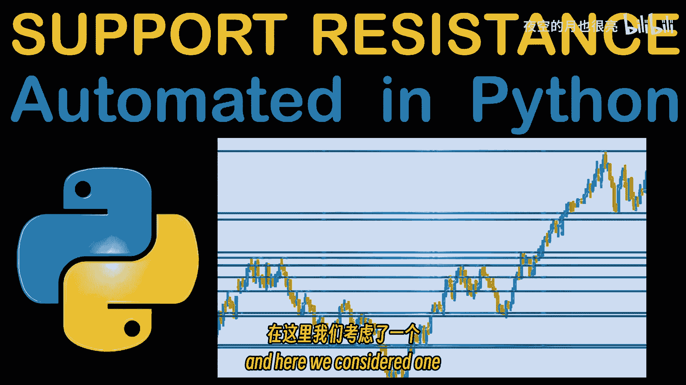
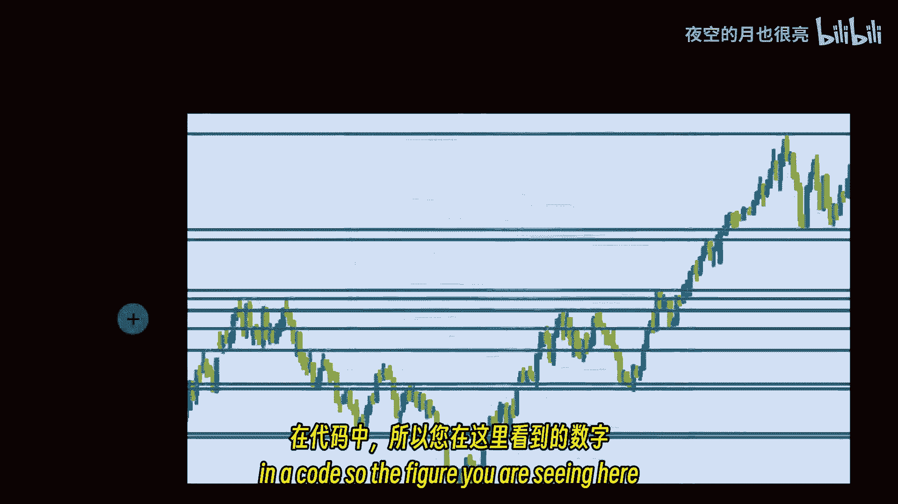
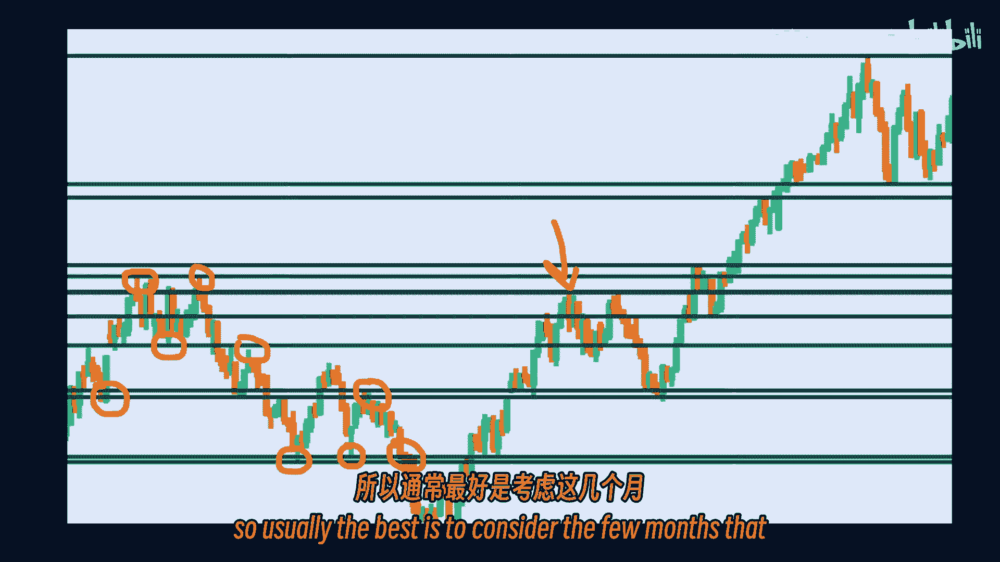
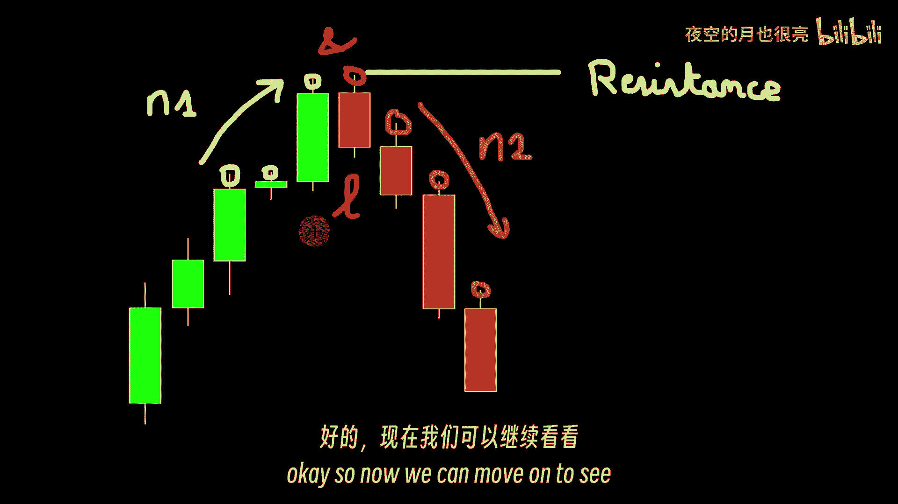
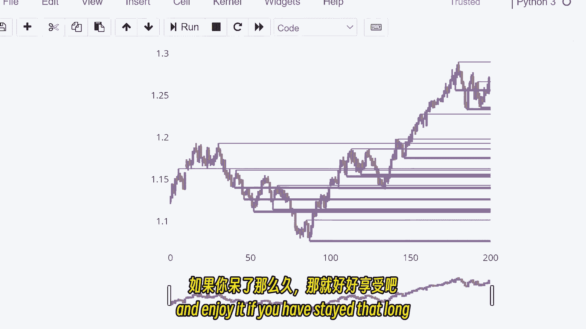

# 水平支撑和阻力的检测 - P1 - 夜空的月也很亮 - BV1mb421b7Th

你好，欢迎大家回到本期视频，我们将解释如何自动检测支撑和阻力水平，在Python中，这是一个很好的想法，是由你的一个评论提出的，所以谢谢你，和往常一样，别忘了该程序可从链接下载，在下面的描述中。

这是一个jupyter笔记本文件，你可以用它来做你自己的实验，您可能想在不同的货币或不同的时间框架上尝试这项工作，也许可以改变一些我留给你的变数，如果你对这个视频的内容感到好奇。

虽然很容易直观地看到支撑和阻力水平，如果你在看价格变动图，当谈到气动定义这个，可能看起来很复杂，但是，没那么复杂，编写代码也很简单，有一个合适的算法，将整个检测过程自动化，只是让你知道。

我们在这个视频中展示的并不是做到这一点的唯一算法，有不同的方法来检测支撑和阻力水平，这里我们考虑了一个在代码中实现相对简单的。

所以你在这里看到的图是在我们将要解释的代码中产生的。

如你所见，支撑和阻力水平被我们的程序正确地检测到，这在任何情况下都适用于任何不同的货币，但它仍然不是完美的算法，你可能会在这张图上注意到，一些水平没有被检测到，我们将在稍后的视频中讨论这个问题。

所以这个想法是，通常当你想定义这些级别时，你必须在一定的时间内回头看，一两个月甚至更长时间，取决于您希望在策略中包括多少级别，你掌握的数据越多，你会发现更多的水平，所以你可能需要考虑一个日线图。

就像我们在这里看到的那样，如果在某个特定的日期，就像这里，我们想进行交易，所以我们需要支撑和阻力水平，我们可以在一定的时间内回顾过去，一个月之内，让我们假设并发现在这个特定日期之前一个月发生的那些水平。

这就是我们要在节目中模仿的，我们将考虑一个有限的时间，在那里我们将检测到这些水平，因为如果我们试图运行我们的程序，在我们掌握的所有数据中寻找阻力和支撑水平，我们最终会得到大量这样的水平。

这对任何交易策略都不方便，所以通常最好的办法是考虑你当前约会之前的几个月。

所以我们的算法是这样工作的，对于支持级别，我们将寻找一定数量的递减低点，在我们感兴趣的蜡烛前，那么我们必须在兴趣之烛之后有三个增长定律，当我们有这样一个模式，所有这些条件都验证了一组蜡烛。

然后我们就知道我们找到了一个支撑位，在这些蜡烛中，哪个值等于价格的最低值，阻力位也一样，我们必须有一个越来越高的高点，然后更高的兴趣蜡烛，然后在感兴趣的蜡烛后降低高点，这就是我们如何找到阻力水平。

这些蜡烛中哪个价格最高，现在在这个阶段有一个有趣的参数，你应该考虑在感兴趣的蜡烛之前和之后有多少根蜡烛，嗯，因为这取决于用户，尝试不同的价值是很好的，我们将把它们定义为两个不同的变量。

在我们的程序中调用n 1和n 2，感兴趣的蜡烛的指数将是一个叫做l的变量，我们将在节目中使用，好啦，所以现在我们可以继续看看。

我们将如何用Python编写这个，所以这是我们的木星笔记本，我从进口熊猫开始，使用read下划线csv函数加载数据，我用的是2000年到2003年的欧元美元日线图，二千零二十一，这是近18年的数据。

所以如果你看了我之前的视频，你知道这是一个重复的部分，我不打算详述所有的细节，我们只是在过滤，酒吧或我们没有交易的日子，这基本上是市场关闭的日子，培训量等于零，我们可以看到数据被适当地清理了。

因为我们可以检查清洗前后的行数差异，所以你可以看到我们丢失了将近2000行，卷等于零，然后我们要定义两个函数，支撑和阻力函数，这些函数有四个参数，要包含在研究中的数据帧，L指数。

我们在这个视频里已经提到过了，我们测试的是这一排烛台，如果它涉及支撑或阻力水平，取决于您使用的函数，然后我们就有了这两个数字，N 1和N 2，要考虑蜡烛L前后蜡烛棒的数量，就像我们在算法部分解释的那样。

然后我们要去检查一下，如果烛台的价值很低，在蜡烛前我按递减的顺序走，如果不是这样，我们将返回零并跳出我们的函数，如果没有，然后我们简单地继续，我们要在感兴趣的蜡烛之后检查N两个蜡烛，我这里的蜡烛。

如果他们有越来越低的价值，如果我们发现一个例外，那我们应该马上归零，因为我们要找的设置不存在，在蜡烛的情况下，考虑参数n 1和n 2，所以如果我们的功能达到这个阶段，我们还没有跳出循环返回零。

我们可以返回一个，因为我们知道我们要找的设置在那里，所以我们有一个支持级别，或者我们有一个烛台涉及到一个支持水平，电阻函数也一样，它需要相同的四个参数，在这种情况下，我们检查每个蜡烛棒的较高值。

所以我们正在检查N个蜡烛的高点，就在是之前，L蜡烛，我们正在测试，我们想寻找增加更高的价值，如果我们有一个例外，意思是蜡烛I的高值低于蜡烛的高值，我减了一个，我们将返回零，因为这不是我们要找的。

哪个是蜡烛l，我们正在检查较高的值，我们希望这些是递减的，以便有阻力，所以如果我们发现一个例外，在那里蜡烛的高价值，这意味着我们必须返回零，因为它破坏了我们要找的设置，如果我们到了这个阶段。

而且我们还没有脱离功能，我们要还一个，因为我们有之前在这个视频中描述的设置，它定义了阻力水平，所以再一次，简而言之，这些函数--它们取某行的索引或蜡烛棒，这些参数与数据帧，它们返回一个。

如果是支撑位或阻力位，零，否则，我们接下来要做的是，我们必须使用这些函数，为了测试所有我们感兴趣的蜡烛，所以这排蜡烛应该放在这里，是蜡烛，这就是我们要去的地方，假设蜡烛零点，然后点一根蜡烛。

然后点第二根蜡烛，等，只是检查一下，如果蜡烛碰到阻力或支撑位，只要记住，如果你拿的是N个，假设等于2，如果n等于2，依此类推，所以对于每一根蜡烛，我们将使用函数，抵抗和支持。

如果这两个函数中的任何一个返回一个，我们知道有问题的蜡烛，L排的蜡烛是支撑，或者是在摸一个支撑物，或触及阻力水平，在这种情况下，我们将检查它的较高值或较低值。

只是为了知道我们所说的支撑位和阻力位是哪一个，我们将把这些值保存在某个列表中，所以我要定义一个空列表sr来表示支撑阻力，我取n等于3，在我测试的蜡烛之前，在这个蜡烛之后，它不一定是对称的，你可以拿三三。

或者三二一，你喜欢什么都行，这是我留给你的东西，您可以对这些值进行实验，以检查这些值对算法的影响，然后在一定范围内每一行的每一根蜡烛，它可以是N一个，可以是，呃，三比二吧，哦五。

也就是说我花了200天时间因为我们在做日线图，我要应用这个条件，如果支持的意思，如果此函数返回，一个，考虑到数据框架，我们正在查看n 1和n 2值的行，在这种情况下，这支特殊的蜡烛接触到了一个支撑水平。

在这种情况下，我们要加上蜡烛的最低价，进入我们的SR名单，请注意，我们附加了三个顶部值，表示当前蜡烛索引的行，最低价值，一个是支持，只是一个指数，如果我们谈论阻力，它将变成2，所以如果函数电阻返回1。

意义，如果我们现在测试的蜡烛，我们也在做同样的事情，我们将追加行索引，要知道哪个蜡烛参与了这个阻力水平，只是要知道这是我们所说的阻力水平，我们需要这两个索引，仅仅因为我们添加了这些值，相同列表中的元组。

如果您不想使用这些索引，您可以简单地定义两个不同的列表，一个用于支持级别，一个是阻力水平，然后您可以简单地追加两个元素的元组，行，低值，行和最高值，然后我们可以绘制我们的结果，我们要做的是。

我们要先画好蜡烛，然后我们要加上阻力线和支撑位，我们已经找到并存储在我们的SR列表中，所以我用包裹图，躺在这里，它使本例的事情变得简单，我们使用函数add shape。

在包的这里添加起始x和目标x之间的行，我们绘制范围的最小值和最大值，因为我们希望这些是水平线，我们可以简单地把y 0和y 1的相同值放在y轴上，请注意，我使用了第二个索引，因为这是指数的价格。

这里的第一名，这就是我们的程序发现的，您可以看到一些级别被正确检测到，有些被错过了，因为条件不具备，所以我们设置了一些条件，因为算法没有在这些水平上找到这些条件，无视这些，因此，根据我们定义的条件。

这些不是支撑或阻力水平，但请注意，许多水平都被正确地检测到了，我本来要加这个的，因为它是一个共同的支撑和阻力区，就像我们在这里看到的，所以这是一个被我们的算法遗漏的重要问题，此外。

你可能会注意到有些水平非常接近彼此的，但为了更清楚地看到这一点，我们要分成不同的颜色，支撑和阻力水平，所以我们不能在同一个列表中使用相同的它们，所以为了这个，我还添加了代码中存储值的部分。

在情节列表一和情节列表二，指数是支撑位还是阻力位，然后我将这些列表按递增的顺序排列，只是为了检查是否有连续的值非常接近彼此的，在这种情况下，我们将把它们合并成一个单一的级别。

所以你不希望在同一水平上绘制两三条线，你想要那些非常近的线条，或非常接近的支撑位或阻力位合并成一个水平，所以你可以在图表上看得更清楚，这就是你也可以干涉和修改这种差异的地方，算法会寻找并合并线条。

所以我们在这里说，如果这两条线中的任何一条比零点近，零，零五，在这种情况下，我们将删除其中一个，你可能会，当然啦，换这个，如果增加此值，你将合并很多非常接近的线条。

或者如果你想在你的情节中保留更多的细节，您可以简单地将其更改为较低的值，所以你可以这样做，我们这样做是为了第一个列表，也就是这里的情节列表一，然后对于这段代码的第二部分中的情节列表二。

然后我们可以重复前面的一个部分，它是代码的绘图部分，这一次我们可以用两种不同的颜色区分支撑和阻力水平，所以这里我只画了支撑位，我们可以去掉这部分的注释来绘制，两者都是，所以支撑水平是紫色的。

阻力水平是蓝色的，你可以看到这里定义了阻力水平，其实这样会更清楚，如果我们把这些线缩短到它们被计算的地方，检测到这些水平的烛台，所以我们要马上做这件事，这一次我把列表分成了两个列表，一个是ss表示支持。

一个是r r或阻力，这样更容易把它们分开，所以在这里，如果我检测到任何支撑水平，我将添加这些级别的值和列表ss，阻力水平将被列入RR列表，然后我们可以用烛台图上的线条来绘制，这是烛台的图表。

我们以前见过这部分，但不是在x 0之间绘制，我们整个情节索引的开始，意思是在蜡烛上取零到烛台，两百两百零五，我要在烛台上开始排队，在阻力或支撑层，所以这是这里的支撑位，因为我在用党卫军名单，SS的长度。

我将取ss的值作为c行，索引为0，意思是蜡烛的指数减去3，所以我们要在那个特定的蜡烛之前的三根蜡烛内开始，我们将在图表上看到这一点，会更容易解释，对Y来说，这几乎是一样的。

所以它是这个特定列表中索引为c的值，它是第二个值，哪个是指数一的价格值，请注意，这里我们不需要追加任何索引，就像我们以前做的那样，我们把1和2放在一起只是为了区分支持和抵抗。

因为我们把它们存储在一个列表中，现在我们有了两个名单，我们可以在这种顶部格式中丢弃第三个参数，另一个是X，我们将从x 0，到图末尾的直线的起始位置，如果你想要更美观的东西，我们可以简单地缩短它。

但是为了这个例子的目的，这就足够了，Y和Y 0基本上是一样的，因为我们在画一条水平线，所以它将是y 0和y 1具有相同的值，然后我们，呃，我们对抵抗名单做同样的事，我们将检查此列表中包含的值。

和不同颜色不同宽度的绘图线，这就是我们现在所拥有的，所以你可以看到我们有水平，我们开始绘制这条线，在这根特殊的蜡烛之前只有三根蜡烛，因为我在这里加了负3，当然，你可以把一些不同的东西或者简单地归零。

如果我去掉那些，例如，将是这样的，线路将在接触支撑或阻力水平的蜡烛处立即启动，我们可以看到一些水平在某个时候被检测到，有一定的蜡烛图案，然而，这里、这里和这里都没有检测到同样的水平。

所以这只是告诉你我们的算法不是最敏感的，这不是最好的算法，不过没关系，它可以，它仍然可以检测一些，并根据需要支持和阻力水平，然而，它不会探测到所有的，这是你可能需要考虑的。

如果您正在使用此支撑和阻力水平构建策略，让我们说，吞没图案等，我们算法的灵敏度将取决于，也是关于n 1和n 2参数，大家可以看到，我是说，如果我们把这些从三个变成两个，假设我们在这里放2。

它会给我们一些更敏感的东西，所以我们会有更多的线条，现在我们可以看到这个水平被检测到，即使是这个也在这里被检测到，所以你可能想改变n，1，2的值，有一点，你应该知道你之前考虑的蜡烛越少，当我点完蜡烛。

假设你的模型变得越敏感，所以这就是我们在这里所做的，我把数字和一从三个减少到两个，在这种情况下，我们检测到了更多的水平，所以说到底还不错，但你得调整它，你必须知道你以前在用什么工作。

你只是盲目地把它应用到某种策略上，这就是我要告诉你的关于这个算法的一切，希望你们喜欢，再次感谢在评论中提到这一点的人，这是一个能够在Python中自动检测的好主意，支撑位和阻力位。

我要把jupyter笔记本文件，以及描述中的链接，你可以下载这个并享受它，如果你待了那么久。

