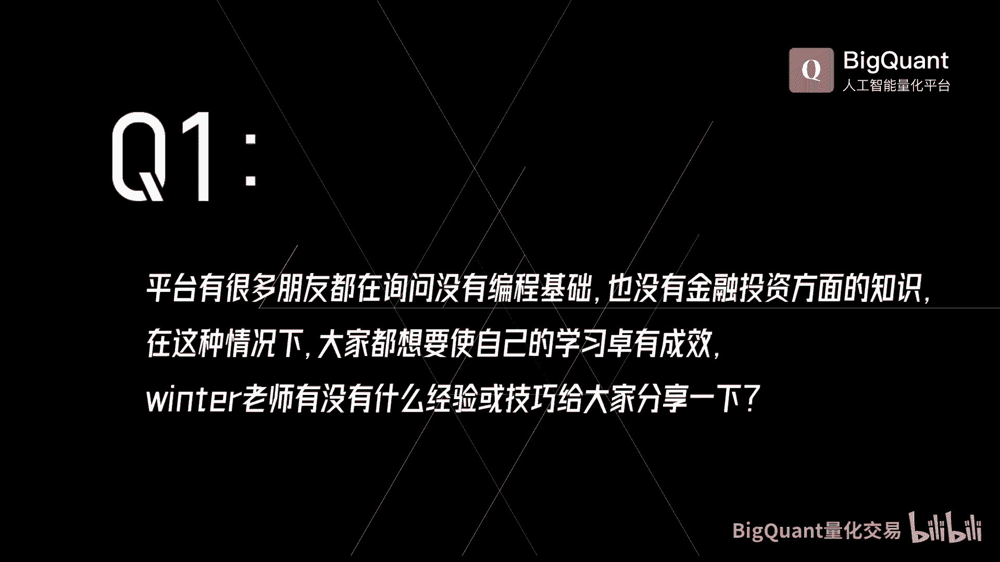
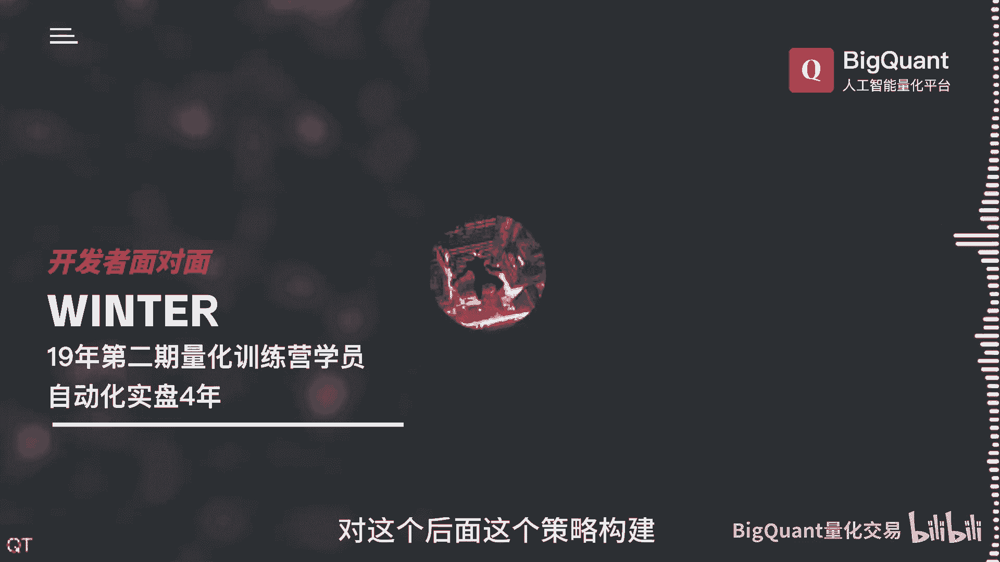
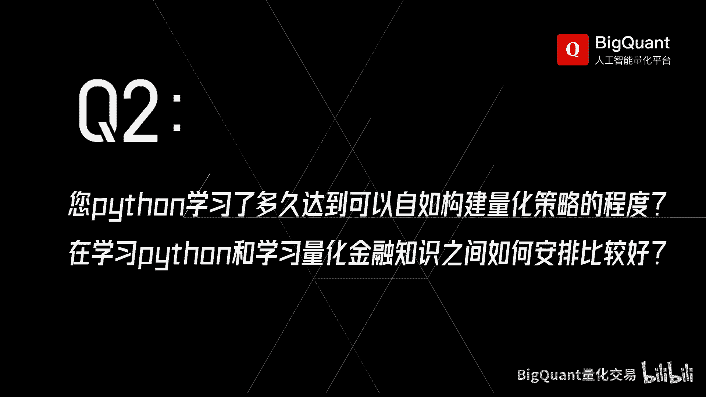
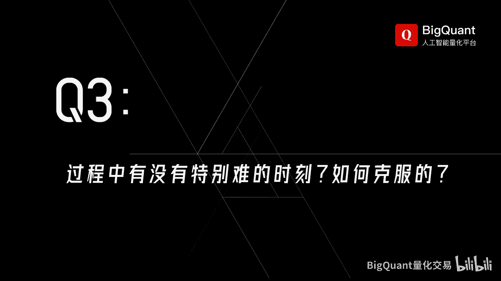

# 没有编程背景，不懂金融投资的工科生如何逆袭成为量化交易高手！！ - P1 - BigQuant量化投资 - BV1bx421k7q8

大家好啊，就是我应该跟这个平台使用大多数人一样啊，就是一个纯小白啊，最最开始的时候，那个时候是呃呃既不会编程，也不会炒股啊，应该是2019年的时候，主要还是从经历里面说一些东西吧，然后大家可以借鉴一下。

然后2019年的时候呢，这个Python很火，然后那个时候主要工作之余嘛也没什么事情，然后呢就跟风学了一下Python，然后网上找了一些教程，然后看一下文档嗯好了，自己动手装了一下那个环境。

然后学完以后呢，就是不知道用这个Python来干嘛，然后也尝试了一些方向，像网站啊，购物返利啊什么的，最后呢就是偶然机会啊，听说这个字幕用这个来炒股，所以呢后来就是网上开始找相关的网站。

我相信大家也找过很多平台啊，像巨宽呃，包括那个万德，他也出过一个环境，我都用过，最后选择了大宽，也最后也留在了大宽，之后是2020年，就是呃尝试自己开发的策略，那个时候刚来大盘呃。

把大宽的整个教程都学了一遍，那整个应该是全过程都会用了，但是其实对股票策略的概念呢，其实还是不够清晰的，像什么新因子啊，风险敞口啊，中性策略啊，像这种金融知识其实都不了解，那于是又是网上的一阵恶补完呢。

其实还是发现对整个策略没有思路啊，那时候我其实也咨询了几个呃大宽这边的老师，像呃守田啊，他们就是到底一个什么样的策略能够实盘啊，因为呃做这个东西嘛最终都是考虑要盈利，要去实盘的。

那时候老师就推荐我参加了训集训营啊，整体来说应该是对我很有帮助的，就是参加完之后呢，也认识了一堆朋友啊，对整个股票的概念策略来给了一个大概的概念，但是其实呃参加训练营也没有到。

这个能搞出实盘策略的一个程度呃，但是大二宽有一个很好的地方呢，就是有一个策略天梯啊，那个时候策略天梯呢我想大家也都知道，包括有很多订阅，然后我那个时候呢就尝试订阅了一个策略，那时候我记得很清楚啊。

那个时候还没有实盘，都是手动跟的，那有时候呢这个跟着这个股票，就会出现这种盘中那种脉冲的上涨，有时候呢还会拉涨停，嗯我就觉得特别神奇，因为我自己炒股啊，就从来没遇到过这种东西啊，因为我之前炒股都是亏的。

就几万块钱在里面刷刷刷，然后就去研究这个天机比较牛逼的策略，去研究它这个选股的特点，因为你天梯一个策略，大家都能看到这个历史上的一些股票嘛，那你去看看有没有什么共通之处，它到底为什么涨。

或者说它有什么样的这个曲线，或者什么样的结构才会找，那然后再用在自己的策略里面，就这样呢就是慢慢的入门，那20年的这个后半段呢，是正式开始自己的策略实盘，一直到现在呃，这是整个我自己的一个经历啊。

其实我觉得还是你的兴趣为主啊，你如果对一件事情有兴趣，舍得花时间去钻研，那基本上都会有收获，我那时候其实都是没有这个相关的语言，背景性啊，就是可能上学的时候学过一下CR什么之类的。

呃我觉得Python不难吧，你其实只要最基本的操作学会了，我觉得一个星期绰绰有拍摄，一般的这种这种操作的话，其实几天就可以了，最主要的还是要看一下NPD跟那个pandas。

主要是这两块对这个后面这个策略构建啊。

因为主要还是一些数据处理这方面的知识。

说实话那个时候在大宽的时候，我是每年都是股票都是亏钱的，我就扔了几万块钱进去了，这对股票这块是完全没有概念的，然后后来去看这个天天这个嗯好的策略了，它一些股票的这种，你就总结它其实共有的一些规律。

然后呢那个时候可能有一些公众号啊什么的，因为现在这种财经博主都很多嘛，你去多听听啊什么的，把一些概念补补全，然后再去看看到底哪些股票可能会涨停，或者说哪些股票涨的概率会大一点，因为这种东西就看个人的。

你总结就是一堆股票的这种共同点，然后再去想用什么因子去体现这个事情，或者说怎么去构建一个这样的股票池，然后慢慢慢慢的来做，呃，很搞笑啊，就是我主观炒股全是亏的，但是量化之后呢，每年都是赚钱。

就是反正就是这样子，那相当于其实也是总结了一套你自己的，适合你自己的模型嘛对吧，策略其实现在很多很多，我手上策略也很多很多，反正呃呃就是其实共有的点都是一样的，因为我们做短信什么。

像在BQ这肯定就是做短线的，那一般都是量价模型，一般我这像这种财务的这种指标，一般就是做一个不要碰到黑天鹅，其他也没什么。

其实我觉得啊就这几年实盘之后的这几年时光，主要特别难的时刻，我觉得也没有吧，主要是还是有一些，因为呃大宽应该也是一个年轻的企业，我记得我是到四川来到你们总部去过的，最开始的时候。

然后呢就是当时刚上这个实盘的时候呢，因为bug比较多嘛，那个时候还是比较崩溃的，因为每天都是在在跟这个小舅做这个bug的事情，然后天天调来调去，然后每天基本上都要弄到十一二点才会睡觉。

但是你们工程师响应还是很快的，就是有时候我实在是撑不住了，我说我先去睡了，你帮我搞定就行，那第二天他还是能搞定的，有些东西，那现在的话呃，虽然bug也是有啊，但是比以前好很多很多。

应该是比1920年的时候，简直是不可同日而语啊，现在的情况我觉得特别困难的时候，主要还是实盘，你能不能坚持吧，就是一个就是你对自己有信心，第二个就是整个策略或者整个视频，能够给你持续的正反馈。

这是比较重要的，如果说你实盘就一开始就亏亏亏，我想任何人都很难坚持下去，所以说就是找对自己的这个方向，不断激励自己，然后对股票有一定的信心，就是你想在股票市场里面就是分一杯羹。

就是享受整个中国发展的红利吧，然后还有一个就是我觉得最特最困难最困难，因为我没有经历过股灾啊，但是今年1月份确实是一个灾难呃，不管怎么样说，就是我觉得1月份还是挺难的。

虽然呃22年我认为2023年虽然指数难看，但是不管是私募的自营还是小微盘的涨幅，其实都还是可以的，但是24年1月呢可能是DM的一些关系啊，就是整个地域级的，那个时候就是有点怀疑自己。

包括就是被各种这个市场政策搞得眼花缭乱啊，虽然做了仓位管理啊，都没有跌那么狠，但是因为因为今年的话资金体量，可能我个人资金情况可能比较大的，就是呃从来没有亏过这么多钱。

虽然后面啊就是两月份收回跌幅之后还盈利了，就是但是会回想起来还是有点恐怖，我这次经历可能也是一个很好的体验，就是对整个市场认识也会更加深刻，那就从你来看，就是到到现在，可能已经实盘有差不多好几年了嘛。

就是你有在就是量化上面呃，有继续去积累一些知识，可以去学习一些东西吗，我应该说是实盘之后，到223年可能还尝试了一些新的东西，但是可能我感觉啊就是不是最初做的一些东西，其实是最好的。

我就我就觉得很奇怪啊，因为我到现在有时候可能呃用的策略组啊，或者说用的一些思路，可能还是我最初对这个市场最初了解的时候，也弄了一些东西，东西反倒是后面搞得越来越复杂的一些东西啊，从整个时间成本也好。

或者说是整个这个投资性价比来说，就是你因为你你做一个策略，你时间肯定会有很久吧，然后你可能如果去尝试DNSSTM这种，就资源会吃的很多，然后时间又很长，所以就是怎么在这个时间跟你这个开销面前。

达到一个平衡，然后又能不断的更新策略，我觉得这个是比较重要的，像因子啊，这些东西我觉得比较稳定的因子就够了，你如果太与时俱进呃，说实话也不是很稳定，我们因为炒股一般都是追求在不稳定中。

追求一对一种相对稳定，一般都是很多曲线，其实你让我随便做一个年化几百的，我觉得都很好做，但是你实盘到底是怎么样，你这个就谁都说不清楚，其实很难达到的目的，一个平衡就是我的实盘要尽量的去追赶上。

我的模拟这块呢，其实大家也是会经常遇到的一个问题对吧，就是比如说你的模拟看着很好，但是到实盘那块的话，其实表现的就特别特别的差，因为我看就是因为您一直在用我们那个实盘嘛。

就相当于说您现在自己本身的一个实盘的话，其实还是在跟着你的策略再走，就基本上可能是百分之百的在跟着吗，我会有一定的暂时就是仓位的控制，就是明确不好说，因为我不向机构做空嘛。

就是可能可能会随着资金体量增大了，可能会尝试着去做一些做空做空对冲锋，但是目前为止应该还没有这个计划，所以也可能会有一些仓位的控制，所以这也是我一直就是使用那个1。0是盘的，这个原因啊。

就是因为那个东西我可以做一些仓位的控制，然后策略的话，一般基本上我就是跟着策略走呃，我不跟策略，我就是亏钱的，我就刚才已经说了，我如果自己去炒股，百分百亏钱，我跟策略才会赚钱，那说明还是找对了，找对了。

量化指条路，我觉得作为业余来说，因为我也是我也是业余做做这个事情，因为我也有本职工作，但是就从大概2年开始吧，就是这股票上面的收入，应该已经超过了这个工作收入，但是一直也没有说去全职做这个事情。

我觉得还是有一些这个风险在的，但是嗯也感谢BQ啊，我觉得没有BQ，我觉得我也不会踏上这条亮化兰布。

