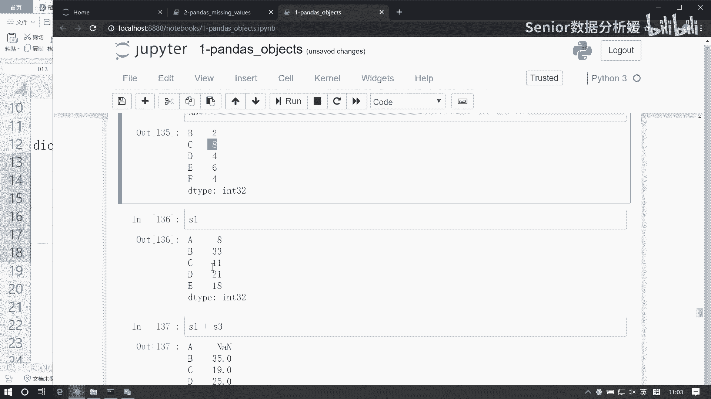
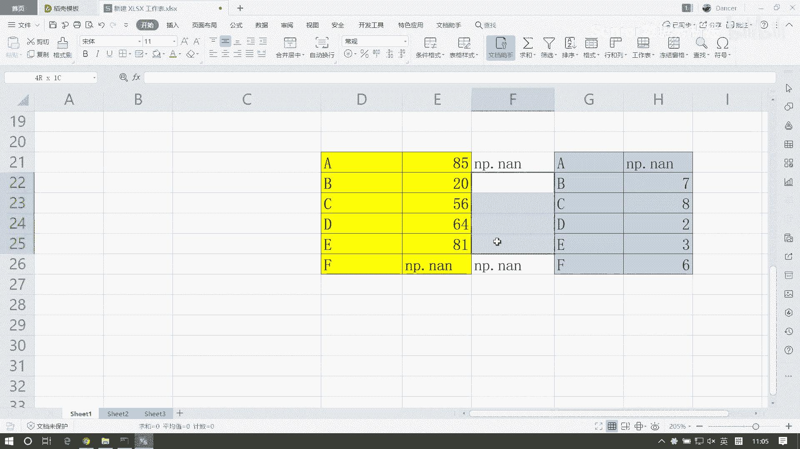
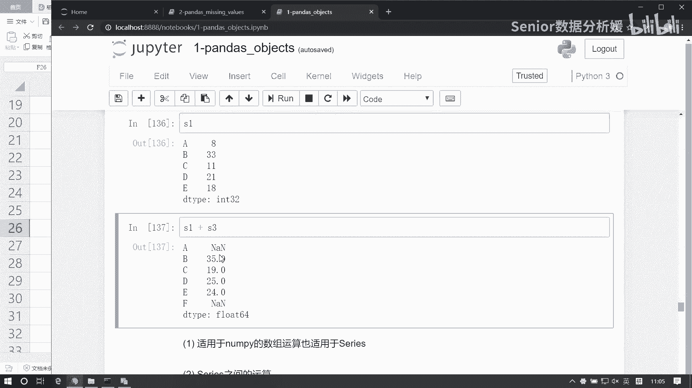
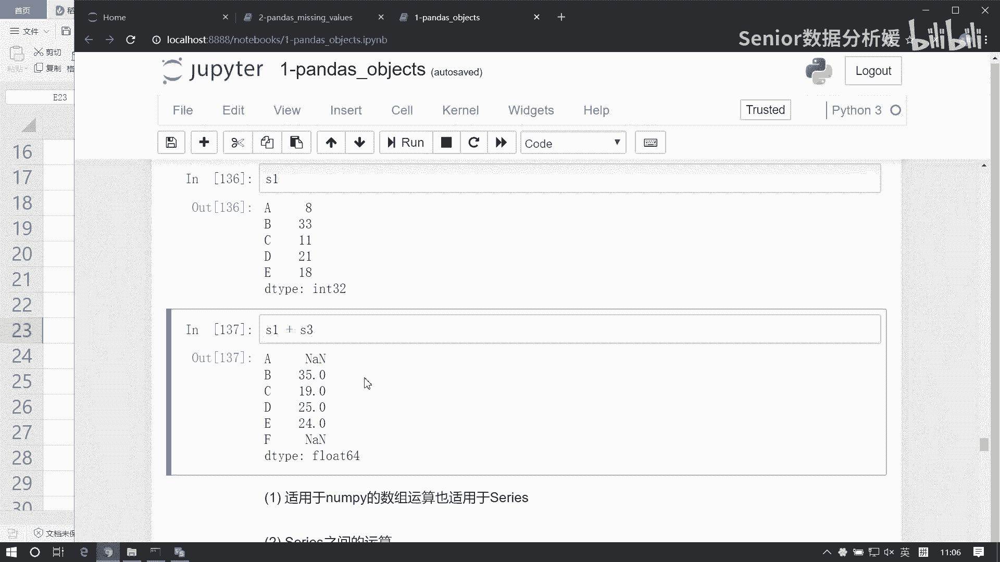
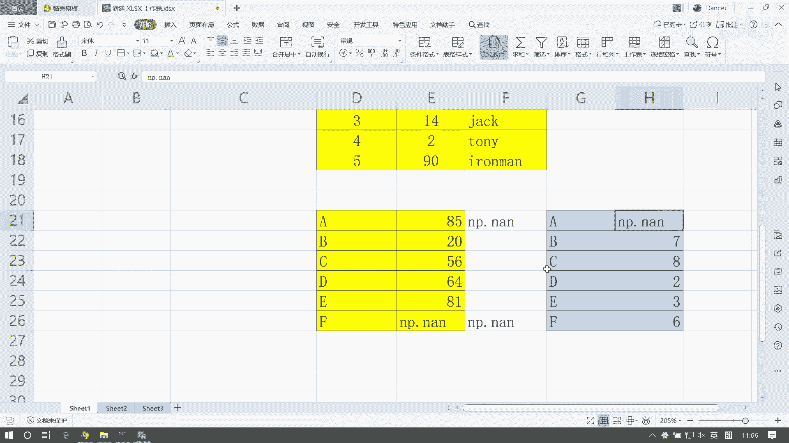
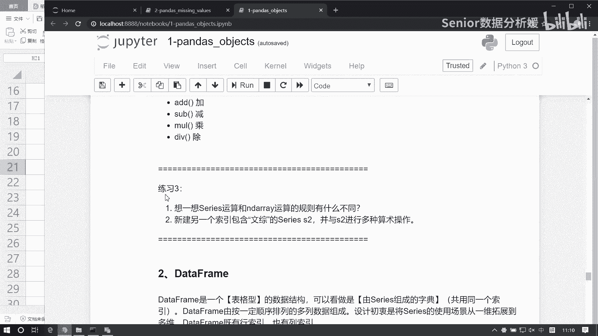

# 数据分析+金融量化+数据清洗，零基础数据分析金融量化从入门到实战课程，带你从金融基础知识到量化项目实战！【入门必备】 - P29：02 Series常用函数及运算 - Senior数据分析媛 - BV1Ak61YVEYX

好接下来我们看啊series里边的一些常用函数啊，以及它的一些概念性的东西，首先第一个server是一个定长的有序字典啊，这就是一个概念性的东西了，这个大家了解就行了。

第二个可以通过shape size，index values等得到series属性啊，我看看啊，这是S啊，我们我们呢这个shape是S什么的，是它的形状对吧，形状啊，四逗号说明它长度为四的一个一维数组。

然后这个size呢那拿的什么呢，就是它元素的个数就是四四个对吧，然后index呢拿的就是它的显示索引S点，index是这样的一个显示索引，但这个显示索引大家看到它是一个index类型，对吧啊。

其实这东西啊，啊他不能直接转它，就是它其实就是一个南派AGRAY啊，这也没啥神奇的，比如说我想访问里面的语文，我直接拿里边的就拿出来了，对吧啊，所以他就是一个数组类型啊，这大家也不用觉得有多多么复杂啊。

就一样用，然后这个拿它的值我可以用values，那这呢你读出来就是一个南派array，这，是四个属性啊，好另外呢我们还有一些常见的办法，比如这个head和tail这两个东西干嘛呢。

它其实相当于帮我们做这个切片，从头切还是从尾巴切，那head呢就从头切，太阳呢就是从尾巴切啊，那那它里边可以指定一个个数来，默认的是五个，所以我们这里只有四个，看不出效果，你可以把它改成一是吧。

这样就只切了一个啊，或者改成二，这样切两个，这东西可以干嘛呢，一般可以来报我去查看，就是从头开始切片，这，个默认值是五，主要用它来查看结构的啊，虽然他虽然是切片啊，但一般呢我们就用它来展示一下。

你的数据的一个基本构成，大致的一个数据是什么样子，那跟他这个相同的，还有一个就是这个tail它也是啊，默认值是五，就这里面这个N默认值是五啊，那可以给他一个小点的，给个二，这样我们查的是最后两个啊。

拿到这么一个值嗯，然后还有这个啊，这就是如果你这个对应，所以没有值的时候，他会给我们补空是吧，这个我们比如说拿这个字典啊，比如这个字典是吧，那我可以用它来构造一个serious，啊啊，Serious。

然后这个date呢我们就等于这个DSE，然后index我们就指定，比如说指定一个化学，再来个物理，再来个英语，再来个语文好，那我们可以看到就是我们在取这个，从这个字典里面取值的时候。

那这个化学和物理这两个键是不存在的对吧，所以他会给我们补充空值，这个NNAN是啥呢，NAN其实就是NP点NN啊，我们可以把它拿出来看一眼啊，这个S我们保存一下，啊比如我们我们去读这个物理。

那我是不是可以点LT然后访问物理啊，得到指数是个NAN啊，它就是个那个NP点NN啊，他就是NP点NN，那这玩意你看我们跟任何一个数做个加法，加个一得到结果说还是NN啊，啊就是这个空值啊。

这还一个特性给我们补充一个空值，然后另外呢我们可以用pd点is now和not now，来检测咱们这个缺失数据啊，比如说我们现在对这个S啊，这个数据量比如说很大啊，比如说有1万条。

那么可能这个难呢就隐藏在某些小地方，我们看不到对吧，这种情况呢我们就可以用借助这个函数啊，来去进行一个这个检查，我对它执行一个is now呢，那么如果是空值就会返回true，是控制这个返回true。

这样的话呢我就可以得到什么呢，我就可以得到这个对应true的值是吧，那么这个是个布尔列表啊，这个布尔列表，我是不是可以用它来访问我的serious啊，是不是可以把我这个空值给检测出来啊，那反过来看的话。

我们可以把not now我是不是也能拿出来啊，是不是这样的啊，那还有一种情况啊，这种是检测空值，还有个什么是检查是否存在控制，我想看整个这个里边是否存在至少一个空值，可以怎么干呢。

我还是我用S点is now，如果有空值就会返回true对吧，那我可以对它啊，再做一个聚合，咱们之前有个聚合叫any name，还记得吗，ID有什么特性，就是这个列表当中存在至少一个true。

我就返回true，对不对，所以我可以通过它呢来查看我这一组数据当中，是否存在空值是吧，返回TRU就意味着它存在空值，而这个呢是可以过滤空值，把空值直接给过滤掉了啊，然后布尔列表访问这个我们说过了。

这不说了，还有还有一个name属性，这个name属性我也带进去了是吧，name属性呢主要是对这个series的一个说明啊，比如说我这个S我可以给他做个设置啊，比如这是store。

啊这样多了一个scar啊，那这个scar呢其实它还有一个意义，就是这个series s啊，它一旦变成一个data frame，这个死SCR啊就成为了他的一个标签了，嗯所以他这个还有一个有个其他含义啊。

这个我们一会讲讲那个data frame的时候，咱们再再说它啊，然后咱们这个series的运算啊，啊下面我再加一个方法啊，这个C还有个方法是干这个的，他可以帮我干嘛呢。

有个有个方法叫salt values，Salt values，就是我们可以根据什么，根据我们的值来做一个排序，Sult values，然后这里面呢有一个ascending啊，Ascending。

那ascending呢默认值是true，Assiding，啥意思啊，升序是吧，升序就ascending，然后descending就是降序啊，那我把它设置为false的话，那就是降序了。

我3ding等于false，他如果为true，那就是升序啊，因为这值都一样的对吧，可以换一个啊，我们换一个这个，生成一组假的啊，这个，S1等于N啊，等于一个series，啊这是十个值啊。

那我们可以用它呢来做一个排序啊，这个S1点呃，Salt values，我们得到一个S2，然后看一下点S2是吧，这样他是把这个值从小到大进行一个排序的啊，那我们对S2呢也可以再排，比如我想根据索引来排。

那我可以反过来S2点salt index是吧，这样是根据索引排，然后还有一个还有一个用法啊，就是额我们可以统计，就是某一个就是某一个值啊，它在这个整个数据当中出现的次数，这个东西很有用啊。

我们生成一组假数据啊，这个series，然后，data等于NT点random点RANDOINT，我们从0~10啊，这样它会有重复数字，然后这个size等于100，我们生成100个数啊，我把它记为S3。

那这100个数当中呢都是0~10的一组数据啊，这边比如我想统计七七出现了多少次，或者是一出现了多少次，二出现多少次，三出现多少次，可以用这个啊，我可以用这个S3点叫value counts。

这样呢就是这个是表示五出现了16次，八出现了14次，零出现了13次，九出现十次，这东西很有用啊，比如说我们想统计一组数据当中的男女比例啊，那么那么你可能有一组数据是是这样的啊，比如说有一组数据是sex。

它等于是一个SERI啊，然后这个data呢我用零表示啊，零表示男一表示女吧，那我这个NP点random点random int就是从0~1，然后size等于100，应该是0~2吧，啊这样啊。

然后把这个name加上，比如这叫sex，是吧，这是一列啊，这是sex，那么这一列当中我们将统计男女的一个比例，我就可以直接来一个value cos，这样我们一出现了52次，零出现了48次是吧。

这样咱就知道了男女的一个比例了啊，好这个我们简单做一个回顾啊，这边的这几个方法啊，第一个啊series它的四个属性，Shape size index values，那你要注意啊。

就是shift得到的是一个什么是一个元组，size得到的是一个数值，index得到的是一个index列表，values得到的是一个南派AGR，额那这这个东西尤其这个东西啊，大家注意。

因为这个南派你这个S啊，S本身是一个series，那你要是读到这个values的话呢，得到是一个NTARRAY，所以说这两个对象是不一样的，那么他们的处理办法也不一样啊，比如说你读了个value。

那它变成单派克raid，那它还有没有salt values，还有没有这个函数了，没有了呗，对吧，因为什么，因为类型变了啊，所以你要注意啊，就是你在做这些访问的时候，变换的时候呢，一定要注意类型。

然后head和tail，那么它主要是帮我们查看前几个值和，后几个值啊，虽然它是切片，但一般来来讲是用查看数据的啊，嗯嗯然后这个索引值如果没对应的时候呢，会补充空值，这个空值呢是南派南派的空值。

然后is not和not now这两个函数呢，我们可以和any和all来进行结合使用啊，跟any any和all来结合的话呢，我们可以去检测是否存在空值啊，那么结合这个啊。

is not和not now结合他们得到这个这个布尔列表呢，我们也可以去过滤控制啊，这这个东西很重要啊，就这两个函数非常重要啊，我们会常用，然后布尔这边访问数据，这个不说了。

然后series本身有一个name属性，这个name属性呢，主要是来标注咱们这个series的一个表达含义的啊，然后还有就是这个两种排序啊，一个是根据值排序，一个是根据索引排序呃。

另外我们这个排序里边还有个参数叫叫in place，知道吧，这是干嘛的呢，就是替换，就是你要不要改变这个数据的内存，如果你是in place等于true的话，那相当于是在这个内存的基础之上做修改的。

它就不会有返回值了，因为他直接把这个值啊给你做好排序了啊，所以in place这个东西大家还是慎用啊，所以你去你特别去吧，这个值我们就运行完就完事了啊，不然的话你不用它。

你可以单独拿个变量给它做一个保存的，然后另外就是这个统计值的一个出现次数，这个东西很很常用啊，就是一般是来做这个数据的一个，比值的一个统计的啊，我们想看，一般我看，比如说这个正负样本的分布是否均衡啊。

或者男女比例是否是否均衡，或者说我们这个产品的一个售卖的次数，成交的次数对吧，比如你有ABCD4种产品，那每一种产品的一个成交次数的统计，都可以用这个values和value cos这个函数来除以啊。

咳咳，呃series运算呢它跟南派有什么不一样呢，它唯一不一样的就是，series里边是引入了这个索引的概念的，我们生成一个S啊NP啊，data等于NP点，random点，RANDOINT0到100。

然后size等于等于五吧，然后这个index我们要等于list这个ABCDE，再来个S2，我把这两值呢做一个输出，啊嗯，先说这个普通运算啊，就这个S1，它比如说我跟一个数相加，那这是什么呢，这就是广播。

这没什么说的啊，一个serious跟一个整数整数运算啊，这是最基础的广播机制，他会把这个数啊给它拍成，给他广播，成一个跟它维度一样的数据，然后再给它做对应位置相加。

但是复杂一点呢是在于series跟series之间的运算，SLS之间运算呢，他要考虑的是索引对齐这样一个原则，啊这东西怎么体现呢，我们在比如说这个S2啊，S2我们给他变一下，我们变成这个CDEBBA吧。

这两个索引是不是顺序不一样了对吧，他俩顺序不一样了，那我看他俩如果做一个相加运算，S1，加上S2，咱看这个值怎么来的啊，第一个值是46，A是46啊，A46，这个是A是八，这个是38。

是不是38+8呀对吧，它不是对应位置相加，它是什么，它是索引对应相加是吧，啊那如果你能对齐还好，如果对不起怎么办，你再来个X3，现在我S3是BCDEF，而S1呢是ABCDE是吧。

这两个东西如果一旦相加的话，这会怎么样呢，A是空值，F是空值，其他这几个值应该是正常加加的，比如说这个B35怎么来的，这是33，这个B是二是吧，然后C呢这是八，这是11。

所以他得到的值是19啊，那A跟F呢为啥是空值呢，它是这么干的啊，首先你这边有个这个AABCDE，然后这边是，BCDEF啊，那他这边是有值的啊，这边是这个，比如说是等于run北between0到十。

这有值的，然后这边是，0~100，这两个东西相加呢，他会先做什么，先做索引对齐，所以对齐啊，那么第一个数组呢，它因为没有F，所以他要把F填进填进来，而这个同样的它没有A所以他要把A填进来。

但是填完之后F我们这个值应该填什么呢，没有值没有值怎么办呢，填空值同样这边也是一个道理啊，NP一点NN，所以这样的话一旦对齐了之后，我是不是就可以怎么样了，可以这个两边是可以运算了。

那他们两边一运算的话，那么85跟空值一加是不是就是空值啊，啊所以这个地方是空值，那同样的这个六跟空值相加是也是空值啊对吧，所以说呢BCD呢，BCDE呢这个词就出来了。

但是呢A和F这俩值啊都是空值啊。

它都是空值啊，其实这个索引对齐原则呀，同样适用于普通的数组，你想但是为什么不提这个呢，因为普通数组的索引都一样的，他们默认是不就是01234啊对吧，它的索引是01234对吧。

他不可能说你的数组是从一开始查的，所以这个它其实也是索引对齐啊，但是呢因为咳咳咳，因为你对于series s来讲的话。

这个索引是可能可变性是比较大的，所以他也要考虑这个问题。

那如果是存在这种索引对齐的话，我现在如果想消除这个问题怎么办呢。

我可以借助下边的办法，就是通过这些函数的方式来处理，比如还是S1跟S3相加，我想把A和F的值保留下来，那我S1点ADD s这里边我们可以怎么样呢，可以把这个feel value做一个处理。

就是这个fail value啊，就是对这个空值的一个填充，比如我可以把零填进去，那这样的话我就把这个A和F都保留下来了啊，这样填一个空值进去，所以它主要就是这个索引对齐原则，那如果索引对不起怎么办呢。

则补空补空值，啊那啊如果想这个消除空值啊，可以借助ADD sub，系列的函数来进行运算，那还有一种情况，就是我刚才说的是server是跟一个数运算，还有是server是跟server之间运算。

那么series如果跟数组运算会发生什么呢，比如和南派合是运算，现在我们拿这个S1，以这个S1为例啊，比如我们给一个数组啊，那个NP点array表N1。

data等于NP点random点random int0到十，size等于五，这是N1啊，哎random点RANDOINT0啊，他没有data文啊，哎咳咳，写server是写写顺手了是吧，咳多套一层啊。

他俩相加啊，S1加上N1怎么来的，咳咳这个8+2是吧，33+5是吧，11+8，21+9，18+8对吧，其实什么其实还是广播啊，嗯嗯啊啊嗯，但是复杂一点，如果是跟多维数组相加，又会发生什么，来个N2。

来个五行两列，好他跟S1相加，加上N2，Operates could not be broadcast，什么五和五逗号二，这两个东西不能广播到一块，是不是不能往一块，那我们换一个逻辑啊，那二五呢。

又是报错了是吧，date must be一点ATION是吧，他虽然能广播，但是什么，但是也也不行，所以这对于这种情况来讲，你怎么办呢，你可以把它这个值提取出来，这玩意一提取出来。

是不是变成一个南派尔瑞了对吧，所以如果你series跟高维数组如果不能运算的话，那你要想运算，那你可以怎么，你可以把value4提取出来啊，提取出来，然后再跟高维数组运算。

因为高维数组之间是不存在索引的，所以他只拿值就做对应位置，相做广播运算就行了啊，嗯如果更复杂的，又又牵扯到这个索引对齐的问题的话，那就是series跟data frame之间运算了啊。

所以那个先不在考虑范围了，也就是说如果这个，如果这个series需要和高维数组运算，啊那么可以怎么样呢，可以这个呃获这个点values，获取到这个南派AGRAY，再进行运算。

