# 涨停双响炮出牛股，是真的吗？ 量化辩真伪! - P1 - SameQuant量化 - BV1Vr421w7BE

据说涨停双响炮很容易出牛股，是真的吗，每期量化一个特征，本期统计涨停双响炮，各位学员好，这里是神秘矿产量化，我们只讲干货啊，适合理性的人观看好，我们先来看一下涨停双响炮的一个定义，以及形态特征。

涨停双响炮简单来说就是啊，他前面有一个首板涨停，它第二天是一个冲高回落的阴线。

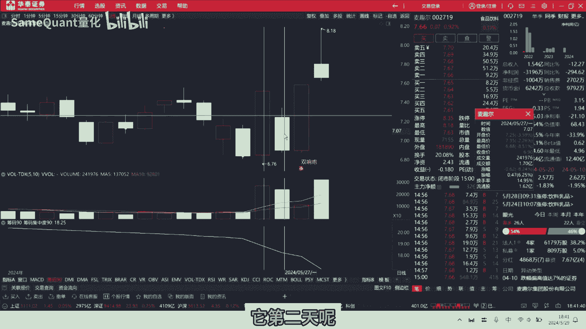

或者是一个低开低走的阴线，再来一个涨停啊，这就叫涨停双眼报啊，再来看一下其他的啊，这一天也是符合的，这个也是符合的，这就叫涨停双响报，那本次的一个统计结果呢，包括一个涨停双眼泡的一个封板率啊。

封板次日的一个收涨概率，那封板次的一个平均涨幅，炸板率，炸板次的平均涨幅，炸板次的一个收涨概率，那排除掉一字板后的它的一个封板率，那双响炮当日板栗的拓扑排行榜，那双响拨号后10日的收益率排行榜等等。

结果好，接下来我们直接运行一下统计好的一个结果，详细介绍好，我们可以看到啊，实施涨跌停制度开始啊，这个涨停双响炮总共出现了5128次，过滤掉s st科创板和20cm创业板后。

它的总数信号数量是3993次啊，可以说这个其实信号并不多，我们再来具体看一下啊，总数是3993，涨停双响炮，他出版的是3993，当天收盘涨停的是多少呢，是2673个大板，总数是1300啊，20个。

那具体的明细呢，就在我们这个结果的CSV文件里面啊，这个是所有的一个历史上，涨停双响炮的一个明细啊，当然这个明细里面还包括这个st股的，我们目前统计的是筛选过滤掉的，s st股的涨停双响炮。

他扣除一字涨停之后呢，是由2660一个，它的一个封板率，封板成功率是66。94%，扣除一字板之后的，这个封板率是66。46%，他双响炮涨停，次日的一个收涨的概率是60。87%，那如果涨停双海报。

它当天是一只板的话，它次日收涨的概率是82。46%，当然一字板的话，你大概率是无法买到的，所以说这个这么高的收场概率，是轮不到你吃肉的哈，次日的一个收涨概率啊，炸板的如果是炸板了，他次日收涨的概率是。

直接降到了37。35%，也就是说，如果你买到了一个涨停双响炮，你是在涨停板打板的，他当天炸板，那你第二天，那你收涨的概率只有37。35%，次日平均涨幅是，如果是收涨停双响炮，它涨停成功了当日。

那么他次日的平均涨幅是1。92%，那如果是扣除一字板之后呢，他次日的一个平均涨幅是1。83%。

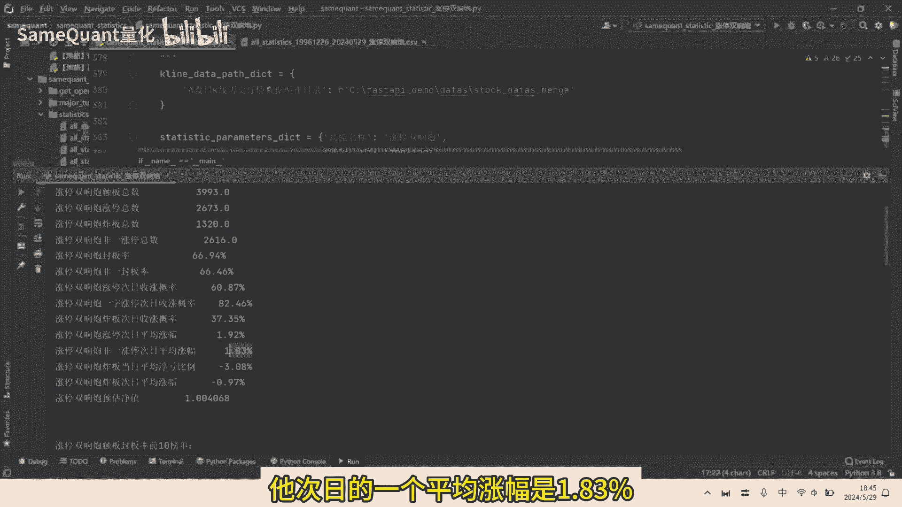

那如果说你涨停双眼泡当时炸板了啊，比如说这种我们找一个炸板的啊，你看这个这个你看这天涨停了，昨天他有个大阴线，今天呢他出版踏板了，那么这个就是双响炮炸板了，这是一个啊负面的一个典型。

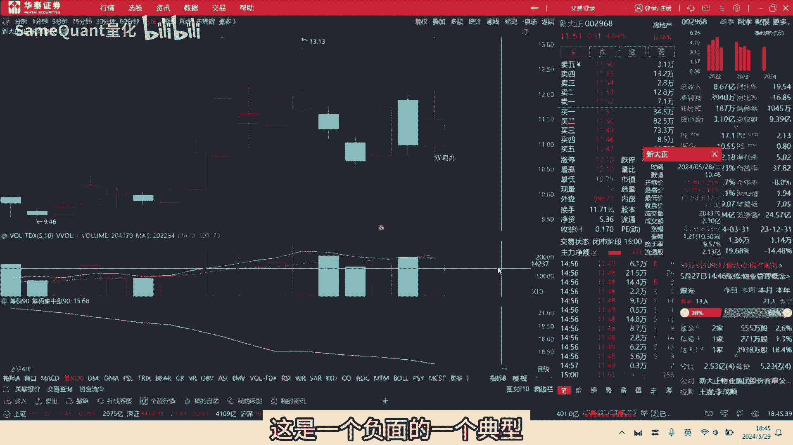

好他那一个大板之后，当日他平均浮亏比例是多少呢，是-3。08%，那我们可以看到他当天的浮亏比例是多少啊，是5%点多，因为涨停是10%，他收盘是4。29%，它浮亏是2%的啊，浮亏是百分之啊，将近5。7啊。

是这一支他再板，他次日平均周盘涨幅是多少，是-百分之啊，0。97好，最后一个指标很关键，他这个指标是什么意思呢，我们根据它的一个它封板的概率，与他次日的一个平均涨幅与同时呢与炸板。

炸板当日的平均涨涨幅啊，平均亏损浮亏，加上它的一个次日平均涨幅，综合进行一个加权计算之后啊，他的一块钱变成了1。004啊，微微盈利的一个状态，当然这个是没有扣除掉手续费，如果扣除掉手续费。

大概率也是一个亏钱的一个状态哈，当然这个是全量的数据，如果是主观交易的人的话，那你肯定那结果他就会特别大，要么就赚的特别多，要么就亏的特别多啊，好我们接下来呢再看一下这个双响炮，如果触板封板率。

它前十的一个榜单，这个也是这个什么意思呢，比如说这个叫博通的，对它历史上啊出现了六次涨停双响泡，它的封板率是一，也就是百分之百，那我们来单运行单支，来看一下它历史上有哪哪六次，具体是哪六次。

具体的日期是什么，好我们可以看到历史上啊，首先最近的一次2021年的11月3日啊。

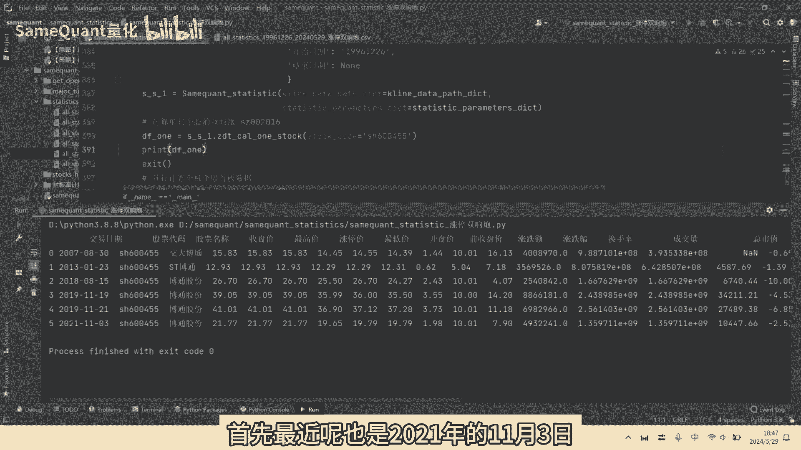

我们来去看一下2021年11月11月三日，也就是这一天，你看他封板成功了，其实是一个下跌的一个状态啊，同理呢还有2019年11月21日，11月21，它是封板成功了，但是次日是一个低开低走。

那天呢也是封板成功了。

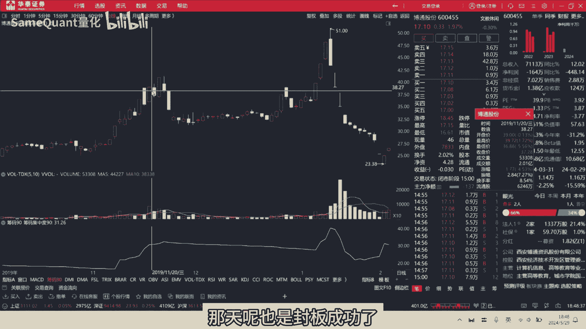

但次日呢也是低开低走哈，所以说并不是大家想象的，就是那么容易出现这个形态，就是吃肉的啊，好我们在啊重新运行一下全量的统计数据，好那好我们接着看一下中版率，倒数的那倒数的是这个啊，这个叫星光的。

它呢出现了五次信号啊，涨停双响炮，但是呢一次都没有封板成功啊，他炸板没有封板成功，就五次都炸板了嘛，五次都炸板。

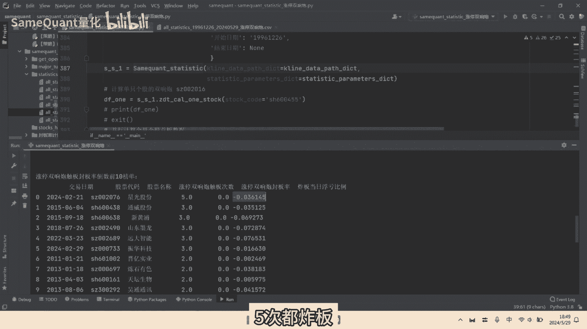

炸板当日平均浮亏是3。6%，这个还是很惨的，我们来看一下怎么看下，最近的一个日期是2月21，2024年2月21，是哪一天啊，是啊这一天是炸板了。

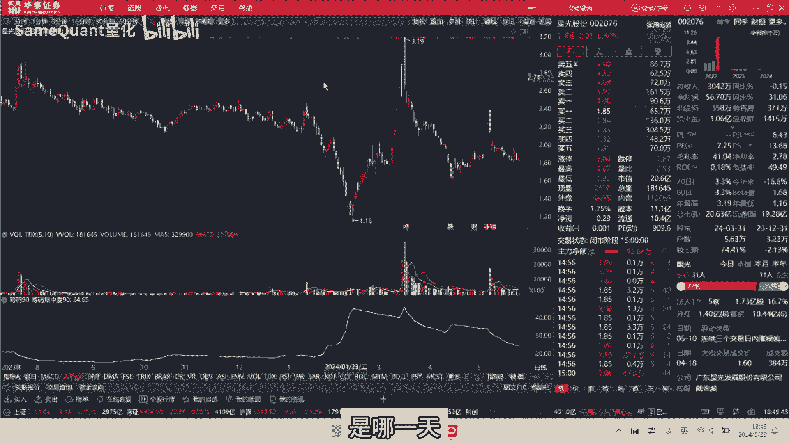

当天浮亏了4%点多，但但是他第二天，你看到他第二天其实是高开高走的，虽然说你看他的啊复板封板率很低，但是零他当日表现很糟糕，次还行啊，这这一支，那这就是top10的榜单，接下来我们再看一下。

它出现涨停双响炮信号之后，那未来10日涨幅top10的一个榜单，我们可以看到榜单第一位的是这个金利的，他是2019年5月20日出现之后，它未来10日的一个涨幅是132%。

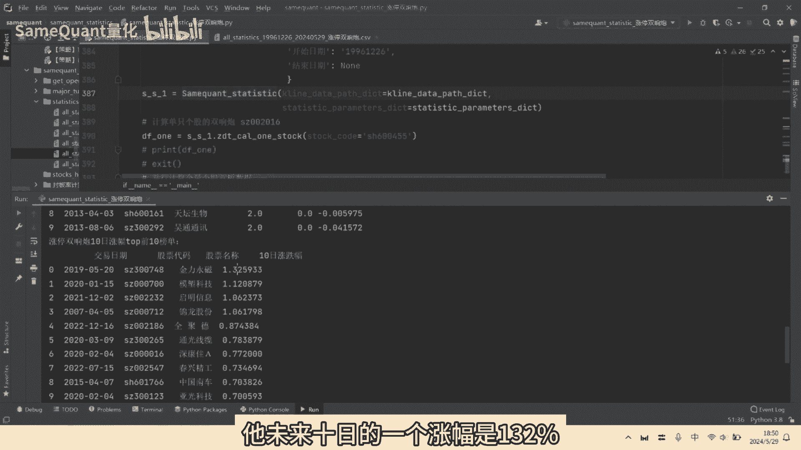

好我们也看一下，涨一零2019年5月20日啊。

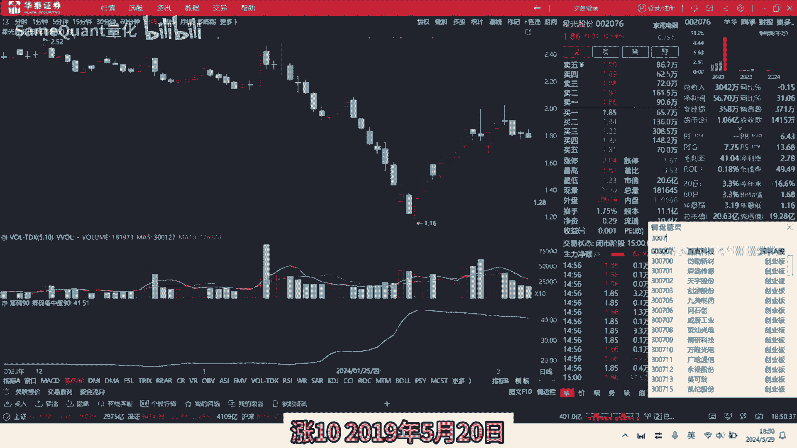

应该就在这哈，也就是这一天看到没，这一天出现了涨停，双响炮之后十天是组成了一个妖股啊，这个好，这个就是所有的这个股啊，它未来10日的涨幅啊，它的一个出版封板率啊，这炸板当日浮亏比例啊，这些啊。

统统数据在这个cs文件里面统统都有的哈，好我们来再来看一下啊，看完了涨幅排名前十的，我们再来看下跌幅排名前十的啊，未来十那跌幅排名前十的是啊，第一位的是自维的啊，亏了50%多，那我们找一个最近的看一下。

最近的叫华尔老泰的哈。

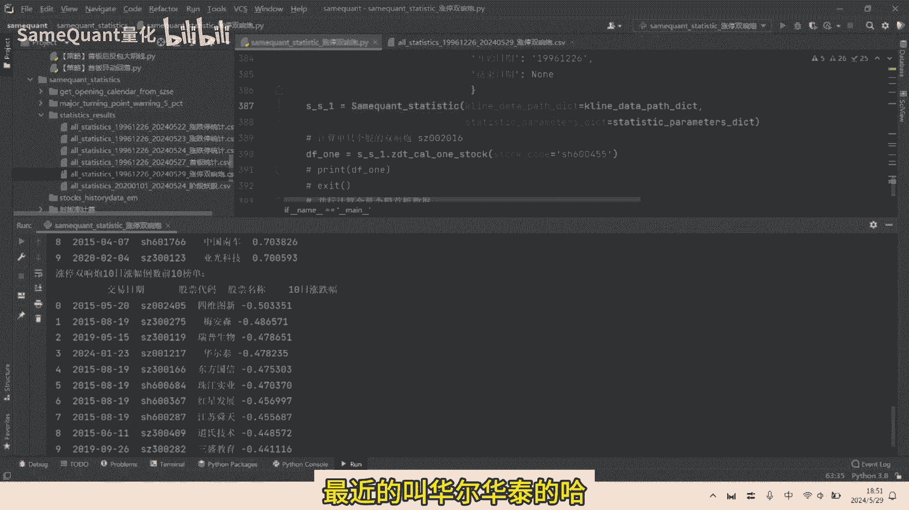

1月23日我们看一下，亏了47%，我们也来看一下啊，也就是这一天看到没，这一天也是一个涨停，双响炮之后呢啊实是连续的大阴线啊。

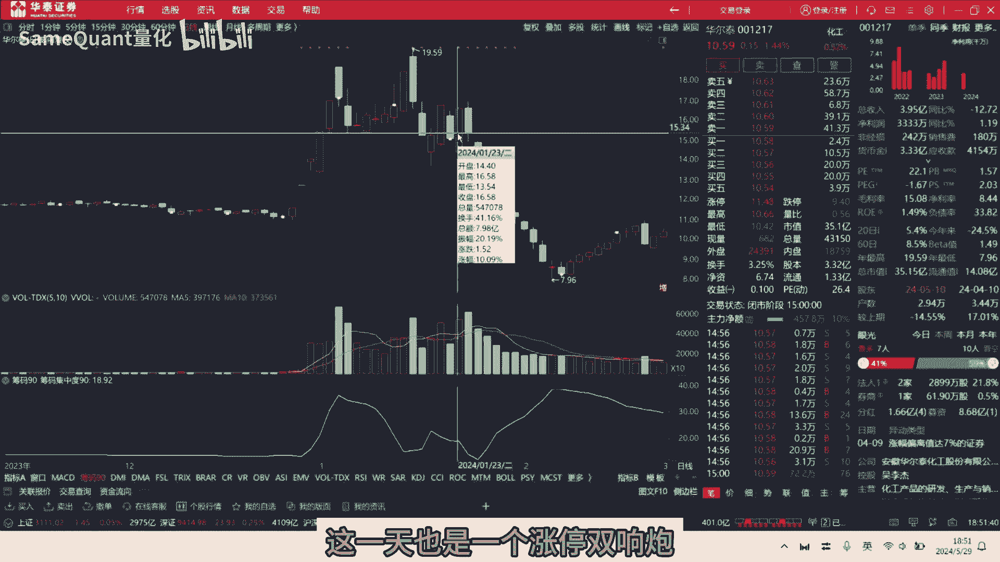

大家可以看一下是什么样的形态情况下，那之后实现是连续的一个暴跌好，接下来呢我们来进入代码来讲解一下哈，首先呢我们要定义好这个涨停双眼报，他是前日有首版，昨日是非涨停，收阴线，当日出版。

这里一定要注意是当日出版，你不能是当日收盘涨停哈，因为我们既要统计它收盘涨停，还要统计它炸板的好，我们这里呢就是一个核心的一个代码了，首先呢我们要把这个是什么，是手板给给标记出来。

那啊比如说他前10日涨停次数小于等于五了，那昨天不是涨停了，当天涨停的我们定义为这是首板哈，他前日首板涨停，也就是他首板的啊，向前今天也就是首版的shift2，我们在这个Python里面就是这个啊。

Shift2，用pandas as里面shift2，就是他前天是一个主板涨停哈，这个是表示转，他昨天就说，那要么它昨天的一个涨跌幅，它不管它是阳线还是阴线，它昨天涨涨跌幅只要是小于-3。5%。

这是一个条件，或者是另外一个，它是一个冲高回落的同时它是阴线啊，这是第二个条件，那么我们也定义为它是一个啊，昨天它是一个收阴或者冲高回落的阴线啊，或者是收跌啊，我当天是涨停出版，那这就第三个条件。

满足这三个条件呢，我们就定义为他是一个什么双响炮啊，双响炮，这是单只个股的，单只个股的计算出来之后，这个方法就是把所有的个股全部计算一遍，所有的信号计算出来，形成这样的一个CSV好。

这就是所有个股的双响炮的信号，接下来就是一个统计了，那统计这我们这些这些指标啊，状元抛出版的总数啊，涨停的收盘。

涨停的总数啊，炸板的总数啊，封板率啊，炸板率啊等等，所有的一个数据好了，本期的分享就到这里了，如果您对量化统计啊感兴趣的朋友。

