# 深度学习改进实验必看！基于YOLOV8的WIDER-FACE改进(轻量化+提点)实验思路讲解 - P1 - 魔傀面具 - BV1QJ4m1H7DJ

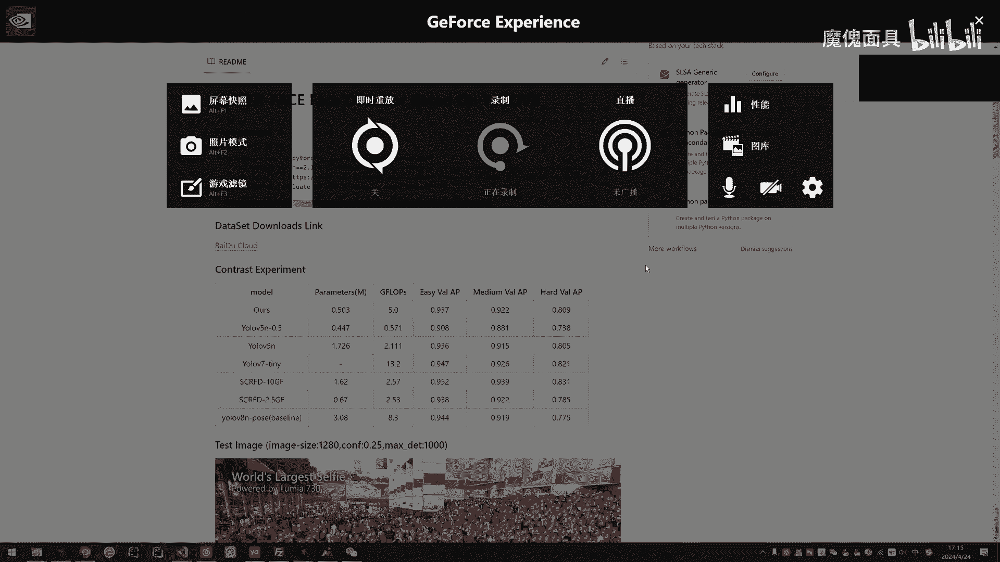

哈喽各位下午好，那么今天这期视频的话呢，就是给大家一起来过一下，我新开源的这一个项目啊，这个项目是基于这个啊这一个数据集，这个人脸检测数据集的URV8的一个改，进的一个方案，那么首先呢这个项目的话。

已经在我的这个规划上面已经上传了，如果大家觉得可以的话，就点个star支持一下啊，现在其实都很少这种项目开源，或者说很少这种项目去整体的给大，家去讲解的啊，那么这边的话。

首先带大家看一下这个环境的问题啊，那么这里的话我已经列了四点啊，就是装完这四点，我当时也是也是从一个空档里面，装完，这四点就可以正常的去跑对应的一个实验啊，那当然了，每个环境呢可能大同小异啊。

比如说自己缺什么包的，可以自己去装就OK了，那么数据集的录的一个下载，我也已经给大家整理好了，都是RO格式的，直接去下载就行，比较大啊，那么首先来看一下我们的一个实验啊，这是我们的实验的。

那么我们参数量只有0。53503啊，计算量是5。0，我们是基于LV8impulse去改的，然后这是我们的一个进度，那么在这两个的话呢，是基于这个，基于这个UV5m face啊，就是他们这里是有，当然了。

我这里对比的话，主要是主要是这个小模型，所以说我们这边就选了它，选择它的一个实验结果，那么虽然说我们的计算量比较大，但是我们这个啊参数量是就是它的模型大小，体积是非常小的啊。

因为的话呢我后面再压下去的话，精度下降的就比较厉害了，所以说我就没办法再压低这个继续刷了，那么后面我都会给大家介绍一下啊，那我们的进度的话呢，整体的话都是还行的啊，比如说对于uvc ti。

那么RV7ti的话，那它本身就是一个比较大的一个模型，它计算量就单纯计算量就已经13。2了啊，那么我们跟他的差距主要是这个AC差了一个点，还有这个号的话是差了大概也是一个多点吧。

那么这个密度的话就只差0。4，那么这两个的话是比较著名的一个，人脸检测器的一个模型啊，大家也可以去看一下，那么我们这个就是V8m pose的话呢，就是我们这个base nine，那当然了。

我们这个base line是这这这一个结果，他是带了这个预训练权重的，所以带了这个预训练全中啊，我们后面的话改进的话都是除了这一个，除了这个easy是比他低一点，其他特别是这一块的话是比他高了不少。

那么这个是我们用我们的模型，去做了一个检测啊，MSI是1280，执行都是0。25max，第一T是1000的一个效果啊，那么首先我们的我自己的第一个实验的话呢，就是想来看一下啊，没有预先的权重。

他对这个模型的影响有多大啊，没有预先的权重，对这个模型的影响有多大，那么按照这个实验结果来看的话呢，主要是影响在一个middle这一块，那么所以说其实我们这个结果，我们最终的这个模型啊。

后面所有的改进方案，都是基于这个loop圈去改的，所以说呢其实按照正常来说，我们的对比的结果是这样，但是的话呢在这里的话呢，我还是给出了这个好大，预训练权重的这个结果啊。

因为毕竟我跟他差的也不是特别多啊，重点就是这个IOS这里差的差一点点而已啊，那么所以说整体来说，对比这一个loop chain的话呢，啊都是起点，这是还行的，除了一级的话没什么变化，重点是在后的这一块。

那当然了，我们这一个的话呢，我们这一个模型啊，虽然说你们不要看它，就是可能说前面这个没什么变化，或者说这里也只提一个点，但是我们这一个东西的话，我们是还要比他更清亮的啊，我们还是还要比他更清凉的啊。

比如说他这个的话就是三点几了啊，我们只有0。5啊，那么第一个实验啊，就是这个预训练权重的问题，那么能看出来这个预训练权重，对他不是特别大的影响啊，不是说特别大的影响，然后的话呢第一步。

因为你比比如说你在这个真正的工程上，第一步肯定是数据对数据做处理的啊，第一步肯定是对这个数据做处理的，那么我看了一些基于这个数据集的一些论文，或者说一些比较著名的文章，比如说这个view face吗。

是ECCV202的一篇文章。

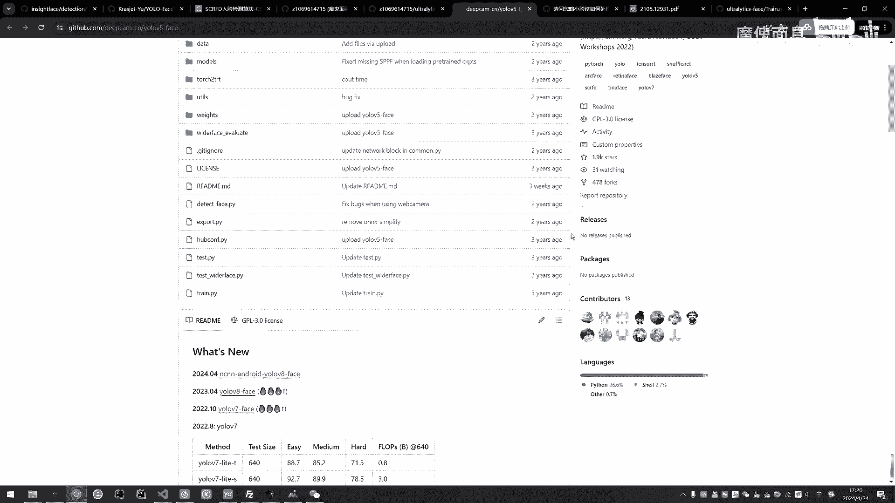

然后的话呢他们这里的话有一个egloss face啊，它有不同的一个就是它是有，特别是对于这个E1个密度的话，它是比较明显的一个提点的。

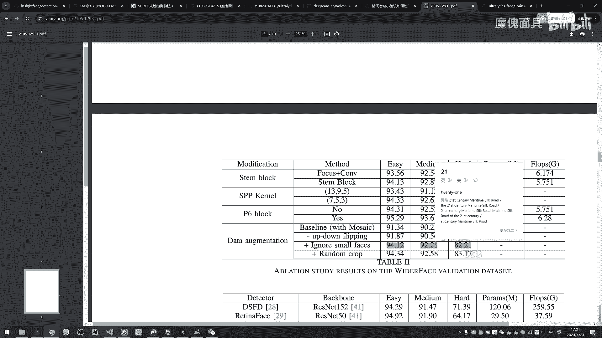

所以说呢我在这里也做了一些实验，那么在这个他的这个问题提提问栏，这一块的话呢，我们是可以看到啊，他有这个啊问啊，就是有人问这个如何去处理，那么这边的话它给出的就是低精度，宽高比共同过滤，还有模糊判断。

那么这里的话我也只做了这个低精度跟宽高比，共同过滤啊，我没有做模糊判断，那么这个的话我对他的理解就是说呃，我对这个的理解是这样子的，就是说你比如说你跑了一个模型啊，你把这个模型的预测结果全保存起来啊。

训练集啊，它训练集的预测结果全保存起来啊，那么你就可以去选筛选啊，一些低置信度的，比如说0。1以下的啊，或者说一个比例一以下的，然后呢他的目标也小了，这这一种数据给他标签给它去掉啊。

因为如果说像很难识别的那种目标，就可能说人员在640×640下，也看不清的这一种的话，那其实其实啊他对训练可能会有一定的干扰啊，他对训练可能会有一定的干扰，所以说呢我这边的话就做了这些实验。

就过滤掉这个这个九像素啊，是在这个640大小的情况下，它是为九像素的这个目标，97654多做了一些实验，那么从这里的这个规律可以看出哦，你过滤掉太大的不行啊，过滤掉太大的话呢。

他对这个hard影响非常大，虽然说他这些都有提点啊，前面这两个都有听，但是呢对这个号的影响是非常大的啊，也是比较符合他的这一个啊。

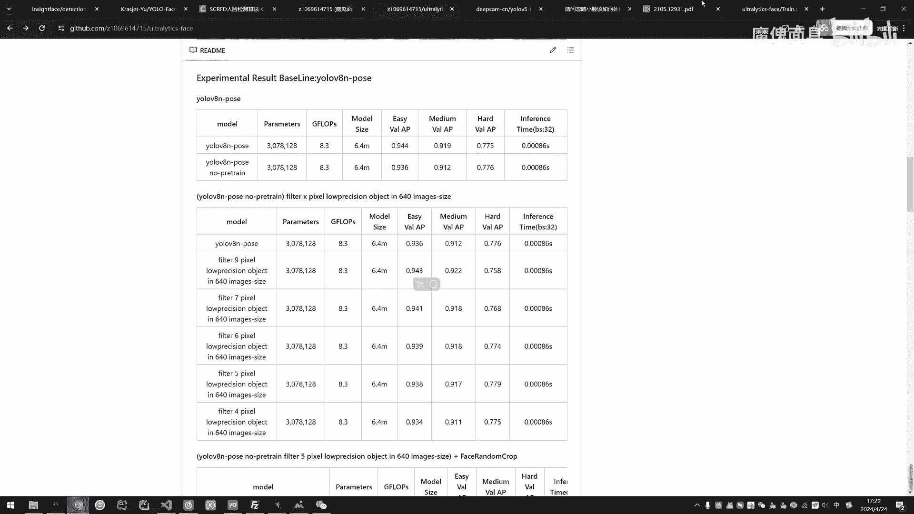

其实也是跟他这个实验结果比较符合的，那么我觉得我的操作应该是跟他的，应该相差无几，只是说啊可能是他这个模型是用了V5，只是模型上的话肯定是有不一样嘛，只是说他可能这个操作对于五，V5的作用会更大一些。

那么我们这里通过实验结果的话呢，我最终是取了这个这这一块结果，做后面继续后面的一些改进，因为我们这样子的话就是相当于是通过啊，只是单纯对数据数据集做处理，就能得到在验证集上的一个提点啊，虽然说不多啊。

虽然说不多，但是我们的改进是是，就是可能是涉涉及到很多方面的，这个技巧就成多了啊，每个方面你都要把它做的极致，那你现在这一块的话呢，我们的这easy跟hard的话都都有啊，0。20。3，然后这个是有0。

5的，所以说呢我后面的实验结果是基于这个去做。

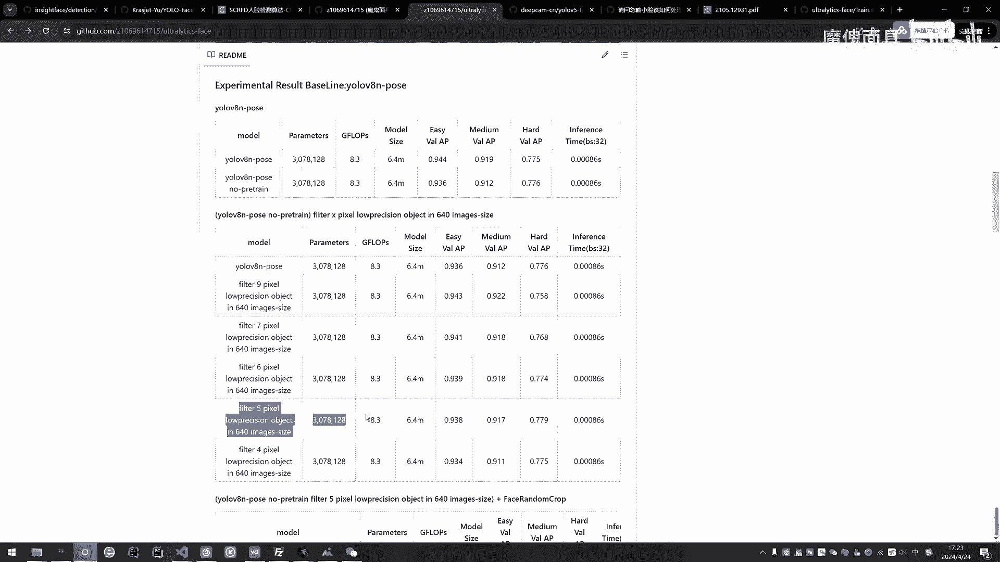

然后的话呢这里也参考了他的这一个啊，随机裁剪。

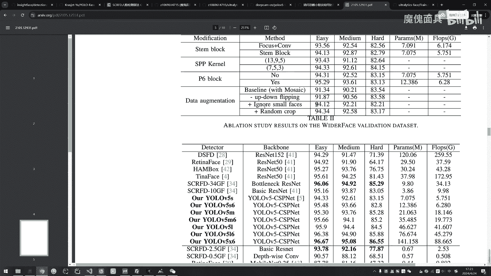

他意思应该就是比如说，这个是人脸啊，我个人感觉他是这个意思啊，就可能是这样遮挡住它吧，然后呢你的真实的话呢，以你的这个真实的话，那应该就是变成这样子，啊你真实的框呢，就是说你红色的是原本的你的人脸的框。

然后呢你可以加一个must在这里遮挡住，然后呢，然后呢，啊就是你要对这个遮挡后的这个boss去做调整，你的框应该就变成这样了，你就不能还是以红色这个框去做这个标签啊。

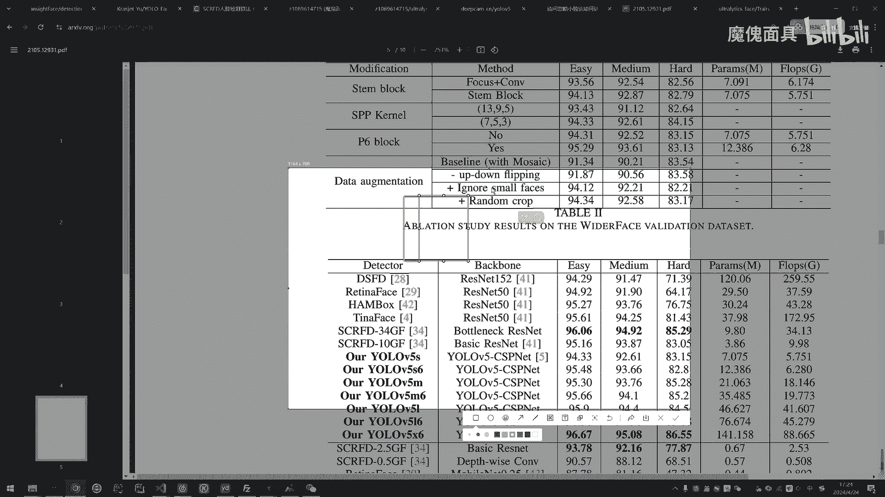

当然了，这个是在线数据增强啊，我是在代码里面也有的，有兴趣的可以自己去看一下，在数据增强的，那么我们的这个视频的重点是，讲一下这个实验的流程，这里就对代码就不细讲了，那么如果说大家有兴趣的话。

大家也可以多点赞，多投币啊，如果说后面哭声比较大的话，我都会出一期视频去再说一下啊，那么我们用的是在线数据增强，就不是说离线把它增强完的啊，因为离线的话它就把这个东西搞得太固定了。

而且离线的话又增加了很多图片啊，会导致你的这个训练的，这个实验的进度可能会非常缓慢，而且在线的话呢它随机性会更强一些啊，我是用上了这个结果啊，你看我这里的话，我这个标注是什么意思呢。

就是说啊这个base line的话呢就是loop train，然后呢再加上这一个，然后呢这里的话就是loop圈，再加上这个就作为我们的这个base line，所以说你可以看到这里的结果的话。

就是我的这一块结果了啊，然后再加上人脸的随机裁剪，那么对于人脸随机裁剪的话呢，呃不清楚是我这边实验做的太少了，还是说这个比例说的不对，还是说啊这个裁剪的这个方式不太不太对啊。

反正就是刚跟大家说的就是这么一个逻辑啊，这些post啊啥的，我都有做对应的过滤的好，那么这里我做了几个实验，发现也没有啊，没有一个起点全都是掉点，我就没有再做了啊，我就没有再去做了。

然后的话呢这边的话我之前也出过一期视频啊，我说了，如果说你对于那种小目标并且密集的话呢，TALL的那个top k是对他是有影响的啊，所以说呢我这边也做了一些实验啊。

这个top k等于三的时候是效果是比较不错的啊，当然了他这一个的话也会影响这个EZ middle，但是他对哈德的提点是非常大的，所以说呢差不多提了一个点，所以说呢我这边还是选用了它，还是选用了它啊。

所以说你可以看到下面这个实验啊，我们下面这些实验都是基于一个，接着一个去做的好，然后我这一步调的是标签分配策略，也是loss，我是先把这些东西都调好，我再去改这个结构。

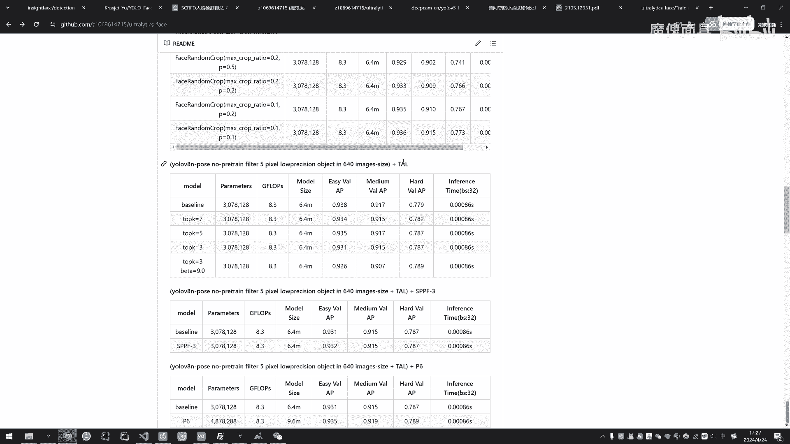

然后的话呢这里的话我也是参照了一下这个UV。

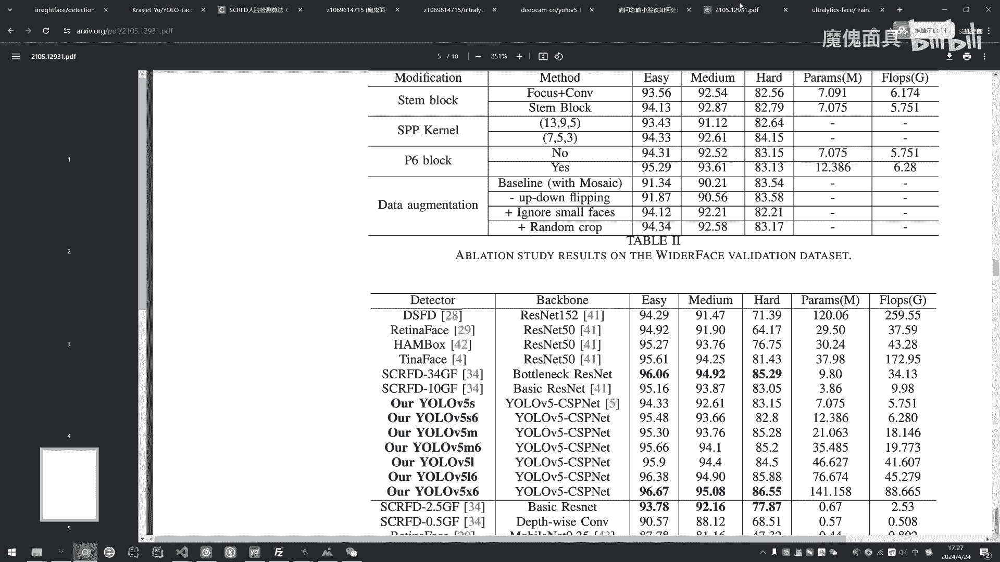

5face的一个思路啊，他说他其中就说到这个SPP这一块，应该是用更小的这个max puding的chemic color size啊。

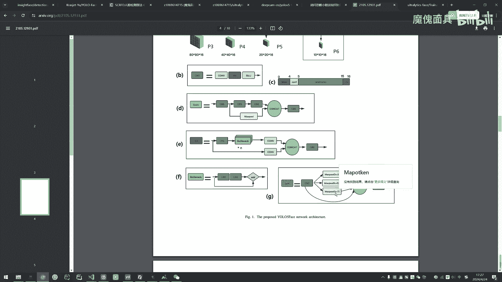

所以说我这边也做了一些变动，它原本这个size的话设为五的，我就设为三啊，然后的话呃我看啊这个的话就有点这个的话呢，重点就是他我看他基本上都持平了，基本上都持平了，所以说我就没有用它了啊。

基本上都持平了，所以说我就没有用它了，虽然说他这里提了0。1个点，但是呃意义不是特别大吧，所以说我就没有用它了啊，我这边就没有用它了，那么这里的话呢，我也看到了他这篇论文。

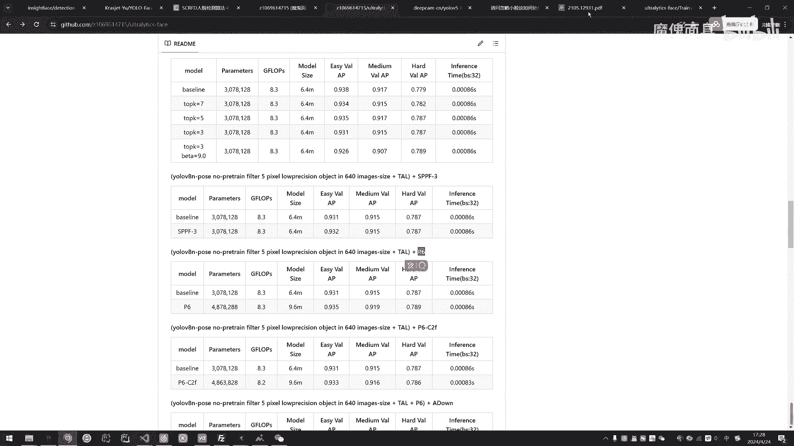

好像也加了这个P6层啊，我看到他就是对各方面有也有不错的这个提点。

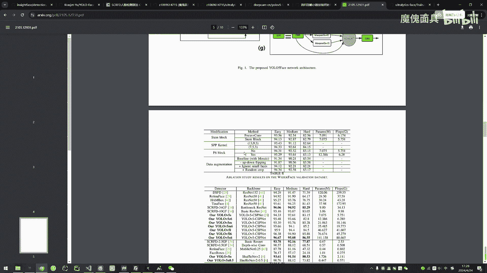

所以说我这边也尝试了这个P6层啊，那么P6层加起来确实啊都OK啊，而且我这边的推理时间，确实也是没有没有变化啊，没有变化啊，但是呢加了这个P6层所带来的最负面的影响，就是说它的参数参数量大的比较多。

参数量大的比较多，但是它计算量是没有变的啊，当然了，因为他加了这个P6的话，他是这也是入了V8里面的，那个自带的那个P6啊，他是不太一样的，他通道是有调整过的，所以说他才达到这个机器数量没有变化的。

这个情况啊，然后的话呢我最终也发现了他这个P6里面，他用的是C2，而不是cf，有兴趣的可以去看一下它对应的配置文件，所以说呢我这边也想做一下这个实验啊，究竟是这个cf啊，是是一个什么样的一个情况啊。

那么最终我们可以看到它结果就是这样啊，那么这样对比的话，其实就是P6的C2会好一点，所以说我是采用了它了，然后的话呢我是想到了，然后呢我也是这边也是参考了一下这个。

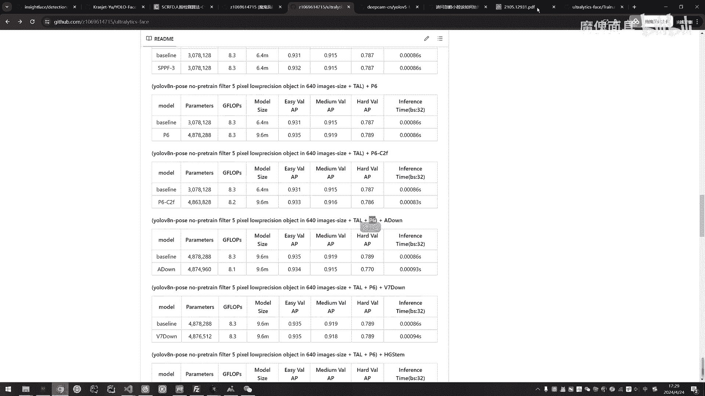

这个steam block啊，其实我觉得他这篇论文的话就是一个很呃，就是就像是一种啊，对模型的极致的优化的一个过程，就是每一个模块它都去做实验，所以说呢我这边的实验的的这个流程啊，都是参考它去改啊。

比如说他也改过这个，我也去尝试去用一些新的模块去改啊，那么他也就改了这一块啊，那么他改这一块的原因，我个人觉得应该是因为本身你的目标就小了，如果说你单纯通过两个卷积去做到四倍的一个，下采样的话呢。

可能会损失掉很多这个小目标的信息，我个人是这么想的。

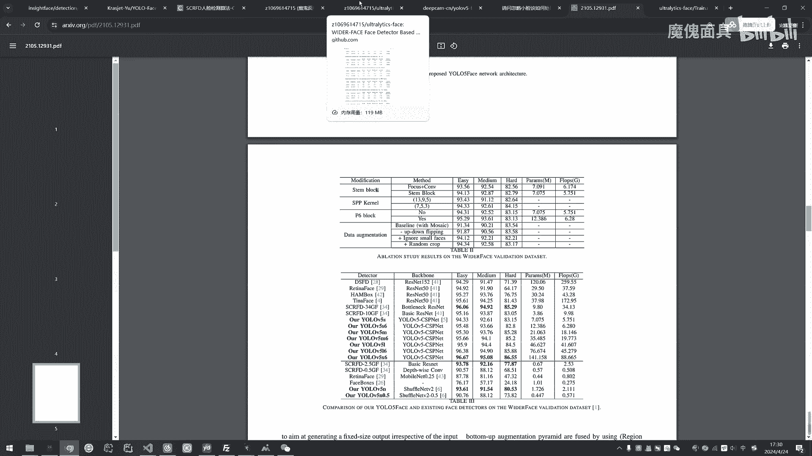

那么经过实验确实好像也是这么一个情况啊，我首先分别设置这个A档，A档的话就是U罗V9的那个A档嘛，这一个话就是1V7的那个下采样，那么这两个所给我带来的结果都不是特别好，特别是这个A档啊。

他对hard的话下降的太明显了啊，但是呢我用了这一个啊，H g net v2，就是RTDTR的那个主干的那个HGDM，它的这个提点是非常的明显，特别是对于这个cut啊，你可以看到就直接提的两个点啊。

每个都有提点啊，那带来的负面影响呢啊，参数量的话没什么变化啊，基因数量的话，这个的话也算是一个合理的增长范围，因为你提点毕竟这么多，但是时间上的话呢确实是提的就比较多了啊，你可能看起来并不是差别。

就可能看起来时间也不多啊，但是呢像相比原来的话，他已经假的这个百分比已经是比较多了啊，当然了最终他的这个结果比较好，所以说还是选用它了，然后呢D最后这一个实验的话呢，是用我们这个LSDD啊。

这个LSDDCD的话呢，就是我们的，这个UUV8项目二里面的一个改进，自研的一个改进啊，这也是印证了我的这个LCD，确实在对于对于这个单类别啊，小单类别或者说啊就两三类的这种情况下。

它的轻量化效果是非常的不错的啊，当然了，这个代码的话我也有这个post l s d d的话呢，我也是放在这里面的，有需要的你可以去看一看，然后的话呢这个参数量啊，你看参数量降了100万。

然后呢计算量的话啊，降到6。6啊，然后然后的话呢精度上基本上都没变化啊，前面这两个还多了一点点，时间上也有一点点的小将，然后的话呢，后面的话我就对这些点做了这些整合了啊，做了一些整合了。

好在这个基础上再加上这个LSCD，那么最终我们的结果是这样子，好在这里加上LC1之后呢，我们这个计算的话就可以回归正常了啊，然后这个参数量的话呢，也是跟之前的就差不多了啊，还多了80多万吧。

还多了个80多万，但是我们的这个精度上，呃我看一下啊，这个这个可能这里标错了，应该是标这个就这个贝斯奈啊，这个贝斯是他了啊，这个贝斯那应该是套了，这里的话写反了啊，然后的话我们可以对比一下。

你看我们这easy的话题啊，就是基本上没有变吧，这种都是没有变，那么hard的话只下降了0。3，就是完全是可以接受的，在这个参数量跟计算数量的变化的情况下，是完全可以接受的，推理时间也少了一点点。

然后的话呢这里的话呢，嗯我就开始对这个特征融合方面去做改进了，那么这里的话我选的是这个比较偏，因为我对这个项目，我的自己的要求是，他可以做到又比原来的啊更小，然后呢精度上的话。

还可以比之前的贝斯奈又高的这么一个要求，所以说呢我这里选了，选用的是我们啊这个BIF偏好啊，这里是没有改啊，就是可能有一些细节没有改，然后的话呢这个BI篇啊，这应该是BIF篇，然后假设BIP的话呢。

我们猜出来就有更大幅度的下降了啊，那么继续算的话也是小了一点啊，然后我们的精度上啊，就是在这个轻量化的情况下，没有弄错啊，我在我在这个轻量化的情况下，我们的精度还提点了。

那么时间上的话呢也是几乎相差无几，这种这种差异的话就几乎可以忽略不计啊，你像这种差异的话，那还是按百分比算的话还是挺大的啊，这是BIP啊，这是那个方面的改进，那么我个人一直都很看好REP的。

就是从参数化啊，我一个人一直都很看好REP的，因为它能给我带来，只是说他只能给我带来训练时候的，一个时间的增加，在重参数化后，它基本上就它就跟原模型一模一样了，所以说呢我这边就尝试了这个REP。

这REP的话是在，嗯是在这个CO上面的，好像是啊对，是在C2上面的，然后的话呢这边的话就做了几种呃，好像也有cf吧，这两个好像是cf啊，这两个是在C2上面的，那么具体的话可以看一下我这个训练的命令啊。

啊对C2CIEPEC2IP二啊，cf i e p e c f i e p2啊，那么具体的话你可以去看里面的代码，去去看改了什么，那如果说你想我也出一期视频的话，就点点赞投投币。

然后在评论区评评论就OK了，那么经过这一个的话呢，我们就选择了IP1了，就毋庸置疑了，肯定选择它了，那么它还能给我喝提了一点是吧，你看就慢慢这个T0。3那个肉体0。3，那个肉体0。3就变了一个点了。

因为我们这个东西的话，重点是，不是说一个模块，它能带来一个实质性的跳跃的啊，一般来说这种都是比较难，但是我们需要做的就是说怎么在合理的情况下，把你的这个模型一步一步的调优啊，是这么一个过程。

那你像有些看论文的，他加一个注意力机制都能提十个点的，这种就没什么好说的了，就那种那种东西看看就好，你具体还是以实际为准啊，就是你做过这种改进实验的话，就知道并不是那么容易啊，很多都是掉点的啊。

我自己比如说像这个cf的啊，我试了这几种啊，基本上都没什么好的接口啊，基本上都没有什么好的结果，你像这个FASTNET，虽然说轻量化效果还行，但是这个Q的进度我有点不是很能接受啊，毕竟这0。30。

3我都是很容很难的，才提回来的，你这么给我丢的话，我肯定是不能接受的啊，你像这种DWR啊，这个也是新的模块吗，也是我们项目二的，这些都是我们项目二的模块啊，但是呢当然了。

这个是不是说明我们的项目二模块是没用，只是说我们的这个每个数据集，它肯定是不一样的啊，适配肯定是不一样的，而且我考虑到了后面我要减值，所以说呢我这些模块我就不用那么复杂啊。

不过我们这个EMBCENPC的话，对于这一块的话，参数量还涨了，就没什么好说的，虽然说我们的结果停啊，结果没没没丢多少，但是的话轻量下跨的效果不大，最大就是这fast跟RBB。

这个就是RREPBIT的那个东西，那这个丢的也是有点夸张了哦，所以就都没考虑了，这边都没考虑了，然后这个的话也是参照这个uo face，V2的这一块，参照他的啊，那也是没什么变化，那我就没有用了啊。

然后这个是NWD啊，然后前面这个C的话就是那个常量啊，然后我看了FB2的话，他常量设为一，我也是跟着做了一下实验，也没什么好的结果，然后的话呢我根据看了一下，就是这个C的话，我设为640。

640情况下的那个平均目标的一个size啊，也没什么好的结果，就基本上没什么提点啊，我就没有继续做下去了啊，然后呢还有这个inner cl u in the cu的话呢，呃就出了1。2会好一点点。

但是这两个都掉了，才换了0。1，我就也也没考虑了，也没考虑了啊，然后还有这些XOU，就是就是IU的一些变种，LOUDIOUSLUMPDIOU啊，这一这里是打错了，也没什么特别好的结果，我也一一放弃了。

那么最终啊所以说你看啊，就是说我这些东西都是也是实验了啊，就对于我们这个模型是没有太大的一个帮助啊，我都一一的舍弃了，那么最终做到这的话呢啊我也就停了，就最终就再加一个减脂啊，因为考虑到这个项目啊。

这个减脂的话是我们的项目，我我就没有公开检测代码的话，我就去掉了啊，这个是没办法啊，那么前面的话都有啊，前面的话都有检测代码的话，我这边就没公开了，那么减脂的话呢，对于这个模型的话呢，它2。

0还是比较大的啊，因为一般来说我之前做的实验，2。0基本上都没问题，可能是因为改的太多了啊，这个模型的话啊，就是不太适宜在这么大的一个建制啊，那当然了，其实也有其他一些修修训练，或者说更多一些检验方法。

我就没有实验了，我就单纯的做一个AMP，那么最终的话我就选了这1。5，因为这1。5的话呢，第一它可以它可以压缩的很，压缩了200%分之75吧，应该是80%左右的一个参数量啊，就是你这个模型很小了。

已经计算量是5。0啊，你像这个模型的话，再做一下量化，量化到INT8的话呢，这个东西就只有几百K的大小了，然后的话精度上的话都有一定的损失，都有一定的损失，但是在它参数量压缩了这么多的情况下。

我最终还是接受了啊，然后时间的话也降到0。0011，你压到2。5的话，它更低了，但是这个的话就丢的有点夸张啊，就没有去采用了，那么所以说最终我们的结果，就是我们的ours的模型，就是说这个模型啊。

这一个模型就是最终我们这ours的模型，然后这base line的话呢，就是我们的这一块，那么如果大家有也有就是在做这个实验的话呢，也可以在我的基础上去改啥的都可以啊，自行发挥好，那么呃。

这一期视频就到这，那么这个代码的话也是官方语八代码，使用上的话都一样的啊，都一样的，可以自己去下载，去克隆使用一下数据集啥的，都给大家有提供的，那么这些模型的话都是可以直接去推理啊。

比如说你要用这个模型去做下游任务啊，比如说你要部署到嵌入式上的都可以啊，那么这期视频就到这里，如果大家觉得OK的话，也给这个视频多多点点赞，投个币也给我们的，也给我这个项目点点star。

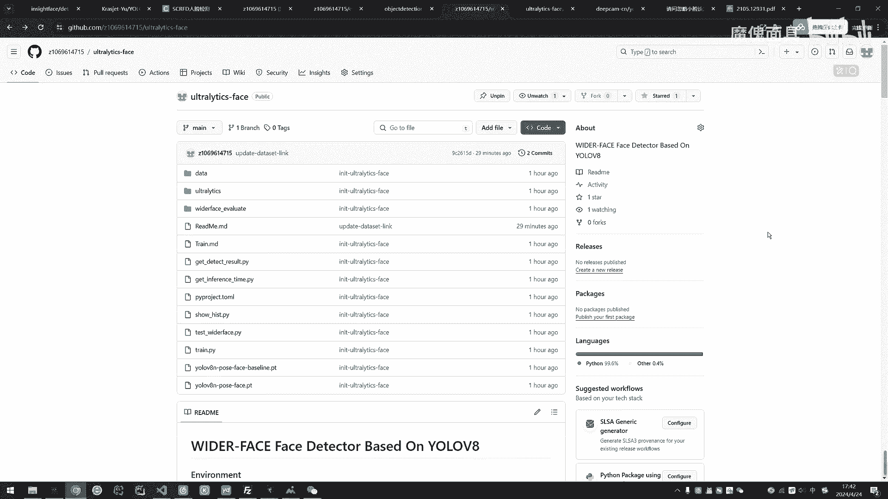