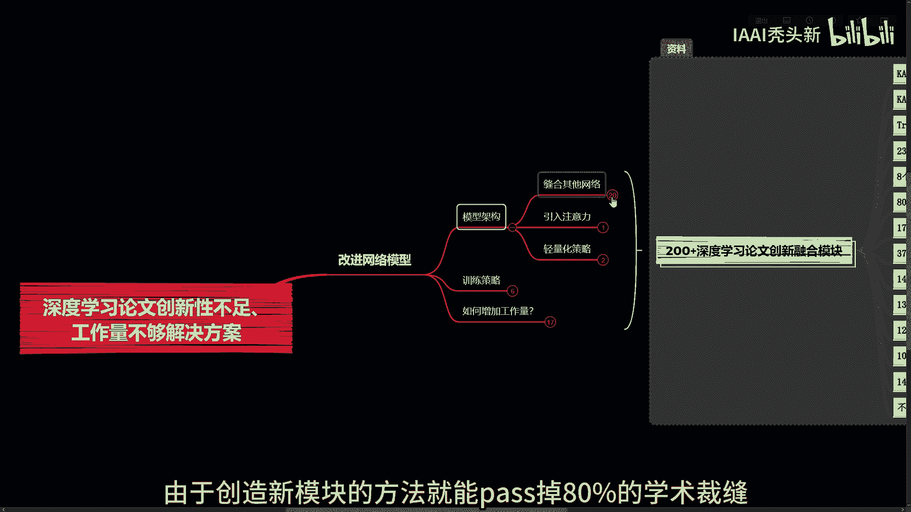
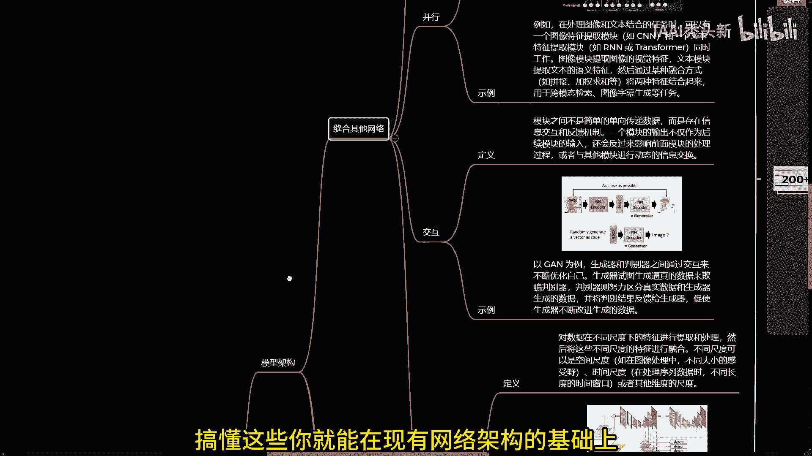
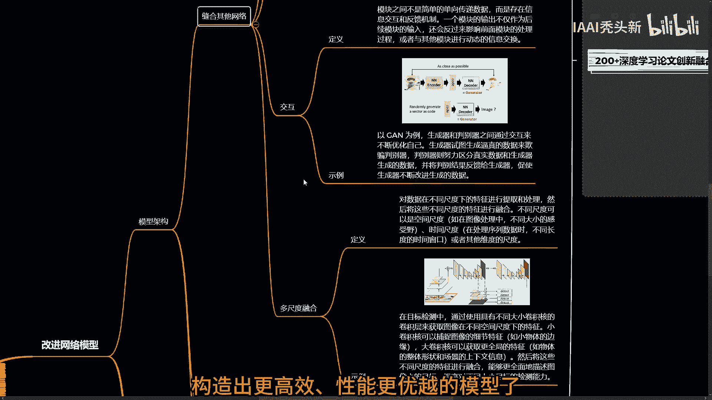
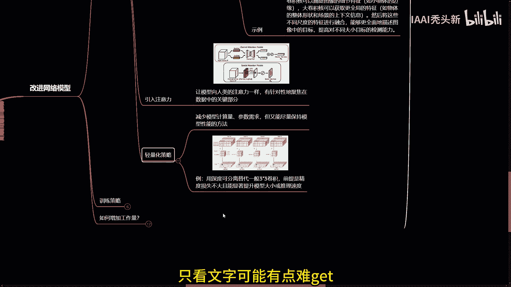
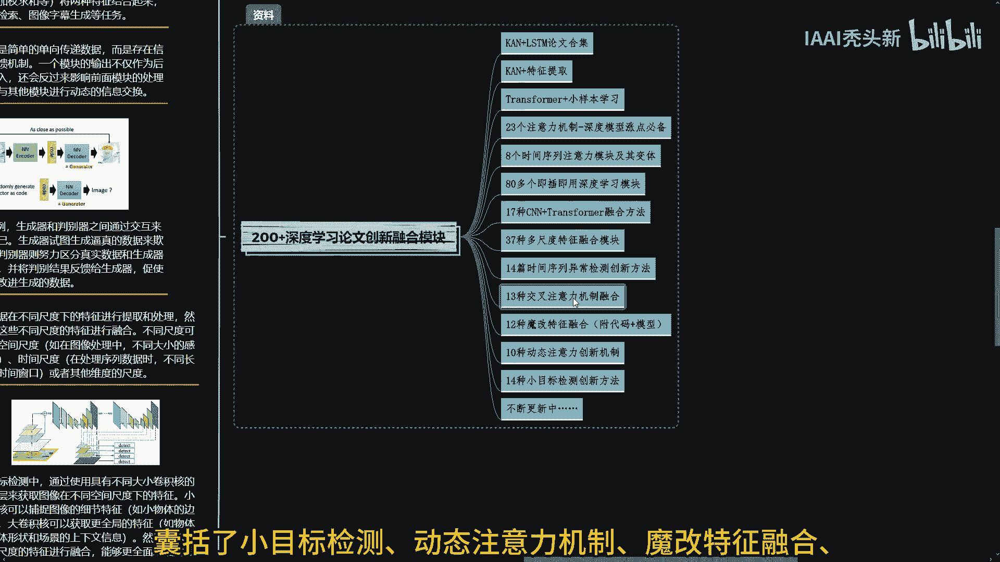
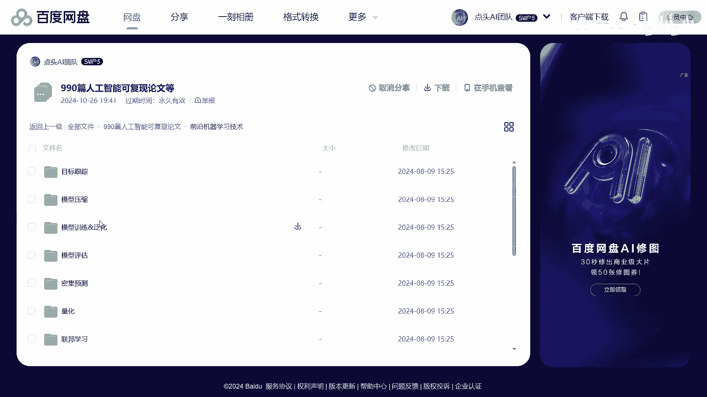
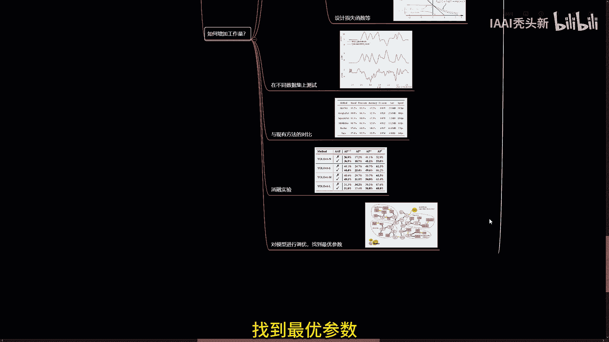

# 深度学习论文被评“创新性不足、工作量不够”怎么办？       -人工智能／深度学习／机器学习 - P1 - IAAI秃头新 - BV1qA14YREaR

在知乎上看到这样一个问题，深度学习硕士毕业论文工作量不够怎么办。

大家不要对创新性不足，工作量不够产生畏难情绪，其实只要掌握了改进网络模型的方法，就能巧用网络架构，设计新模型，达到一定工作量，如果你想学好搭积木，可以试试从模型架构和训练策略这两方面下手。

模型架构上的常见创新方法有缝合其他网络，引入注意力，轻量化等，由于创造新模块的方法，就能pass掉80%的学术裁缝。

我们就可以在缝合网络上着手，常见的有这四种方式，搞懂这些。

你就能在现有网络架构的基础上构造出更高效，性能更优越的模型了。

而引入注意力，通俗点解释就是让模型像人类的注意力一样，有针对性地聚焦在数据中的关键部分，这种聚焦关键信息的能力，有助于提高模型在复杂任务中的性能，轻量化策略则是减少模型计算量参数需求。

但又能尽量保持模型性能的方法，可以对网络架构重新设计或优化，如用深度可分离替代一般3×3卷积，前提是精度损失不大，且能显著提升模型大小或推理速度，只看文字可能有点难get。

大家可以搭配我准备好的200家论文，创新融合模块来理解，囊括了小目标检测。

动态注意力机制，魔改特征，融合时序异常检测等，即插即用代码模块都是精心挑选的，实用型融合模块，无需从头编写代码，就能快速搭建模型，还有这份精选优质人工智能可复现论文合集。

大家可以直接选择对应领域的论文阅读，这些论文都可以直接参考，而且全都有代码直接复现搞起。

从训练策略创新上来讲，可以通过优化训练策略来提升模型性能，这样也能增加创新性，我们可以选择多任务学习，添加辅助损失，多任务学习能同时学习多个相关任务，在训练过程中直接应用，比如CV方向，如果做的是检测。

就可以加个分割任务，用分割促检测，具体点就是将分割网络与检测网络共享，主干网络，让网络前面部分的参数提前得到有效训练，辅助损失可以作为正则画像，帮助模型在训练过程中保持稳定的梯度流。

就是同时迫使中间层学习有用的特征表示，比如深度监督，参考yellow f9相对yellow7的改进，创新性够了，接下来就是大家最关心的问题，如何增加工作量，既然设计出新的模型。

那现有方法的优缺点得了解吧，还有新模型的实现细节，比如选择合适的模块，确定模块之间的连接方式，设计损失函数等，再加上在不同数据集上的测试，与现有方法的对比，以及消融实验等，可以全面评估模型性能。

针对性地对模型进行优化和改进，另外还需要根据实验结果对模型参数进行调优，找到最优参数。

这个过程基本都要反复多次。

