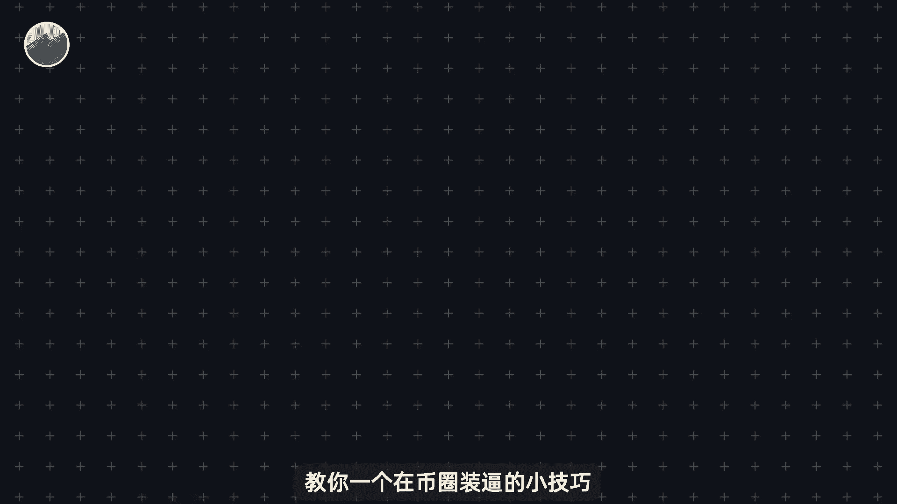
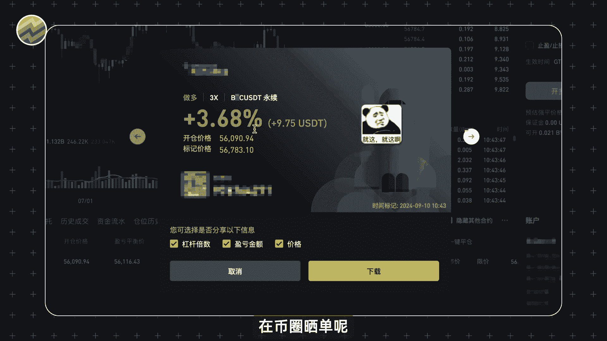
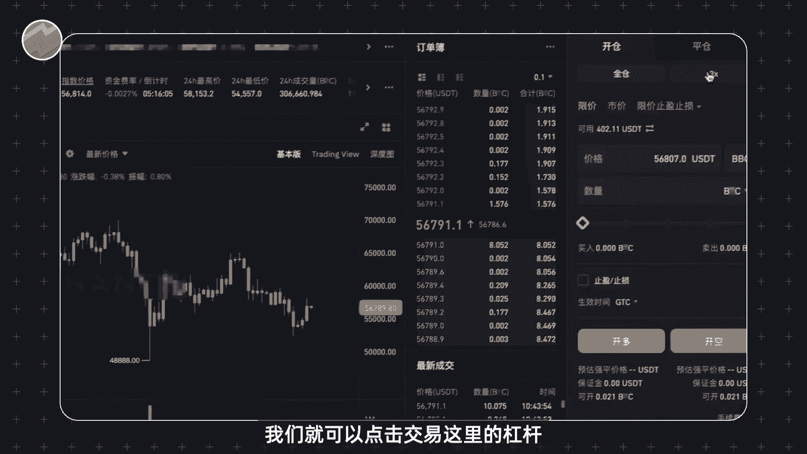
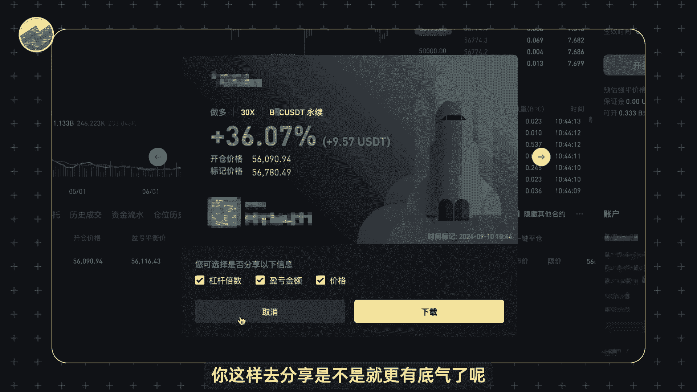
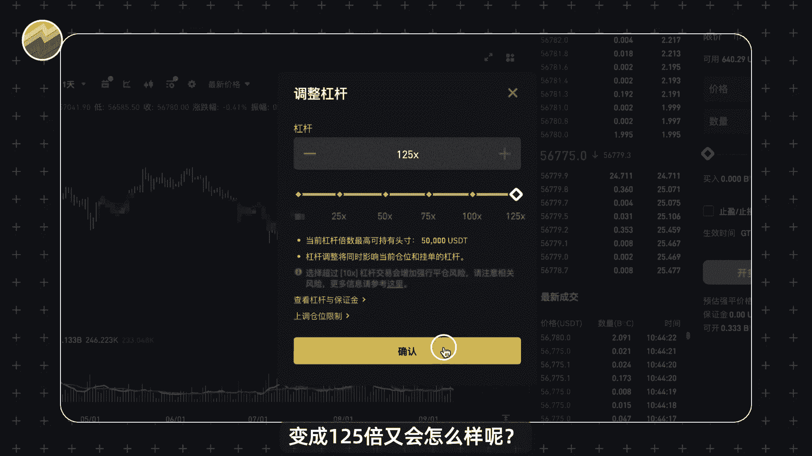
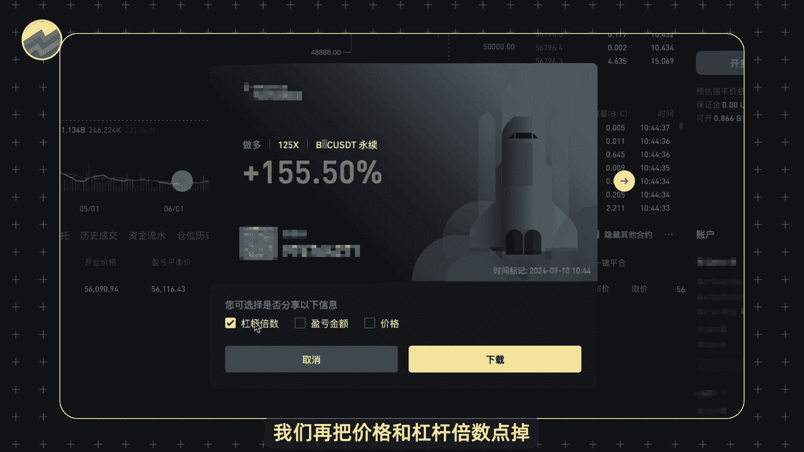
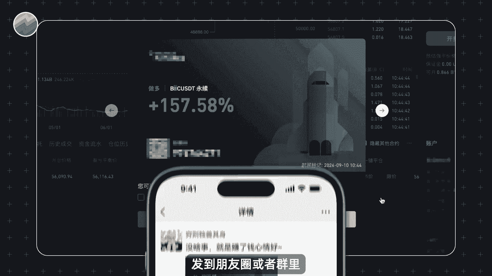
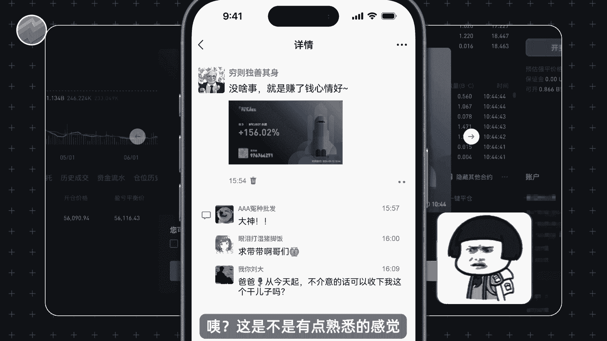
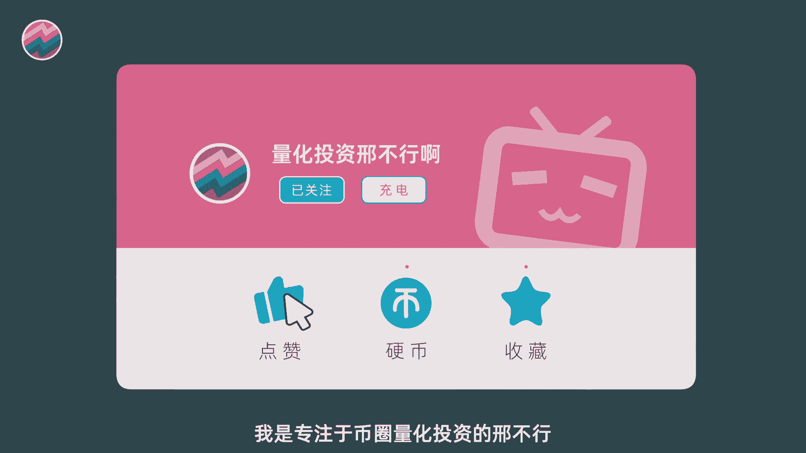

# 深度揭秘！币圈骗子是如何割韭菜的？好好的分享工具怎么就成了诈骗帮凶？ - P1 - 量化交易邢不行啊 - BV1dgmRYrEkX

教你一个在币圈装逼的小技巧。

学会之后，你也可以是别人眼里动不动就翻倍的大神，大家好。

我是专注于量化投资的，行不行，本期视频是我们币圈合约系列的第七期，前几期我们聊了一些币圈合约相关的基础知识，今天我们轻松一点，教大家一个善收益率的正确姿势。

打开交易所的合约交易界面，这里呢有一单我们提前交易好的大饼合约，这是一笔普通的做多合约，杠杆呢是三倍左右，显示的回报率呢是有3%点多，也就是这一笔交易它是赚钱的，点击这个分享图标呢。

我们就可以把这笔交易分享给别人，小小装一下，但是啊大家大家都知道在币圈晒单呢。

几个点的收益率根本就没人在意，我们就可以点点击交易这里的杠杆。

把杠杆倍数调成30倍，这个时候再去看我们这笔订单，神奇的事情就发生了，我们的收益率一下子变成了36，你这样去分享是不是就更有底气了呢。

那我们再尝试一下，把杠杆调到最高，变成125倍又会怎么样呢。

直接点击分享，看具体的收益率，一下子就变成了150多，这收益率谁见了，不说你是合约赌神，但肯定有人会说，你再是赌神，就赚个几块钱，谁看得起你啊，别着急，我们点掉这里的盈亏金额。

就没有人知道你是多少资金了，你说是1000万交易也有人信，当然啊装逼做全套嘛，我们再把价格和杠杆倍数点掉。

也就没有人知道你加了多少杠杆了，你就算对外说自己是交易天才，随随便便就赚了这么多。

也是会有人信的，这个时候你点击下载，把张图存下来以后，发到朋友圈或者群里。

这不得一大波人跑过来跟你说，大神带带弟弟好吗，咦这是不是有点熟悉的感觉。

你是不是见过某某大神就发过类似的收益图啊，当时看得你心潮澎湃，所以我真正想说的是什么，你懂了吗，好那么本期视频就到此结束，我是专注于币圈量化投资的。

行不行。