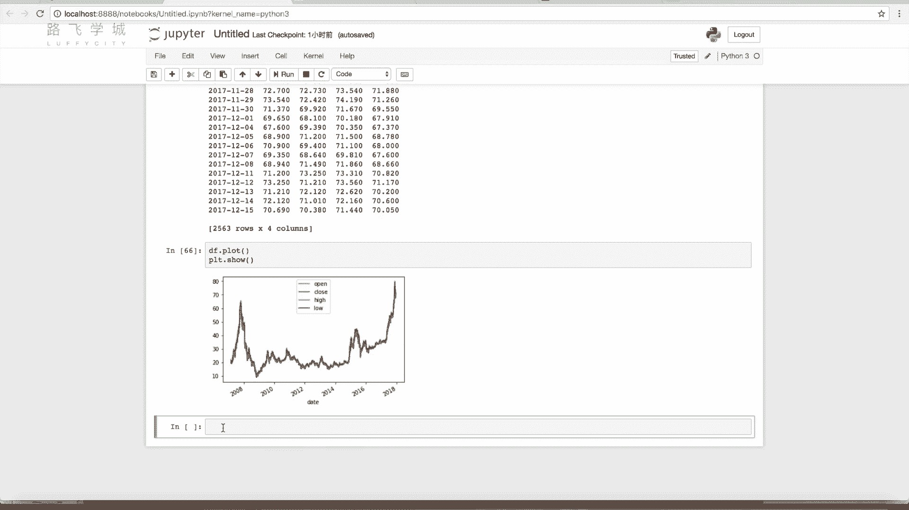
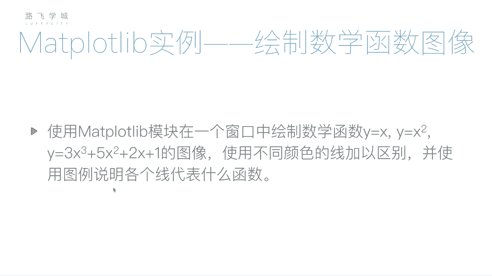

# 清华博士带你学习python金融量化投资分析与股票交易【附项目实战】 - P34：35pandas与Matplotlib - python大师姐 - BV1BYyDYbEmW

好同学们啊，刚才给大家介绍了我们POUD函数，一些周边对啊，一些乱七八糟的东西，那啊还差一点，我给大家补充一下是啥呢，就是我们的之前讲过的pandas库，跟matt plot库也有一些关系。

就比如说我们之前创建了一个data frame，我想把这个data frame输出出，输出成一个图啊，就比如说嗯，我们用一下我们之前的那个股票文件，好吧啊，601318，啊点CSV，好看一下它长啥样。

这个啊突变，比如说我们选这个啊，Pdates，还是说跟我们之前一样啊，把我们的这个date变成对象，然后把它设置成，我们的索引列，好然后我们比如说我们在选出，因为他这里边有一些字符串。

比如说是这个有一些啊，这好像没有字符串，有点六扣的，这应该是字符串，001380是字符串，然后这还有一个没有用的这个序列，所以我们不用它，我们就选出来，用我们的花式索引选出来几串，选出来几列就可以。

比如说我们就要这四个价格可以吧，Open close high，low啊，好选择四列，把它保存成一个data frame，好，那我说了，如果我想把这个data frame做成一个什么图标啊。

做成一个我们的直接plot出来，有没有好的方法呢，有啊，咱们plot直接DF我们的data加分，这个对象点plot，然后PLT点show，咱们可以看一下这个结果是啥，看到没有，对他很智能，直接就出来了。

你看但是为啥你能说这四条线，但是为啥看起来就一条线太数据量太多，对一不是因为这些价格，每一天的这几个价格都比较接近，我这四条线其实是每一天的开盘价，收盘价，最高价和最低价，你再跟这个波动起来。

你看这还是有一些不同颜色的，只不过你看他这个看的不够明显不够明显，没有办法，因为你本来数据就多，你这些线还都比较接近，那就是这样的，如果你想看的清晰一点呢，你可以把它设置成你的这个呃。

是就是就是到你的拍charm，或者到你命令行，它把它这个输出输出一个窗口，那个窗口是可以调的，对你可以那样搞啊，但是你这个他本来就比较接近的，也没办法嗯。

啊这是说哎你的data frame可以直接变成POUD啊，可以看到我们的索引列，就是索引列，现在是我们的这个date了，就是日期啊，这这个时间序列之前我们讲过日期，这个索引列直接变成了X轴的坐标啊。

而且他很智能的给你看看，08年一零年一二年，14年一六年一八年啊，纵轴是你的价格，就这四个价格汇写成四条线啊，这是个data frame，如果你是个series也可以，SIRI就一一列嘛。

一列的话你点cloud就是一条线啊，这是我们这个啊直接调用pandas库，跟MATLAB的一些关系，就是可以直接用data frame或者是series。

直接点plot来使用，嗯好那接下来啊我们给大家留了一些小作业啊。

大家可以试一下什么呢，绘制数学函数图像，数学函数这个应该是高中大家都接触过，初中高中初中Y等于X1条直线，Y等于X方那个抛物线抛物线，然后再来一个复杂的，给大家出了一个复杂的3X立方加五。

X方加2X加一，反正你用手势暂时画不出来，估计对不对，你这个两个你用手一想就知道是什么样的曲线，这个你肯定不知道啊，我让你什么呢，把这三个函数输入到一个窗口里啊，并且用不同颜色的线加以区别。

并且就是你要说每个线就是用图例啊，不是那个LEON的吗，嗯说一下每个线代表什么函数啊，这是个小作业，大家可以试着写一下啊，试着写一下这个作业，那写完的话看我们下一个视频给大家。

我们带着大家写一下啊，大家可以对比一下，你的想法跟我的想法有什么不一样好。