# 清华博士带你学习python金融量化投资分析与股票交易【附项目实战】 - P36：37matplotlib 画布与子图 - python大师姐 - BV1BYyDYbEmW

好同学们，那讲完刚才那个例子之后，接下来我们再看一个，就是不是贝塔函数啊，还是葡萄的函数，但是是一个一个另外的用法叫什么呢，就是一个画布和组合概念，这个概念啥意思，就是有的时候我们那个刚才看。

大家看的都是一个窗口里只有一个图。

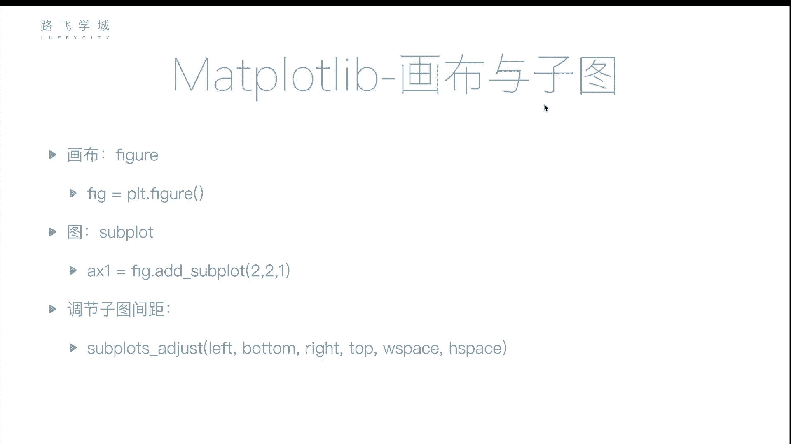

嗯对吧，你在这个比如说啊，你看不管是这个你在我们的notebook上看。

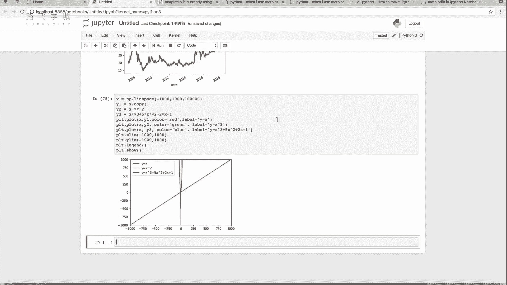

都是一个图，包括你比如说你到这来啊，你的PLT一个不管你执行几个PLOT啊，你可以执行，比如说这个，刚说刚才我说你可以在一个图上画好多线，对不对对，但是你只有一个图啊，你PLT点show。

你看一个窗口里只有一个图，但是有的时候我可能一个窗口里需要几个图，比如说买股票，大家可能都知道有这个你要画K线图，你可能我是上面想是什么呢，上面一个股票的K线图，对着下边有个大盘的图哦，两个图啊。

对两个图哎，那这个时候怎么来做呢。

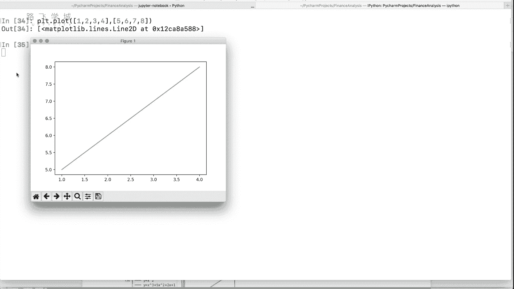

怎么再加一个对，怎么来做，就是我们今天要讲的这个画布和子图。

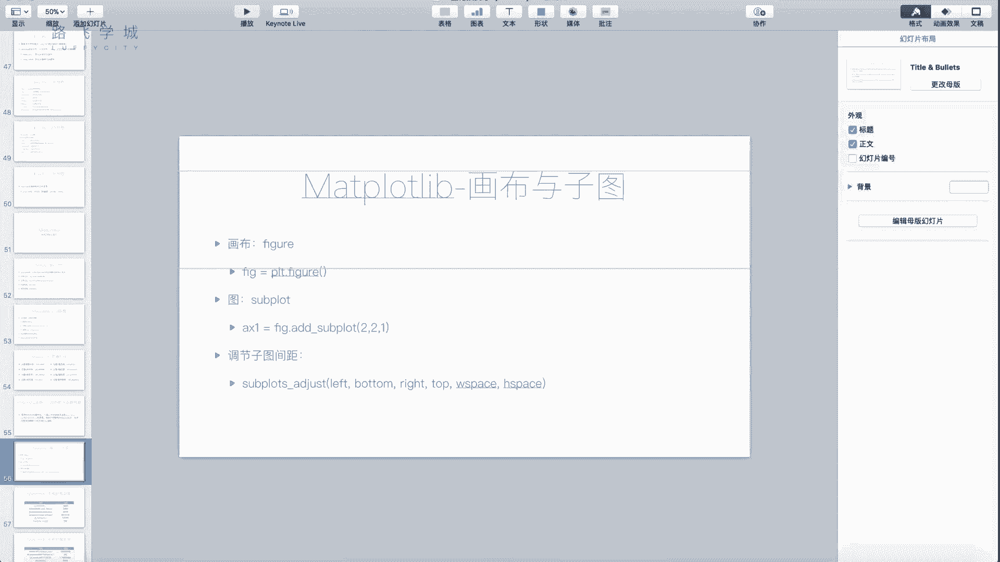

它有两个东西，一个叫画布啊，就是figure啊。

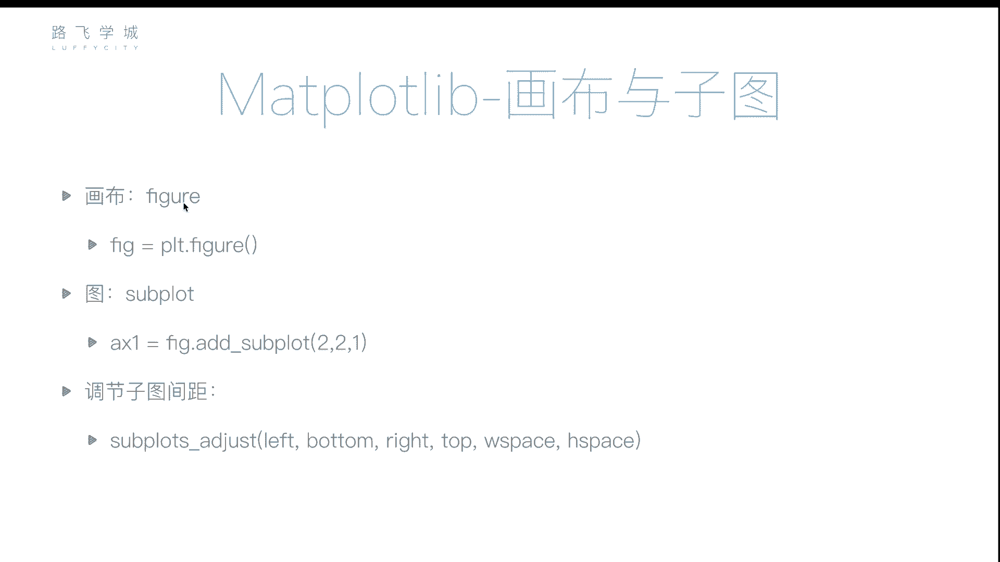

创建的方法就是先创建一个画布，对先创建一个画布，左右画布你可以理解它就是一个窗口，嗯啊等于PLT点figure，就可以嗯，然后子图你这个画布是一张布，对不对，你这个画布上有几个子图叫子图。

就叫sub plot啊，比如说我这就往那个画工上加一个组FIFIG，点ADD subplot参数怎么写，比如说看我啊，221，我先写完啊，这是加了一个子图，加了子图之后，这个子图你把它存起来叫ax1。

这就是什么，就是一个这个东西，就是一个框框起来，这个方向为这个字符哦，啊那你接下来比如说要plot了，你不要PLLT点plot了，你拿它点plot这个ASE，就是你加了这个子图之后啊，这个参数什么意思。

我一会再说，你加了这个子图，它返回这个子图对象啊，你接下来ax一点plot啊，比如说12345678，然后在售啊。

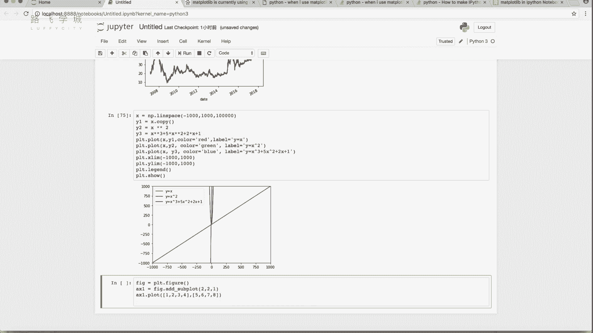

我们可以看一下，其实啊这个你要是如果是在拍charm上，或者是在这个这上面写的话。

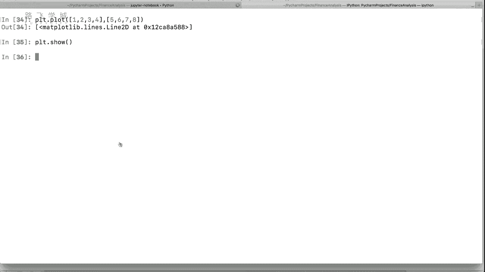

你是要pr c点收的，在这儿不用在这PLLT点show，反而会报错啊，应该是你要show的话，应该是fire点show，因为这是画布嘛，你要瘦就瘦，这个画布画布啊，或者PLT好像也行啊，我不确定哎。

反正好像也行，但是你能注意到这个图比这图小啊，能放大吗对吧，为啥放大的话，这个上面不能用，是inline模式，你要放大的话，你可以到这来啊，你想放大。

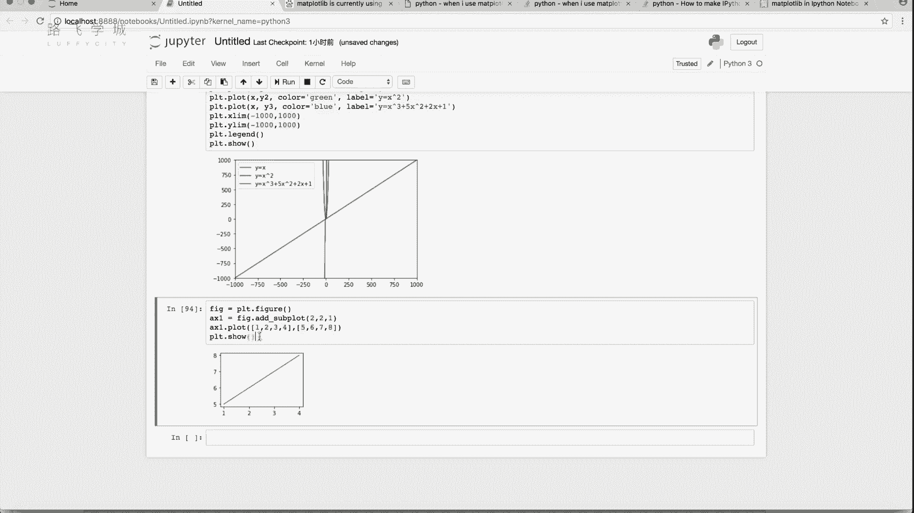

你可以比如说把这个粘过来，这个上面你看他还是你看没有占满，对不对，这个你是可以放的，但是这个图里放大啊，这图里放大，那为啥没有占满，这个时候我就要来说一下这个参数，这个2R1是啥意思。

二二就是把这个figure，把这个画布分成两行两列，一就是占第一个位置，你看这是不是你看我们这儿画一条线，这画一条线是不是把它分成了四个部分，它占第一个分啊，那比如说我再写一个这个啊。

ax2等于figure点，Add sub two plot，这是我写222表示啥两行两列，第二个图对啊，当然这个这个第一个图我也得重新调一下，不然的话因为执行show之后，这个ISE没有了啊。

然后然后这个X2啊，这个时候比如说我们在，但是你这figure点时就可以，其实是不是俩图了，因为第二个图形AX2我没有执行点plot，所以是个空的，对不对，你看第一个AXC还在这，对不对，这就俩图了。

当然你要再写一个X3等于什么223，这个图就到这来了啊，224到这了，这是你要是说刚才像我说的那个上面是一个，你想想它上面是一个K线图，下面是一个另一个图，你就怎么着让它等于三吗，你这怎么传。

你那样的话还是你的你的你的figure啊，等于PLT点，figure啊，A x e，你觉得应该怎么写，Fire i su，几行几列是不是两行几列，对不211ax2等于fig点，Add subplot。

什么212啊，两行一列，第二个图啊，这个时候你再fake点show啊，你你应该是去ax一点close ax2点PLO两个，但是我们不放，你看上面一个下面一个啊，哦对对，就是这样啊。

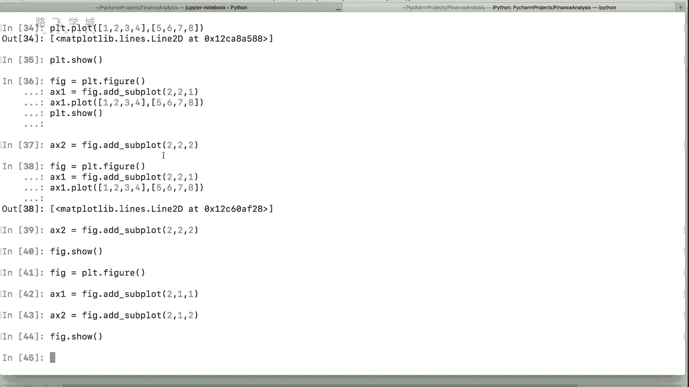

这是我们说的这个啊画布与子图的概念啊，一个figure，一个点alex plot传出来是一个子图的对象，然后你再去它点plot，嗯啊当然还有这还有一个函数啊，Sapd adjust，这是啥呢。

就是你的两个图画出来，这两个图不是有间距吗。

比如说你看这我这是左的话，比如说再加一个，我再加一个，如果加一个右边图的话，两个图之间有间距，对不对，你这个函数啊就是调节它的间距。

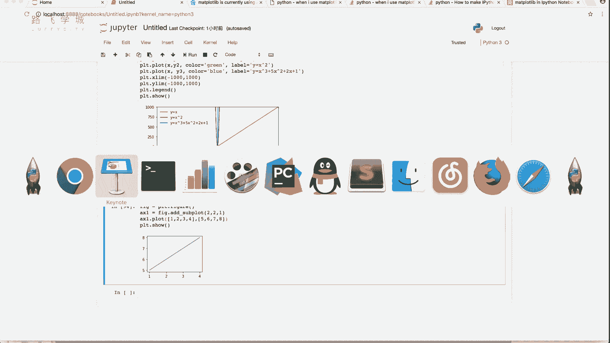

这几个参数，left左左边有多少空，bottom下边右边上边w space这个W是呃Y的，这宽度它占多少地方啊，h space是它占多高，这个是你就是ax一点，supd just as就可啊。

这我就不演示了，就是你说前两个图离得远一点，其实一般情况下好像默认就可以了，它会自动给你留一些空间好。

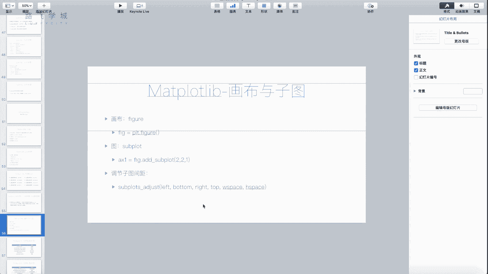

这是我们说的，就是如何在一个画布上，或者一个窗口里画好多个图，不是说在一个图里画出好多条线了啊，是画好多个图，画好多个框好，这是我们这个讲的画图和字符好，最大的就是也是用的最多的。

包括你说我们说用股票啊，之前我们演示的那四个线，当然四个线围在一起可以画一个线嗯，你可以就是选出来一列就是close，可以拿到画一个曲线啊，这个线其实很常用的，也是这个在我们的金融分析里最常用的一个线。

就是你画折线图嘛，其实就是一个趋势图，对趋势啊，这是常用的，那接下来它还支持一些其他的图，那其他的图我们接下来给大家介绍一下啊，下面一个视频给大家介绍一下。

