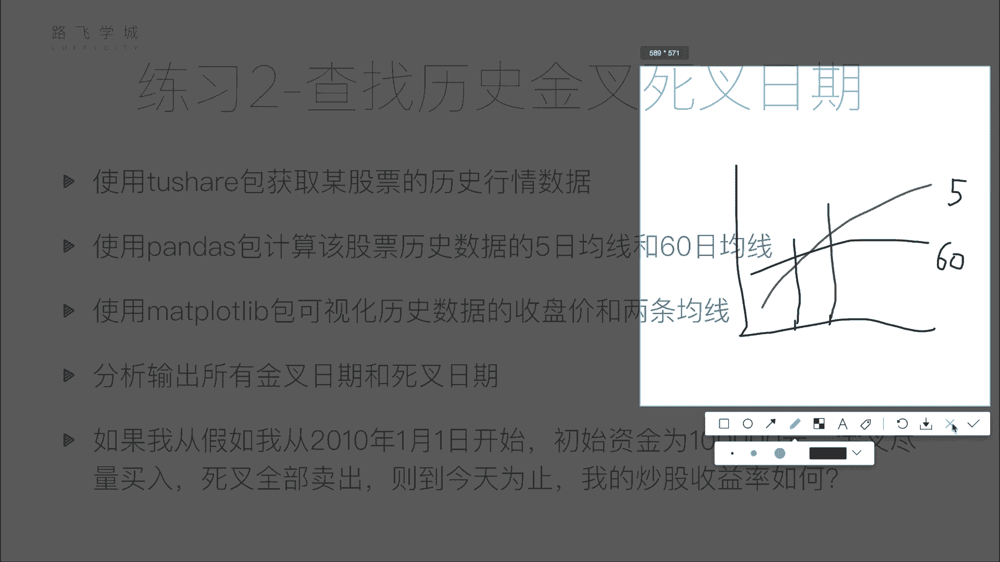

# 清华博士带你学习python金融量化投资分析与股票交易【附项目实战】 - P42：43双均线分析作业说明 - python大师姐 - BV1BYyDYbEmW

好同学们，那刚才我们讲了一个练习题，对还是有一点挑战性，对啊，没有关系啊，你这一步好像写不到我那种程度，不理解我那种程度的话，大家可以试着用循环写啊，不管怎么着，用循环写永远是一种解决方式。

虽然他可能慢一些，是写代码写起来慢一些啊，执行起来可能也会慢一些，但是没有关系啊，你能写出来就是好的，那你比如说刚才我再说一下刚才那个题啊，你这个问题你完全可以说这个拿循环写。

就把你那个data frame，把那个data frame拿下来，一行一行遍历，怎么判断是不是每个月第一个交易日呢，你把这个月的交这个交易日跟上一个交易日比，如果他们俩月份不一样。

那是不是就是第一个交易日是啊，那怎么判断这是不是一年最后一个交易日呢，你把这个交易日跟下一个交易日比，如果他年份不一样，他是不是每年都会交日对模拟嘛对吧，如果是第一个交易日，你就买入，然后算一下钱。

算记一下钱有多少钱，记一下你这个这个有多少只股票啊，然后最后算出一样的好，我们来看第二个啊，第二个就是，我们就不是随便搞一个乱七八糟的策略了，我们之前搞一个乱七八糟的策略，还赚钱了，摊上股票好了。

没有没有办法啊，我们来找一个正经的策略，啥呢，叫做双居印策略啊，重新策略，后边我们说用策略平台的时候，我们也会讲，在这里我们先讲一下，之前给大家讲了均线的策略了啊，对于每个交易日算出来前N天的平均值。

移动平均值，那把这些平均值连起来就是成为一条线，就叫做N日的移动平均线，什么意思，比如说啊给大家看一下，这里有，好我们可以看一下这个图啊，这是日K的图，这个每一根这个这个蜡烛状的，就是K线应该都好看。

对不对，那这三根线就纯的线是啥呢，看这写到了ma5，ma10ma20啊，这就是叫做5日均线，10日均线，20日均线啊，什么是5日均线，比如说看啊，这一天是哪天，22号。

11月22号的5日均线怎么算出来的呢，是22号20，这个21号，20号，17号16号，因为有两个周日是周末，这五天的收盘价求平均啊，其实用收盘价或者用开盘价都可以，应该是用收盘价。

我印就是用收盘价也可以，或者你也可以用开盘价，就是这五天的价格求一个平均值差的，然后这一天的ma5怎么算呢，就是这一天再往前加上前边四根，就这五根线的收盘价或者开盘价求平均啊，这是它的移动平均值。

那你把这个移动平均值连起来，就是N日的均线啊，常用的均线有五天，十天，30天，60天，120天和240天啊，其中五天和日时间我们叫做短线，就是你说短期操作就是看看短线啊，他也叫做叫日均线指标。

其实我也不知道这个30天和60天是中线，就是稍微重一点，可能一个月两个月这种啊，这都季均线指标，120天和240天是长期均线，这个年均线指标，我们可以想到均线有个什么性质啊。

就是说他这个均线如果越长的话，它是波动的会越慢，不怎么会不那么剧烈，你比如说我让个240天的均线，你可能比如说前239天都是平的，都是五块钱嗯，稳定五块钱，今天突然涨到十块钱。

那你说5日均线和240日均线哪个涨的快，哪个长得快，5日的肯定是5日的呗，因为5日是五，是五，四个5+1个十括起来除以五，240天是239个五，加上一个十块钱收入，所以它影响的少。

因为他前面有好多都是平的，都是都是平的，就是好多压着它，所以短期均线相当于长期均线，它跳跃的比较幅度比较大，也比较敏感啊，那比如说我们看这张图啊，我看这张图可以看到永远是你看这个起涨起来。

你看这不大涨了吗，涨起来的话永远是什么，永远是这个短期均线涨得最快，长均线涨的最慢好，那根据这个我们可以有一个策略，叫什么策略呢，叫做双均线策略，所谓双均线策略就是金叉和死叉两个概念啊。

金叉就是短期均线上穿长期均线，这是一个买入信号，就是金叉买入，什么叫短期均线上穿长期均线，比如说大家看这个图可能不太明显啊，我们看到这个位置，比如说我们看两根均线啊，看5日均线和10日均线，OK吧。

看这个位置，这个位置5日均线是不是比10日均线低，5日均线在十均线下边，对不对好，那这可能看不太清楚，到这的话，5日均线是不是比十均线高了，对不对，这叫做短期均线上穿，长期均线就是往上穿过去。

从下往上穿过去，这个点叫做金叉，就是如果有一个交叉点的话，叫做金叉，那短期均线下穿长均线叫做死叉，比如看这个点，看这个点啊，这是不是短期均线5日均线比10日均线要高，这是不是5日均线比十均线要低。

对不对，所以这叫短期均线下穿，长期均线下穿叫做死叉，什么意思，将短差啊，短短差金叉是一个买入信号，死叉是一个卖出信号啊，你也可以看到这个金叉，确实你看金叉之后马上涨，死叉之后这叫跌，对不对。

但是人们说这个其实这个双均线策略，其实我们后面也会说双建策略，不就是没有说特别大家可能一看，刚开始看会觉得啊这个东西不特好吧，我有这个策略，我是不是就可以炒股稳赚了，其实不一定啊。

说面向策略有一个他有一个滞后性，它并不是你看这个位置，他这个死叉并不是说一开始跌，你就判断出来了，就你可能跌了两天之后，他这是死叉了啊，你接着跌，然后你就是这种。

那你有可能就是说金扎和刺茶有可能在半山腰，就在这位，对你有可能是接下来它又涨回去了，咱不知道你这个位置它会涨还是跌，没法判断好，所以但是这是一个策略啊，就是金叉是短期均线上穿，长期均线是一个买入的信号。

死叉叫做短期均线下穿，长期均线是一个卖出的信号，好啊没有关系，我们后边还会更具体的说这个双均线策略，那在这我们就是用这个双曲线色来做一个题啊，什么呢，还是一样，to share包获取一个历史行情数据啊。

用pandas包想办法计算一下，5日均线和60日均线啊，六十三十就是一个短期，一个长期，就是我们选择两根均线了，一般就是你要么是一个短线，一个中线，要么是一个中线，一个长线，这种这样来选啊。

当然你也可以选5日和10日，随便5日和60日均线好，接下来用MACOLAB包画出收盘价和两条均线，画出收盘价回两条均线，就是三根线，一根是收盘价的线，两这一根是5日均线的线，一根是6日均线线。

画出来看一下这这个均线，这个均线的走势，然后想办法输出所有的金叉时间和死差，时间差啊，金叉是什么时候，死叉，什么时候嗯，那在这之前你是不是应该要算先算移动平均线，就是在这儿，这这这之后要算移动平均线。

然后划线，然后再根据两根移动平均线判断它们的大小啊，怎么判断谁是金叉，谁是死叉呢，怎么判断呢，怎么判断的。

我也画一下啊，比如说这是一根线，换一个颜色，再换一个，这是另一根线，好比如说，比如说我这是ma5对吧，这是60，那这个位置是什么，经常还是死，Str m i5，就这个点对这个点是经常还是死，这，金叉呀。

对呀，你犹豫什么啊，这不是短期均线上穿长一线要涨的信号啊，金叉是好的嘛，要涨的吧，你看这个短期也涨得快，所以肯定要涨啊，这个叫这个金叉，那金差怎么算啊，你看到的这应该是一个焦点，对不对。

但是实际中我们说啊，实际中你这是比如说是一个图，你是一个坐标坐标系，这是Y轴这个X轴，那你这个坐标可能是画的不太直了，有两个位置，那这可能是前一天，这可能是后一天，OK吧，嗯你可能是这样。

前一天的价格前一天是这样的，前一天是这根线，后一天是这这个没有这个完结，前一天是什么5日均线，5日的均值小于60日的均值大于60，小于60日均值，后一天是5日均线的值，大于60日均线的值。

那如果说前后两天这个大小关系不一样，这个肯定就是一个X对的嗯，如果刚开始5日均线的值要小，后来5日均线的值大，这个就是金叉，反过来，如果说如果这个是如果这个是5日的话，如果刚开始5日的比60日的大。

后来的65日比6日小，那是四拍的，所以怎么判断呢，大家可以写循环循环且循环啊是一种写法，写循环，你判断今天的5日均线和6日均线的大小关系，如果跟后一天，5日均线和60日均线大小关系不一样。

那这就是个差嗯，对不对，你把这个日期加进来就可以了啊，那有没有不用写循环的话呢，有大家看看能不能想到啊，不能想到没有关系，我们后面会讲给大家讲啊，怎么不用均线来做写循环，不用写循环来做啊。

不用写循环来做好，这是说输出所有的金叉日期和死叉日期期，那最后还有疑问啊。

也是模拟一个策略，假如我从我这多写了一个，假如我从10年1月1号开始，刚开始有10万块钱嗯。

啊之前前一个例子是我有的是钱，一般买一手，有的是钱，但我这现在就规定我就10万块钱炒股啊，金叉我尽量买入，什么意思，就是能买多少买多少，但是大家注意啊，买入的时候只能一买买一股，买一手金叉。

这对你不是金叉，就是你不跟金叉没有关系，你买股票的时候，一买必须买手的单位，就是买一手或者买二手或者买三手，一手就是100股啊，你不能买105股，150股不行，100股，200股，300股，这样买啊。

死叉全部卖出，所以你结果就是10万块钱，肯定是金叉和死叉是交替出现的，对不对，一个金叉后边跟后边肯定是一个死叉，死叉后边是个金差，不可能两个金叉没有，这两个金差不可能出现。

对你像金叉5日均线已经在上边了，金叉之后，那你接下来要是一直在上面就没有差，下一个差肯定是下去了，5日均线，所以应该是那个时候肯定是金叉和死叉交替的，所以你就是买入卖出，买入卖出买入卖出。

那到今天我的炒股收益率如何啊，赚了多少钱，是赚了还是赔了啊，还是算这个啊，这道题大家可以思考一下啊。