# 清华博士带你学习python金融量化投资分析与股票交易【附项目实战】 - P45：47 第一个量化策略-1 - python大师姐 - BV1BYyDYbEmW

好同学们，那接下来我们在这个平台上写一个简单的，第一个量化策略啊，主要目的是为了带领大家，就是认识一下这个平台，熟悉一下平台的这些函数，这些API怎么用啊，当然我们这个策略很简单啊。

首先设置股票池为沪深300的所有成份股，这句话啥意思，沪深300是啥，上海深圳对，就是我们之前讲过，我们是不是说有大盘，有指数，大盘其实就是一个指数啊，比如说我们说之前有讲过有我们的这个啊，深成果哎。

深成指方位，深成指和上证等等等等啊，比如说深成指，它指的就是深圳交易所的所有股票的一个指数，其实就相当于这个盘子里面，盛的是深圳所有股票，深圳这个交易所所有股票，那除此之外还有各种各样的指数。

比如说每一个行业它只有一个指数啊，你可以按照行业对这些股票进行分类哦，那我们这说的沪深300是什么呢，沪深300指的是从上海和深圳选出来，这两个交易所，一共选出来有代表性的300只股票哦。

300对相当于就是我这个东，就是这300只股票，能够就是他用于某种策略选出来这300只股票，能够代表整个的A股，但是我就用这300只股票，不是所有的股票都来算，那这300股股票。

就是我的这个沪深300的成份股，那沪深300本身也是一个指数，就是它本身也是像大盘一样，有一个什么几千点的指数，这个指数会涨回跌，叫股指啊，但是这个不重要，你就知道这个里边是有300只股票的。

那我们选择什么呢，我们就操作就看这300只股票，OK吧，就看这300只股票可能买其中一只，可能买其中有几只，明白吗，不是只看一只股票了，明白啊，那当然其实这个沪深300这个东西，就是它是会随时间变化的。

可能今年实际上这只股票明年可能有五只，有十只股票淘汰了，又来了新的实时物嘛，对就这个东西会不是固定的，它可能会变化，好好这个是说股票池，我们选择沪深300的所有成分股啊，就是这300只股票。

那策略是什么呢，如果当前的股价就是这只股票，300只股票里有一只股价小于十块钱，并且不持仓，不持仓债，就是我现在没有这只股票就买对，我就买进来，就是现说明什么，我现在股价便宜就十块钱吧。

小小小这个相当于是这个价格比较低，然后我就买进来好，如果当前的股价比买入的时候，涨了25%，我就叫清仓止盈是啥意思，慢前半句好理解，比如说我十块钱买进来的，可以吧，涨了涨了25%，涨了多少12块五。

比如说现在今天价格是十二十三块钱，那我就把这只价格把这只股票卖了，全都卖出去，全都卖出去叫清仓啊，止盈是啥，就是我卖出去是为了赚钱，我之前跟大家说过，这止盈止损吧，就是我觉得它接下来涨了25%了。

接下来可能不会再涨，有因就25%，这停掉嗯啊就只卖出去止盈啊，另外如果当前的股价比买入的时候，下跌了10%，我清仓止损，就是减少损失是啥意思呢，如果说我十块钱卖你买进来的。

它现在价格比如说跌跌到九块钱了，这都八块九了，八块五了，那我就买止损啊，就这么简单，那个策略策略非常简单啊，那但是接下来我们就带着大家啊，这个一步一步的来哎写一下。

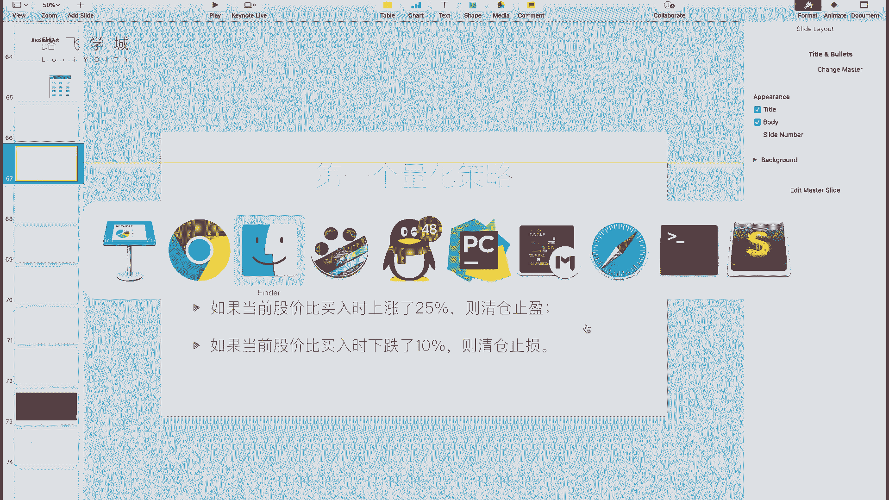

一步一步的来写一下这个东西啊，首先我们把它自动生成的代码给清空，我会就是啊尽量详细的给大家介绍一下，这个框架怎么用，如果大家想更加详细了解，可以看这有的帮助。

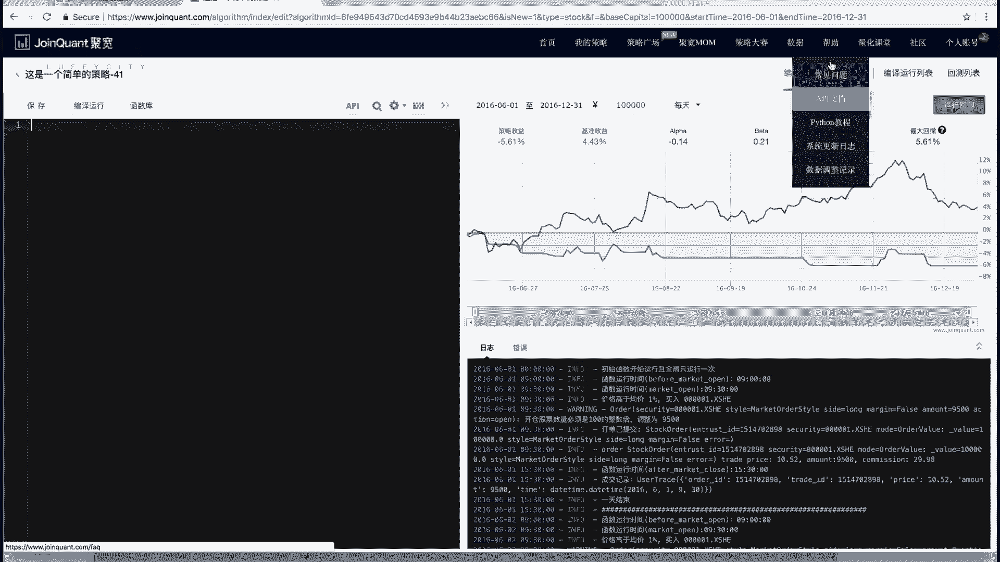

AAPI文档啊，这个文档是中文的，嗯啊就是说会说的比较详细。

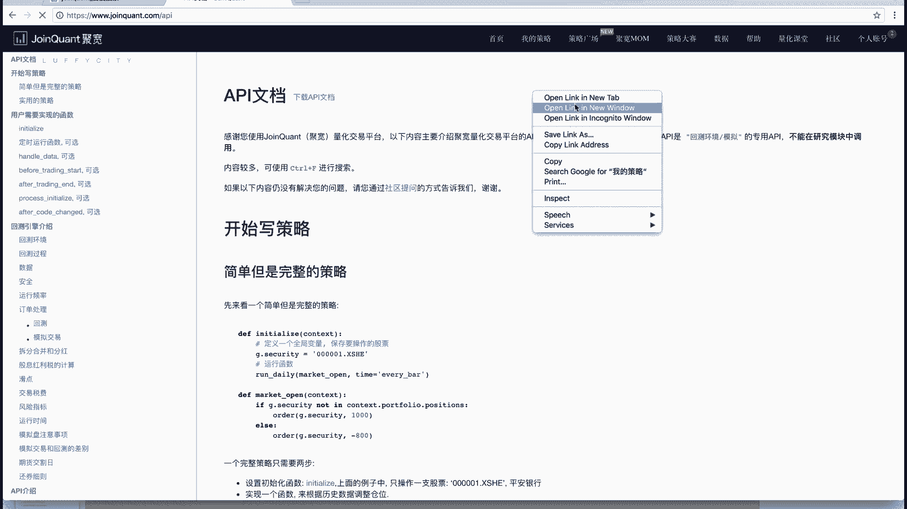

会说的比较详细好，那我们首先说我们不是说这个框架有两部分吗，也就是说基本来说你在这个框架里写两个函数，第一个函数应该是来我们看他之前那个代码啊。

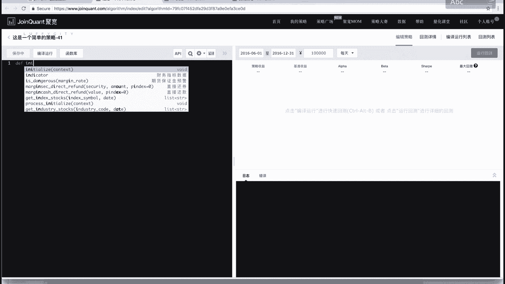

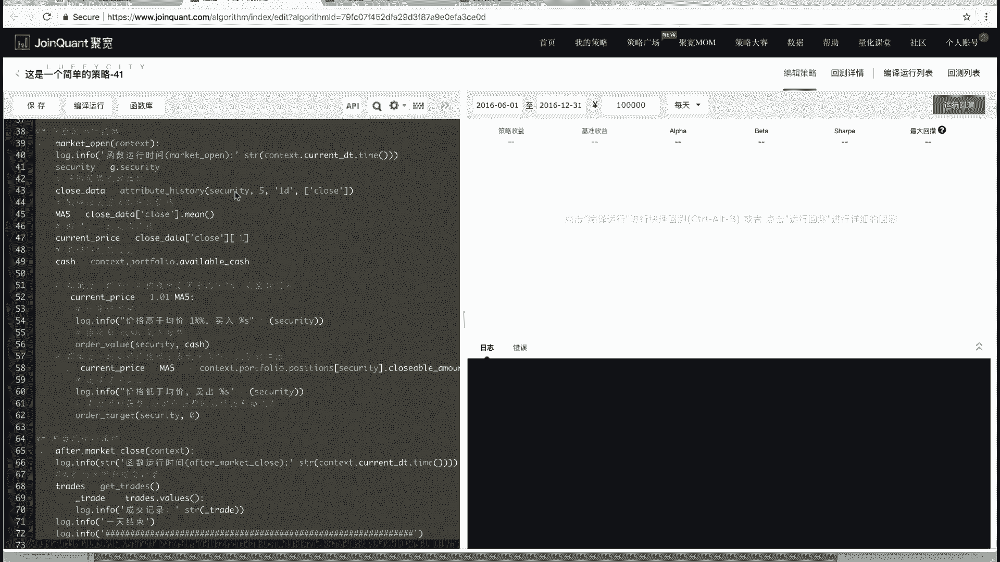

开盘前，收盘后，这些我们可以暂时不用管，我们只需要管两个函数，第一个函数应该是哪的，就这这个函数，这个函数是什么呢，就是我刚开始不是模拟，比如说从16年6月1号，到16年12月31号吗。

比如说我刚开始是就是6月1号这一天干什么，就在入市之前我要干这件事啊，首先第一，我们之前是不是之前说，我说我要设定股票值为沪深300对啊，那也就是说我要存一个，就是我现在操作这300只股票。

那这300只股票存在哪，存哪呢，有一个就是我这里就要存一些自己的数据，那自己的数据，我想就是可能接下来所有我在回测的时候，我一直要获取到，对不对，那这个数据存在哪。

这个数据存在一个叫做全局对象小J里边啊，你不用管这个J是不是创建的，它就是框架已经给你创建好的，就叫一个小J，它是个对象嗯，它是个全局的对象，那你在任何地方都可以访问到它，OK吗，你想说存什么数据。

你就在这个J后边加某个属性就可以，比如说我想存啊，就是我说存这5/3票可以吧，那我就加这一点，比如说我叫security，security是证券的意思吗，就我们这就是就就你随便起名，你起ABCD都可以。

那你写个列表对不对，你把300只股票代号写进去，代码写进去啊，假如说如果说我只操作一只股票，我可以这写个字符串，比如说是呃六零，他这会给你提示看到没有，他这会你提示六零啊，什么18771881。

然后到后边有这个点SXHJ这指的是啥，这指的是就是他在哪个地方上市，XHJ是上海，上海是对，如果是SXHE，应该就是深圳看三零的开头的都是SHHE，看到没有嗯，三零开头都是深圳上市的。

然后六零呢就是上海上市的，比如说我是601318好，然后点你直接这个时候直接点回撤一下，所以我跟你说这支股票是什么，中国银平安的平安银行的啊，那也就是说我接下来就是这是我股票的代码。

就是你接下来你看对这支股票进行操作，比如查这支股票的历史数据，我是买它什么的，都是通过这个代号，就是这个编码，它的代码来进行操作的好吧，那如果说我操作一只股票，我就这样就可以了。

但是如果我说我想这个什么呢，我想操作沪深300所有股票，那我的这点security是不是就得是一个列表，然后列表里是字符串，那我凑的300只股票，我能说，当然你如果大家有时间，你可以啊。

300只股票编号都输进去，你没有问题啊。

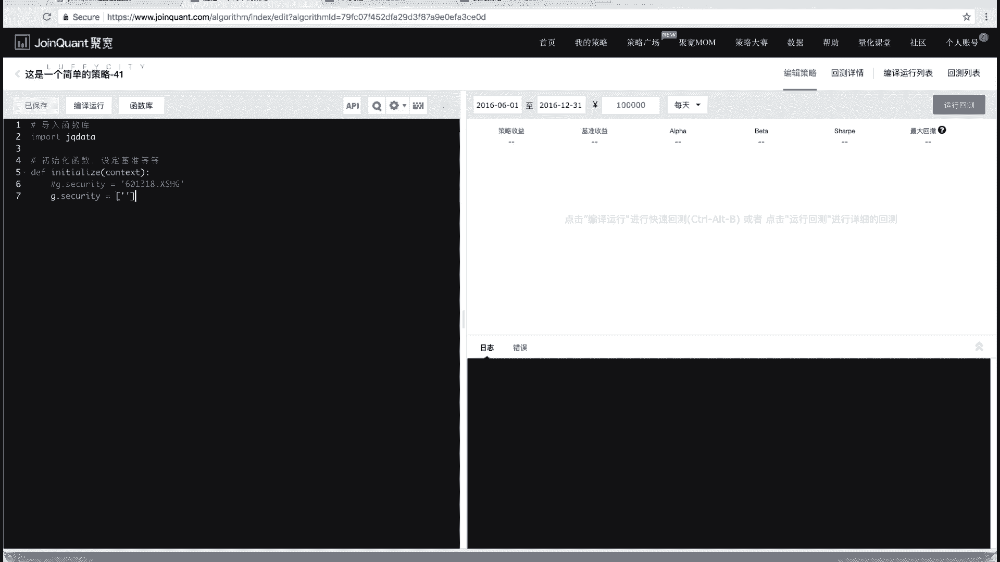

但是我们可以通过一个什么函数呢，我们可以看下这个API文档，叫做get啊index stock，或者叫做获取指数成分股啊，刚才是不是说过沪深300是一个指数，那成份股是不是就是他这300只股票是啥。

比如说我们可以看一下啊。

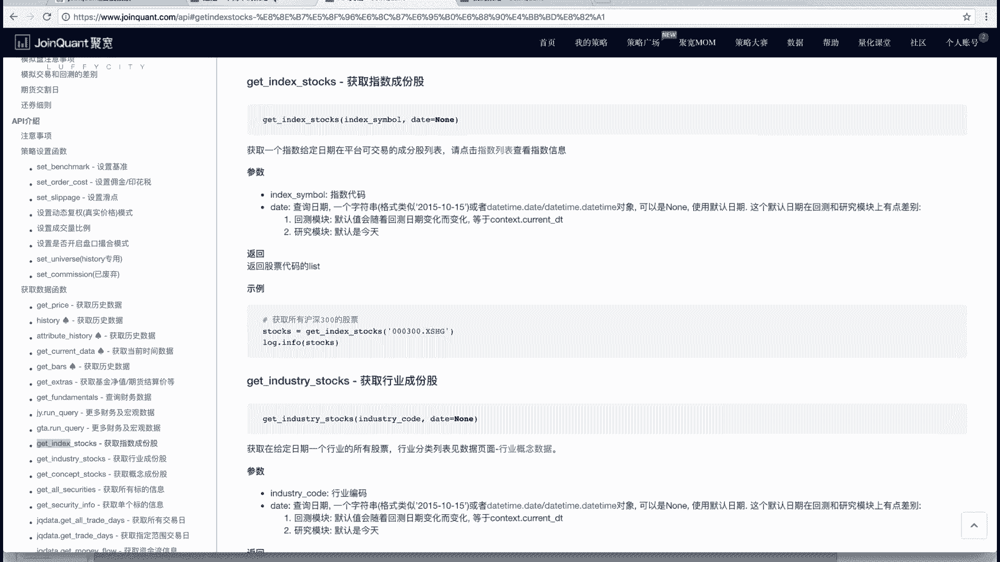

security等于get index index stock两个参数啊。

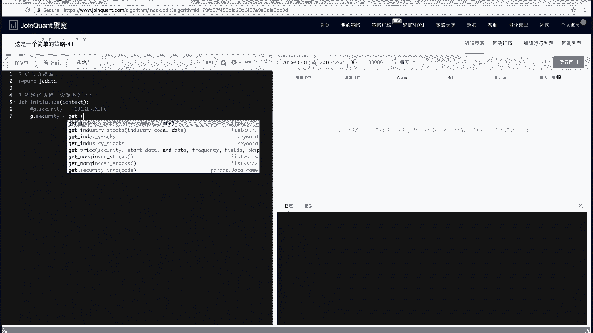

第一个参数是你的指数代码，第一个参数是你的指数代码啊。

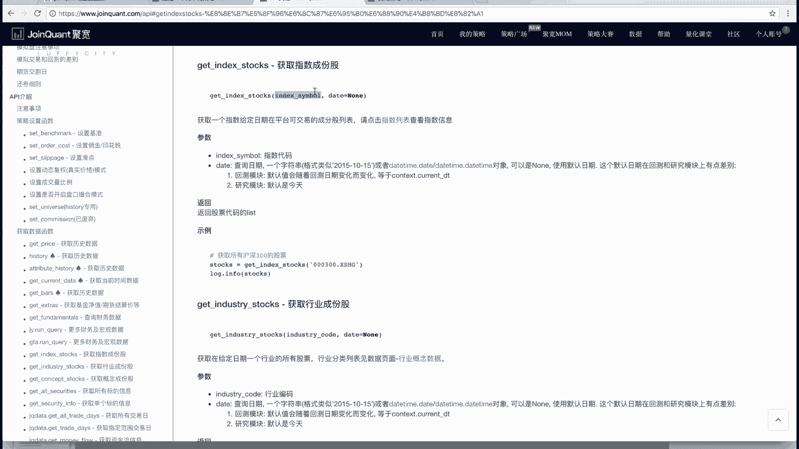

这也不是说护士代码，也不是说传名字也是需要传代码的，护士代码代码是什么呢，叫做000300XAZG看到没有，这写的沪深300啊，这还有各种代码，那你说我记不住这个东西怎么办。

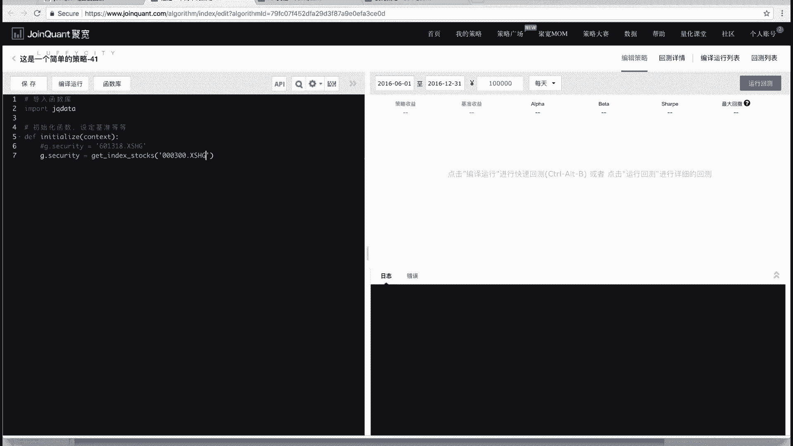

我要我想查，这也也有啊，比如数据里边，你可以看到指数数据啊，这里列出来了所有的代码跟他的指数，OK吗，你看这里有什么是这个各种各样的指数啊，都有有好多什么，按这个按各种按按什么行业分类的，按这个它的呃。

细分的行业再细分的都有啊，各种各样的指数好。

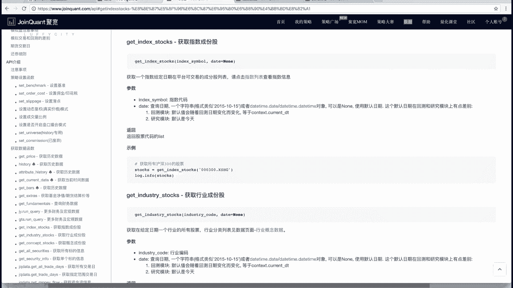

那这个时候，我们比如说我们这可以直接打印一下，J点c q protect，然后运行打印的部分会在哪，打印的部分它就自动给你转成日志，那这不是日志吗，它会存在下边看到没有，这个时候你看我的这个蓝线。

蓝线是什么，蓝线是我的蓝线是我的策略收益，就是我自己写的策略，但是我这个策略本身没有买卖，所以一直是0%对吧，嗯对就是我一直10万块钱没有操作股票，但你看我这给打印出来是打印出来列表，对对不对。

打出来是一个列表，然后列表里每一个元素是一个字符串哦，就是这个股票代码OK吗，所以这个东西叫做我们的这个就是怎么样获取，我们的这个成分股，获取我们的股票池存在这里边，可以吧，好那除此之外还有什么呢。

还有一些就是可能是比较，就是基本上都要写的set option啊，叫做这个set option设置操，就是你去看他的那个自己给你生成的框架里，也有啊，Use real price，用过真实的性价钱。

啊这个代码也在也在这个这个API文档里说了啊，我们可以看一下这个代码指什么，你看你看的是设置选项，然后用真实的价格true啊。

你字面理解什么，就是我用的是真实的价格，但是实际这个东西表示的是，就是模拟盘使用真实价格啊，具体细节你可以看这个里边，它实际上是用了一个叫做复权的，就是做了一个动态赋权对价格，那关于复权的概念。

我们这不想展开讲，因为是可能数学和金融方面会专业一点。

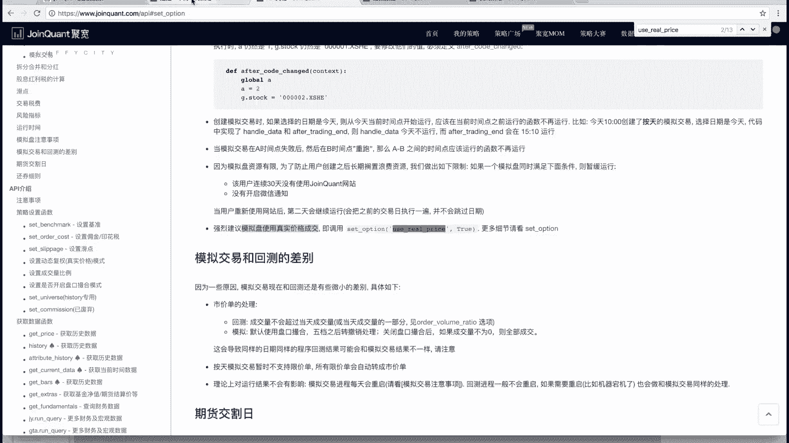

这个知识就是可能不太适合给大家讲，大家记得就是你写任何策略，加上这一句就可以了啊，除了这句还有啥呢，还有一个叫做设置我们的这个啊。

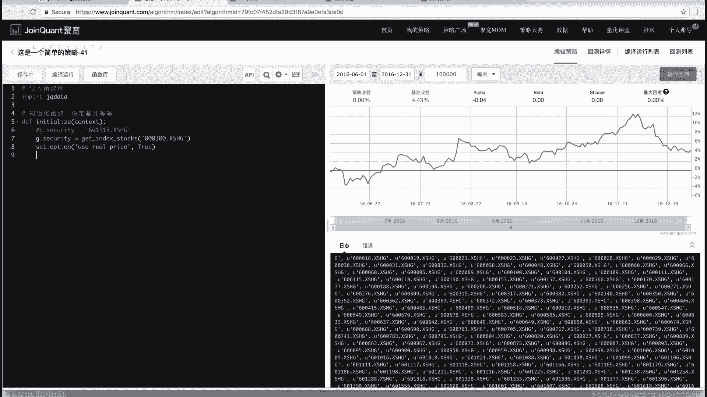

手续费收取手续费叫什么叫set order cost，这个设置佣金印花税，就说你买卖股票不是白买卖的，你是需要手续费的，那这些手续费包括啥，股票来说啊，可能就是期货什么的，我们不说股票来说手续费。

买入的时候你是要给就是不管是买入还是卖出，你是要给券商付手续费的，这个手续费的佣金叫做佣金啊，这个是啥呢，我券商券商我们之前是不是说过，就是说我要买股票，我必须要在券商那里开户，对不对。

也就是通过券商的中介，然后过去，那你中介人家不能白帮你买对吧，你得给钱啊，你用金佣金怎么算，股票类的佣金是万分之3万啊，最低是五块钱，你看这了吗，默认的是你这写了买入的时候，佣金是3%。

卖出的时候佣金也是3%，就是不管你买或卖你用金，比如说我买10万块钱的股票，你就得付30块钱，不多对吧，但是他有一个什么呢，最低五块钱，你就说我买1000块钱的股票，你按万分之三是多少。

你按万分之三是三毛钱，但是不行，你3万块钱我赚什么，这最低五块钱，所以相当于你如果不是特别大的户，你基本上就是五块钱OK吗，除了这些，还有一个什么呢，你卖出的时候还要交一个印花税。

这个印花税是给国家的哦，就你说什么叫印花税，这个这个就是经济学和税务相关的东西了，也我们也不细讲，就是你知道要交钱就行了，印花税买入的时候不交，只有卖出的时候，就你卖股票的时候交嗯啊交多少呢。

1000‰分之一，这个没有最低，就是你你比如说你卖了10万块钱，你就交多少，一百一百对啊，你卖了1000块钱，你就交一块钱，你卖了100块钱，你就交一毛钱，就这样好，这是手续费。

那这个计划其实我们直接拷过去就可以了啊。

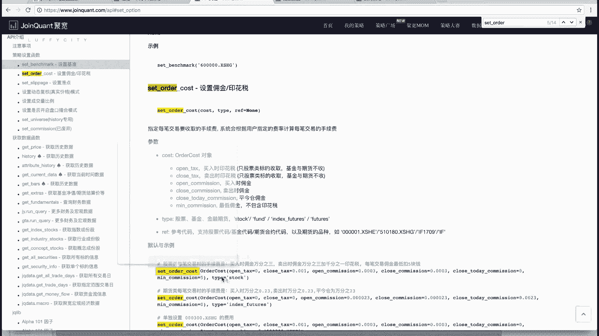

就直接复制粘贴，是交费，就所有，因为现在来说所有的手续费都是一样的，如果说你想模拟其他股票的环境，那你可能用这个平台也没有用，你可以看到open text就是开仓的tax税吗，就是开仓的时候印花税是零。

因为开仓不收税，就是买入的时候不收税对吧，close tax关仓的时候哎，这个平仓的时候我们叫平仓的时候，平仓的时候收多少呢，嗯稍微等一下有点差，平仓的时候是不是1‰嗯，就0。001。

然后open commission就是开仓的时候的佣金，就是买入的时候佣金是万分之三，卖出时候的佣金，这还有一个close today commission等于零啊，这个不用管，这个是这个期货的。

你可以不写，你个地方可以不传啊，这个代码可以不传，然后main commission是五，就是最小的佣金是五块钱，type等于stock，就是对于期货来，对于这个股票来说啊，这个代码基本上也是固定的啊。

也不用去管，你直接拷过来就可以了，好啊，到这儿我们的哎initialize就写完了吗，基本上写完了啊，可能还有一些其他的东西，比如说我们还没有说这条红线是什么啊，那这个我们一会再说好，那就是关于这个。

其实主要给大家讲讲，这半天就是这个这句话是你要获取你的股票池，你的所有数据存在小G的这个全局变量里啊，你可以这传任何的值，你的J比如说你的J你可以传任何的东西，比如说你写个A等于一，这都无所谓，就可以。

只不过你存了一个变量而已，相当于是嗯好，那这是我们的initialize啊，我们这暂时停顿一下，大家看下一个视频，我们给大家介绍说我每天怎么进行买卖。

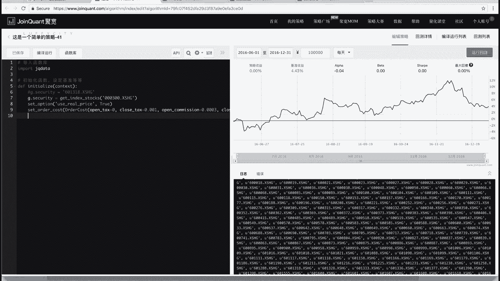

可以吧。