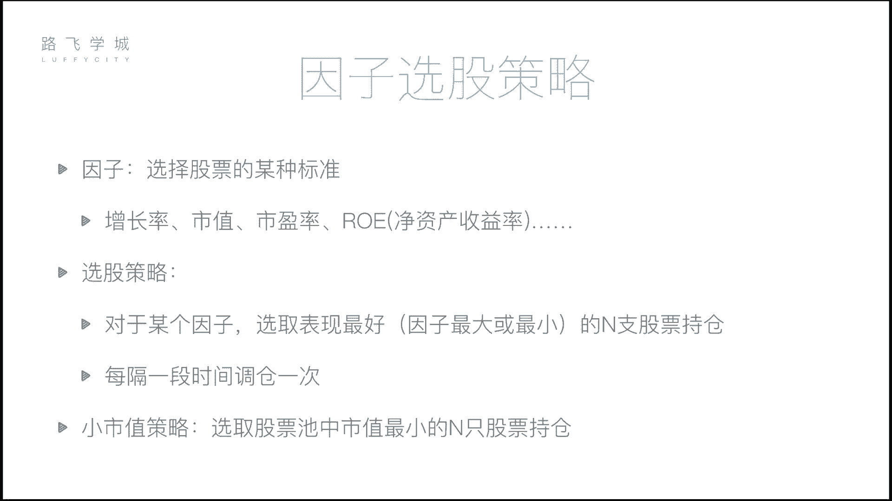
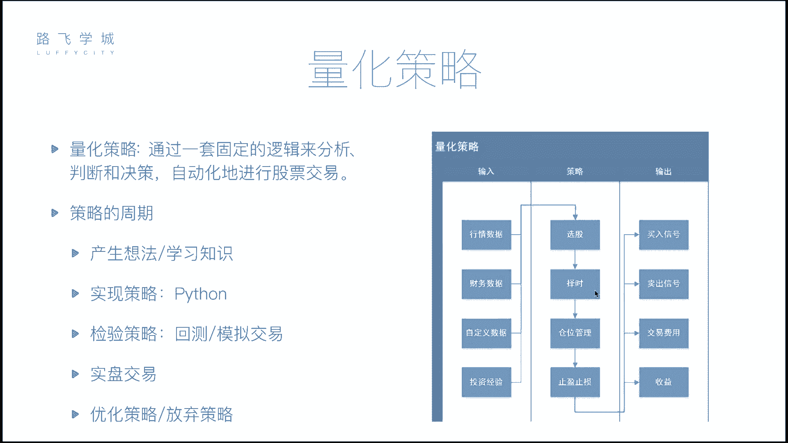
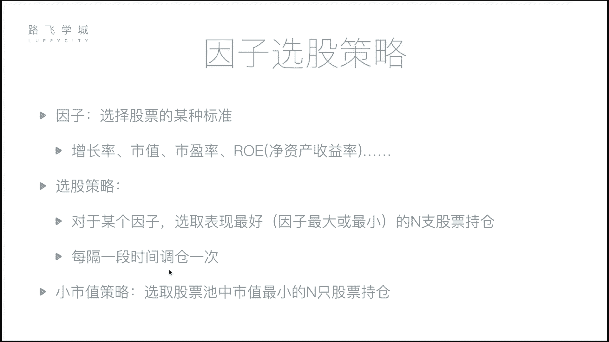

# 清华博士带你学习python金融量化投资分析与股票交易【附项目实战】 - P51：53 因子选股策略-1 - python大师姐 - BV1BYyDYbEmW

好同学们，那我们刚才讲了，这是这个双均线策略对吧，双均线策略的核心其实是择时啊。

我们说之前说这个啊，我们的这个量化策略四部分选股择时，仓位管理和止盈止损对吧，双均线策略主要做的是选股啊，不是这sorry主要做的是择时，对不对，那选股我们接下来讲一个选股策略。

叫做因子选股策略啊，其实所谓因子选股因子是什么，因子指的就是标准，你要选出来一些股票，就是你要从比如说从300只股票里，选出来十只股票，那你怎么选，你肯定有一个标准对吧，那你按照什么标准呢。

就是一些就是标准的做因子啊，一些常见的标准，最常见的其实是一些我们说财务指标啊，就是我们之前这个数据获取的都是行情数据，那可能有一些这个财务数据，比如说你这个公司的市值，你公司的利润，净利润，总的利润。

你的增长率，你的包括市盈率啊，市盈率是什么，咱们这个后边会详细介绍，你说说你的这个净资产收益率等等等等啊，当然除了这个呃，除了我们的这个这个这个这个呃财务指标，还有你可以用行情指标。

比如说这个你这个股票的前几个月的收益率，可以吧，你可能股票就看股票前几个月是涨了多少，我拿涨的多的出来也是一个因子啊，总而不管说你选择什么数据，总而言之它是一种标准对吧，你选择一种标准就可以啊。

那选股策略就简单了什么呢，对于某个因子，你选定一个因子，那你选出来表现最好的N支股票，就是要么是这个因子最大，要么是这个因子最小，那你具体选最大和最小或还是最小呢，就看你自己定嗯。

那比如说我们针对市值来说，前段时间有一个这个有一种策略比较流行，就是简单，但是实用是什么呢，叫做小市值策略，就是什么呢，他就从股票池里选出来市值最小的N只股票，嗯OK吧。

就是一直攥着这市值最小的那只股票，为什么呢，因为小市值公司往往是刚上市的或者怎么样，他往往会涨的会比较厉害厉害对，就是可能刚开始体量比较小，然后就涨的会比较多，这个你的就比如说你从你从10万块钱公司。

10万块钱的工资涨到20万，涨到50万，可能比较容易，对不对，那你涨了50万，你就翻了一倍啊，你就翻了五倍啊，但是你说我公司值十个亿，你涨到50个亿有那么容易吗，没有，其实所以说小市值策略。

是这个之前特别流行过一次好，那比如说我们就选因子，就选市值作为我们的因子啊，那就是我们要找市值最小的N只股票，那我每隔一段时间调仓一次，怎么怎么调呢，就是比如说刚开始啊。

我有我看出来就是所有的股票有一个股票池，我选出来市值最小的十只股票持仓可以吧，嗯呐每隔一段时间，这段这个每隔一段时间，往往不是说我一天就看一下，一天就看一遍这种选股特征，因为我省市值我要等着它升值啊。

所以一般来说我们可能会放上一个月，或者放上两个月，这种情况不是短期的，我一天不是像我们双均线似的，一天看一眼，一天看一眼，他是就是一般来说这种选股资料，都是过一个月或者是最短的。

可能也几个星期或者一个月或者多少天，这种来看啊，比如说我们隔一个月好吧，那就是刚开始买N只股票，隔一个月我再看，如果这十只股票里，就是还有可能还有有五只股票，仍旧还是十只最小的那十只。

十只里边的那这五只股票不变，那比如说那五只股票就是另另外五只股票，他可能就是不是市值最小的里边了嗯，那我就把它卖掉卖，然后再买什么呢，再买五只股票，再买市值最小的那五只股票，填上就一始终保持我调仓之后。

我持有的股票是当前市值最小的N只股票，嗯明白不是的，就卖掉，然后再补进来，新的就这种，那我每天就是每个月调完之后，我始终持有的N只股票，并且这N只股票一定是实时最小的。

对那这就是一个常见的因子选股策略的玩法啊，那么接下来就给大家实现一下这个小市值策略，就拿市值作为这个因子来试一下好不好。

