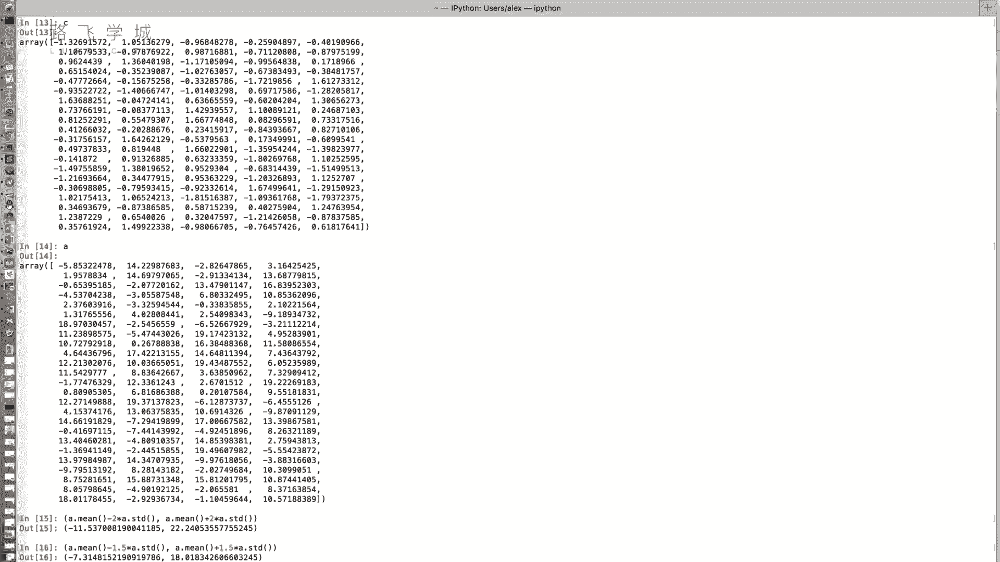
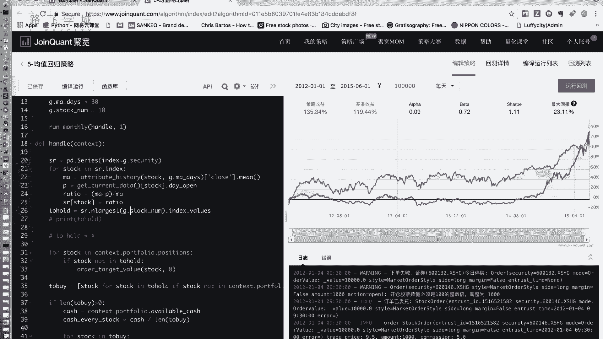

# 清华博士带你学习python金融量化投资分析与股票交易【附项目实战】 - P57：59布林带策略 - python大师姐 - BV1BYyDYbEmW

好同学们，那接下来我们给大家讲下一个策略，叫做布林带策略嗯，什么叫布林带的布林带呢，它英文叫blinder band，Biller，Band，band的就是袋子嘛，然后BOING码是个人啊。

你也可以翻译，有翻译成布林线，更有名的那个叫做保利加通道啊，这这个金融里边有好多通道，什么唐奇安通道，保利亚通道等等，就是一条带，那这个通道是什么啊，它由三条线组成，嗯啊中间的线好说。

中间的线就是均线嗯，啊上下两条线是什么呢，上下两条线可以分别看成，是价格的压力线和支撑线，人好多，就是你做股票和金融也都会说这个词，就说你这个支撑是大于就是多头还是空头嘛，这个专业来说。

或者说简单来说就是说压力大，当前的压力大还是支撑大，因为他他把这个线理解成是，他当于你上方给他一个压力，下方给他一个支撑，你往下走了，就是支撑，如果支撑大于压力了，那就会往上走是吧，如果压力大于支撑了。

就往下走好，那它我们先看这个通道啊，就是三条线，啥意思呢，看啊这个现在这个这个K线往上走走走，超过了这个上边这条这个这叫压力线阻力线了，或者说是那现在如果说超过上半条线的时候，就认为是现在压力比支撑大。

阻力比支撑大，那它就开始跌跌跌跌啊，如果说你看这吧，看这如果说这个跌破了下边这条线了，就认为是现在支撑肯定比阻力大啊，那就往回涨，大概就是这样，当然其中也会有你，比如说这个时候它也是回涨了。

但是啊你没有跌破下边的线，那我们认为什么呢，就是这个策略认为是你跌破了下边的线，认为是你一定是现在一定是这个支撑大于主力，当然你没跌破，可能是大，但是没准我们操作怎么操作，先别急。

我们操作就是在冲破上边的线和跌破下边的线，这两条线之间哎，对那回来说回来，这条线是怎么来的呢，两条线啊，上限up线就上面那条线叫做20日均线，加上N倍的SDSD是啥，SD是标准差。

20收盘价的标准差N是N是一个数参数，参数对一倍的两倍的三倍的，你自己调，下边的线是20日均线减去N倍的标准差，嗯啊啊这个东西是怎么来的呢，我印象中我给大家讲这个。

在前面讲pandas库的那个STD方法的时候，我讲标准差方差的时候，我举了个例子，那他不在，我说什么呢，我说这个一个一组数就是一个随机，一个随机数组的，它的方它的均值平均值加减N倍的标准差。

可以大概表示这一组数的范围啊，为了防止大家忘我，给大家复习一下啊，啥意思呢，比如说我们看这啊，看A还在吗啊，这个A这是我，这是咱们讲之前的那个时候用的那个数组，它是相当于我从-10~20创建的好。

那我怎么估计它的范围呢，看啊A点min减去A点s std，然后我给他做一个元组出来吧，A点min加上A点STD好，那大概前面乘以一个二，应该是差不多的啊，平均值减去二倍的标准差。

和平均值加上二倍的标准差，返回出来的这个值，大概你看11-11~22，我们创建的什么-10~20嗯，差不多吧，嗯对吧，当然你说这个具体几倍的呢，其实这个是和我们的这个分布有关的啊。

这个好像是我印象中是不是1。8倍，好像更好一点，这个就不重要了，但是大概是几倍的，我看出来这是大概是两倍的，啊，那就是这个东西，就大概可以表示成这组数的范围，那如果我把它设的小一点呢，看看什么意思啊。

如果把它设置成1。5，你把这个A的这些值看成是价格，那比如说我生成1。5，我算出来这是-7~18，那我就认为什么呢，我认为-7~18，七相当于下面这条线嗯，18是上面那条线，那在这个范围内的。

实际上就是这个价格的正常波动，如果说你这当前的价格小于负起了，就跌破下边这条线了，那这个时候是不是我认为它涨回来的几率很大，因为这可以认为是大部分价格，都在这个里边波动，对对不对，那你跌破了往下跌破了。

那就是涨回来，如果你超过了18呢，那我认为你是不是接下来往回去了。

对可能性大，大概就是这么个原理啊。

好这是我们的这个啊布林带的三根线嗯。

啊中线上线和下线，那这个布林带，其实它你可以看到他是一个择时策略了，嗯啊它是什么呢，你选择在什么时候买，什么时候卖，我们在这个里边选择这个点嗯，买入嗯，因为这个点预示着相当于冲破跌破阻力线了。

就要往回涨啊，选择这个点额这个卖出嗯，因为认为它是接下来要跌了，认为它是最高点，好思路就是这样，不连电策略做择时，当股价突破阻力线时，就是往上突破上面这条线的阻力线，突破阻力线时清仓全都卖出去了嗯。

当股价跌破支撑线时，就跌破下面那条线时买入，那这就是布林带的这个东西很简单啊，这个核心就是这根这三根线啊，其实就是其实是上下两根线，中间这根线还没啥用嗯，好那这个再往下再深入研究的话。

你可以研究一下N取几，就是我这个乘N倍的SD啊，这个N取几取几，你N取得小一点，交易肯定会更频繁，因为相当于你这样的带子缩短了嘛对吧，你看下它N取小一点，SA缩短了，那焦点肯定会多呀。

那相当于你教教育的更频繁，但是也有可能出现什么呢，有可能出现就是很误差的地方，因为你现在看看，我现在这是一个片，如果我这如果我上面这个线取在这，那相当于是我买在半山腰也卖，就是这个是这个是在半山腰吧。

这是在半山腰卖的，这是卖点，下边这条线取在这儿，那我就是在半山腰买嗯，就是你取大了不太好嗯啊取小了不太好，你取大的呢取特别大的话，就没有什么噪点，你就没有什么调仓的机会，他不会卖的，不卖对对。

所以这个参数也是就是可以研究的地方，然后再一个就是啊不应该的宽度就是什么呢，你上下的N甚至可以取不一样的哦，我们现在上下N取一样的对吧，上下N可以取不一样的，比如说什么呢，我想这个赔的少一点。

那你就下面的那个线对，下面线紧一点，对是吧，我得求稳，我不想配我下边的线往上取紧一点，上边的线往对对吧，这各种各样的说，对对对对对，这个就是各种各样的取法啊，啊这是我们说的这个布林带策略。

嗯啊原理很简单，那接下来就是我们带着大家实现一下。

