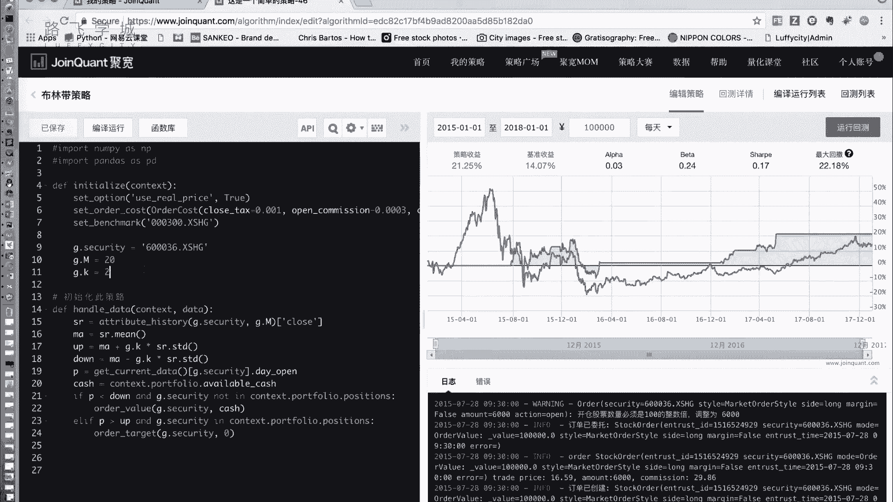
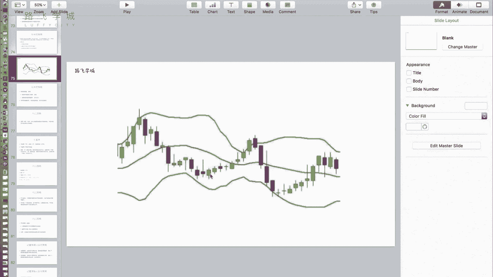
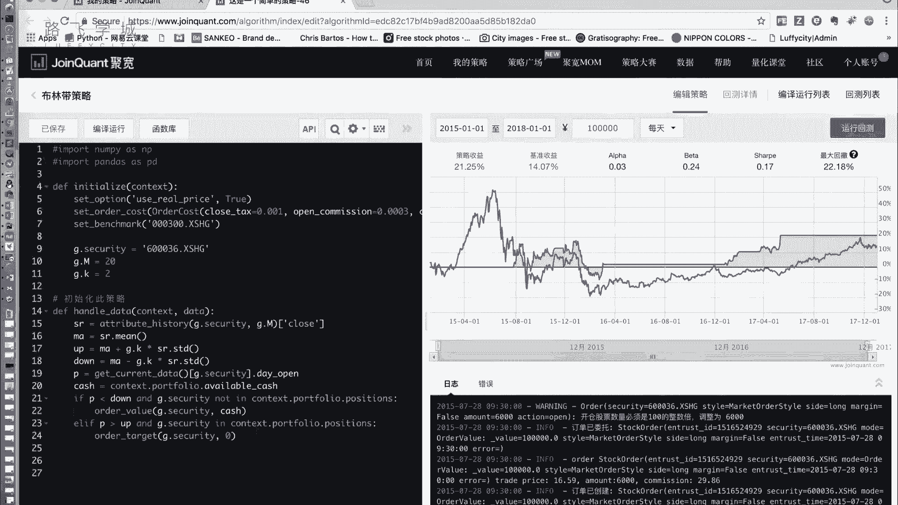

# 清华博士带你学习python金融量化投资分析与股票交易【附项目实战】 - P58：60布林带策略实现 - python大师姐 - BV1BYyDYbEmW

OK好同学们，这个人在矿啥，不知道这个，我们来实现一下我们的布林带策略啊，来啊我们的布林带策略是啥嘞，我知道上顶线，下顶线，中间一条线，中间线不管线，好吧，嗯其实就是三根线啊。

那就是就是所谓的我们的策略就是算这三根线，然后判断时间是不是到了这个时间好，那我们算三根线，这个需要的均线啊，attribute history参数啊，我的这点security就设置成一个股票。

是我手动选的，这个选股的话，你可以结合一下其他的选股策略，就选出来几只股票都可以，然后这个M这个M是啥啊，这个M是我均线的时间，所以我这就是这一点security，就这支股票，然后mt啊。

比如说我把它存成啊，存成这个叫SR啊，等于它的，close这一列，那均线ma就是SR点面，上限up就是ma加上K倍的这点K，这个这点K就是就是那个几倍的啊，乘以，呃SR点STD下限就是MA减去K倍的。

STT标准差好，这三根线算出来之后，接下来就是只要是冲破了上限，我们就卖出，只要是跌破了下线，我们就买入啊，和我们的那个双均线策略差不多，如果当前的价格啊，没有算当前的价格P。

我们还需要知道今天的价格P是什么呢，P等于啊get current data啊，这点security点day open好，如果当前的P啊，我们说比如说小于，和我们的那个双均线策略类似，如果它小于下限。

并且我持仓，那我们就把它卖出啊，不对，并且我不持仓，那我就把它买入，我说错了，and什么，and g点security not in啊，context点port folio，点positions啊。

这个时候说明是我第一天跌破这个下限，因为它我我没有嘛，所以我就买入买入买多少呢，全买下来算一下钱啊，钱有多少就买多少，cash等于啊，这个context点portfolio。

portfolio里存的是你的账户信息，点available cash就能用的钱，那我们只要是买入信号，那我们就order，呃不是order卡，Order value，买这点security股票。

买cash这些钱的，好如果，P冲破了上限，并且，他已经持仓了，就不是not in，如果是in就是持仓的话，说明这是第一天重播上线，那我们就把它全全仓买入啊，Order target。

这点CQUIT卖到零五啊，这就是我们大概的一个布林带的这个呃，框架就写完了，嗯啊看一下效果，又报错了，报的啥错嘞，又写成逗号了，啊这个不行，它就有有有有有有有，这个布林带策略就是择时策略。

一般都是短线策略，反而选股策略就是偏重于选股，它是长线策略，比如说美因资不是我们之前那个讲的啥来着，那个那个那个均值回归都是常见的策略，就是你选股，因为它本身选股策略要调仓时间比较短嘛。

可能一个月调一次嗯，但是这个择时策略每天都要看，每天都要看，就是一般适用于短线，所以我们这选的是最近的短线的一些啊，可以看到这段时间短线还短线，333年呢，比之前的78年的，你可以看短线，可以看一段嗯。

你可以看一下任何一段时间，就是还好，但是你可以看到这好多瓶子的时候，就说明什么呢，说明这段时间是没有操作的啊，所以他的哎这段我就不是没有操作，是没有不吃仓的嗯，不吃任何仓的，所以是平的。

那其实大家可以就是从这以下几，以下几个方面还可以进一步做优化，第一可以考虑一下做多只股票，因为你看我一支股票的，有很多时间是我这周我要不吃仓，三一我没有在市场里对吧，你很长。

就这是从你看17年5月份到17年12月份，将近快一年没有干活了对吧，可以试试说多做多只股票，做多只股票其实主要考虑的一个方面，就是就是一个问题，就是钱怎么分配，嗯啊那你就是想想想好。

你可以比如说我准备10万块钱，我就10万块钱炒五支股票，那就相当于你每支股票分2万块钱，就这样，那当然钱少了啊，当然钱少了，那就是个for循环，把它做成个列表，是个for循环也很简单啊，这是第一个问题。

第二个问题参数啊，均线的长度看我这选的是20，这个M是我的这个均线的长度选的20，为啥选择20呢，因为在我之前的实验中证明30和其他的，反正我试了30效果没有，它好好，我就给大家展示一下20了。

然后这个K啊，我这设置的是二，我在看到过一种说法，说是1。7，好像好一点，但是我这测出来是2号，看换成30的明显，就刚才是50%多，60多，现在换成百到20%了，瞬间掉了，虽然还是赢大盘。

但是没有刚才好啊，K也可以试的，比如1。5，1。7，1。8，22。5，这些都尝试一下啊，还有一个问题是什么呢，就是在实际中就是不是量化的，我的布林代理，它还有一种就是布林带还可以再升级一下。

就是不是简单的看他冲破上限和跌破下限，还可以怎么样呢，还可以说就是布林带它有根据它的开口，根据它的宽度，根据布林带的宽度嗯，可以判断现在是一个常态还是一个非常态，如果布林带越窄，说明什么。

说明这段时间价格比较稳定，对稳定的时间就不适合做短线的炒作，对如果长，这说明价格半就一直不变，就就没人在动它，那你可能是吧，你可能特别窄，然后你随便任何一个小波动，它本来就比较小。

然后你拨动一下是不是就有可能出问题，那如果他布连带特别宽的话，就是是一个就是震荡的时间，震荡的时间啊，就是可以根据布林带的宽度来判定当前的时间，是一个震荡的时间，还是一个平稳的时间，然后再根据此。

然后再可以加上它搭配一些其他的问题，就是不拿布林带来做做什么，不使用布林带这个策略来进行呃真正的择时，那我只是拿布林带来作为一个判断，拿布林带的宽度来作为一个判断，当前股票震荡情况的。

一个就是震荡情况的这么一个指标吧，算是嗯你结合他对，再结合一些其他的信息啊。

包括诶甚至说你选股的时候，你也可以做什么呢，你把布林带的宽度作为一个指标来做选股，也是可以的啊，他有好多好多的这个延伸的东西啊，好，那我们的这个包括你还可以加一些什么，简单的止盈止损。

因为它本身布林载荷类也不是完美的，就没有一个特点是完美的，呃这个刚才ALEX课下跟我讨论说，如果说我连着两次跌破了下线嗯，那就说明是买还是卖，应该是卖，应该是我应该是买跌，但是实际对，但是实际还是卖。

因为跌破两次下线之后，你如果连续跌破两次三线，说明什么，这个股票可能一直在跌，但这个时候你就要关注一下整体的价格走势，那你其实也可以说在它上面进行优化。

你可以考虑什么那个进行止损，或者说你如果如果你记录一下当前的这个状态，上一个呢，比如说这是跌破下限了，你记录一下之前那个状态是不是跌破下限，如果连着两个跌破下线，那你是不是要看一下了。

我是不我是不是要换个股票还是怎么着对吧，这个这是我们简单的一些就是它的核心的东西，在这儿当然深入一些调参啊，一些其他的细节的东西。

大家可以继续继续研究一下。