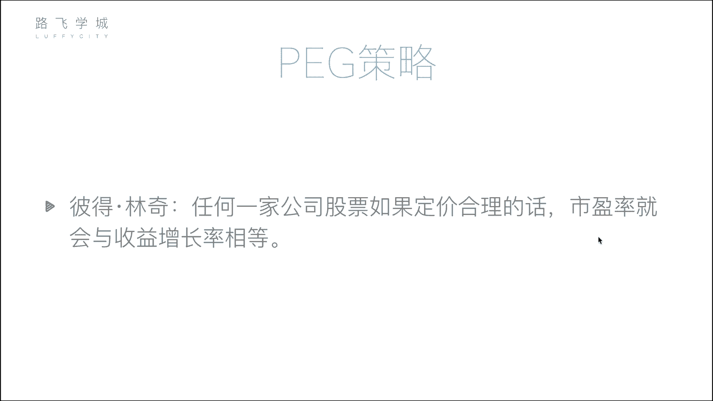
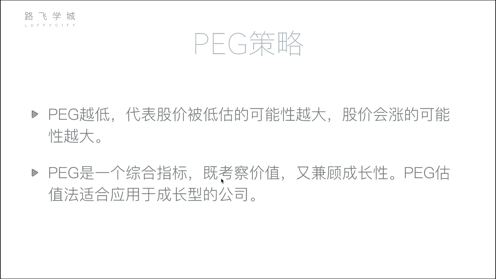
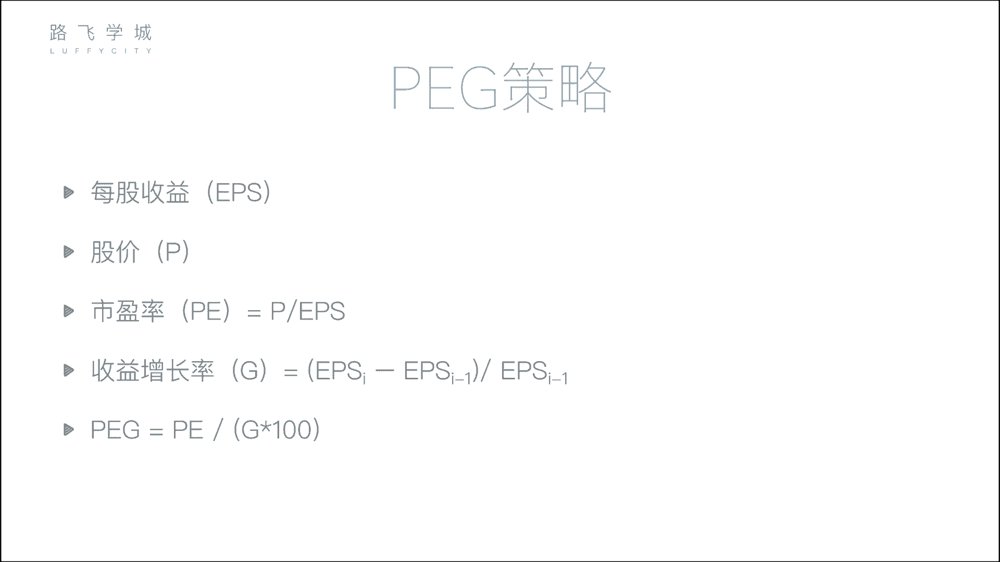
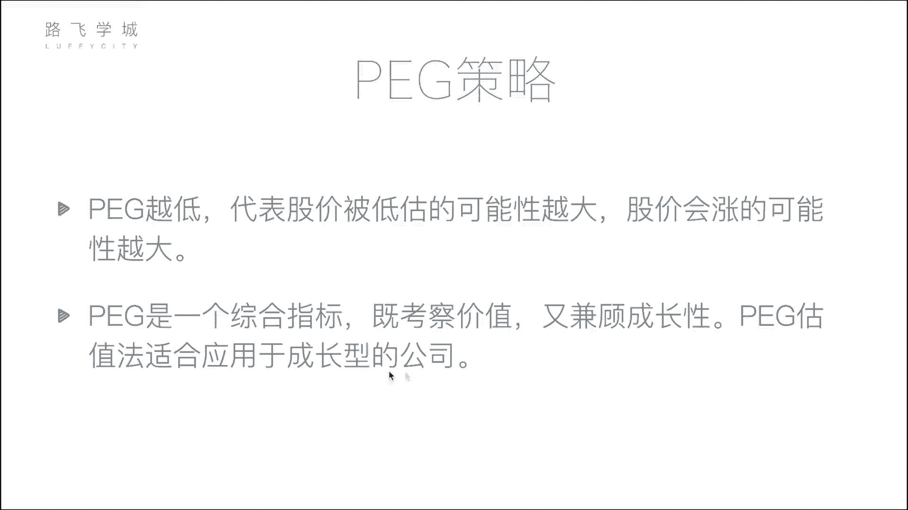
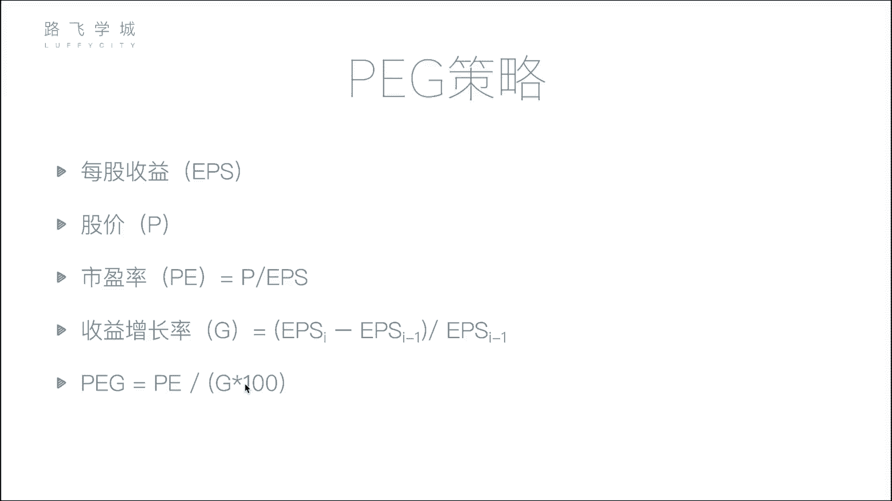
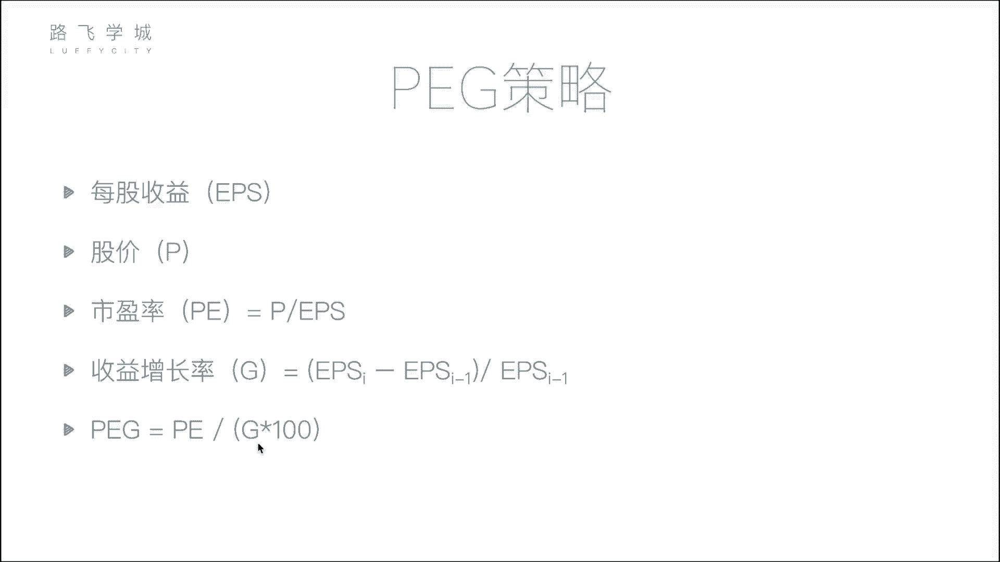
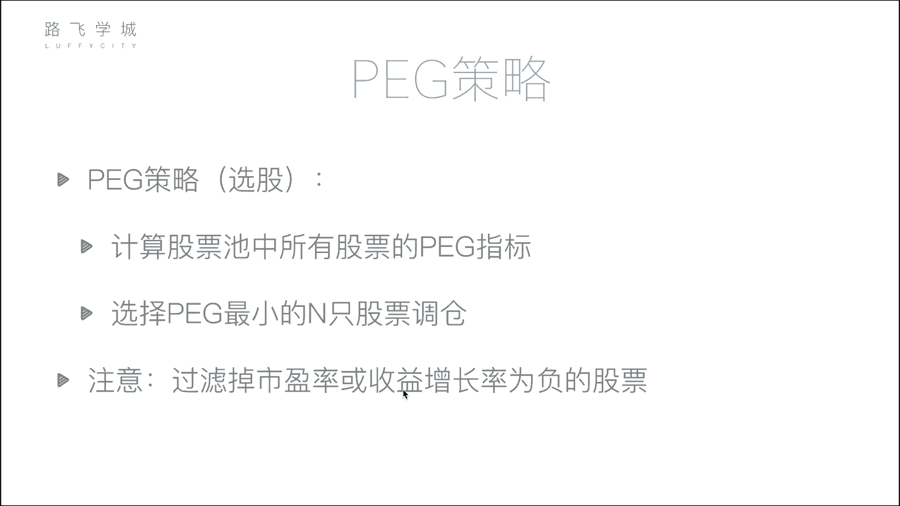

# 清华博士带你学习python金融量化投资分析与股票交易【附项目实战】 - P59：61PEG策略 - python大师姐 - BV1BYyDYbEmW

好同学们，那我们接下来又是另一个策略了，叫做PEG策略啊，三个字母霹雳策略是啥呢，这个策略来源于一个投资人说的话，叫彼得林奇啊，一个比较有名的这个金融学界的人，投资的彼得林奇说过一句什么话呢。

说一句这个任何一家就是这个策略，也算是他发明的吧，任何一家公司股票，股票如果定价合理的话，市盈率就会与收益增长率相等啊，就这一句话，市盈率对，可以收益增长率对，就这一句话就产生了我们的pk特征。

那怎么来的呢，看到这句话，大家可能看不出来，就这一句话，我们就默认它，但在暂时默认他是对的，但是我们来研究一下股票定价合理的话，就是其实就是一般情况下就是价格正常的时候，那市盈率诶，市盈率是啥。

是知道我们一会儿说啊，一会给大家解释一下实现率是啥，收益增长率，这个好理解，收益增长率是啥呢，涉及呢就是你比如说我现在这个呃，这个这个股价，现在的股价是呃一块钱呃，半年之后股价变成了五块钱。

我的增长率就是500%哎，就是这个啊，因为你整个也整个公司的收益，基本上就反映在股价上，你可以认为是公司的收益，也可以认为是每股股价的增长率，就是其实就是你的收益增长率好。

那我们接下来说一下这个市盈率是啥，这是一个很重要的金融方面的专业的对指标，或者什么名词啊，给大家介绍一下，之前讲因子选股的时候，它其实也是一个因子，但是就是因为这个咱们这儿用到市盈率嘛。

所以我们专门在这说一下好市盈率啊，英文叫做PE，它等于股价P除以每股收益EPS嗯，每股收益是啥呢，大概就是什么，你这个公司有多少钱，比如你公司值十个亿嗯，你要是不是指实力。

你这公司收实就是一年赚了十个亿好吧，那你有10亿只股票嗯，相当于每股收益就是一块钱嗯对啊，因为你就是除去了，当然这个收益除去了，说我拿来发展这个这个扩大公司规模啊，这些收益就是你剩下的给股东。

就是股东分到的钱，其实他就反映在这个每股收益好，股价好理解，就一股多少钱嘛，那这个市盈率怎么理解，它就现在看看不出来股价除以每股收益，但是啊你把他们两个乘以一下股数嗯，股价乘以股数。

是不是大概等于你的市值对总市值，总市值对你公司的市值相当于你公司估值多少，大概就是就是当然你不是说百分之百相的，就是可能有一些小出入，怎么会有小数呢，有小厨就是有小数，就是呃啊就是等于你的市值。

因为你市值也是一个估计出来的值嘛，他不是你实际上公司值多少钱，市值是这些通过股价估计，不说这个我们这个是股价乘以股数，就是你的总市值嗯，每股收益乘上股数，就是你的总收益或者叫净收益。

每股每股什么每股收益嗯，每股收益乘以股数就净收益，人家说你赚了11块钱，每股赚每股一块钱，对吧对好，那你上下都成了之后，你的市盈率就等于市值除以净收益，那这个式子有啥意义有啥意义呢，啊啊举个例子嗯。

比如说有一家包子铺，嗯啊每年净利润是50万块钱，你要买它，你要收购它，其实就是市值，它的市值是100万块钱，就你现在有钱，你现在做一个投资，你有两家店可以买，第一家店是个包子铺，每年赚50万只。

你要买他的100万，有一家家具店每年利润是100万，收购价格是1000万，嗯让你算市盈率，让你算你买哪个合适店合适啊，那这个怎么算呢，这个怎么算呢，对就用市盈率来算市盈率看啊。

第一个包子铺的市盈率是什么，50万啊，不是百万，100万÷500000是二二对吧，这个二表示啥，大概表示啊，你看比如说我买了一个包子货，我拿100万买的吧，每年赚50万。

这个时率就表示我大概多长几年能回本，对两年这个二就表示我两年能回两年能回本啊，家具店如果买个家具店，家具店的市盈率是什么，1000万÷1000000是十嗯，也就是说什么呢，我买家具店10年回本嗯嗯对。

所以我买包子铺，什么家具店，买包子铺对对吧，包子铺等的时间短，对他赚的其实他赚的相对于它的体量来说，他的你看他100万的价格，它一赚赚半个自己的价格对吧，但是不可能有这种包子铺啊，我举个例子。

人家包子铺早买了，但问题在于就说当然当然当然对，你说是这个净利润的话，单说利润的话，你肯定买一个家具店比买一个包子赚的多，但是你说我花的钱还多呢，我这有这1000万块钱，我可能去投一些其他的。

你算他的话，算他的市盈率，我可能投一些其他的这个收益也不错的地方，就他是来钱来得有点慢了，嗯啊，这是我们说这个就是当然是我就想买家具店，我觉得他赚100万，我值我1000万块钱没地放，对对吧。

也可也不是没有道理，但是我们就说这个市盈率，大概表示说你投资了这个公司几年回本对啊，就大概这么个意思，在他利润不会再增长的情况下，就是现现在情况下，肯定是说你的利润会变动啊，你不不一定说两年完全回本。

你有可能明年你利润突然百十万元了，有可能明天倒闭了。

这个我们不知道，但是现在的情况下，我们来看好，那接下来说回到我们的PD策略，P的策略，彼得林奇告诉我们什么呢，告诉我们这个股价合理的情况下，市盈率PEE嗯等于收益增长率计，那PE是怎么算出来呢。

PE等于E除以1PS嗯，啊我这用字母表示的，P就是股价，EPS就是每股收益和这个式子一样好，那这个G又是怎么算出来的，收益增长率，收益增长率是今天的，就是这个EPSSI就是现在这个时间的EPS。

就是每股的收益率减，减去上一个时间的每股收益率，括起来，再除以上一个时间的每股收益率，嗯这个时间减上一个时间，然后这不就是我的收益增长，再除以一个每股收益吗，每再除以一个上一个的，现代的减上一天的。

上一天的是吧，不上就可能这个可能是上一个季度的，可能是上一年的，你每股收益嘛肯定是一段时间对，然后再除以上一段时间的，当然一般来说这个季我们是放在这，但是这个季一般来说财报里都有收益增长率，就是相当于。

其实你这个EPS也可以换成你的总收益，就是比如说这一个季度的总收益，减去上一个季度总收益，除以上一个总收益涨了多少好，那一般情况下PE是等于G的，那我们做一个什么呢。

我们做一个PE除以GP1除以G乘100哎，先不要管，乘100P1除以G这个东西，正常情况下应该等于一，对不对，那这个是说前提是它股价合理的情况下，如果不合理，如果这个值小了怎么办，说明什么。

如果这个值小了，你干嘛呢，如果这个值小了，是不是说明当前的股价偏低了，看啊它小了，说明你看如果其他都不变，只有只有这个骨架会变得怎么样，是不是说明PE小了，对P1小了，是不是就说明P小了对。

所以说明当前的股价偏低了。

或者说当前的股价被低估了，对PEGPEG其实是PE除以Z嗯，PG越低啊，代表股价被低估的可能性越大，就是他现在是股价低了，相对于PEZ这个规律来说低了，那就说明它涨的可能性会大，对。

所以PED策略就是我选择PEG，最低的N只股票选股哦，对然后它有可能涨对，然后综合来说它是一个综合指标，既考察了价值，这个有市值也兼顾了成长性。

其实我觉得最多的是兼顾他的成长性，因为它主要考察是PE嘛。

PE其实反映他的成长率，增长率也是就是你这个涨增长率，不是说你赚的多了多少吗，所以说它适用于成长型的公司啊。

这个这一句话，这个P1这策略，那我们这就是一般情况下，P1除以G再除以一个100，是为了把它转换成百分数，当然除不除无所谓，你除不除100，我们也是选最小的N值对吧好。

但是注意一点注意什么呢，在P这策略里，我们的选股策略是计算出股票池中所有的pg，然后选pg最小的N只股票，对不对，但是注意一点，你要过滤掉是负的股票，有可能市盈率是负的，有可能收益增长率是负的嗯。

对你看我的P1G等于P1除J吧，你要是P1是负的，那是不是它也是负的，负的肯定小对，但是我们不能选负的，为啥呢，你如果P1是负的，说明什么，说明P是负的，说明你股价不可能收回，说说明你每股收益是负的。

对说明你整个股市整个公司在赔钱，你每股没有收益还会亏损对吧，如果你这是负的，说明你收益额不增长，收益是在减小，其实这是负的倒是还好，但是PE是负的肯定不行，但是这个这是负的，我们也不要了，这是负的。

说明你涨的越来越少了，就增长的越来越少。

我们也不要它，那注意过滤掉PED是负的，这就是过滤掉你的市盈率是负的，或者收益率是负的，这些股票嗯啊在正的基础上，我们算这个所有的PED里，这个所有的股票里，P1这最小的这N只股票调仓。

这就是我们的P这策略，它也是一个选股策略啊，那理论方面我们就说到这儿。

接下来我们就开始写代码。