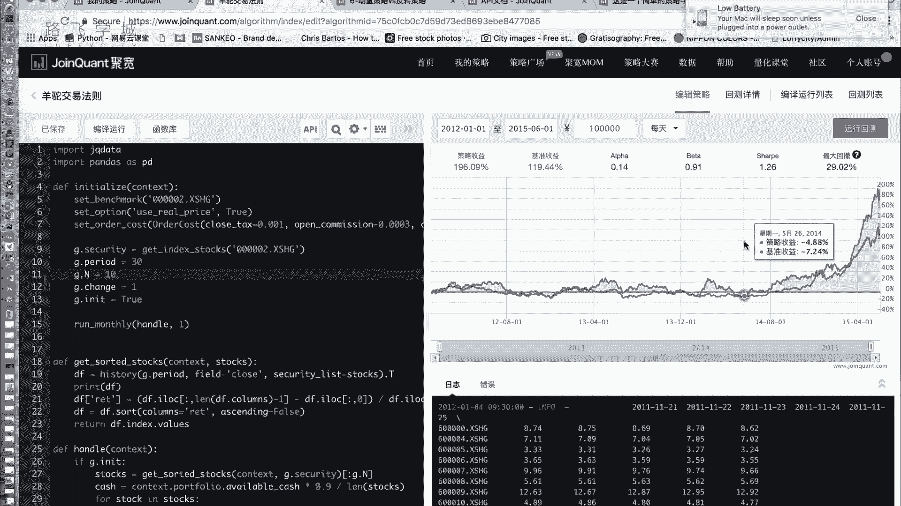
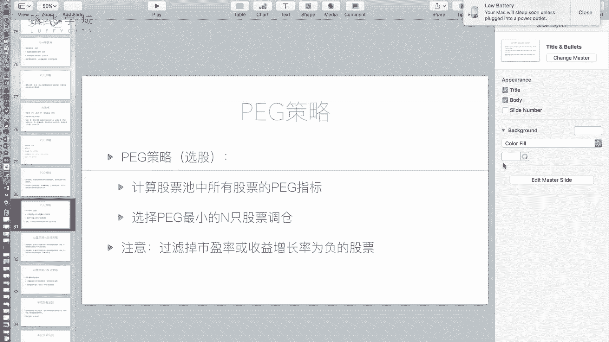
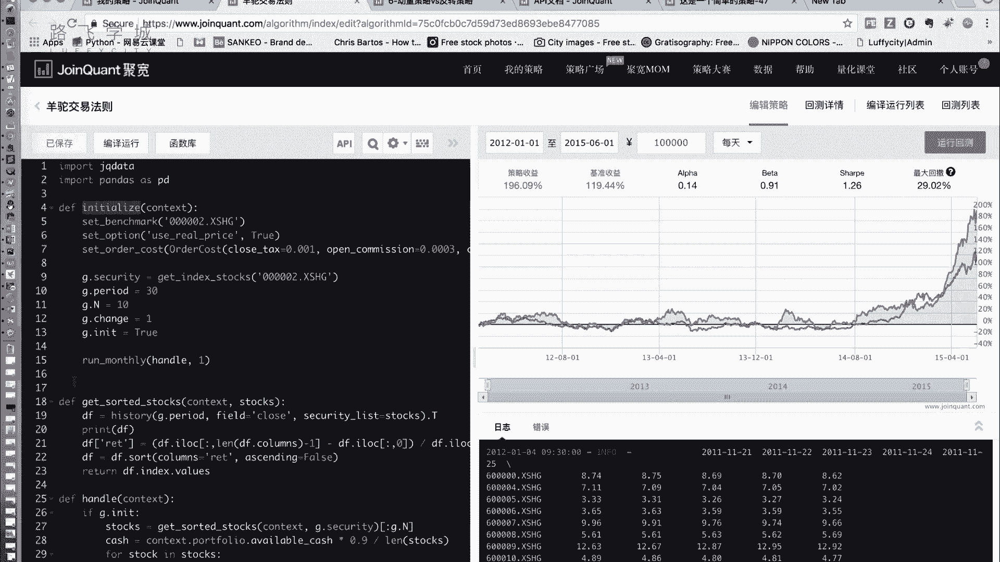

# 清华博士带你学习python金融量化投资分析与股票交易【附项目实战】 - P62：64羊驼交易法则 - python大师姐 - BV1BYyDYbEmW

好这个同学们，咱们还剩最后一个策略啊，叫做羊驼交易法则，什么叫羊驼呢，就不要乱说话，你看这这叫打马赛克啊是吧，就是但是那个动物，好像我也不知道这个名字怎么来的，这是我在也是在一些论坛上看到的。

大概是怎么来的呢，就是呃大概记得印象中。

就是好多之前是华尔街是哪，反正一个外国电视台做什么呢，就是做这一个噱头性的东西，让一堆猩猩相嗯，那因为现在选股票，然后就就留这些股票，然后再把再把这些股票里这个最差的几只，收益最差的几只扔掉。

然后再让现在再选几张，就这么随机的选，然后选完之后，说比某些华尔街专家的收益率还要高，真的啊，就是一个噱头，然后后来中国某个地方台忘了，是哪个甘肃还是哪，我忘了，反正也做了一个。

他不让新月给他让谁上羊驼去嗯，然后一号就变成了中国，就变成羊头对话啊，这个消息这个这个策略对啊，不是给错了啊，不好意思，这个特点很有意思，啥意思呢，它怎么做的呢，刚开始的时候啊，随机买N支股票嗯。

每天卖掉收益率最差的M支，在随机买入AM嗯，啊总结总结起来八个字，就是随机填选股周期调仓啊，买N支，其实就是你这买N支，相当于让你亲戚给你买大羊头给你买，无所谓，随机买嘛，然后你卖M制。

然后他宣称这个这个法则是好，为什么好呢，是他认为什么，他认为我就是像一个就是那种进化论，也是物竞天择，适者生存对吧，就是我随机N值就是一个这是一个生态圈，适者生存不适的那M数据最差的扔掉了，然后我再来。

然后这么这样，过了很长一段时间之后，我认为我这持有的N15号都是好5号了，但是即便是好股票，也有可能会跌呀，那你一跌咔嚓，你就给他卖掉了，所以说嘛，所以说我觉得这个策略就是有一些小问题，你这个股票它好。

它也不是一直好，他有可能就这段时间发展特别快啊，过段时间可能进入一个瓶颈了，写进这个瓶颈了，但是他就是声称是这样，那我也不知道，我觉得他那个那些例子是不是可能是个案，或者什么。

就是一些商业噱头来吸引的啊，那我呢我自己写了一下这个随机的，大家可以写一下嗯，但效果并不好，而且它因为是随机的，所以不能复现，因为这次回测跟下次回测本身结果不一样，我就基本上十次一次。

十次运行中找不到一次转子，就算找了一次转好不好，但是什么呢，我对它进行一下改进，怎么改进呢啊改进的话我不是随机选的，我应用了一下什么，应用一下反转层，啊不是反转的，这个效果比动量要高吗，那我怎么反转呢。

看啊我买入的时候我不是随机买入，我是买入收益率最低的N数股票嗯，等着反弹嗯，就是我刚开始先买N只，这N支我可能就是买收益最基本N只嗯，然后每个月或者说就是每个调仓日，每个月调一次。

每个月留下这里边表现好的嗯。

把这个月收，就是这30天内这个收益率差的这些股票，比如说选M支股票扔掉，然后再买收益率最低的M支股票，那你把周期调长了没，不是周期调长了，是我把他的随机选股改成了反转选股，就是我根据反转策略来选择嗯。

反正策略是什么来着，反正策略就是额收益率，前段时间收益率最差的收益率差的，接下来收益率会好，OK就是我现在选股，我现在买入不是随机买入了。

我怎么买入的，我买入表现最差的N支股票，好，我们来看一下这个代码，又不带大家写了啊，这都一样啊，这叫security设置什么啊，我这设的是A股啊，等设先先写一下那个沪深300吧，一会再看A股。

这俩应该差不多嗯，好然后period就是多长时间调一次仓啊，不是period，不是多长时间，是看多长时间的收益率啊，看多长时间的收益率，然后诶这个我看一下这个东西啊，OK然后N啊是我有吃多少只股票嗯。

称职是我每次调多少主的嗯，就是这个十是什么意思，就是我刚开始买十只股票，然后我每个月只只扔出去一张股票，然后再买回来一张新的嗯，就这个称是一，你可以设置称二，当然就是这个条不要设的太多，是我试了几下。

还是小一点的会比较好，然后这个INIT是true，这是一个标志，为啥呢，就是因为我刚开始要买N只股票，然后接下来除了刚开始的时候，接下来每次就是卖M只买M对，所以我设置一下它来就是两个不同的东西嗯。

那你看如果INIT刚开始是true嘛啊，如果INIT是true的话，我就执行刚开始的特点，刚开始的特点是啥，看啊，先把这些策略进行排序啊，这个get started dog是我这封装了一个函数。

它实际上就是按照收益率，按照算收益率，按收益率进行排序，这是我们之前那个反转策略就写过了，就是我只不过是把它封装封装一个函数了，按它进行排序，然后选里边的前N值，OK啊选里边前N值，然后把这些钱算出来。

就是这是每一个每一个，每一只股票能分到多少钱，我这还乘了个0。9，就是防止有点意外，就是每个每个股就是所有钱的90%，平均分给这些股票，嗯啊对于每一只股票，我给他买这些钱，就是刚开始随机买。

也不是随机买，就是选完了股之后买，然后1NE制成false了，接下来这个就一直不执行了，OK吧，接下来你在第二次执行这个handle的时候，就是下一次调仓的时候，因为他被制成false了。

所以他就不会执行，就是这这一部分只会在开始的时候执行，就是第一个执行第一遍执行它的时候执行，我是为了这样好，那调仓的时候怎么做呢，我还是先get sorted，然后把表现差了卖了，然后再选股啊。

再从什么呢，再从我哎，我看这是哦哦对，先卖了之后再从里边选股，但是选股就是不要和我现有的冲突，就是相当于是我这个东西再对它进行排序嘛，再对这点secret进行排序，这个里边是什么呢。

这个点stop是选出来，我现在这M支股票里最差的一支扔出去，然后在全局所有的股票里最差的一只买进来，嗯啊就是卖出去和卖出去，这两张都是最差的，但是不是一张嗯，你明白我啥意思，先卖掉一个对。

先卖掉一个卖掉的，这一个是我持有的这十单股票里边最差的，在我买回来一个全局里边最差的，不会买回来带那个，那买回来就买回来，因为基本上情况不会，你这十支股票，你这全局我选选沪深300的，还300支股票呢。

没那么脆，买回来就买回来啊，然后这个事就是对于我买回来的这些股票，然后呃不这是对于这些股票，然后我买买到什么呢，买到这个我当前持持仓的这个股票数啊，Positions。

这个股票数量的长度等于设定的值的时候，我就停掉，否则的话我就一直买啊，只要他不在里边，我就买啊，因为我们这只有这个趁着是一嘛，称着是一，所以这个基本上执行一次，买了一次之后，这就break。

然后直接结束掉这个循环，好这是我们的羊驼交易法则的代码啊，结果看一下其实还不错啊，当然没有，我现在做的这几个里面是那个视力小车值策略，好像蹦的最高啊，然投的这个也不错，改进之后的比改进之前的强多了。

比那个随机的版本强多了，随机的版本我就给大家演示了，大家有兴趣，有时间没事干，可以自己练练，下雪了下雪了，没人会上来的，就是跌的时候他好像就是市场差一点的时候，你看红线跌的时候，他也好像表现就差。

但是好的时候它一般比它要高，就是跌的比它多，涨的也比他多，最后147%啊，这个好像没有，这个是沪深300啊，如果把它设置成这个A股啊，好像表现比沪深300要好一点，我印象当中啊也可以试一下啊。

这就是我们给大家讲的这个仰头交易法则，改进之后扬套交易法则，这个就是我讲这个就是为了给大家说，就是我们这些法则其实不一定是说现成的，就一定是对的或者怎么样，其实这些东西都是可以改的，都是可以。

就你改个参数，可能他就会对，改个参数就可能差好，你改个就是你某些参数，包括我们之前讲的各种策略，你改0。1可能就差几千块才出去，所以所以所以就得经常提，所以这个东西是这是那怎么改这些参数呢。

有的有有的就是但是有的就是经验，包括有好的通过大数据啊，通过什么机器学习这种东西来做，嗯啊当然这些技术当然也需要一些金融知识啊，这个是196，比刚才那个稍微好一点。

嗯好这是我们给大家讲的这个羊头交易法则。

那到现在为止，我们给大家准备的这些啊，简单的金融量化策略就讲完了啊，还是比较实用，我没有讲一些，就是有有可能稍微表现更稳定一点，风险没有那么大的，但是这个因为有些金融知识大家可能不了解。

所以我怕大家呃听不懂，我就没给大家讲，比如说大家可以看一下，除了压缩交易法则，还有一个叫做鳄鱼交易法则啊，还有一个叫做这个海龟交易法则，我看到了，那除了这些，还有一些什么这个什么啊。

呃各种高级的金融指标啊，这个各种这个呃这个比如说那个什么法砝码。

五因子模型，三因子模型等等啊，各种各样的模型啊，大家就是如果你有一有一定的金融知识，没有金融知识，建议还是去了解一下，没有有些金融知识知识的话，可以就是平台上还有一些这个社区讨论。

也有一些这个他的自己的一些在量化课堂里，有一些他讲的一些策略，那也可以就是大家就是如，其实只要你知道了一些策略嗯，你不管哪知道的，你了解了这个金融知识，知道了策略，你就实践其实很简单。

但是最难的是你这个策略不好获取啊，当然这个我也没办法，并且并且真正在市场上看到，你看到这些策略都是公开的，其实好多都不管用了，对不是不是不管用了，就是他简单，真正的他可能是说我一个什么基金公司啊。

一个金融公司，我是一个团队，可能做出来一个策略，调了一年，一个月，两个月甚至一年的参数才把它调的特别完美，对啊，你说我想一天搞出来不太现实，当然当然还是值得一试的，就是有有兴趣的可以研究下。

比那些瞎买的散户强，对对吧，对而且这个如果你说我已经超过很多年了，我很有经验，那你把你的把自己的变成策略，哎，你说你这个什么布林带，你写的不对么，你这个收你要判断布林带的这个宽窄，你这个羊驼写的不对。

那你可以根据自己的改，只要你你用，你只要你会开放，对就没问题，那我们给大家讲，只是讲方法，对，不可能每一种课都给大家讲到哦，那我们成讲金融的好，那这个在平台上，在这个聚宽平台上做讲一些简单的这个策略。

然后实现一下，看一下回来效果就给大家讲到这，那啊接下来我们还有最后一个是什么呢，就是有的人就是可能是想去一些这个，金融公司做啊，或者是他不想用平台，自己写一个简单的平台，其实就这不用它。

但是我们写的是简单简单的，不能再简单，就100多行，不到200行啊，当然基础功能都有，你可以在上面跑双均线好，下一章再讲那个是吧，对，然后我们就差这一个给大家，这个之后你说我对开发有用。

我想去这个金融公司做开发，那可能是啊，可能不会让你从头去开发一个，这个这个这个平台了，那可但是可能他平台升级呀，这这个加新功能啊，这些东西，所以说还是有必要了解一下，但其实都不难。

就只要你就是去实现一下它的引进上来，它初始的时候调用一次handle data，每天调用一次，然后一些获取数据的函数，然后一些这个交易的函数等等，这些函数你可以写出来就可以了，嗯好好。

那我们的这个就讲到这。

OK接下来我们还有最后一部分。