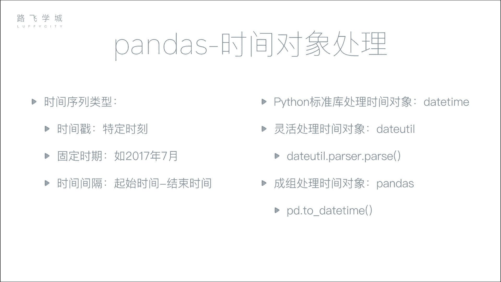
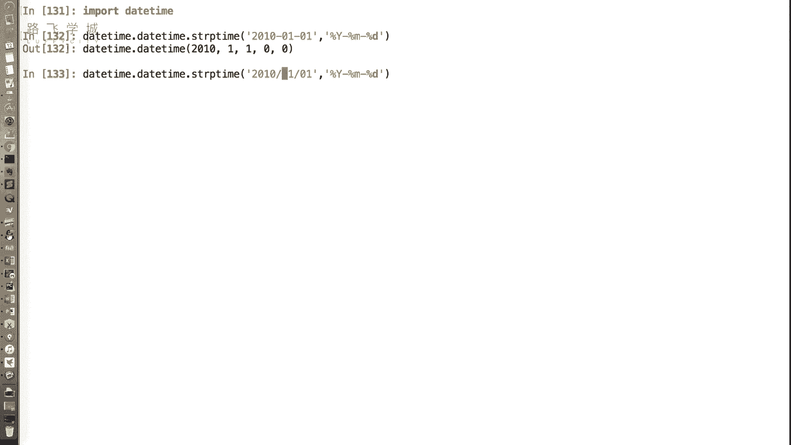
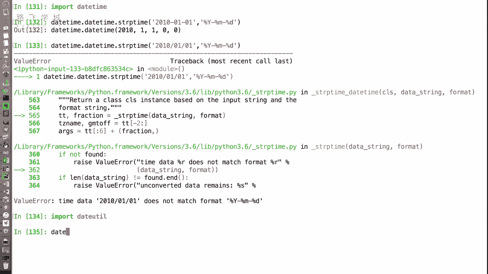
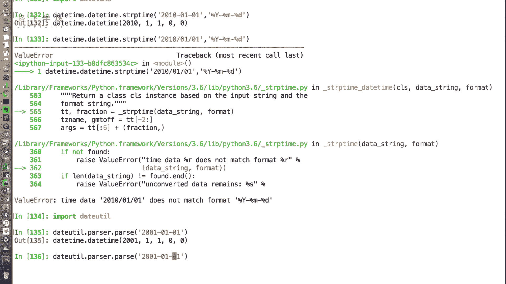
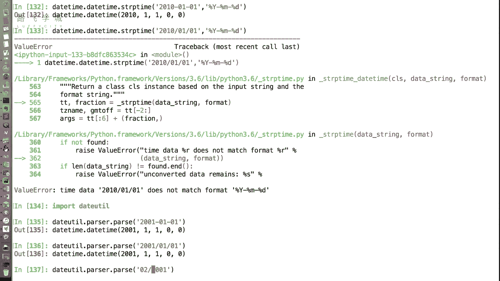
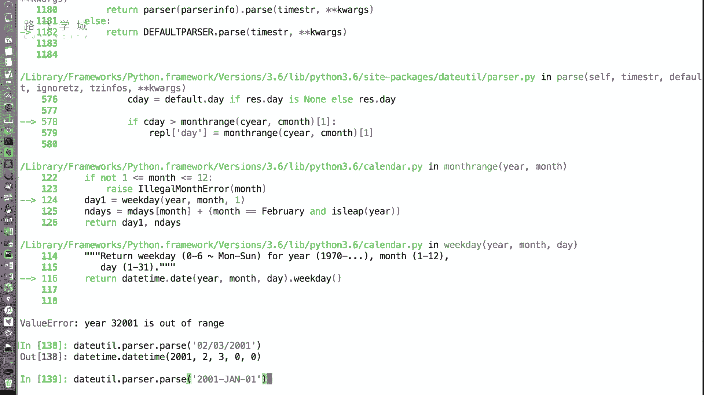
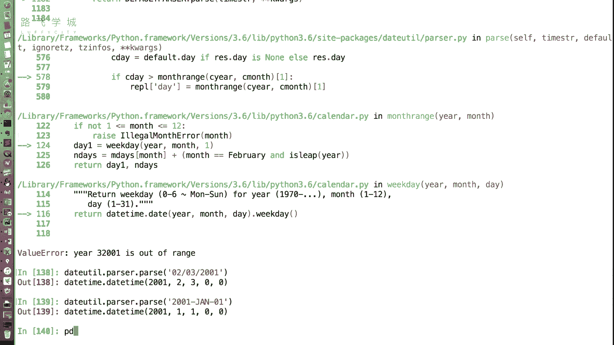
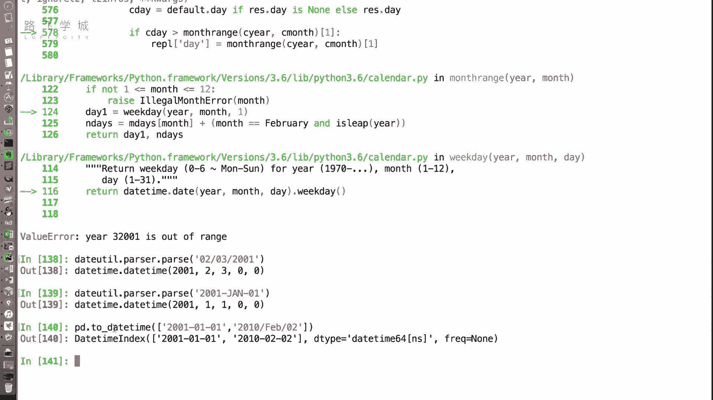

# 清华博士带你学习python金融量化投资分析与股票交易【附项目实战】 - P27：27时间处理对象 - python大师姐 - BV1BYyDYbEmW

好同学们，接下来我们介绍一下pandas as这个库里，对于时间序列的支持啊，对于时序数据的支持，那在说这个时间序列之前，我们先来说一下时间对象啊，时间对象大家在Python基础的课程中。

可能已经了解过了，那我们Python标准库处理时间对象的这个类和方法，是date time，这个库data time和time对好。

那data time里有一个方法，就是我们如果把一个字符串转换成时间对象，是什么啊，什么II这个s t r p time好，Date time，点STRP还是F呢，忘记了哎P啊。

怎么记这个函数给大家说一下啊，P是什么praise，说什么praise，praise papraised就是解析解析的意思，可以是怕pass p e r s e吗，purpose啊，他说的对对。

pass我就叫PRISER啊，好passer，那就是passer好，那也就是说把字符串解析成对象啊，F是什么，F是format嗯，所以就是格式化打印，所以把字符串变成这个对象。

是s t r p type好，应该是data time，点data time啊，第一个daytime是模块，第二个data time是类s t r p time，它的第一个参数是什么。

格式那字符串后面是格式，后面是格式，比如说百分号YY，百分号M百分号D对啊，转换成的我们的这个实验对象，但是这个转换比较麻烦，我还得每次都要输入一下格式化字符串，那我如果有一些数据，我现在有好多数据。

这个数据可能来源于不同，来源不同，可能有人是杠写的，有人是斜杠写的，有人是横杠写的。

有人是斜杠写的，还不一样对不一样不一样，我还能自动检测吗，对能自动检测吗，有一个库叫DUTIL，哦啊这个库如果你装了pandas as之后，这个库已经自动给你装上了，自动给你安装好了。

因为它是pandas需要的一个库，好DUTIL这个库里有一个passer。

点passer是一个子模块，点pass函数传2001杠零一杠零一哦，直接转换，不用输，不用输入任何的格式化字符串。

支持各种各样的嗯，斜杠没有问题，比如说这个好像外国人有把年和月写在前面的，还有把月和日写在前面的，有这样的啊。

这个哦往往下斜杠，对不对，甚至啊有什么呢，2001，外国人就这么写的，对不对。

月份他是有缩写，这是什么1月1号JK啊，但是中文的一些格式，比如说2001年中文是不行的，因为是毕竟还是外国的写，他就把各种这种各种有可能的模式，对你都能给你配置好，OK啊。

所以这是用date u t i l帮我们做的，那我们现在说的是，如果我有好好多好多数据，那我都想转换成实验对象，为什么要转换成实验对象，这里我们后面会说到转换成实践对象，所所以才会有更好的方法好吧。

更更多更好玩的用处，OK好那啊不是daytime了，那我们的pandas。

给了一个to date time的函数啊，这个函数传入一个列表，就是能把批量的时间，这个字符串转换成实验对象，比如说我们简单试一下2001，我就是两个，可以吧，它们格式不一样啊，换成斜杠，到账号了啊。

你传入的是一个列表，这个数组什么都好啊，都能够自动的给你转换成一个，我们看它转换成什么daytime index，也就是说，这个东西是我们接下来最好用来做索引的，为什么要做索引呢，我们后边会说到好。

