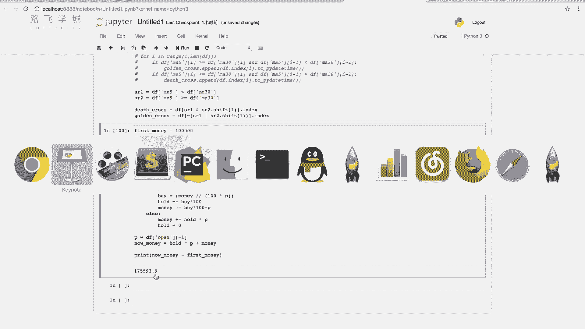
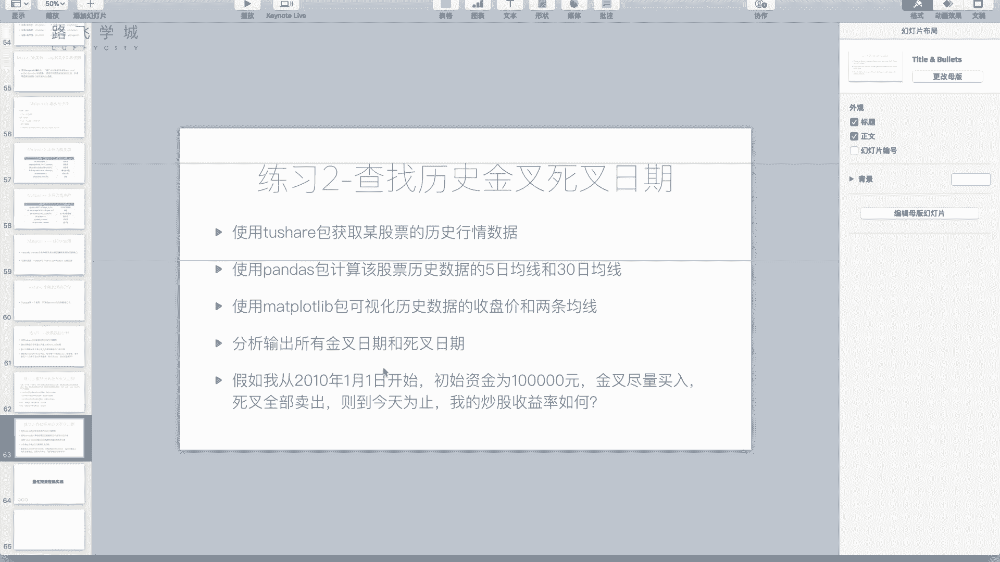
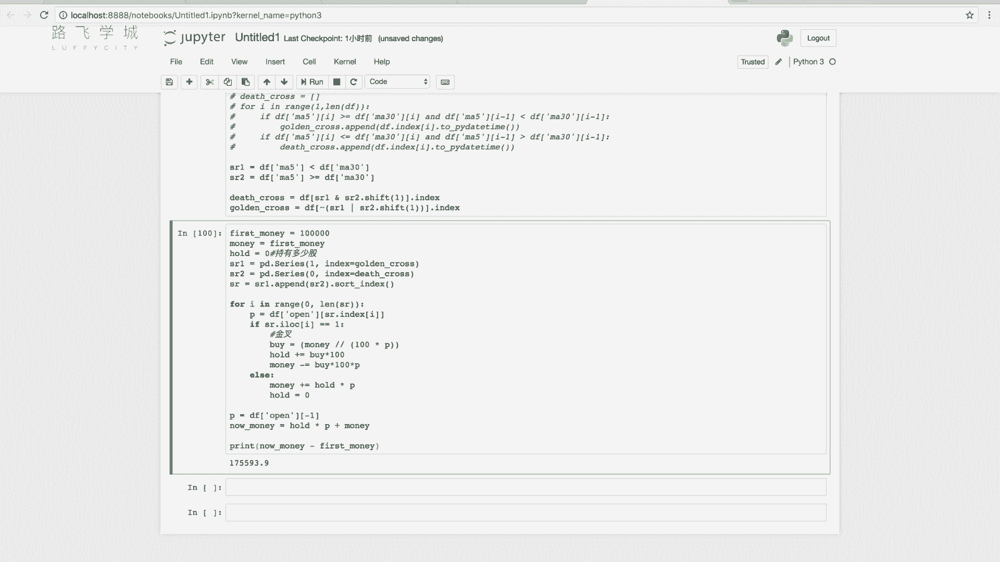
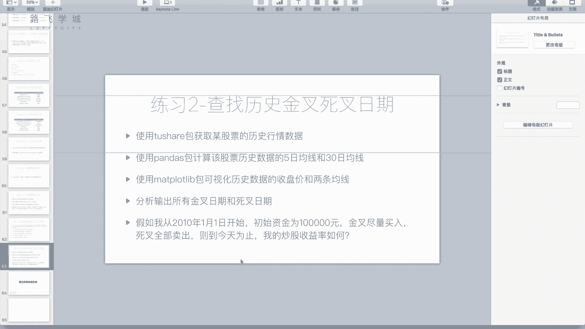

# 清华博士带你学习python金融量化投资分析与股票交易【附项目实战】 - P44：45双均线分析作业2 - python大师姐 - BV1BYyDYbEmW

好同学们，那我们现在这个还剩最这个第二个练习，还剩最后一问啊，也就是模拟一下，如果我使用双均线策略来炒股啊。

收益率怎么样，好我们可以看一下。

首先啊就是我们是从2010年1月1号开始，所以现在为止我们的DF啊，DF其实没有用，我们的之前不是求出来了，我们的这个金叉和死金叉和死叉了吗，嗯那这些我们只需要保留10年之后的，就可以啊。

好那么这个其实我们就是从我们最开始吧，我们改最开始的代码，我们改DF在求金叉和死叉的时候，在这啊job a之后，我们的DF等于DF，从2010年1月1号开始到最后就可以了，对不对。

然后从这开始运行两下啊，这个时候我再看，比如说我看我的死叉，应该就是从看10年才开始，10年4月29号，这个好，那我们接下来这个要写代码，就是算收益率了，怎么算呢啊最开始有1000块钱，有10万块钱。

什么1000块钱，假设我们有10万块钱，对不对好，那我要炒股就是遇到金叉买入，遇到死叉买入，那我先遇到的是金账还是死叉呢，这个不太好定，现在金量XXX存在两个列表列表里，两两个数组里。

你怎么把它搞到一起，最好我是把他俩整合到一个列表里，是不是好处，一个我看他是金叉是啥哈，金叉买入42好卖出，这是不是特别好省事，现在是两个，那怎么搞，有一个小的，大家可以开动自己的脑筋。

有好种有好多种方法啊，我这说一下我的思路，我的思路是啥呢，我把它俩存起来啊，我建立两个这个两两个series，第一个series panda点series，好值都是一啊，值都是一键index索引。

也就是这个叫做它的标签是什么呢，是golden cross cross，好看一下SR1是啥SR1是不是，这个所有金叉二是见这个啊，一是这个就是它的值啊，为啥要一呢，还有一个SR2啊，不是一。

就是我来区分说一就代表金塔是值是一的，这一列就代表金塔这一行好，0index等于golden cross，这个应该是death cross好，那SR2也是类似的，相当于建了，那我把它俩拼接到一起。

怎么拼接到一起，不是SR1加SR2啊，SR1加S2会发生啥啊，其实SR1加加S2也行，应该因为他是你看一下啊，SI加R3你看都变成这个了，为啥会变成这个，之前给大家讲过啊，是SI1加SR。

我们的加是对应这个索引相加，是值相加，但是这两个肯定SR1和S2，索引肯定没有一个是一样的，就他们互不一样，所以肯定都是一加NN，一加NN，一加NN啊，为了解决这个办法。

你可以怎么你可以SR等于SR一点I的，之前给大家讲过的啊，Sr2，然后噗嗯但是你这个的话就嗯可以写，fill value等于零，好我们看一下SR，因为它只不过是变成浮点数了，这个好说。

因为我们给它变回来啊，你看这个是一，因为肯定是一个金叉系列，一个叉或者是10101010都没有问题，这为啥，因为是一加上那个没有的零，就是零，所以是金叉肯定最后变成一死叉，肯定变成零啊。

当然这个可以写出来，但是不那么直观上不那么好理解啊，怎么把两个series拼接成一个series，我们有一个方法叫做append，那喷跟列表一样，也叫老喷子啊，SR一个喷的SR2，你看下它是啥呢。

是不是一或是零哦，但是你看他现在不是一个一一个零交错的，为啥因为你看他是把append就是放在后边的嗯，所以我们还需要对它进行排序，我们是不是按时间排个序就完事了，对对怎么进行排序。

sort index是按照索引进行排查区，那你看一个一一个零，而且时间都排好序了，好我们把它标记成S2，接下来我是不是就变脸SR就可以了，变脸SR看这一列，看这一行，如果是一就表示这是个金塔就买入。

如果是零里边这个X还是排除就完事了，好接下来for循环，I in range，零到SR的长度，那我看一下这个值到底是一还是零啊，if什么if这个SR的，对啊，用I也行，最好我想用i lock。

因为防止出问题，i lock i就是这一行的这个值等于一，那我是不是就是表示这是金叉，要买入了，对不对，怎么买入呢，算一下能买多少股，对不对，那能买多少时候，我还需要他是多少钱呀。

对我需要知道他是他是他钱是多少，他钱是多少，10万钱是10万，那我能买多少钱，是money，能买多少，能买多少，我就需要知道什么，我就需要知道这一天的股价是多少，对不对，那怎么知道这天的股价是多少。

我去DF里查查开盘价，对不对，好DFDF，然后列是不是应该是就是行索引，是不是应该是I这一天对应的，比如说I是零的时候，是不是这一天对不对，那我应该是什么SR点index哎嗯这个就表示什么。

这个就是这一天的那个价格，对不对啊，我看P存一下P等于它是不是就这一天的价格，嗯啊其实这个P的话不管是买入还是卖出，我们都要算，所以不如放在这啊，算出来的价格，如果是买入的话。

那我就接下来要算我要买多少，我要买多少，怎么算，买除就是money除以除以什么的价格，100乘以PP，因为我至少一买买一手啊，所以我就算出来100股要多少钱，一手要多少钱，那我除以它整要整数对。

整要整数，要就是取小的那个就是取，比如说算出来是3。5，那我就买三，就是说买三手对啊，买三手，这些是我花的钱，这些是我买多少手，对不对，这些是我买多少手，然后再怎么样，再乘以100乘以P啊，先不这样了。

我还是存，因为我还要存一下我买多少手，所以这个我是写什么to by等于它好吧，这个by对to by了，by就拜吧，等于他这是我买多少手，那我除了要维护，我说我现在有多少钱，我是不是还要说我有有多少股。

对不对，对后的我这样就是多少股啊，后置就是这个这个现在持有多少补多少补，啊然后这个地方hold就应该是不加等于by乘100，因为by是首个单位嘛，所以凸后的算来之后，接下来要是更新前，对不对。

因为我买完之后钱少多少呢，钱是不是减等于什么半乘上，100乘上P不对啊，这是不是这个金叉的时候，买入的时候我干了这么件事，对那死叉的时候SR点i lock，哎哎没有衣服了，else就行。

就是少了else卖出，那要卖出卖出就是说我还是要看价格，价格是P知道对不对，那我厚的是不是有多少火，那我是不是厚的乘以P，是不是就是我能卖多少钱，对那能卖多少钱，我是不是加回到我的money i上，对。

加，那hold是不是变成零就完事了，对不对，好for循环完了之后，是不是算一下我多少钱好，剩多少钱呢，money是前数，那你同时还要算上最后一天的股票价格，乘上你持有的股数，因为你万一最后一个。

因为我不知道，你现在看万一这个最后一个是金叉，对不对好，那正好金叉之后，我现在有股票收益对，所以我算收益率我还要加上股票的钱啊，所以是股票的钱是后的乘以PP是多少，知道重新算P了。

P等于DF就是最后一天的股票价格，股票价格啊，open-1对嗯，是它的价格吧，好厚的乘以P是我股票值多少钱，加上money是我线下的钱，对不对，比如说我叫NO money，就是现在的钱数。

那我算赚了多少钱，我就打印一下什么，打印一下now money减去money减去别减去money了，因为money被改过了，所以我这还来一个什么，我这来一个这个first money啊，然后是10万。

然后这个money等于first money，就刚开始的钱啊，这样的话这个值一直不会改啊，这改就改它，好NO money减去first money就是我们赚了多少钱啊，看一眼运行一下又赚45万哇。

太好赚了，这钱，因为我投进去的10万比较多，如果投进去1万，那就赚3万啊，赚的还是挺多的，因为中间有个牛市啊，还是说策略写得好，这个其实这有多少年，7年赚这么多钱，不算特别多啊。

因为你这个是你一直投进去，当然你如果说赔了的话，你可以试一下，你在15年6月份，15年1月份到15年12月，15年做一年，这个额就是这个叫这个双金线的话，你看一下他能赚多少钱，嗯啊看下超市上涨多少钱。

那个也挺有意思的，那个是股灾啊，你可以看一下这个你这个策略能不能躲过去，古代有可能你这个策略写的好，把国家躲过去了，有可能写的不好，躲过去了啊，其实还可以看我赚这么多钱，可以了可以了，很不错啊，很不错。

就是这个策略还是比较有效的好，那现在我们这整个这个例子写完了啊，大家可以回想一下，就是你写完了的时候，大家回想一下，就回顾一下整个东西发现有没有什么问题，反正我是写着写着发现一个问题，什么问题呢。

我这个金叉和死叉，是根据当天的收盘价设计出来的，对不对嗯，那收盘价其实你今天的话你看不到收盘价，你只能看开盘价，比如说今天我决定因为我实际中买股的时候，我今天我看我是不是金叉还是死叉。

我肯定是比如说九点开盘，我肯定是09：30看一眼开盘价，那开盘价如果看一眼今天的开盘价，有了我就能算今天拿开盘价，算今天的这个呃一中均线，然后我才能判断出来今天是新的还是死叉，对不对。

我判断出来今天是金叉还是死叉之后我才能买，所以算金叉还是死叉的时候应该什么，应该不用收盘价，应该用开盘价才是符合事实的啊，所以应该这里用这个open open嗯，应该有open。

然后你再就从上往下再运行一下，你看一下最后结果会不会变啊，我不知道好像没有，它变了有变了吗，变了刚才3万多，现在1万多，1万多了，变了，说明有一些影响啊，有一些影响，这个是什么呢。

你的收盘价其实哎这个刚才10万的话，不是17万，是三是吧，42万，所以你看刚才你看这个差了这么一点，差了多少，差的还是很多，为啥会差那么多呢，想想就是看完100，你提前预知到了后边的信息。

就是我刚才写的代码，相当于是我是拿收盘价算出来，就是说我在这一天买，我能预测出来今年的收盘，今天的收盘价的趋势，其实收盘价是更加能代表这一天的这个价格的，开盘价不太能代表。

但是我们判断今天是不是金山二手杀，我只能通过开盘价来判断，因为我还没有到收盘价，当我知道收盘价的时候，我今天已经不能买了，对啊是的，所以说这个因为我们提前预知了信息，所以可能是对结果造成了一些影响。

当然这个影响是一定是，就是说一定是说这个是会增加你的收益吗，这我觉得倒不一定，大家可以做实验来验证一下啊，验证几次嗯，好说这么多，我们这个这个练习题啊。

就给大家讲到这啊，不是那么这两个习题都不是那么简单，都不是那么好消化，希望大家回去自己能够亲手，不管是不是按照我的方法，或者你自己有自己的思路，自己亲手写一下啊，感受一下，就是其实这也是好多这个这个啊。

在这个金融公司或者是这个基金公司，这个做技术的一些人员干的一些事情，往往都是比如说金融，他们金融人员他们做一些分析，好分析出来，给出来一个策略，那技术人员你把这个策略实现一下，就是拿一些历史数据跑一下。

看这个收益率会怎么样做一些简单的，这就是回测的一个模型。

那其实啊如果说这个我们个人炒股的话，不是说金融的话，就是基金公司可能刚开始都是这样一些步骤啊，他们都是这样一些步骤，然后再往后说这个策略基本可行，你再放到你的自己的基金平，基金公司的平台上去跑。

或者去怎么样，那个再说，那我个人的话，其实这样写还是比较累的，就想的东西比较多，东西这个写的东西也比较复杂，嗯那如果说我个人想炒股，我只是想简单的验证一下，做一下回测，有没有好一点的方法用。

那就是利用现成的一些平台啊。

在他们的基础上来做，那我们这个部分讲完了，接下来啊那个部分就是给大家用在线，在在线平台上做一下策略，然后跑一下回测，看收益率。

