# 清华博士带你学习python金融量化投资分析与股票交易【附项目实战】 - P46：48 第一个量化策略-2 - python大师姐 - BV1BYyDYbEmW

OK好同学们，那我们刚才说了这个initially的函数啊，可以看到刚才打印的话，你看到这个函数啊，这里有日有时间，这个时间呢这写的是16年6月1号，是什么呢，是我们开始的时间嗯。

刚我们打印一下那个这点C位，他只打印了一次，对吧嗯，对不对，就是只是也就证明什么呢，这个函数只在最开始那一天执行一次哦，好接下来是什么呢，是我们说如何做到，就每天我要干什么事。

那这个东西写在另一个函数里，这些属于ho data，啊在HAO对象里写的东西，就这两个函数，你不需要进行调用，你只需要把这两个函数写完，其他事不用你管，基本上就是这样，当然有一些其他的写法。

我们后面会介绍，现在就是最简单的写法，就是这个一个一个一定是来自一个HDA嗯，那在handle data里我们可以做一件事，比如说我们还是打印一下这个啥，就是打别打印下什么。

打印一下这个打印下这点次数啊，打印一下，先简单打印个，随便打一个字符串，好运行一下，我们可以看到它是什么呢，你看6月1号，6月2号，3号六号七号八号，13号，14号，15号是不是每天都打印一次。

说明这个函数写完之后，他就每天执行一次，但是因为我们还是没有买卖，所以他是一直是零的，对不对，一直是零的对好，那为啥会说这个3号之后就6号呢，因为5号和4号和5号肯定是周末肯定不上班，就是修饰了啊。

对所以它是会在每天的每个交易日执行一次，其实并不是说每天执行的是每个交易日行次，对啊，不交易的时候不执行好，那在HDA里我们就可以做，我们自己的事，就可以把主要的策略的部分写在这里边了。

那我们之前说过是有哪些事呢，第一是不是获取数据，对对不对，怎么样获取，说比如说获取历史的价格，获取当今的价格等等等等，好你这给大家讲几个函数，第一个啊怎么样获取，当就是这个价格啊，因为我们说什么呢。

现在是按天回测吗，对他按天回测，其实这个就说这个回测框架做了，就是简化了一下，我们说按天一天内股价是不是都在波动，那我按天回测他按哪个价格给我交易呢，就是我九点来和十十一点来，可能成交价格不一样。

所以他其实这个框架默认的就是按天回测的，成交价格是定的什么呢，定的开盘价，开盘价加一个滑点，那个所谓滑点其实就是有一定的小误差，就上下可能波动一些，就大概是开盘价就是这样好。

所以其实我们想获取当前的价格，我们能看到的是历史的价格，就是昨天的所有价格，昨天的开盘收盘最高，最终能看见今天呢我们只能看到开盘价啊，那今天的开盘价怎么获取呢，叫做这个get啊。

current data函数能够获取今天的价格的啊。

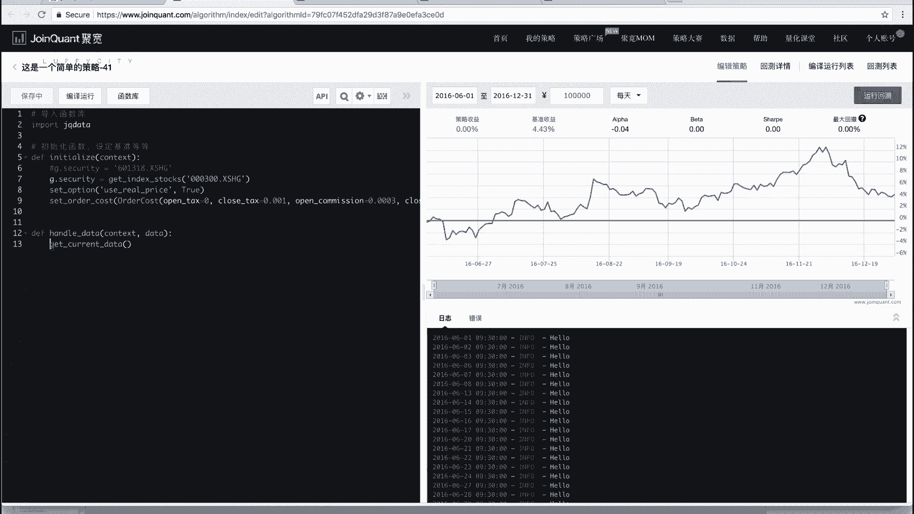

就是这些怎么样获取价格的，获取数据的函数在这个里边的啊，我们的get current data在哪这儿呢，看到没有这个大家到时候可以自己看一下，没有参数这个函数啊。

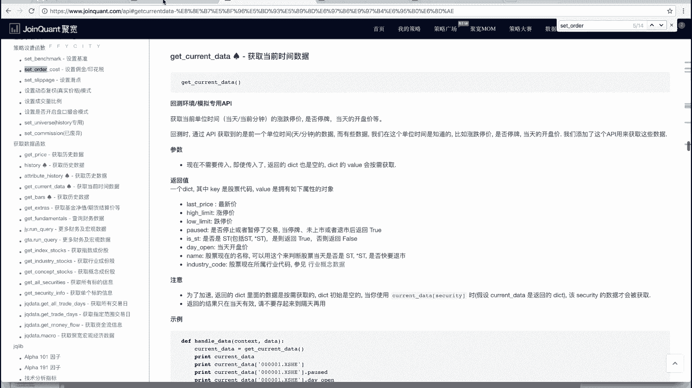

你打印一下这个函数，看到看它它返回啥，能把时间调的短一点，因为我们测试了6月1号到6月3号，3号。

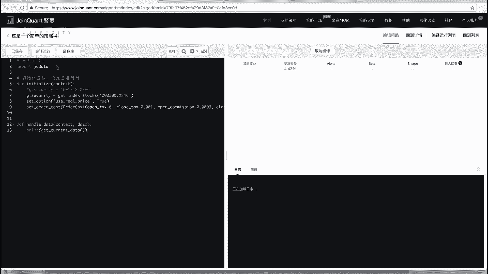

啊他其实应该就返回的是，这应该说的是一个字典啊，然后字典里包括这么几个值，但最新的价格，其实最新的价格基本上就是开盘价，最新的价格是什么呢，如果说你是分钟按分钟回测的，你最新的价格是不一样的。

就是如果说你这里选的是按分钟进行回测。

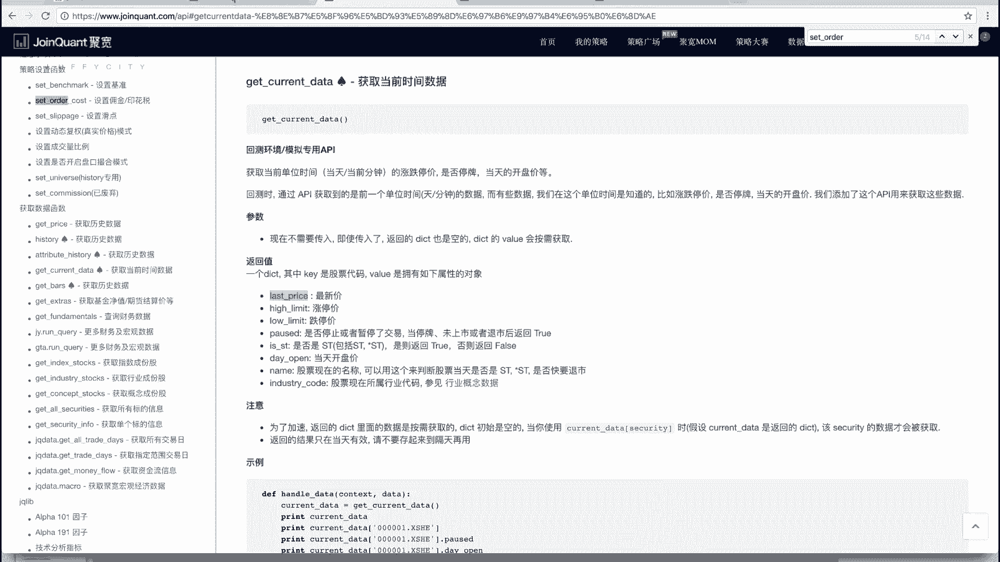

那这个函数是每分钟执行一次嗯。

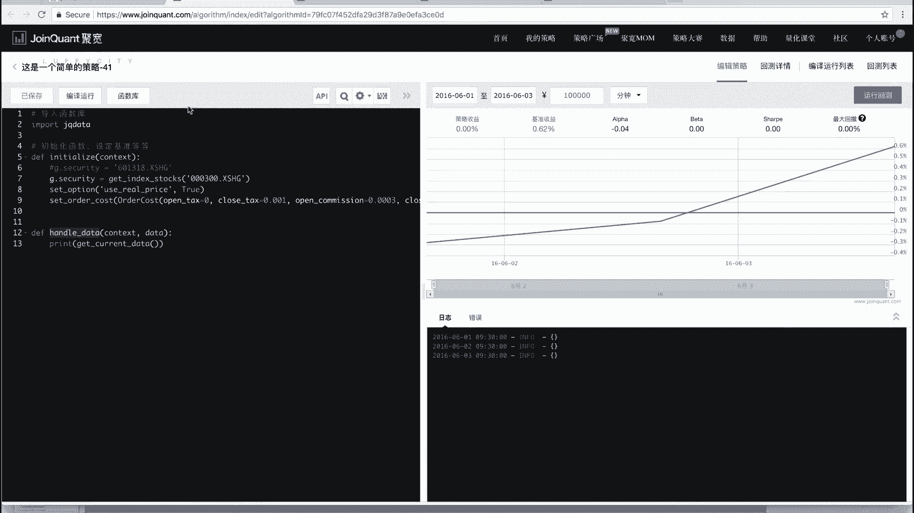

那你的这个每天执行最新价或每分钟更新一下，OK吧，但是如果说我们这个按天回测，那最新价其实和开盘价是一样的，流行对就是一个样子，然后涨停价和跌停价是什么呢，因为我们说过A股是不是涨停和跌停。

对今天的就昨天收盘之后，今天的涨停价和跌停价就已经出来了，你的价格只能在这个范围波动，你也可以获取到涨停价和跌停价，也不用自己算嗯，然后这还有一个pose的状态就是什么呢，就是今天这个股票是不是什么了。

这个股票是不是啊停牌了就不交易，叫停牌暂停交易啊，如果这个股票停牌，或者说你传错了，这个股票没有这个代码，没没有上市，或者是他已经退市了啊，他就是返回的这个pose就是true。

就是说这个股票现在不交易，交易不了，然后什么is s t之前给大家讲过，是不是s st股对ST股special treatment啊，就是就是这个股票现在表现不好啊，开盘价，股票名称。

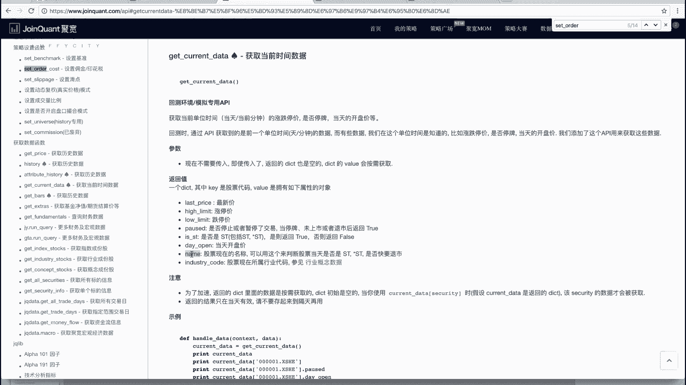

Industry code，行业代码啊，这个我们不管，我们可以看诶，这个为啥是个空字符串嘞。

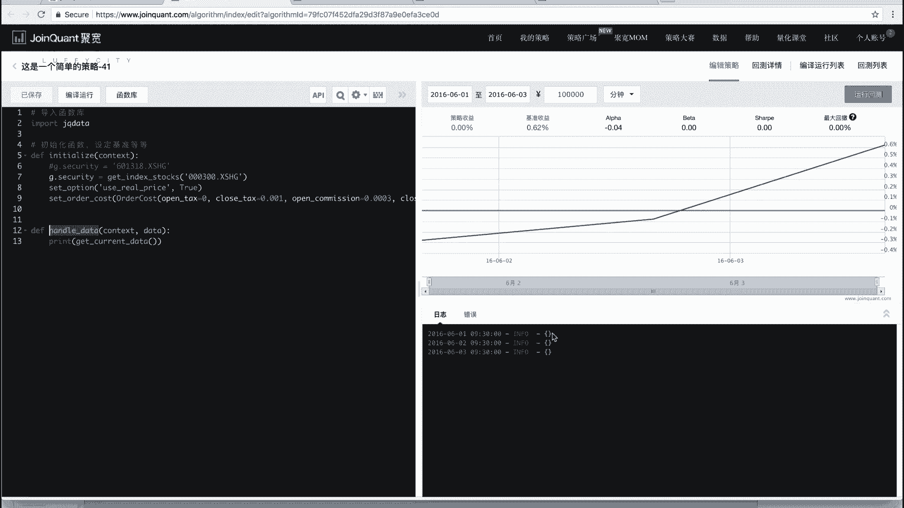

嗯这里面没有纸哦，这个是按需要所获取的。

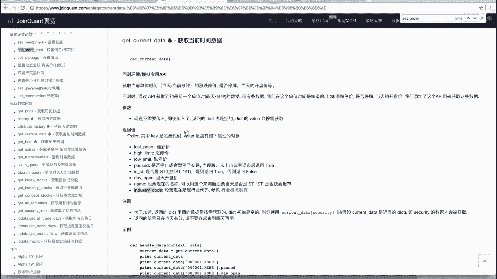

就是说我要给他传一个东西吗，对我要给他传一个，这个我要给他传一个股票代码，比如说我传啊，601318，它本身是一个就是字典，如果说你不传它进去，它是不不会给你获取值的，这怎么报错了，六零啊，出错。

601318点XSHJ，他就是个返回一个字典嘛，然后字典就是键啊，他是获取的时候才会被返回哎，看到了，但是看到这个东西，它就是一个object对吧，是不对，是个object。

那这个object它有一些属性，这些属性是什么呢，就是这个你再点它就可以了，比如说我想获取今天的开盘价，就点day被open呃，Open，我们这是不是按分钟回测的啊，重新点一下，按按我们按天回测。

啊按天回去的话，他这就应该会显示出来看三天的价格，这一号2号三号三天的三个开盘价，这是我们获取今天的数据，OK吧，那比如说我们想获取啊，另外一个我们想获取可能获取历史数据，那立数据怎么获取呢。

改成黑色啊。

这也有三个，我们现在介绍就是三个函数额，两个函数啊，其实是想看get price history和attribute history，这个我们先说这个attribute history。

剩下两个我们接下来的策略可能会就是用到，再讲好，attribute history是获取某一只股票对的数据。

它返回的是一个什么呢，我也看一下啊，attribute history啊，好多参数我们可以不都传进去，我们传第一个就可以security股票代码股票，比如说我们这传啊，6013还是这个601318嗯。

点SSHJ，哎打印一下忘了打印了，Print。

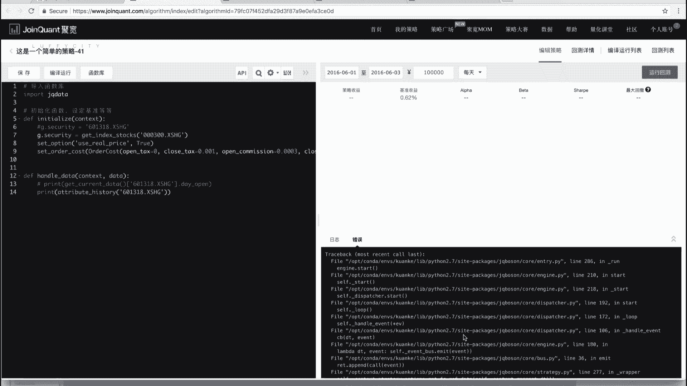

啊activate history是两个参数吗，很少哦，对第二个参数，第一个参数是股票代码，第二个参数要传是什么呢，是叫叫count，叫数量就是什么，其实是什么，其实是你往前要获取几天的嗯。

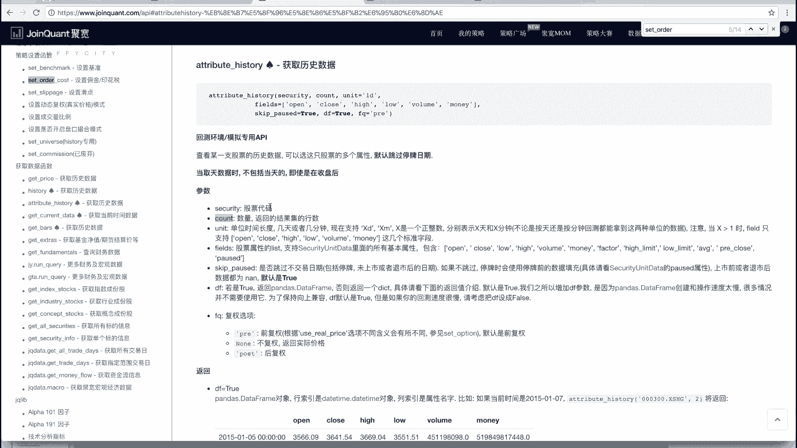

就是attribute history，它返回的是离今天最近的那一段历史哦，明白吗，比如说我们这传个一进去就看一下，这只有一条，前天，嗯他这返回的看每一个每一天打印的，这打印的有点错位了。

但是你可以看到这是个什么，六列，然后这是它的索，这是它的行索引，这是六个值，它是返回的这个data frame，就是我们之前给大家讲的，pandas里面那个data frame啊。

他你看一号它返回的是不是前一天，5月31号了，对2号返回是不是一号啊，3号是返回2号的嗯，那这如果传一，如果我传五呢，那他就每天就是每一天会返回，前五天的一个历史数据。

嗯好那这它返回的是一个data frame，这个data frame里一般包括看开盘价，收盘价，最高价，最低价，成交量这个事，就这个成交量成交多少股，成交额，总金额成交了多少钱的。

嗯啊这是你看这是不是传五的话，这是不是前五天的一号返回的是31号，30号，27号，26号，25号这五天的数据，对不对啊，这是说怎么样用一个历史数据，那除此之外还有一些其他的这个API。

那到时候我们用到会给大家说啊，好获取这些数据，我们大概说完了好再说一个什么呢，怎么样下单下单啊，怎么样买或者卖，这是我们关心的，对对对对，这是我们这相当于是除了他之外，除了获取数据之外最关心的啊。

那怎么还呢，有几个函数，最简单的这个order函数，两个参数啊，第一个参数股票代码，比如说601318点SXHJ，代码第二个是你买多少股，传股数啊，比如说我们这传100，那我这样写啊。

我们这个蓝线在运行的话，我们这个蓝线就不再是一条水平线了，哎你看这个蓝线现在有下跌了，我们那时间稍微放长一点，我们时间稍微放到放一个月，Ok，好，同时我们可以看到我们的日志也会出来，一些事情。

也会出来一些东西，好订单已提交什么，这都会给你自动打印info，这实际上是一个这个log，如果说你不想看见这些太烦了，这是什么玩意，这是布拉布拉布拉的，你可以设置一个login的这个状态。

就是跟我们那个log状态，那个logo模块内置模块设置一个状态，你是比如说我warning开始或者error开始，你这些就没有了啊，哎这个时候我们可以看啊，不管黄线还是看蓝线，它不再是一条水平线了。

它有波动了，为啥嗯，为啥这个波动是因为我们买了股票的对吧，我们这样做相当于是一天买了100股，一天买了100股，一天买了100股，对不对，没有卖没有卖的话，现在应该还没有说到钱，没有的时候。

就是还是一直10万块钱还是比较多的，一天买100kg还是有钱，嗯啊那比如说这个位置，就是说我们之前说过A股，就是啊国内的操作是，你买股票必须是买100的倍数，买卖必须是100的倍数。

比如我这传个110不行，不是不行，他肯定行，因为有的时候我们算出来这个股票说挖完时，我们算出来时候买多少股，那有可能我们说买算出来是132，那那但是什么呢，它会给你自动调整，看着有warning。

看到没有嗯，开仓股票必须数量必须是100的整数倍，已调整为100，每一天都打印一下，它是啥呢，就是说你这不是100的倍，对不对，我给你调整成100的倍数，买的话，我就给你少买点，你190。

他也是给你买100哦，啊就是你对，就是我给你自动转换成一个几百的倍数下单啊，但是这个什么这个啊，这个买卖股票是守的倍数的时候会有一个，就是你全部拍卖出去是没有，这个限制的全部卖出，你可以买卖任意的股。

没有100的钱，没有棘手的限制。

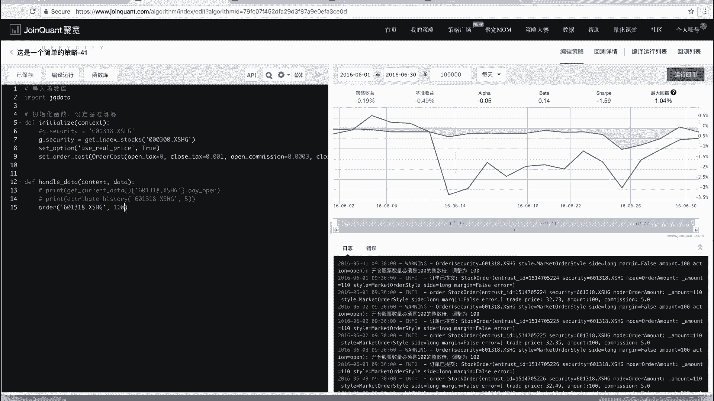

那有同学可能会说这个为啥说我买都是100股，100股的，买的，卖的时候是不是，难道会有说不是100股的情况吗，会啊为啥呢，嗯可能会发生变动吧，可能会发生变动，什么时候会发生变动，是分红，一般情况下嗯。

就是我们之前说过股票，第一你可以通过交易获利吗，第二是分红啊，分子红红的话有两种分法，第一种是分钱，一股给你多少钱，第二种是分股分股，对你有十股，我给你可能十股送十股，就是你本来如果本来有十股。

我就送你15，那如果说你有100股，那你就给你送200股，但是有的时候可能比如说十股送一股，你有100股的话，他就给你送一送，十股就变成110股了，就不是100的，就不是100的倍数的时候。

也这个时候如果说你全部卖出，你是可以卖110股的，但是你卖100 0509股是不行哦，就是只有全部卖出，可以说没有这个手的限制就好，这是说下单这个函数啊，我们说回来，那除此之外还有几个函数。

我们在这儿给大家看一下，下单啊，之前这是说的按股数下单。

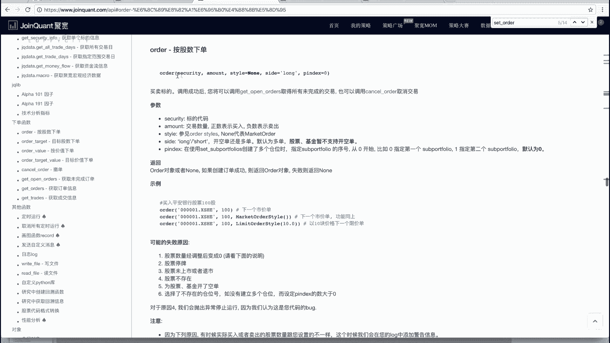

这儿买的实际上是100股对吧，那第二个函数可以是什么呢，可以是这个叫order，value order value函数也是两个参数，第一个参数还是股票代码，我就认准这只股票了，第二个参数是什么呢。

value钱嘛，第二个参数不是买多少股，买多少股票数了是什么呢，是你买多少钱的股票，买多少钱的，比如说我这传1万就是什么呢，我拿1万块钱出来买股票，明白吗，就能买多少，买多少。

当然你说我最后1万块钱算出来，我能买987。25，那买了多少了啊，最后给你调整才多少，900哦，对不对，怎么怎么算呢，因为你是不是有兼当前的价格，你拿1万块钱出来除以你当前的价格，是不是能买多少股数。

然后再给你调整成100的倍数就可以了，对不对，好。

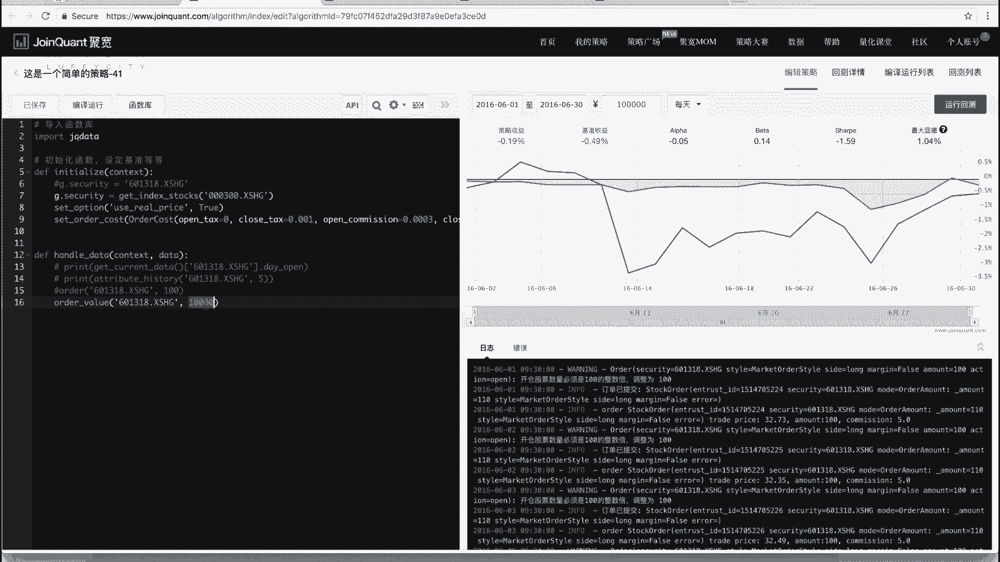

这是order value，除此之外还有两个啊，Order order value，还有order target，order target是买到多少股，买到买到多少股，怎么个是啥呢，怎么个买掉呢。

比如说我现在有100股了，我想买到200股，那我这order target第一个参数传股票代码，第二个参数传什么船，200就是买到200多，就是让我现在变成200，那如果说我要全部卖出。

你可以写order target下第一个写股票代码，第二个写零哦，也就卖买到零五嘛，买到零股就是全部卖出嘛，对不对哦对啊，如果说你用order来说做全部卖出怎么办呢，用order去填充来说。

你假如说你现在知道你有参卖过，你这个amount写-300，order的话，之前我们说那个order嗯，你amount传负数的话是卖出，这写了正数表示买入，负数表示卖出，如果你这传-300的话。

就是卖出300股，OK吧，这是order order target，然后order value还有一个order target value，这个是什么呢，这个是卖或者买到多少钱，买到多少钱买的哦。

跟那个差不多对吧，对order和order value是买多少股和买多少钱，order target和order target value是买到多少股和买到多少钱，所以你这个value传的是钱数。

比如说你这传零还是全部买数，如果说你这呃传这个1万，就是买到我的股票值1万块钱为止，明白了啊。

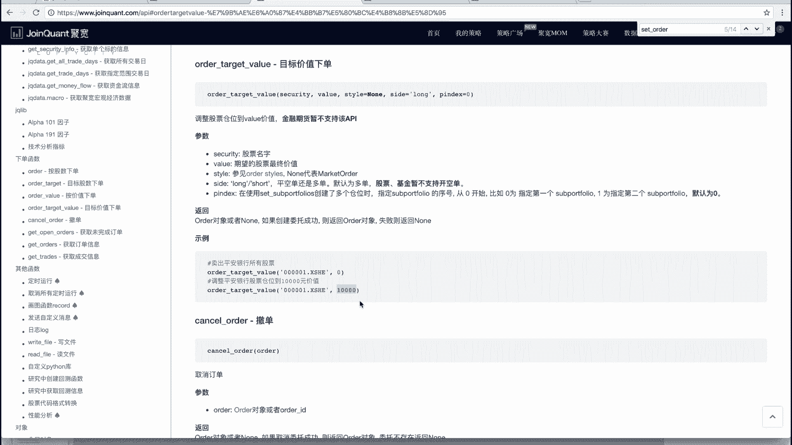

这是这个简单的就这么四个函数啊，给大家这个啊，这个是简单，我们给大家说了一下，怎么样在里边，比如说获取历史数据，获取当前的数据，然后怎么样下单买卖啊，那我们还是没有说这个啊。

我们之前讲的那个策略应该怎么做啊，什么这个股票股价低于十块钱买入，然后呃这个股价涨了25%卖出止盈，股价跌了10%卖出止损啊，那我们在下一个视频就正式带着大家写。

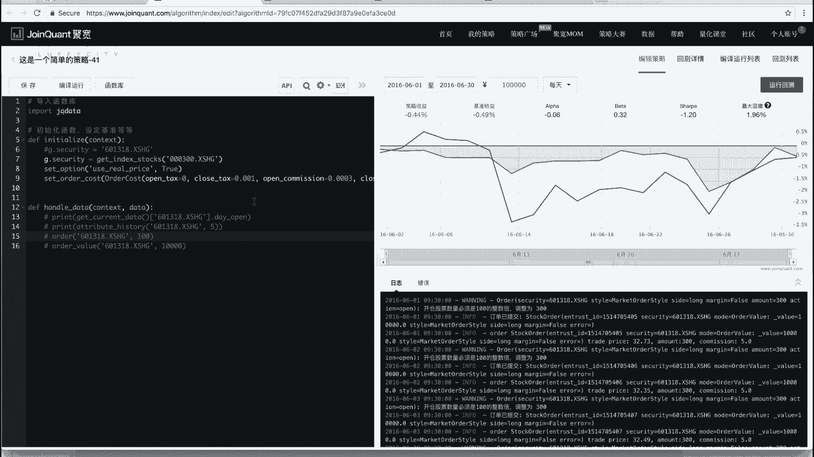

这些东西，我们都了解了吗。