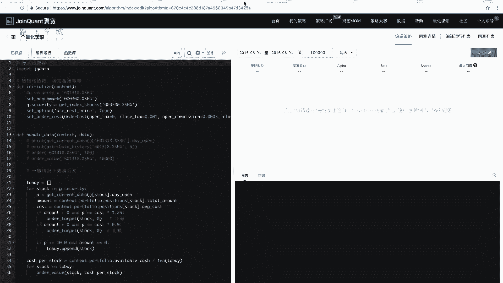
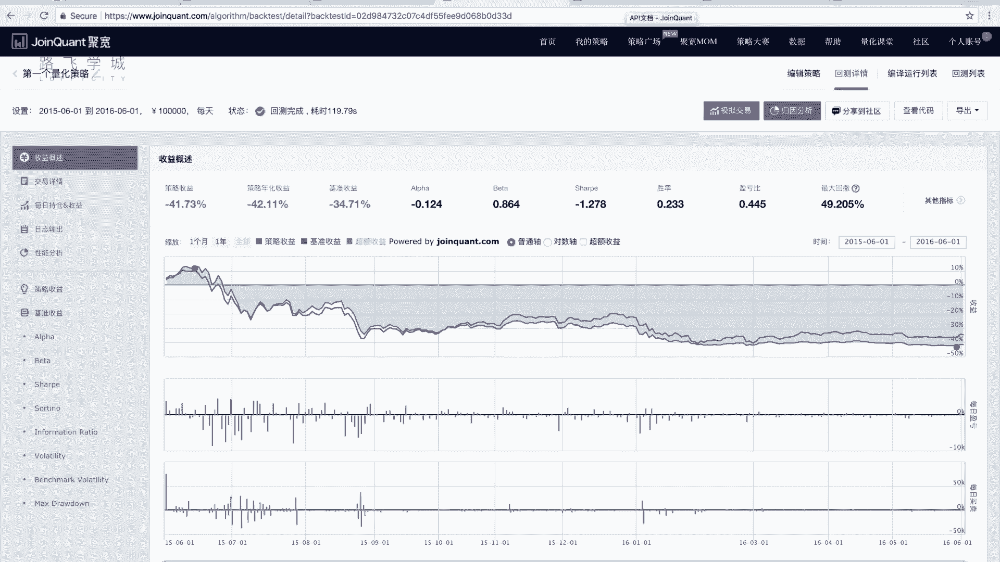

# 清华博士带你学习python金融量化投资分析与股票交易【附项目实战】 - P48：50 第一个量化策略-4 - python大师姐 - BV1BYyDYbEmW

好同学们，那在讲下一个我们的正式开始，讲我们的那个量化策略之前，我们再来还补充一个小点啊，我们刚才是在这个一直都是点的边运行对吧，编译运行它右边会出现那个图，然后这会有日志啊。

如果你我们在这点这个运行回测的话啊，它会出来一个页面，因为我之前给大家运行好了。

它就不点了，点的话它会有时有就是好费，这个有一定时间，那是100多秒呢，2分钟的好，这就是你点的那个会有出来一个更详细的页面，然后这里边会有一些曲线，然后有一些指标我们可以看到。

这个线跟我们电源线是一样的啊，因为我们这个时间是选的是15年6月1号，到16年6月1号，策略还是一样的，但是时间因为改到股灾那个时间了嘛，15年6月正好就大概开始股灾了。

你看这个这个这个跌的大盘是红线啊，基准策略基准吧，刚才给大家说的大盘是红线，然后蓝线是我们的策略收益，反正就是跟大盘一直差不多，保持着差不多的这个水平，然后啊这个图就跟之前一样，然后这个图是啥呢。

这个图这写的是每日盈亏，也就是说你每天是赚多少钱还是赔了多少钱，那是都会有血，然后你大部分还是亏得多，对不对，那篮子是往下亏的嘛，是往上是这个这个叫做就是这种柱图啊，就是股票上叫做柱图。

然后这是每日买卖，就是你每天是买的多少还是卖多少，这是买的吗，然后你买一点，这个这是慢了一点，这是买了一点，往上就是买，往下就是卖，然后这些图啊你可以看一下，然后除了这些图，这还有些指标。

比如说我们这刚才说的就是这些指标，大家也需要看一下，就是判断你的策略好还是不好，除了直观的看图啊，包括看图的走势，看跟大盘的比较啊，还有一个重要的就是看这些指标啊，比如第一个策略收益，这很好理解。

就是什么呢，你最后的钱数，最后的钱减去之前的钱扣起来，再除以之前的钱数，就你赚了还是赔了百分之多少，这是相当于肯定是赔了41%对吧，而且是赔的话，他是绿的，赚的话好像是红的，我印象中对啊。

这个基准收益是说的是一条红线的收益，就是大盘的收益，大盘的收益情况是34%，但是我现在跟大盘差不多，反正比他们赔的稍微多一点，对那个大家可以看到股灾的时候吧，近乎于腰斩，你原来有10万块钱。

你就按这个操作完之后，完事之后就还有6万就少一半钱，嗯就对，就这种嗯，股灾嘛就可能有的好的策略能够躲过去，但是躲过去好像也没有太大的，大部分都会折在股债上啊，这就没有办法啊，这个东西叫做策略。

年化收益42%，这是啥呢，这个是因为我们的策略，你看我这正好测的是一年，所以无所谓，但是如果说有的是有的策略，我是有的策略是5年，有的策略是10年，那5年的策略跟10年的策略直接看收益。

是不就是不公平的，比如5年的策略我可能赚了百分之呃，八十十年的策略我可能赚到170%，你说179比80好吗，不对，因为你时间还长呢，你时间长的话，如果涨的话，你肯定是时间越长，涨赚的越多啊对吧。

所以说我们这有一个叫做策略策略，年化收益是啥呢，就是它大概用一个式子给你算出来，就是你一年用这个，就是你用这个策略一年能赚多少钱，能赔多少钱啊，这个策略年化收益，那具体这个式子是怎么算的。

我们可以这个呃，他的这个帮助文档里应该也有说明，我印象中啊，这是风险指标，年化收益是这个公式算出来的啊，这一个常见的年化年化收益的指标，而计算方法就二百五除以N，然后P指的是价格按的这个收益。

N指的是你的实际上测的天数好呃，大家想了解的话，就是这个公式具体啥意思，可以就是仔细研究一下，或者参与一下相关的金融方面的书啊，这都是金融相关的专业知识，我们就不详细展开了好。

除此之外还有阿尔法贝塔夏普比率，这些也是一些表示风险的金融常关的呃，不是呃，这个表示收益跟风险的一些常关的，这个呃一些相关的这个这个指标啊，有兴趣也可以看一下，阿尔法表示的是这个非系统性风险。

beta表示的是系统性风险啊，这些专业的名词啊，这里也不给大家展开了，嗯感兴趣可以自己看直接看一下，然后这里有一些解释，就是你阿尔法大于零是收益超额的，阿尔法小于零，收益是相当于风险是少的。

因为你要一方面要有收益，一方面担风险嘛，嗯啊贝塔大概表示的是你就是系统性风险，所谓系统性风险，就是你大盘的走向跟你大发动向的关系啊，跟大发走向的相关度主要是一个大概好，财富比喻也是差概大概一个是单位。

就是收益跟风险的一个关系啊，咱们就不说了，还有一些其他的比什么啊，索提诺啊，什么信息比喻啊，不拉不拉这一堆东西，我们这就不详细展开了啊，好我们看后边这个胜率，这个胜率指的是什么呢。

指的是你赚的交易在你所有的交易中占的比重，你相当于是你有有你这个交易可能赚了，可能赔的，对不对，你下了单可能过一段时间是你是赔钱了，也可能是你赚钱了，那你赚的赚钱的那个交易数的在整个的交易。

在你整个的下的单里边占的比重是多少，这是2%，胜率是22%点多，那不是20%，所以说是比较低的，你是你大概五五开的话，可能有有的赚，有的赔大概可能差不多，那2%的话就说明赚的少，赔了多少，对不对啊。

这盈亏比，盈亏比指的应指的是这个胜率，指的是手数，交易次数，这个指的是前数啊，这里边也有盈亏比，指的是你的总盈利额除以你的总亏损额，就是你得赚的钱数除以亏的钱数啊，现在是小于一的话，证明的是什么。

证明的是赚的钱数比亏的钱数少啊，这个大家能看懂，然后这个最大回撤我建议大家最好能看懂啊，这些其实什么这些东西呃，风险的话你看不懂，其实问题不是很大，但是最大回撤这个比较好用，这个指的什么呢。

我们可以看到这个图上有两个点，看到没有，这有一个点，这有一个点，两个人都写的最大回撤，这个指的是，就是你这个策略在最坏的情况下跌多少，就是你在整个回撤的过程中最大的一次，你的赔钱，你的亏损是亏了多少。

这看到49%也就是什么呢，这是这两个点之间的，是你的最大回撤区间，在这个里边有有最大回撤区间，15年6月12号到16年5月30号，也就是说这段时间之内，你亏的钱就是亏的这个比重是最大的。

当然因为我们整个都在亏，所以他肯定是最大的啊，那也就是你这个策略表现最不好的一段时间啊，最大回撤这个影响，到时候你啊，就是说你这个策略可能是最坏情况下能赔，赔到什么程度，当然最大回撤比率越小越好。

对不对嗯，还有一些比如说盈利次数，亏损次数，然后这些更复杂的这些比率啊，这就不说了啊，然后相关的东西大家参与一下，这个这几本的公式说明，然后也可以去看一下相关的金融知识啊，就可以了。

那除此之外这个页面还有一些更加详细的报表，比如说交易的详情啊，你每一天下了哪个单，你看这是你下的单，就是模拟的回测嘛，6月1号这个时候下了TCL的一个单，买了300股，成交价是64。62是多少钱。

然后6月1号买了这些果，然后往下接着看啊，什么6月6月这个3号四号五号，就是每天各各自买了哪些股票，OK吧，这是卖出的，有买的有卖的，就是你看一下这更详细的报表，然后这还有什么每日的这个持仓收益。

然后相关的日志，包括一些各种各样的指标都有啊，相关就更详细的东西写在这里边，如果你想说研究写完一个策略之后，哎我这策略究竟是为什么好，或者是为什么不好，哎，可以看一下这个好。

这是我们说的这个就是对你这个策略的啊，一些更详细的这个啊问题的一些说明啊，我们就说到这儿，那接下来我们就开始给大家讲，我们的第一个金融量化策略啊，之前也介绍过叫做双均线策略，那我们看双均线策略。

在我们的在线平台上应该怎么实现嗯。

