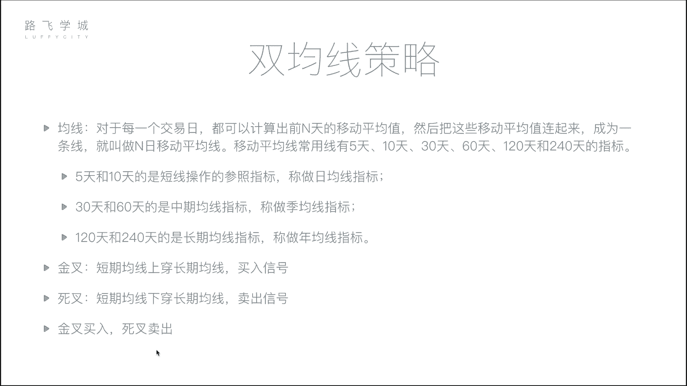

# 清华博士带你学习python金融量化投资分析与股票交易【附项目实战】 - P49：51 双均线策略-1 - python大师姐 - BV1BYyDYbEmW

好同学们，那我们这个刚才写了一个简单的第一个，我们的量化策略主要是带着大家认识一下，熟悉一下我们的平台对，当然大家可能没有特别熟悉，但是没有关系，我们接下来还会就是在讲的时候，再会强强调一下。

然后或者是这个有一些没有讲到的函数，也会给大家再说说明一下哈，那接下来我们就开始讲讲解几个基础实用，然后比较好的金融量化策略啊，它不是我们拍脑袋想出来那种了，是有科学依据的，好我们先说第一个啊。

之前给大家介绍，我们再来看一下双均线策略，再来复习一下，那均线之前也给大家说过了，表示的是前N天的股价的一个移动，一个平均啊，整那你把每一天就是每一人，今天我算10日均线，就是今天在内前面往前数。

一共十天的价格算一个平均值，那把每一天的这个平均值连起来，就是一条均线啊，这10日的话就叫10日均线，你每个每天取五天，历史的话就叫5日均线啊，均线实际上表示的是最近一段历史时期内。

你股票的价格的这个波动的情况啊，如果你价格这个均线震荡的很厉害，上下波动特别厉害，也就是说你这个股票价格波动的很厉害啊，那均线我们之前也说过，包括五天，十天，30天，60天啊，一常见的啊，120天。

240天等等啊，这些天的指标，然后我们也说过，什么叫双均线策略呢，就是拿两根均线，一根稍微短一点的，一根稍微长一点的，当短期均线上穿长期均线的时候，这个点叫做金叉，是一个买入信号啊，因为因为什么呢。

因为我们说这个，当你的股票有一个要上涨的趋势的时候，你肯定是短期均线涨的幅度要比长期线大，对不对，所以你这个时候短期均线会上去，那会穿过长期均线，这个时候叫做金叉，那相反如果短期均线下穿长期均线。

这个东西叫做死叉，是一个卖出信号，也是因为如果说你这个股票价格要下跌，你的短期均线会灵敏，它会下跌的幅度比长期线线大，所以当它下穿长期均线的时候，这个是一个要跌的信号，所以赶快卖啊。

可以简单来说双均线策略就是金叉买入，死叉卖出啊，非常简单，那在这我们怎么在我们的这个平台里，在线平台里来做这个策略啊。

其实核心就是怎么算均线对好，那接下来我们就带着大家写，来写一下我们的生命线策略。

