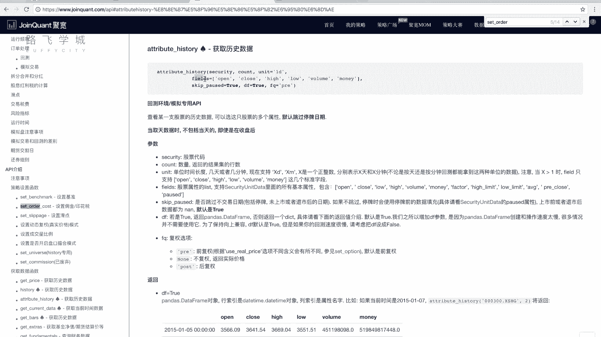
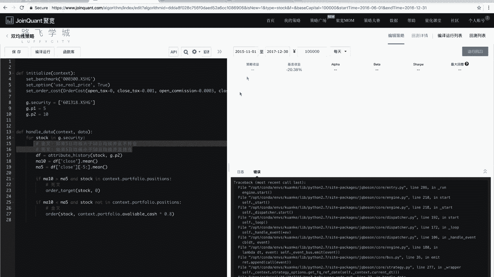
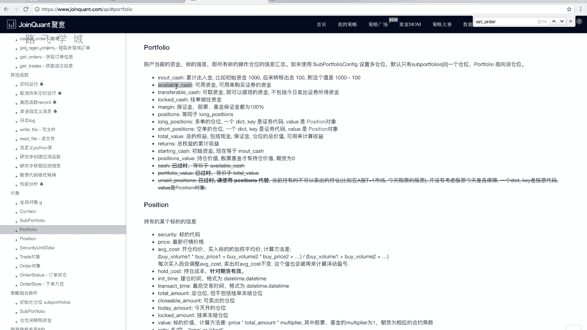
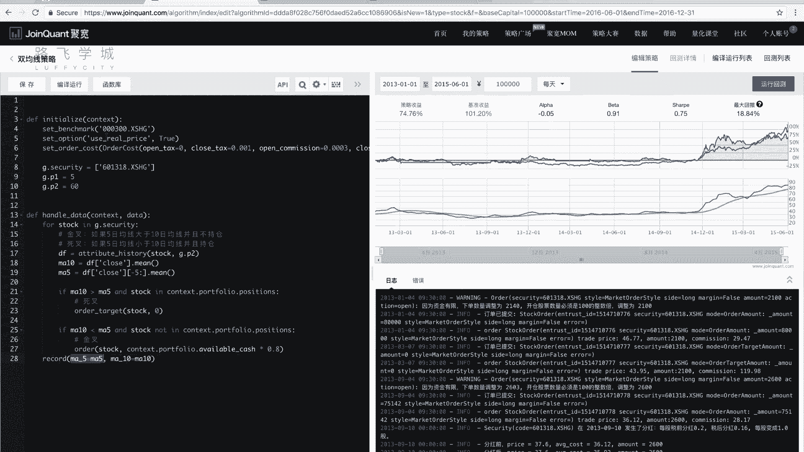

# 清华博士带你学习python金融量化投资分析与股票交易【附项目实战】 - P50：52 双均线策略-2 - python大师姐 - BV1BYyDYbEmW

好，那我们接下来这个在这个平台上写一下，我们的双均线策略啊，initiate的函数，这三行代码基本上我们现在就是固定固定的，这就是每个特写都粘一下就可以了，设定基准啊，再给大家说一下。

设定基准是我们因为就是就用沪深再买，或者说你要是不买，你可以换一个大盘或者A股的指数，或者是啊是那个任何指数都行，就大盘就无所谓，好这个set option是设定这个eusual pad，设定真实价格。

实际上是一个复权啊，你不用管它就写上就可以，这个是设置手续费，对啊，这个写完了之后好，我们的双均线策略，因为他是相当于是没有选股在里边，他没有考虑选股，就怎么选择哪只股票，所以说我们这写个简单的话。

就只考虑一只股票就可以，我们这点security等于比如说我们这为了保持一致性，还是拿个列表，但是列表里就只有601318点SSH对对，缺一只股票，嗯OK吧嗯OK好，那我们的handle data里。

就要做什么呢，就要做对于这只股票来进行算它的均线双均线，然后看是金叉还是死叉，金叉就买入，死叉就卖出，很简单对吧好，那这我们说就是一只股票的话，我们这儿直接写行，但是说我们这简写的列表啊。

就是考虑到如果说我们以后会扩展成，就是几只股票一块考虑，那么这还是写个for循环啊，for stock in什么G点security啊，因为这只有一个，那当然全环就执行一次了，对不对，好。

接下来是什么呢，要做什么，我们要获取均线，那获取均线有两根均线，对不对，我们这定义一下啊，比如说这一点P1等于五，G点P2等于十，好吧，就指的是什么呢，就指的是这两个日均线，分别是5日均线和10日均线。

可以吧，就P2是大的那一个，那我们要算均线了，怎么算呢，算今天的这个均线的点是多少，DN均线DN对，因为我们要看双均线，在这个呃我们的平台里怎么样来算双均线，不算吧，怎么算的，之前我们是怎么算的。

我们是不是写过一次双曲线策略，写过同学数列实实际上是什么呢，金叉后边肯定是死叉，死叉后边肯定是金叉，对不对，那其实这个时候我们没有必要说啊，就把整个的线就算出来，我们只算今天5日均线那个均值是多少。

那个值是多少，10日均线那个值是多少，10日均线，如果说今天5日均线大于10日均线，5日均线大于，并且我没有持有这只股票，是不是说明现在是金叉，今天是金叉啊，怎么来算金差，我看你有点懵对，怎么算金差。

我再说一下啊，怎么算金差，金叉是什么时候，是短期均线上穿长期均线的时候，也就是说，之前那一天肯定是5日均线小小于60，小于10日均线，对吧嗯，那如果今天是5日均线大于60日均线了，5日均线不一定是警察。

如果是50，但但是5日均线大于60日均线，第一个5日均线大于60日均线的那一天，是不是金叉，对不对，那怎么说，这个第一个是怎么算的，我们这样来啊，当5日均线大于60日均线的时候。

第一天因为前面是死死叉过去的嘛，因为死叉之后我们都是把股票都卖出去了，所以这段时间我们是不是没有持有这支股票，对不对，就不持强这支股票，如果说5日均线大于10日均线，并且我不持有这支股票的时候。

是不是说明我刚从死叉那个地方过来嗯，因为死叉之后我是不持有股票的，对不对对，那如果说我不持有股票，是不是说明我刚从死叉这过来，说明我是金叉，对对对，所以金叉的条件我们可以这样写。

如果5日均线大于大于10日均线，并且什么没有不持仓股票对，那这天是金叉，我是不是金叉之后就买入了，买入了之后是不是就有持有持仓这支股票了，不管我买多少，我是不是持仓了嗯，那我持仓之后。

那接下来第二天他还5日均线，可能还是大于10日均线的，但是我是不是因为持仓这只股票了，对所以我是不是就这不是金塔了，对了吧，嗯然后接下来再走，走到某一天，55日均线是不是要下穿10日均线，下穿对。

那5日均线下穿10日均线的时候，怎么样来判断什么是死叉呢，当5日均线低于10日均线的时候，小于10日均线的时候，这是不是就是下穿之后的结果，就是死叉之后是这一块结果，对不对嗯，那什么时候这个死叉。

是不是这一段就5日均线小于10日均线，这段时间的第一天，对不对对，那什么时候才是第一天呢，是不是如果我先写出来啊，5日均线小于10日均线，并且持仓股票，对不对，因为我刚我刚金叉完了嘛，我刚金叉完了。

我是不是我我是这我我刚今天完了，我是不是这个有这只股票对有这只股票，那如果金叉，因为金叉完了之后，是5日均线大于10日均线的吧，对如果是5日均线小于10日均线，并且我持仓这种标号。

是不是说明我刚刚金叉那个之后的那个高的，5日均线比十均线高的那个位置刚下来对，是不是说明这是死叉，是对，那死叉之后这一天我持仓持仓，我是不是就把它卖出去了，对卖出去完了下一个下一天是不是不持仓了。

是下一天可能还是5日均线小于10日均线，但是我不持仓了嗯，这个金叉和死叉的判定条件，就是这两个对大家可以理解吗，那接下来就是什么呢，我要算今天的5日均线和10日均线怎么算，对不对。

那这个就涉及到什么获取历史数据了，因为什么5日均线，我是不是要算五天历史的价格的，平均，10日均线是不是要算十天历史价格的平均好，那我们这获取这些数据怎么获取呢。

我们用这个attribute history函数啊，这个函数之前给大家也说了，后边的参数可以暂时不用，你就用两个参数，第一个参数是股票代码，股票代码就是这个stock对吧，count时间要获取多久。

我们是获取几天呢，5日的，5日的，10日的，我应该获取，我既要获取前5日，又要获取前10日，所以我获取多少10日的，是不是可以，不要看它了，这一点P2，因为10日的我切出来后五天，是不是就是后5日嗯。

对不对，是不是就是5日啊，好这段的话我们把它存到我们的，比如说存到我们的这个叫DF0，好，这个时候我们可以看一下DF是啥，打印一下，看一下。

那如果有同学对这个attribute history还不熟悉啊，我们再来复习一下这个呃，API里的这个attribute history函数啊，两个参数，第一个参数是股票代码，第二个参数是数量。

所谓数量就是你获取几天的历史啊，其他一些参数我没有说，我们在这给大家说一下吧，unit参数啊，是你可以传传那个默认的是ED，就是一天你可以传几分钟，几小时，那他获取的历史数据就是十小时线或者分钟线。

那我们这是1T的话，就是一天一天的，就是一条记录，是一天的价格，OK吧，如果说你传的话是三个小时或者三六十分钟，那它的价格就是10分钟线，就是这个10分钟的开盘收盘最高最低啊。

十十分钟的开盘就是10分钟刚开始的时候，那个线那个价格收盘就是10分钟结束时的价格，最高价格价还是一样的啊，嗯这个咱不说了，最常用的还基本上就是1000就可以。

而fuse就是默认你这个data frame有哪些列，它默认的话是有开盘价，收盘价，最高价，最低价，成交量和成交钱哦啊你可以传，比如说呃开盘价收盘价完事，你不要其他的。

那它的data frame就只有两列啊，除此之外这还有一些，比如说这个没有的factor，High limit，Low limit，这个什么涨停价，跌停价啊，平均价啊，pre close前一天的收盘价。

pose是不是停牌了啊，这个你也可以加在里边，就默认的就是这几个好吧，然后skip pose就是是不是跳过停牌的时间，跳过不上，跳过不交易的时间，比如说周六周日的时间默认是跳过的，如果你说不跳过。

你就让它复制成false啊啊DF是true，就是它默认返回的是个data frame，这个一般因为我们需要data frame了对吧，所以就是true就可以啊，这个复权选项前复权不复权后复权。

这个有没有不涉及不到啊，还是复权的问题，所以其实用的最多的还是security cost啊，可能用到FS函数。

也用到FS参数，好，这个时候我们看一下啊，data这个ATTRIBUTARY是不是打印出来了，是不是前十天的这六列的价格，对不对嗯，好我们说5日均线怎么算，取后五个先算十均线吧，十均好算。

10日均线是不是DF，比如说我们拿close这个也算是不是可以对点，什么算平均，怎么求平均啊，怎么求平均啊，除以它的长度嘛，除以什么有函数吗，mean吗，嗯对吧，这是不是就是我们的10日均线价格啊。

10日均线的这个值，5日均线的值是什么呢，DF好，五个close啊，什么选出来后五列是不是你看啊，7月23号是不是这五列是这五列选出来，是不是就5日均线对好，那什么再选出来后。

因为我DF这close这选出来，这这已经是个series了对吧，那直接这样切片就可以了啊，你大家不放心的话，你可以用i lock啊，再点my min min，是不是，这就是5日均线的那个值，对好。

接下来开始了啊，先按照我们先买后卖的原则，我们先看今天是不是死叉啊，什么时候44差呢，如果ma10大于MA55，并且不持仓啊，并且持仓sorry，并且持仓是不是这是死叉，持仓怎么写，Context。

点portfolio，点positions stock，点total amount，是不是它如果它大于零，是不是吃它对啊，因为这个之前我们也用过了，又遇到过这个问题，就是说你这个stop可能不在里边。

不在里边，他给你报个warning，或者你还可以怎么写，你还可以这么写，and对stock in它PRESIC不是字典吗，字典字典的键不是一堆股票代码吗，就是你有的，那你持有那些股票代码。

如果说你的stock in里边是不是就持仓，是的对不对好，那这个时候是死叉，对不对，死叉写一下啊，叉叉的时候是不是该卖出，对好，怎么卖出，order等target，stock00卖不卖出。

这是不是卖出所有的股票嗯，那金叉呢，五如果ma10小于ma5，并且什么不持仓不持仓，对stock，Not in context，单复制粘贴，这个时候是不是金叉对。

那就什么买入买入买入stock买多少买多少呢，当然这个现在我们一只股票好，说一只股票我们就直接有多少，你可以什么有多少钱买多少钱，对对不对，或者说你拿你要是不放心，你谨慎一点，我拿七。

我有这些钱的80%或者70%，来买就行，对不对，那如果说，我是操作好几只股票，你怎么办，那其实不太好办，因为你这些股票不是同时买卖的，你你有可能是我今天买的这支股票，可能过几天卖出去了，然后再买再买的。

可能买另一支股票，所以这个仓位管理是就是会比较费一点时间，但是我们这说嘛，我们这就只有一只股票，我们这先简单处理好吧，简单处理成什么呢，我有多少钱买多少钱，那有多少钱有多少钱呢。

context点port for呃，follow点available，Cash valuable，Cash available，Cash，啊拼错了，port for6点V6开始对，那拿这些钱。

比如说我在不放线，我乘0。9吧，00。8好吧，嗯不传扔进去，留留二留20%的，留着这个20%的钱在家里存着，OK好就买成1。8好，我写完了嗯，就双均线策略，最简单的双均线策略，一只股票的中线策略。

一只股票的双均线策略，就是这些啊，算一下10日均线和5日均线的值，然后看是金叉还是死叉，金叉死叉卖出，金叉买入，那当然注意一下这个金叉和死叉的条件对啊，怎么什么时候是金叉，什么时候死叉好。

我们来运行一下，咱们选一下时间吧，啊可以说是放到今年吧，17年12月31号，12月31号，我们这别15年7月了啊，这是股灾啊，15年11月吧，嗯好运行一下，那我也不知道策略这个效益会如何啊，报错了。

available cash a v a l i a b a是不是拼错了。

看一下，In a vailable cash，我可能拼错了吧。

啊果然是拼错了，I和L方写反了，好这个时间比较长，因为我我也不知道我没测过这段时间啊，效果好像不是很好诶，后边少些，后边儿商场这段时间可能还是什么古代的余波，但是我后边确实起来了，对收利47%还好啊。

也可以测试一下，大家可以测试一下其他时间，比如说你测试下古代，我们就放过五代吧，我这个对这个双均线策略还是不太放心的啊，比如说1月1号哎，我这个菜其实已经你看跑赢大盘，而且跑赢的不是很多了。

已经你看这是我这涨起来很快，对不对，跑13年1月1号，比如到15年1月1号，到15年6月1号吧，啊就是就各种时间大家都可以尝试一下，包括这些策略，一些可以变的东西啊，你看这个效果就没有特别好。

就这个大涨起来的，我没有跟上，说明我的策略可能有些问题，对不对，那大家可以调整一下，比如说我这不是5日均线和10日均线吗，你可以算一下，不如我说换成5日均线或者和60均线，或者是和30均线会怎么样。

嗯那因为我是长期的长线的，是不是5日均线和10日均线不太好，反而是不是5日均线和60均线会好一点呢，大家也可以尝试一下啊，或者是说我这一只股票，或者说我除了这只股票，我其他的股票会怎么样诶。

你看这个换成60均线是不是收益，虽然最后还是没有超过大盘，是不是，但是我是不是比刚才好了，对对不对，比刚才好了，对不对，因为这是长线，因为这个时间比刚才要长，所以应该是换一个就是长期均线。

换一个稍微长一点的可能会比较好，大家可以测试一下，比如30日，120日啊等等，包括你5日也可以换，5日换成10日啊，多次调参测试一下，就是哪个参数会更好，在某种情况下啊，那包括说这个一只股票。

你也可以扩展成我多只股票啊，怎么样进行仓位管理，这些都可以来做啊，那当然我们现在给大家这个演示的，是一个最简单的数据线策略，那关于这个的代码，那暂时就给大家说到这啊，啊对我再补充一个函数，补充什么呢。

就是有一个叫做就是我如果想除了看这个图，我还想看别的图，我可以这样，如果没有for循环的话，就是其当然无所谓了，因为它只有一个函数嘛，对不对，那我们这可以，比如说我想画一个5日均线和10日均线的图。

那我就用record的函数，因为这个地方说一下，最好可以加下哎，record m a5等于M5，然后MA10等于A10啊，虽然现在已经是60了，但是我变量名没有改，就这样吧，好这个时候我们运行一下。

看这会出来吗，啊你看这有多了一个曲线，看到没有，这个线是什么呢，这个线就是5日均线和10日线，就是我这个record函数给的图，react函数每一天会给两个点上去，就这不是每一天执行一次吗，对不对。

那record函数也是每一天是两个点，一个是ma5，这ma5，这是相当于是拿这个我们的这个呃，这关键字参数传进去的吧，这个ma5是这个ma5，而是这个变量，但这个ma5其实是它的名字，是他的名字。

到时候这会呃这也没有写，就是你换成哎，你这这写了看到没有，M5还M10哦，不你这如果换成ma下划线，我从那儿显出来到这这个图上，显示来就是ma下划线五啊，是这种，那这个时候他可以把。

就是你需要的其他的图也给你画出来，就是你每天record record一个点就可以，就这是两个点了，这是两两个点对应两条线了，嗯这是就是两条均线的图啊，相关的啊，这是我们讲的双均线策略啊。

