# 清华博士带你学习python金融量化投资分析与股票交易【附项目实战】 - P52：54 因子选股策略-2 - python大师姐 - BV1BYyDYbEmW

好那接下来我们带着大家实现一下，我们的这个啊叫因子选股策略，嗯因为我们选的是市值，所以它也叫小市值策略啊，好那这个initialize这三句话还是一样，我们就不多废话了。

好那接下来这我们再多一个就是什么呢，我们的因子来怎么选对啊。

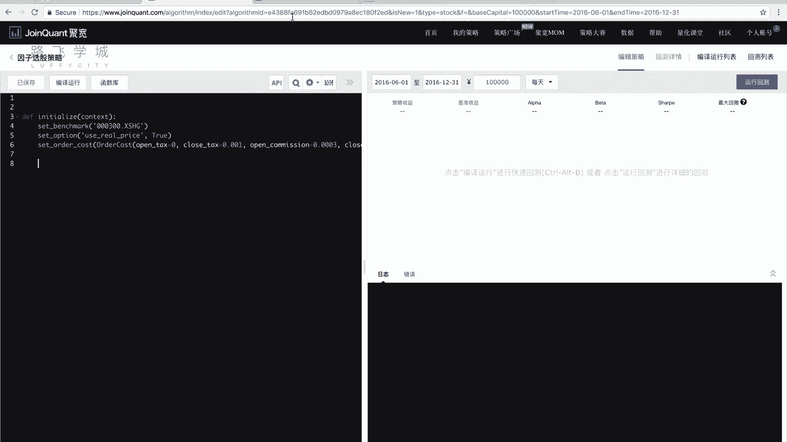

怎么选因子，之前我们说这个是我们的这个价格是啊，通过你的这个get attribute history，不是attribute history啊，什么get current data呀。

可以获取到历史价格或者今天的价格，但是我们说你拿市值作为因子的话，你这个市值实际上是存在哪了，是不是一个财务数据，所以是一个财务报表，那这个财务数据怎么存呢，财务数据财务数据怎么找啊。

是叫get fundamental函数啊，这个还是很有意思啊，他的写法跟我们之前不一样，才查询财务数据的，它的主要参数是一个query对象，那这个query对象是啥呢，见过没有。

Circle archemy，对ARAMYSYCHERARAMY这个库的一个query对象，相信大家如果在我们学学过了，我们这个但是基础课程的话啊，或者是OM或者你掌握相关的话。

应该会知道这个SEL对象嗯，那query对象对好，那这个那这个query对象说明了什么呢，说明这个是一个要去数据库里做一个查询，对不对，那也就是证明我们的这个东西，是存在数据库里啊。

可以到数据这一页里找到财股票财务数据好，看一下，我们的市值应该叫做market，Cap，好在这总市值，它是在valuation这个表里的market cap列，OK吧。

那我们就只要去写一个写一个这个SQL语句，写一个那个快速对象，把这个列把这个表里的这一列选出来，那头除了这些，当然我们还需要股票代码，对不对，股票代码和这一列这两列选出来就可以了。

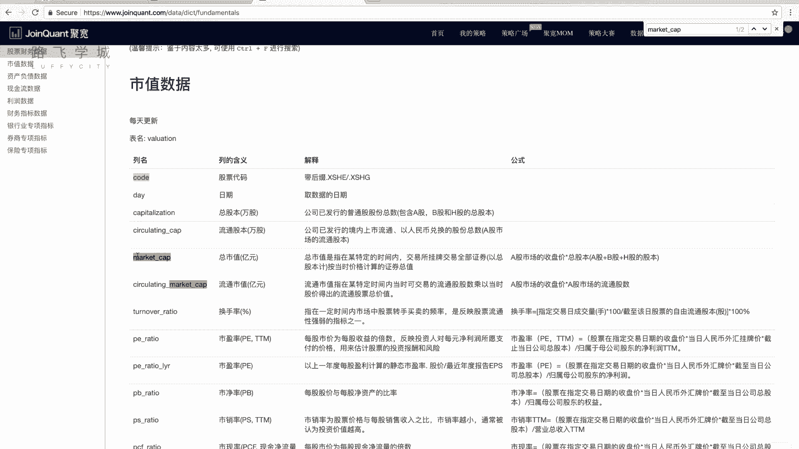

好那怎么选呢，我们这儿存一个G点，Q这是我们那个query对象啊，直接直接query就可以，他已经给我们引入了import了啊，所以就不用管它query里写valuation表啊。

如果大家不熟悉的这个地方，相当于是select from valuation，对，就是from那个valuation表，然后filter过滤，filter就是实际上它就是select什么东西嗯。

因为我们这没有VR，就是SEL，实际上我们翻译成while语，就是select code和那个什么和这个啊，Market cab from valeration，对不对。

所以filter应该我们选的是valuation，点扣扣的点啊，啊不对，这是我们应该选的是valuation啊不对，filter是where，我刚才说错了，不好意思啊，就相当于是where。

因为我们要选的是相当于是我们有个股票池嘛，对不对，我要把这个池子里所有东西选出来，那我们的股票池可能是比如说这一点啊，security等于跟刚才一样，跟之前一样，Get，Index stocks。

然后我们这选啊，还是选湖人代买，好那我们这个要的是什么呢，要的是valuation点code，是不是在呃，是不是在这这样印下划线在这个里边，对不对对，所以是in点in g点。

security security啊啊如果这行代码大家没有看懂，大家可以去复习一下我们的PSYCHOPTIMMY，那个库，ACEMY那个库啊，嗯嗯那它其实就相当于是我们把啊。

valuation这个表里的所有列选出来，然后where where什么呢，就是valuation的code，这个code在这个里边啊，就可以好，那我们选出来之后，我们再选code那一列。

跟那个这个market cap那一列就可以，OK吧好这是我们这个第一个问题，就是怎么样查数据解决，暂时解决了一半，那另一个问题是又来了，我们之前刚才给大家说，我们的这个啊是因子选股策略。

不是每天支撑一次，对不对，我是什么呢，我是比如说啊可能一个月执行一次，或者是呃30天，40天，50天执行一次，对不对，那这个怎么写，啊我有两种写法，比如说第一种我们可以这样是还能WAA吗。

对好那我这样定义啊，看啊我定义一个J1点days，刚开始等于零，OK吧，那我handle data里怎么办，刚开始这点这次每每执行一次，我加等于一，可以吧，可以，然后什么呢，如果这一点death什么。

比如说我想30件事情一次，对不对，那我怎么办，除对30取余等于零零，我在里边再写，不拉不拉不拉不拉拉在里边再写代码嗯，你看我如果这样写的话，是不是就是每30天或者一次对加一嗯。

但是这个我如果这写成一会好一点，因为这一这加完一之后是零，然后第一天之后就会执行，然后再过30天会执行，好这是这个第一种写法啊，当然可以写啊，这个没有问题。

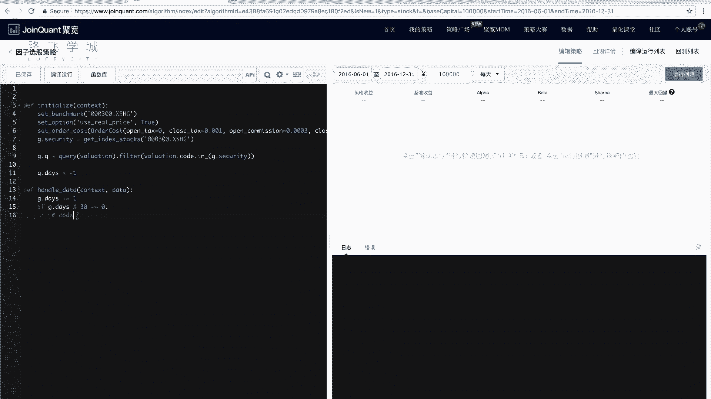

但是我想给大家介绍一下，为了咱们为了更好的掌握一下这个平台嘛，那这我们会有一个叫做另外的写法，叫做定时运行函数啊，run有三个，Run monthly。

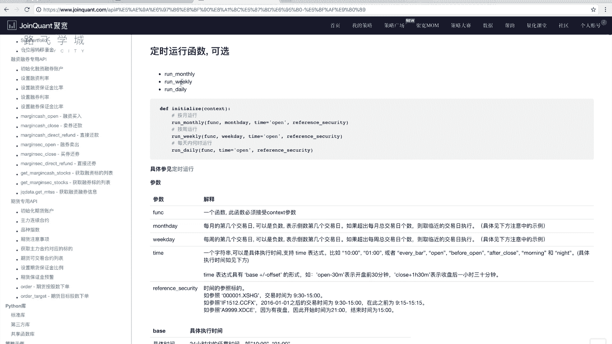

Run weekly，run daily啊，这个啥意思呢，我们这儿看啊，我这不写handle贝塔，我们这比如说你随便起一个函数名啊，当然这个函数只有一个context，只有一个contact参数嗯。

比如说我叫handle，可以吧，好那我handle里边写一些code，那我在我的INITIALI里绑定一下这个handle，怎么绑定呢，Run monthly，三个参数，但是其实我们传两个都可以啊。

第一个handle传函数名，就是你要调用哪个函数，第二个传你在这一个月，这不是每月执行一次吗，这个月的第几个交易日做，比如说我传一，那我这样的话看啊，我handle，我打印一下，那打印下什么呢。

我随便我打一下，hello吧，然后因为我们能看到时间好，这个时候看我们运行一下啊，看我们的日志，6月1号，7月1号，8月1号，9月1号，10月10号，10月1号，12月1号，是不是每个月执行一次。

但你看这个10月10号是为啥呢，我在那个放假还是一个问题，对他是他是每月第一，这个一不是第一天是第一个交易日，对啊，所以我是传一的话，第一个交易日，10月第一个交易日那天，可能那天那年可能放了九天假。

有可能对，有可能是七天假加周末，周末他可能周末他也不上班，我也不知道，反正就是十就第一天是1010号这一天啊，我不知道为啥啊，有可能是中秋连着对15年我已经忘了，好吧，那这也是一种写法啊，但是这种写法。

run monster这种写法的话是每个月调一次仓，但是不是每30天调一次仓，不是每30个交易日调一次仓，你懂吗，是30天，它实际上可能一个月只有20个交易日，对不对啊，但是比如说但是没有问题。

我们可以这么写，那比如说我们就用这种写法来写，OK吧好那用handle来写，我们还是说要获取我们的因子，获取我们的市值数据啊，我们之前只是定义了这个query对象，那怎么来获取。

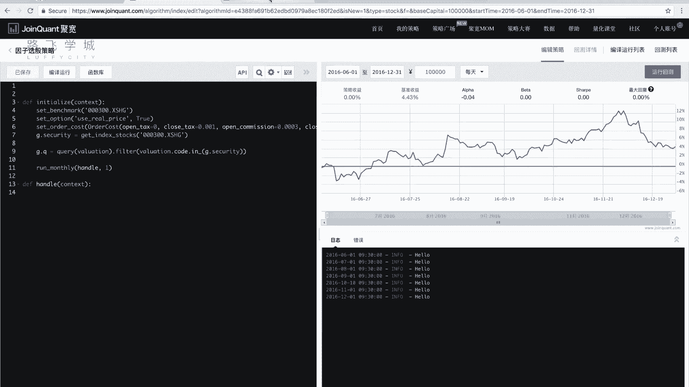

是我们的这个get fundamental函数，查询财务数据，date是日期，我们就不传的话，就是今天就是默认的那一天。

然后就只传这个Q回去就行了，好get fundamental，J点Q，然后它返回的还是一个data frame啊，因为我们之前也就是给大家介绍过，说我们的data frame。

说pandas库可以跟数据库从数据库里读，但是我没有给大家讲啊，怎么读啊，这可以读，那它其实也是相当于用pandas库写，他自己写了一个函数，从数据库里读出来，返回一个data frame啊。

那这个data frame它有多少列呢，它有多少列，就是我们刚才数据里看到的valuation有多少表，它有多少列对，那我们这不用选，所有在我们这选只算两列，第一列扣的，第二列是我们的这个额。

这个这个市值好，那我就这样写，取两列嗯，Code，叫做，额市值叫做好。

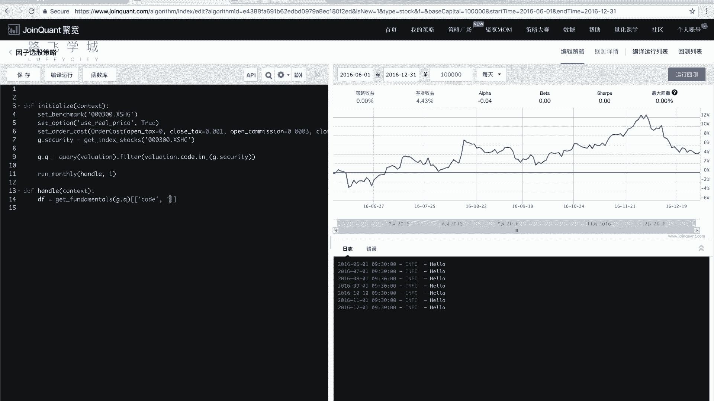

看一下这个mar啊。

对market cap想起来了，人老了，记性不好了，好我这是一种什么写法，再提醒大家一下，这叫花式索引panda，把这两列选出来嗯，好这个时候DF就是可能是就是好多列，每一列是一支股票。

每一行是一支股票，两列一列是代码，股票代码，一列是走势值，对好，那接下来是要什么呢，选出来市值最小的N只股票，那这N比如说我在这再定义一下啊，这点N等于几呢，比如等于20，我就选20股票对吧，可以好。

这个时候我们要选出来十只最小的20只股票，我应该是要排序好，那排序大家如果记得的话，是sort value4。

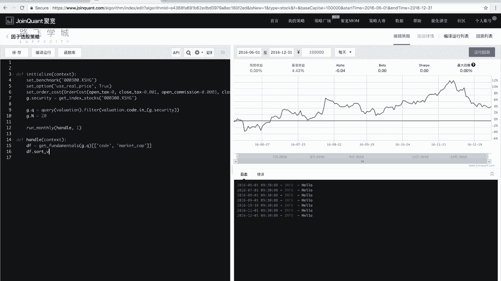

But，这里我们要用SAL，为什么啊，salt values会报错，为什么会报错。

因为我们可以看一下，帮助他这个AAPI文档里边，它会说它就是支持哪些库，怎么这有些标准库就是标准库支持第三方库，第三方库的pandas as是0。16。2版本的，我们之前给大家讲的讲的是最新的。

讲的是0。20，0。20版本的，就这个版本比较老。

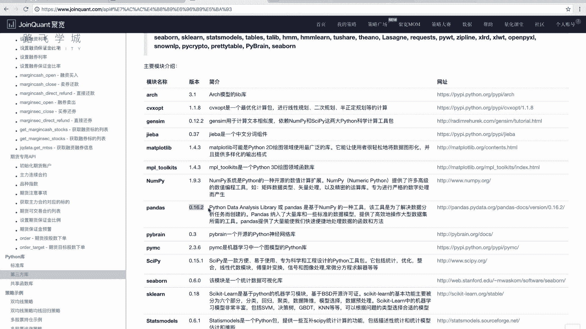

可能有些函数里面和我们的不一样啊，就是我们现在的sort values在之前叫fault，没有values，那用法是一样的，就只是函数名不太一样啊，用法还是第一个那个by参数。

是我们的这个什么这个这个这个这个呃列名啊，我们这里全market cap mr r kit cap，好我们想要这个就直接啊，就直接这样开就可以了，然后返回我们的data frame啊。

我们这可以打印一下，看一下，就为了防止出错，因为他这个地方debug不太好，debug只能通过打印的那种方式，所以建议大家写几行就打印一下，看看程序会不会出错，好我们可以看到这第一天打印的。

它这个市值是什么，相当于是默认升序排列的对吧，默认本来就是升序排列对吧，所以最小的是不是这几只，我们是不是把前几只切出来就可以了，对好我们在这边看到后面接着写切什么J点N，对啊，为了防止出意外。

因为我们这还有列，所以建议大家用点i lock行切这些列全切，之前之前那个加法实际上也是对的啊，但是建议大家这样写啊，不信这个时候我们可以再打印一下DF，看一看，应该不会报错啊。

这个时候我们data frame选出来的，就是我们要买的几只股票，你看20只，对不对，好就是我们要买的这支股票，那接下来我们要做的就是选出来二只股票，就要调仓，对不对，怎么调仓啊。

因为我们现在可能是我们现在有，是不是有一些股票，我手里是不是可能可能有一些股票，对不对，可能有一些，那那这选出来的20只又是有20只股票，那这手里的股票跟他这些股票怎么样来权衡啊，手里可能有一些股票。

那如果手里有的股票就在那20只里面，我是不是这二这手里的股票不卖，对不对，就呆着，如果说手里的股票有一些不在那20只里边，那收益的股票是不是要卖掉，对是吗，那20多那20只股票有不在手里的。

就是这20股票是没手里没有的，是不是这些股票就买下来，嗯对所以这我们怎么样呢，我们这儿这个呃维持几个什么，维持几个这个列表，第一个叫做拖后的，它是比如说DF啊，Code，因为我们要选代码嘛。

就是扣的那一列点values啊，这个时候我们的to hold是存的，是我没要，就是我们的目的是持最后持有这20只股票，对不对，所以to hold嘛，就是我们目的是为了hold住这20只股票。

就是要要持目目目标是持有这些股票，那不在这个to hold里边的，我是不是要全部卖出去，对呀对好，那么像便利什么便利，我现在有的所有股票对，怎么便利呢，我们说我们现在有的错误。

它是不是存在context点portfolio，点positions里边，对不对，这是不是个字典，它的键是不是股票代码，所以我这样写false stock in。

那这个stock是不是就是我现在有股票的，那股票代码对，如果这个stock不在to hold里，现在to hold我已转换成Y64，它实际是一个数组啊，数组或者列表无所谓了，如果他不在to hold里。

那我是不把它卖出去，对卖光啊，order target4到dock命令哎，这个for循环执行完了之后是什么呢，是把那些我不在我要持仓的这20只股票里，其他的我都卖出去。

然后接下来我是不是要算我要买哪些股票，对我要买哪些股票呢，我再存到two by里可以了，那这个to败又怎么算什么，是要我要买的股票，是不是我在突厚的里，但是不在我现在持有的股票里的，是我要to外的。

对不对好，所以这我这写个列表生成式，Stock for stock in，什么to hold就是在to hold里面什么if stock not in，看看能不能把他绕晕了啊，嗯不在他要在top里面。

并且他不在什么不在我们现在有的股票里，有的股票什么context portfolio de positions，就这个，啊当然如果你没有看懂我这个东西在写什么，这是个列表，生成式有点复杂。

如果你没有看懂，你可以写个for循环啊，for循环，For stock in to hold，If stock not in，它把它append的too bad，对也可以对吧好，那这个to败。

就是我们要这个保存的是我们要买哪些股票，对对不对，那要买哪些股票，接下来我们就要买就可以了，嗯啊首先要把钱分给这些只股票，对啊分钱好说，cash per呃，stock等于context点。

portfolio点啊，vailable cash除以n to by的长度，是不是可以对，那向下划线吧，我们保持一致，好那有一个问题啊，注意啊，这个to by的长度可能是零。

就可能有一种极端情况是什么的，我之前有了20只股票，然后我这次选出来的吃资小的，25股票跟我之前是一样的，这语一模一样，那我to y是不是就是是零是空的列表，对不对，那这所以我们要判断一下是零的话。

你这是除以零了，就报错了，所以判断一下这个长度是不是大于零啊，To by，大于零，如果大于零的时候，我们再调三不大于零，那其实就没有不用做了，对不对，好这啊，那这个东西是我就是要给。

就是给每只股票要分多少钱啊，那接下来我再对，to by里的每一只股票，买入这些钱的是不是就可以了，对不对，Order value，stock什么cash per stock，啊我们这是先看啊。

这个逻辑就是在后边，好多代码跟这个逻辑是一样的，先算我们要持有哪些股票，然后不再要持有的名单里的通通卖了对，然后再就是呃，这个不在我们现在有的股票名单里，但是是要持有的那些放到图by里。

然后再把图片给买了啊，思路还挺挺比较明确啊，比较简单，那写一下，我再换个时间，比如说12年啊，随便找6月1号到稍长一点的，因为选股嘛我们来长三个团一点，我们再选个08年。

6月1号到16年12月31号无所谓啊，这个时间可能跑的稍微长一点，这个是就是相当于是哎报错了，Too hold，嗯哪一行报的错，24行没有加下划线，啊额总体而言实现的比较简单啊。

那我们这个看一下它的结果，总体来说现在就是刚开始有一点跌，但是现在看起来跟这个比大盘要高高不少还对，所以其实小时制策略也非常好啊，就是之前简单粗暴，你写起来不不麻烦，而且思路就是简单。

就是我只选市值最小的N只股票，但是它的收益非常可观啊，这是股灾前的一波，那股灾，这是在这还是没有躲过去，但是其实还好，他没有跌多少，你要看最大回撤的话，我现在肉眼看最大回撤大概是从这儿到这儿。

也就是古代那段时候那样，你可以运行一下点，点一下运行回测看一下好，那么看到的这是8年时间赚了翻了五倍，翻了五倍啊，具体你说这个策略好还是不好呢，你要去运行回测里看一下。

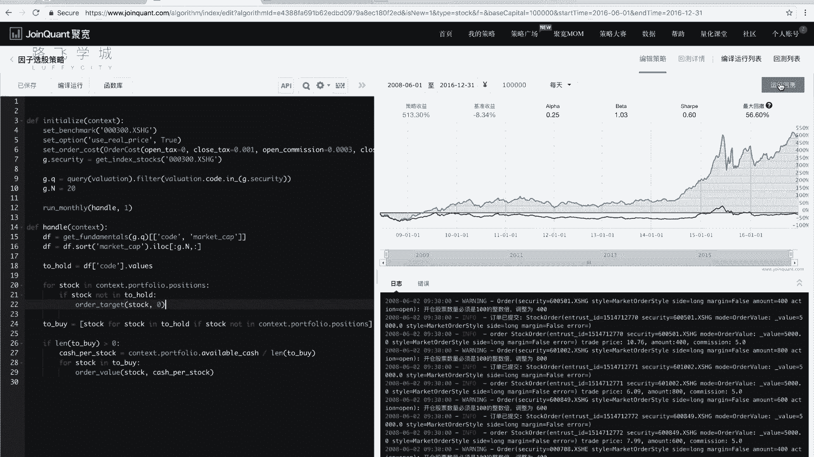

我们的那个年化收益率，就是年化收益率，才是说，大概决定你这个策略一年能让你赚多少钱，你说看最后500 500%多，其实是你8年的，对不对，8年啊，正常就是我现在做的话，就是自己简单测试的话。

10%几到20几，是比较一个稍微正常一点的，如果你能到25，30甚至更高50，那你策略其实是很好的啊，你说策略年化策略百分之几或者百分之负的，那那就百分之几就是赚的比较少了，赔了那更别说了啊。

相关的大家也可以，就是通过这些看一些更相关的一些这个报表啊，或者是一些分析啊，来也可以再进行优化，比如说我可以选择就是我的N是不是可以调整，就是我持有多少只股票，我现在是选择20只，对不对。

你可以试试30只，十只五只等等啊，包括我现在选的是市值，你可以选一些其他的指标，看看哪个指标更好对，那还有我现在选的股票池是沪深300，你可以试试在所有A股里做这么一件事，就是选A股里所有的这个股票。

股票，这个A股所有股票里股票最这个不是不是股。

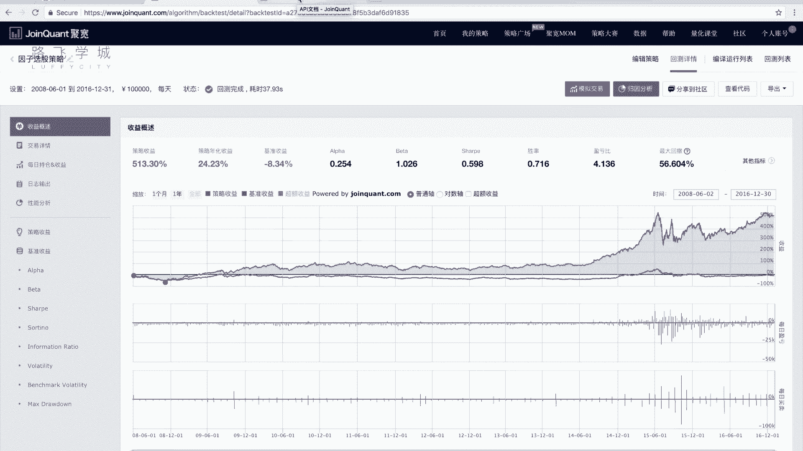

市值最小的所有公司，那看这个A股怎么选择A股。

我们这可以有这个指数数据在里边找啊，A股指数000002给大家看一下啊，首先看刚才这个年化收益率20%多，其实可以了啊。

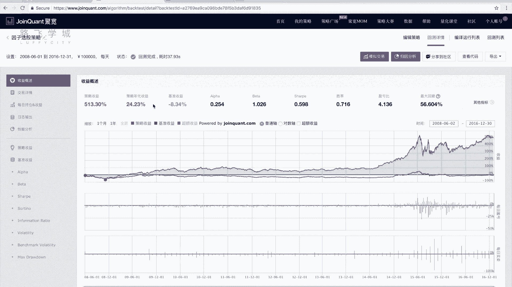

20%多不错了，啊A股指数，就是多调整几次参数，哎这不对啊，这个也得改，就多特征几次不同的参数，然后看一下结果，然后得出来一个综合的，就是你对这个策略综他综合表现的一个反应，对啊，A股看起来也不错。

啊这个就是时间会花费的长一点，等他跑完，啊同时我们这还有一点你可以注意到，你看这会有一些warning，比如今日停牌，停牌的时候，我们没有做，就是有可能什么呢，有可能我们买的没有买到，没有买够哦。

啊没有买够，这个其实呃，有一些就是说明这个策略可能会有一些问题，就是还要再处理一下，因为我们没有算，就是我买的时候没有考虑到这支股票，今天是不是能买，有可能这只股票今天停牌了，他买不了，市值小嘛。

很有可能公司就是这种情况，刚上市可能没过多长时间，然后被证监会查了，有什么问题就停牌了，不让卖了啊，那个车这个策略A股的话更高2805，你看这么窄，小知识策略当然是8年嘛，股灾的时候是跌了。

跌的不足一日，从1500多跌到就是1300多，最低的时候跌到1000多，但是长得很好，所以这个策略其实看着蛮不错啊，简单当然这个说说真实客观情况，你需要综合各种情况。

当然他也也有说你这个市场现在怎么样啊，好这是我们给大家讲的这个小市值策略啊，再接下来进行做，包括大家可以考虑一下我们之前说的，他那个停牌的问题，那停牌的问题，你就过滤一下停牌的股票就可以了。

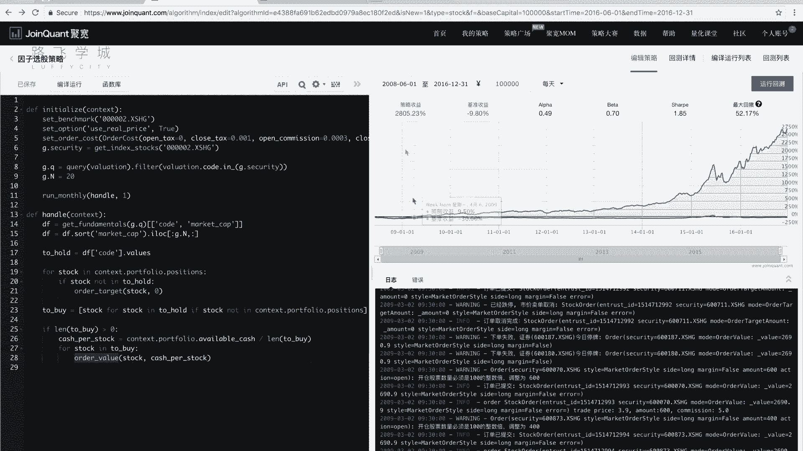

怎么样过滤停牌的股票呢，我们这个啊帮助里之前给大家说了，get current data里有一个pose的这个参数啊，这个是否post这个这个属性啊，你看的post如果是处的话，那你可以比如多取几个。

你取钱呃，取前这个前20个，取前前前30个，然后你在里边再把这个停牌的过滤掉，然后再取前20对就可以了，好。

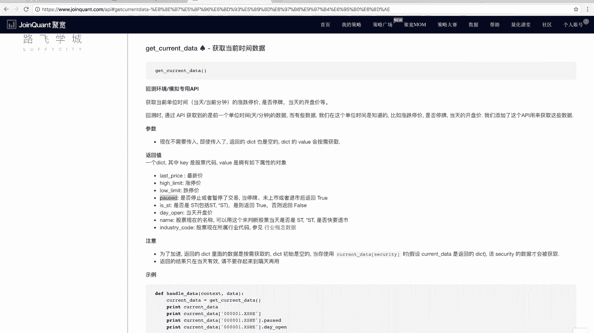

那是这是我们给大家讲的这个因子选股策略啊。