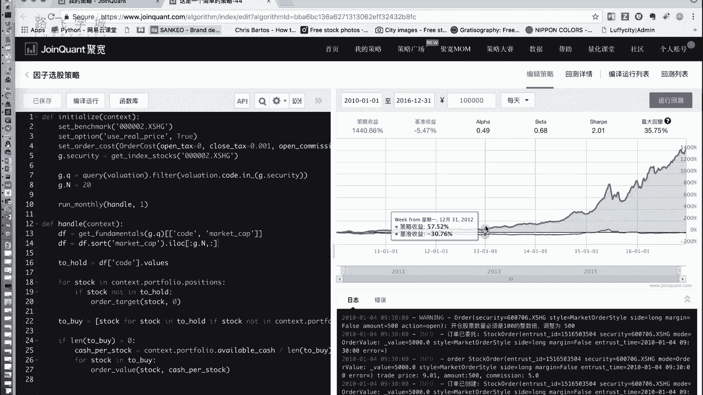

# 清华博士带你学习python金融量化投资分析与股票交易【附项目实战】 - P53：55多因子选股策略 - python大师姐 - BV1BYyDYbEmW

好同学们，那我们继续我们的这个啊，金融量化策略的课程啊，我们可以看到ALEX又回来了，我从火星回来了，刚从监狱里放出来，呵呵行好，那我们上节课讲到什么了呢，我们上节课讲了两个策略啊，讲了一个双均线。

最后讲了一个叫因子选股策略啊，帮助大家复习一下啥叫因子选股策略，所谓因子选股特点其实就是你选一个因子，就是这个因子，所谓就是一个标准啊，一般情况下，你是选一些这个我们的财务财报上的一些指标。

比如说市值啊，比如说你的收益率，你的市盈率嗯等等，嗯然后你选择这个因子，你你怎么选股呢，你就选比如说你选市值，那我就选可能市值最小的十只股票，2K股票来吃它，嗯啊那选股策略一般我们是就是过一段时间。

过一段稍微长一点的时间调一次仓，那当然不是说每天调一次，你可能一周一个月或者两个月一个季度都行啊，你比如说一个月调一次仓，那下一个月你就把什么呢，把手里我现在有这20只股票，你看你的目标是持有新的。

就是现在的，比如说两个月前，这你这20股票是实时最小的对吧，两个月之后了，这20股票可能不是实时最小的，你再出新的标是涨二对，是你持有现在大盘里市值最小的20只股票，OK那我们要做的是什么呢。

先算我们手里这20只股票嗯，哪些要卖出去嗯对吧，哪些不是新的二，因为原来的二手制和新的二手市，有一部分可能一样对吧，那有实质一样，有十质不一样，那我们就把那十支不是十只小的卖出去呀。

然后再把新的那11月买回来，OK啊然后这不可能剩两个月是最小的，这两个月还是小，那么就吃着不动啊，就是这么一个简单的东西，然后我们也看到了啊，最后给大家看了一下，当我选A股策略的时候啊。

这个股票的收益率是很高的，相当高的哇，36%年，这个相当于是你赚了1400%，1400还挺多的，那你投1万买进去，你出来能落个14万，加上1万15万啊，这是就是说这个策略当然说对长线，就是长期来说。

这个选股策略适用于长线炒股，长线炒股，你说短线短期来说他可能不会特别高，你炒六个月炒四个月，你指望着他说一天一交易，他交易的没有那么频繁对对，但是你可能一个月我们这设定的是一个月，但是其实交易。

你看你这个曲线好像前4年都没什么变化对，因为这是一个大涨的事情啊，就是他他还是跟十跟十，就是你的时间段有关系的，不一定保证说你从现在这个从现在开始，按照这个策略走走，6年之后也是赚那么多钱嗯。

这个还是跟市场有些也有一定关系的，当然另一个方面呢，前前期钱少啊，你赚了之后钱越来越多，就怕好多人坚持不下来，坚持不10年，看了4年，发现没有就不搞了，就是短线上表现可能不那么好，因为他操作不是。

那么他不是那么一天可能交一个一次这种对好。

这是我们的因子选股策略，那接下来我们说什么呢，我们现在是根据一个指标来选，就是说我选市值，我就选市值就行了啊，我选这个净资产收益率，我就选你这个收益率最小的最大的，对不对，那有没有办法。

如果我是不是可以综合考虑多个因子，就我几个标准一块考它，可能市值这个指标我看起来也好，那什么增长率这个指标我看起来也好，收益率这个指标我看起来也好等等，我是不是可以综合这几个指标哎，叫做什么呢。

多因子选股策略啊，OK啊就不是看一个了，是我们一看看好多个因子，那怎么样说诶，我看一个因子好看，比如说市值吧，我就把所有股票的市值，把这个数据拿到，然后排序选前十个，前20个简单对吧，那多个因子怎么搞。

就是先选出，比如说市值的哎，比如说啊我们选择市值和这个LE，所谓LE叫就之前叫净资产收益率，嗯啊就是收益率，市值按照我们之前那个市值越小，这个股票可能涨的越好，所以我们选市值小的，想要市值小的。

并且什么呢，并且LE高的就是收益率要高啊，我们可以遵循这个策略来嗯，那如果我们遵循这个策略来，那怎么样同时做这两，做一个先把数值小的筛选出来，再去筛选那个，再再去筛选那个哎ALEX提供了一个策略。

那比如说我想选25票持仓对，那我要选市值小的20只股票吧，嗯不是先选收益率好的，收益率好的，选多少只呢，选出来这个好多只对吧，比如说哎这个艾利克斯说了一种策略，这一种思路，这个思路也挺好。

比如说我想持仓20只股票，这20股票我想让它这个市值小，收益率高，按收益率排序，我可以先什么呢，先选出来收益率最高的，比如说50只股票，然后再在这50只股票里再选出来，是二十二十只。

两只小的股票啊啊这是一种方法，但是这个方法有一些小问题，比如说所以他不是同时考虑的这两个指标，对对不对，有可能说什么呢，比如说我们一定是比如说市值和收益率，那我们一定是要么先从收益率里，先按收益率排序。

要么先按市值排序，市值排序去50只，然后再按收益率再取20只也行对吧，那有可能什么呢，有可能比如说我比如说先按照收益率排序，有可能我第51只股票，他的收益率不太好，但它市值特别特别好。

它市值是就他另一个指标可能表现是最好的，对那你把它扔掉了，这可能就不是很好，因为他有一个先后啊，他不是同时的嘛，怎么能同时考虑呢，怎么能同时考虑A啊，我们给大家介绍一个这个策略有好多好多种。

我们给大家介绍一个最简单的，也是也比较经典的啊，我之前跟我好多学金融的同学聊过，他们好像也在说用评分啊，就是我们说的评分模型嗯，啥叫平衡环线，特别简单啊，你每个股票比如说我想选，我想选两个。

我们不说这个，我说两个，比如说嗯收净资产收益率，我们再来说一个，比如说他股票的就是这就是历史，就是最近的这一个季度或者一年的，它的股票的增长率啊，比如说我们选两个，这两个指标是不是都越大越好。

那我把他俩加起来是不可以加起来，你不能这哦，你收益率百分之多少加百分之多少加起来，然后干嘛加起来，比如说收益率是80%，我假如说啊增长率也是80%，他俩加起来1。6，对是吧。

这加起来和大的是不是肯定和如果大，说明是不是这两个指标都比较好，Yes，yes对啊，对对对对对吧，那我们选这个就是不加起来，我们把加起来这个结果叫做他的评分，各位可以吧。

那我们把选出来这个分最大的N值股票就是了，就是了，那可能说我如果这个如果一个指标大，另一个指标也大，那总分肯定最大肯定大，那如果一个大一点，一个小一点的嗯，他也会就是他肯定比两个小的要好对吧。

就反正说他不是那么完美，但是也但是基本都是你看你，那你是因为他俩是都是一个增长率的一个东西，但如果是市值小呢，这个问题说的好，不是说这个问题说的太好了吧，我先给大家，为什么我不不继续。

我们那个市值跟收益率的例子呢，我换成增长率跟收益率的呢，因为这两个我都是看他俩都是百分比对吧，大概都是在0%，就是0~100到这个百分之百中间波动对吧，他俩是一个级别的哎，那比如说我们要选市值跟收益率。

市值跟收益率，我们回到之前的啊，市值跟roe跟净资产收益率这两个指标，那roe是收益率对吧，它越大越好，市值是什么，越小越好，越小越好，我懂了，我知道怎么弄了，弄了。

那你就不能用它本来的那个那个那个数来计算，而是给它单，比如说给市值设一个设一个权重，给那个收益率设一个权重，他俩的权重相当于是啊是一样的，就不是一样的，就是原装的个数是一样的，他算出来的。

你说的对什么意思呢，我先我我这个我怕这个，所以大家没有听懂，我再给大家解释一遍啊，啥意思呢啊LE高的越高越好，市值越小越好，那我们第一个想法roe，等会儿OE减市值，roe碱试纸嗯，展示这个吗。

这个拿它作为一个评分啊，是不是这个指标越大的，这两个就越大，因为LE越大，是不是LLE没错吧，市值越小是不是减数越小，这个值越大，那这它减它小，是不是整个的就说明他俩指标都好，这个这是一个对吧。

但是有一个什么问题呢，像ALEX说的，我们的roe收益率，比如可能1%不是百分之百嗯，撑死了百分之百，120%，130%，你是不是一点几市值什么数，几百万，几千万，几个亿，你拿千万为单位，你拿万为单位。

他还是几千几万或者是几10万对吧，1。1减是变变成负数，没关系，一减这个roe显得微不足道了，对没错，就而且就你直接剪的话，显得roe没什么作用，基本上都是靠市值，市值的话就是他说话不顶用。

那我们怎么样让他俩话语权差不多呢，刚才ALEX说给设一个权重，对不对，嗯那我们再简单想一下啊，我们是不是LE减去一个，比如说A倍的市值，这个A我设置成一个小的数零点几，就是说嗯。

那我让整个市值跟LE大概范围差不多，是就可以对好，那问题又来了，这个权重怎么设呃，是不是这该想不太好想，你说我市值收益率，这可能是一个选项，那我市值可能换了，可能换成一个别的指标了。

是可能换成说我这一年的这个收益挣的钱，这指标有好多嘛，它的范围也不一样，那这些怎么办，就他们这些数都不是在一个同样的范围内好，我给大家补充一个知识，叫什么呢，叫做标准化，也叫做归一化。

这是一个就是数据处理领域和数据挖掘，数据处理就是你必须要知道，就是你要入门，它，你必须要知道一个叫做数据预处理的，重要的方法啊，就是要归一化，什么叫归一化呢，就是你把比如说我说市值可能是10万。

可能是20万，你把他们所有的市值这些数，那么收益率这些数都给他缩放到，转化到一个同样的标准里，嗯看啊我们先说第一个叫做min max标准化啊，mean in值是最小值，这一组数里的最小值。

max就是这一组数里最大值，这个标准化是什么呢，把原始数据转化为一个0~1之间的数，公式就是这个不知道大家看得懂看不懂啊，X是你原来的数，X星是你转化之后的数，这个转化过程的公式就是。

X减去这组数里的最小值除以最大值，减最小值除以个最大值减最小值，那不就相当于是个平均，对这个其实比较好理解，怎么理解呢，你看啊，如果这个X是最大值，它转化为什么，如果这个值是最大值，它是不是转化为一。

如果他是最小值，是不是转化为零，那如果它介于最大值和最小值之间呢，他就是一个零点几的数，你看最大值减去最小值这个东西是什么，实际上你这段数的长度，对你除以它的长度，是不是就转换成0~11的数。

对对吧对啊，我给大家可以举个简单的可以看一下，咱们简咱们实际看一下，terminal5在哪里，没有哎呀，好，比如说我来一个啊，一的-10~20之间的一个随机数，好看一下啊。

这是这个A里面存的是一组随机数，这个数的范围，我设定了它的范围是在-10~20之间对吧，你看这是有五啊，这有11对吧，都在这个之间，那我怎么把这个A转换成我们的，这个就是怎么进行标准化。

或者怎么进行归一化呢，我们来看一下，按照我们的公式啊，B等于什么呢，等于A里的每一个数减去它的最小值，除以最大值减最小值对吧，好，我们就可以直接按照，因为我们之前讲过。

number py可以直接对一组数进行操作嘛，所以我可以这样写啊，A减去A点，min括号，除以A点max，减去A点min，好解释一下这个式子啊，这里边这个是个数对吧，这个是个数，这个是个数。

相当于就是这个东西是个是个数组啊，是个number py的这个n n d arr是个数组，那也就是说相当于是它跟数，就是相当于是我们利用的，我们那个number py里的那个数组跟数进行运算。

那就是按照每一个数都这么运算，现在就是把这一个数它减去幂，然后比上max减面嗯，啊每个数都做TA里面的最小值，对这东西是个数嗯啊这也是个数，这也是个数，就是一个固定的数，这里边的数好。

我们看转换完了之后是不是都在0~1之间，然后我们找这个最小值变成了零嗯，这个最大值变成了一啊，你可以退回去找哪个是零，哪个是，我想问一下啊，那呃为什么要用这个数组里的最小值，因为这样出来之后。

正好是把原来的数组放到了一个，0~1的范围之内，而且他们基本上，他们这个数据之间的关系没有变化，就该大的还是大，该小的还是小嗯，好并不能很好地理解，像我们这个智商，这挺好理解，怎么不好理解呢。

你看原来的A是吧，嗯我A减去A点min嗯，这个操作之后，所有的数变成了什么，是不是相当于比如说我我我之前在这是一段数，这段数之后我减去密，是把它移到了0~1个数之间，嗯嗯对A是谁啊，A是A是那个数组。

比如说啊，比如A的范围在刚才我设的是-10~20对吧，对然后比如说最小值是十对，那我A减去A点min，A减去min，是不是原来-10~20的数就变成了什么，0~30之间的数，对不对。

变成了0~30之间数了，因为你相当于减去十嘛，现在加上十吧，但是你这个数就是每一个数都加了十，就是数和数之间的大小关系不变，对不对，现在变成了0~30之间的数，然后我把它除以一个什么呢。

除以一个A点max减去A点面，A点max减去A点面，说明是这个数的长度，刚才我说的最小值是十，最大值是20，长度是30对吧，因为你转换完了之后是现在是十，0~30也是30对吧，0~30的数除以30嗯。

是不是变成0~1的数对，那相对关系还是没有变，相当于我把这段数压缩了嗯，所以这是一组数的两个操作，减去幂是相当于做了一个平移，类似于就是从零平移到从零开始到一个数，然后再除以这个塘路。

相当于是把它压缩到0~1之间的范围，但是它们之间的大小关系没有变，就原来大的数在这里边还是大，原来小的数在里边还是小，好吧，我再理解一下吧，我知道这个意思，这个数我都看出来这个叫做什么呢，叫做标准化。

叫做归一化啊，那有了这个之后啊，先不要看下边，有了这个东西之后，我我们想之前的这个多因子选股，比如说我们要对市值和LE，按照这两个指标去找到同一个标准对，那我们就把他们两个都做一下，归一化对。

都变到0~1范围之内，那他们两个的话语权是一样的，对那我接下来还是按照之前的LE减去，就是变换之后，转换之后的LE减去变换之后的市值嗯，因为你还是得减啊，因为你事实是越小越好吗，对那就OK了，对对啊。

那我们这一步相当于把权重，实际上就是放在这个转换里边，我们就不考虑怎么设定这个权重了，我们就把它统一放到一个范围里，对啊这叫做MMAX标准化啊，我再多说一点，这个标准化用的挺多的。

但是有一点缺点是什么呢，如果说就是跟那个我们选股没有关系啊，就是单独说标准化，说归一化，如果有新数据加入的时候，可能会导致me max，那你就钱再算一遍呃，有有更就是有公式，就是我来了一个数。

可能就是有new min和new max那个公式，在这没准备给大家说，因为比这更复杂嗯，就是他可能没那么好用了，那除此之外还有一个标准化啊，ALEX之前没有听我给大家说过了。

这个就说过了一些概念叫什么呢，这个叫z score标准化，它是什么呢，就是它的方法是X减去mu，mu是这一组数的平均值，比上西格玛，西格玛是这一组数的标准差，你嗯什么挺好，我知道标准开，卧槽哦。

这么厉害，卧槽好，那这样完了之后，原始数据被转换为大家可能听不懂了，不知道记得不记得，转换为均值为零，标准差为一的正态分布的随机变量，为什么均值为零，标准差为一呢，再给大家举个例子啊。

好还是这个A还在吗啊，A减去A点啊，平均数min，除以A点s std标准差是STD好，可以看到这组数就是新的这个东西，我表示管它叫做B叫C吧，好C制数数，我们可以看到它不是转化为0~1了，它是什么呢。

原来的平均数会转化成是零，因为你看我们看这个式子吗，如果X是等于平均数的话，那他是不是转化成零，如果X小于平方数的话，他是转换成为负的，如果大于零时，是转成一个正的，所以他是转换成一个叫做均值位。

就是你转换之后的这组数嗯，原来的平均值是几嗯，然后为什么说标准差是一了呢，因为原来是一个有一个标准差，减去mu之后标准差不变，标准差相当于是表示整个数据的分布，size就是分散的情况嘛。

离散程度我给大家说啊，你除以标准差之后就是把它收紧了，就是就是转换成我们叫高中学的，那个叫做正态分布，就是一个中等曲线，不知道唉，为什么为什么除以标准差就把它收紧了呢，因为你之前的标准差可能是二嘛。

标准差二就是散嘛，你除以一个二，如果把它把每个数原来啊原来是-2~2，除以二不就变成-1~1了，就是把它收紧了啊，那这样的话也是，就是它的最小值和最大值就不一定是一样的，但是它大概的分布也是就是在一。

就是因为有正态分布那个呃一些定理，那叫三西格玛定理，就是他在99%的数，都在哪个范围到哪个范围之间，嗯啊就大部分是一样的，这也是一个标准化的方法啊，我们这不准备深入的讲解。

但是大家以后如果想就是呃做一些数据方面，比如数据处理，数据挖掘这方面的，涉及到这方面的工作，或者是一些东西的话，这个还是需要再深入了解一下的，哈登啊，这个还是一个比较常用的东西啊。

我们这暂时就是在我们的这个多因子，选股的时候，就用我们前面这个min max标准化，把它转化为一个0~1的数好，这就是我们就是多因子选股的方法，那当然说有没有其他方法的，肯定是有的，方法有很多。

比如说ALEX所说的是一种啊，你先选50只，然后再从50只里边挑20只也是可以，大家可以都写下比较一下，这这这几种哪种好一点，好的好，那我们的知识就说到这儿，那接下来我就给大家。

在我们的这个因子选股测量上稍微改一下。

改成这个多因子选股测量，我们来看一下。