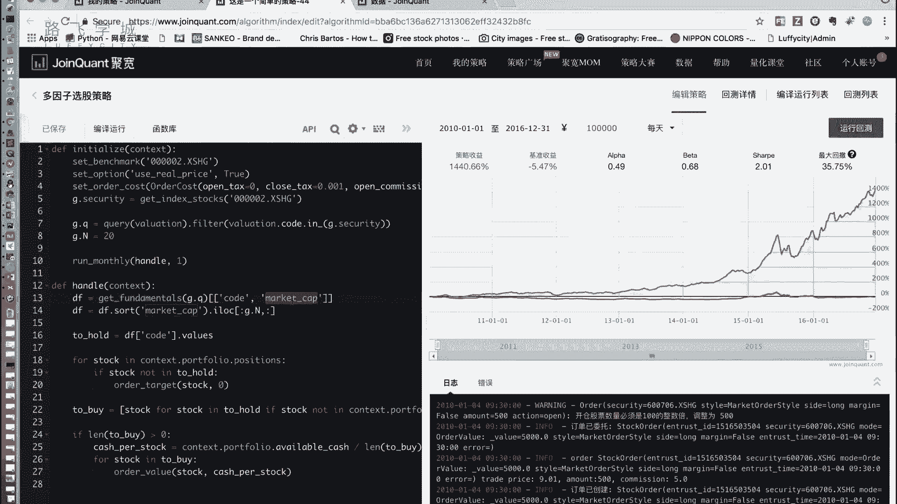
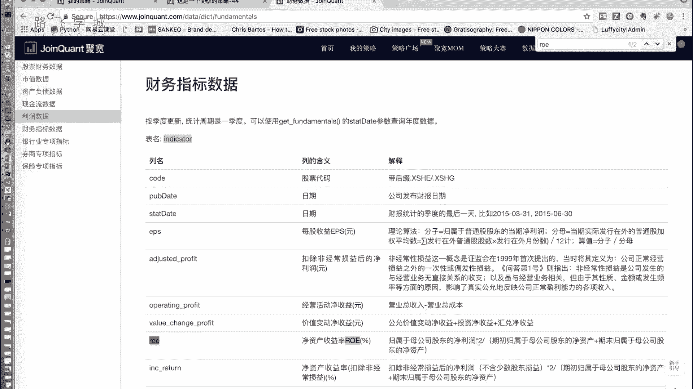
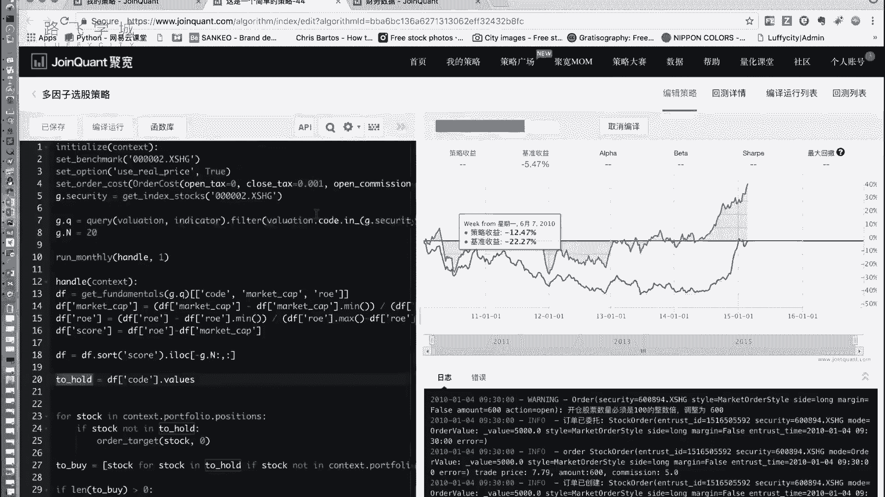

# 清华博士带你学习python金融量化投资分析与股票交易【附项目实战】 - P54：56多因子选股策略实现 - python大师姐 - BV1BYyDYbEmW

好同学们，那刚才给大家介绍了，我们的这个多因子选股策略的，就是怎么同时考虑多个因子啊，我们用这个评分模型，就是把他们两个的分加起来或者减，那取决于这两个事他是大好还是小好，那为了让让这些。

这个让这些因子的话语权一样啊，就是权重一样，那我们用了一个归一化的方法，把它们都放到0~1这个范围内好，那我们接下来实现一下这个特点啊，因子大家可以就是就是多因子选股具，究竟选哪些因子呢。

这个是你要经过各种数据分析啊，或者你各种尝试不断的尝试各种因子的组合，然后你加上一些的经验来选，那么这比如说我们这儿就选择两个因子啊，我们之前的这个啊，市值和roe嗯啊这两个都比较有代表性。

因为是一个小号，一个大，好嘛好，那所以我们这儿啊，在我们的，这是我们之前写的那个因子选股策略的代码啊，那我们在这个基础上进行改动一下，变成多因子就可以了，好那改哪些呢，首先我们之前说啊，因子选股。

我们是要从我们的这个财务数据里，财报里选出来所需要的数据啊，我们之前就是在这个valuation表里选出来的，我们的market cap，这个是我们的市值。

对不对，那我们现在还需要roe，那我们接着去数据部分的这个啊，股票财务数据，看看它的roe是在哪个表里嗯，好找到了这个净资产收益率啊，这个有好多各种各样的，这些都可以当做指标。

那我们在这就不光需要，因为我们的这个呃market CAB是在valuation表里，那我们在这就得是valuation和in，啊这两个表，然后get放在mental里啊。

然后这个code valuation点code in，这个就不用管，就是这个股票代码在这个security，就是我们在我们设定的这个范围内，在这个这个股票的范围内，这这个股票列表的范围内就可以好。

那接下来我们选的时候，Get fundamental，这点Q是相当于是执行这一条，这个cycle的查询，然后返回下来的表，我们选择其中几列，包括之前的股票代码，市值和我们新写的ROOE啊，就可以。

然后我们把下边可以暂时注释掉，好我们来看一下，就说打印一下我们的data frame，来看一下这个结果应该就是有三列啊，包括这个代码market cap和LE，然后接下来我们就需要什么呢。

就需要啊来对他们两个进行归一化，我们可以看到哎这是市值，这是roe，看他们两个的这个是百分号为单位，这个肯定是估计是万为单位的对吧，是1000万，40万，100多万等等啊。

那我们接下来就是要把他们两个归一化，好归一化跟之前我们介绍的那个写法差不多，怎么写呢，DF的market market cap这一列应该被赋值为DF，market cap减去。

d f market type加min问号括起来，除以，点f market tab点max减DFM t tab点没嗯，妈还有点差，好这一行是把market cap这一列进行了归一化。

然后接下来LE也一样，直接把上一行复制，然后把所有的Mark t cat改成L1就行，其实，因为他们两个人自己操作是完全一样的，嗯嗯好，完事之后我们再去打印一下我们的data frame啊。

我们来看一下这个的结果，啊有点就因为是平台嘛，所以有点慢诶，我是哪儿写错了哦，没有加括号，没有一个float，有这个没有加括号的，好我们可以看到这是我们的market CAB，这是我们的LE。

他们都变成了一个就是0~1的范围，一个数对，然后接下来我们可以啊，比如说我们创建一个，比如创建一个新的列啊，叫做score点，就算得分吧，它等于什么呢，它等于DF。

我刚才说是什么ROE这减df market cap啊，当然这个SCR列大家想一下肯定会有正的，有负的，因为他们两个都是0~1，可能有，但是有负数没有关系，我们的目标是选出来什么呢。

选出来这个score最大的20对，20个是不是就可以对好，那接下来做法跟之前的那个因子，选股策略基本上一样了，只不过不一样的是什么呢，看我们接下来把注释的这段代码放出来啊。

我们之前做的是对这个market tab这一列进行排序，那现在我们要做的是对score这一列进行排序，然后我们要选的是最大的N啊，对它进行排序，因为正常是升序排的嘛，所以是选后N列。

我们之前选的是前N列，所以我们这这样写啊，把它改成列上这三列啊，全要行上要什么呢，行上要负N这个N是20吧，就是-20到最后才能选出来最后20列，那这个DF就是成为了我们的新的突后的。

就是我这个月要持仓这20只股票啊，然后接下来的策略跟我们那个因子选股，完全一样，然后接下来我们看现在持仓的，不是在to hold里面全都卖出去，然后再拖后一点，但是呃不看啊，是再拖后点。

但是我现在不持仓的全部买下来，咱们就是先把十只卖出去，然后再把十只买下来，让让我持仓，这个月持仓的变成这个月，就是我选出来的这二手数据票嗯，好方法就是这样好，我们可以运行一下时间，我们设置不变。

显然这个效果没有刚才那个好，因为刚才跟着这个下来就跟着下来了，当然时间还是要再长一点，差估计是不会差，但是我估计没有之前那个只选市值的好，为什么，因为之前那个市值太火了，这这是这是什么走势，怎么走势。

看得我很心惊啊，你被开了，你跑成这样的数据来就被开了，第一遍考这些指标是我这个指标的选，我不是说因为这俩指标好，我就是因为这俩指标能够说明一个大一个小嘛，嗯但是显然这个不能令我比较满意，比大盘跑得好啊。

因为大盘怎么就又跌了呢，之前也没跌啊，这就是大盘，这跟我没有关系，这是这大盘一直是这个是吧。

对大盘一直是这个，他只不过是之前我们长得比较那个高，比较幅度大，这个就是在我们之前那个策略，写起来就是比较平了，他范围放大了，开始涨，这段时间大盘涨了，我反正比跑的比他还好，大概没有之前那个那么逆天。

这个东西也没有什么理由是吧，有理由，但是你说理由嘛，可能一个人给你解释会条理论就不一样啊，看到最后152%也还OK啦也还OK啦，嗯就是怎么跑过得去，但是没有之前那个那么逆天S这这证明什么。

证明我们这个组合还不如单独选了一个因子啊，当然这个什么呢，呃你还可以接着就是我在我们这个基础上，接下来再做一些研究啊，再做什么研究呢，哎啊我这没有写。

我忘了写了，做什么研究呢，你可以选择不同的因子啊，不同的因子组合，比如两个三个甚至五个十个啊，多个因子不同的一块来决定，第二一个你因子上还可以加权重，嗯啊我们这个我们这个呃，我们现在这个策略是什么呢。

事实上他们两个话语权一样，但是有可能比如说实践证明，这个因子比那个因子稍管更管用一点，那你们可以什么样的，你说我在这是LE减去market开，那比如说我想让market cap权重大一点。

我这是不是可以乘一个，比如说乘个100对，就是我刻意让它权重不一样啊，那这个权重是需要手动调的，可能需要你的经验什么之类的，比如你这个成立100之后，你可能market tab说话大。

我觉得这个特点会比现在的是，要是不是要好一点，这152%大家可以跑一下，看看是不是比他好一点啊，有各种各样的，就是你可以接下来做很多事情，这件事情当然就是不是那么简单的了，需要一些经验。

需要一些其他的东西好，但是我们给大家讲的就是一个套路，就是你怎么来做，同时考虑多个因子这件事好，这是我们给大家讲的多因子选股策略好，我们现在给大家讲了两个基础策略了，一个是双均线，一个是多因子选股。

这两个策略分别代表了双均线的策略，代表了我们的择时策略的一个特点，嗯啊所谓择时策略就是再给大家复习一遍啊，就是我这个策略主要决定是什么时候买，什么时候卖啊，这个因子选股特点主要是帮助我们来做选股啊。

所谓选股其实就是我决定我买哪买哪些股票，就是你看我这并没有说这个指标到什么，什么时候我就卖出去，我不管我就一个月卖一次，一个月调一次，那帮助我的是我选哪些股票，我觉得这些股票价值更高。

它涨得比就是可能有选25号有18只涨六，有两只接的，对不对啊，那是这样好，接下来给大家再讲一些，这个就是各种各样的呃这个策略，但是这些策略无非是要么基本上它侧重于选股。

要么几种基本上侧重于测试对，那大概就是这些，好好，那我们的多因子悬空策略就给大家讲到这。