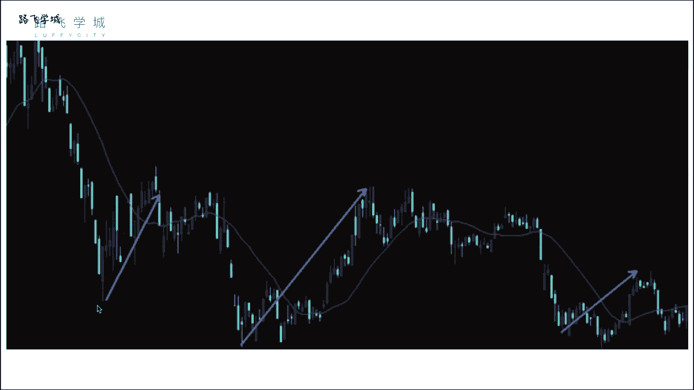
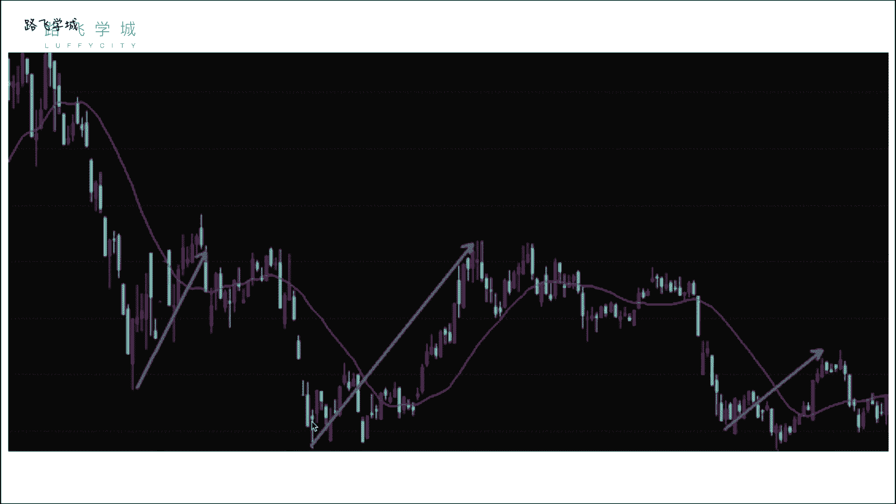
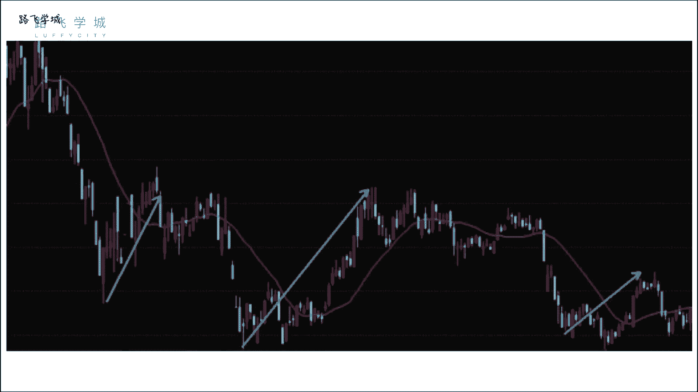

# 清华博士带你学习python金融量化投资分析与股票交易【附项目实战】 - P55：57均值回归理论讲解 - python大师姐 - BV1BYyDYbEmW

好同学们，那接下来我们再给大家讲一个啊，讲一个量化策略叫做均值回归理论，嗯啊这个理论均值回归理论你看着挺高深，其实就是一句话啊，核心就是一句话，大家都知道跌跌下去的迟早要涨上来。

嗯就这一句话嗯啊那通过这句话，我们能做点什么事呢，我们可以这样啊，就是下边就比较学术，上边这个任何人都能听懂，对不对，但是下边这看啊，均值回归的理论，基于以下观测价格的波动，一般会以它的均线为中心。

也就是说，当标的价格由于波动而而偏离移动均线时，它将调整并重新回归于均线，均线是什么，我念完了这个东西，军训是吧，在艾利克斯去蹲监狱那几天没听课啊，好吧好，就平均那个线嘛，我这两句话其实是一个意思。

我就把它翻译成什么官方的学术的话，就变成这个那均线之前什么。

大家应该除了他大家认识的均线对线，60日均线，就是过去多少天的一个价格的平均值，我知道了，今天除以啊，那给大家解释一下价格的波动，会给它的均线问题，也就是说你价格的波动就是哎就就围绕在。

因为均线是一个平均值嘛，所以你价格的波动一般不会就是蹭，我不管军线了，我蹭窜老远，一直窜没完，所以肯定会一直绕着均线波动，那当你的价格波动偏离均线的时候，他接下来就是比如说往下偏，往下偏离均线。

就是跌下去了吗，那他将调整并重新回归于情线，就是说他他早晚得涨回来，为什么呀，为什么早晚会涨回，那你它也有可能永远跌下去啊，因为金线也会跟着他这个一般情况，你说你说那些是破产了。

那可能跌几天或者跌个半年，OK一般情况完了对吧好，那我们看一下这个图啊，这个线是均线，然后其他的这个这是我们讲的那个K线图，就是股票的价格，我们看看啊，就是你一般来说这个均线你看跌下来，跌下来随着跌。

因为均线是一个，比如说30或者10日均线，它的波动，比如说我今天它的波动，肯定是比我实际的股票波动要小的，因为你可以理解成股票的价格就是一日均线嗯，也就是一天的吗，我们之前说过，你这个均线的时间越长。

它的波动会越小，那你一日均线它波动的肯定比这个要大，所以当它跌的时候，它会逐渐偏离均线，当偏离偏离到最大的时候，它将重新回归均线嗯，就是跌下去要涨回来，这跌下去要涨回来，DC需要问题。

你知道什么时候是偏离最大的A，这就是一个问题，你知道什么是偏离最大的好，所以说呃这个策略我们一看一就是大概一想，我们拿它做，如果做择时，你们想一下做择时的话，就是要找到什么呢。

找到当前偏离程度最大的时候就要涨，然后要买这个时候买，然后往上偏最大的卖，但是这个东西不好做，为啥不好做呢，因为你也不知道对呀，你不知道它为它是不是最大的，最大的，它什么时候最大呢。

有对有可能你看有可能在这里就是最大的，对吧对，你不知道，因为你不知道明天的价格会怎么样，所以你说今天我今天价格在这，那我今天这是最大的吗，明天万一更跌了呢，所以这是一个谜对啊。

所以这个我们的这个这个啊均值回归理论，今天学的不是拿来做这个择时，是拿来做选股，当然择时也可以做什么呢，你可以说你定义一个啊，我们接下来要讲的，你定义一个均线，就是你的价格到均线的偏离程度。

嗯啊我们先把这一点说了，什么叫价格到均线的偏头呢，比如说现在均线是十块钱，我今天价格是八块钱啊，那我定义它的偏离是不是10-8是两块钱嗯，那我用这个两块钱可以表示偏离程度吗，可以但是不好，为啥不好呢。

比如说有一只股票啊，有一支股票它是十块钱，然后当前价格是八块钱，有另一只股票他是五块钱，当前价格是啊，这就十块钱，当前价格是八块钱，有一个股票是五块钱，当前价格是三块钱，他俩都偏两块钱。

但这是不是更明显，五块钱那个偏的更大嗯，对不对，按照我们这个理论，它是不是因为它价格小嘛。

所以它偏的话偏的更大，那我们就需要一个类似于百分比的东西，那我们就定义偏执成的什么呢。

ma减P再除以MA啥意思，ma是均线，P是价格啊，比如说当前价格是十块钱，我的价我的这个呃当年均线是十块钱，我的价格是八块钱，那我就是十呃，8-10再除以十嗯，等于偏了，往下偏了。

就他算出来是百分之负的20%吧，相当于是往下偏了20%，这个负就是往下偏啊，如果当前价格表示入这个是五块钱，当前价格额均线是五块钱，当前价格是六块钱，那我们偏离统就是6-5括起来除以五。

等于是向上偏了20%，嗯啊啊偏了百分之是24%的1/5，对啊，就这样好，那我们再说回来，因为我们不知道往后是不是这个还会往下，就是不知道未来的价格，不知道当前它是不是这个最低的，那不太适合做择时。

当然也可以做，那如果做择时怎么做呢，给大家提供一个思路，你可以，这不是我们给了一个这个啊什么嘛，给了一个偏离程度嘛，你可以通过各种各样的数据来找一下，这个偏离程度是什么时候比较适宜。

那这个偏离程度比如说你大于向下偏了，大于20%的时候，你就认为它是最低了啊，然后你就就买入，然后往上偏，比如说10%的时候你就卖出，这也是一个策略，当然这个20%和这个10%，怎么确定呢，随便定一。

你当然不要随便听了，随便听不太好，你通过历史数据，你历史数据把这些都下下来，看一下历史上它偏离均线嗯，到往下偏离均线最大的所有数据都下下来，然后找一个，比如说你找一个中间的数，或者找一个靠上靠下的数。

一般我们考中位数或者是1/4，3/4位数，这个你自己就是需要一些调整的参数啊，或者通过经验啊，对那但是我们今天讲什么呢，我们今天讲不讲选股，而不讲择时，讲选股就是什么呢，我们有好多股票，那我们找什么呢。

找偏离程度最大的N支股票是吗，这是不是也是一个思路，嗯对好，所以我们就来了，我们的均值回归策略是一个选股策略，这个选股策略在每个调仓日进行，所谓每个调仓日就是他因为选股嘛跟之前一样。

也是比如一个月两个月调一次仓，那找我们的股票池，所有的N日均线算出来。

然后计算所有股票的偏离度，所谓偏离就是我们之前这个公式啊。

MA减P除以A嗯，这个偏离度算出来，找到偏离度最高的M值股票嗯，拿它持仓，所以你看我们的这个均值回归理论，或者均值回归策略，实际上也是跟因子权国会的基本上一样，不一样的。

就是你要算就是你的因子不是现成的，我们之前讲的因子都是你现成的财报上的数据，或者什么数据，但是我们这个因子是你我自己算出来的，一个偏离程度诶，那这么是不是可以理解为说这个偏离程度越高，股股票波动越大。

风险就越高啊，呃股价波动越大，你这个波动程度你应该是算就是风险，这个东西应该是算他的标准差。

呃怎么说呢，有可能是什么呢，有可能是你这个股股票，就是你比如说前一年都是上下波动，大概10%，今天突然跌了20%，如果我信任这支股票，我立马买这只股票，因为他现在是个异常波动，就它跌的太低了，不正常。

所以他肯定会涨，我这我可以这么理解，当然这个东西任何事情都不是绝对的啊，你说它的风险高也不是没有道理好，那我们就是基于这个策略，OK好，就是基于它来做好，那我们的均值回归理论的。

这个就是啊理论部分是阐述部分就到这。