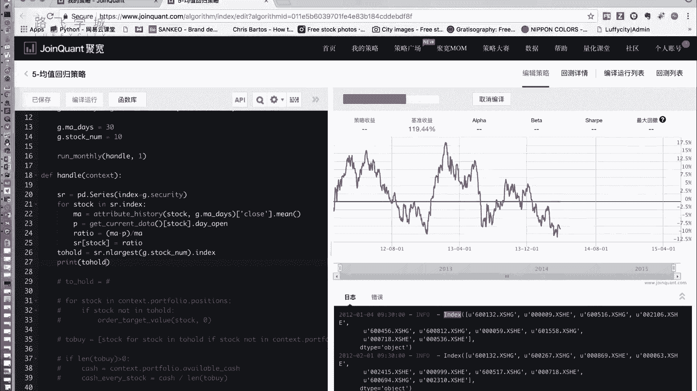
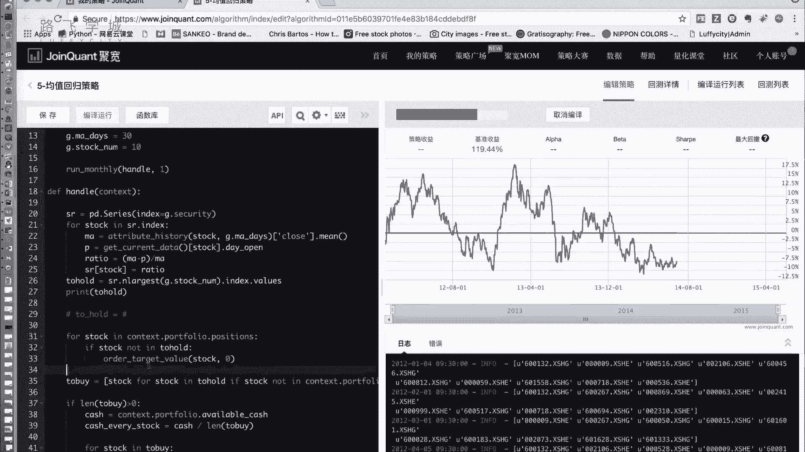
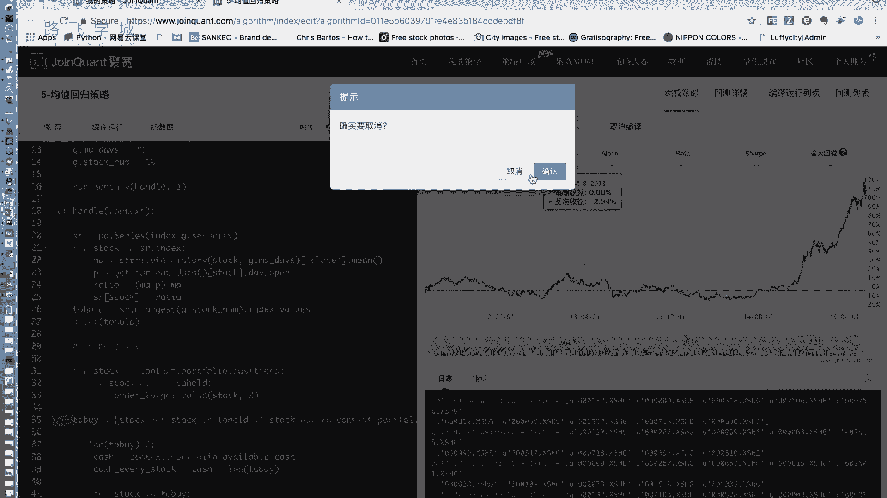
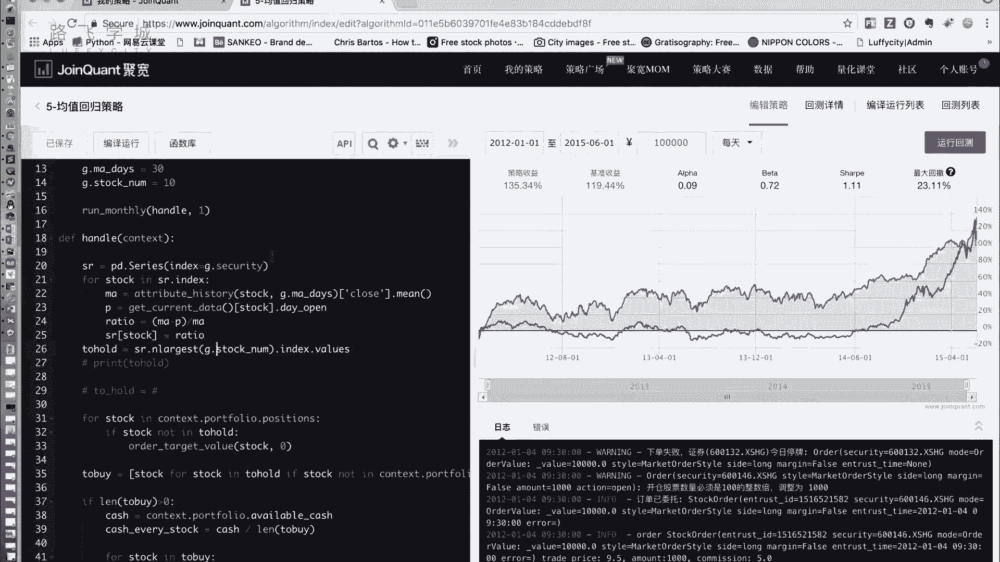

# 清华博士带你学习python金融量化投资分析与股票交易【附项目实战】 - P56：58均值回归理论实现 - python大师姐 - BV1BYyDYbEmW

好同学们，那咱们刚才说了这个均值回归理论的，就是他是个怎么回事，除了理论部分，然后再实现一下啊，我现在屏幕上这些代码呢。

基本上是因为均值回归四理论，也是一个说也是一个选股偏向于选股的，那我们这个框架基本上就是和我们那个因子，选股框架的东西一样啊，前面这我就不说了，设置什么，这个选这个用真实价格设置手续费，然后选这个啊。

基准我们选这个沪深300还是，然后这点security设置我们的股票池沪深300啊，这两个这个这个MAD是，因为我们这个额均值回归理论里，需要有一个要算均值嘛，就是P减ma除以MA表示他的偏离程度嘛。

那选多少天的均值呢，30天，比如我们选30天，这个参数上是可调的啊，咱们这几改成60天，改成十天会怎么样呢，那不一定啊，这一点stock name，这个是存，就是说我持仓多少只股票跟我们业主权股一样。

就是你留多少只股票啊，啊然后这个每个月执行一次handle，在handle里其实啊后边都一样，你只要拿到图后的后边部分都一样，你就先这个先卖后买，逻辑跟我们的印度存货都一样。

那现在问题就是怎么样拿选这个图后的对吧，好，要选这个拖后的，我们的目的其实就是什么，就是就是要算一下每个股票的股票池里，每个股票的一个打分，这个打分其实就是这个那个偏离程度，把每个股票的偏离程度算出来。

按偏离程度排个序，取前N大的是不可以啊，好那我们先创建一个什么呢，pandas as的series对象啊，还记得不记得，就是那个一维的一个一维的这个数据，他的index等于什么呢，等于我的G点。

Security，就是我的这个security是我考虑的一个股票的股票，所有代码的列表啊，那我就是什么这个series index，它的索引就设置成是我的锁骨和代码，它的值现在是空的。

那接下来我们就往这个seriously填充它的值，它的值就是我们那个偏离程度好，那接下来false stock in，啊SR点index，那我们要算每一个stock。

这个stock其实就是这个什么就是个键啊，嗯对吧，就是SR的一个就是所有的股票，那它其实就是一个股票代码，那我们要算这个stock的所有就是它的偏离程度，那偏离程度需要什么呢，需要两个值。

第一个是ma m a好算对吧，我们和之前我们那个这个双均线策略一样啊，什么呢啊，Attribute history，这些参数都不要两个参数，第一个是股票代码stock，第二个是多少天，多少天呢。

我们就用这个啊，J点m a this嗯，就是30天，默认30点，它就这个东西传出来，就是一个30天的一个data frame嗯，那我们选close这一列求平均，是不是就是这个股票的在这一天呢。

它的30日均线嗯，好第二一个PP是什么，P是今天的价格，嗯啊那今天的价格我们用我们也是之前讲过的，用我们的这个current data这个函数，它返回的是一个，就是所它返回的是一个所有股票的这个呃字典。

然后他的键是股票代码stock嗯，传进去之后点day open啊，这些东西我在我们的双均线策略里都说过了，哎，应该是双均线，和那个我们第一个这个策略的时候讲平台，就是介绍平台的时候都说过了啊。

不还不清楚的同学可以去看一下我们的这个，就他这个平台的一些这个API都有说明啊，点day open是什么呢，就是今天这支股票的开盘价，对我们拿它来当做价格好，那现在计算偏离程度。

比如叫ratio这个东西等于什么呢，等于ma减P除以MAP是什么，P是今天的价格，那他就表示这个股票到均线的偏离程度，这个值越大，说明什么呢，说明P偏离ma往下偏离A越多，那我们就把往下偏离最多的选择。

因为我们的目标是选出来往下偏离最大的，他一定会犯，他一定会涨回去吗，好那我把ratio写到这个series对应的值里，这是SR，stock等于real好，这个for循环执行完之后，我们的什么呢。

我们的这个呃serious的值就填充好了，那接下来我们从里边选出来N个最大的，就可以啊，大家可以排序啊，SR点salt，但是我们这我想教大家一个更，另一个叫n largest。

啊n largest为啥用它呢，因为其实就是算法上来说啊，这个东西比较sort快，比salt要快，就是运行时间要快，但是呃你要大家选用source也可以，就是一样的效果。

你sort完之后再接上那演示一个其他的，那他传传的是要多少个，要stock number girl，就是这个意思，就是我从SR里选出来最大的这么多个，这么多个就是十个股票，然后返回出来。

然后我们把它存到to hold里，当然这个东西它相当于是把这N个，把这把这十个股票对应的列选出来，那我们要的是它的index对吧，嗯他的index这个index返回的呢，我们可以把后边先注释掉啊。

看一下，打印一下，To hold，好你看一下，这就是我们每天打印的这十只股票，好那这个index，因为点index说它返回的是一个index类的对象，你说我把它转换成数组。

你可以再点values4，啊这个东西返回就是这个东西返回的。

就是它的数组嗯，有点慢好，那出来之后肯定是长度为十的一个数组，那我把它传给下边这个数组，那把它传给下边就注释的地方，再把它放出来啊，从突后的这是卖。

然后算to by，然后买，接下来逻辑就一样了，那我们运行一下这个写完的部分。

把这个打印取消掉，我们重新一下啊，这个这个这个策略总体来说呢，它其实就是一个稍微加强了一下的因子，选股策略，不过这个策略它的因子不是现场上的，是我们算出来的，那刚才之前ALEX说过。

就是他会有说这个它往下跌的太特别多了，是不是说这个股票风险大呀，是有这个存在的可能性，当然我也没有具体验证过，大家有些人就说我就想验证一下，就是这个东西，每一个策略你都可以往深了挖挖挖挖特别深。

你这个东西是不是有这么一种情况，是不是就像说这个均值回归策略，是不是会说会有好多股票，因为它可能波动性特别他就没准，波动性特别大，就是不靠谱，那这样的话是不是增加了我的风险了啊。

这些东西你可以通过具体指标来算，你可以统计说我这十只股票，我算一下有哪哪哪几只股票，它是平常风险比较大的啊，这个再研究深入的话，大家就是自己再去写相应的代码，就可以好好看，结果出来了啊，效果不是特别好。

你看比我们那个什么来说，比那个因子选股，比小市值策略来说差太多了，江江跑赢大盘，至少比大盘还是好的啊，再往下就是就是这个策略调参啊，就是除了我们写代码，具体的调参，什么叫调参呢，就是各种各样的参数。

比如说我这个这个均均线对对，我选现在是30天，我选十天的，我选60天的，会有不同的效果吗，我十十只股效果吃多一点或者吃少一点，会有什么影响吗，那比如说这个啊，你的股票池，我现在选的是沪深300。

就只有300只股票，那如果我选A股呢，咱们来试一下，额选所有A股是00002吧，对你看A股指数嘛，按你这要改，好各种关键参数调整之后他会有什么样的，就肯定会有不一样的东西，比如说我换成A股之后。

肯定很明显就不一样，你看就他你看这个A股的，因为A股的指数它所股票多，所以它的指数没有表现的没有沪深300那么好，但是同样你看这个效果，等它跑完吧，这肯定是不一样，但是这个就是这些参数呃。

还需要说你要选定了用这个策略，接下来的工作还有好多，绝不只是说写完了代码不多，写完了这几十行代码，甚至100行代码就完事了，嗯嗯好，这是我们给大家讲的这个，均值回归策略的部分啊，看到他比大盘跑的要高。

但是他好像涨的没有沪深300那么快，因为沪深300本身那些股票都是代表性比较好，就是这300只股票都比较好啊，我们这个这个均值特点，就只是这一个简单的东西，没有做任何的停牌啊，什么呃s st过滤啊。

都没有嗯，啊，如果你看也可以把这个均值回归策略，跟其他的策略结合起来，比如说他是不是也是一个因子，我是不是可以做多因子，我把它跟市值是不是可以结合起来，做一个多因子，就它也是一个平分嘛。

那这就两个几个多因子，或者是说你再拿它加上选股的一些，不是拿加上择时这些策略，或者加上一些这个什么止盈止损的一些东西啊，还可以继续优化啊，这个也出来了啊，策略收益比刚才高还是低，我不记得了。

差不多好像嗯，但是就是表现肯定跟刚才不一样啊，两条线是不一样的，好那我们这个关于均值回归啊。

理论均值回归策略就给大家讲到这儿嗯。