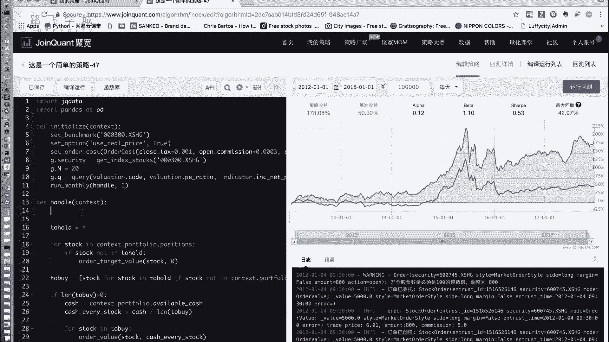
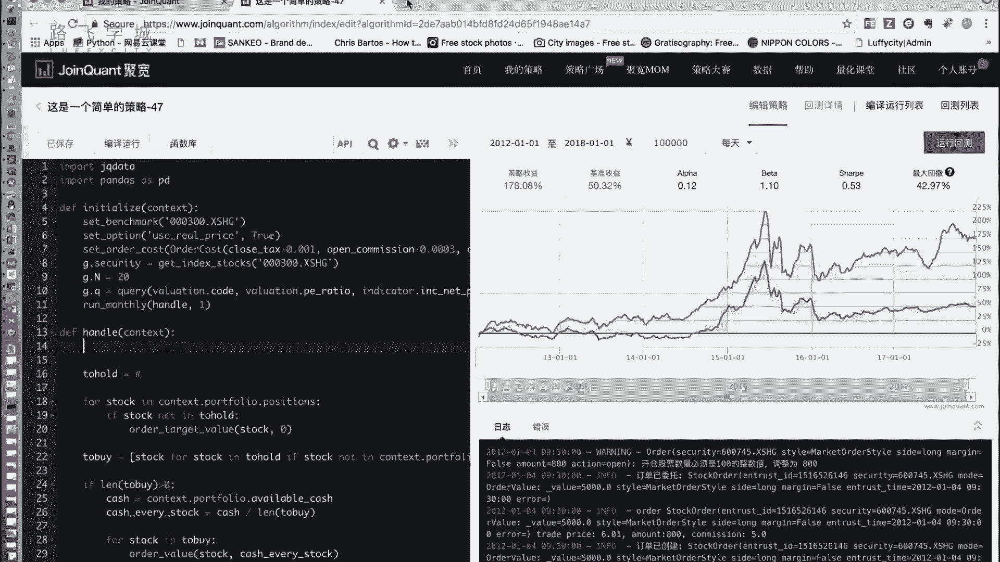
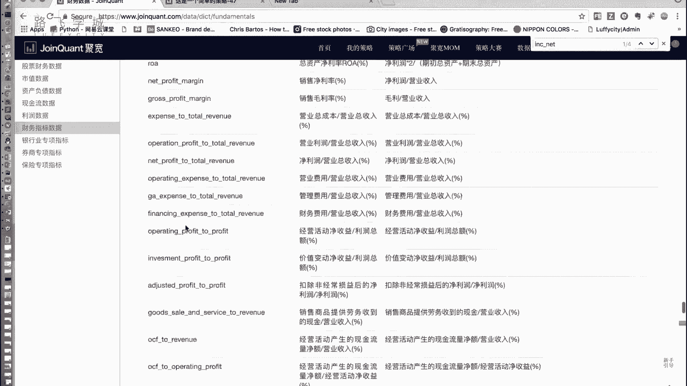
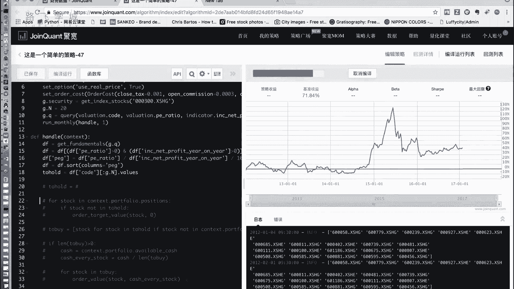
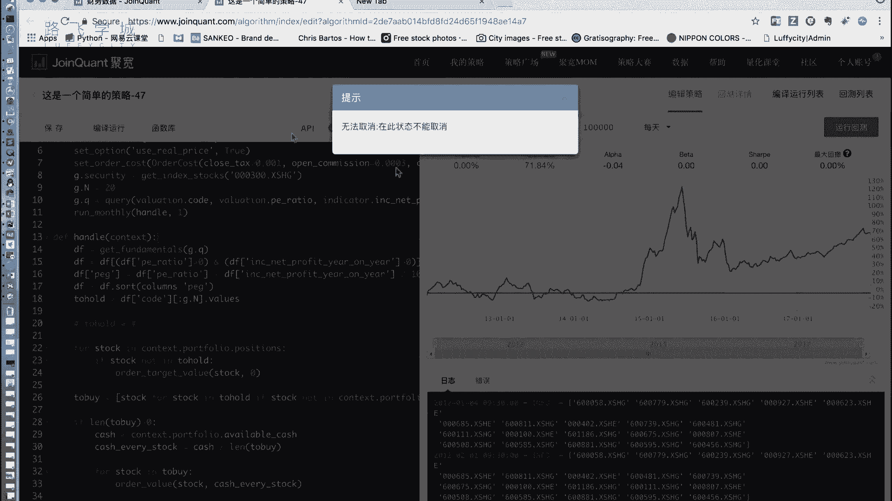
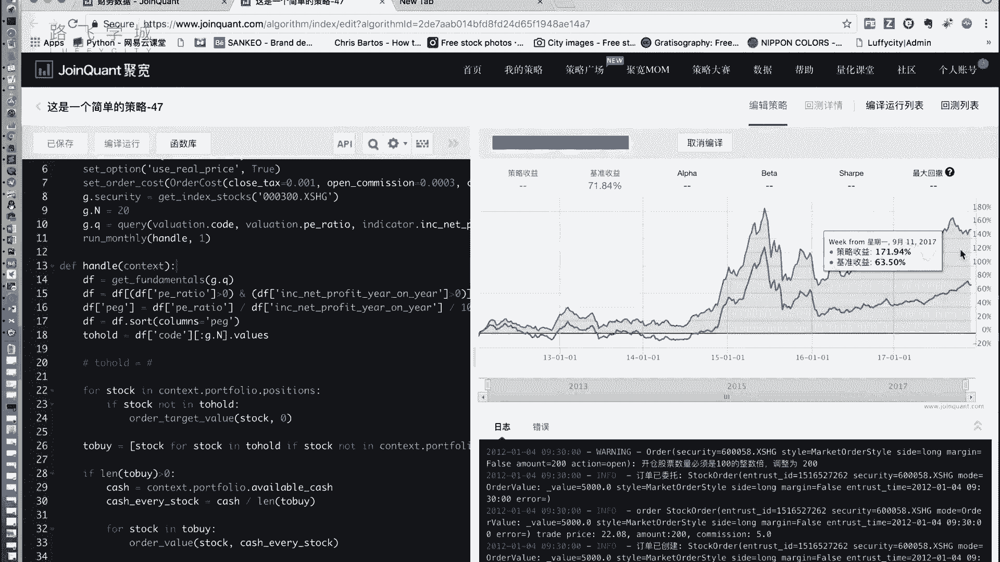
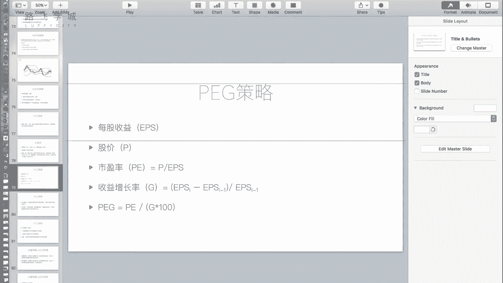

# 清华博士带你学习python金融量化投资分析与股票交易【附项目实战】 - P60：62PEG策略实现 - python大师姐 - BV1BYyDYbEmW

好同志们，咱们这个你说吧，写一下这个写什么来着，P1这策略啊，P1这策略代码啊，哎跟之前框架还是一样。

我又懒得改了啊，选股策略后边的东西都是一样的，我们的目的还是出来这个凸后的嗯，然后后边的部分基本上都是一样的嗯，好这个拖后的怎么算呢，因为这个P类涉及到什么，涉及到就是要算每个股票的P类的指标嘛。

这个PZ涉及到我的这个市盈率，市盈率及到我的这个收益率，这个加加加加每股收益率加加叫什么来着。

收益增长率，收益增长率对收益也是收益增长率。

应该没记错的话，对收益增长率，那这两个指标都是财务报表啊。

都去财报上找，那我们在这个数据里找到他的财务数据啊，啊市盈率叫不叫L市盈率叫啥来着，叫叫叫叫PE对啊，适应率P发现有两个，就这是这是它是有两个，一个是静态的，一个是动态的嗯那我们就用这个静态的就可以。

其实就是p e ratio这个东西在I哪个表里呢，在valuation表里啊，valuation表里的PE然后那个J在哪，那个不是那个不是J那个收益增长率啊，这叫J。

但是我们这个表里应该是我印象中叫什么，I n c，我看一下net increase，哎，对你怎么知道的吗，嗯NEINC，net profit e r e啊，就是这个东西啊，就是这个东西。

叫净他这个里边叫净利润同比增长率，其实你看他这个公式，就是当期的利润减去去年的利润，括起来除以去年的利润，就是跟我们那个G的定义是一样的啊。

所以这个G就是这个指标i NC net profit e r e，它在那个表里呢。

所以我们啊仍旧需要这个get fd window，这个函数来做，那这个函数他需要的query对象，我们可以这样写，这点security使我们的股票池没有变，在这个query对象里。

我们需要的是code代码，这个pe ratio是我们的市盈率，还有这个i NC net profit e r e这三列啊，注意这个是就是valuation表里的，好那选出这三列filter。

就是选出来这些股票的这个这三列，然后在我们的handle里，我们把它怎么样get放the mental，传一个什么呢，传1J点Q进去啊，这一点Q进去好。

这个东西拿到的data frame就是我们的这三列，我们可以把后边注释一下，好打印，好这个拿到的就是一个有三列的data frame啊，这三列分别是股票代码PE和G嗯，那接下来啊就要算pg了啊。

没看到这是PE，这是J好，接下来啊sin p t算in p e t，之前我们说要过滤掉这个PE是负的，和J是负的的情况对吧，所以我们怎么着，我们DF等于DF过滤，怎么过滤用我们的这个布尔型。

所以嗯啊过滤DFDF中括号这个，p e ratio大于零，并且啊用这个and这个and符号，并且好括起来，因为这个优先级的问题加括号啊，P1real大于零，然后这个东西叫做INC，我复制吧。

这个东西也要大于零啊，这个东西是这句话，就把什么呢，就把所有就是两个东西是负的的情况，就给过滤掉了，那留下来的就是这个两个都是正的的，这个data frame，然后接下来算我们的PG啊，PZ等于什么呢。

等于PE，除以J，然后再除以100相当，现在可以除个100，好除不出现都行啊，然后接下来按照peg进行排序，然后选出来pg最小的N个股票就可以了啊，DF等于DF点SD的，column等于PJ。

然后DF等于DF，打印一下DF，我看看是不是排好序了啊，是column还是column4啊，应该是column，又报错了哎，Columm4，果然是COLUMM4，嗯日日出来了。

我们可以看到现在都是按照P1这排好序的啊，最小的一堆零，后边一个八，然后零少一点了啊，那排好序列之后，我们把data frame的这个DF的前N个啊，这这点N表示是我选多少股值，三选20只把这些切出来。

存到我们的to hold里，然要它的什么呢，要它的哎，data frame哈，data frame得我得这样写，因为我们这是个data frame，所以选code啊，选扣的这一列，然后前N个出来。

然后点values把它变成一个数组啊，这是啊，这这这是变成一个列表了，可以打印一下to hold，看一下，应该就是每天会有20个，就是一个长度为20的列表出来，嗯啊注意这个写法啊。

就是这个再补一下基础啊，data frame先取列再续行，不然的话你要先这样写，先写它再写code会出错啊，可以看到有结果了，或者你用那个啊点log，点i log都行好，接下来凸后的算完之后。

我们把后边的放出来就可以了，就跟后边一样了。

先卖后买套路都一样，好运行一下看看。

唉我们是不是可以拿着这些东西去直接买，比特币也可以呃，一般来说这个也是有有，就是这个做专门做虚拟货币的也有啊，也就是也有各种这样的竞争比赛，但是一般来说就是因为他们的原理不一样，所以策略也不一样。

白云一掌宽了好几倍啊，对有有这样的东西，而且这就是就是虚拟货币来说，更多的好像是做高频电也好，哎对就是做高频多一点，就是他在那期，因为还没有那个没有那个他是T加零的吗，对对对，频繁交易对，做高频的。

然后就是之前就是有专门的比赛是什么，他的市场和市场之间有差价，他有可能一个嗯商品在不同的市场里有哦，对对对，市场上有差价，他利用这种差价来赚也有，那为什么咱们不搞这个事情，还讲什么课呀，是完了。

这些有任何东西都是有风险的。

我们股票也是有风险的，我看现在回去都不错，但是不一定就会有的时候回测就差了，而且不一定你这个回测的情况就能适用到，后来好可以看到这个结果出来了啊，153%比大盘要好，有贼心没贼胆啊，反正也是也是好一点。

就这是12年跑到了现在18年嗯，最新的啊，这是我们的这个pit tory，现在我们写写到现在大概可以看到长线来说，反正我我是感觉啊长线比短线要稳，而且长线要比短线收益要好，短线假如什么双均线什么。

所以就买了，别动放，那对就是感觉中国这种就这种大环境不要长，不要过频繁的调仓，对其实短线我们可以试一下，把它改成什么，比如说但是不太好，比如说七天，你可以设置七天之内不要交易两次，一周之内交易一次。

这样啊控制下交易频率，因为你有可能短线交易就交易乱了，对对长线就是选一些潜力股，就按一些指标啊，好我们说回来，这是我们的pg策略啊，PED其实也是可以看到，也是一个这个呃也是一个因子啊。

也是一个导出的因子，跟我们之前讲的那个那个均值回归差不多啊，嗯你也可以拿它来，比如说拿PZ跟其他的一些因子再做结合，然后再做一个多因子模型出来啊，看一下效果怎么样，也挺好好好，这是我们的这个P的特点。

它没有啥可说的了，那这个东西我们就讲到这。

