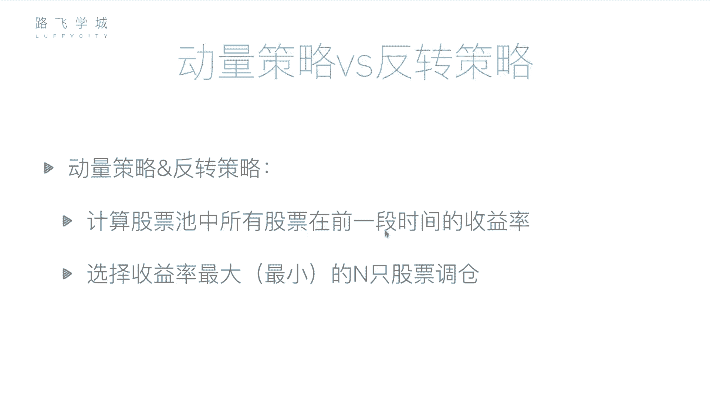
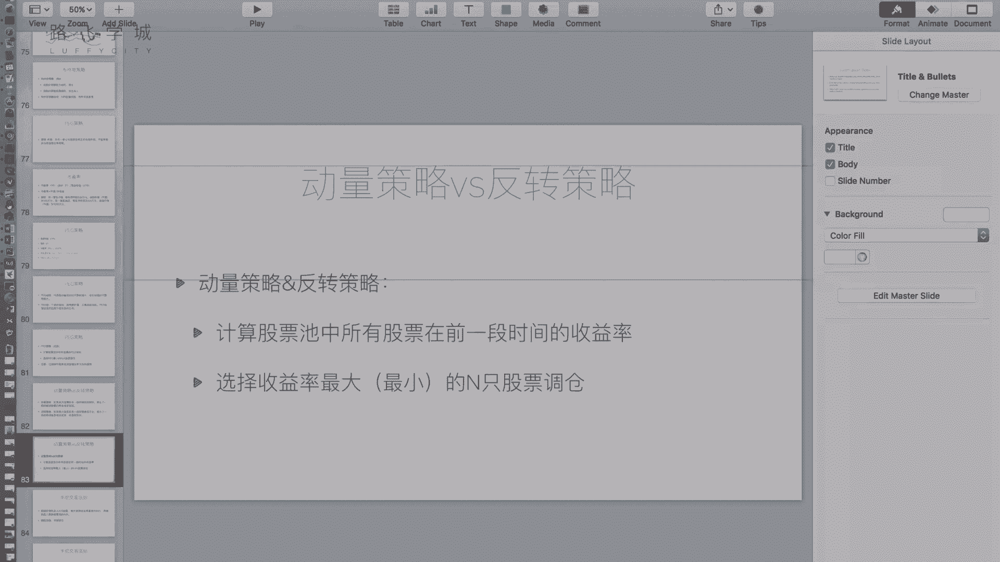
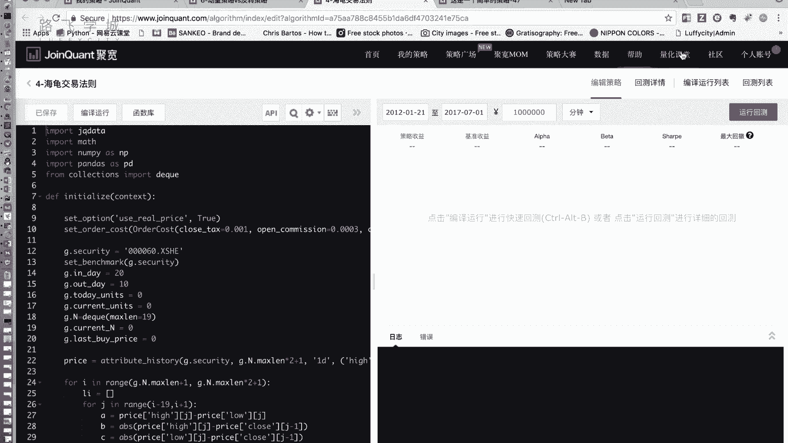
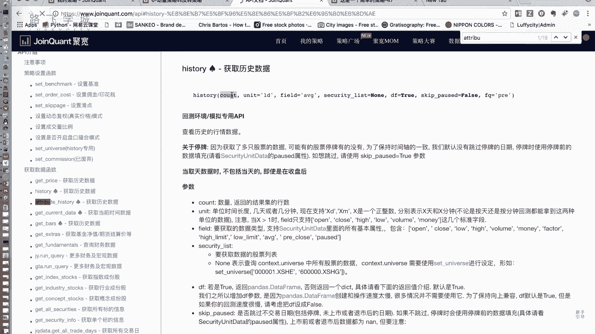
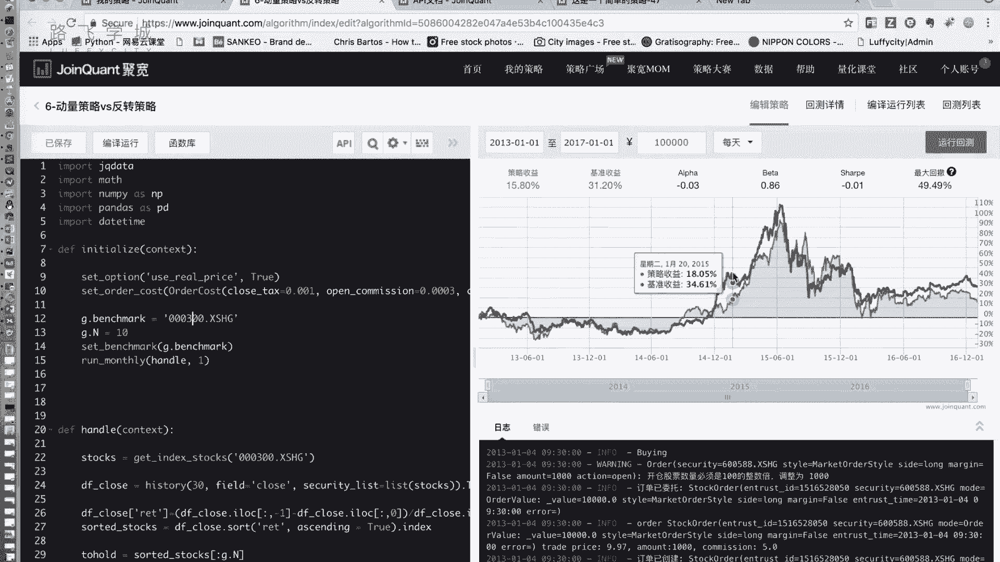
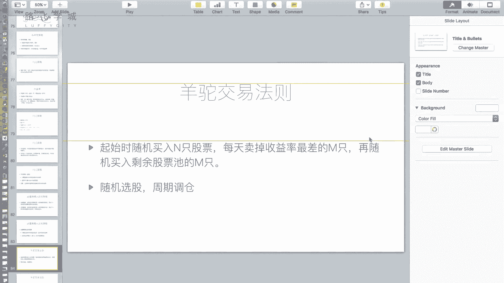

# 清华博士带你学习python金融量化投资分析与股票交易【附项目实战】 - P61：63动量策略vs反转策略 - python大师姐 - BV1BYyDYbEmW

好好同学们，那我们接下来又是一个策略啊，就快完了，还有俩啊，这个其实不能算策略，它是你可以说是俩策略，也可以说其实这不是策略，这是两个特性，就是两个在市场里有个特性，叫做动量策略跟反转策略，啥意思呢。

这两个其实恰好相反，动量策略就是动量嘛，就是如果这只股票前一段时间特别好，蹭蹭的一直涨，嗯我认为它接下来还会一直接着涨啊，好OK就这么简单，你看如果某段时某只股票话，前一段时间表现较好。

那么下一下一个时期该股票仍有良好表现，这是动量策略价值，反正他来跟他是反的反转，特别是是物极必反，就是你如果某只股票前一段时间表现不好，那他下一段时间将会反转，表现变好，这两个是反着的嗯。

那其实啊你不要惊讶啊，看我后边那页PPP题，不要惊讶啊，动量策略后边两次的就来了，如果我用动量策略，那我就先算什么呢，股票池里所有股票前一段时间的收益率嗯，如果我想用动量策略。

那我就选收益率最大的N值持仓对，这是动量特征，因为茅台一直涨念，按你说的对啊，反转策略是啥呢，反转策略就反过来，我选收益率最小的N是股票指方嗯。

这就是俩策略，但是你说这俩策略，你看我讲完这我觉得你都可能笑话我，这什么玩意儿，这个东西就是这个东西啊，不一定是说他就是个策略，就这么用，就是它是两个思想，就是正常情况下在一个市场里。

大家都会去探探究一下，因为是基础嘛，探究一下这个市场里是动量大于反转，还是反转大于动量，嗯嗯啊那也可能影响一些其他策略的，就是改进啊，优化啊这种东西啊，比如说我们下回接下来讲另一个啊。

我们就是所以在这要铺垫一下这个动量和反转，那接下来就是实现这两个的啊，就是怎么样，就是来看一下到底是动量和反转哪个更大啊，去看的情况，你也可以通过统计的方法，当然你也可以说把两个菜单都实现一下。

看一下回撤哪个更好都行啊，我们选这个后一个我们把两个策略实现一下。

这个我就不带着大家写了，因为比较简单好，给大家看一下我们的这个东西吧，哎INALIZE啊，benchmark在这这个是参照啊，然后这点N是我持多少只股票，因为他还是一个选股嘛，每个月执行一次。

然后这里边啊啊stocks是我的这个股票池，就是这些股票，然后选出来这个股票，今天的我看看这是J是沃特啊，这是这一段时间的收盘价，这个history函数我之前应该没给大家讲过。

大家可以看一下我们的这个呃API文档。

我们之前用到的是attribute history啊，那attribute history是选取一只股票啊，多个时间的这个历史数据，history之前没有怎么用过，那他是选什么呢，它是选这个。

你看他没有，他是选多只股票的，一个这个什么一个这个这个这个这个数据啊，count是时间，然后field一般选一个，就是我可以看我field填成close，然后security list这里传的是什么。

这里传的是这个股票列表，那如果我这传一个列表，这选clothes，这选一个，比如说30，那他选出来的就是这些股票，这30天的一个这个啊。

这30天的一个所有的主板价给大家看一下，可以啊，我把这把这个后边都注释一下，好你可以看到我这写的是30field，是clothes，然后这个是list stock，就是这个其实就是这个我的这个股票池。

好打印一下，打印的数据呢，在这儿呢，然后我对他做了一下转制啊，点T是转制，转制之前这个列上这个就是行上，行上是时间，然后列上是各个股票，那因为我要想让他看各个股票，所以我把它转制了一下。

就是现在是这个这个方向上，这个列上是日期，行上是股票代码啊，它就是这个就表示的是这一天这一这个代码，唯一的这支股票的收盘价是啥，嗯啊为什么要算这个呢，因为我要算收益率嘛，所以我好多只股票一块看收益率。

当然你也可以写for循环，但是我们这就是一次性来了啊，这个df close是一个股票，关于股票代码和时间的一个二维列表好，那根据它算我们的收益率怎么算收益率呢，我每一只股票的return。

我加一个RET这一列表示收益率，那这一列怎么算，这一列是他的，看啊倒数第一行减去啊，倒数第一列减去第零列，再括起来除以第零列是啥意思呢，看啊这一支股票的收益率是什么，是最后一天。

这个后边你看这个是应该是有30天啊，这是30对，设的是30嘛，应该是有30天，那他是最后一天，最后一天是不是就是昨天的价格嗯，昨天的价格减去30天之前的价格，再括起来除以30天的价格。

这是不是就是这30天它涨它的一个，这个收益率，对对不对，那我这其实加的这一列啊，这个是加的这一列，就是表示的是每一只股票，这三之间的一个收益率啊，我这一行就写出来了，因为它可以做批量运算。

这些东西其实都是一个都是一个一列啊，这是一列，这也是一列，这是series减一个series，然后再除以一个series，括起来，直接就是这一行就是一行代码，直接把这一列return都给算出来了。

然后接下来什么呢，接下来按照return进行排序，嗯啊按照return进行排序，我们说这个动量策略跟反转策略是不一样的嘛，我们这儿先实现一个什么呢，看我把这个x ending设置成false。

就说明什么，说明现在是降序，降序的话，我切前N个是不是选的收益率最大的那只股票，对不对，我切前N个降序的话，切前N个选的是收益最大的N只股票，那这个策略算出来的是动量策略的，还是反转策略的。

你问我动弹他呀，我没听动量策略，是不是有持持有当前的这个最好的N只股票，表现最好的那只股票，对不对好，那我们把它放出来啊，运行一下，后边的都是这个选股的，没有没有关系，这个突后的是我们算的怎么选股。

就是我们选出来收益率，前一个月前30天收益率最好的N只股票嗯，运行一下，然后大家可以再看一下反转策略，反转策略怎么改呢，其实就把这个acx tending从false改成true就可以嗯。

啊把它改成true就可以把它改成true，就是升序了，升序的话选前N个其实就是选最差的那N个好，这是动量策略的结果，大家可以记一下啊，最后结果是负的24%啊，反正整体大概都在大盘之下好。

如果改成true的话，大家可以看一下结果啊，就是这个东西你看这个测的曲线，其实并没有说它肯定不是一个长途的数，你不能说单单拿它去跑数据，这肯定赔死，但是他可以研究什么呢。

研究你这个市场到底是动量大于反转，还是反数大于动量，你就只要看这两种测量哪种更好就好，啊当然这个东西也不是绝对的啊，就是呃就是有可能帮助一下，哎你看反转策略至少挣了一点钱啊对吧。

我不是赔的哎呦这反转策略还挺好对吧，反转特勒比刚才动转特勒要好一点，所以其实我之前见过各种金融博客上，也有各种学校说什么惊人的反转策略，什么这个15年挣了百分之多，什么多少多少多少翻了多少倍。

但我觉得其实有点骗人的感觉，就是这个策略太简单了，它不应该成为一个成熟，就是你不应该只拿它来做，他可能挣钱，但是这个挣钱我觉得只可能是一种，可能是一种特例嗯对吧，尤其是他可能做一种即某只特定的股票啊。

这个是这个沪深300的这个市场，当然你可能换个别的牌子，它就不一定是动态发育反转了啊，现在我们看起来，你看这个反转策略，比刚才的动态特征表现要好对吧，至少他是转的，刚才那是白的对吧啊好。

所以我们大概得出一个结论啊，大概在这种在我们当前的A股市场上啊，虽然选的是沪深300，你也可以测试一下A股啊，A股市场上大概是反转大于动量，嗯好这是我们讲的这个动量策略和反转策略。

那接下来我们讲的这个另一个啊，给大家剧透一下，叫做羊驼交易法则，里有一个就是我们改进之后的羊驼交易法则啊，有用到这个反转策略的。

