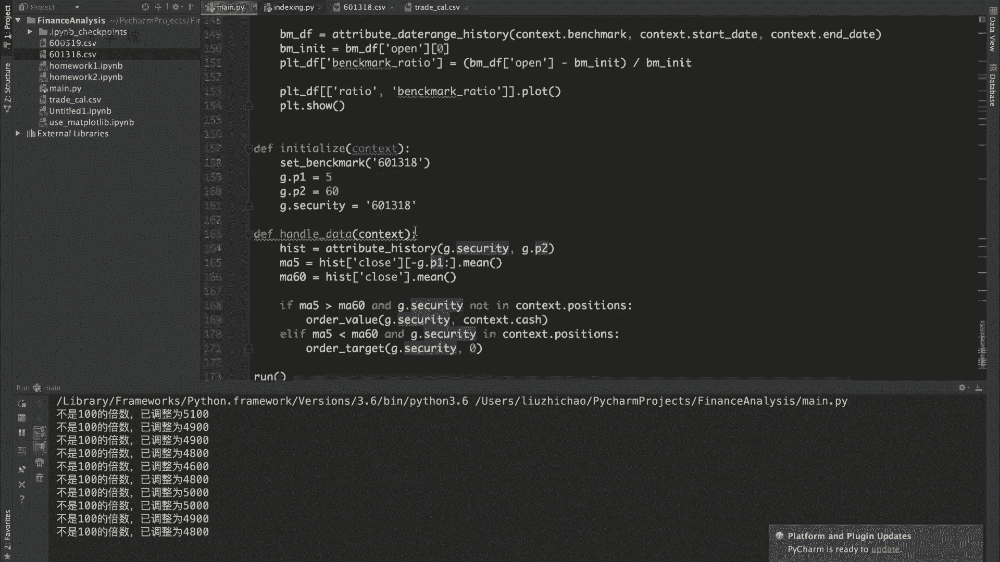
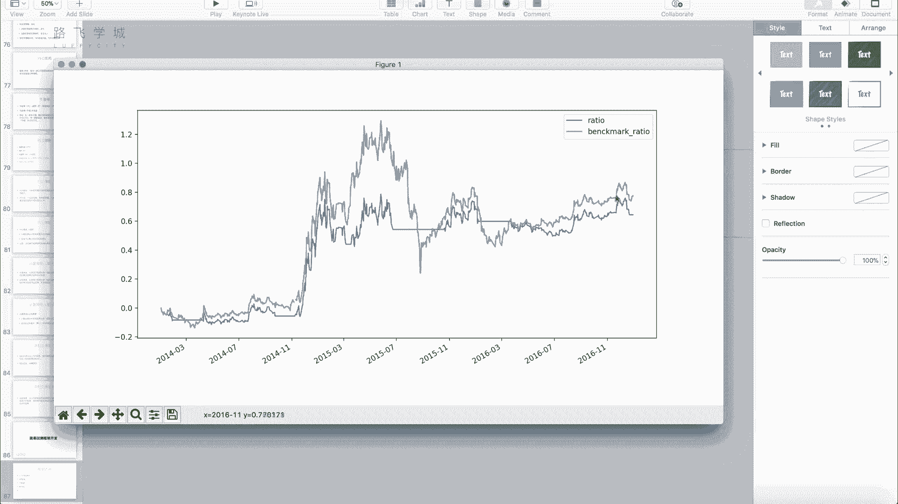
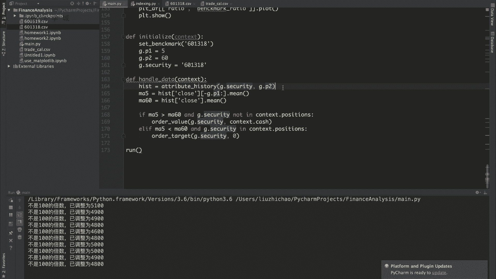
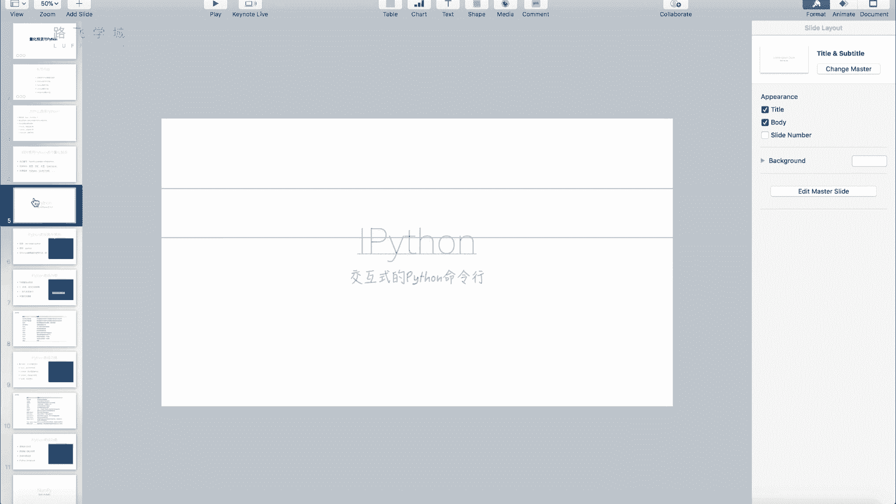
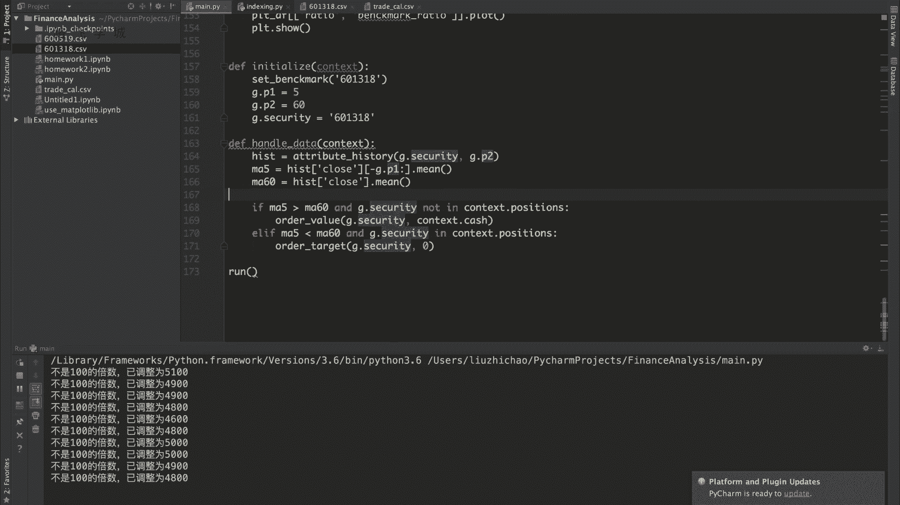

# 清华博士带你学习python金融量化投资分析与股票交易【附项目实战】 - P69：71回测框架展示 - python大师姐 - BV1BYyDYbEmW

OK好同学们，那接下来我们实现一下这两个用户的函数啊，首先这个set benchmark在这写嗯，我们就设定什么呢，只有他自己了，因为不只是指数嘛，然后像我们一样，我们在这里写一个P1等于5日均线。

P2等于啊，60表示这是一个5日均线，一个60日均线，然后要操作的股票就是6011318，好，在handle data里，我们干啥呢，我们首先这个获取一下历史数据嗯，Attribute tory。

其实和我们在那个框架平台上写的，基本上差不多，获取这一点security的长度是这点P2就是60，因为五天和60天的我们获取60天的就可以，60天的可以直接算60天的均线。

也可以切出来后五天算五天的均线啊，所以ma5等于hist，切出来后五行的啊，close这一列的后五行，然后求平均来获取，这是今天的ma5均线上的值，60的值就是hist close。

因为直接已经是60个了，所以这不用切了，直接点min就是60M60的值啊，如果什么呢，ma5大于ma60，这我们之前说过了，如果MA5大于MA60，并且G点security不在context。

就是不在我现在持仓里，我现在不持仓它，那这个时候是什么呢，金叉啊，嗯那我就买入买入的方法，我就能买多少买多少，order value啊，这点security，第二个参数就是买价买价格嘛。

买就是要买的钱数嘛，所以context点catch全部传进来，就是有多少买多少，它可能会调整，那如果ma5小于ma60，并且持仓，那就怎么样全部卖出，对卖到零嗯，好我的这个用户代码写完了。

哎我们来运行一下试试啊，报错了啊，这个没有引号，而且这不应该写五，我才发现这应该写，因为这会变吗，只写J点P1呀对吧，那引号错了啊，输出的一些日志，哎其实这个日志上大家可以加一些，比如说这些日志上。

大家可以前面加上那个时间啊，用这个DT加上时间把那个DT打印出来就可以，context点DT打印出来有点慢。

好诶，我们看到这个图打印出来了啊，这个图例上面写有两个，这个蓝的是我们的收益率，黄的是参，就是那个参照的收益率啊，应该看一下这个图什么鬼，好我们看一下这个图其实还是比较合理的啊。

这个蓝黄线还是一直在波动，可以看蓝线，可以看到蓝线有好多是就是停一会儿停一会儿，停一会儿停一会儿，就是收益率不变的这种情况，那这种情况对应的什么呢，因为我们说双均线你死叉之后是不是全卖出了。

卖出了之后你手里的钱就不动了，如果你一直没有遇到金叉，那你这个死叉之后到金叉之前，这个过程中是不是收益率就是不变啊，你就一直你一直是这些钱，所以说我们这个图画的还是可以的啊，那右纵轴这是这个收益率啊。

可以看到最后好像赚了，赚了60%这么多吗，啊但是跟这个呃跟跟这个奔驰Mark来比，就是跟他的参照来比，差不多，也跟咱们那个呃平台上验证过的，就是他大概会跟参照呃走势差不多。

这个也也也也比较也比较相似啊，好这是我们说的这个啊双均线策略，那我们的这个简单的把量化策略实现，就大概到这儿，那可能就不是可能就是有一些不足啊，比如说我们什么都没做，我们的这个T加一啊。

很明显这是很明显的一个漏洞有错，那第二一个比如说什么呢，我们买这个不是呃，这个买卖股票时候需要的手续费和佣金啊，需要的佣金和印花税，就是手续费没有扣对啊，这个也没有写，这个大家也可以加。

然后比如说还有什么啊，其他的，比如说我的这个选股策略，我需要一些财务数据的时候，财务数据也没有啊，包括其他各种各样的啊，我们这个显示只能只能是第一版诶，1。0都算不上0。1吧。

嗯然后大家这个如果说想要开发，真是说可能就是就是真是说大家想炒股的话，建议啊还是用现在现成的平台，哪怕是就是一些免费的也好，收费的也好，有现成的平台，有一些这个开源的框架啊。

用这些炒股肯定是要比自己开发要好得多，如果说你想我是我的目标，是想去这个金融公司做一些这个呃是技术性的，it方面的工作的话，嗯大家可以试着就是可以试着写一写，那包括可以写的比我这个好，可以完善一下。

但其实也可以参照一些现在已经有的这个框架，对对现有的框架，我在这个PPT的开始部分，已经给大家列出来了啊，有就是常用的框架哎。

是另一个PPT，那也就比如说有这个框taxi，还有这个rq alpha啊，这两个开源框架都还可以啊，那不管怎么说啊，我们的这个金融量化课程。

就要在这跟大家说再见了啊，我们就结束了，那算是我希望什么呢，能够把大家说是算是带上了，就是金融量化这个路啊，不管说你是将来干这个也好，不干那也好，反正技多不压身嘛，学好了这个东西。

你不真的不知道什么时候会用得上，希望对吧对吧，不管说大家是想找金融方面的工作，还是说我想哎作为一个散户，我觉得我计算机不错，我可以炒股啊，那都可以啊，那最后还是一句话啊，市场有风险，投资投资基金是二。

任何策略再再次反复强调一遍，任何策略都没有说百分之百稳赚不赔的，他只可能是说哎，我这个策略在在这个策略下肯定是赚的呃，可能性比不比赔的多，但你要是就是点背就是赔了，那也没有办法啊。

这个东西市场这个股市股票市场，金融市场这方面谁都说不清楚，些专家也有打脸的时候，好，那我们的这个金融量化课程就给大家介绍到这。

