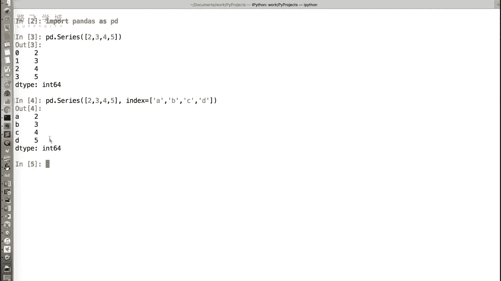
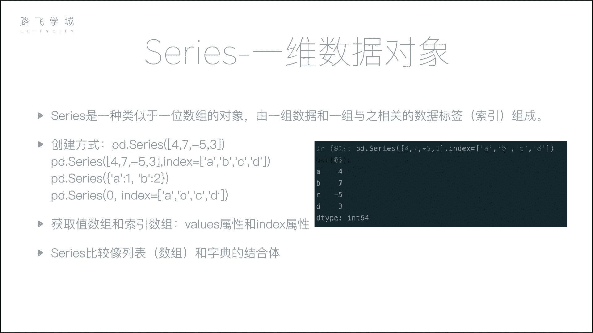
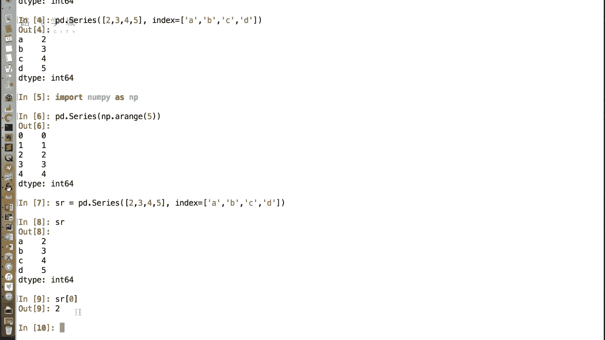
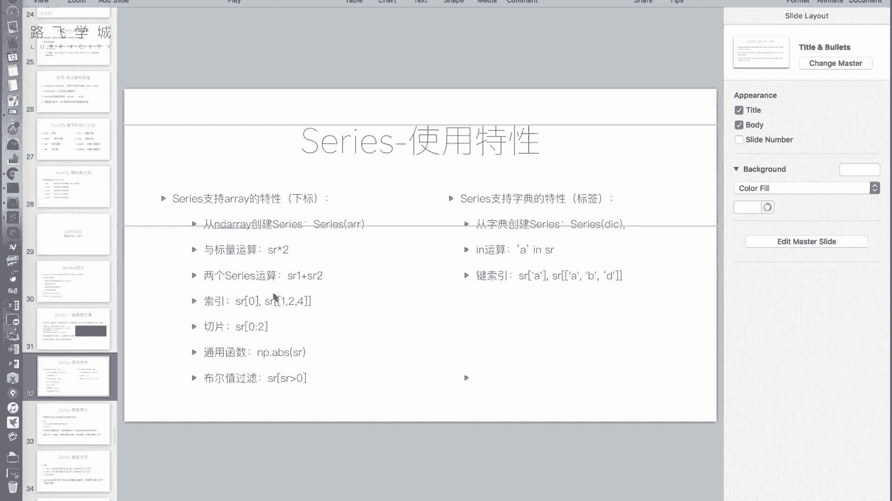
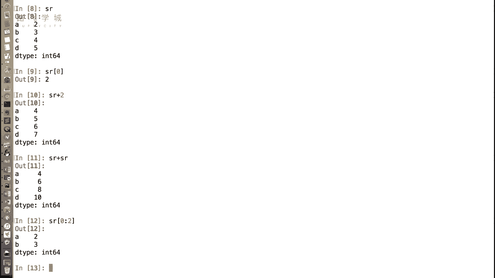
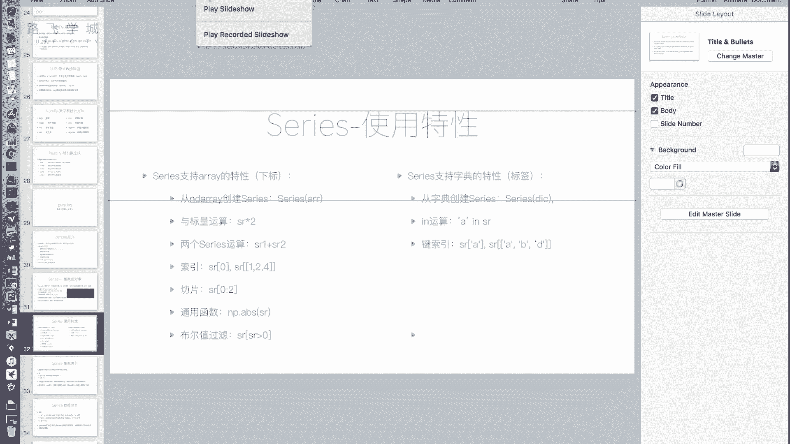
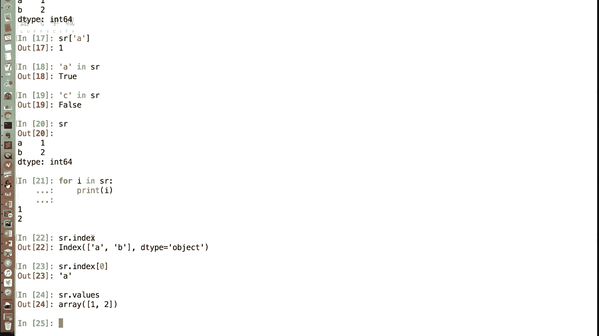
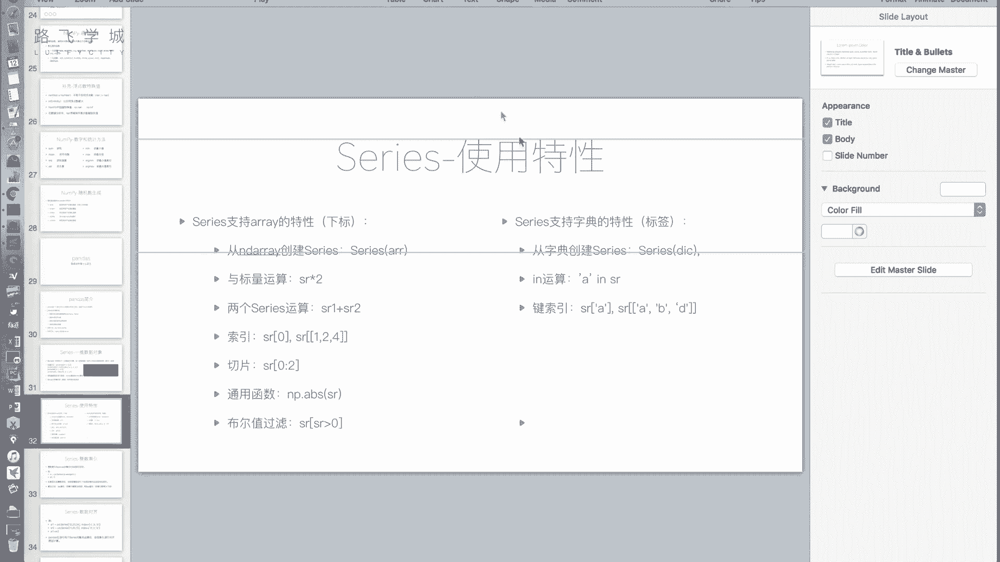
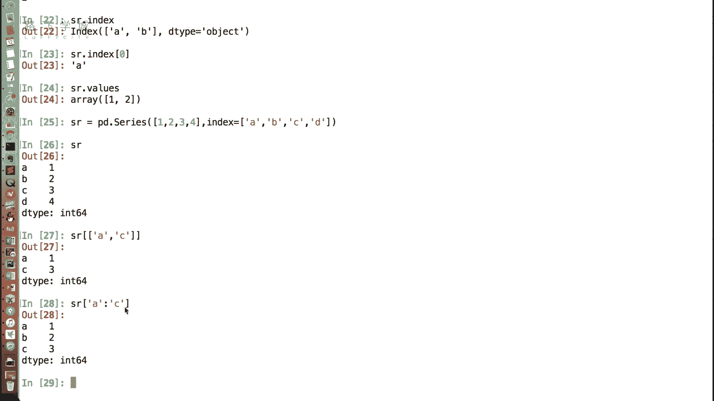

# 清华大学博士讲解Python金融量化分析 (完整版） - P19：17 series介绍 - 路飞学城Alex小助理 - BV1LzSLYKEUH

好同志们，大家好，那个咱们继续讲课，这一章节啊，之前一章节给大家讲什么判断啊，之前我们给大家介绍了，这个数据分析的一个基础包，叫做number py啊，想必大家已经见识过他的这个很多，很有意思的地方耶。

也很强大的地方好，那接下来我们给大家讲的是pandas这个包，pandas这个包也是在数据分析领域用的嗯，它相对于number py封装的更高层，它更加核心，也就是说不管你做什么数据分析，不管是金融。

数据分析或者是任何领域的数据分析，只要你用Python写这个包是你逃不开的，肯定只要用上了会发现非常好用，OK好，那pandas是，首先它是基于我们之前讲的number平台构建的。

所以我们会看到它们之间，有好多特性都是一样的，比如说支持啊我们的布尔型索引，我们的花式索引等等等等啊，那pandas的主要功能包括提供了两个数据结构，data frame和series。

这个我们都会在后面详细的介绍，集成了时间序列功能，提供了丰富的数学运算和操作，以及灵活处理缺失数据等等等等，嗯那它的安装方法也很简单，我们只需要使用pip进行安装。

就可以引用方法和我们的number py一样，官方建议的引用方法是import pandas as pd，那么我们接下来就按照这个应用方法来进行，我们的pandas的使用可好。

那首先我们先来介绍pandas as里面，第一种核心的数据对象叫做serious serious，对那series是一种serious，serious或者serious都行，OK对序列对它是一种啊。

叫做类似于一维数组的对象，所以它非常像什么，它非常像一个数组跟字典的结合体，嗯哼啊。

OK好，我先给大家演示一下好，首先我们导入pandas包，创建serious需要pd点serious，好参数，如果我们默认传一个列表进去，比如说一个整数列表好，我们看它返回的右面是2345。

左边是0123，大家可能觉得对，是他的下标索引，OK好，那这个感觉就和我们的列表或者数组很相像，对不对，但是其实我还可以传令传递另一个参数，叫做index index，我可以给它设置成，比如说ABCD。

那这个时候我们再看啊，它左边的索引一列就变成了ABCD，就像字典的key value的对吧，看吧我们第一种的写法像一个列表一样，第二种写法像一个字典一样。

哎所以我说series更像是一个字典和列表的集合。

结合体，OK好，那它具体怎么是一个结合体呢。

我们来看啊，它支持哪些列表的属性，支持哪些列表的特性，支持哪些字眼的特性，首先我们说它支持列表或者说数组的特性，就和array一样，首先我们可以通，从列表或者是array创建一个series啊。

我们刚才演示了，给大家演示了从列表创建一个series，那如果你这里是一个，number py库的列表，而number py库的数组也是一样的，我们大家可以看到也可以创建好。

所以第一点他可以从列表创建一个，或者是从列表或者从数组创建一个series对象，第一点，第二点可以通过下标来访问，比如我以这个对象为例，好我们把它复制成一个SR，那SR和列表一样。

虽然我们可以看到SR它的索引，我们给它指定成了ABCD，但是SR中括号零还是可以访问到的，OK其实那个索引也就并没有真正的被覆盖掉，对也就是说什么呢，也就是说series这个数据对象其实有两种。

第一种我们叫做按下标回，第二种是按标签所研究，是有类似于我们字典的key，OK啊虽然我们给它定义了ABCD的索引，但是我们依然可以通过下标访问。

嗯很好，这是他的一个特性。

那么还有它和我们的在number py库里讲到的array，用法非常一样啊，可以和标量进行运算，也就是可以和一个数进行运算，可以两个相同大小的series之间进行运算。

加减乘除大于小于都可以相同大小相同大小，因为我们的列表做加减乘除，也是要求相同大小的，所谓相同大小，只不过是说要求一个数组对象和一个数组对象，他们两个对应的位置相加或者相减，如果不相同，它。

所以你其实刚才把SR和两个SR，是对自己自己加自己啊，你如果是S1加S2，只要他们两个长度一样，也可以加减，长度不一样就长度不一样是不可以的啊，啊，因为它是把两个每个对应的位置都做一遍加法。

或者都做一遍加法之类的，好好那除此之外啊，我们讲到的和这个和标量，包括两个相同的serious对象之间进行操作，讲到了它的索引，那么它还可以有切片啊，和我们的列表一样，对不对，比如说执行0~2。

就把前两行切了出来，这是和我们列表一样的部分啊，那当然hello啊，不好意思诶。

怎么录了呢，没要不停一下吗，就不用吧，我以为没问题就行，没有的好，那么除此之外，还有比如说它支持我们number py的通用函数，之前讲过通用函数取绝对值，取最大值，最小值等等等等啊。

那么比如说这是它的布尔型索引啊，通过SR啊，我们演示一下，执行SRSR大于四，那么他会把五这一行选出来，和我们的列表用法完全是一样的，OK好，所以我们可以看到这些点是继承自列表，或者说数组的。

那他继承自字典的特性嗯有哪些呢，第一个我们可以通过字典来创建一个serious，字典，创建series好，我们来试一下，SR等于PD点series，好我传入一个字典。

比如说所以那个K就可以当做是下标了标签了，他的key就被当做它的标签了，对，所以哎也是通过一个字典，可以创建一个就是对象，那么除此之外还有哪些，比如说啊通过字典的标签获取，我们刚才说可以通过下标获取。

那么也可以通过标签获取，这也是一个还有一个in操作啊，字典里也比较常见的in操作是干什么的呢，判断一个键是不是在这个字典里对，那同理，A写a in sr，那就返回true啊，如果我来一个没有的。

比如说C啊，就返回false，OK好注意一点，它和字典有一点在用in的时候不一样的地方好，我们说写for循环的时候，如果我用一个字典传入for循环，那么for循环输出的是不是键对。

但是这一点我们的series和它不一样啊，我们看现在SR是一个这个啊，像字典一样的series，那如果我for i in sr，打印一下I你会发现打印的，打印的是它的值，而不是它的键用键啊，这就是他呃。

为这个这一些数据分析师们，相当于做了一些调整，就是说我们对一个series进行便利的时候，我们往往更关注它的值，而不是关注它的索引好，那我说，那么我们说如何分别来获取它的值，和它的索引啊。

我们可以通过两个属性索引，就是SR点index属性就可以获取，可以看到他输出了一个index的类的对象啊，里边有A和B，那么其实这个index的对象表现和我们的array对象，就是数组对象完全一样。

嗯啊index你也可以中括号零等等等等啊，都可以，那么获取它的值就是values属性啊，这是两个重要的属性，分别获取它的索引和它的值。

嗯好，以上就是我们说的这个series。

支持的列表的属性和支持字典的属性，OK那在开始下一节之前，我只想问就是他们把它俩合并起来，相当于你是把列表和字典给它合并，成了一个新的数据类型，这是那是为了后面更好用吗，我们没有看出来多好用啊。

因为因为我们想在实际的一些，比如说实际的一些例子中，我们正常啊，用到我们经常会出现的一堆数据是什么，比如表格数据嗯，他表示数据一般都有一列列名对，那么就像我们的可能数据库。

一张表或者excel一张表一样，那如果这个数据只有一列，那他的列名是不是就可以当做它的标签，对他的这个值就是它的值，OK那么这样我们既可以通过列表来访问，也可以通过行号来访，既可以通过行名称来访问。

也可以通过行号来访啊，这样的话确实还是有点用，其实就相当于把excel，比如说你点个行，就转换成你这个一个series的数据了，对比如说我们想象一下，有一个有一类这个有一支股票的，就是历史的行情信息。

比如我记录了从20101年到2017年，所有的收盘价，那么我们既可以通过标签，就是每一天嗯来进行访问，到说这是这个呃，这是哪一天的这个价格也可以通过标签，比如说我想知道前五天。

五天之前是可以通过索价格对我，那我就通过索引来访问，我靠你这么一说，我发现我之前即便我不做金融，我的很多工作入坑也可以用类似这样的东西，对啊对good，那好啊停，还有一点我补充一下。

刚才我们说到了这个他的作为这个啊，作为字典的属性，我漏了，说一点好，比如说我SR重新创建一个，serious对象，那么我们传啊，好我们传它进去，那么我们的标签按标签也是可以做，比如说花式作业的。

所以花式索引就是我传一个A和一个C进去哦，花式分音也对，那就是把A和C对应的两个标签对，这个在字典是不行的，对对对，这只能是拿一个K去对，那还有我还可以通过标签进行切片。

嗯嗯啊这个当然要把去掉一层中括号，其实这个标签就相当于给这个索引起了个别名，就是另外一种就是写标签形式的索引，OK明白了啊，那注意我们的当你通过标签进行切片的时候，切片是前包后也包的啊。

啊并不是钱包后不包的，因为我们说通过整数，你钱包后不包，你可以通过加1-1这种方式，你获取到它后一个，但是标签不行，我并不知道，我想切A到C意义就肯定是我要切A倒C，我C1掉，OK如果我不要C的话。

我并不想知道C前面有谁明白了，所以这是钱包后也包的好。

OK那这个基本用法就OK了，这就是我们讲的series对象啊，对于数组对于字典的一些特性的传承和发展啊，好的大家你们也可以再想象一下，在你的这个工作中，有哪些地方是可以通过series。

就可以充分利用series的特性的，反正我是想到了一些，就是就是类似你举的那个例子，包括我工作中用到的，比如说设置呃，你比如说一个数据，再加上还要有时间拖的东西，那我要我之前存的话，就是一个大列表里。

然后呢，因为我想让它是有序的，我只能存到列表里，我在一个大列表里，然后再存一个小元组，就是这个原图里面第一个值是时间，除了第二个值是我要的值，但是我要想取的话，想取某一个时间戳的话，我只能去查。

但就你这个我就直接向字典去取就可以了，并且他还是有序的，对吧好。