# 清华大学博士讲解Python金融量化分析 (完整版） - P11：09 金融量化分析-ipython高级功能 - 路飞学城Alex小助理 - BV1LzSLYKEUH

好我们接下来再介绍最后一个魔术命令，就是这个pd b名啊，我们知道我们在自己写代码的时候经常会遇到，比如说啊我这个代码不知道哪一行就报错了呀，那我报错的时候，我遇到报错我们怎么办，我们肯定就是调试。

到处加断点，然后进行调试，yes啊，我又不知道在哪一行具体做错了呀，那这个时候我们就会比较烦躁，好我们IPAD给我们提供了一个什么呢，p dB命令啊，这个PDB命令和其他的不一样，它是一个开关性质的啊。

pd b用法p DP on是把它打开，对这个时候会怎么样呢，当你粘一段代码过来好，假如你这个代码中间有一行报错了，他会在你这一行报错之前，那一行就把代码停在那里，自动进入一个调试模式啊。

然后你可以打印相关的信息可好。

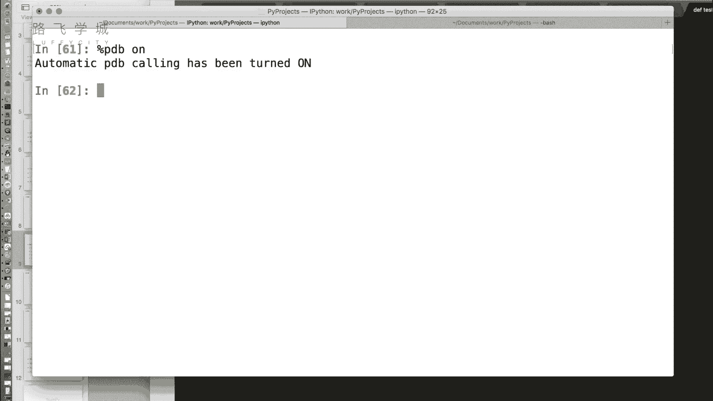

比如说看这是我写了一段测试代码啊，就test函数是计算A除以B啊，可以看到我传了一个三一个零。

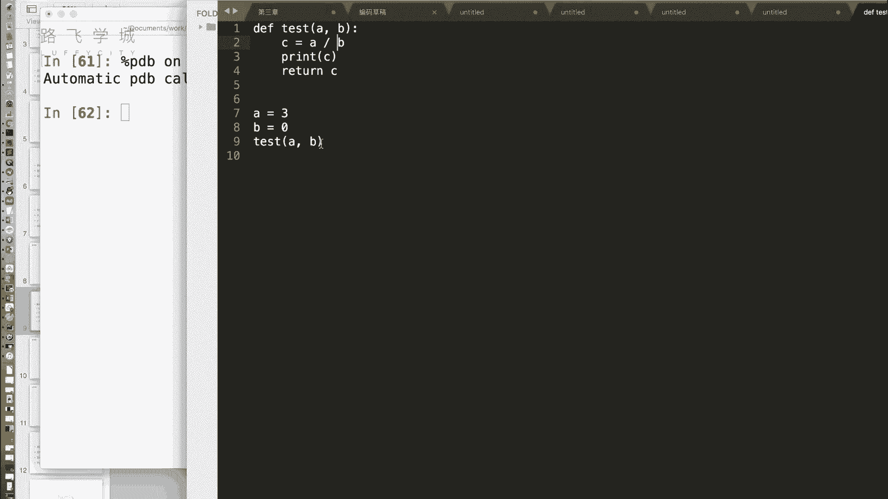

肯定会是报一个除零的错误，对对不对，好，我们把这粘过来啊，用刚才的past命令运行好，首先我们可以看到啊，上面给我们打印了什么报错信息啊，就是除零错误嗯，打印了，然后出错出错在行两层。

第一层是test这个函数保存，然后下一层是什么，test函数里哪一行呢，是C等于A除B这一行的问题哦，OK好，那下边儿诶这儿进入了一个交互式的调试器，我们可以看到现在第八个模式停在这儿了哦。

成绩停在这对，下一行马上就要执行这啊，这个时候我们可以用什么呢，这个p dB的一些命令来查看一些，查看当前这些所有变量的一些状态，常用的不就是查看当前变量吗，嗯我们可以看一下用什么命令呢，P命令啊。

就是print sp a打印A的值发现是三啊，PB打印B的值A发现是零，找错对没错。

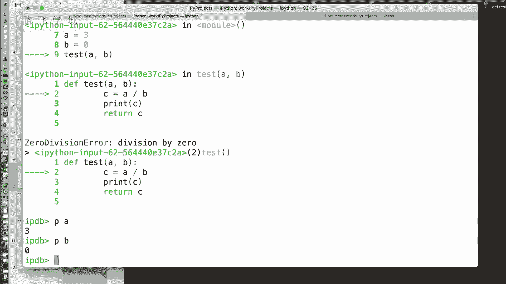

好那一些这个PDB的相关的命令啊，在这里大家可以看一下啊，H命令打印文档啊，Q命令退出啊，break设置断点等等，但是因为什么呢，我们现在这个啊命令啊，他下一行肯定是会出错的啊。

所以你看我们这有个net命令吧，next命就是我们俗称的执行下一行对当前行，当前对支撑当前行，因为现在你看箭头指向第二，说明第二行马上就要执行，第二行还没有指出，但是我们打印一个N它肯定就退出了。

为什么，因为这个地方报错了，所以他肯定会啊，所以其实p dB这个命令，我们基本上用到的只有pd，就看一下当前的变量就可以，OKOK好吧，就是一个在交互器下的一条退出了，当然对啊对。

当然这个IPAD还提供了一个就是啊叫做debug命令，就是你可以自己的，就是相当于是开启你的真实的调试模式，可以加大你从第一行开始，一行一行或者任意间断点对，那这个时候就需要用到它了啊。

那当然大家可能更喜欢用PYTHM多一点，我觉得所以我觉得就没有必要讲，但是这个p dB命令还是挺好用的。

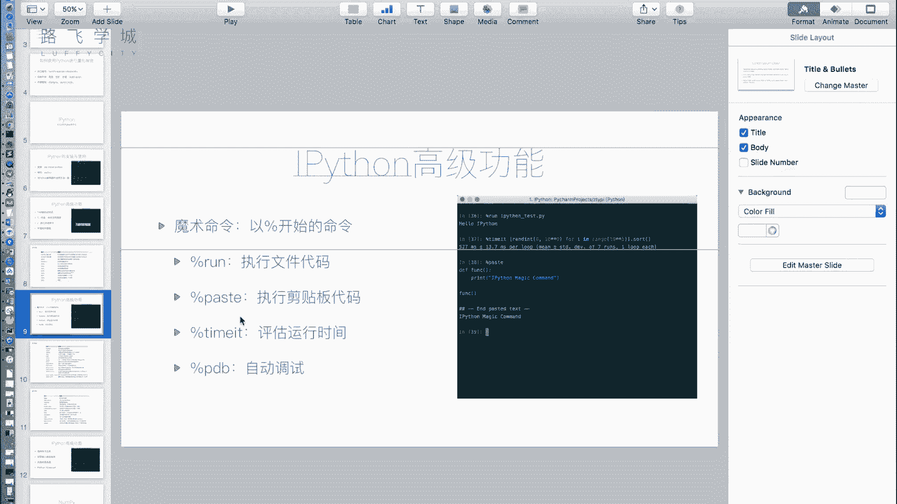

你可以自动找到错误的，嗯嗯好，不用的时候你就设置成off好就可以关掉了，那这个时候你如果再哎，能再把这个代码复制过来的话，off状态就没什么，他就直接报错了，就直接报错了，对就不会让你撤到哪啊。

这是这个PDB命令。

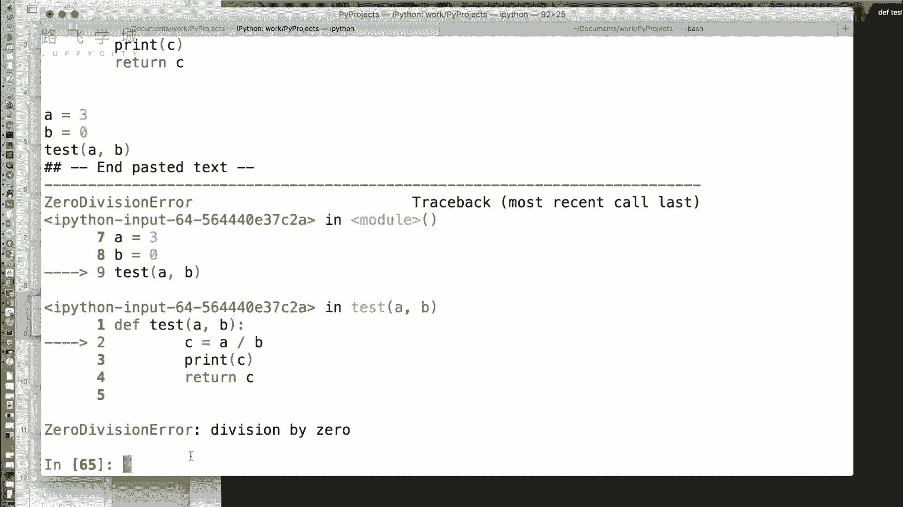

好看。

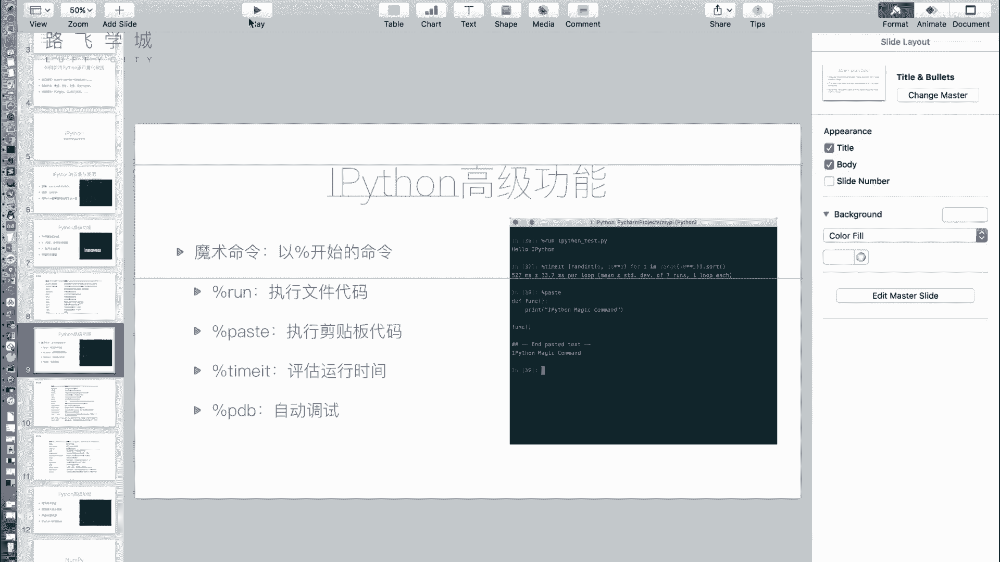

好那接下来这两页给大家提供了，这是啊IPAD常用的一些魔术命令啊，有一些东西不太常用，没有讲到啊，然后这是我们的p dB的一些常见的，就是p dB调试器常用的命令啊。

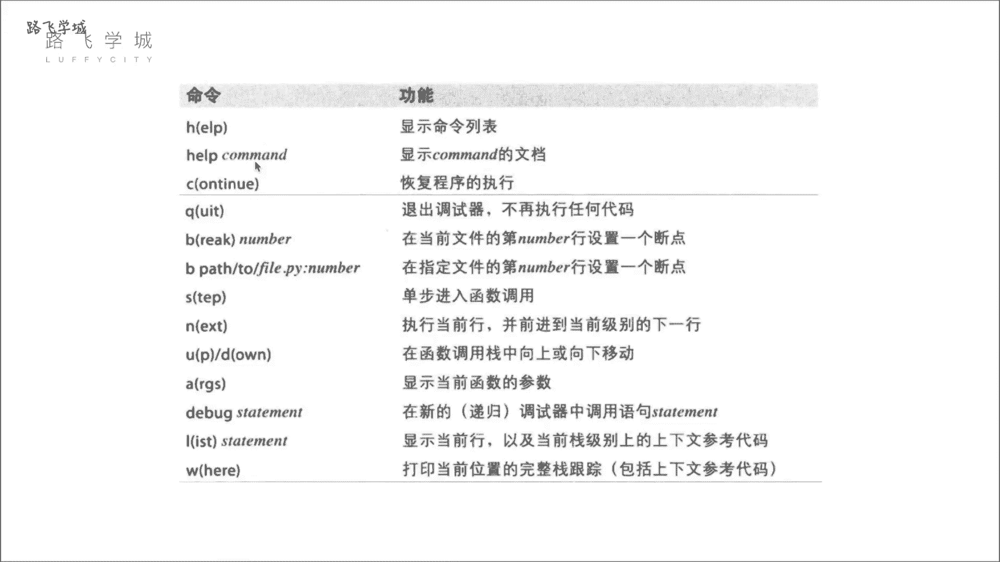

可以相当于是命令行时进行调试模式好，那还有几个高级功能。

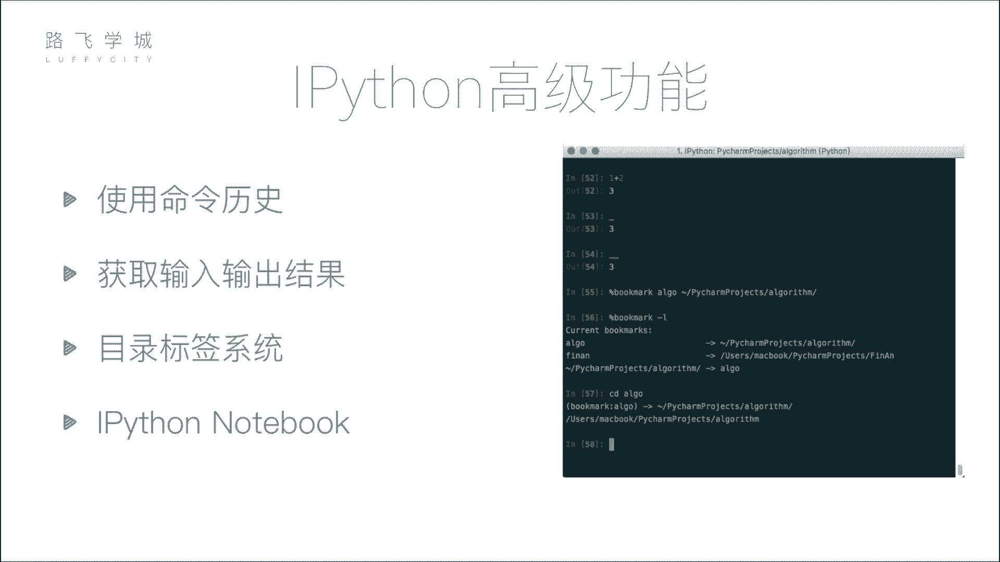

第一个使用命令历史啊，就是大家用这个用LINUX的这个命令行，很就是很常用的操作，就是上箭头，他会获取什么，他就会命令上一个命令是一个命令，找我们可以看到这也是这也是一样的，上箭头就是这样。

那还有一个比如说什么呢，啊看来试试着写一个啊，A等于一二，B等于二，比如说我就这两行代码，那我想啊我可能写了好多行代码，我想去获取上一行是A开头的来着嗯，那我就在这输入一个A然后按上。

这个时候它会出现什么，它会出现那种一点哦，库还能搜索，对你如果在这蒙不是A加BA乘B啊，A这个我们输入一个A星号，那它上面出现的是A星星B，然后就是A星B，然后就没了空等上，于是你给定前面几个字。

它可以搜索部分的进行搜索，够够用啊，这是这个叫做使用命令历史，然后下一个它可以获取输入输出结果，这个什么意思呢，啊我们之前用Python命令行的时候，会遇到这么一个问题，比如说我想算一加啊啊啊A加B吧。

比如说有了A等于一，B等于二，就有了好，我们想算A加B，如果我给它复制一个C，那这个A加B的结果，是不会在明面上里被打印出来的，耶耶如果我不复制C，它是会被打印出来的，但是不会保存结果，会保存结果。

那这个时候我就很纠结，一方面我又想把它存起来，后边接着算对吧，一方面我又想看一下值，你如果看我C等于A加B，它还是不会打印啊，我还得print c，我要多打好几个字符，我懒对对。

那i Python里我们可以这样啊，A加B哎，我就是不保存三，我们可以看到是三，那用的时候怎么用啊，一个下划线啊，一个下划线表示他上一行的输出，就直接可以获得了，看表这个在PN里也可以。

Python脚本其实也可以，这个可以吗，我们来测试一下，应该是可以，我记得我没我我记得我试过哎，哎还真是对，他俩就不行了，他俩相乘了，哎牛逼，你看我来一个啊，A加B等于三，A乘B等于二，我想要3×2。

我怎么办，俩下划线乘以一个下划线，三乘哦，没有人这么干，下划线是上一个变量，两个下划线就是上两个的变量，虽然可以，但没人这么干，我还有三个行行行可以可以，那比如说我想获取哎，比如说我想获取69行。

这个变量A乘乘B的这个这个结果，那怎么办，写69，写69，69，星星69，星星66也不对，下划线啊，酷滚下线，good啊，还是有点用的，还是有点用的啊，对有的时候你真的是没存下来，当时就想看一下结果。

但是你后边想要用它了啊，就可以用一下，这嘿嘿嘿，还有我还没说完呢，啊还有一个我如果我想拿输入啊，我刚才讲的都是拿输出对吧，忘拿输入的，我还拿这个A加B嗯，就是下划线啊，I72啊，加个I对。

加个i input嘛，那怎么是拿下A加B的这个字串，拿个字符串，因为他拿的是输入嘛，嗯可以获取输入，但是输入不太常用啊，对啊，就打印字符串。

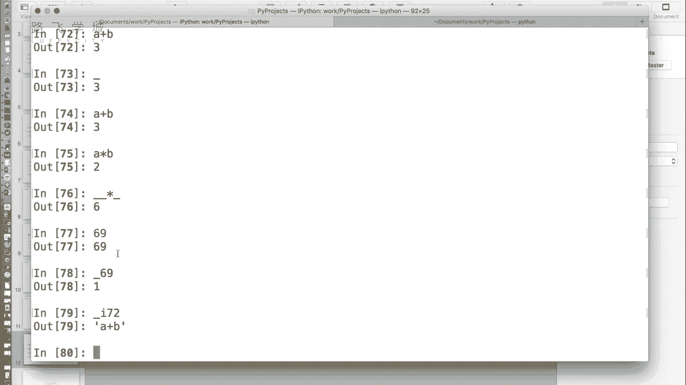

就是你拿的这个代码好不好。

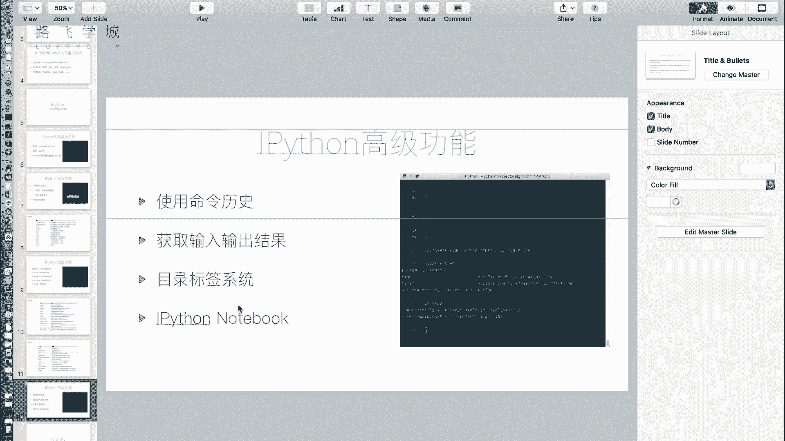

那接下来还有一个叫做目录标签系统，对应的就是另一个魔术命令叫bookmark啊，这个命令涉及到什么呢，大家写代码可能会出现的几个项目来回转，或者是几个几个目录来回跳，嗯哼对，那你mo来回跳。

你要用CD要一直记面的复杂不可大，太费劲不费劲费劲，我觉得费劲，那book克man给我们提供了一个叫啥，就是啊快捷的目录跳转，比如说啊当检测军把常用的目录存下来存储，对对标签对我们可以看一下。

比如说当前的这个目录我的存在啊，嗯COOKMARK它百分号bookmark嗯，然后加一个你常见的命令，比如说我就是PLOG好吧，表示哎好，然后第三个第二个参数是你这个目录目录回撤。

然后你能查看我有所有的bookmark吗，book max死了，这个问题问得好啊，杠L命令，然后底下这就book Mark plg，就跳到那工作了，比如说我在我我我给两个吧，嗯home啊。

我设置成这个好吧，我们自己的这个就是加目录好，那么用的时候怎么办，直接CD home，k d pro对，那就可以直接进行切换啊，那bookmark l，可以查看当前所有的你的bookmark。

然后bookmark d可以删除掉某一个，比如删除home嗯啊这个时候就没有了，然后bookmark r是删除所有的东西，嗯啊这是不可Mark，但是除此之外还有一个最后一个啊，也是做科学计算方面的人。

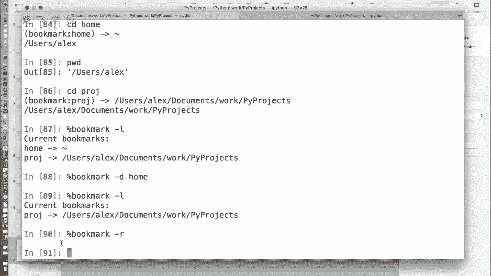

用的比较多的一个叫做note Python notebook，Ipaython notebook。

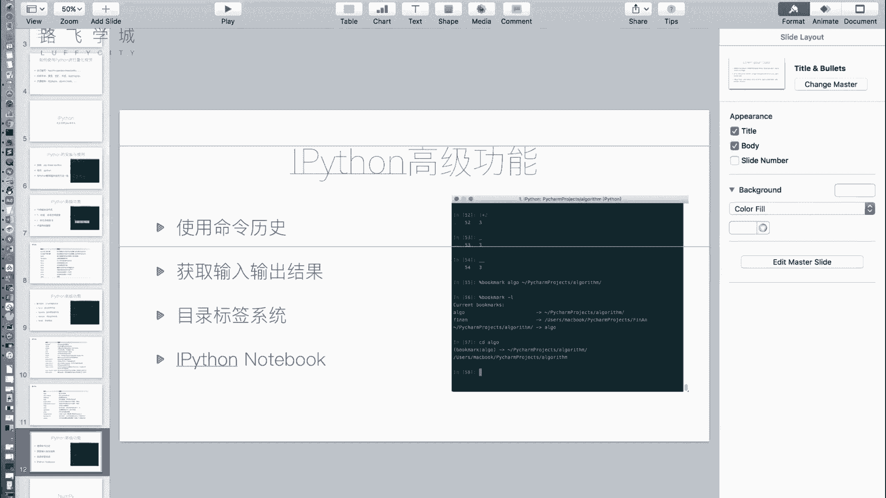

嗯啊那用这个功能，我们需要下一个模块，再往下需要装一个叫做他不善意，知道呗，Chiter jujupiter，JUPITER啊，就是这个模块就是它是开发对。

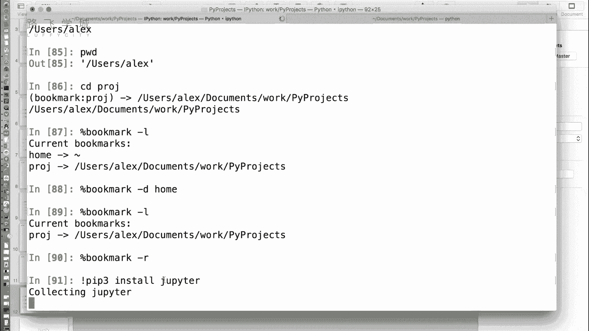

他是开发IPAD的这个机构好啊。

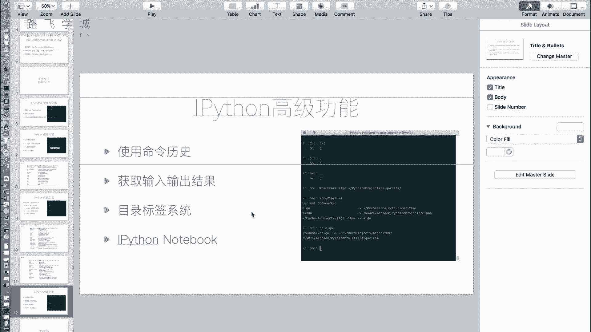

这个模块就叫它啊，接下来就是尴尬的，等的时间是很快吗，不够快，这个模块也挺大的，操so我总结我先总结，那i Python，其实就是一个为懒人开发的一个Python交互器是吧，我们这种情怀人不用这个东西。

普通写的，你发现了没有，就是因为我之前在金融公司，我发现好多做金融的就喜欢用这个做科都选WIFI，但是平常写代码的程序员就对，你如果开发网站比外边这种做法不太对，就是一些做成，比如说我后边会讲。

我为啥要讲这个，因为我咱们后边一些都是可能是诶，只看一个函数，有的时候你就是数据拿过来，我调一个函数看看结果，然后再调一个函数再看看结果，主要他是这种一步一步的，相当于其实是代码，不是替你做编程。

是看看相当于做了一个计算机，高级计算器怎么用，那这个用户用的比较多，NC他好像还有一个web页面版是吧，就是这个哦哦哦就是装这个，他之前看那些搞金融的同事们经常用这东西，然后我心想这玩意有什么意思。

就有了个高压题，对，用熟了挺好的，这个巴掌好好大呀，好我们的这个TRIPOR已经安装完了，那运行的时候啊，我们要回到系统命令行输入TRIPOR，好，它会给我们自动在浏览器上打开一个这个页面。

可以看到这个页面就是一个文件管理器啊，这里边是当前的目录，当前目录的一些文件啊，那我们可以再创建一个新的notebook啊，Python notebook我们可以看到。

这相当于就是一个web版的IPAD，你可以在里面输入一些，语句啊，然后点run啊，就可以给你有运行结果出来嗯，嗯co啊，我觉得这个可以大家当一个博客来做啊，它不光支持Python。

你还可以把这换成markdown啊，那写这个干嘛呀，用markdown干嘛呀，你可以拿它来写博客呀，它可以保存成PDF，保存成HML都可以啊，你运行一下，那就对哦，哦就是你可以代码。

但是你平常写博客的话，你不会有代码的结果啊，而且我们说这个notebook为啥好用，因为就是IPAD这一套他们是成体系的啊，到后边会给大家讲，我这提前写了一个啊，给大家讲这个我们的pandas模块。

我们的number pm块的Macbook lamb嗯，看运行出来打印的效果其实挺好看的啊，也包括MATPLAB1些图可以直接打印在这，这是运行之后的结果啊。

这是他的那个data frame空都会打印在这儿吧，相当于是一个外国版的代码展示器，嗯啊然后你可以把它保存啊，保存成这个，保存成看可以保存成Python文件，HML等等都可以。

PDF常见的一些都是可以的，这好。

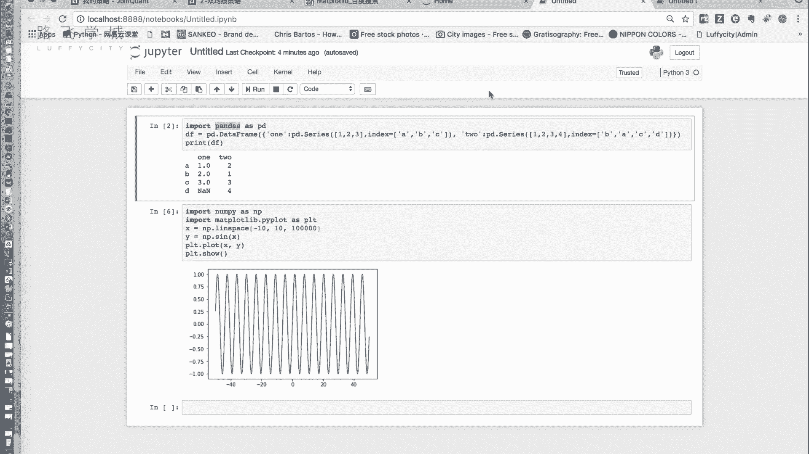

啊到此为止，我们的IPAD就是一个小的这个啊。

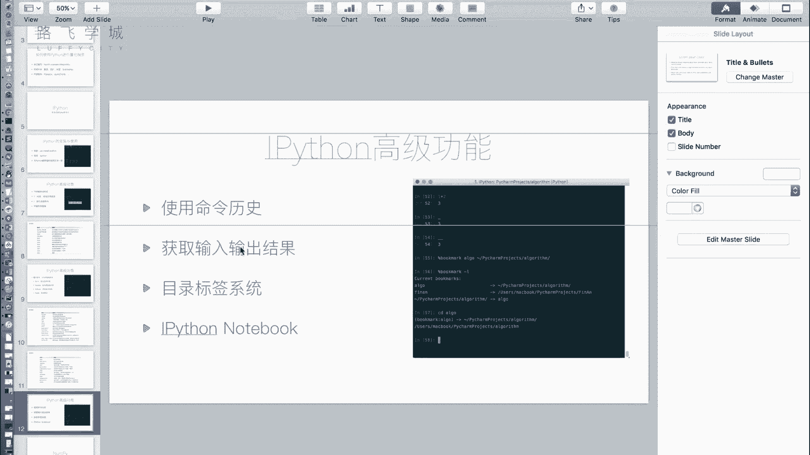

升级版的解释器就讲解完了。

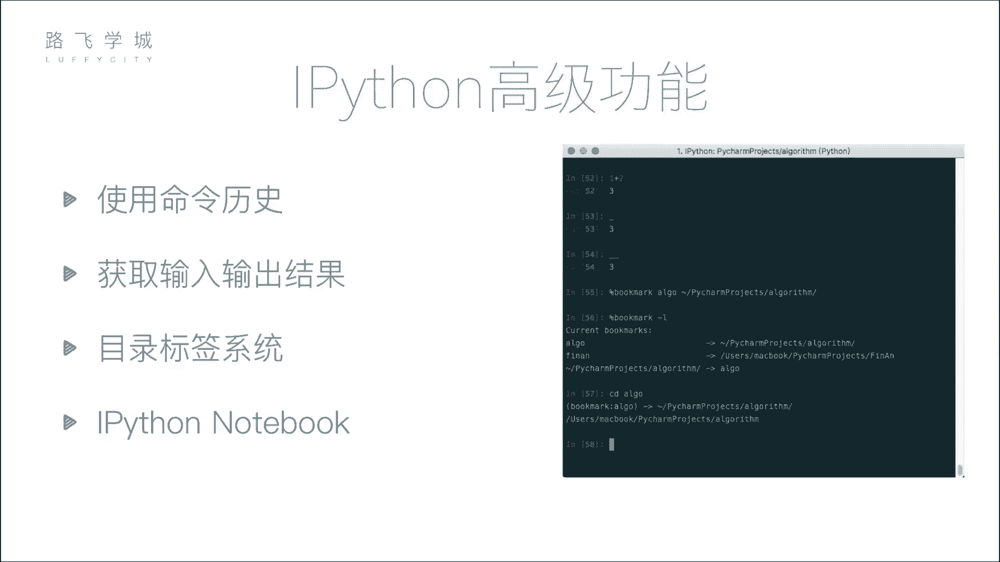

